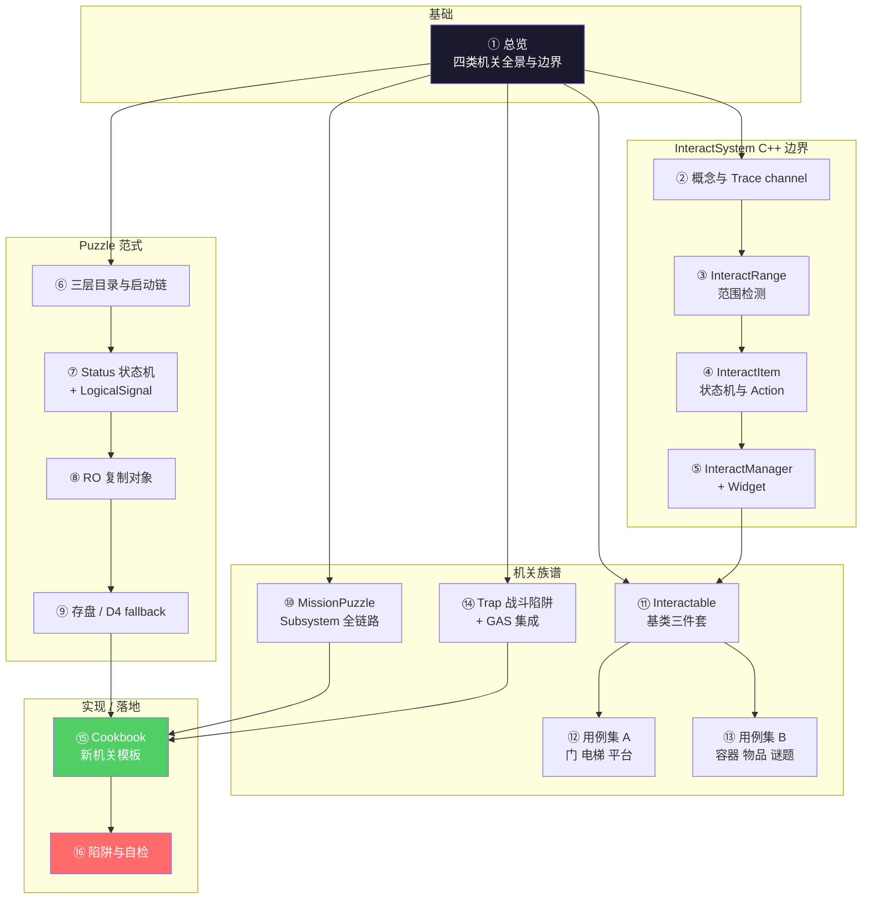
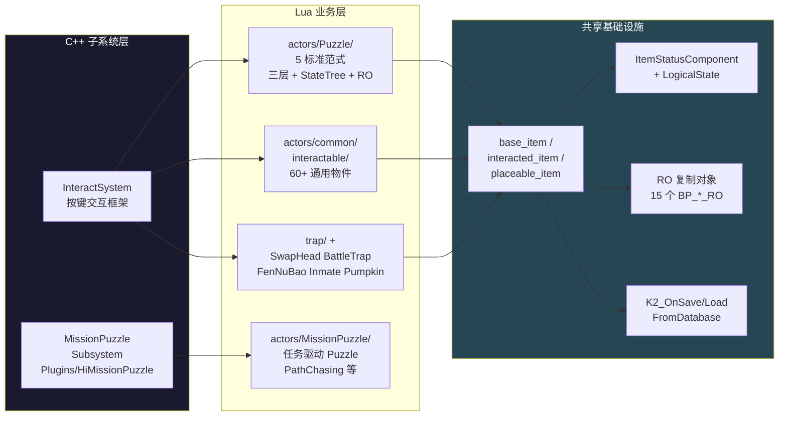

# HiGame 机关系统 — 总览

> 本 wiki 为 **AI 编程助手**（Claude / CodeBuddy / Cursor）与新加入的玩法工程师准备，把 HiGame 项目（UE5.5.4 + UnLua + DDS）"机关 / 解谜 / 可交互物件 / 战斗陷阱"的全部技术细节压缩成 16 页有图、有代码、可执行的指南。读者读完后，应当能在没有人指导的情况下产出一个符合项目规范的新机关 Actor（含 Server / Client / Common 三层、状态机、RO 复制、存盘恢复、与 Mission/Puzzle/UI 联动）。
>
> **研究方法**：本项目以**本地代码考古**替代 km-websearch 的 web fetch，信息来源为 P4 工作区的项目代码、引擎插件头文件、DDS 框架。所有 API 名 / 字段名 / 路径均经实际代码验证。

## 知识地图

写一个新机关时，推荐顺序：**① → ⑥ → ⑦ → ⑨ → ⑪ → ⑮**。
排错或优化时：⑯ → ⑦ → ⑧ → ⑨ → ⑩。

## 项目最关键的几条事实

1. **"机关"在代码里至少有四种血脉**，不要混淆——
   - `Content/Script/{S,C,Common}Script/actors/Puzzle/` —— 5 个标准范式机关（DancingSofa/DouDing/GhostMechanism/HeadEye/SurveillanceBird）
   - `Plugins/HiMissionPuzzle/` + `actors/MissionPuzzle/` —— 任务驱动子系统
   - `actors/common/interactable/` —— 60+ 通用可交互物件
   - `actors/common/trap/` + interactable 内的 SwapHead/FenNuBao —— 战斗陷阱

2. **InteractSystem 是底层框架，不是机关本身**。挂 `UInteractItemComponent` 让物件可交互；`UInteractManagerComponent` 管理本地客户端焦点切换；服务端逻辑必须走 GAS 或 RPC。

3. **Puzzle 标准范式 = 三层 lua 文件 + ItemStatusComponent + 可选 StateTree**。`ServerScript / ClientScript` 都 extends `CommonScript` 同名类。Common 层放"两端必须同步执行"的逻辑。

4. **bNewStatusFW = true 走新框架**：`ULogicalStateComponent` + `BP_LogicalSignalGenerator/Receiver`（来自外挂插件 `Plugins/LogicalChains/`）。**bNewStatusFW = false 走旧框架**：`ItemStatusComponent.StatusFlowRaw` + Multicast RPC。新写的机关用新框架；historical Actor 仍是旧框架。

5. **RO ≠ UE Replication**。RO 是 UObject (`URO_*`)，由 `MutableActorSubsystem.GetRO(ActorID)` 注册；DDS 跨 Server 用它做"轻量逻辑实例 + ghost-real 漫游"，Actor 只是表现层代理。

6. **MissionPuzzle 是独立插件 `Plugins/HiMissionPuzzle/`**，不是 `Source/HiGame/`。Subsystem 是 `UWorldSubsystem`（NOT GameInstanceSubsystem），Component 挂在 `APlayerState`。

7. **存盘归一化原则**：过渡态在 Save 前必须归一到稳定终态（Complete → Destroy）。Load 走 Multicast 重广播 + bForce=true 绕过 SetCurrentState 同值去重。

8. **D4 fallback (FALLBACK_DELAY = 0.5)**：Server 端 0.5s 超时兜底 `ChangeStatue_Server(Appear)`，解决 Entity 加载链路掉线 / Developers 测试地图无 Entity 的场景。

9. **GAS 触发方式有三种**：`AddBuffByID` 配置驱动 / `MakeOutgoingSpec + SetByCaller` 携带数值 / `SendMessage("HandleHitEvent")` 击飞。陷阱**不**直接走 EGASAbilityInputID（那 8 项是玩家主动输入）。

10. **bAutoRegister 绝不能关**——关掉会破坏 UActorComponent 生命周期契约，导致 OnRegister 不跑、ASC 未初始化、Client-predicted hit 解引用 nullptr 崩溃。如需运行时禁用 ASC，用 `K2_DestroyComponent`（纯本地操作不走 Replication）。

## 四类机关全景

## 页面目录

### 基础
- [① 总览 — 机关全景与边界](wiki/01-overview.md)（本页）

### InteractSystem C++ 边界
- [② InteractSystem 概念与 Trace channel](wiki/02-interactsystem-concepts.md) — 9 个头文件、整体流程、与 GAS/UI 边界
- [③ InteractRange — 范围检测](wiki/03-interact-range.md) — Sphere/Box、collision profile 隐式依赖
- [④ InteractItem — 状态机与 Action](wiki/04-interact-item.md) — 4 态状态机、7 种 Action、CDO 调用陷阱
- [⑤ InteractManager + Widget](wiki/05-interact-manager-widget.md) — 焦点 cos 算法、Widget 屏幕投影

### Puzzle 范式
- [⑥ Puzzle 三层目录与启动链](wiki/06-puzzle-three-layer.md) — Server/Client/Common 三套 + 继承链 + 职责矩阵
- [⑦ Status 状态机 + LogicalSignal](wiki/07-status-logical-signal.md) — 新旧分水岭、bAutoRegister 必须 true、suppress-restore 技巧
- [⑧ RO 复制对象与 Multicast 重广播](wiki/08-ro-replication.md) — RO vs UE Replication、Push Model 不标脏修法
- [⑨ 存盘 / 恢复 / D4 fallback](wiki/09-save-load-d4.md) — Complete→Destroy 归一化、bForce=true 重广播、0.5s 兜底

### 机关族谱
- [⑩ MissionPuzzle Subsystem 全链路](wiki/10-missionpuzzle-subsystem.md) — UWorldSubsystem、EntryID/PuzzleID、Reconnect 双通道、带外 RPC
- [⑪ Interactable 基类三件套](wiki/11-interactable-base.md) — base_item/interacted_item/placeable_item + base_ghost + ui_interact
- [⑫ 用例集 A — 门 / 电梯 / 平台](wiki/12-case-doors-elevators.md) — Door/MachineDoor/SealedDoor/elevator/BBLElevator/AccelerationRing
- [⑬ 用例集 B — 容器 / 物品 / 机械谜题](wiki/13-case-containers-items.md) — chest/bottle/note/Album/telephone/PumpkinGame/gravity/faithhourglass/dreamrebuild
- [⑭ Trap 战斗陷阱与 GAS 集成](wiki/14-trap-gas.md) — 三种 GAS 触发方式、PO Lifecycle、FenNuBao 范式

### 实现 / 落地
- [⑮ Cookbook — 新机关 / 新可交互物件模板](wiki/15-cookbook.md) — 5 步标准流程 + 4 套真实代码骨架
- [⑯ 陷阱与自检清单](wiki/16-pitfalls.md) — 16 类陷阱 + 14 项自检 + 性能项

## 关键问题覆盖范围

| 关键问题 | 由以下页面解答 |
|---|---|
| Q1 — 怎么让一个 Actor 可被 F 键交互？ | ②③④⑤ + ⑪ |
| Q2 — InteractSystem 的状态机怎么转？ | ④ |
| Q3 — Range collision 怎么注册？ | ③ |
| Q4 — 焦点是怎么算出来的？ | ⑤ |
| Q5 — Widget 怎么跟随物体？ | ⑤ |
| Q6 — 写一个标准机关需要哪些文件？ | ⑥⑮ |
| Q7 — Status 状态机怎么用？bNewStatusFW 是什么？ | ⑦ |
| Q8 — RO 是什么？为什么不直接用 UE Replication？ | ⑧ |
| Q9 — 存盘恢复怎么处理？D4 fallback 解决什么？ | ⑨ |
| Q10 — Mission 怎么驱动 Puzzle？怎么处理重连？ | ⑩ |
| Q11 — Interactable 三件套各自管什么？ | ⑪ |
| Q12 — 门 / 电梯 / 平台怎么写？ | ⑫ |
| Q13 — 容器 / 谜题 / 小游戏怎么写？ | ⑬ |
| Q14 — 战斗陷阱怎么走 GAS？ | ⑭ |
| Q15 — 新机关 Cookbook 完整流程？ | ⑮⑯ |

## 数据来源（本地 raw 笔记）

- [[higame-mechanism-interactsystem]] (#55) — InteractSystem C++ 模块 9 头文件
- [[higame-mechanism-interactable-base]] (#56) — 基类三件套 + 14+ 用例
- [[higame-mechanism-puzzle-pattern]] (#57) — Puzzle 5 标准范式 + StateTree + 平滑动力学
- [[higame-mechanism-missionpuzzle]] (#58) — MissionPuzzle Subsystem + Reconnect + 全链路
- [[higame-mechanism-trap-gas]] (#59) — Trap 三条血脉 + GAS 三种触发 + PO Lifecycle
- [[higame-mechanism-status-ro-database]] (#60) — Status 状态机 + RO + 存盘三横切

## 质量说明

- **总页面数**：16
- **总参考来源数**：6（全部为本地代码考古产物）
- **覆盖率**：15 / 15 关键问题全部覆盖
- **空白领域**：D4 fallback 的"D4"具体含义代码注释中未解释；C++ 端 RO 基类位于 DDS 框架插件外（HiGame Source 内未找到）；`IInteractLevelExecutorInterface` 当前未连线
- **最后更新**：2026-05-11
