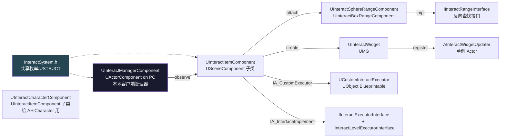
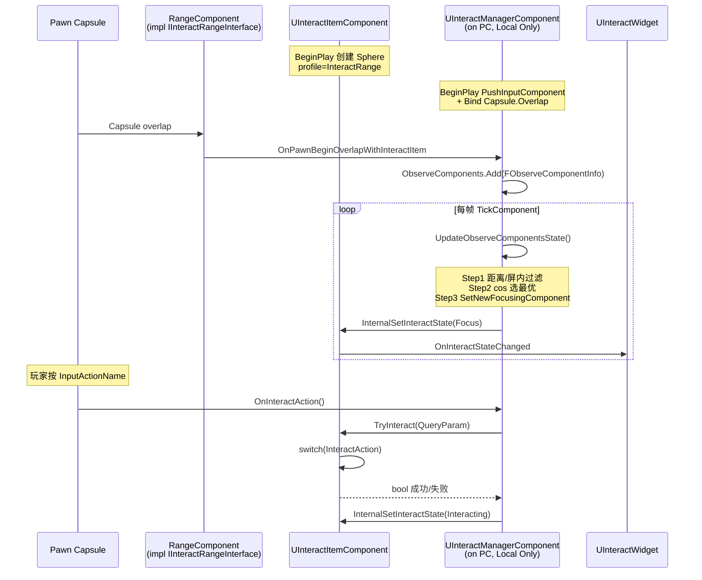
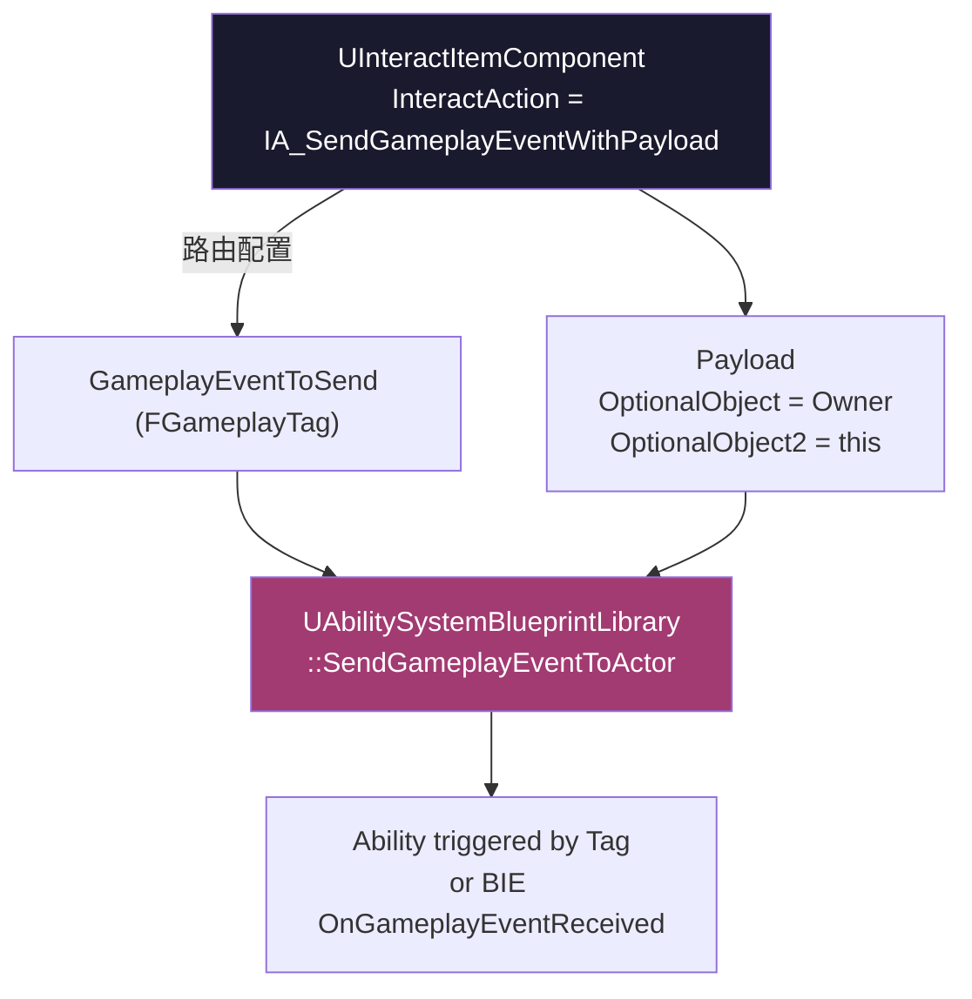

# ② InteractSystem 概念与 Trace channel

InteractSystem 是 HiGame 的**按键交互底层框架**，位于 `Source/HiGame/{Public,Private}/InteractSystem/`，9 个头文件 + 9 个 cpp。它**不是**机关本身，而是让一个 Actor 能被 F 键交互的支撑设施。所有 Puzzle、Interactable、Trap 间接或直接复用它。本页说清整体流程、关键枚举/结构体、与 GAS/UI/Mission 的边界。

## 模块文件清单



| 文件 | 一句话职责 |
|---|---|
| `InteractSystem.h` | 模块共享头：LogInteractSystem、TRACE_CHANNEL_INTERACT_FOCUS_TEST、`EInteractItemState` / `EInteractAction`、`FInteractQueryParam` / `FInteractInfo` |
| `InteractItemComponent.h/.cpp` | 可交互物件挂载点（USceneComponent 子类），状态机本体 |
| `InteractCharacterComponent.h/.cpp` | UInteractItemComponent 的子类，给 AHiCharacter 用（**当前实现里 FindInteractInfo 全注释，是死的**） |
| `InteractRangeInterface.h/.cpp` | IInteractRangeInterface：把 PrimitiveComponent 反向关联到 InteractItemComponent |
| `InteractRangeComponent.h/.cpp` | UInteractSphereRangeComponent / UInteractBoxRangeComponent（**没有 Capsule**） |
| `InteractManagerComponent.h/.cpp` | 挂在 AHiPlayerController 上的本地客户端管理器 |
| `InteractWidget.h/.cpp` | 跟随世界坐标的 UMG，订阅 OnInteractActionDelayTime |
| `InteractWidgetUpdater.h/.cpp` | 单例 Actor (`PerModuleDataObjects`)，TG_PostUpdateWork Tick 中刷新所有 Widget |
| `CustomInteractExecutor.h/.cpp` | UObject Blueprintable 基类，IA_CustomExecutor 路径用 |
| `UInteractExecutorInterface.h/.cpp` | IInteractExecutorInterface（4 个 BlueprintNativeEvent）+ IInteractLevelExecutorInterface（**当前未连线**） |

## 整体交互流程



## 核心枚举与 USTRUCT

### EInteractItemState（4 态）

```cpp
UENUM(BlueprintType)
enum class EInteractItemState : uint8
{
    IIS_None        = 0,
    IIS_Prompt      = 1,
    IIS_Focus       = 2,
    IIS_Interacting = 3,
};
```

切换入口**唯一**：`UInteractItemComponent::InternalSetInteractState(NewState)`（InteractItemComponent.cpp:119-157）。详见 [④ InteractItem](04-interact-item.md)。

### EInteractAction（7 值，3 个未实现）

```cpp
UENUM(BlueprintType)
enum class EInteractAction : uint8
{
    IA_None = 0,
    IA_SetLocoState = 1,                 // ⚠ switch 无 case
    IA_ActivateAbility = 2,              // ⚠ switch 无 case
    IA_SendGameplayEventWithPayload = 3, // ✅
    IA_InterfaceImplement = 4,           // ✅
    IA_InactToSublevelEvent = 5,         // ⚠ switch 无 case
    IA_CustomExecutor = 99,              // ✅ CDO 调用
};
```

| 值 | 名 | 行为 | 实现 |
|---|---|---|---|
| 0 | IA_None | TryInteract 返回 false | ✅ |
| 1 | IA_SetLocoState | 给 Pawn 设 LocomotionState | **❌ switch 无 case** |
| 2 | IA_ActivateAbility | TryActivateAbilityByClass | **❌ switch 无 case** |
| 3 | IA_SendGameplayEventWithPayload | `SendGameplayEventToActor`，Payload.OptionalObject=Owner，OptionalObject2=this | ✅ |
| 4 | IA_InterfaceImplement | Owner 实现 `UInteractExecutorInterface` | ✅ |
| 5 | IA_InactToSublevelEvent | 关卡子关卡事件 | **❌ 未实现** |
| 99 | IA_CustomExecutor | CDO 调 `CustomInteractExecutorClass.TryInteract` | ✅ |

**陷阱**：蓝图里看到 IA_SetLocoState/IA_ActivateAbility/IA_InactToSublevelEvent 选项亮着，配置后**按 F 没反应**。要走 GAS 必须用 IA_SendGameplayEventWithPayload + Ability Trigger 配置间接达成。

### FInteractQueryParam / FInteractInfo

```cpp
USTRUCT(BlueprintType)
struct FInteractQueryParam {
    UPROPERTY(BlueprintReadWrite)
    TObjectPtr<APawn> InitiatePawn = 0;
};

USTRUCT(BlueprintType)
struct FInteractInfo {
    UPROPERTY(BlueprintReadWrite) int32 Type = 0;
    UPROPERTY(BlueprintReadWrite) float Range = 0.0f;
    UPROPERTY(BlueprintReadWrite) bool AutoInteract = false;
};
```

`FInteractInfo` 在本模块**仅以局部变量出现 1 次，且周边 FindInteractInfo 调用全部被 `/* */` 注释**——预留未生效。建议查 Lua 侧 / `OasisCharacterBase`。

## 与 GAS / UI / Mission 的耦合



- **GAS**：仅 `IA_SendGameplayEventWithPayload` 真路由到 GAS。`IA_ActivateAbility` 字段存在但 switch 无 case，**未实现**
- **UI**：通过 `InteractWidgetClass` UPROPERTY；状态广播链 `Item.OnInteractStateChanged → Widget.OnInteractStateChanged → K2_OnInteractStateChanged`
- **Mission**：本模块**没有**直接调用 MissionPuzzle / Subsystem；Mission 侧通过订阅 GameplayEvent Tag

## TRACE_CHANNEL_INTERACT_FOCUS_TEST

```cpp
#define TRACE_CHANNEL_INTERACT_FOCUS_TEST ECollisionChannel::ECC_GameTraceChannel5
```

**这个宏定义但全模块零引用**。整个交互依赖的是 **Capsule overlap**（玩家胶囊体与 RangeComponent 的物理重叠），不是 LineTrace。误以为要"配交互 trace channel"是常见误区。

DefaultEngine.ini:222 上 `GameTraceChannel5` 的实际名字是 **`SkillDamaged`**，不是 Interaction 类——这是受击通道，被 Puzzle 机关用于命中检测（详见 [⑥ Puzzle 三层](06-puzzle-three-layer.md) 的 HandleItemCharacterHitEvent 链）。

## Server / Client / Standalone 行为差异

| 组件 | Client | Server | 说明 |
|---|:---:|:---:|---|
| UInteractManagerComponent | ✅ Local | ❌ | `BeginPlay` 显式 `if (OwnerController->IsLocalController())` 包住 |
| UInteractItemComponent | ✅ | ✅ | 不区分；Widget 创建用 `GetFirstPlayerController()`，DS 上为 nullptr 时跳过 |
| UInteractWidget | ✅ Only | ❌ | UMG，必须本地 |
| AInteractWidgetUpdater | ✅ Only | ❌ | World->IsGameWorld() 守卫 |
| `IA_SendGameplayEventWithPayload` | 客户端调用 | 通过 GAS 复制到服务器 | 取决于 GA 的 NetExecutionPolicy |

## 与 Lua 的边界

InteractSystem 全部是 C++ 类，但暴露给 Lua / Blueprint 的 API 通过：
- `OnInteractStateChanged` BlueprintAssignable —— 状态变化 delegate
- `OnInteractActionDelayTime / Success` BlueprintAssignable —— Delay 模式进度
- `K2_OnInteractStateChanged` BlueprintImplementableEvent —— Widget 状态切换
- `IInteractExecutorInterface` 4 个 BlueprintNativeEvent

Lua 侧典型用法：在 `interacted_item.lua` 中订阅 `QuerySystem.OnQueryActionStartDetected`（注意：QuerySystem 是平行链路，不在 InteractSystem 内，是 Client-only 的视锥+距离筛选系统）；在子类业务里 override `DoServerInteractAction / DoClientInteractAction` 走 InteractedItemComponent。

详见 [⑪ Interactable 基类](11-interactable-base.md)。

## 常见陷阱（对应清单）

1. **TRACE_CHANNEL 宏全模块零引用** —— 整个交互靠 Capsule overlap
2. **`InteractRange` collision profile 隐式依赖** —— DefaultEngine.ini 中**未定义**，详见 [③ InteractRange](03-interact-range.md)
3. **IA_SetLocoState / IA_ActivateAbility / IA_InactToSublevelEvent 未实现**
4. **Manager 仅本地客户端跑** —— 服务器逻辑必须走 GAS 或 RPC
5. **InteractCharacterComponent 当前是死的** —— `UpdateFocusRange()` 核心代码全注释

## 关键代码位置

- `InteractSystem.h:6-66` — 枚举/USTRUCT 集中
- `InteractItemComponent.cpp:119-157` — InternalSetInteractState
- `InteractItemComponent.cpp:170-228` — TryInteract switch
- `InteractManagerComponent.cpp:135-166` — Manager BeginPlay + IsLocalController gating
- `Config/DefaultEngine.ini:179-264` — Collision Profiles（GameTraceChannel5=SkillDamaged，**无 InteractRange profile**）

下一章：[③ InteractRange — 范围检测](03-interact-range.md)
