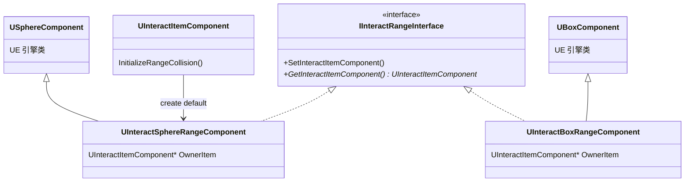
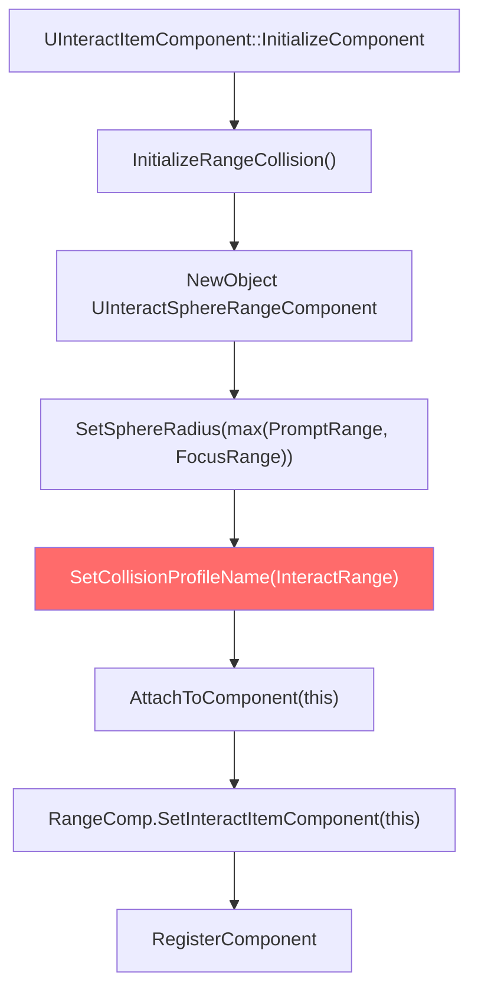
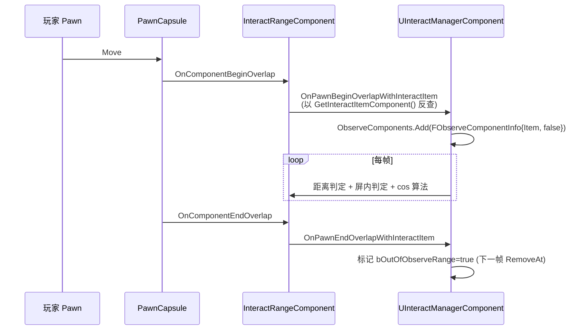

# ③ InteractRange — 范围检测

InteractRange 是物件与玩家"是否进入交互可达半径"的物理实体。它**不做 LineTrace**，而是用 PrimitiveComponent overlap 与玩家胶囊体直接判定。本页讲清两种 RangeComponent、IInteractRangeInterface 反向查找契约、collision profile 隐式依赖、以及"为什么没有 Capsule Range"。

## 类层次



**两种实现 + 一个反向接口**。**没有 Capsule Range**——要用胶囊体得自己写一个继承 `UCapsuleComponent` 并实现 `IInteractRangeInterface`。

## IInteractRangeInterface 契约

```cpp
class HIGAME_API IInteractRangeInterface
{
    GENERATED_BODY()
public:
    virtual void SetInteractItemComponent(UInteractItemComponent* Comp) = 0;
    virtual UInteractItemComponent* GetInteractItemComponent() const = 0;
};
```

**契约动机**：当玩家 Pawn 的 Capsule 与某个 RangeComponent overlap 时，Manager 收到的是 `UPrimitiveComponent*`。Manager 需要"反查"这个 Component 属于哪个 InteractItemComponent，才能加入 Observe 列表。接口只两个方法、纯反向查找，让 Sphere/Box（甚至自定义 Capsule）走同一条注册路径。

## 默认 Range 注册流程



子类可 override `InitializeRangeCollision()` 换成 Box 或自定义。

## ⚠ Collision Profile 隐式依赖

`SetCollisionProfileName("InteractRange")` 默认创建出来用的 profile 名是 `InteractRange`，**但 DefaultEngine.ini 中未找到该 profile 定义**：

```
$ grep "InteractRange" Projects/HiGame/Config/DefaultEngine.ini
(no results)
```

意味着如果项目没人补这个 profile，Sphere 用引擎 fallback（`Collision_Default`），可能**根本不与 Pawn Capsule overlap**，导致 Item 永远进不了 Observe 列表 —— 物件配了 InteractItemComponent 但按 F 没反应的常见根因。

**解决方法**：在项目 `Config/DefaultEngine.ini` 的 `[/Script/Engine.CollisionProfile]` 段补一个 InteractRange profile：

```ini
+Profiles=(Name="InteractRange",CollisionEnabled=QueryOnly,
    bCanModify=False,ObjectTypeName="WorldDynamic",
    CustomResponses=((Channel="Pawn",Response=ECR_Overlap)),
    HelpMessage="Interact range trigger overlap")
```

## RangeComponent 关键属性

### UInteractSphereRangeComponent

继承 `USphereComponent`，仅添加 `OwnerItem` 字段 + 实现接口。Sphere 半径在 `InitializeRangeCollision` 时被默认设为 `max(PromptRange, FocusRange)`（Item 的两个范围中取最大）。

**为什么是 max(Prompt, Focus)**：Sphere 是粗筛，让玩家进入 PromptRange 时就能被 Manager 观测到（IIS_Prompt）；进一步靠近到 FocusRange 时，Manager 用 ObserveComponents 内的距离判定切到 IIS_Focus。

### UInteractBoxRangeComponent

继承 `UBoxComponent`，相同模式。Box 用于"长方形区域"（如门口、电梯口）—— Sphere 不太适合的细长形状。

## 与 Manager Tick 的连接



**`bOutOfObserveRange` 延迟一帧**：EndOverlap 只 mark，下一 Tick `UpdateObserveComponentsState` 才 RemoveAt 并设 IIS_None。需要立刻清的场景要 `ForceRefreshObserveComponents`。

## 写一个 Custom Capsule Range（指南）

如果你需要胶囊体范围（比如直立柱状物体）：

```cpp
// Public/Game/MyInteractCapsuleRangeComponent.h
#pragma once
#include "CoreMinimal.h"
#include "Components/CapsuleComponent.h"
#include "InteractSystem/InteractRangeInterface.h"
#include "MyInteractCapsuleRangeComponent.generated.h"

UCLASS(ClassGroup=(Custom), meta=(BlueprintSpawnableComponent))
class MYGAME_API UMyInteractCapsuleRangeComponent
    : public UCapsuleComponent
    , public IInteractRangeInterface
{
    GENERATED_BODY()
public:
    virtual void SetInteractItemComponent(UInteractItemComponent* InComp) override
    {
        InteractItemComponent = InComp;
    }
    virtual UInteractItemComponent* GetInteractItemComponent() const override
    {
        return InteractItemComponent;
    }
private:
    UPROPERTY()
    TObjectPtr<UInteractItemComponent> InteractItemComponent = nullptr;
};
```

然后在 Item 子类 override `InitializeRangeCollision`：

```cpp
void UMyItemComponent::InitializeRangeCollision()
{
    UMyInteractCapsuleRangeComponent* Capsule
        = NewObject<UMyInteractCapsuleRangeComponent>(GetOwner());
    Capsule->SetCapsuleHalfHeight(MaxRange);
    Capsule->SetCapsuleRadius(MaxRange * 0.5f);
    Capsule->SetCollisionProfileName(TEXT("InteractRange"));
    Capsule->AttachToComponent(this, FAttachmentTransformRules::KeepRelativeTransform);
    Capsule->SetInteractItemComponent(this);
    Capsule->RegisterComponent();
    RangeCollision = Capsule;
}
```

## 常见陷阱

1. **InteractRange profile 未定义** —— 上文已述
2. **bOutOfObserveRange 延迟一帧** —— 立即清需 ForceRefreshObserveComponents
3. **Item 的 RangeCollision 字段被外部覆盖** —— 不要在外部 `NewObject + Attach` 第二个 Range，会把内部 RangeCollision 字段悬空
4. **Sphere 半径必须包住 max(Prompt, Focus)** —— 否则物件离玩家在 Focus 范围内但 Sphere 没 overlap，永远不会被发现

## 关键代码位置

- `InteractRangeInterface.h:12-29` — IInteractRangeInterface 定义
- `InteractRangeComponent.h:16-53` — Sphere/Box Range Component
- `InteractItemComponent.cpp:107-117` — InitializeRangeCollision 默认实现
- `Config/DefaultEngine.ini:179-264` — Collision Profiles（**无 InteractRange profile**）

上一章：[② InteractSystem 概念](02-interactsystem-concepts.md) | 下一章：[④ InteractItem 状态机与 Action](04-interact-item.md)
