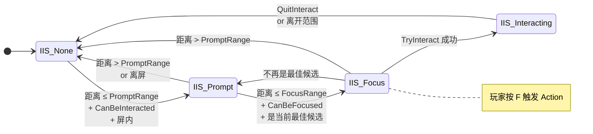
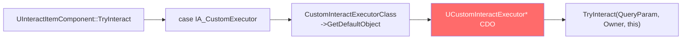
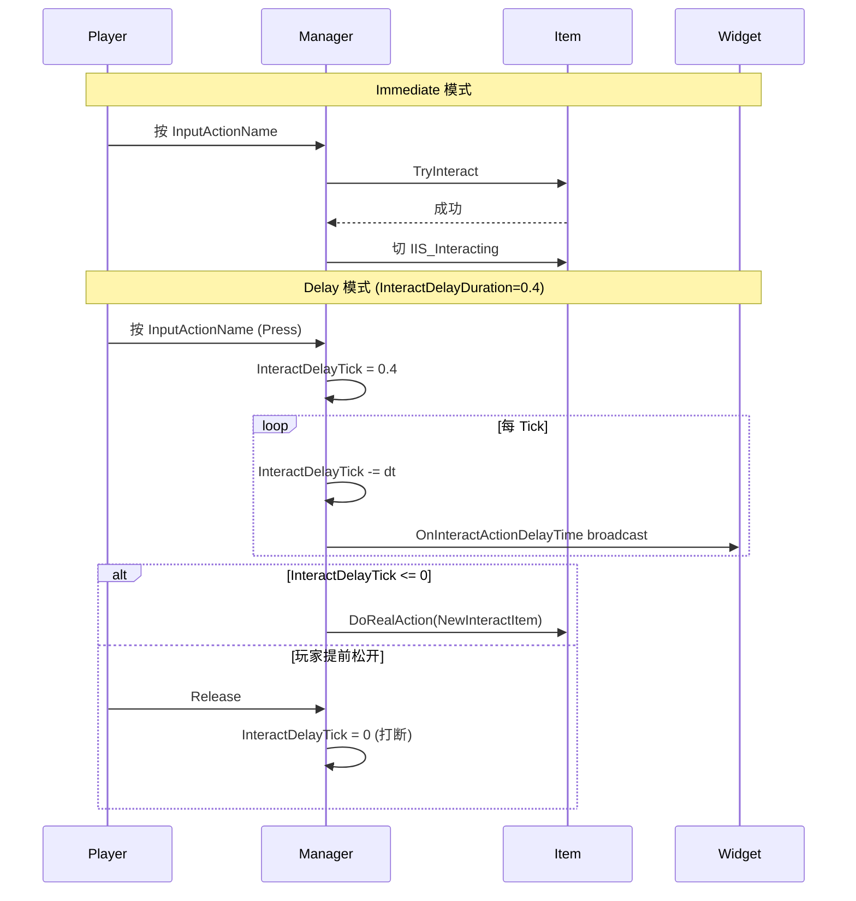

# ④ InteractItem — 物件状态机与 Action 类型

`UInteractItemComponent` 是被交互物件的核心组件，承载 4 态状态机 + 7 种 InteractAction 路由。它继承 `USceneComponent`，挂在物件 Actor 的某个具体位置（决定 Range Sphere 的中心和 Widget 锚点）。本页讲清状态机入口、Action switch 实现状态、CDO 调用陷阱、Delay 模式时序。

## 状态机



切换入口**唯一**：`UInteractItemComponent::InternalSetInteractState(NewState)`（cpp:119-157），会广播 `FOnInteractStateChanged OnInteractStateChanged` BlueprintAssignable delegate。

`IIS_Interacting → IIS_None` 时，若 InteractAction == `IA_InterfaceImplement`，会调用 `IInteractExecutorInterface::Execute_QuitInteract` 通知 Executor 收尾。

## 关键 UPROPERTY

```cpp
UCLASS()
class HIGAME_API UInteractItemComponent : public USceneComponent
{
    // Range
    UPROPERTY(EditAnywhere, BlueprintReadWrite, Category="Range")
    float PromptRange = 500.0f;
    UPROPERTY(EditAnywhere, BlueprintReadWrite, Category="Range")
    float FocusRange = 200.0f;
    UPROPERTY(EditAnywhere, BlueprintReadWrite, Category="Range")
    float ScreenMarginBias = 0.0f;

    // Input
    UPROPERTY(EditAnywhere, BlueprintReadWrite, Category="Input")
    FName InputActionName = TEXT("InteractAction1");

    // UI
    UPROPERTY(EditAnywhere, BlueprintReadWrite, Category="UI")
    TSubclassOf<UInteractWidget> InteractWidgetClass;

    // Action
    UPROPERTY(EditAnywhere, BlueprintReadWrite, Category="Action")
    EInteractAction InteractAction = EInteractAction::IA_None;

    UPROPERTY(EditAnywhere, BlueprintReadWrite, Category="Action",
        meta=(EditCondition="InteractAction==EInteractAction::IA_SetLocoState"))
    FGameplayTag LocoStateToSet;

    UPROPERTY(EditAnywhere, BlueprintReadWrite, Category="Action",
        meta=(EditCondition="InteractAction==EInteractAction::IA_ActivateAbility"))
    TSubclassOf<UGameplayAbility> AbilityClassToActivate;

    UPROPERTY(EditAnywhere, BlueprintReadWrite, Category="Action",
        meta=(EditCondition="InteractAction==EInteractAction::IA_SendGameplayEventWithPayload"))
    FGameplayTag GameplayEventToSend;

    UPROPERTY(EditAnywhere, BlueprintReadWrite, Category="Action",
        meta=(EditCondition="InteractAction==EInteractAction::IA_CustomExecutor"))
    TSubclassOf<UCustomInteractExecutor> CustomInteractExecutorClass;

    // ActionType
    UPROPERTY(EditAnywhere, BlueprintReadWrite, Category="Action")
    EInteractActionType InteractActionType = EInteractActionType::EIAT_Immediate;

    // State (运行时)
    UPROPERTY(VisibleInstanceOnly, BlueprintReadOnly)
    EInteractItemState InteractState;

    UPROPERTY(BlueprintAssignable)
    FOnInteractStateChanged OnInteractStateChanged;
};
```

`bCanEverTick = false`：Item **不在自身 Tick**，由 Manager 通过 `PassivelyTick(DeltaTime)` 推动。

## TryInteract switch（实现状态精准对照）

```cpp
// InteractItemComponent.cpp:170-228
bool UInteractItemComponent::TryInteract(FInteractQueryParam QueryParam)
{
    if (InteractState != EInteractItemState::IIS_Focus) return false;

    AActor* Owner = GetOwner();
    switch (InteractAction)
    {
    case EInteractAction::IA_None:
        return false;

    case EInteractAction::IA_SendGameplayEventWithPayload:
        {
            FGameplayEventData Payload;
            Payload.OptionalObject = Owner;
            Payload.OptionalObject2 = this;
            UAbilitySystemBlueprintLibrary::SendGameplayEventToActor(
                QueryParam.InitiatePawn, GameplayEventToSend, Payload);
            return true;
        }

    case EInteractAction::IA_CustomExecutor:
        {
            if (!CustomInteractExecutorClass) return false;
            UCustomInteractExecutor* Executor =
                CustomInteractExecutorClass->GetDefaultObject<UCustomInteractExecutor>();
            return Executor->TryInteract(QueryParam, Owner, this);
        }

    case EInteractAction::IA_InterfaceImplement:
        {
            if (!Owner->Implements<UInteractExecutorInterface>()) return false;
            return IInteractExecutorInterface::Execute_TryInteract(
                Owner, QueryParam, Owner, this);
        }

    // ⚠ 以下三个枚举值 switch 中没有 case：
    // IA_SetLocoState / IA_ActivateAbility / IA_InactToSublevelEvent
    default:
        return false;  // 落入这里
    }
}
```

**3 个未实现的 case 来源**：cpp 中曾存在 `UInteractCharacterComponent::TryInteractInternal` 实现，但**整段被 `/* */` 注释掉**（cpp:159-237）——历史代码迁移期遗留。

## IA_CustomExecutor = 99 路由



**注意**：是 **CDO 调用**，不是 NewObject。所以：

> Executor 不能持有运行期实例状态。蓝图里写成员变量保存"上一次交互的物体"等数据，会跨 Item 串味。

正确做法：只用入参 `InteractItem` / `InteractItemComponent` 拉数据。

## IA_InterfaceImplement 路由

```cpp
class HIGAME_API IInteractExecutorInterface
{
    GENERATED_BODY()
public:
    UFUNCTION(BlueprintNativeEvent, BlueprintCallable)
    bool CanBeInteracted(...);
    UFUNCTION(BlueprintNativeEvent, BlueprintCallable)
    bool CanBeFocused(...);
    UFUNCTION(BlueprintNativeEvent, BlueprintCallable)
    bool TryInteract(FInteractQueryParam QueryParam,
                     AActor* InteractActor,
                     UInteractItemComponent* InteractComp);
    UFUNCTION(BlueprintNativeEvent, BlueprintCallable)
    void QuitInteract(...);
};
```

让 Item Owner Actor 实现这个接口（蓝图勾上），InteractAction 选 `IA_InterfaceImplement`，Owner 类的 4 个事件就会被路由进去。

CanBeInteracted/Focused 的接口实现路径会**覆盖**默认实现：默认 `UInteractItemComponent::CanBeInteracted/CanBeFocused` 返回 true（cpp:66-105），但走接口模式时转到 Owner 实现。

## InteractActionType（Immediate vs Delay）

```cpp
UENUM()
enum class EInteractActionType : uint8 {
    EIAT_Immediate = 0,
    EIAT_Delay     = 1,
};
```



Delay 模式的进度通过 `OnInteractActionDelayTime(CurDelay, TotalDuration)` 广播给 Widget 渲染圆圈进度条。

## CanBeInteracted / CanBeFocused 默认行为

```cpp
bool UInteractItemComponent::CanBeInteracted_Implementation() const
{
    return true;  // 默认允许
}
bool UInteractItemComponent::CanBeFocused_Implementation() const
{
    return true;  // 默认允许
}
```

子类或走 `IA_InterfaceImplement` 时由 Owner 决定。常见用法：物件已被使用过 → return false；玩家不在战斗状态 → return false。

## 关键 BlueprintCallable / BlueprintNativeEvent

| 函数 | 修饰 | 说明 |
|---|---|---|
| `TryInteract(FInteractQueryParam)` | UFUNCTION | 状态机入口，Manager 调用 |
| `CanBeInteracted` / `CanBeFocused` | BlueprintNativeEvent | 子类/接口可 override |
| `QuitInteract` | UFUNCTION | 找 PC.InteractManager 的当前 InteractingActor 是不是自己 |
| `OnInteractStateChanged(Old, New)` | BlueprintAssignable | 状态切换 delegate |
| `InternalSetInteractState(NewState)` | UFUNCTION | 唯一切换入口 |
| `SetObserver(UInteractManagerComponent*)` | UFUNCTION | Manager 端调用注册 |
| `InitializeRangeCollision` | UFUNCTION (virtual) | 子类可 override 换 Box |

## 常见陷阱

1. **配 IA_SetLocoState/IA_ActivateAbility/IA_InactToSublevelEvent 后按 F 没反应** —— 上文已述
2. **CustomExecutor 写成员变量串味** —— 用 CDO 调用所以共享一个实例
3. **InternalSetInteractState 是唯一入口** —— 子类不要直接改 InteractState 字段
4. **TryInteract 返回 false 时 Manager 不切 Interacting** —— DoRealAction 中显式判断 (cpp:585-631)
5. **bCanEverTick = false 但 Manager 推 PassivelyTick** —— 不要重写 TickComponent，会重复执行
6. **多 Item 共享 InputActionName 的隐藏行为** —— SetNewFocusingComponent 切换时若 InputActionName 相同则不重新 Bind（性能优化）

## 关键代码位置

- `InteractItemComponent.h:24-127` — 类定义全表
- `InteractItemComponent.cpp:42-59` — BeginPlay 创建 Widget
- `InteractItemComponent.cpp:66-105` — CanBeInteracted/Focused 默认实现
- `InteractItemComponent.cpp:107-117` — InitializeRangeCollision
- `InteractItemComponent.cpp:119-157` — InternalSetInteractState
- `InteractItemComponent.cpp:170-228` — TryInteract switch
- `InteractItemComponent.cpp:230-243` — SetObserver
- `InteractCharacterComponent.cpp:159-237` — 注释掉的 IA_SetLocoState/ActivateAbility 历史实现

上一章：[③ InteractRange](03-interact-range.md) | 下一章：[⑤ InteractManager + Widget](05-interact-manager-widget.md)
