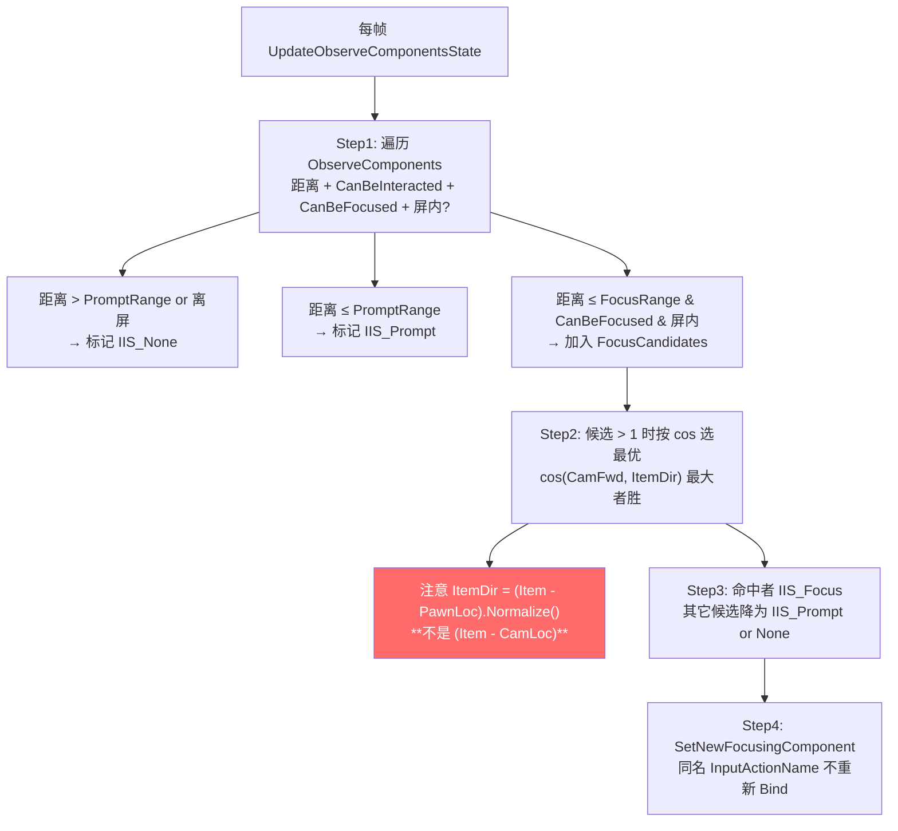
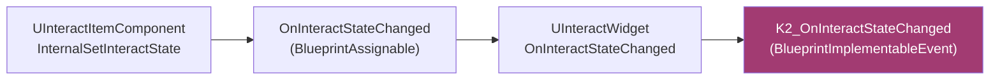

# ⑤ InteractManager + Widget

Manager 是本地客户端的"全局观察者"——挂在 `AHiPlayerController` 上，遍历视野内所有 Item 选最佳焦点；Widget 是跟随物件世界坐标的 UMG，由 Updater 单例每帧刷新屏幕坐标。本页讲清焦点 cos 算法、屏幕投影、双 Widget 重绑陷阱、Updater 单例。

## UInteractManagerComponent

### 挂载与守卫

```cpp
void UInteractManagerComponent::BeginPlay()
{
    Super::BeginPlay();
    AHiPlayerController* PC = Cast<AHiPlayerController>(GetOwner());
    check(PC);
    OwnerController = PC;

    if (!PC->IsLocalController()) return;  // ⚠ 仅本地客户端

    PushInputComponent();
    PC->OnPossessEvent.AddDynamic(this, &UInteractManagerComponent::OnPossess);
}
```

`if (OwnerController->IsLocalController()) return;` 一行守卫掉所有 DS 上的逻辑。**所有交互算法、焦点切换、输入绑定都在客户端跑**——服务端逻辑必须走 GAS（IA_SendGameplayEventWithPayload）或自定义 RPC。

### 数据结构

```cpp
USTRUCT()
struct FObserveComponentInfo
{
    UPROPERTY()
    TObjectPtr<UInteractItemComponent> InteractItemComponent;

    bool bOutOfObserveRange;

    // 以下方法都是转发：
    void InternalSetInteractState(EInteractItemState State);
    float GetFocusRange() const;
    float GetPromptRange() const;
    int32 GetGroup() const { return 0; }  // ⚠ 永远返回 0（被注释掉）
    FVector GetLocation() const;
    float GetCustomScore() const;  // ⚠ 声明无实现
};

class UInteractManagerComponent : public UActorComponent
{
    UPROPERTY()
    TArray<FObserveComponentInfo> ObserveComponents;
    UPROPERTY()
    TObjectPtr<UInteractItemComponent> FocusingComponent;
    UPROPERTY()
    TObjectPtr<UInteractItemComponent> CurrentInteractingComponent;
    UPROPERTY()
    TObjectPtr<UInteractItemComponent> NewInteractItem;
};
```

## 焦点切换算法（cos）



代码片段（cpp:280-377）：

```cpp
// 选最优焦点
FVector CamLoc, CamRot;
PC->GetPlayerViewPoint(CamLoc, CamRot);
FVector CamFwd = FRotator(CamRot).Vector();
FVector PawnLoc = PC->GetPawn()->GetActorLocation();

float BestCos = -1.0f;
UInteractItemComponent* BestItem = nullptr;
for (auto& Info : FocusCandidates)
{
    FVector ItemLoc = Info.GetLocation();
    // ⚠ 注意：用 PawnLoc 而非 CamLoc 作为锚点
    FVector ItemDir = (ItemLoc - PawnLoc /*CamLoc*/).GetSafeNormal();
    float Cos = FVector::DotProduct(CamFwd, ItemDir);
    if (Cos > BestCos)
    {
        BestCos = Cos;
        BestItem = Info.InteractItemComponent;
    }
}
```

`/*CamLoc*/` 被注释，刻意改的——用 PawnLoc 让脚下的物件更容易被选中（避免相机俯视时近距离物件被忽略）。

## SetNewFocusingComponent 的 BindAction 优化

```cpp
void UInteractManagerComponent::SetNewFocusingComponent(UInteractItemComponent* New)
{
    UInteractItemComponent* Old = FocusingComponent;
    if (Old == New) return;

    if (Old && (!New || Old->InputActionName != New->InputActionName))
    {
        InputComp->RemoveActionBinding(Old->InputActionName, IE_Pressed);
    }

    if (New && (!Old || Old->InputActionName != New->InputActionName))
    {
        InputComp->BindAction(New->InputActionName, IE_Pressed,
                              this, &UInteractManagerComponent::OnInteractAction);
    }

    FocusingComponent = New;
}
```

**同名 InputActionName 优化**：切换焦点时如果 Old 与 New 用同一个 InputAction（默认 `InteractAction1`），就不重新 Bind 节省开销。**陷阱**：改 InputActionName 时需要重启焦点切换才生效。

## 关键 BlueprintCallable 全表

| 函数 | 修饰 | 用途 |
|---|---|---|
| `GetFocusingActor()` | BlueprintPure | 返回 FocusingComponent->GetOwner() |
| `GetFocusingComponent()` | BlueprintPure | 返回 FocusingComponent |
| `GetObserveComponents()` | BlueprintPure | 返回 TArray<FObserveComponentInfo> |
| `GetMainPawnCurrentInteractingActor` | static + WorldContext | 反查任意 Pawn 的 PC.Manager |
| `GetMainPawnCurrentInteractingComponent` | static + WorldContext | 同上 |
| `ForceSetCurrentInteractingItem(Item)` | BlueprintCallable | 强设 IIS_Interacting + ForceRefresh，**不走 TryInteract** |
| `GetCurrentInteractingActor` | BlueprintPure | — |
| `QuitInteract()` | BlueprintCallable | 当前 Item 设 IIS_None + ForceRefresh |
| `OnInteractActionDelayTime` | BlueprintAssignable | (CurDelay, TotalDuration) |
| `OnInteractActionDelaySuccess` | BlueprintAssignable | (Item) Delay 模式成功 |

## UInteractWidget

### Widget 创建路径

```cpp
// InteractItemComponent.cpp:42-59 (BeginPlay)
APlayerController* LocalPC = GetWorld()->GetFirstPlayerController();
if (!LocalPC) return;  // ⚠ DS 上 nullptr，跳过

InteractWidget = CreateWidget<UInteractWidget>(LocalPC, InteractWidgetClass);
InteractWidget->SetupAttachment(this);
InteractWidget->AddToViewport();
InteractWidget->SetHideMeWhenOutOfScreen(false);
```

**注意**：`GetFirstPlayerController()` 在 DS 上为 nullptr，所以 Widget 创建被跳过。这是 Item 组件能在 Server 端跑（与 Client 共享）但不创建 UI 的关键。

### Widget 状态切换链



蓝图侧 Widget 子类 override `K2_OnInteractStateChanged(Old, New)` 切换显隐、文字、图标等。

### 屏幕外指引

```cpp
// InteractWidget.cpp:80-133
void UInteractWidget::ProjectPointOntoScreenSide(FVector WorldLoc, ...)
{
    FVector2D Screen;
    bool bOnScreen = PC->ProjectWorldLocationToScreen(WorldLoc, Screen);
    if (!bOnScreen)
    {
        // 投到屏幕边沿（出 Boss/远距离指引）
        Screen = ClampToScreenSide(Screen, ViewportSize);
    }
    SetPositionInViewport(Screen);
}
```

用法：远距离 Boss 标记、跨房间机关追踪。

### 双 Widget 重绑陷阱

```cpp
// InteractItemComponent.cpp:230-243 (SetObserver)
void UInteractItemComponent::SetObserver(UInteractManagerComponent* Manager)
{
    Observer = Manager;

    // ⚠ 反逻辑：IsBound() 为 true 时反而跳过
    if (!Manager->OnInteractActionDelayTime.IsBound() ||
        !Widget->IsBoundActionDelayTimeDelegate)
    {
        Manager->OnInteractActionDelayTime.AddDynamic(
            Widget, &UInteractWidget::OnInteractActionDelayTime);
    }
}
```

**陷阱**：意图是"防止重复绑定"，但实现成"只要任何监听者已经绑过，新 Widget 就绑不上"——多 Item 场景下后挂的 Widget **收不到 Delay 进度**。

修法（项目内）：用 IsAlreadyBound + Delegate Handle 而不是 IsBound 判定。

## AInteractWidgetUpdater

### 单例注册

```cpp
// InteractWidgetUpdater.cpp:8-61
AInteractWidgetUpdater::AInteractWidgetUpdater()
{
    PrimaryActorTick.bCanEverTick = true;
    PrimaryActorTick.TickGroup = TG_PostUpdateWork;
}

void AInteractWidgetUpdater::PostInitializeComponents()
{
    Super::PostInitializeComponents();
    UWorld* World = GetWorld();
    if (World && World->IsGameWorld())
    {
        World->PerModuleDataObjects.Add(this);  // 隐式单例
    }
}
```

**TG_PostUpdateWork** 保证 Widget 屏幕坐标在所有物理/动画更新完后才计算，避免一帧错位。

### 每帧刷新

```cpp
void AInteractWidgetUpdater::Tick(float DeltaTime)
{
    Super::Tick(DeltaTime);
    for (UInteractWidget* W : RegisteredWidgets)
    {
        W->RefreshLocation();  // 重投影世界坐标到屏幕
    }
}
```

**UpdateRate 是每帧**，无可配置降频。要降频得自己改 `Tick(float)` 里的累计计数。

### Widget 注销路径

```cpp
// InteractWidget.cpp:58-73
void UInteractWidget::Destroy()
{
    // ⚠ 不真销毁
    SetVisibility(ESlateVisibility::Hidden);
    RemoveFromParent();
}
```

`Destroy()` **只 SetVisibility(Hidden)+RemoveFromParent**，再调用 RemoveFromParent 才会从 Updater 列表里 Unregister。如果只 `Destroy()`，Updater 还会每帧 Tick 一个不可见的 Widget。

## 常见陷阱

1. **Manager 仅本地客户端跑** —— 服务器逻辑必须走 GAS 或 RPC
2. **InteractWidget 必须配 WidgetSize_WidgetSpace** —— 没填会贴 (0,0)
3. **Widget Destroy 不真销毁** —— 须调用 RemoveFromParent
4. **IsBound 反逻辑** —— 多 Item 场景后挂的 Widget 收不到 Delay 进度
5. **GetFocusingActor 无空保护** —— 蓝图调用前必须判空
6. **ForceSetCurrentInteractingItem 不触发 Action** —— 只强设 IIS_Interacting
7. **同名 InputActionName 不重 Bind** —— 改名后需重启焦点切换才生效
8. **Updater 每帧刷新无降频接口** —— 想降频自己改 Tick

## 关键代码位置

- `InteractManagerComponent.h:18-44` — FObserveComponentInfo
- `InteractManagerComponent.h:50-194` — Manager 全 API
- `InteractManagerComponent.cpp:135-166` — BeginPlay + IsLocalController gating
- `InteractManagerComponent.cpp:193-327` — UpdateObserveComponentsState
- `InteractManagerComponent.cpp:280-377` — Step2 cos 选最优 + SetNewFocusingComponent
- `InteractManagerComponent.cpp:469-491` — Static GetMainPawn 系列
- `InteractWidget.cpp:80-133` — ProjectPointOntoScreenSide
- `InteractWidgetUpdater.cpp:8-79` — Updater 单例 + Tick

上一章：[④ InteractItem](04-interact-item.md) | 下一章：[⑥ Puzzle 三层目录与启动链](06-puzzle-three-layer.md)
