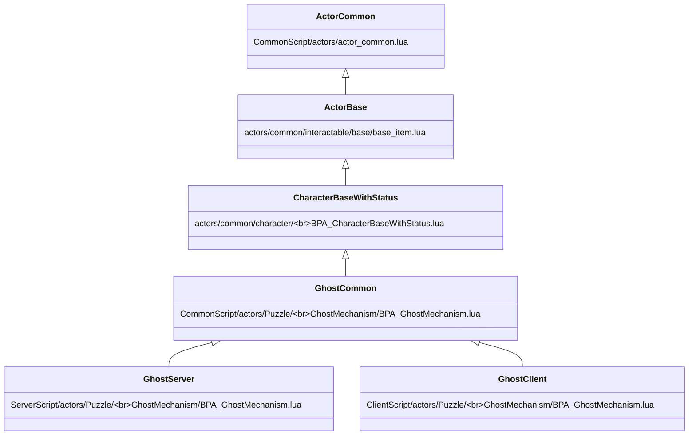

# ⑥ Puzzle 三层目录与启动链

`Content/Script/{Server,Client,Common}Script/actors/Puzzle/` 下的 5 个机关（DancingSofa / DouDing / GhostMechanism / HeadEye / SurveillanceBird）是 Hi 项目当前推荐的"做新机关"的标准范式。本页讲清三层文件结构、继承链、职责矩阵、Server/Client/Common 各自做什么。

## 文件矩阵

| 机关 | ServerScript | ClientScript | CommonScript | StateTree |
|---|---|---|---|---|
| DancingSofa | `BPA_DancingSofa.lua` | 同 | 同 | — |
| DouDing | `BP_DouDingPuzzle.lua` + Runner + TrackInteract | 同 | 同 | — |
| GhostMechanism | `BPA_GhostMechanism.lua` | 同 | 同 | `STTask_SplinePatrol/MoveToSpline/FleeFromPlayer` |
| HeadEye | `BP_HeadEye.lua` | 同 | 同 | `STTask_Patrol/Spotted` + `STCond_PlayerDetected` |
| SurveillanceBird | `BP_SurveillanceBird.lua` + `BP_SurveillanceTV.lua` | 同 | 同 | — |

每个机关都有三套同名 lua，**两两路径只差顶级目录**。

## 继承链



ServerScript / ClientScript 第一行 require：

```lua
-- ServerScript/.../GhostMechanism/BPA_GhostMechanism.lua
local CommonBase = require("CommonScript.actors.Puzzle.GhostMechanism.BPA_GhostMechanism")
local GhostMechanismServer = Class(CommonBase)
```

蓝图侧通过 `GetServerModuleName / GetClientModuleName` 路由；`GetModuleName` 返回空字符串（CS 分离后不再使用单一模块）。

## 三层职责矩阵

```mermaid
flowchart LR
    subgraph COMMON["Common (共用骨架)"]
        C1["Initialize 字段集中声明"]
        C2["Overlap 组件绑定"]
        C3["Overlap 回调 stub (空)"]
        C4["配置校验 _InitConfig"]
        C5["OnLogicalStateChanged 路由"]
        C6["ChangeStatue_Server"]
        C7["Status_* skeleton (log)"]
        C8["NSM/Spline 工具"]
    end

    subgraph SERVER["Server (override)"]
        S1["CharacterMovement 调参"]
        S2["StateTree:StartLogic"]
        S3["D4 fallback timer"]
        S4["K2_OnSaveToDatabase 归一化"]
        S5["K2_OnLoadFromDatabaseAllFinish 重广播"]
        S6["HandleItemCharacterHitEvent"]
        S7["GiveRewardToPlayer (ROUtils)"]
        S8["Overlap 写 bool"]
    end

    subgraph CLIENT["Client (override)"]
        L1["Niagara 异步预加载"]
        L2["视觉激活/停止"]
        L3["消散特效"]
        L4["灵压仪 SoulMeter 注册"]
        L5["Spline 路径可视化"]
        L6["Reward Mesh + 动画"]
        L7["Debug Tick + 瞬移检测"]
    end

    COMMON --> SERVER
    COMMON --> CLIENT

    style COMMON fill:#264653,color:#fff
    style SERVER fill:#1a1a2e,color:#fff
    style CLIENT fill:#a23b72,color:#fff
```



| 阶段 | Common | Server (override) | Client (override) |
|---|---|---|---|
| `Initialize` | 全字段声明 | 追加业务字段 | 追加业务字段 |
| `ReceiveBeginPlay` | DestroyASC + DamageReceiver:SetActive + Capsule 通道修正 + BindOverlap + SetupNSM | + CMC 配置 + StateTree:StartLogic + D4 timer + CacheSplineData | + CacheSplineData + RegisterSoulMeter + PreloadNiagara |
| `ReceiveEndPlay` | Unbind Overlap + 清通用 timer | + 注销 TickCallback + 清销毁 timer | + Unregister SoulMeter + Cancel Niagara loads |
| `OnBeginOverlap_Inner` | 空 stub | 写 `bPlayerInInner=true` | (不 override) |
| `OnLogicalStateChanged` | dispatcher → Status_xxx | (不 override) | (不 override) |
| `Status_Active` | log only | log only / Spawn pieces | ActivateVisuals + ShowSplinePath if InSoulMeter |
| `Status_Complete` | log + 关 DebugBox | StopMovement + DropID + 1.5~3s TriggerDestroy | DeactivateVisuals + PlayDissipateEffect + ShowRewardMesh |
| `K2_OnSaveToDatabase` | — | Complete→Destroy 归一化 | — |
| `K2_OnLoadFromDatabaseAllFinish` | — | bHasSaved 推断 + 死亡直销毁 + 存活强广播 | — |
| `HandleItemCharacterHitEvent` | — | 状态校验 + Complete + Reward | — |

## Common 层职责动机

为什么不直接放 Server？因为 **Client 端也会执行其中很多逻辑**（NSM 初始化、Overlap 绑定、状态路由），如果只在 Server 实现：
1. 第一会维护漂移
2. 第二 Client 端会直接挂掉（很多字段在 Initialize 才存在）

Common 层契约：**两端必须做且做法必须完全一致的事**。

### 5 类共用逻辑

1. **字段集中声明（Initialize）** —— `CommonScript/.../GhostMechanism:39-64` 用 Initialize 列出所有 timer handle、状态字段、缓存字段
2. **Overlap 组件绑定（BindDetectSphereOverlaps）** —— 即便最终 stub 是空，绑定本身会做碰撞通道运行时修正
3. **OnLogicalStateChanged → Status_xxx 路由** —— 状态映射表在 Common 层维护，确保 Server/Client "同名状态对同一函数"
4. **NSM/Spline 工具函数** —— 两端都要把 Spline `Detach(KeepWorld)` 到 HLE JSON 配置的同一世界坐标，否则视觉错位
5. **配置校验** —— `_bConfigFailed=true` 让两端都跳过初始化，避免半残运行

## Server 层 ReceiveBeginPlay 标杆

```lua
-- ServerScript/actors/Puzzle/GhostMechanism/BPA_GhostMechanism.lua:32-63
local FALLBACK_DELAY = 0.5

function GhostMechanismServer:ReceiveBeginPlay()
    self.Super.ReceiveBeginPlay(self)              -- 调 Common
    self:CacheSplineData()                         -- Spline 路点数缓存

    -- CharacterMovement 平滑动力学 (详见 ⑥ 后半段)
    if self.CharacterMovement then
        self.CharacterMovement.MaxWalkSpeed              = self.PatrolSpeed or 200.0
        self.CharacterMovement.bOrientRotationToMovement = true
        self.CharacterMovement.bUseControllerDesiredRotation = false
        self.CharacterMovement.MaxAcceleration            = 600.0
        self.CharacterMovement.BrakingDecelerationWalking = 400.0
        self.CharacterMovement.RotationRate               = UE.FRotator(0, 360, 0)
    end

    -- StateTree: 蓝图上 bStartLogicAutomatically=false，仅 Server 手动启动
    if self.StateTreeComponent then
        self.StateTreeComponent:StartLogic()
    end

    -- D4 fallback: 0.5s 兜底
    self._initFallbackHandle = G.TimerManager:SetTimer(
        {self, self.CheckAndForceInitialState}, FALLBACK_DELAY, false)
end
```

详见 [⑦ Status 状态机](07-status-logical-signal.md) 与 [⑨ 存盘恢复](09-save-load-d4.md)。

## Client 层做"看得见的事"

GhostMechanism Client 完整能力清单：

| 子系统 | 函数 | 行号 |
|---|---|---|
| Niagara 异步预加载 | `PreloadNiagaraAssets` (Kittens async loader) | `:152-209` |
| 视觉激活/停止 | `ActivateVisuals` / `DeactivateVisuals` | `:220-233` |
| 消散特效 | `PlayDissipateEffect` | `:236-250` |
| 灵压仪 (SoulMeter) 注册 | `RegisterSoulMeterListener` (GameEventBus) | `:256-276` |
| Spline 路径可视化 | `ShowSplinePath` (Niagara DI Custom_Spline) | `:292-318` |
| Reward Mesh + 动画 | `ShowRewardMeshAndAnim` | `:341-353` |
| Debug 可视化 + 瞬移检测 | `ReceiveTick` | `:64-119` |

DancingSofa Client 还做：VAT 动画驱动、QTE Widget 显隐、座位 Attach/Detach、相机距离切换、扭动/震动动画驱动。

HeadEye Client 做：XVisionEye 检测、PostProcess、红光、消散特效。

**Client 端不写状态、不存盘、不发奖励**——所有结果从 Server `Multicast_xxx` 或 `OnLogicalStateChanged` 流入。

## CharacterMovement 平滑动力学

| 字段 | 引擎默认 | Puzzle 推荐 | 动机 |
|---|---|---|---|
| `MaxWalkSpeed` | 600 | `PatrolSpeed`（200） | 慢速观察反应窗口 |
| `MaxAcceleration` | 2048 | **600** | 速度渐变，避免方向突变"瞬移感" |
| `BrakingDecelerationWalking` | 2048 | **400** | 制动平滑，停下不抖 |
| `RotationRate` | (0,540,0) | **(0,360,0)** | Yaw 360°/s 平滑转向 |
| `bOrientRotationToMovement` | false | **true** | 朝向跟着移动方向 |
| `bUseControllerDesiredRotation` | true | **false** | 关掉让上面那条生效 |

**NSM 与 CMC 切换**：从 NSM 巡逻切到 Flee 自由移动时必须 `BeginFreeMovement` 保留惯性（显式拷 prevVelocity 再恢复，避免 ForceStop 清零造成"急刹"）。

**方向插值**：`SmoothAddMovementInput` 用指数 lerp `alpha = 1 - exp(-DIR_LERP_SPEED * dt)`，不是硬切目标方向。整套配置下 Ghost 在 Patrol/Flee/Return 切换时玩家几乎看不到突变。

## Overlap 双层感知（Inner/Outer）

机关用 `InnerDetectSphere` / `OuterDetectSphere` 两个 SphereComponent，对应 `bPlayerInInner` / `bPlayerInOuter`：

```lua
-- ServerScript/.../GhostMechanism:72-99
function GhostMechanismServer:OnBeginOverlap_Inner(...)
    if not OtherActor or not OtherActor.PlayerState then return end
    if not self.bCanFlee then return end  -- 不逃跑模式忽略 Inner
    self.bPlayerInInner = true
end
```

**为什么 Overlap 替代 Tick 距离检测**：
1. **CPU 成本**：Tick × N 个机关 × N 个玩家 = O(N²)；Overlap 用 PhysX/Chaos 空间索引 O(log N)
2. **状态原子性**：bool 边沿触发，天然适合状态机入口
3. **AOI 自动剔除**：Sphere 在玩家 AOI 外不发事件
4. **碰撞通道运行时修正**：Common 层统一 `SetCollisionResponseToChannel(ECC_Pawn, ECR_Overlap)`

`bCanFlee=false` 时 Overlap 回调直接 return，机关退化为"纯巡逻+挨打就死"。

## StateTree 集成

| 机关 | StateTree | ItemStatusComponent |
|---|:---:|:---:|
| DancingSofa | ❌ | ✅ |
| DouDing | ❌ | ✅ |
| GhostMechanism | ✅ Patrol/Flee/Return | ✅ |
| HeadEye | ✅ Patrol/Spotted | ✅ |
| SurveillanceBird | ❌ | ✅ |

5 个机关全用 ItemStatusComponent 走外层 Status 状态机；其中 GhostMechanism + HeadEye 在 Active 阶段额外内嵌 StateTree 做 AI 子状态。两者并不冲突——外层是 Item 全局生命周期（Appear/Active/Complete/Destroy），内层是 Active 阶段的 AI 行为子树。

### GhostMechanism 三个 STTask

- **STTask_SplinePatrol**：EnterState `actor:EndFreeMovement()` + `actor:StartOrResumeNSM(speed)`，NSM 接管沿 Spline 巡逻
- **STTask_FleeFromPlayer**：EnterState `actor:BeginFreeMovement()` + `SetMovementSpeed(fleeSpeed)`，CMC 接管 + 每帧 SmoothAddMovementInput(awayDir)
- **STTask_MoveToSpline**：Flee 完成后回归 Spline 的过渡态

### 启动方式

`StateTreeComponent:StartLogic()` **仅 Server**，蓝图开关 `bStartLogicAutomatically=false`：
- (a) 必须等 NSM/Spline/CMC 配置完成
- (b) Client 端不跑 AI

HeadEye 更晚——Status_Appear 1s 延迟后才 StartLogic，给客户端预热视觉。

## 5 个机关玩法速览

### DancingSofa（多轮 QTE）
玩家走近沙发按 F 坐下 → 沙发抽搐扭动 → 弹出多轮方向 QTE → 全胜击飞+奖励 / 失败超过 QTEMaxFailCount 击飞。怪谈头难度系数 (1.0/1.2/0.8) 动态调整序列长度和时长。

### DouDing（多块拼图）
基类 `BPA_PuzzleBase` 定义 N 块拼图嵌入：Server `RefreshPuzzlePiece` 按 PuzzlePieceDataList Spawn N 个 PuzzlePiece Actor 并 Attach；玩家与 PuzzlePiece 交互 → EmbedPuzzlePiece → 全嵌入触发 Status_Complete → 播 LevelSequence。

### GhostMechanism（巡逻 + 击杀奖励）
幽灵 NPC 沿 Spline 巡逻 → 玩家进感知圈触发 Flee → 玩家命中 → 一击毙命 + 消散 + DropID。借助灵压仪 SoulMeter 显示 Spline 路径辅助追击。

### HeadEye（巡逻 + 视觉检测）
会移动的"眼睛"NPC，沿 Spline 巡逻 + 服务端 Tick 转身朝向移动方向；XVisionEye Client 端做真实视觉检测，盯到玩家时身体转向播 Spotted 状态；命中可击杀。bQuiet 模式完全沉默不工作。

### SurveillanceBird（双 Actor 配合）
监控鸟在场景中飞行（默认隐形需电视唤醒）；电视屏幕作为玩家"摄像头"，Box Overlap 检测玩家进入 → 电视亮起显示鸟视角 RenderTarget。鸟被击落 → Complete + 奖励。

## 关键代码位置

- `CommonScript/actors/Puzzle/GhostMechanism/BPA_GhostMechanism.lua:33` — `Class(CharacterBaseWithStatus)`
- `CommonScript/.../GhostMechanism:39-64` — Initialize 字段集中
- `CommonScript/.../GhostMechanism:151-164` — OnLogicalStateChanged dispatcher
- `CommonScript/.../GhostMechanism:275-311` — SetupNSM Detach(KeepWorld)
- `ServerScript/.../GhostMechanism:24` — FALLBACK_DELAY = 0.5
- `ServerScript/.../GhostMechanism:32-63` — Server ReceiveBeginPlay 标杆
- `ServerScript/.../GhostMechanism:53-56` — `StateTreeComponent:StartLogic` Server-only
- `ServerScript/.../GhostMechanism:72-99` — Inner/Outer Overlap 写 bool
- `CommonScript/actors/Puzzle/base/BPA_PuzzleBase.lua:67-90` — RefreshPuzzlePiece

上一章：[⑤ InteractManager + Widget](05-interact-manager-widget.md) | 下一章：[⑦ Status 状态机 + LogicalSignal](07-status-logical-signal.md)
