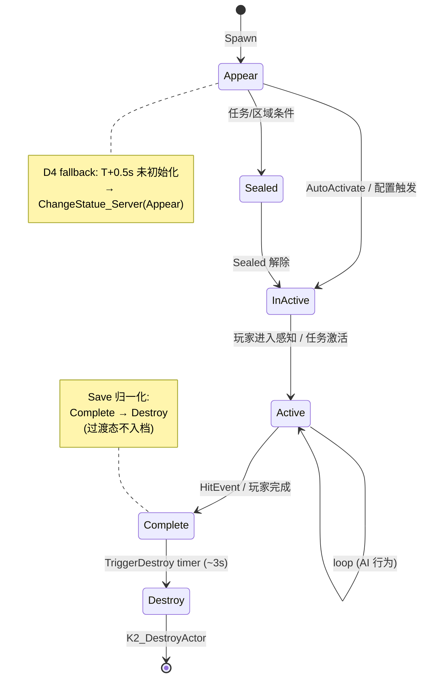

# ⑦ Status 状态机 + LogicalSignal

机关的"宏观生命周期"由 `ItemStatusComponent` 与 `ULogicalStateComponent` 两套状态机驱动。`bNewStatusFW` 是新旧分水岭。本页讲清两套并存的原因、bAutoRegister 必须保持 true、suppress-restore 技巧、以及外挂插件 LogicalChains 的注册流程。

## 状态枚举

```cpp
UENUM()
enum class E_StatusFlowRaw : uint8 {
    Appear   = 0,
    Sealed   = 1,
    InActive = 2,
    Active   = 3,
    Complete = 4,
    Destroy  = 5,
};
```

DancingSofa 还多一个 `Sealed` 用法，其他机关一般 5 态。

## 状态转换图



**Appear 是一次性自驱状态**：进 Appear 立刻调 `ChangeStatue_Server(Active)`，不停留。

## 新旧分水岭：bNewStatusFW

`bNewStatusFW` 是声明在 BP_BaseItem 蓝图上的 boolean 字段，同样字段镜像在 `BP_GroupActorSpawner` 与 `BPA_GhostBase` 上。

```lua
-- base_item.lua:71-73 (UCS)
function BaseItem:UserConstructionScript()
    self:SetAdvancedLogicalChains(self.bNewStatusFW)
end
```

UCS 调 `SetAdvancedLogicalChains(self.bNewStatusFW)` 把布尔写进 `ItemStatusComponent.bAdvancedLogicalChains`。后续大量分支：

```lua
function BaseItem:Call_StatusFlowRaw(InComponentIndex, EnumKey, bNewStatusFW)
    if self:GetAdvancedLogicalChains() then
        self:SetAdvancedLogicalState(EnumKey, false)        -- 新框架
    else
        self.ItemStatusComponent:Call_StatusFlowRaw(...)    -- 旧框架
    end
end
```

| 通道 | bNewStatusFW=false（旧） | bNewStatusFW=true（新） |
|---|---|---|
| 状态存储 | `ItemStatusComponent.StatusFlowRaw` (S_StatusFlowRaw) | `ULogicalStateComponent.CurrentState` (FLogicalStateName) |
| 状态枚举 | `E_StatusFlowRaw`（6 态固定） | `LogicalStates: TArray<FName>`（蓝图配置任意） |
| 同步方式 | `OnRep_StatusFlowRaw` + Multicast RPC | `OnRep_CurrentState` + `OnLogicalStateChanged` |
| 调用入口 | `BaseItem:Call_StatusFlowRaw` → `ItemStatusComponent:Call_StatusFlowRaw` | `BaseItem:SetAdvancedLogicalState` → `LogicalState:K2_SetState` |

**默认值**：从 base_item.lua 路径推断，新写的 Actor（GhostMechanism、Trap 系列）默认 `bNewStatusFW=true`，老 BP_BaseItem 子类历史默认 `false`。

**辨别速查**：grep `OnLogicalStateChanged` 命中的就是新框架；只有 `Multicast_CallStatusFlow` 的就是旧。运行时调 `BaseItem:GetAdvancedLogicalChains()` 给答案。

## ItemStatusComponent

ItemStatusComponent **不是 C++ 类**，而是蓝图 ActorComponent（`/Game/Blueprints/Components/ItemStatusComponent`），UnLua 绑定到 `ServerScript.actors.common.components.item_status_component`。

关键 UPROPERTY：
- `bStatusFlowSealed: bool, replicated, RepNotify=OnRep_bStatusFlowSealed`
- `StatusFlowRaw: S_StatusFlowRaw, replicated, RepNotify=OnRep_StatusFlowRaw`
- `Event_ActorStatus: FMulticastScriptDelegate`
- `EventOnStatusMap: TMap<TSoftObjectPtr<BP_MissionEvent_AllInOne_C>, E_StatusFlowRaw>`
- `bAdvancedLogicalChains: bool` —— 模式开关

关键 Multicast：
- `Multicast_CallStatusFlow(eStatusFlow)` —— 旧框架状态广播
- `Multicast_Mission_CallStatusFlow(eStatusFlow)` —— 任务系统专用

## LogicalChains 插件（新框架）

来自外挂插件 `Plugins/LogicalChains/`，Copyright Space Raccoon Game Studio。

```mermaid
flowchart LR
    subgraph PLUGIN["Plugins/LogicalChains/"]
        SC["ULogicalSignalBaseComponent"]
        SG["ULogicalSignalGenerator"]
        SR["ULogicalSignalReceiver"]
        ST["ULogicalStateComponent"]
        GA["ULogicalSignalGate (AND/OR)"]
        SS["ULogicalChainsSubsystem"]
    end

    SC <|-- SG
    SC <|-- SR
    SG --> SS
    SR --> SS
    ST --> SG: BindToStateComponent
    SS -- 按 Layer 配对 --> SG
    SS -- 按 Layer 配对 --> SR
```

### Generator
持有 `TArray<FLogicalGeneratorSignal> GeneratorSignals`，每条 signal 配置：
- `ActivationStates`：哪些状态触发
- `Signals`：信号名
- `bSendByDefault`：是否默认发送

`BindToStateComponent(true)` 把它挂到同 Actor 的 `ULogicalStateComponent::OnStateChanged` 多播上 → 状态变化时调 `OnComponentStateChanged` → 过滤 → `SendSignal(...)` BIE。

### Receiver
持有 `TArray<FLogicalReceiveSignal> ReceiverSignals`，并维护 `ActiveSignals`，对外暴露 `OnSignalReceived` / `OnSignalLost` 多播代理。

### Subsystem 按 Layer 配对
二者通过 `LogicalChainsSubsystem` 在场景中按层（Layer / GameplayTagContainer）配对。EditorMode 下用 `LogicalChainsEdMode*` 一套图形工具配线。

**信号能跨 Actor**：能。Generator 发射 + Receiver 监听通过同一个 Subsystem 协调，FGameplayTagContainer Layer 是路由 key，与 Actor 实例无关。

**跨 Server**：从代码上 LogicalChains 走 OnRep + Multicast，不直接跨 DDS Server；跨 Server 状态依然要靠 Aether 的 RO 机制（详见 [⑧ RO 复制对象](08-ro-replication.md)）。

## ⚠ bAutoRegister 绝不能关

GhostMechanism 注释（Sprint 11）讲得最透：

> 蓝图层关闭 `bAutoRegister` 会破坏 `UActorComponent` 生命周期契约 → `OnRegister` 不跑 → `FActiveGameplayEffectsContainer::Owner / AbilityActorInfo` 未初始化 → Client-predicted hit 在 `UTargetTagRequirementsGameplayEffectComponent::CanGameplayEffectApply` 解引用 nullptr 崩溃 @ 0x190。

**正解**：保持默认 `AutoRegister=true`，运行时 `K2_DestroyComponent` 清理 ASC（因为幽灵走 `ItemCharacterDamageReceiver`，不走 GAS 伤害链路）。`DestroyComponent` 是纯本地操作（ActorComponent.cpp:1939），不走 Replication，Server/Client 各 destroy 各自实例。

如果某个机关晚于 BeginPlay 才动态加 component，必须手动 `RegisterComponent`。

## bNewStatusFW suppress-restore 技巧

SurveillanceBird 用了一个微妙技巧（`CommonScript/.../SurveillanceBird:53-59`）：

```lua
local savedNewStatusFW = self.bNewStatusFW
self.bNewStatusFW = false
Super(SurveillanceBirdCommon).ReceiveBeginPlay(self)   -- 让基类按"老框架"走
self.bNewStatusFW = savedNewStatusFW
if savedNewStatusFW and self.ItemStatusComponent then
    self.ItemStatusComponent:SetAdvancedLogicalChains(true)
end
```

**动机**：基类 `ReceiveBeginPlay` 在 `bNewStatusFW=true` 路径下会立刻按 LogicalChain 推 Appear，但鸟需要在 Appear 之前先把 Actor "藏起来"（`SetActorHiddenInGame(true)`）。所以临时关闭新框架开关让基类走老路径（不立即推状态），再恢复并手动 `SetAdvancedLogicalChains(true)`。

## 状态切换 API 速查

| API | 来源 | 在哪调 | 同步方式 |
|---|---|---|---|
| `SetAdvancedLogicalChains(bool)` | `base_item.lua:543` (UCS) | UCS 双端 | 仅本地写 `bAdvancedLogicalChains` |
| `Call_StatusFlowRaw(0, EnumKey, bNewStatusFW)` | `base_item.lua:1622` | Server | 分流 |
| `SetAdvancedLogicalState(NewStatusStr, bForce)` | `base_item.lua:588` | Server | `LogicalState:K2_SetState` → MARK_PROPERTY_DIRTY → OnRep |
| `ServerSetAdvancedLogicalState` | `base_item.lua:572` | Server | 包了一层 `Multicast_CallStatusFlow_New` |
| `Multicast_CallStatusFlow_New_RPC` | `base_item.lua:610` | Server→All | RPC 直推每端各自 SetAdvancedLogicalState |
| `ClientSetAdvancedLogicalState` | `base_item.lua:577` | Client | 经 PlayerState.ItemAvatarComponent → 反向 RPC 到 Server |
| `OnLogicalStateChanged(NewState, OldState)` | `base_item.lua:615` | 两端 | C++ ULogicalStateComponent 多播 → BIE 派发 |
| `BP_Mission_CallStatusFlow(eRaw, StateDisplayName)` | `base_item.lua:557` | 两端 | 派发 `self["Status_<Name>"]()` |
| `ChangeStatue_Server(EnumKey)` | `BPA_GhostMechanism.lua:141` | Server | **同时调旧 Call_StatusFlowRaw + 新 ServerSetAdvancedLogicalState** |

## ChangeStatue_Server 双框架双写

```lua
-- CommonScript/.../GhostMechanism:141-149
function GhostMechanismCommon:ChangeStatue_Server(EnumKey)
    if not self.ItemStatusComponent then return end

    -- 旧框架（保证存盘字段同步）
    self.ItemStatusComponent:Call_StatusFlowRaw(0, EnumKey, self.bNewStatusFW)

    -- 新框架（保证 LogicalChain 触发）
    if self:GetAdvancedLogicalChains() then
        local stateName = self:_EnumKeyToStateName(EnumKey)
        self:ServerSetAdvancedLogicalState(stateName, false)
    end
end
```

两套同时写是过渡期的兼容设计：旧框架的 `StatusFlowRaw` 字段被 SaveGame 序列化，新框架的 `LogicalState.CurrentState` 是运行时状态查询入口。两者必须同时维护。

## 新旧状态机辨别清单

- **已迁 (bNewStatusFW=true，走 LogicalState)**：GhostMechanism、ChairSeat、SwapHeadTrap、SwapHeadBattleTrap、Destructible 系、TextNarrative、Letter（凡是用了 `OnLogicalStateChanged` / 在 ServerScript override `Status_*` 函数的）
- **仍是旧 (bNewStatusFW=false，走 ItemStatusComponent.StatusFlowRaw)**：base_item 系列下未显式开 bNewStatusFW 的历史 Actor，主要靠 `Multicast_CallStatusFlow_RPC` + `Mission_Call_StatusFlow_Func` 派发

## 常见陷阱

1. **bAutoRegister=false 崩溃** —— 上文已述
2. **bNewStatusFW 双状态框架并存** —— 每个状态切换函数都要 if/else 双分支，分支翻倍易漏改
3. **AllInOne 任务挂钩双链路** —— `AllInOneEventRegister_*` 三类任务挂钩同样按 if 分两条独立链路
4. **suppress-restore 时机不对** —— 必须在 Super.ReceiveBeginPlay 前压、之后恢复
5. **直接改 StatusFlowRaw 字段** —— 不会触发 RepNotify，必须走 Call_StatusFlowRaw 或 ServerSetAdvancedLogicalState

## 关键代码位置

- `actors/common/interactable/base/base_item.lua:71-73` — UCS / SetAdvancedLogicalChains
- `base_item.lua:543-555` — Get/SetAdvancedLogicalChains
- `base_item.lua:557-636` — BP_Mission_CallStatusFlow / Server/ClientSetAdvancedLogicalState / OnLogicalStateChanged
- `base_item.lua:1622-1631` — Call_StatusFlowRaw 新旧分流
- `BPA_CharacterBaseWithStatus.lua:32-37` — 角色侧 SetAdvancedLogicalChains UCS
- `CommonScript/.../GhostMechanism:75-84` — DestroyASC + bAutoRegister 注释
- `CommonScript/.../GhostMechanism:141-149` — ChangeStatue_Server 双框架双写
- `CommonScript/.../SurveillanceBird:40-62` — bNewStatusFW suppress-restore
- `Plugins/LogicalChains/Source/LogicalChains/Public/Components/LogicalStateComponent.h:85-167`
- `Plugins/LogicalChains/.../LogicalSignalGenerator.h:24-73`

上一章：[⑥ Puzzle 三层目录](06-puzzle-three-layer.md) | 下一章：[⑧ RO 复制对象](08-ro-replication.md)
