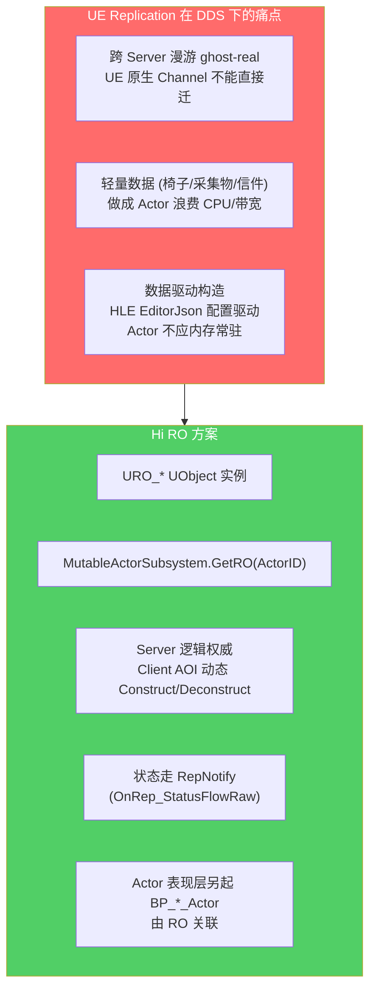
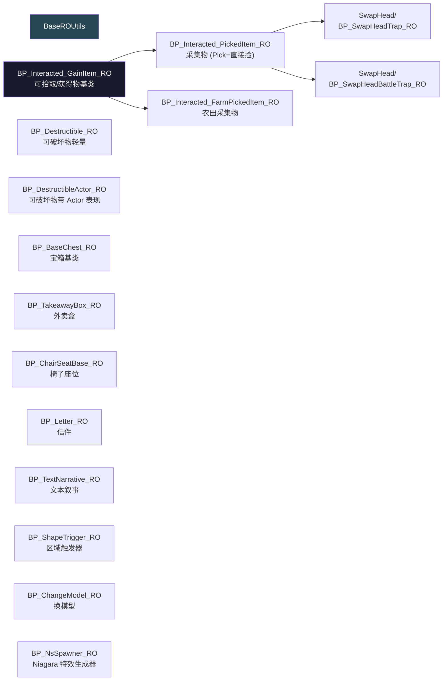
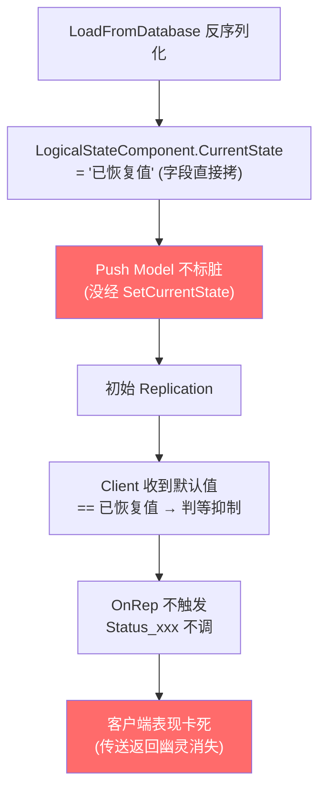
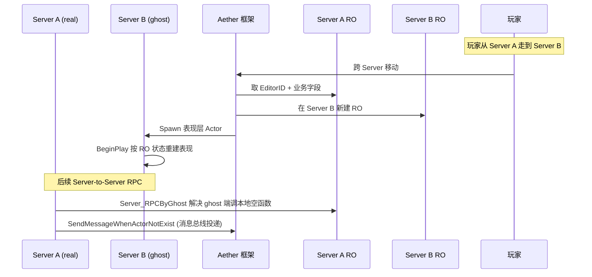

# ⑧ RO 复制对象与 Multicast 重广播

RO（ReplicationObject）是 Hi 项目（DDS / Aether 框架）的"轻量逻辑实例"自研复制方案。本页讲清 RO 与 UE 自带 Replication 的差别、15 个 RO 文件清单、RO 注册生命周期、Multicast 重广播 + Destroy 直销毁的设计动机。

## RO ≠ UE Replication

UE 自带 Replication 是 **AActor 维度**，每个被复制的实例必须是 AActor，要承担 PhysicsScene、Components、Tick、Channel 等开销。Hi 的 Aether-DDS 多 Server 拓扑里有以下痛点：



## RO 文件清单（actors/common/interactable/RO/）



| 路径 | 类名 | 用途 |
|---|---|---|
| `BP_Interacted_GainItem_RO.lua` | GainItem_RO | 可拾取/获得物的通用基类 |
| `BP_Interacted_PickedItem_RO.lua` | PickedItem_RO | 采集物（Pick=直接捡） |
| `BP_Interacted_FarmPickedItem_RO.lua` | FarmPicked RO | 农田采集物 |
| `BP_Destructible_RO.lua` | Destructible RO | 可破坏物（轻量） |
| `BP_DestructibleActor_RO.lua` | DestructibleActor RO | 可破坏物（带 Actor 表现） |
| `BP_BaseChest_RO.lua` | BaseChest RO | 宝箱基类 |
| `BP_TakeawayBox_RO.lua` | TakeawayBox RO | 外卖盒 |
| `BP_ChairSeatBase_RO.lua` | ChairSeatBase RO | 椅子座位 |
| `BP_Letter_RO.lua` | Letter RO | 信件 |
| `BP_TextNarrative_RO.lua` | TextNarrative RO | 文本叙事 |
| `BP_ShapeTrigger_RO.lua` | ShapeTrigger RO | 区域形状触发器 |
| `BP_ChangeModel_RO.lua` | ChangeModel RO | 换模型 |
| `BP_NsSpawner_RO.lua` | NsSpawner RO | Niagara 特效生成器 |
| `SwapHead/BP_SwapHeadTrap_RO.lua` | SwapHeadTrap RO | 换头陷阱（普通） |
| `SwapHead/BP_SwapHeadBattleTrap_RO.lua` | SwapHeadBattleTrap RO | 换头陷阱（战斗） |

CommonScript 端 RO 基类（`CommonScript/actors/common/interactable/base/RO/`）：
- `actor_proxy_ro.lua` —— RO 与 Actor 代理基础
- `base_item_ro.lua` —— Item RO 基类，承载 OnRep_StatusFlowRaw / Call_StatusFlowRaw / MarkPropertyDirty
- `interacted_item_ro.lua` —— 可交互 RO，继承 base_item_ro

ROUtils 子目录：BaseROUtils.lua / BP_Interacted_GainItem_ROUtils.lua / BP_Interacted_PickedItem_ROUtils.lua / BP_MineralBase_ROUtils.lua / chair_seat_utils.lua

## RO 注册与生命周期

```mermaid
sequenceDiagram
    participant DS as Server (DS)
    participant Sub as MutableActorSubsystem
    participant RO as URO_BaseChest
    participant Net as Network
    participant CSub as Client MutableActorSubsystem
    participant CRO as Client URO_BaseChest
    participant Actor as BP_BaseChest Actor

    Note over DS: HLE 加载 EditorJson<br/>解析 ActorID
    DS->>Sub: GetRO(ActorID) 不存在
    DS->>RO: Construct (URO_* UObject)
    RO->>RO: InitJsonData / VerifyChestType
    DS->>Sub: 注册 RO 表

    Note over DS,CSub: 玩家进入 AOI
    Sub->>Net: 同步 RO 数据
    Net->>CSub: 收到 RO 数据
    CSub->>CRO: Construct
    CRO->>Actor: 关联 OwningActor

    Note over DS: 状态变化
    DS->>RO: ServerSetStatusFlowRaw(Active)
    RO->>RO: MarkPropertyDirty
    Net->>CRO: OnRep_StatusFlowRaw
    CRO->>CRO: GetGroupActor():GetROActor(ActorId)
    CRO->>Actor: 调真 Actor 的 OnRep_*

    Note over DS: Server Destroy
    DS->>RO: Deconstruct(ROContainer)
    RO->>Sub: chair_manager:unregister 等业务清理
```

```lua
-- BaseItem:ListenROSpawnOrDestroy (base_item.lua:324)
function BaseItem:ListenROSpawnOrDestroy(ActorID, Listener, bSpawnOrDestroy)
    local SubSystem = SubsystemUtils.GetMutableActorSubSystem(self)
    local RO = SubSystem:GetRO(ActorID)
    if RO then
        Listener(self, RO, true)
    end
    -- ...
end
```

## RO 上的 OnRep_* 转发

RO 的 RepNotify 不直接执行业务，而是"找回真实 Actor 再转发"：

```lua
-- BP_BaseChest_RO.lua
function BP_BaseChest_RO:OnRep_bNeedPlayAppearAudio()
    local GroupActor = self:GetGroupActor()
    if not GroupActor then return end
    local ROActor = GroupActor:GetROActor(self:GetActorID())
    if ROActor then
        ROActor.bNeedPlayAppearAudio = self.bNeedPlayAppearAudio
        ROActor:OnRep_bNeedPlayAppearAudio()  -- 调真 Actor 的回调
    end
end
```

**为什么不直接在 RO 上做业务**：RO 是 UObject 不能播 Niagara、不能直接 SpawnActor 子物件、不能调用 Actor 专属 API。RO 是"数据 + 路由"，Actor 是"表现"。

## ROUtils：组合优于继承

```lua
-- BP_BaseChest_RO:Construct
function BP_BaseChest_RO:Construct()
    Super.Construct(self)
    self.ROUtils = ROUtils.new(self)  -- 组合
    self:InitJsonData()
    self:VerifyChestType()
    self:InitOpenTeamMembers()
end
```

ROUtils 类用 `_G.Class()` 定义普通 Lua 类（不是 UClass），ctor(owner) 接收 RO 作为 owner。把可复用工具方法（库存查询、Json 解析、奖励计算）放到 ROUtils 里，避免每个 RO 子类重复写。

## Multicast 重广播 + Destroy 直销毁

**场景**：`K2_OnLoadFromDatabaseAllFinish` 阶段（ReceiveBeginPlay 前 ~1ms），Actor 尚未 Initial Replication。GhostMechanism Server 注释把动机讲得最透：

> "C++ `ULogicalStateComponent::SetCurrentState` 只在被调用时 `MARK_PROPERTY_DIRTY`，SaveGame 反序列化直接改字段不走该函数 → Push Model 不标脏 → 初始 Replication 给 Client 的 CurrentState 值与默认空值相同 → `OnRep_CurrentState` 不触发。"



**为什么不能用 RepNotify**：因为 SaveGame 反序列化是把字段直接拷回，没经 `SetCurrentState` 这条路径，UE 5.5 的 Push Model 不会标脏，初始 Replication 把"恢复后的值"和"默认值"打包发给 Client 时被判等抑制 → 客户端 OnRep 没机会触发 → Status_xxx 蓝图回调不被调用 → 客户端表现卡死。

### 修法（GhostMechanism Server :228-239）

```lua
-- 仍存活：force broadcast Multicast 重广播
self:ServerSetAdvancedLogicalState(stateName, true)  -- bForce=true
```

`bForce=true` 强制 force flag → 绕过 `SetCurrentState` 同值去重 → `MARK_PROPERTY_DIRTY` + 主动 Multicast → 两端 `OnLogicalStateChanged` 正常触发。

### Destroy 直销毁

已死亡（Destroy / Complete）的特例：直接 `K2_DestroyActor()`，不走 Multicast：

```lua
if raw == Enum.E_StatusFlowRaw.Destroy or raw == Enum.E_StatusFlowRaw.Complete then
    self:K2_DestroyActor()
    return
end
```

**动机**：`K2_OnLoadFromDatabaseAllFinish` 比 Initial Replication 还早（注释 "ReceiveBeginPlay 前 ~1ms"），此时 Client 还没 Spawn 该 Actor，Server 端 `K2_DestroyActor` → Client 永远不会收到 Spawn → 没有"幽灵闪现 + 重复消散特效"副作用。

## C++ RO 基类（位置说明）

未在 `Source/HiGame` 目录下命中 `class.*RO` 或 `ReplicationObject` 直接定义 —— Hi 自研 RO 基类位于 **DDS/Aether 框架插件**（不在 HiGame Source 内，而在外部 Plugins / Engine 私有分支）。

运行时通过 MutableActorSubsystem 暴露：
- `MutableActorSubSystem:GetRO(ActorID)`
- `MutableActorSubSystem:GetActor(ActorID)`
- `MarkPropertyDirty(self, "StatusFlowRaw")`

证明 RO 是 UObject 体系下的 PushModel 复制对象，而非纯 Actor。

## RO 与 DDS 跨 Server 迁移



- RO **EditorID + 业务字段**通过 Aether 的 ghost-real 机制随玩家 / AOI 迁移
- Actor 在 Server B 按 RO 重新 Spawn 表现层
- `Server_RPCByGhost`（base_item.lua:2309-2327）解决 ghost 对应的 Server-to-Server RPC
- `SendMessageWhenActorNotExist`（base_item.lua:2339-2349）在 Actor ghost 都不存在时由 MutableActorComponent 走"消息总线"投递

## 常见陷阱

1. **直接在 RO 上播 Niagara / SpawnActor** —— RO 是 UObject 没有这些 API
2. **RO 上 OnRep 不转发到 Actor** —— 业务漏触发
3. **跨周目销毁后忘了 UnRegisterRO** —— RO 残留导致 GroupActor.GetROActor 误命中
4. **RO Construct 期间访问 Actor** —— Actor 可能还未 Spawn，必须用 ListenROSpawnOrDestroy
5. **直接改字段不调 MARK_PROPERTY_DIRTY** —— Push Model 不标脏，OnRep 不触发
6. **Load 阶段直接走 RepNotify 期望恢复表现** —— 必须 Multicast 重广播

## 关键代码位置

- `actors/common/interactable/RO/Utils/BaseROUtils.lua:11-32` — ROUtils 基类骨架
- `actors/common/interactable/RO/BP_BaseChest_RO.lua:1-50` — Construct + ROUtils.new + InitJsonData
- `actors/common/interactable/RO/BP_Interacted_PickedItem_RO.lua:19-45` — Construct / Server_ReceiveDamage / __CanInteracted
- `actors/common/interactable/RO/Utils/BP_Interacted_PickedItem_ROUtils.lua:20-30` — AddItemToPlayerBag
- `CommonScript/actors/common/interactable/base/RO/base_item_ro.lua:25-75` — OnRep_StatusFlowRaw / Call_StatusFlowRaw / MarkPropertyDirty
- `actors/common/interactable/base/base_item.lua:324` — ListenROSpawnOrDestroy
- `actors/common/interactable/base/base_item.lua:2309-2327` — Server_RPCByGhost
- `actors/common/interactable/base/base_item.lua:2391-2412` — GetGroupActor / GetROContainer_Client / GetRO
- `ServerScript/.../GhostMechanism:185-240` — K2_OnLoadFromDatabaseAllFinish 重广播 / 直销毁

上一章：[⑦ Status 状态机](07-status-logical-signal.md) | 下一章：[⑨ 存盘 / 恢复 / D4 fallback](09-save-load-d4.md)
