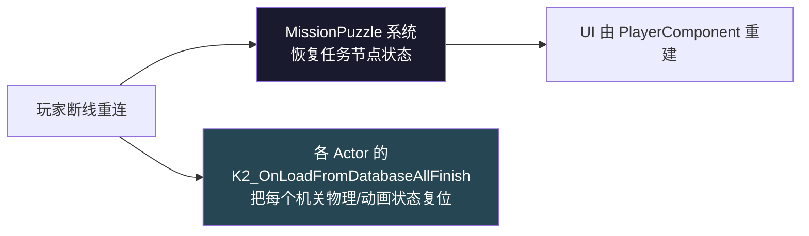

# ⑨ 存盘 / 恢复 / D4 fallback

DDS 框架定时/事件触发机关存盘；玩家入场或重连时按存档恢复。本页讲清 `K2_OnSaveToDatabase` / `K2_OnLoadFromDatabaseAllFinish` 流程、Complete→Destroy 归一化、D4 fallback (FALLBACK_DELAY=0.5) 的兜底动机、以及与 MissionPuzzle Reconnect 快照的协同。

## 存盘恢复时序

```mermaid
sequenceDiagram
    participant DDS as DDS 框架
    participant Actor as Actor
    participant ItemSC as ItemStatusComponent
    participant LSC as ULogicalStateComponent
    participant DB as Database

    Note over DDS: 玩家离开 AOI / DS 关服 / 跨服迁移点
    DDS->>Actor: K2_OnSaveToDatabase
    Actor->>Actor: 归一化: Complete → Destroy
    Actor->>ItemSC: StatusFlowRaw 写字段
    ItemSC->>DB: 序列化
    LSC->>DB: CurrentState 序列化 (SaveGame)
    Actor->>Actor: bHasSaved = true

    Note over DDS,DB: 下次玩家入场
    DDS->>Actor: 反序列化字段 (绕过 SetCurrentState)
    Note over Actor: ⚠ Push Model 不标脏
    DDS->>Actor: K2_OnLoadFromDatabaseAllFinish
    Actor->>Actor: 推断 bHasSaved
    alt 已死亡 (Destroy/Complete)
        Actor->>Actor: K2_DestroyActor (直销毁)
    else 仍存活
        Actor->>Actor: ServerSetAdvancedLogicalState(state, bForce=true)
        Actor->>Actor: 强制 Multicast 重广播
    end
```

## C.1 OnSaveToDatabase 流程

**触发时机**：DDS 框架定时/事件触发持久化（玩家离开 AOI、DS 关服、跨服迁移点等）。

**写入字段**：
- `ItemStatusComponent.StatusFlowRaw` 是核心
- `ULogicalStateComponent.CurrentState / PreviousState` 标了 SaveGame 也参与序列化

**典型实现**（base_item.lua:2009-2012）：

```lua
function BaseItem:K2_OnSaveToDatabase()
    self:LogInfo("zsf", "BaseItem:K2_OnSaveToDatabase %s", self:GetName())
    self.bHasSaved = true
end
```

GhostMechanism 在此基础上加"归一化"步骤（见 C.4）。

## C.2 OnLoadFromDatabaseAllFinish 流程

**为什么 AllFinish**：DDS 加载流程是分片 + 异步（多个组件、多个 Promise，async 加载素材）。单个 `K2_OnLoadFromDatabase` 只代表"我这个 Actor 的字段反序列化完了"，但素材/RO 关联未必齐。**AllFinish 是"所有相关分片都完成"的一次回调**，Actor 可以放心读完整状态。

**流程**（base_item.lua:1989-2003）：

```lua
function BaseItem:K2_OnLoadFromDatabaseAllFinish()
    if self.bHasSaved then
        if self:GetAdvancedLogicalChains() then
            -- 新框架
            self:SetAdvancedLogicalState(
                self.LogicalState:K2_GetCurrentState(), true)  -- force=true
        else
            -- 旧框架
            self.ItemStatusComponent:Call_StatusFlowRaw(
                0, self.ItemStatusComponent:GetStatusFlowRaw(), self.bNewStatusFW)
        end
    else
        -- 从未存过盘：触发首次状态初始化为 Appear
        SubSystem:SetInfoSceneItemStatus(self, ActorID)
    end
end
```

GhostMechanism Server 在此基础上做了"已死亡直销毁"分支 + "过渡态强制重广播"分支：

```lua
-- ServerScript/.../GhostMechanism:185-240
function GhostMechanismServer:K2_OnLoadFromDatabaseAllFinish()
    if self.ItemStatusComponent and
       self.ItemStatusComponent:GetStatusFlowRaw() ~= 0 then
        self.bHasSaved = true
    end

    self.Super.K2_OnLoadFromDatabaseAllFinish(self)
    self._bStateInitialized = true

    if not self.bHasSaved then return end
    local raw = self.ItemStatusComponent:GetStatusFlowRaw()

    -- 已死亡：立即销毁
    if raw == Enum.E_StatusFlowRaw.Destroy or
       raw == Enum.E_StatusFlowRaw.Complete then
        self:K2_DestroyActor()
        return
    end

    -- 仍存活：force broadcast Multicast 重广播
    self:ServerSetAdvancedLogicalState(stateName, true)
end
```

详见 [⑧ RO 复制对象](08-ro-replication.md) 的"Multicast 重广播"段。

## C.3 D4 fallback 详解

```mermaid
flowchart TB
    BP["Server ReceiveBeginPlay"]
    Timer["SetTimer(0.5s)"]
    Check["CheckAndForceInitialState"]
    Init{_bStateInitialized?}
    Skip["跳过 (Entity 系统已驱动)"]
    Force["ChangeStatue_Server(Appear)"]

    BP --> Timer
    Timer -- T+0.5s --> Check
    Check --> Init
    Init -- true --> Skip
    Init -- false --> Force

    BP -.并行 < 0.5s.-> ELOAD["K2_OnLoadFromDatabaseAllFinish"]
    ELOAD -.-> SetInit["_bStateInitialized = true"]

    style Force fill:#ff6b6b,color:#fff
```

### D4 含义

代码注释（`BPA_GhostMechanism.lua:24` 与 `:58` `:263-276`）仅写 "D4 Server fallback" 没展开。**从上下文推测，D4 可能是 GhostMechanism 这个机关的"防御等级 4 级"或"第 4 类边界条件 (Defense #4)"**——是该机关在 sprint 修 bug 时用的内部编号，专指"Entity 加载链路完全失败"的兜底场景。如需准确含义需查 sprint 内部文档。

### fallback 解决什么问题

1. **Actor 不是 Entity 管理（无 EditorID）** —— K2_OnLoadFromDatabaseAllFinish 永远不会被调
2. **Entity 加载链路异常** —— DDS 没把这个 Actor 派发为"AllFinish 回调对象"
3. **只有 ReceiveBeginPlay 被调** —— 状态卡在 0（默认值），所有受击/交互都会被 `Status != Active` 检查拒绝（"非 Active 状态忽略"），机关变"哑巴"

### 0.5s 延迟动机

给 Entity 加载链路充足时间走完。**0.5s 是经验值**：
- 足够长以容下正常加载（绝大多数 < 100ms）
- 又足够短让玩家不会觉察到延迟

### CheckAndForceInitialState 实现

```lua
-- ServerScript/.../GhostMechanism:264-276
function GhostMechanismServer:CheckAndForceInitialState()
    self._initFallbackHandle = nil
    if self._bStateInitialized then return end  -- Entity 系统已驱动

    if not self.EditorID or self.EditorID == "" or
       self.EditorID == "0" or self.EditorID == 0 then
        -- 检查 EditorID 是否合法
    end

    self:ChangeStatue_Server(Enum.E_StatusFlowRaw.Appear)
end
```

`_bStateInitialized` 在 `OnLogicalStateChanged` 第一次触发时置 true（Common:OnLogicalStateChanged 内置），所以 D4 timer 自动判别要不要兜底。

## C.4 Save 归一化（Complete → Destroy）

```mermaid
sequenceDiagram
    participant Player as 玩家
    participant Actor as Actor
    participant Save as SaveGame

    Note over Actor: Status_Active
    Player->>Actor: HitEvent
    Actor->>Actor: Status_Complete
    Actor->>Actor: 1.5s TriggerDestroy timer 启动

    Note over Player: ⚠ 玩家在这 1.5s 窗口内断网/离开 AOI
    Player-xActor: 断线
    Save->>Actor: K2_OnSaveToDatabase
    Note over Actor: 不归一化 → 存档 = Complete

    Note over Player: 重新登录
    Save->>Actor: 反序列化 = Complete
    Actor->>Actor: ⚠ 重播 Status_Complete<br/>消散特效 + TriggerDestroy 再起一次
    Note over Actor: 视觉重复 + 状态污染
```

```lua
-- ServerScript/.../GhostMechanism:248-257
function GhostMechanismServer:K2_OnSaveToDatabase()
    local raw = self.ItemStatusComponent:GetStatusFlowRaw()
    if raw == Enum.E_StatusFlowRaw.Complete then
        -- 直接改字段, 不走 Call_StatusFlowRaw
        self.ItemStatusComponent.StatusFlowRaw.eStatusFlowRaw =
            Enum.E_StatusFlowRaw.Destroy
    end
    self.Super.K2_OnSaveToDatabase(self)
end
```

**两条关键设计**：
1. **Complete 是过渡态**：进入后 1.5s 就调 TriggerDestroy → Destroy。窗口内断网会污染存档
2. **直接改字段而不走 `Call_StatusFlowRaw`** —— 那样会触发 `OnItemStatusCondition` 任务链副作用，污染 Mission 系统

**原则推广**：任何"中间动画态 / 倒计时态"在 Save 前都应归一到稳定终态，避免回放产生重复副作用。

## C.5 _ForceSaveBeforeDestroy（DancingSofa 补丁）

DancingSofa Server 在 `K2_DestroyActor` 前显式 `EntityComponent:K2_SaveActor()`：

```lua
-- ServerScript/.../DancingSofa:117-137
function DancingSofaServer:_ForceSaveBeforeDestroy()
    -- EndPlay(Destroyed) 走 ActorSaveType_Destroy
    -- IsSaveTypeNeedWriteBackProperties 返回 false
    -- → 属性不写回 Entity → 存的是旧数据 → 重新登录沙发复活
    self.EntityComponent:K2_SaveActor()
end
```

**问题**：UE 的 EndPlay(Destroyed) 走 `ActorSaveType_Destroy`，DDS 框架的 `IsSaveTypeNeedWriteBackProperties` 返回 false → 属性不写回 → 重新登录沙发复活。

**修法**：在 `K2_DestroyActor` 前显式调 `K2_SaveActor()` 强制写回。

## C.6 重连恢复 vs Reconnect 快照

二者**不是同一套**但会协同：



| 维度 | 机关恢复 | MissionPuzzle Reconnect |
|---|---|---|
| 粒度 | Actor 维度 | 玩家维度 |
| 入口 | `K2_OnSaveToDatabase` / `K2_OnLoadFromDatabaseAllFinish` | `GetLocalPlayerRunningSnapshots` |
| 内容 | 单个机关的物理/动画/状态 | 任务在哪一步的状态机快照 |
| 对应章 | 本章 | [⑩ MissionPuzzle Subsystem](10-missionpuzzle-subsystem.md) |

两条独立链路在 RookieGuide / 谜题进度等场景里通过 `Event_MissionTriggerOutput` 等事件汇合。

## C.7 DDS 跨 Server 存盘

跨 Server 时：
1. Actor 在 Server A `K2_OnSaveToDatabase` 把状态写入数据库
2. Server B 加载该 ActorID 时，DDS 把 EditorJson + 存档数据合并喂给新 Spawn 的 Actor
3. 触发 `K2_OnLoadFromDatabaseAllFinish`

RO 视角下，RO 是逻辑权威，存档与 RO 字段直接对应；Actor 在 Server B 是"按 RO 状态重建表现"，因此 Multicast 重广播修复对跨 Server 同样有效。

## 常见陷阱

1. **过渡态入档** —— 必须归一到稳定终态
2. **直接改字段触发任务链副作用** —— 必须用 `eStatusFlowRaw = ...` 而非 `Call_StatusFlowRaw`
3. **Load 不重广播 Push Model 不标脏** —— 必须 `bForce=true`
4. **K2_DestroyActor 前未保存** —— DancingSofa 用 `_ForceSaveBeforeDestroy` 兜
5. **D4 fallback 0.5s 太短** —— 真正异常加载场景下可能不够；调长会让玩家觉察延迟
6. **D4 fallback 后状态卡 Appear** —— 必须在 Common:OnLogicalStateChanged 中置 `_bStateInitialized=true`
7. **AllFinish 之前调 GetActorID** —— 此时 EditorID 可能还没 attach，应在 Initialize 后访问
8. **重连后 UI 不开** —— UI 由 PlayerComponent 走 `GetLocalPlayerRunningSnapshots` 主动查，不在 Actor 链路上

## 关键代码位置

- `actors/common/interactable/base/base_item.lua:1989-2012` — K2_OnLoadFromDatabaseAllFinish + K2_OnSaveToDatabase 基类
- `actors/common/interactable/base/base_ghost.lua:71-79` — Ghost 仅旧框架
- `ServerScript/.../GhostMechanism:24` — `FALLBACK_DELAY = 0.5`
- `ServerScript/.../GhostMechanism:58-60` — D4 fallback timer 启动
- `ServerScript/.../GhostMechanism:185-240` — K2_OnLoadFromDatabaseAllFinish 重广播 / 直销毁
- `ServerScript/.../GhostMechanism:248-257` — K2_OnSaveToDatabase Complete→Destroy 归一化
- `ServerScript/.../GhostMechanism:264-276` — CheckAndForceInitialState
- `ServerScript/.../DancingSofa:107-137` — Status_Complete + _ForceSaveBeforeDestroy

上一章：[⑧ RO 复制对象](08-ro-replication.md) | 下一章：[⑩ MissionPuzzle Subsystem 全链路](10-missionpuzzle-subsystem.md)
