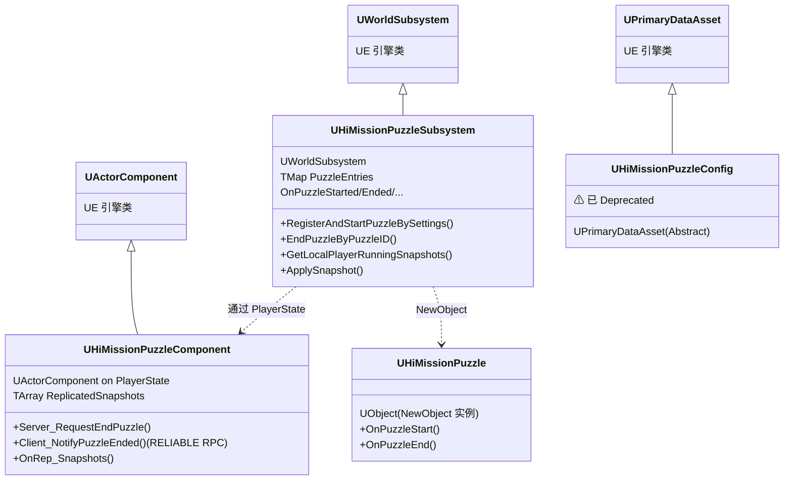
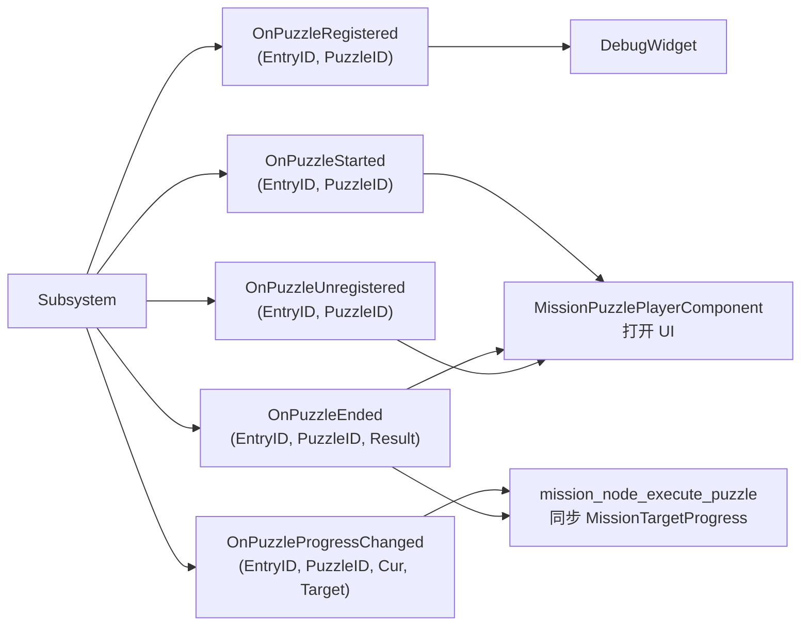
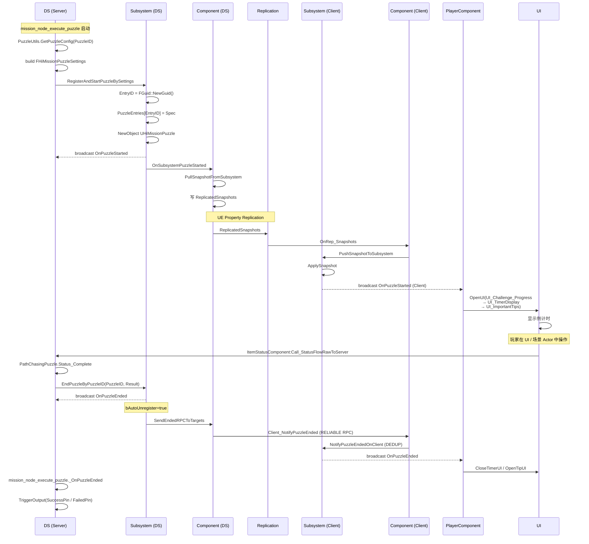
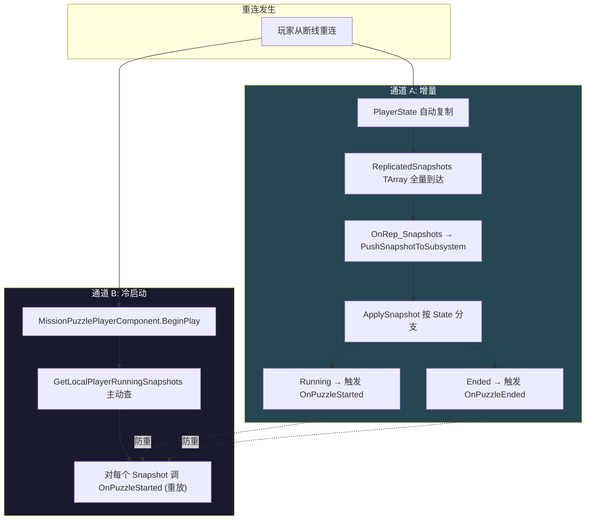

# ⑩ MissionPuzzle Subsystem 全链路

MissionPuzzle 是**任务驱动的解谜系统**，与 `actors/Puzzle/` 五个机关 Actor 是平行概念。它在独立插件 `Plugins/HiMissionPuzzle/` 内，由 `UWorldSubsystem` + `UActorComponent`(on PlayerState) + Lua `mission_node` 组成。本页讲清 C++ 类层次、EntryID/PuzzleID 二元结构、Reconnect 双通道、带外 RPC、与 actors/Puzzle/ 的边界。

## C++ 类层次



### UHiMissionPuzzleSubsystem
- **类型**：`UWorldSubsystem`（NOT GameInstanceSubsystem）—— 每个 UWorld 一个，DS / Client 两侧各一份
- **静态访问**：`Get(WorldContextObject)` / `World->GetSubsystem<UHiMissionPuzzleSubsystem>()`
- **核心存储**：`TMap<FString, FHiMissionPuzzleSpec> PuzzleEntries` —— EntryID → Spec

### UHiMissionPuzzleComponent
- **挂载位置**：`UActorComponent` on `APlayerState`（注释明确 "An ActorComponent designed to be attached to APlayerState"）
- **职责**：DS 端订阅 Subsystem 委托 → 写入 `ReplicatedSnapshots` TArray 进行属性复制；Client `OnRep_Snapshots` → `PushSnapshotToSubsystem`

### UHiMissionPuzzleConfig
- **类型**：`UPrimaryDataAsset`（不是 DataTable Row Type），`UCLASS(Abstract)`
- **现状**：在 `RegisterPuzzleBySettings` 推出后，整套 `Register*(UHiMissionPuzzleConfig*)` API 全部 `DeprecatedFunction`。**新世界由 Lua 端 `mission_puzzle_config` 数据表 + `FHiMissionPuzzleSettings` flat struct 驱动**

### UHiMissionPuzzle
- **类型**：`UObject`（不是 AActor，NewObject 实例）
- 通过 `mission_pathchasing_puzzle.lua` 等 UnLua 子类实现 `OnPuzzleStart` / `OnPuzzleEnd`
- 是 subsystem RegisterAndStart 时 spawn 出来的"runtime ability"

## 关键数据类型

```cpp
// HiMissionPuzzleTypes.h
UENUM()
enum class EHiMissionPuzzleState : uint8 {
    None, Registered, Running, Paused, Ended
};

UENUM()
enum class EHiMissionPuzzleResult : uint8 {
    Succeeded, Failed, Cancelled
};

UENUM()
enum class EHiMissionPuzzleSyncPolicy : uint8 {
    ServerOnly = 0,
    ClientOnly = 1,
    ServerAndClient = 2,
};

USTRUCT()
struct FHiPuzzleSnapshot {
    FString EntryID;
    int32 PuzzleID;
    EHiMissionPuzzleState State;
    int32 CurrentCount;
    int32 TargetCount;
    float RemainingTime;  // -1 = 无倒计时
    float TimeLimit;
    EHiMissionPuzzleResult EndResult;
    int32 OwnerPlayerID;
    TArray<FString> SyncTargets;
    FString PuzzleInstanceClass;
    EHiMissionPuzzleSyncPolicy SyncPolicy;

    // ⚠ operator== 故意排除 RemainingTime
    // 每帧变化的字段不参与脏检测，避免触发不必要的属性复制
};

USTRUCT()
struct FHiMissionPuzzleSpec {
    // subsystem 内部 spec，类比 GAS 的 FGameplayAbilitySpec
    // 管理记录贯穿 Registered → Running → Ended 整个生命周期
    // UHiMissionPuzzle Instance 只在 Running 期间存在
};
```

## 关键 Delegate（5 组、每组 Native + Dynamic）



每个事件还发到 `UHiGameplayMessageSubsystem` 命名通道 `Puzzle.Message.Registered/Started/...`。

## EntryID vs PuzzleID 二元结构

| 维度 | EntryID | PuzzleID |
|---|---|---|
| 类型 | `FString`（FGuid::NewGuid().ToString()） | `int32` |
| 生成 | 服务器在 `RegisterPuzzle_Internal` 生成，全局唯一 | 配置表主键，puzzle 类型标识 |
| 唯一性 | 单次运行唯一 | 类型唯一（同 PuzzleID 可多 EntryID 并发） |
| Map Key | 是（PuzzleEntries） | 否（FindEntryIDs 反查） |
| Lua 行为 | mission_node 缓存 `self._EntryID`，回调过滤 | 配置查找的 key |

**为什么需要 EntryID**：同一 PuzzleID 在多人 / 多 mission 中可能并发存在，单靠 PuzzleID 无法区分某次具体 run；EntryID 是稳定 GUID，复制、回调、查询都安全。

## 任务驱动全链路



## Reconnect 双通道



**为什么需要双通道**：`OnPuzzleStarted` 是事件型，UI 创建之前事件已派发完毕；快照接口提供"补一次初始态"，配合事件订阅形成 **冷启动 + 增量** 双通道。

```lua
-- ClientScript/mission/puzzle/mission_puzzle_player_component.lua:32-52
function MissionPuzzlePlayerComponent:ReceiveBeginPlay()
    Super(MissionPuzzlePlayerComponent).ReceiveBeginPlay(self)

    local Subsystem = UE.USubsystemBlueprintLibrary
        .GetWorldSubsystem(self, UE.UHiMissionPuzzleSubsystem)
    if not Subsystem then return end

    -- 通道 A: 订阅事件
    Subsystem.OnPuzzleStarted:Add(self, self.OnPuzzleStarted)
    Subsystem.OnPuzzleEnded:Add(self, self._OnPuzzleEnded)
    Subsystem.OnPuzzleUnregistered:Add(self, self._OnPuzzleUnregistered)

    -- 通道 B: 主动查冷启动数据
    local RunningSnapshots = UE.UHiMissionPuzzleSubsystem
        .GetLocalPlayerRunningSnapshots(self)
    for i = 1, RunningSnapshots:Num() do
        local Snap = RunningSnapshots[i]
        self:OnPuzzleStarted(Snap.EntryID, Snap.PuzzleID)
    end
end
```

## 带外 reliable RPC Client_NotifyPuzzleEnded

**问题**：当 DS 调 `EndPuzzle(..., bAutoUnregister=true)`，`ReplicatedSnapshots` 在同一复制窗口内被写两次（先 Ended、再 remove），UE 属性复制只发最后一次值，**Ended 的中间帧被吞**，client 只看到 entry 消失而错过 OnPuzzleEnded。

**修法**：带外 reliable RPC 保证 Ended 一定能到达；Subsystem 端用"已 Ended 则 no-op"做幂等去重。

```cpp
// HiMissionPuzzleComponent.h:140
UFUNCTION(Client, Reliable)
void Client_NotifyPuzzleEnded(const FString& EntryID, int32 PuzzleID,
                              EHiMissionPuzzleResult Result);
```

## mission_node 双子节点

| 节点 | 文件 | 职责 |
|---|---|---|
| `mission_node_execute_puzzle` | `ServerScript/mission/mission_node/mission_node_execute_puzzle.lua` | **启动节点**：注册并运行，等结果 |
| `mission_node_end_puzzle` | `mission_node_end_puzzle.lua` | **强制结束节点**：mission 流程主动叫停 |

| 维度 | execute_puzzle | end_puzzle |
|---|---|---|
| 输出引脚 | SuccessPin / FailedPin | 单个 Out |
| 关键 API | `Subsystem:RegisterAndStartPuzzleBySettings` | `Subsystem:EndPuzzleByPuzzleID(PuzzleId, Result, nil, true)` |
| 监听委托 | OnPuzzleEnded + OnPuzzleProgressChanged | 无（同步触发完即走） |
| 桥接 | `_SyncProgressToMission` → `MissionSystemComp:UpdateMissionTargetProgress` | 无 |
| 中断行为 | `K2_Cleanup` → `EndPuzzle(EntryID, Cancelled, true)` | 无 |
| 恢复行为 | `OnNodeResume` → 重新 `_StartPuzzle` | — |

## mission_pathchasing_puzzle vs path_chasing_puzzle

**两个完全不同的概念**：

- `ServerScript/mission/mission_puzzle/mission_pathchasing_puzzle.lua` —— **UHiMissionPuzzle 子类的 Lua 绑定**（对应 BP_PathChasingPuzzle_C）。是 cfg.puzzle_class 指向的 PuzzleInstance 类，subsystem RegisterAndStart 时 spawn 出来的逻辑实例
- `actors/MissionPuzzle/path_chasing_puzzle.lua` (Server/Client/Common) —— **场景 Actor**（Spline + Niagara 路径机关）

**关系**：mission_pathchasing_puzzle 是 puzzle 系统注册的"runtime ability"，作为**桥**控制场景 Actor `path_chasing_puzzle` 进入 Active 状态；场景 Actor 用 OnPuzzleEnded 委托回 puzzle 系统报结果。

## ⚠ 文件名陷阱

`ServerScript/mission/puzzle/mission_puzzle_subsystem.lua` 的代码内部 Class 名是 **`MissionTrackingManager_S`**——实际是 **MissionTrackingManager 实现**，不是 PuzzleSubsystem 的 Lua 镜像。

它管理的是 `FS_Mission_TrackingInstanceData` 任务追踪光柱（光柱、跨区域 DungeonID、Actor 跟随），与 Puzzle 子系统**无直接关系**。

Puzzle 的"Server 侧 manager"职责完全沉到 C++ Subsystem 中，Lua 不再做 manager。

## 与 actors/Puzzle/ 区分

| 维度 | actors/Puzzle/（5 具体机关） | mission/puzzle + actors/MissionPuzzle/ |
|---|---|---|
| 定位 | 场景物件 Actor | 任务驱动子系统 |
| 触发入口 | StatusFlow（由 Interact / Mission 推） | mission_node_execute_puzzle 主动 RegisterPuzzle |
| 核心 C++ | 各自蓝图 + InteractItem 基类 | UHiMissionPuzzleSubsystem (Plugin) + Component |
| 数据 | 单 Actor 蓝图属性 | `mission_puzzle_config` Lua 表 + FHiMissionPuzzleSettings |
| 网络模型 | Actor RPC + Status 复制 | EntryID/Snapshot TArray + 带外 RPC + ApplySnapshot |
| 重连 | Actor 重生由场景管理 | TArray 复制 + GetLocalPlayerRunningSnapshots |
| 是否 spawn 实例 | 永远是 Actor | UHiMissionPuzzle 内存对象 (NewObject) |
| 用例 | DancingSofa / DouDing / Ghost / HeadEye / Bird | PathChasing 等"跟随路径不被怪物追上"小游戏 |

## mission_puzzle_config DataTable

```lua
-- common/data/mission_puzzle_config (Lua 表，不是 .uasset DataTable)
{
    [PuzzleID] = {
        time_limit = 60.0,                    -- → Settings.CountdownDuration
        target_count = 5,                     -- → Settings.GoalCount
        puzzle_class = "BP_PathChasingPuzzle",-- → Settings.PuzzleInstanceClass
        sync_policy = 2,                      -- 0=ServerOnly, 1=ClientOnly, 2=Both
        start_with_countdown = true,          -- 客户端 UI 是否先放环形倒计时
        countdown = 3.5,                      -- (旧字段，与 time_limit 冗余)
    }
}
```

**PuzzleID 命名约定**：C++ 侧统一为 `int32`（`FHiMissionPuzzleSettings::PuzzleID`、`FHiPuzzleSnapshot::PuzzleID`）；mission_node 路径强类型 int32；DataTable 主键也是数字 ID。`UHiMissionPuzzleConfig::PuzzleID` 是 FString —— 那是被 deprecated 的老路径。

## 跨区域 (FS_CrossRegionalTracking)

跨区域字段在 puzzle 系统中**没有直接出现**——属于姊妹系统 MissionTracking。

**Puzzle 子系统对 DDS 多 Server 的处理**：`SyncTargets` + `OwnerPlayerID` 是核心。每个 Snapshot 携带 `SyncTargets:TArray<FString>`，`PullSnapshotFromSubsystem` 在 DS 端按 `OwnerPlayerID ∈ SyncTargets` 过滤进入 ReplicatedSnapshots；这样多 World、多 Server 实例下同一 PuzzleEntries 不会跨域复制。EntryID 全局唯一保证跨 Server 迁移时不冲突。

## 常见陷阱

1. **文件名陷阱** —— `mission_puzzle_subsystem.lua` 实为 MissionTrackingManager
2. **使用已 Deprecated API** —— 不要用 `RegisterPuzzle(UHiMissionPuzzleConfig*)`，用 BySettings 路径
3. **PuzzleID 类型混用** —— C++ int32 vs `UHiMissionPuzzleConfig.PuzzleID` FString，统一用 int32
4. **重连 UI 不开** —— 必须双通道（事件订阅 + GetLocalPlayerRunningSnapshots）
5. **bAutoUnregister=true 时 Ended 中间帧被吞** —— 用带外 reliable RPC
6. **Snapshot.RemainingTime 引发频繁复制** —— operator== 已排除该字段，不要自己加进去

## 关键代码位置

- `Plugins/HiMissionPuzzle/Source/HiMissionPuzzle/Public/HiMissionPuzzleSubsystem.h:217` — `UHiMissionPuzzleSubsystem : public UWorldSubsystem`
- `HiMissionPuzzleSubsystem.h:16-69` — 5 组 Multicast Delegate
- `HiMissionPuzzleSubsystem.h:255` — RegisterPuzzleBySettings
- `HiMissionPuzzleSubsystem.h:307` — RegisterAndStartPuzzleBySettings
- `HiMissionPuzzleSubsystem.h:366` — EndPuzzleByPuzzleID
- `HiMissionPuzzleSubsystem.h:509` — GetLocalPlayerRunningSnapshots
- `HiMissionPuzzleSubsystem.h:580` — ApplySnapshot
- `HiMissionPuzzleSubsystem.h:684-688` — SendEndedRPCToTargets
- `HiMissionPuzzleComponent.h:18-57` — Class 注释
- `HiMissionPuzzleComponent.h:140` — Client_NotifyPuzzleEnded
- `HiMissionPuzzleTypes.h:16-71` — 4 个枚举
- `HiMissionPuzzleTypes.h:301-412` — FHiPuzzleSnapshot
- `mission/puzzle/mission_puzzle_utils.lua:25-108` — Utils API
- `ServerScript/mission/mission_node/mission_node_execute_puzzle.lua:24-151` — execute 全流程
- `ClientScript/mission/puzzle/mission_puzzle_player_component.lua:32-187` — 客户端组件
- `ServerScript/mission/puzzle/mission_puzzle_subsystem.lua:28` — **Class 名 MissionTrackingManager_S**

上一章：[⑨ 存盘 / 恢复 / D4 fallback](09-save-load-d4.md) | 下一章：[⑪ Interactable 基类三件套](11-interactable-base.md)
