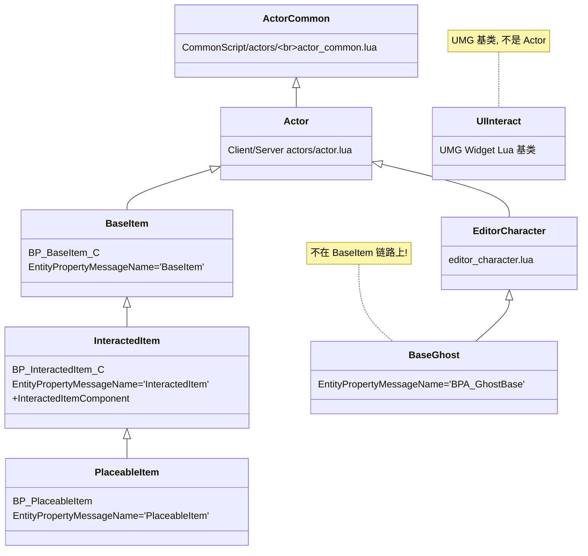
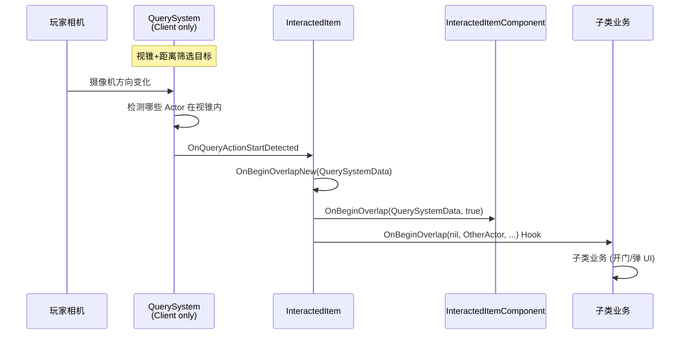
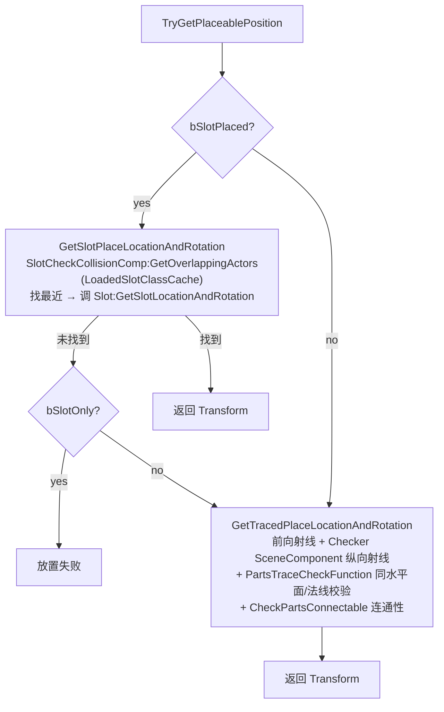
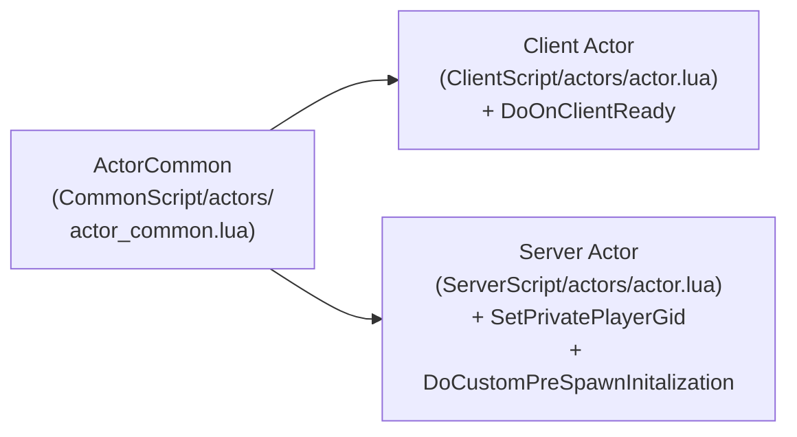

# ⑪ Interactable 基类三件套

`actors/common/interactable/base/` 下的 5 个文件 —— `base_item / interacted_item / placeable_item / base_ghost / ui_interact` —— 构成 60+ 通用可交互物件的共用基础。本页讲清继承链、各自的核心字段、QuerySystem 触发链路、命名约定。

## 继承链总览



## 11.1 base_item.lua — BaseItem

`BaseItem = Class(ActorBase)`，对应蓝图 `BP_BaseItem_C`。

### 核心字段（Initialize 处 rawset）

| 字段 | 语义 |
|---|---|
| `CompFuncNames` | `{{"IsVisible","SetVisibility"},{"GetCollisionEnabled","SetCollisionEnabled"}}` —— 反射对子，给 `StatusFlow_Appear_StoreProperty` 存盘组件可见性/碰撞 |
| `CachedActorID` | 缓存通过 `MutableActorComponent:GetActorID()` 解析的 ActorID（EditorID = "ActorID@GroupID"） |
| `JsonObject` | 从场景 JSON 反序列化的原始数据 |
| `ActorIdList` | `{ActorId=bIsReady}` 字典；`MergeToActorIdList` 合并外部 ID，`CheckChildReady` 全 ready 后置 `bReady=true` |
| `ReadyActorIdList` | UE TArray 副本（蓝图属性，方便 RepNotify 同步） |
| `CompIdList` | `{CompName={ActorId=bReady}}` 子组件维度 ready 表 |
| `CompFuncPropertys` | `StatusFlow_Appear` 存盘前的可见性/碰撞快照 |
| `MainActor` | 主控 Actor 反向引用（多碎片 → 宝箱模式） |

### bNewStatusFW + SetAdvancedLogicalChains

详见 [⑦ Status 状态机](07-status-logical-signal.md)。`bNewStatusFW` 是蓝图 boolean，UCS 调 `SetAdvancedLogicalChains` 决定走新框架还是旧框架。

### 存盘相关

- `EntityPropertyMessageName = "BaseItem"`
- `bHasSaved` 标志位 + `K2_OnSaveToDatabase` / `K2_OnLoadFromDatabaseAllFinish`
- 详见 [⑨ 存盘 / 恢复 / D4 fallback](09-save-load-d4.md)

## 11.2 interacted_item.lua — InteractedItem

`InteractedItem = Class(BaseItem)`，对应 `BP_InteractedItem_C`，新增 `InteractedItemComponent`。`EntityPropertyMessageName = "InteractedItem"`。

### QuerySystem 触发链路



```lua
-- ReceiveBeginPlay (Client only)
function InteractedItem:ReceiveBeginPlay()
    ActorBase.ReceiveBeginPlay(self)
    if self:IsClient() and self.QuerySystem then
        self.QuerySystem.OnQueryActionStartDetected:Add(self, self.OnBeginOverlapNew)
        self.QuerySystem.OnQueryActionStopDetected:Add(self, self.OnEndOverlapNew)
    end
end
```

⚠ **QuerySystem 是 Client-only**，HasAuthority Server 不订阅。**旧版的 BoxComponent.OnComponentBeginOverlap**（如 SealedDoor、JiaSuHuan）走的是另一条路，绕过 QuerySystem。

### ConditionMonitorComponent / GatherConditionIDList

ReceivePostBeginPlay Client 等 OnClientReady 后调 `GatherConditionIDList`：把 `self.ConditionIDList`（蓝图配的条件 ID 数组）和 `sUIMulti[i].ConditionIDList`（多套 UI 各自的条件 ID）合并去重，调 `PlayerState.ConditionMonitorComponent:Server_AddConditionID(IDArry)`。

### sUIMulti 数组

BP 端 `TArray<F_UIMulti>`，每项含 `ConditionIDList` 等字段。**典型用例**：电话亭——有电话卡 → 弹拨号；无 → 弹独白。两套 UI 对应两组激活条件。

### 核心入口分发

`TriggerInteractedItem` / `Server_ReceiveDamage` / `DoClientInteractAction` / `DoServerInteractEndAction` / `DoClientInteractActionWithLocation` 全部转发给 `InteractedItemComponent`，`bNeedHandleReconnected` 时缓存 `InteractPlayerStateGid` 用于断线重连。

`OnRep_InteractPlayerStateGid → DelayDoHandleReconnected → HandleReconnected`：先 `DoClientInteractEndAction` 清理，再以 LocalPlayer + InteractIndex=1 重新进入交互。

### 变身交互 StartShapeShift

通过 `ShapeShiftComponent` 把玩家临时换成另一个 Pawn 才执行后续 `ExecuteAction`，监听 `OnSwitchToStoryPlayerFinish` 事件链。典型用例：`TouShePao.lua`（投射炮）。

## 11.3 placeable_item.lua — PlaceableItem

`PlaceableItem = Class(InteractedItem)`，对应 `BP_PlaceableItem`。`EntityPropertyMessageName = "PlaceableItem"`。

### 可放置物件字段

| 字段 | 语义 |
|---|---|
| `PlaceableParam.bSlotPlaced` | 优先用 Slot（台座、插座）放置 |
| `PlaceableParam.SlotCheckRadius` | Slot 检测球半径 |
| `PlaceableParam.SlotActorClass` | 合法 Slot 的 SoftClass |
| `PlaceableParam.bSlotOnly` | Slot 找不到时是否回退到 Trace 平面放置 |
| `PlaceableParam.bAttachToTarget` | 放置后是否 K2_AttachToActor 到目标 |
| `PlaceableParam.bPlaceableInRange` | 限制只能在原始位置周围 PlaceableRange 内放置 |
| `OriginalLocation/Rotation` | 服务端 ReceiveBeginPlay 记录的初始 Transform |
| `bPlaced/bPickedUp` | 放置/拾取标志，`OnRep_bPickedUp` 触发 OnPickedUp/OnPlaced |
| `AttachedTargetID` | Attach 父对象的 ActorID，重连后仍能 reattach |

### 核心算法



## 11.4 base_ghost.lua — BaseGhost

⚠ **BaseGhost 不在 BaseItem 链路上**：

```lua
-- base_ghost.lua:13,19
local ActorBase = require("actors.common.interactable.base.editor_character")
local BaseGhost = Class(ActorBase)
```

继承 `editor_character`（在 `Client/Server actors/interactable/base/editor_character.lua` 双套实现）。Ghost 是分布式 DS 架构里"代理 Actor"的概念（鬼物 vs 实体）。

### 关键字段

- `BP_LogicalSignalGenerator / BP_LogicalSignalReceiver` —— 新状态框架下"逻辑信号生成器/接收器"组件。`bNewStatusFW=true` 时才在 `ReceiveBeginPlay` 调 `RegisterComponent()`（蓝图上 `bAutoRegister=false`）；让 Ghost 也能在新状态网络里收发信号

```lua
function BaseGhost:ReceiveBeginPlay()
    Super(BaseGhost).ReceiveBeginPlay(self)
    if self.bNewStatusFW then
        self.BP_LogicalSignalGenerator:RegisterComponent()
        self.BP_LogicalSignalReceiver:RegisterComponent()
    end
    self.ItemStatusComponent:SetAdvancedLogicalChains(self.bNewStatusFW)
end
```

- `NPCMoveViaPoint` —— 路点移动组件。`TriggerAtWayPointIndex(index, InWayPointID, trigger_by_mission)` 设置 WayPointID、移动方向、是否 mission 触发

- `EntityPropertyMessageName = "BPA_GhostBase"` —— **注意是 BPA_ 前缀**

### 存盘特例

`K2_OnLoadFromDatabaseAllFinish` 仅走 `ItemStatusComponent:Call_StatusFlowRaw` **旧框架**（不像 BaseItem 还分新旧）。

## 11.5 ui_interact.lua — UI_Interact

**这是 UMG Widget 的 Lua 基类**，不是 Actor。仅 27 行：

```lua
local M = Class()

function M:Construct()
    self.Overridden.Construct(self)
    self:BindDelegate()
end

function M:BindDelegate()
    self.btn_interact.OnPressed:Add(self, M.OnPressed_ButtonInteract)
    self.btn_interact.OnReleased:Add(self, M.OnReleased_ButtonInteract)
end

function M:OnPressed_ButtonInteract() end
function M:OnReleased_ButtonInteract() end

return M
```

**对接 InteractSystem**：本基类**不直接调 InteractSystem**。子类（如 `WBP_Interaction_*`）覆写 `OnPressed_ButtonInteract` 在按下时调玩家身上的 `InteractionComponent` / `PlayerMutableActorControlComponent` 等接口。对应的 InteractedItemComponent UI（`Client_AddInitationScreenUI`）会动态创建并把 Widget 加到 HUD。

## 11.6 共用 ActorBase（ActorCommon）

`actor.lua` 在 ClientScript / ServerScript 双套（**不是 CommonScript**），都 `Class(ActorCommon)`。



- Client 端额外实现 `DoOnClientReady(Callback)` —— 检查 `PlayerController:IsClientReady()`，若已 ready 立刻回调，否则注册 `GameEventBus.OnClientReady` 一次性监听
- Server 端实现 `SetPrivatePlayerGid / GetPrivatePlayerGid` 与 `DoCustomPreSpawnInitalization`（用来按需禁用 Replicates）

## 11.7 EntityPropertyMessageName 的用途

字符串常量 `BaseItem / InteractedItem / PlaceableItem / BPA_GhostBase / ElevatorBase` 等。

它**不在 base_item.lua 内部使用**，而是 **DDS Entity 框架（C++ 侧）用来路由"属性同步消息"的标识**：当 RealActor ↔ Ghost ↔ RO 之间 RPC/属性广播时，C++ 用 `EntityPropertyMessageName` 把消息打散到对应类别的处理器上。子类只需重写常量即可在不改路由代码的前提下加新 Entity 类型。

## 命名约定

| 前缀 | 含义 | 例 |
|---|---|---|
| `BP_xxx.lua` | 1:1 对应蓝图 BP_xxx_C 的 Lua 实现脚本 | `BP_AccelerationRing` `BP_MachineDoor` `BP_TelephoneBooth` |
| `BPA_xxx.lua` | "Blueprint Actor"，复合 / 管理性质 Actor | `BPA_SourceTower` `BPA_TimedChallenges` `BPA_GhostBase` |
| `base_xxx.lua` | 基类/抽象类 | `base_item` `base_door` `base_chest` |
| 纯小写 lua | 早期/非严格命名规范，或多变体共享文件夹时的逻辑层 | `note.lua` `elevator.lua` |

新写的、对应蓝图的就用 BP_ 前缀；管理类/代理类用 BPA_；纯基类用 base_ 前缀。

## RO 子目录约定

`actors/common/interactable/RO/` 下：每个能被 Group Actor 管理、需要跨 Server↔Client 同步状态的可交互物，都对应一个 `BP_xxx_RO.lua`。RO 类继承链与 Actor 主类继承链平行。详见 [⑧ RO 复制对象](08-ro-replication.md)。

## Utils 子目录约定

`actors/common/interactable/RO/Utils/` —— 组合优于继承：RO 类持有 ROUtils 实例，把可复用工具方法（库存查询、Json 解析、奖励计算）放到 ROUtils 里。

类似的还有 `SwapHead/Utils/POLifecycleManager.lua`（PlayerOwned 生命周期管理）。

## 常见反模式与陷阱

1. **bNewStatusFW 双状态框架并存** —— 每个状态切换函数都要 if/else 双分支
2. **复用 BP 但旁路父类销毁链** —— `seal_fragment` 借 `BP_Interacted_PickedItem` 但完全覆写交互（不进背包/不销毁/不 UnRegisterRO）
3. **MergeToActorIdList / CheckChildReady 强依赖 EditorID** —— 跨地图、过期 ID 让 ready 永远不 fire
4. **QuerySystem 仅 Client 订阅 vs Box.OnComponentBeginOverlap 双端** —— 混用导致 Server 收不到点击
5. **OnPlayerStateReady / DoOnClientReady / OnReconnected / OnRep_InteractPlayerStateGid 四套时机** —— 少调一个就在断线重连后看不到 UI
6. **EditorID 解析手写 split** —— `utils.StrSplit(self.EditorID, "@")` 散落多处

## 关键代码位置

- `actors/common/interactable/base/base_item.lua:11` — `local ActorBase = require("common.actor")`
- `base_item.lua:53-69` — Initialize + CompFuncNames
- `base_item.lua:71-73` — UCS / SetAdvancedLogicalChains
- `base_item.lua:295-306` — MainActor / MakeMainActor / GetMainActor
- `actors/common/interactable/base/interacted_item.lua:25-31` — QuerySystem 订阅
- `interacted_item.lua:33-77` — GatherConditionIDList + sUIMulti
- `interacted_item.lua:420-491` — OnReconnected 链
- `actors/common/interactable/base/placeable_item.lua:240-293` — GetSlotPlaceLocationAndRotation
- `placeable_item.lua:336-448` — PartsTraceCheckFunction
- `actors/common/interactable/base/base_ghost.lua:26-33` — RegisterComponent if bNewStatusFW
- `actors/common/interactable/base/ui_interact.lua:1-27` — 全文件
- `ClientScript/actors/actor.lua:18-44` — DoOnClientReady

上一章：[⑩ MissionPuzzle Subsystem](10-missionpuzzle-subsystem.md) | 下一章：[⑫ 用例集 A — 门 / 电梯 / 平台](12-case-doors-elevators.md)
