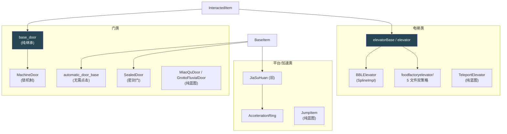
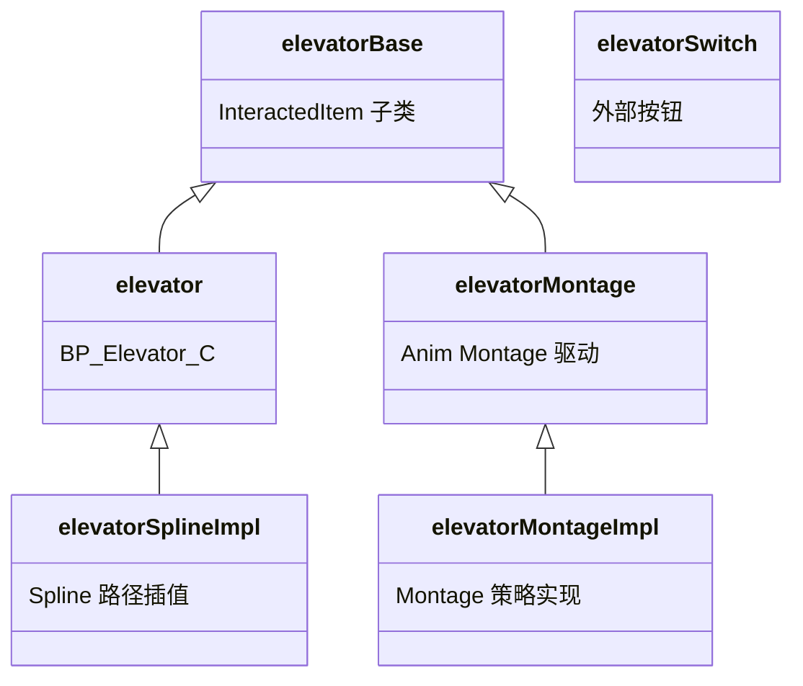
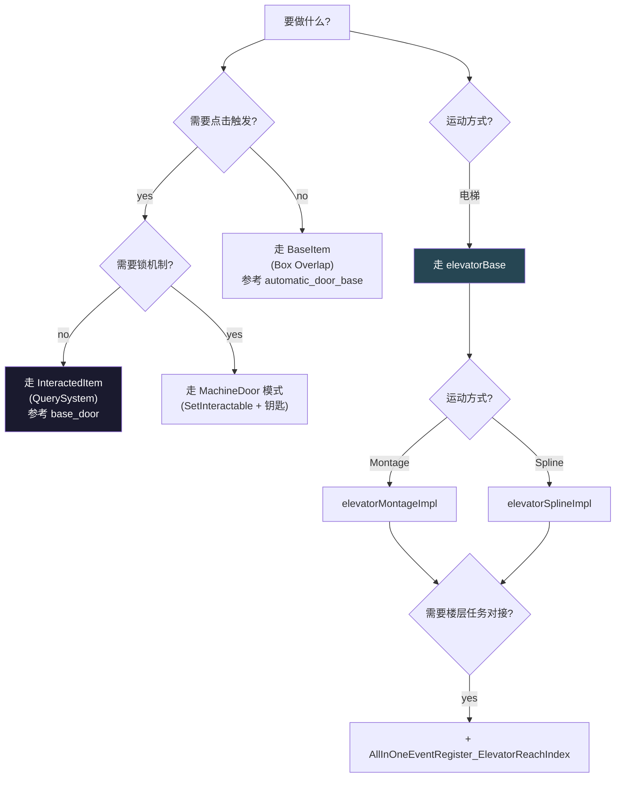

# ⑫ 用例集 A — 门 / 电梯 / 平台

`actors/common/interactable/` 下与"位移、空间通行"相关的可交互物件。本页挑 8 个代表性样例，每个给出继承链、关键字段、触发流程、是否带存盘/双端分套，让 AI 助手做新门/新电梯时有现成的参照。

## 用例分布全景



## 12.1 Door/automatic_door_base.lua（自动门）

- **文件**：`actors/common/interactable/Door/automatic_door_base.lua`
- **继承**：`BaseItem`（直接，不经 InteractedItem ——靠 Box 触发器自动开门，无需点 E）
- **关键字段**：`Timeline / Duration` / `Door_Left, Door_Right` / `LeftDistance, RightDistance` / `BaseLeftLocation, BaseRightLocation` / `DoorType ∈ {SlidingDoor, SwingDoor}` / `bMoving / bControlledByFlow / bControlledByPlayer` / `NewDotRes, NowDotRes`（朝向点积）/ `CloseTime, TimerHandler`
- **触发**：`AllChildReadyClient → BindTriggerActor` 把 `TriggerActor.OnActorBeginOverlap` 接到 `OnBeginOverlap`
  - 玩家进入 → 计算 `Forward · (DoorLocation - PlayerLocation)`
  - 按方向 `PlayTimeline()`
  - 调 `ItemStatusComponent:Call_StatusFlowRawToServer(EditorID, Active)`
- **完成**：Timeline 走完 `OnMoveFinish(Forward)` 启 `CloseTime` 定时器；离开触发器 `OnEndOverlap → ReverseTimeline + Inactive`
- **存盘**：依赖 BaseItem.K2_OnLoadFromDatabaseAllFinish 通过 StatusFlowRaw 恢复（旧框架）
- **多端**：Server `AllChildReadyServer` 留空注释；Client 完整实现。门状态权威在 Server（通过 `Call_StatusFlowRawToServer`）

## 12.2 Door/base_door.lua（通用基础门）

```lua
-- 整文件 15 行
local ActorBase = require("actors.common.interactable.base.interacted_item")
local M = Class(ActorBase)
return M
```

- **继承**：`InteractedItem`
- **特点**：**纯继承，无 Lua 实现**。所有逻辑在蓝图 `BP_BaseDoor_C` 中，使用 interacted_item 提供的 QuerySystem + InteractedItemComponent 链做 E 键开门

## 12.3 MachineDoor/BP_MachineDoor.lua（机械锁门）

- **文件**：`actors/common/interactable/MachineDoor/BP_MachineDoor.lua`
- **继承**：`InteractedItem`
- **关键字段**：`Box`（触发盒）/ `MachineLockInit`（Server 锁初始化）/ `bClaimed` / `MoveLocation`
- **触发**：`ReceiveBeginPlay` Server 调 `MachineLockInit`；强制 `SetInteractable(UnInteractable)`（默认锁住），并 `Box.OnComponentBeginOverlap` Hook（玩家靠近做提示）
- **完成**：通过任务系统/钥匙物品解锁后才 `SetInteractable(Interactable)`，然后走 InteractedItemComponent 标准 E 键链
- **存盘**：默认 BaseItem 链
- **多端**：Server `HasAuthority()` 分支做锁状态权威；Client 仅 UI/触发提示

## 12.4 SealedDoor/BP_SealedDoor.lua（密封门）

- **继承**：`BaseItem`（**不是** InteractedItem，因为不被点击）
- **关键字段**：`Box`（开放区域盒）/ `width`, `height`（蓝图编辑封印面尺寸，运行时 `SetBoxExtent(width,height,curZ)`）
- **触发**：状态机驱动（典型用法是任务/区域触发把它从 Sealed → Active）；`ReceiveBeginPlay` 把蓝图的 width/height 同步到实际 Box 尺寸
- **完成**：靠 Mission/Puzzle 切状态触发显隐+碰撞清除（走 `BaseItem.StatusFlow_Appear`）
- **多端**：无明显 client/server 分套，由 `Multicast_CallStatusFlow_New` 同步

## 12.5 MiaoQuDoor / GrottoFluvialDoor

⚠ 目录存在但**无 .lua 文件**——实现完全在蓝图（`BP_MiaoQuDoor`、`BP_GrottoFluvialDoor`）。这种"空目录壳"的命名约定意味着该机关复杂度低、可视编辑足够，无需 Lua 改写。

## 12.6 elevator/elevatorBase.lua + elevator.lua（标准电梯）

- **继承**：均 `InteractedItem`；`elevator.lua` 是 `BP_Elevator_C` 实现，同级有 `elevator_switch.lua`、`elevatorCall.lua`
- **EntityPropertyMessageName = "ElevatorBase"**
- **关键字段**：`ElevatorID`（关联 DataTable）/ `offsetZ=-100` / `Spline`（轨道）/ `SwitchArray`（外部按钮）/ `CurIndex / TargetIndex` / `Event_AfterDoAction`
- **触发**：`Multicast_ReceiveDamage_RPC(PlayerActor, Damage, ...)` —— 玩家点击/伤害即触发
- **状态**：`SetElevatorMoveState(CurIndex, TargetIndex)` / `BeforeMove / AfterMove` / `AfterDoAction(PointIndex)`（到点后的下一步）
- **任务对接**：`AllInOneEventRegister_ElevatorReachIndex` / `AllInOneAction_ElevatorContinueMove` —— 任务可以监听到楼/控制继续移动
- **完成**：Spline 终点到达后 `Multicast_CallStatusFlow_New(Complete)`
- **多端**：Server 控制 `iCurIndex` 权威；Client 处理 UI 楼层显示、AkAudio

## 12.7 BBLElevator/BP_BBLElevator.lua（BBL 电梯）

```lua
local CommonBase = require("actors.common.interactable.foodfactoryelevator.elevatorSplineImpl")
local M = Class(CommonBase)
local ElevatorStatus = { Idle=0, Rise=1, Descend=2 }  -- Lua local table，非 UE Enum
```

- **继承**：`foodfactoryelevator.elevatorSplineImpl` → 间接 `InteractedItem`
- **关键字段**：`NiagaraLocation`、自定义 `ElevatorStatus`
- **触发**：`ReceiveBeginPlay` 从 `MutableActorSubSystem:GetActorUETransform(ID, true)` 拿到原始 Transform，然后 `PlayElevatorNiagara()` 播放粒子
- **多端**：Client only Niagara

## 12.8 foodfactoryelevator/（食品工厂电梯，5 文件双策略）



5 个文件分别是：
- `elevator.lua` (主入口)
- `elevator_switch.lua` (按钮)
- `elevatorMontage.lua` + `elevatorMontageImpl.lua` (Montage 动画版)
- `elevatorSplineImpl.lua` (Spline 移动版)

**Impl 文件是策略模式的"运动方式实现层"**：`elevatorMontage` 用 Anim Montage 驱动 mesh 移动，`elevatorSpline` 用 Spline 路径插值。BBLElevator 选 Spline 版。

## 12.9 TeleportElevator / JumpItem

⚠ 目录均**只有目录、无 .lua 文件**，实现全在蓝图。

## 12.10 AccelerationRing/BP_AccelerationRing.lua + JiaSuHuan.lua（加速环）

- **文件**：`AccelerationRing/BP_AccelerationRing.lua` + `JiaSuHuan.lua`
- **继承**：`AccelerationRing = Class(JiaSuHuan)`；`JiaSuHuan = Class(BaseItem)`
- **关键字段**：`Box`（触发盒）/ `InHiCharacter` / `BufferVelocity`（local file-scope 变量）
- **触发**：`Box.OnComponentBeginOverlap → OnActorEnter`，强转 `OtherActor:Cast(UE.AHiCharacter)`，再访问 `DodgeComponent / GlideComponent / InteractionComponent`，同时考虑泡泡场景（`PaoPao = OtherActor.InteractionComponent.InInteractActor`）
- **完成**：`AccelerationRing.ChangeStatue` 切状态；旧加速环 JiaSuHuan **不走 InteractedItemComponent**，是纯被动碰撞触发
- **多端**：未见明显 RPC，主要 Client 处理

## 写一个新门 / 新电梯的决策树



## 通用模板（automatic_door_base 风格）

```lua
-- 用于"无需点击、踩到即开"的门
require "UnLua"
local G = require("G")
local ActorBase = require("actors.common.interactable.base.base_item")
local SubsystemUtils = require("common.utils.subsystem_utils")

local M = Class(ActorBase)

function M:AllChildReadyClient(...)
    Super(M).AllChildReadyClient(self, ...)
    self:BindTriggerActor()
end

function M:BindTriggerActor()
    if self.TriggerActor then
        self.TriggerActor.OnActorBeginOverlap:Add(self, M.OnBeginOverlap)
        self.TriggerActor.OnActorEndOverlap:Add(self, M.OnEndOverlap)
    end
end

function M:OnBeginOverlap(OverlappedActor, OtherActor)
    if not OtherActor.PlayerState then return end

    local DoorLocation = self:K2_GetActorLocation()
    local PlayerLocation = OtherActor:K2_GetActorLocation()
    local Forward = self:GetActorForwardVector()
    self.NewDotRes = (DoorLocation - PlayerLocation):Dot(Forward)

    self:PlayTimeline()
    self.ItemStatusComponent:Call_StatusFlowRawToServer(
        self.EditorID, Enum.E_StatusFlowRaw.Active)
end

function M:OnMoveFinish(Forward)
    if self.CloseTime > 0 then
        self.TimerHandler = G.TimerManager:SetTimer(
            {self, M.AutoClose}, self.CloseTime, false)
    end
end

return M
```

## 常见陷阱

1. **automatic_door 走 BaseItem 不走 InteractedItem** —— 否则 QuerySystem 视锥过滤会限制触发场景
2. **elevatorBase EntityPropertyMessageName 是 ElevatorBase**，不要继承时不改
3. **MachineDoor 默认必须 SetInteractable(UnInteractable)** —— 否则锁还没解就能点开
4. **SealedDoor 不走 InteractedItem** —— 它是被动状态机驱动
5. **TeleportElevator / JumpItem / MiaoQuDoor / GrottoFluvialDoor 等无 Lua** —— 修改时直接改蓝图，不要新增 Lua
6. **Spline vs Montage 选择** —— Spline 适合任意路径，Montage 适合骨骼动画驱动的轨道运动；不要混用

## 关键代码位置

- `Door/automatic_door_base.lua:1-237` — 自动门完整实现
- `Door/automatic_door_base.lua:175-209` — OnBeginOverlap → PlayTimeline + Active
- `Door/base_door.lua:1-15` — 整文件（纯继承）
- `MachineDoor/BP_MachineDoor.lua:1-32`
- `SealedDoor/BP_SealedDoor.lua:1-33`
- `elevator/elevatorBase.lua:1-30, 242, 284-307`
- `elevator/elevator.lua:1-30`
- `BBLElevator/BP_BBLElevator.lua:1-29`
- `AccelerationRing/BP_AccelerationRing.lua:1-30`
- `JiaSuHuan.lua:1-32`

上一章：[⑪ Interactable 基类三件套](11-interactable-base.md) | 下一章：[⑬ 用例集 B — 容器 / 物品 / 机械谜题](13-case-containers-items.md)
