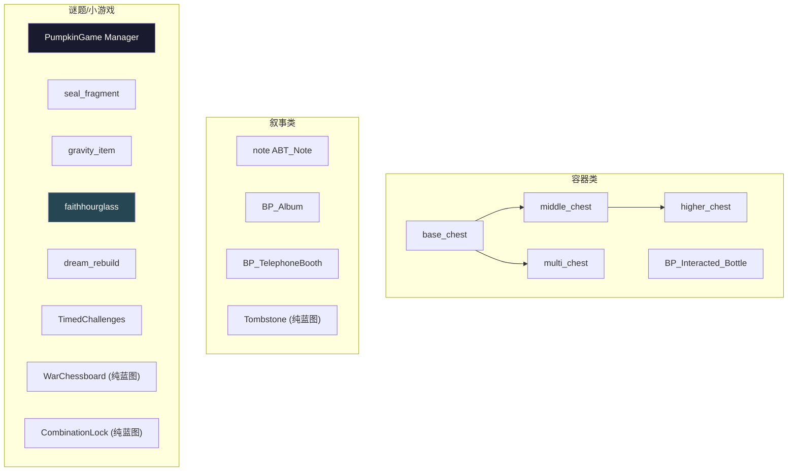
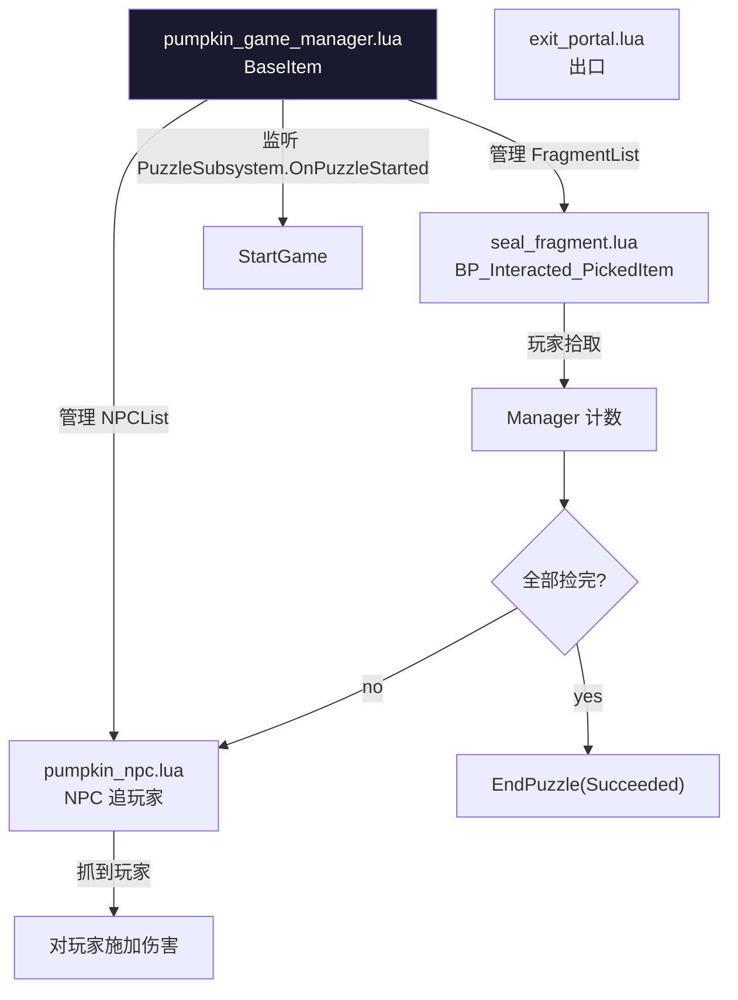

# ⑬ 用例集 B — 容器 / 物品 / 机械谜题

`actors/common/interactable/` 中"叙事 / 收集 / 解谜"维度的可交互物件。本页挑 10 个代表性样例。

## 用例分布



## 13.1 chest 三档（middle_chest / higher_chest / multi_chest）

- **文件**：`actors/common/interactable/chest/base/{middle_chest,higher_chest,multi_chest}.lua`
- **继承链**：`HigherChest → MiddleChest → base_chest`；`MultiChest → base_chest`
- **base_chest 双套**：`Client/Server actors/common/interactable/chest/base/base_chest.lua`，都继承 `CommonScript.actors.common.interactable.chest.base.base_chest`——典型 "CommonScript 共用 + Client/Server 分套" 三明治
- **关键字段**：`VATPlayer` / `Niagara_Open` / `NS_GoldenLight` / `VATAnimIndex`
- **触发**：`MultiChest:DoInteractShow` —— 播 VAT 动画 + AkAudio + Niagara + `Client_RemoveInitationScreenUI`
- **存盘**：BaseItem 链 + RO 存活（`RO/BP_BaseChest_RO.lua`）
- **Server/Client 分套**：奖励发放在 Server（RewardUtils + ChestContentUtil），动效/UI 在 Client

## 13.2 CombinationLock（密码锁）

⚠ 目录存在但**无 .lua 文件**，实现全在蓝图（`BP_CombinationLock`）。

## 13.3 bottle/BP_Interacted_Bottle.lua（摇瓶子）

- **继承**：`InteractedItem`
- **关键字段**：`Bottle_Used` / `SceneCaptureComponent2D`（瓶子内的渲染目标）/ `NS_pick_Common_StaticMesh_Low` / 本地常量 `LEAVE_DISTANCE = 600.0` / `TIMER_ANIM = 1.27` / `TIMER_CARD = 4.0` / `CardID = 180102`
- **触发**：`ReceiveBeginPlay` 读 `Bottle_Used` 判断是否禁用；首次玩 → `SceneCaptureComponent2D.ShowOnlyActors:Clear()` 重置渲染。靠玩家持续 E 键摇晃（间隔 `TIMER_ANIM`），距离 > `LEAVE_DISTANCE` 中断
- **完成**：摇够时间发奖（CardID=180102）+ 设 `Bottle_Used=true`
- **多端**：Server 发奖；Client 摇晃动画 + 距离监控

## 13.4 note/note.lua（字条 ABT_Note）

- **继承**：`InteractedItem`（类名 `ABT_Note`）
- **关键字段**：`isGet` / `BookCaptureComponent2D`（字条内容渲染）/ `Sk_AbtNote`（骨骼模型 + AnimInstance）/ `ABPNote`
- **触发**：客户端 ReceiveBeginPlay 调 `BookCaptureComponent2D:SetActive(false)` + `CaptureOnlyTarget` + `InitNoteAnimation`；交互时打开 NoteWidget UMG
- **完成**：UI 关闭 + `isGet=true` + 进背包（用 ItemUtil）

## 13.5 Album/BP_Album.lua（相册）

- **继承**：`InteractedItem`
- **关键字段**：`test`（占位）/ `TargetPlayer`
- **触发**：
  - `DoServerInteractAction` Server 端 `PlayerMutableActorControlComponent:Server_OnInteractItemFinished(ActorID, "", InteractOptionName)` 通知任务系统
  - `DoClientInteractActionWithLocation` Client 端打开相册 UI
- **完成**：纯 UI 玩法，无销毁。任务系统通过 `Server_OnInteractItemFinished` 监听完成

## 13.6 telephone/BP_TelephoneBooth.lua（电话亭）

- **继承**：`InteractedItem`
- **关键常量**：`NO_CARD_MONOLOGUE_ID = 1009`
- **触发**：`DoClientInteractActionWithLocation` 检查 `ItemUtil.GetAllPhoneCards(self)`：
  - 有卡 → 打开 `UI_InteractionTelephone`
  - 无卡 → 用 `MonoLogueUtils.GenerateMonologueData(1009)` 生成独白，通过 `HudMessageCenterVM` 显示
- **sUIMulti 典型用例**：两套 UI（拨号 vs 独白）按持卡条件切换

## 13.7 Tombstone / WarChessboard

⚠ 目录均**无 .lua 文件**，纯蓝图实现。

## 13.8 PumpkinGame（南瓜小游戏，关卡 Trap 组合）



- **文件**：`PumpkinGame/{pumpkin_game_manager, pumpkin_npc, seal_fragment, exit_portal}.lua`
- **继承**：
  - `PumpkinGameManager = Class(BaseItem)`（管理器，**不被点击**，故是 BaseItem 而非 InteractedItem）
  - `SealFragment = Class(BP_Interacted_PickedItem)`（捡拾物，复用 PickedItem 蓝图但**完全覆写交互**）
- **BP 字段**：`NPCActorIDs / FragmentActorIDs / BehaviorTreeAsset / bUseBehaviorTree / PuzzleID / CatchRadius / MoveSpeed / ViewAngleThreshold / StartDelay / ActivateRadius`
- **触发**：两种启动模式
  - ① **正式**：MissionFlow `mission_node_execute_puzzle` → Manager 监听 `OnPuzzleStarted` → 匹配 PuzzleID → StartGame
  - ② **调试 PuzzleID=0**：`AllChildReadyServer` 后延迟自启动
- **完成**：碎片集齐 → Manager `EndPuzzle(Succeeded)` 走 SuccessPin；失败 → `EndPuzzle(Failed)` 走 FailedPin
- **seal_fragment 反模式（重要）**：⚠ 拾取后**不进背包、不走 PickUp/StatusFlowRaw Complete、不销毁、不 UnRegisterRO**——只是隐藏 + 禁用交互 + 广播 `Server_OnInteractItemFinished(ActorID)`。Manager 监听 `InteractItemFinished` 匹配 ActorID 计数。**这是"复用 BP 但旁路存盘销毁链"的反模式典型**
- **Server/Client**：Manager NPC 控制权威在 Server；Client 跑 BT 模式时只写 Blackboard

## 13.9 gravityitem/gravity_item.lua（重力道具）

- **继承**：`CommonScript.actors.interactable.grapple_point`（钩点的子类）
- **关键字段**：`AOIIndex`（RepNotify）/ `NowIndex` / `bProcessAOI` / `GravityVectors`（蓝图配的方向数组）/ `NowGravity, PreGravity` / `EndRotator, EndQuat` / `GravityModule`
- **触发**：`OnRep_AOIIndex`（重力索引被服务端改变 → Client `ProcessAOI`）；`ProcessAOI` 选向量 → 计算旋转 → `GravityModule:K2_SetRelativeTransform`
- **完成**：持续运行，无明显完成态；通过 AOI Index 切换重力方向
- **同目录变体**：`gravity_item_jump.lua / gravity_item_zero.lua`

## 13.10 faithhourglass/faithhourglass.lua + faithclock.lua（信仰沙漏）

- **继承**：`BaseItem`（不被点，任务驱动）
- **关键字段**：`faithclockcount` / `faithclocksActors` / `is_finished`
- **触发**：`InitFaithClockActors` 读 `JsonObject.sourcepath`，扫描目录下所有 `*.json`，逐个调 `MutableActorSubSystem:GetActorEditorData` 把"信仰钟"Actor 收集进来；玩家在场景里推动各个 faithclock 后由 hourglass 汇总判定
- **完成**：所有 clock 满足条件后 `is_finished=true` + 状态切到 Complete
- **限定**：仅 Client/Standalone 才扫文件（`if not self:IsClient() and not IsStandalone(self) then return end`）

## 13.11 dreamrebuild/dream_rebuild.lua（梦境重建）

- **继承**：`InteractedItem`
- **关键字段**：`DestDissolveValue` / `BlendUpdateFinishCallBack` / `BuildingsConfig`（DataTable Row Name）/ `AssetsTable`（DataTable）/ `WaitLoadingMeshes` / 本地常量 `DISSOLVE_UPDATE_INTERVAL=0.01 / DISSOLVE_UPDATE_SPEED=0.01 / DISSOLVE_PARAM="Dissolve"`
- **触发**：Client `ReceiveBeginPlay` 异步加载 `DT_DreamRebuildBuilding` 行的 Mesh 列表 + 每个 Mesh 的 Materials；`Future.all + AsyncRoutine.await`（kittens 协程）等全部加载完
- **完成**：交互后调动态材质参数 `Dissolve` 从 0 → 1 渐变出现
- **多端**：**完全 Client 表现**，Server 不参与 dissolve

## 13.12 TimedChallenges/timed_challenges_logic_ui.lua（限时挑战 UI 控制器）

```lua
-- 是普通 Lua 类（不是 Actor），通过 BPA_TimedChallenges 持有引用
local M = Class()

function M:Init(actor) end
function M:Dispose() end
function M:SetTrackActorLocation(loc) end
function M:ChangedActiveStatus() end
function M:ChangedInActiveStatus() end
function M:ChangedCompleteStatus() end
function M:AddCountDownTime(t) end
function M:OpenChallengesUI() end
function M:CloseChallengesUI() end

return M
```

- **特点**：把 UI 状态机从 Actor 中独立出来的"逻辑 UI"模式
- **触发**：BPA_TimedChallenges（挂在场景里的 BPA 类型 Actor）的状态变化 callback 进来，按状态切换 HUD（开/关 ChallengesUI 与 ActorTrack）

## 13.13 RO/BP_BaseChest_RO.lua（宝箱 RO 复制对象）

- **继承**：`actors.common.interactable.RO.BP_Interacted_GainItem_RO`
- 用 `ROUtils = require("...RO.Utils.BP_Interacted_PickedItem_ROUtils")` 复用工具
- **关键字段**：`bNeedPlayAppearAudio` (RepNotify) / `bAudioOnRep`，通过 `GetGroupActor():GetROActor(ActorId)` 把 RepNotify 转回到真实 Actor 上
- `Construct` 调 `InitJsonData + VerifyChestType + InitOpenTeamMembers`
- **OnRep_* 是 RO 的核心**：所有跨端属性同步在 RO 上，由 Group Actor 保管 Map<ActorID, RO>，再"找回"实际 Actor 触发回调

## 决策树：写一个新容器/物品/谜题

```mermaid
flowchart TB
    Start["要做什么?"]

    Q1{需要把奖励发玩家?}
    Q2{是单次拾取还是多次互动?}
    Q3{是叙事 (无销毁)?}
    Q4{是组合谜题<br/>(N 个物件 + Manager)?}
    Q5{需要持续 RO 跨周目持久?}

    PathChest["参考 chest 三档<br/>+ ChestContentUtil + RewardUtils"]
    PathPick["参考 BP_Interacted_PickedItem"]
    PathBottle["参考 bottle: 多次摇晃 + 距离检测"]
    PathNarr["参考 note/Album/telephone<br/>纯 UI + Server_OnInteractItemFinished"]
    PathPump["参考 PumpkinGame:<br/>Manager + 多 Actor + Subscribe MissionPuzzle"]
    PathRO["实现 BP_xxx_RO.lua<br/>+ 在 RO 表注册"]

    Start --> Q1
    Q1 -- 多 reward + 复杂内容 --> PathChest
    Q1 -- 单 reward --> Q2
    Q2 -- 单次 --> PathPick
    Q2 -- 多次 --> PathBottle
    Q1 -- 不发奖 --> Q3
    Q3 -- yes --> PathNarr
    Q3 -- no --> Q4
    Q4 -- yes --> PathPump
    Q4 -- no --> Q5
    Q5 -- yes --> PathRO

    style PathPump fill:#1a1a2e,color:#fff
    style PathRO fill:#264653,color:#fff
```

## 通用模板（叙事类，参考 Album）

```lua
require "UnLua"
local ActorBase = require("actors.common.interactable.base.interacted_item")
local UIManager = require('ui.uiframework.ui_manager')
local UIDef = require('ui.uiframework.ui_define')
local SubsystemUtils = require("common.utils.subsystem_utils")

local M = Class(ActorBase)

function M:DoServerInteractAction(PlayerActor, InteractIndex, InteractOptionName)
    Super(M).DoServerInteractAction(self, PlayerActor, InteractIndex, InteractOptionName)
    -- 通知任务系统
    local PlayerControlComp = PlayerActor.PlayerMutableActorControlComponent
    if PlayerControlComp then
        PlayerControlComp:Server_OnInteractItemFinished(
            self:GetActorID(), "", InteractOptionName)
    end
end

function M:DoClientInteractActionWithLocation(PlayerActor, InteractLocation, InteractIndex)
    Super(M).DoClientInteractActionWithLocation(
        self, PlayerActor, InteractLocation, InteractIndex)
    -- 打开 UI
    UIManager:OpenUI(UIDef.UIInfo.UI_MyNarrativeUI, nil, nil, { ActorID = self:GetActorID() })
end

return M
```

## 常见陷阱

1. **复用 BP 但旁路父类销毁链** —— seal_fragment 的反模式；新人很容易因父类升级踩坑
2. **多次互动忘了距离监控** —— bottle 的 LEAVE_DISTANCE 是关键中断
3. **BookCaptureComponent2D 默认 Active** —— note 必须在 ReceiveBeginPlay 关掉，否则每帧 capture 浪费性能
4. **gravity_item RepNotify 客户端等待** —— Server 改 AOIIndex 必须等 OnRep 才生效，不要直接读
5. **dreamrebuild 完全 Client** —— Server 不要写 Dissolve，否则报错
6. **Manager + 子 Actor 启动时机** —— Manager K2_OnLoadFromDatabaseAllFinish 要兜底 10s Timer，防 AllChildReadyServer 不触发
7. **Album 任务通知用 Server_OnInteractItemFinished** —— 不要用 Multicast，由任务系统监听
8. **RO 子目录 SwapHead/Letter/Mineral 各自有 base** —— RO 也有继承链，不要扁平化

## 关键代码位置

- `chest/base/middle_chest.lua:13-15` — `Class(base_chest)`
- `chest/base/multi_chest.lua:13-25` — `DoInteractShow` 播 VAT
- `bottle/BP_Interacted_Bottle.lua:1-43` — LEAVE_DISTANCE / TIMER 常量
- `note/note.lua:1-40` — `BookCaptureComponent2D + Sk_AbtNote`
- `Album/BP_Album.lua:1-40` — `Server_OnInteractItemFinished`
- `telephone/BP_TelephoneBooth.lua:1-44` — `NO_CARD_MONOLOGUE_ID=1009`
- `PumpkinGame/pumpkin_game_manager.lua:1-50` — BP 字段注释
- `PumpkinGame/seal_fragment.lua:1-50` — 借 BP 但旁路 PickUp
- `gravityitem/gravity_item.lua:1-50` — `OnRep_AOIIndex / ProcessAOI`
- `faithhourglass/faithhourglass.lua:1-50` — `InitFaithClockActors` 扫 JSON
- `dreamrebuild/dream_rebuild.lua:1-50` — `Future.all + AsyncRoutine.await`
- `TimedChallenges/timed_challenges_logic_ui.lua:1-50`
- `RO/BP_BaseChest_RO.lua:1-50` — `Class(BP_Interacted_GainItem_RO); ROUtils.new(self)`

上一章：[⑫ 用例集 A](12-case-doors-elevators.md) | 下一章：[⑭ Trap 战斗陷阱与 GAS 集成](14-trap-gas.md)
