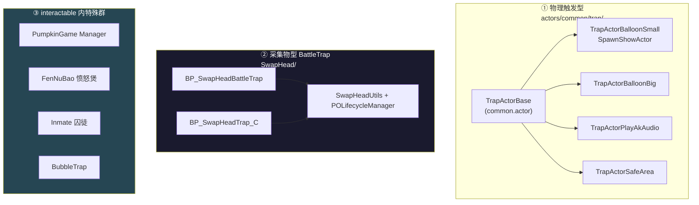
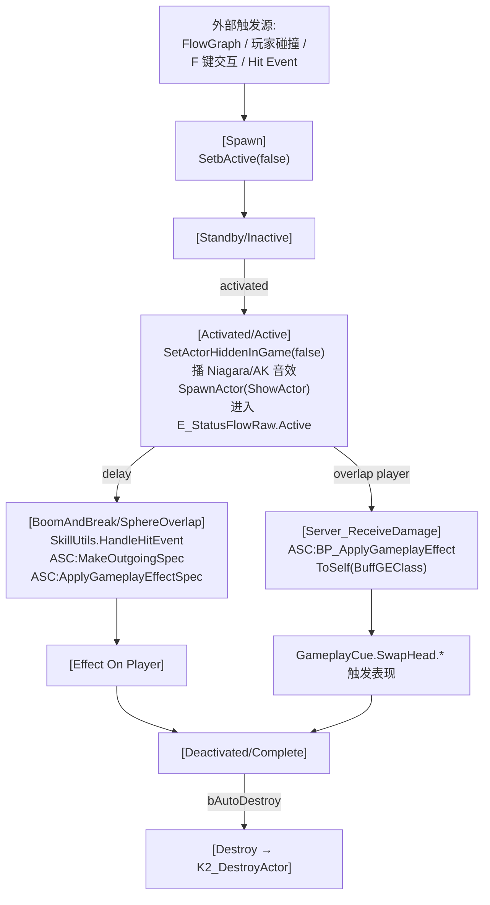
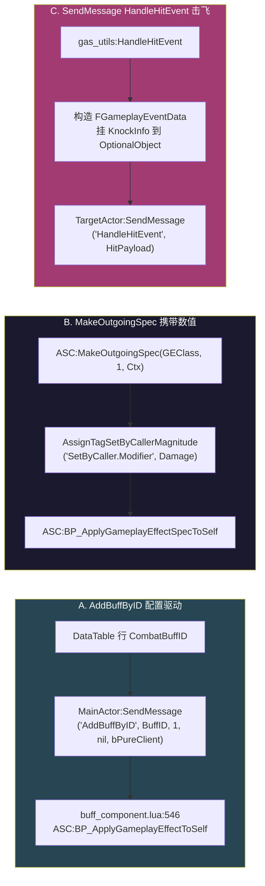
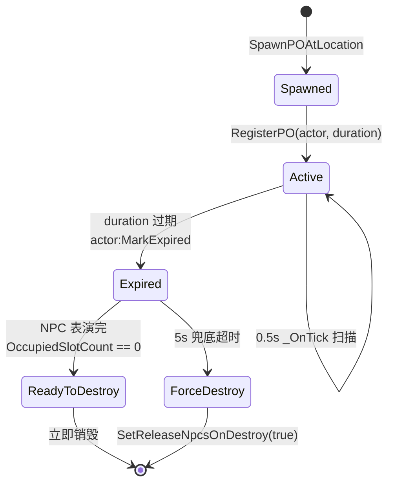

# ⑭ Trap 战斗陷阱与 GAS 集成

Hi 项目里的"陷阱"分**三条血脉**：物理触发型 trap（`actors/common/trap/`）、采集物型 BattleTrap（`SwapHead/`）、interactable 内的特殊小游戏（PumpkinGame / FenNuBao / Inmate）。本页讲清三条血脉的边界、与 GAS 的三种触发方式、PO Lifecycle 管理器、典型样例。

## 三条血脉对照



| 维度 | actors/common/trap/ | interactable/.../*Trap* + 特殊群 |
|---|---|---|
| 父类 | `common.actor` | `BP_Interacted_PickedItem` / `base_item` / `interacted_item` |
| 触发方式 | OnActorBeginOverlap | 交互键 (F)、爆炸半径 Sphere Overlap |
| 与背包 | 无 | 有（PickedItem 流程） |
| 状态机 | 自定义 bActive + Real_On* | `E_StatusFlowRaw` |
| 复制对象 | 不走 RO | 走 RO（actors/common/interactable/RO/SwapHead/*_RO.lua） |
| 主要消费者 | LD 关卡触发 | MissionPuzzle / 主线 / 采集 |

### SwapHead 哪些是"陷阱"

- **真陷阱采集物**：`BP_SwapHeadBattleTrap.lua`、`BP_SwapHeadTrap_C.lua`
- **道具靶子**：`BP_BalloonTarget_*` / `BP_OilTarget_*` / `BP_CandleTarget_*` / `BP_SpotlightTarget_*`（被换头后角色用技能命中），**不是 trap 本身**

### trap 与 puzzle 的区分

trap 通常 **单点 / 即时 / 对玩家产生作用**；puzzle 通常有 **进度（PuzzleID）+ Mission 节点对接**。`pumpkin_game_manager.lua` 兼具两者特征——是 **Puzzle 包装的 Trap 组合**。

## Trap 通用模型



## 与 GAS 的三种触发方式（实测对照）



| 方式 | 适用场景 | 实例 | 优劣 |
|---|---|---|---|
| **A. AddBuffByID** | 持续型 Debuff/换头 Buff，**配置驱动** | `BP_SwapHeadBattleTrap:Server_ReceiveDamage` | 优：配置化、自动 RPC; 劣：不能即时携带 Magnitude |
| **B. MakeOutgoingSpec + SetByCaller** | **携带运行时数值的瞬时伤害** | `BPA_GdObject_Prop_Fennubao:Server_HitTargetActor` | 优：可运行时设伤害值; 劣：直接耦合 GEClass |
| **C. SendMessage HandleHitEvent** | **击飞 / 受击**链路 | `BP_HeadEye:HandleItemCharacterHitEvent` | 优：解耦受击表现; 劣：约定式（依赖 Tag 触发链） |

## EGASAbilityInputID 与 trap

```cpp
// Source/HiGame/Public/HiGame.h:18-30
UENUM(BlueprintType)
enum class EGASAbilityInputID : uint8
{
    None       = 0 UMETA(DisplayName="None"),
    Dodge      = 1,
    DodgeFwd   = 2,
    DodgeLeft  = 3,
    DodgeRight = 4,
    Attack     = 5,
    Combo      = 6,
    Block      = 7,
    Kick       = 8,
};
```

仅枚举 8 项，**全部是玩家主动输入类技能**——**陷阱不直接走 InputID 路径**。陷阱触发的 Ability/GE 全部通过：
1. BuffID 配置驱动
2. GameplayEvent (HandleHitEvent)
3. Tag 触发的 Ability（如换头 Tag 进入战斗状态）

## Damage / 受击事件链

```mermaid
sequenceDiagram
    participant Player as 玩家武器
    participant Recv as BP_ItemCharacterReceiveDamage<br/>Component
    participant Actor as 具体 Trap/Puzzle Actor
    participant ASC as AbilitySystemComponent

    Player->>Recv: OnHitEvent(Instigator, Causer, Hit, KnockInfo)
    Note over Recv: 反射调用
    Recv->>Actor: HandleItemCharacterHitEvent(...)
    Actor->>Actor: 状态校验 (Status == Active?)
    alt Active
        Actor->>Actor: ChangeStatue_Server(Complete)
        Actor->>Actor: GiveRewardToPlayer
    else 非 Active
        Actor->>Actor: 拒绝 (防重复发奖)
    end
```

`BPA_CharacterBaseWithStatus` 是 pumpkin_npc 等 Trap NPC 的基类——它本身没有 trap 受击逻辑，受击逻辑通过附加 `BP_ItemCharacterReceiveDamageComponent` 组件挂上去（**组件化注入而非继承注入**）。

## GameplayTag 速查

实证可 grep:

| Tag | 用途 | 出处 |
|---|---|---|
| `GameplayCue.SwapHead` | 父 Tag，互斥检查 | SwapHeadUtils.lua:301 |
| `SetByCaller.Modifier` | 挂动态伤害值 | Fennubao:199 |
| `Event.Hit.KnockBack.SuperHeavy` | 击飞类型 | gas_utils.lua:19 |
| `OwnerTagQuery` | 蓝图属性，测换头是否已存在 | BP_SwapHeadBattleTrap:128 |
| `SwapHeadTag` / `SkillUtils.GetInBattleTag()` / `BattleStarSkillActiveTag` | 战斗状态查询 | BP_SwapHeadBattleTrap:169-183 |

## Cue / VFX 两条路

- **GameplayCue 路**：换头表现走 `GameplayCue.SwapHead.*`（互斥/恢复在 `SwapHeadUtils.SwitchHeadVisual` 集中）。GC 由 GE 自动触发，是 ASC 的 GC 通道，可双端表现。`BP_SwapHeadBattleTrap:_PrewarmCombatGC` 客户端异步预热 GC 蓝图
- **直接生成路**：愤怒煲（NiagaraEffectSetActive、PlayBoomOnMulticast）、Balloon（PlayAnimSeq、SetActorHiddenInGame 切换）、`HiAudioFunctionLibrary.PlayAKAudio("Scn_Item_PickUp", RoActor)`

## 典型样例深读

### 14.1 SwapHead BattleTrap（战斗换头陷阱）

- **文件**：`BP_SwapHeadBattleTrap.lua + BP_SwapHeadTrap_C.lua + Utils/SwapHeadUtils.lua + Utils/POLifecycleManager.lua`
- **玩法**：玩家进入战斗状态后，靠近 BattleTrap，按 F 交互 → 玩家"换头"（挂战斗 Buff + 替换 SkeletalMesh）→ 用换好的怪谈头释放怪物技能
- **GAS 触发链**：
  1. DataTable 行 `CombatBuffID` → 缓存到 `self._CombatBuffID`
  2. 服务端 `Server_ReceiveDamage`：先用 `OwnerTagQuery` 与 `MainActor.AbilitySystemComponent:MatchGameplayTagQuery` 互斥
  3. `HeadComp:RegisterPlayerHead(Combat, TemplateID)`（注册换头身份）
  4. `MainActor:SendMessage("AddBuffByID", BuffID, 1, nil, bPureClient)` → `buff_component.lua:546` → `ASC:BP_ApplyGameplayEffectToSelf`
  5. GE 触发 `GameplayCue.SwapHead.*` → `SwapHeadUtils.SwitchHeadVisual`
- **RO 版差异**（`BP_SwapHeadBattleTrap_RO.lua`）：用 `Construct` 替代 `ReceiveBeginPlay`，`Server_ReceiveDamage` 后调 `self:PickUp(InteractIndex)`，并自定义 `Status_Complete` 通过 `VisibilityManagementComponent:ControlMaterialParam` 实现 1 秒溶解后再 `UnRegisterRO`

### 14.2 TrapActorBalloonSmallSpawnShowActor

- **文件**：`actors/common/trap/TrapActorBalloonSmallSpawnShowActor.lua`
- **玩法**：地面气球——FlowGraph（关卡剧本）调 `ActiveByFlowGraph(OtherActor)` 激活
- 激活时：
  1. `SetActorHiddenInGame(false)` 显形
  2. `TrySpawnShowActor` 在 `ShowActorSpawnPoint` 处生成"展示 Actor"，调用其 `EventAfterSpawn(self.PlayAnimSeqInfo)`
  3. `TryStiffnessBoss` —— 对当前 Boss 调 `Boss:SendMessage("BSM_EnterStiffness")` 让 Boss 进入硬直态
- **生命周期**：`FlyAnimationOver` 收尾（`AkSwitch` 复位、`bActive=false`、销毁 ShowActor），`ReceiveEndPlay` 兜底销毁
- **GAS 触发**：自身**不直接对玩家施 GE**，伤害通过 Boss 硬直 + 玩家用气球流程实现 —— *Trap-as-tool* 范式
- **CanActive**：`AkSwitch && bActive` 双开关——`AkSwitch` 是音频驱动复位（动画结束才置 true 准许下次），防止重叠激活

### 14.3 Inmate（囚徒）

- **文件**：`CommonScript/actors/interactable/Inmate/BP_InmateItemBase.lua`
- **玩法**：囚徒物件继承 `interacted_item`，只在 `bLock=false && StatusFlowRaw==InActive && bFakeTriggered=false` 时才允许 OnBeginOverlap。`BP_Mission_CallStatusFlow` 接 Appear/Destroy 两态
- **GAS 触发**：本类**不直接走 GAS** —— 它是物件层；陷阱效果由"囚徒释放后 NPC 行为树"完成（NPC 走 BehaviorTree，自身 ASC 通过技能向玩家发起攻击）。即"间接陷阱"——属于 NPC 行为树的入口，触发后由 BT 接管
- **存档**：`Multicast_Dissolve_RPC` 直接 `K2_DestroyActor`，**不走 RO** —— 单次任务对象，不需跨周目复活

### 14.4 PumpkinGame Manager（关卡型 trap 组合）

- **玩法**：典型 N 个 NPC 陷阱 + N 碎片采集 + 1 出口的组合 puzzle
- NPC 追玩家：`CatchRadius / MoveSpeed / ViewAngleThreshold` 由蓝图属性配置。玩家进视野角→冻结追逐，离开→恢复
- Manager 双模式：
  - *Manager 模式（默认）*：用 `Move_To_Way_Point` 邮件驱动 NPC + 自定义 Timer 视野检测
  - *BT 模式*（`bUseBehaviorTree=true`）：Manager 只负责黑板写入 + 事件
- **Puzzle 集成**：`__listen_puzzle_start` 订阅 `UHiMissionPuzzleSubsystem.OnPuzzleStarted/OnPuzzleEnded`。`PuzzleID==0` 时进入 *调试自启动模式*
- **GAS 触发**：南瓜 NPC 抓到玩家 → 自身 ASC 发起技能（继承自 BPA_CharacterBaseWithStatus）；碎片是采集物。Manager 自身**不调用 GAS**
- **Manager 兜底**：`K2_OnLoadFromDatabaseAllFinish` 设 10s 兜底 Timer 防 `AllChildReadyServer` 不触发

### 14.5 FenNuBao（愤怒煲，最纯粹的"伤害陷阱"）

```lua
-- 最干净的 GE 直送范式 (Server_HitTargetActor:172-201)
gas_utils:HandleHitEvent(self, TargetActor, HitResult)  -- 击飞（路径 C）

local ASC = TargetActor.AbilitySystemComponent
local SpecHandle = ASC:MakeOutgoingSpec(EffectClass, 1, FGameplayEffectContextHandle())
UE.UAbilitySystemBlueprintLibrary.AssignTagSetByCallerMagnitude(
    SpecHandle, "SetByCaller.Modifier", self.Damage)
ASC:BP_ApplyGameplayEffectSpecToSelf(SpecHandle)        -- 伤害（路径 B）
```

- **玩法**：玩家踩进 TriggerSphere（默认 200cm）或被 Hit → 1s 描边 → 1.5s 后 `BoomAndBreak` 球形 Overlap 找所有 Pawn → 对每个 Pawn 调 `Server_HitTargetActor` 击飞+伤害 → 2.5s 后 `SetComplete`
- **状态机**：`E_StatusFlowRaw` 完整六态全用上 —— `Status_Active → PlayBoomOnMulticast`，`Status_Complete → OnBoomFinished`，`bAutoDestroy=false` 时回到 Appear 形成**复活循环**

## PO LifecycleManager（PlayerOwned NPC 吸引器）

- **文件**：`CommonScript/actors/interactable/SwapHead/Utils/POLifecycleManager.lua`
- **PO = "NPC 吸引器" Actor (BP_NPCAttractor)** —— 是换头机关 / MassAI F 交互 / ed_runtime 换头三场景共用的*动态生成、吸引附近 NPC 进 Slot 表演*的容器 Actor
- **为何需要管理器**：PO 必须有明确生命周期 —— 持续 N 秒后过期（`DEFAULT_DURATION=10s`）但*不能立即销毁*（NPC 还在表演中），需要事件驱动 + Tick 兜底



**API 速查**：
- `Start(TimerOwner)` / `Stop()` —— 由 LDHeadSwapComponent 在头效果激活/失效时启停
- `RegisterPO(actor, duration)` —— 生成后注册
- `MarkReadyToDestroy(actor)` —— Attractor 检测到 OccupiedSlotCount==0 时调
- `_OnTick` —— 0.5s 一次扫描；过期 / ready_to_destroy / 5s 兜底
- `SpawnPOAtLocation(WorldContext, Location, Config, LoadFn, opts)` —— 统一生成入口

## RO 在 trap 中的使用

- 目录：`actors/common/interactable/RO/SwapHead/{BP_SwapHeadBattleTrap_RO.lua, BP_SwapHeadTrap_RO.lua}`
- 核心差异：RO 版继承 `BP_Interacted_PickedItem_RO` 而非 `BP_Interacted_PickedItem`
- 完成流程：`Status_Complete` 改为先调 `VisibilityManagementComponent:ControlMaterialParam` 做溶解、再 `UnRegisterRO`（防父类 GainItem_RO.Status_Complete 的瞬间消失感）
- **GAS 行为完全一致**：RO 与非 RO 共享同一 GAS 链，**代码复制/粘贴而非抽公共**——存在重复维护成本

## DDS 跨 Server 行为

- 战斗 Buff 走 `bPureClient = SkillUtils.IsSinglePlayerGame(self)` 判定。单机模式下 GE 走纯本地路径不发 RPC
- PO 通过 `ULQTMassPOSubsystem` 子系统创建 —— 所有 trap 衍生 PO 经统一子系统跟踪
- Trap 状态用 `OnRep_bActive`，标准 UE Replication 字段，跨 Server 时由 DDS Routing 层转发

## 常见反模式与陷阱

1. **Tick 检测受击** —— 用组件化注入 `BP_ItemCharacterReceiveDamageComponent` 反射调用 `HandleItemCharacterHitEvent`，避免 Tick 轮询
2. **Server_ReceiveDamage 缺校验** —— `DoClientInteractAction` 应做客户端前置 Tag 校验
3. **GE 不带 SetByCaller** —— 想做"动态伤害"必须用 SetByCaller，不能改 GEClass
4. **MetaData 透传 lightuserdata 崩溃** —— 显式判 `type(MetaData) ~= "string"` 兜底
5. **GC OnRemove 不触发** —— `SwapHeadUtils.RegisterGCCleanup / RunGCCleanup` 补丁
6. **PO 卡死销毁** —— POLifecycleManager 用"事件驱动 + 5s 超时"双保险
7. **PuzzleStartedEvent 未触发** —— Manager K2_OnLoadFromDatabaseAllFinish 10s 兜底 Timer
8. **AttachTo 后位置错位** —— `_ProjectToGround` 显式 LineTrace 把根从胶囊体中心拉到地面

## 关键代码位置

- `actors/common/trap/TrapActorBase.lua:21-29` — 总入口
- `TrapActorBalloonSmallSpawnShowActor.lua:47-53` — ActiveByFlowGraph
- `CommonScript/actors/interactable/SwapHead/BP_SwapHeadBattleTrap.lua:128-147` — Server_ReceiveDamage GAS 链
- `SwapHead/Utils/POLifecycleManager.lua:48-205` — PO Start/Stop + _OnTick
- `SwapHead/Utils/POLifecycleManager.lua:225-402` — SpawnPOAtLocation + _ProjectToGround
- `SwapHead/Utils/SwapHeadUtils.lua:296-358` — ShouldSkipGCRemove + SwitchHeadVisual
- `FenNuBao/BPA_GdObject_Prop_Fennubao.lua:150-202` — BoomAndBreak + Server_HitTargetActor 范式
- `common/utils/gas_utils.lua:15-43` — HandleHitEvent
- `CommonScript/actors/components/buff_component.lua:540-546` — ASC:BP_ApplyGameplayEffectToSelf
- `actors/common/components/BP_ItemCharacterReceiveDamageComponent.lua:24-28` — OnHitEvent 反射
- `CommonScript/actors/interactable/Inmate/BP_InmateItemBase.lua:18-22` — Inmate 三条件门
- `actors/common/interactable/PumpkinGame/pumpkin_game_manager.lua:79-119` — PuzzleSubsystem 监听
- `Source/HiGame/Public/HiGame.h:18-30` — EGASAbilityInputID

上一章：[⑬ 用例集 B](13-case-containers-items.md) | 下一章：[⑮ Cookbook — 新机关 / 新可交互物件模板](15-cookbook.md)
