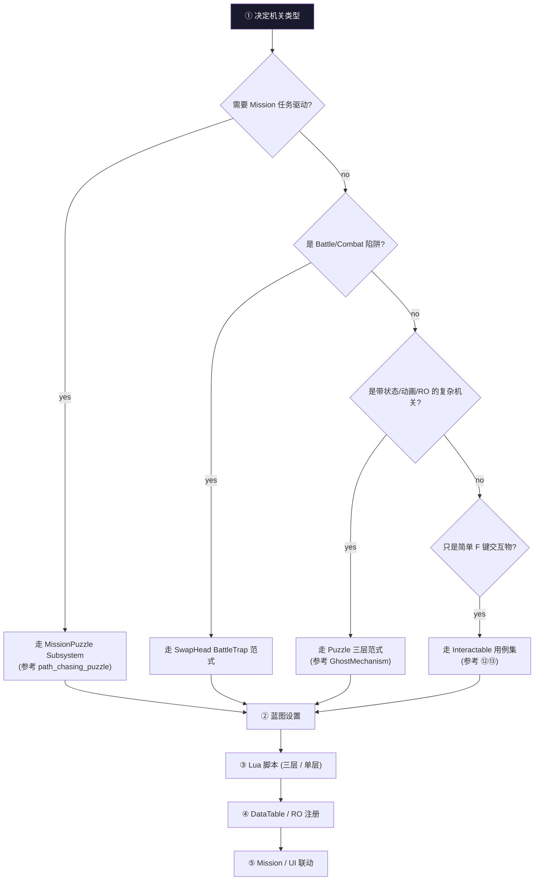
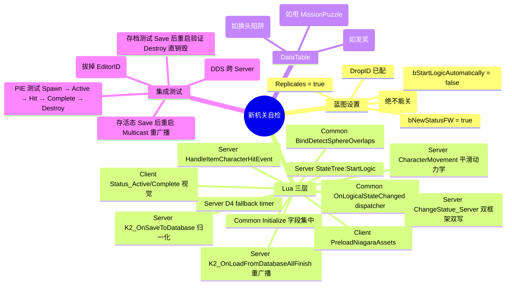

# ⑮ Cookbook — 新机关 / 新可交互物件模板

把前面 14 章的知识合成"5 步标准流程 + 4 套真实代码骨架"，让 AI 助手 / 玩法工程师拿来就能改。

## 5 步标准流程



### 步骤详解

**① 决定机关类型** —— 见上图决策树

**② 蓝图设置**
- 蓝图继承：BP_BaseItem / BP_InteractedItem / BP_PlaceableItem / BP_Interacted_PickedItem
- 关键开关：
  - `bNewStatusFW = true`（新框架）
  - `bAutoRegister = true`（**绝不能关**）
  - `bStartLogicAutomatically = false`（StateTree 手动启动）
  - `Replicates = true`（Server 权威）
- 必加组件：
  - `ItemStatusComponent`
  - `BP_LogicalSignalGenerator/Receiver`（如用新框架）
  - `BP_ItemCharacterReceiveDamageComponent`（如要受击）
  - `InteractedItemComponent`（如需 F 键交互）

**③ Lua 脚本（三层 / 单层）**
- **三层**（标准 Puzzle 范式）：
  - `CommonScript/actors/Puzzle/<Mech>/<File>.lua` —— 基类
  - `ServerScript/actors/Puzzle/<Mech>/<File>.lua` —— `Class(CommonBase)` + Server 业务
  - `ClientScript/actors/Puzzle/<Mech>/<File>.lua` —— `Class(CommonBase)` + Client 业务
- **单层**（简单 Interactable）：
  - 直接在 `actors/common/interactable/` 下写 `BP_xxx.lua`
- **蓝图侧的路由**：通过 `GetServerModuleName / GetClientModuleName` 关联三层

**④ DataTable / RO 注册**
- 配置 DataTable 行（reward / config 数据）
- 如需 RO：在 `actors/common/interactable/RO/` 创建 `BP_xxx_RO.lua` + 在 RO 注册表登记

**⑤ Mission / UI 联动**
- Mission：通过 `mission_node_execute_puzzle` 配 PuzzleID（`mission_puzzle_config` 表）
- UI：在 `Content/Script/ui/` 下做 WBP + Lua VM
- 状态变化通过 `OnLogicalStateChanged` / `OnPuzzleStarted` 等事件订阅

## 模板 A：标准 Puzzle 机关（参考 GhostMechanism）

### A.1 CommonScript/actors/Puzzle/MyMech/BPA_MyMech.lua

```lua
require "UnLua"
local G = require("G")
local CharacterBaseWithStatus = require("actors.common.character.BPA_CharacterBaseWithStatus")

local LOG_TAG = "MyMech"
local MyMechCommon = Class(CharacterBaseWithStatus)

-- ========== Initialize 字段集中声明 ==========
function MyMechCommon:Initialize(...)
    Super(MyMechCommon).Initialize(self, ...)
    self.bPlayerInInner = false
    self.bPlayerInOuter = false
    self._bStateInitialized = false
    self._initFallbackHandle = nil
    self._destroyTimerHandle = nil
end

function MyMechCommon:ReceiveBeginPlay()
    Super(MyMechCommon).ReceiveBeginPlay(self)
    self:_DestroyASCIfPresent()
    self.ItemCharacterDamageReceiver:SetActive(true)
    self.CapsuleComponent:SetCollisionResponseToChannel(
        UE.ECollisionChannel.ECC_GameTraceChannel5, UE.ECollisionResponse.ECR_Overlap)
    self:BindDetectSphereOverlaps()
end

-- ========== Overlap 绑定（Common 层）==========
function MyMechCommon:BindDetectSphereOverlaps()
    if self.InnerDetectSphere then
        self.InnerDetectSphere.OnComponentBeginOverlap:Add(self, MyMechCommon.OnBeginOverlap_Inner)
        self.InnerDetectSphere.OnComponentEndOverlap:Add(self, MyMechCommon.OnEndOverlap_Inner)
        self.InnerDetectSphere:SetCollisionResponseToChannel(
            UE.ECollisionChannel.ECC_Pawn, UE.ECollisionResponse.ECR_Overlap)
    end
end

function MyMechCommon:OnBeginOverlap_Inner(...) end  -- Server override
function MyMechCommon:OnEndOverlap_Inner(...) end

-- ========== ChangeStatue_Server 双框架双写 ==========
function MyMechCommon:ChangeStatue_Server(EnumKey)
    if not self.ItemStatusComponent then return end
    self.ItemStatusComponent:Call_StatusFlowRaw(0, EnumKey, self.bNewStatusFW)
    if self:GetAdvancedLogicalChains() then
        local stateName = self:_EnumKeyToStateName(EnumKey)
        self:ServerSetAdvancedLogicalState(stateName, false)
    end
end

-- ========== OnLogicalStateChanged dispatcher ==========
function MyMechCommon:OnLogicalStateChanged(NewState, OldState)
    self._bStateInitialized = true
    local StateName = NewState.StateName.Name
    if StateName == "Appear" then
        self:ChangeStatue_Server(Enum.E_StatusFlowRaw.Active)
    elseif StateName == "Active" then
        self:Status_Active()
    elseif StateName == "Complete" then
        self:Status_Complete()
    elseif StateName == "Destroy" then
        self:Status_Destroy()
    end
end

-- ========== Status_* skeleton ==========
function MyMechCommon:Status_Active()
    G.log:info(LOG_TAG, "[Common:Status_Active]")
end
function MyMechCommon:Status_Complete()
    G.log:info(LOG_TAG, "[Common:Status_Complete]")
end
function MyMechCommon:Status_Destroy()
    self:K2_DestroyActor()
end

return MyMechCommon
```

### A.2 ServerScript/actors/Puzzle/MyMech/BPA_MyMech.lua

```lua
require "UnLua"
local G = require("G")
local CommonBase = require("CommonScript.actors.Puzzle.MyMech.BPA_MyMech")
local ROUtils = require("actors.common.interactable.RO.Utils.BP_Interacted_PickedItem_ROUtils")

local LOG_TAG = "MyMech"
local FALLBACK_DELAY = 0.5     -- D4 fallback
local DESTROY_DELAY  = 1.5

local MyMechServer = Class(CommonBase)

function MyMechServer:ReceiveBeginPlay()
    self.Super.ReceiveBeginPlay(self)

    -- CharacterMovement 平滑动力学
    if self.CharacterMovement then
        self.CharacterMovement.MaxWalkSpeed              = self.PatrolSpeed or 200.0
        self.CharacterMovement.MaxAcceleration            = 600.0
        self.CharacterMovement.BrakingDecelerationWalking = 400.0
        self.CharacterMovement.RotationRate               = UE.FRotator(0, 360, 0)
        self.CharacterMovement.bOrientRotationToMovement   = true
    end

    if self.StateTreeComponent then
        self.StateTreeComponent:StartLogic()
    end

    -- D4 fallback
    self._initFallbackHandle = G.TimerManager:SetTimer(
        {self, self.CheckAndForceInitialState}, FALLBACK_DELAY, false)
end

function MyMechServer:OnBeginOverlap_Inner(_, OtherActor, ...)
    if not OtherActor or not OtherActor.PlayerState then return end
    self.bPlayerInInner = true
end
function MyMechServer:OnEndOverlap_Inner(_, OtherActor, ...)
    if not OtherActor or not OtherActor.PlayerState then return end
    self.bPlayerInInner = false
end

-- 受击入口
function MyMechServer:HandleItemCharacterHitEvent(Instigator, Causer, Hit, KnockInfo)
    local status = self.ItemStatusComponent:GetStatusFlowRaw()
    if status ~= Enum.E_StatusFlowRaw.Active then return end
    self:ChangeStatue_Server(Enum.E_StatusFlowRaw.Complete)
    self:GiveRewardToPlayer(Instigator)
end

function MyMechServer:GiveRewardToPlayer(PlayerPawn)
    if not self._ROUtils then self._ROUtils = ROUtils.new(self) end
    if self.DropID and self.DropID > 0 then
        self._ROUtils:AddItemToPlayerBag(PlayerPawn, self.DropID)
    end
end

-- Status_Complete 触发延迟销毁
function MyMechServer:Status_Complete()
    self.Super.Status_Complete(self)
    self._destroyTimerHandle = G.TimerManager:SetTimer(
        {self, self._TriggerDestroy}, DESTROY_DELAY, false)
end

function MyMechServer:_TriggerDestroy()
    self:ChangeStatue_Server(Enum.E_StatusFlowRaw.Destroy)
end

-- 存盘归一化
function MyMechServer:K2_OnSaveToDatabase()
    local raw = self.ItemStatusComponent:GetStatusFlowRaw()
    if raw == Enum.E_StatusFlowRaw.Complete then
        self.ItemStatusComponent.StatusFlowRaw.eStatusFlowRaw = Enum.E_StatusFlowRaw.Destroy
    end
    self.Super.K2_OnSaveToDatabase(self)
end

-- Load 重广播
function MyMechServer:K2_OnLoadFromDatabaseAllFinish()
    if self.ItemStatusComponent and
       self.ItemStatusComponent:GetStatusFlowRaw() ~= 0 then
        self.bHasSaved = true
    end
    self.Super.K2_OnLoadFromDatabaseAllFinish(self)
    self._bStateInitialized = true

    if not self.bHasSaved then return end
    local raw = self.ItemStatusComponent:GetStatusFlowRaw()

    if raw == Enum.E_StatusFlowRaw.Destroy or
       raw == Enum.E_StatusFlowRaw.Complete then
        self:K2_DestroyActor()
        return
    end
    self:ServerSetAdvancedLogicalState(self:_EnumKeyToStateName(raw), true)
end

-- D4 fallback
function MyMechServer:CheckAndForceInitialState()
    self._initFallbackHandle = nil
    if self._bStateInitialized then return end
    self:ChangeStatue_Server(Enum.E_StatusFlowRaw.Appear)
end

return MyMechServer
```

### A.3 ClientScript/actors/Puzzle/MyMech/BPA_MyMech.lua

```lua
require "UnLua"
local CommonBase = require("CommonScript.actors.Puzzle.MyMech.BPA_MyMech")

local MyMechClient = Class(CommonBase)

function MyMechClient:ReceiveBeginPlay()
    self.Super.ReceiveBeginPlay(self)
    self:PreloadNiagaraAssets()
end

function MyMechClient:PreloadNiagaraAssets()
    -- Kittens async loader 异步加载 Niagara 系统
end

function MyMechClient:Status_Active()
    self.Super.Status_Active(self)
    self:ActivateVisuals()
end

function MyMechClient:Status_Complete()
    self.Super.Status_Complete(self)
    self:DeactivateVisuals()
    self:PlayDissipateEffect()
end

function MyMechClient:ActivateVisuals() end
function MyMechClient:DeactivateVisuals() end
function MyMechClient:PlayDissipateEffect() end

return MyMechClient
```

## 模板 B：简单 F 键交互物（参考 Album）

```lua
-- actors/common/interactable/MyArtifact/BP_MyArtifact.lua
require "UnLua"
local ActorBase = require("actors.common.interactable.base.interacted_item")
local UIManager = require('ui.uiframework.ui_manager')
local UIDef = require('ui.uiframework.ui_define')

local M = Class(ActorBase)

function M:DoServerInteractAction(PlayerActor, InteractIndex, InteractOptionName)
    Super(M).DoServerInteractAction(self, PlayerActor, InteractIndex, InteractOptionName)
    -- 通知任务系统
    if PlayerActor.PlayerMutableActorControlComponent then
        PlayerActor.PlayerMutableActorControlComponent:Server_OnInteractItemFinished(
            self:GetActorID(), "", InteractOptionName)
    end
end

function M:DoClientInteractActionWithLocation(PlayerActor, InteractLocation, InteractIndex)
    Super(M).DoClientInteractActionWithLocation(
        self, PlayerActor, InteractLocation, InteractIndex)
    UIManager:OpenUI(UIDef.UIInfo.UI_MyArtifact, nil, nil,
        { ActorID = self:GetActorID() })
end

return M
```

## 模板 C：MissionPuzzle 任务驱动（参考 path_chasing_puzzle）

### C.1 配置 mission_puzzle_config

```lua
-- common/data/mission_puzzle_config.lua
return {
    data = {
        [1001] = {
            time_limit = 30.0,
            target_count = 5,
            puzzle_class = "BP_MyPuzzle",
            sync_policy = 2,                  -- ServerAndClient
            start_with_countdown = true,
            countdown = 3.5,
        }
    }
}
```

### C.2 UHiMissionPuzzle 子类 Lua 绑定

```lua
-- ServerScript/mission/mission_puzzle/mission_my_puzzle.lua
local G = require("G")
local SubsystemUtils = require("common.utils.subsystem_utils")
local M = Class()

function M:OnPuzzleStart(Spec)
    -- Spec.EntryID, Spec.PuzzleID, ...
    -- 找场景 Actor 并切到 Active
    local Subsystem = SubsystemUtils.GetMutableActorSubSystem(self)
    -- ... 业务逻辑
end

function M:OnPuzzleEnd(Spec, Result)
    -- 清理 / 通知场景 Actor
end

return M
```

### C.3 Mission Flow 配置

在编辑器里 mission_node_execute_puzzle 节点上：
- `PuzzleId = 1001`
- 连 SuccessPin → 后续成功流程
- 连 FailedPin → 失败处理

## 模板 D：战斗陷阱（参考 SwapHead BattleTrap）

```lua
-- CommonScript/actors/interactable/MyBattleTrap/BP_MyBattleTrap.lua
require "UnLua"
local G = require("G")
local CommonBase = require("actors.common.interactable.RO.SwapHead.BP_SwapHeadBattleTrap_RO")
local SkillUtils = require("CommonScript.skill.SkillUtils")

local M = Class(CommonBase)

function M:Construct()
    Super(M).Construct(self)
    -- 读 DataTable 拿 BuffID
    self._CombatBuffID = self:_LoadCombatBuffID()
end

function M:DoClientInteractAction(InteractIndex)
    -- 客户端前置 Tag 校验
    local PlayerActor = self:GetMainActor()
    if not PlayerActor or not PlayerActor.AbilitySystemComponent then return end
    if PlayerActor.AbilitySystemComponent:HasMatchingGameplayTag(
           SkillUtils.GetInBattleTag()) == false then
        return  -- 非战斗状态拒绝
    end
    Super(M).DoClientInteractAction(self, InteractIndex)
end

function M:Server_ReceiveDamage(PlayerActor, Damage, ...)
    -- OwnerTagQuery 互斥换头检查
    if PlayerActor.AbilitySystemComponent:MatchGameplayTagQuery(self.OwnerTagQuery) then
        return  -- 已有同类 head
    end

    -- 注册玩家头
    if PlayerActor.HeadComp then
        PlayerActor.HeadComp:RegisterPlayerHead(
            UE.E_PlayerHeadType.Combat, self.TemplateID)
    end

    -- 施加 Buff
    local bPureClient = SkillUtils.IsSinglePlayerGame(self)
    PlayerActor:SendMessage("AddBuffByID", self._CombatBuffID, 1, nil, bPureClient)

    -- 走 PickedItem 流程
    self:PickUp(1)
end

return M
```

## 配置自检清单



下一章：[⑯ 陷阱与自检清单](16-pitfalls.md)
