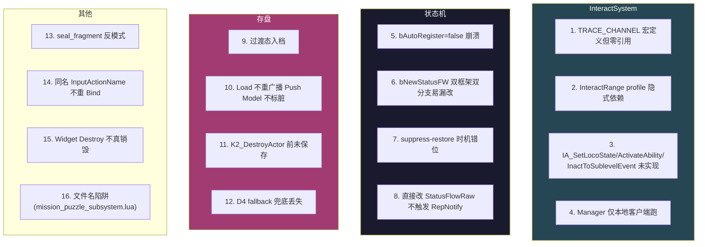
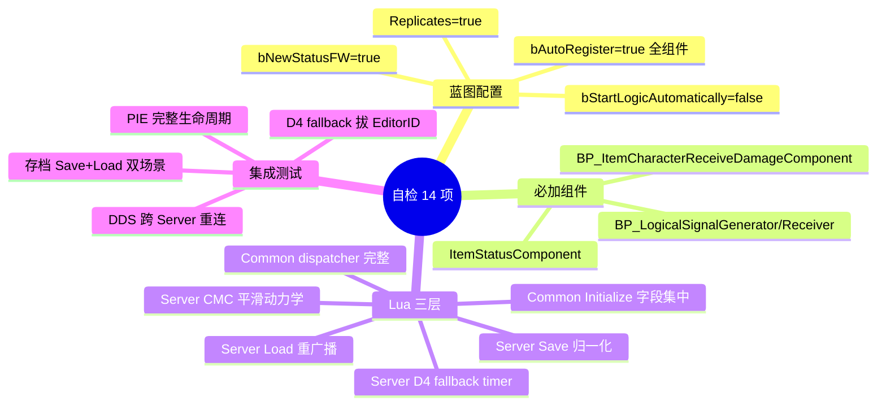

# ⑯ 陷阱与自检清单

把前 15 章的"陷阱"集中到这里，提供 16 类陷阱表 + 14 项自检清单 + 性能项。

## 16 类陷阱速查表



### InteractSystem 陷阱

#### 1. TRACE_CHANNEL_INTERACT_FOCUS_TEST 宏定义但全模块零引用
- **现象**：误以为要"配交互 trace channel"
- **真相**：整个交互依赖的是 Capsule overlap，不是 LineTrace
- **修法**：忽略这个宏；DefaultEngine.ini 中 GameTraceChannel5 的实际名字是 `SkillDamaged`（受击通道）
- 详见 [② InteractSystem](02-interactsystem-concepts.md)

#### 2. InteractRange collision profile 隐式依赖
- **现象**：物件配了 InteractItemComponent 但按 F 没反应
- **真相**：DefaultEngine.ini 中**未定义** InteractRange profile，Sphere 用引擎 fallback，可能不与 Pawn Capsule overlap
- **修法**：在 `[/Script/Engine.CollisionProfile]` 段补 `+Profiles=(Name="InteractRange",...)`
- 详见 [③ InteractRange](03-interact-range.md)

#### 3. IA_SetLocoState / IA_ActivateAbility / IA_InactToSublevelEvent 未实现
- **现象**：蓝图配了之后按 F 没反应
- **真相**：枚举有，UPROPERTY EditCondition 也亮着，但 `TryInteract` switch 没 case
- **修法**：要走 GAS 用 `IA_SendGameplayEventWithPayload` + Ability Trigger 配置间接达成
- 详见 [④ InteractItem](04-interact-item.md)

#### 4. Manager 仅本地客户端跑
- **现象**：在 Manager 里写 Server 业务无效
- **真相**：`if (OwnerController->IsLocalController()) return;` 一行守卫掉所有 DS 上的逻辑
- **修法**：服务器逻辑必须走 GAS 或 RPC
- 详见 [⑤ Manager + Widget](05-interact-manager-widget.md)

### 状态机陷阱

#### 5. bAutoRegister=false 崩溃 ⚠ 高优先级
- **现象**：Client-predicted hit 在 `UTargetTagRequirementsGameplayEffectComponent::CanGameplayEffectApply` 解引用 nullptr 崩溃 @ 0x190
- **真相**：关掉破坏 UActorComponent 生命周期契约 → OnRegister 不跑 → ASC.Owner / AbilityActorInfo 未初始化
- **修法**：保持默认 AutoRegister=true，运行时用 `K2_DestroyComponent` 清理 ASC（纯本地操作）
- 详见 [⑦ Status 状态机](07-status-logical-signal.md)

#### 6. bNewStatusFW 双框架双分支易漏改
- **现象**：状态切换在新框架下生效但旧框架下卡住（或反之）
- **真相**：每个状态切换函数都要 `if/else` 双分支，AllInOne 任务挂钩三类同样按 if 分两条独立链路
- **修法**：用 `ChangeStatue_Server` 双框架双写包好

#### 7. suppress-restore 时机错位
- **现象**：基类 BeginPlay 已经推 Appear 但鸟还没隐藏好导致闪现
- **真相**：必须在 `Super.ReceiveBeginPlay` 前压 bNewStatusFW，之后恢复
- **修法**：见 [⑦ Status 状态机](07-status-logical-signal.md) 的 SurveillanceBird 技巧

#### 8. 直接改 StatusFlowRaw 字段
- **现象**：状态变了但 Client 不响应
- **真相**：直接改字段不触发 RepNotify
- **修法**：必须走 `Call_StatusFlowRaw` 或 `ServerSetAdvancedLogicalState`，**Save 归一化时除外**（那是有意绕过任务链副作用）

### 存盘陷阱

#### 9. 过渡态入档
- **现象**：玩家断网/离开 AOI 后存档锁在 Complete，重新登录看到机关再死一次
- **修法**：`K2_OnSaveToDatabase` 中 Complete → Destroy 归一化（直接改字段，**不走** Call_StatusFlowRaw 避免触发 OnItemStatusCondition 任务链副作用）
- 详见 [⑨ 存盘 / 恢复 / D4 fallback](09-save-load-d4.md)

#### 10. Load 不重广播 Push Model 不标脏
- **现象**：传送返回幽灵消失
- **真相**：SaveGame 反序列化直接拷字段不走 SetCurrentState → Push Model 不标脏 → 初始 Replication 与默认值判等抑制
- **修法**：`ServerSetAdvancedLogicalState(state, true)` 强制 force flag → 绕过同值去重 → MARK_PROPERTY_DIRTY

#### 11. K2_DestroyActor 前未保存
- **现象**：DancingSofa 玩完后重新登录复活
- **真相**：UE 的 EndPlay(Destroyed) 走 ActorSaveType_Destroy，DDS 框架 IsSaveTypeNeedWriteBackProperties 返回 false → 属性不写回
- **修法**：在 K2_DestroyActor 前显式 `EntityComponent:K2_SaveActor()`

#### 12. D4 fallback 兜底丢失
- **现象**：Developers 测试地图机关变"哑巴"
- **真相**：Entity 加载链路掉线 / 无 EditorID → K2_OnLoadFromDatabaseAllFinish 永远不调
- **修法**：Server ReceiveBeginPlay 启 0.5s timer，超时 ChangeStatue_Server(Appear)

### 其他陷阱

#### 13. seal_fragment 反模式（复用 BP 但旁路父类销毁链）
- **现象**：父类升级时崩坏
- **真相**：`SealFragment = Class(BP_Interacted_PickedItem)` 但拾取后**不进背包不销毁不 UnRegisterRO**
- **修法**：清晰文档化此反模式；尽量不要新写这种类型，用 BaseItem 自己实现

#### 14. 同名 InputActionName 不重 Bind
- **现象**：改了 InputActionName 但运行时还是用旧 binding
- **真相**：SetNewFocusingComponent 切换时若 InputActionName 相同则不重新 Bind（性能优化）
- **修法**：改名后需重启焦点切换才生效（或主动调 ForceRefreshObserveComponents）

#### 15. Widget Destroy 不真销毁
- **现象**：Updater 还每帧 Tick 已不可见的 Widget
- **真相**：`Destroy()` 只 SetVisibility(Hidden)+RemoveFromParent，再调用 RemoveFromParent 才会从 Updater 列表里 Unregister
- **修法**：用 RemoveFromParent 而非 Destroy

#### 16. 文件名陷阱：mission_puzzle_subsystem.lua ≠ Puzzle Subsystem
- **现象**：以为这是 PuzzleSubsystem 的 Lua 镜像
- **真相**：内部 Class 名是 `MissionTrackingManager_S`，实际是 MissionTracking 的实现
- **修法**：Puzzle 的 Server 侧 manager 职责完全沉到 C++ Subsystem，Lua 不再做 manager

## 14 项自检清单（新机关上线前）



| # | 项 | 检查方法 |
|---|---|---|
| 1 | 蓝图 `bNewStatusFW = true` | 编辑器查看 BP 默认值 |
| 2 | 所有 ActorComponent `bAutoRegister = true` | grep "bAutoRegister.*false" 应为空 |
| 3 | 蓝图 `Replicates = true` | Server 权威必备 |
| 4 | StateTree `bStartLogicAutomatically = false` | 让 Server 手动启动 |
| 5 | Common 层 Initialize 字段集中声明 | 避免 Server/Client 失同步 |
| 6 | OnLogicalStateChanged dispatcher 完整 | 所有状态都映射到 Status_* |
| 7 | Server CharacterMovement 平滑动力学 | MaxAcc=600/Brake=400/Rot=(0,360,0) |
| 8 | Server StateTree:StartLogic | 仅 Server 调，等 NSM 配置完成 |
| 9 | Server D4 fallback timer 0.5s | CheckAndForceInitialState 兜底 |
| 10 | Server K2_OnSaveToDatabase 归一化 | Complete → Destroy 直改字段 |
| 11 | Server K2_OnLoadFromDatabaseAllFinish | bForce=true 重广播或直销毁 |
| 12 | Server HandleItemCharacterHitEvent | 状态校验 + Complete + Reward |
| 13 | Client 不写状态、不存盘、不发奖励 | grep ServerScript 等敏感 API |
| 14 | RO 上 OnRep 转发到 Actor | 业务不要直接写 RO |

## 性能项（5 类）

### P1. Tick 检测受击 → 改用组件化注入
**反**：Server 每帧距离判定。
**正**：附加 `BP_ItemCharacterReceiveDamageComponent` 等待 `OnHitEvent` 反射调用 `HandleItemCharacterHitEvent`。

### P2. Overlap 替代距离 Tick
**反**：Tick × N 个机关 × N 个玩家 = O(N²)。
**正**：用 InnerDetectSphere / OuterDetectSphere，PhysX/Chaos 空间索引 O(log N)。

### P3. RPC 函数内反复 require
**反**：
```lua
function self:Multicast_AreaAbilityCopy_RPC(...)
    local VMDef = require('CP0032305_GH.Script.viewmodel.vm_define')  -- 每次 RPC 付一次查表
end
```
**正**：require 提到文件顶部 local 变量。

### P4. Niagara / VAT 同步加载阻塞 BeginPlay
**反**：直接 `LoadObject` 阻塞主线程。
**正**：用 `Future.all + AsyncRoutine.await`（kittens 协程）异步加载。

### P5. Updater 每帧刷新所有 Widget
**反**：100 个机关 100 个 Widget 每帧投影。
**正**：远距离 Widget 通过 `SetHideMeWhenOutOfScreen(true)` 让 Updater 跳过；或自定义降频。

## 调试技巧

### 检查状态机
```lua
-- 运行时 Lua console
local actor = GetActorByID("MyMech_001")
print(actor:GetAdvancedLogicalChains())  -- true=新框架
print(actor.LogicalState:K2_GetCurrentState().StateName.Name)
print(actor.ItemStatusComponent:GetStatusFlowRaw())
print(actor._bStateInitialized)
```

### 检查 RO
```lua
local sub = SubsystemUtils.GetMutableActorSubSystem(self)
local ro = sub:GetRO("MyChest_001")
print(ro)
print(ro:GetGroupActor())
```

### 检查 MissionPuzzle
```lua
local sub = UE.UHiMissionPuzzleSubsystem.Get(self)
local snapshots = sub.GetLocalPlayerRunningSnapshots(self)
for i = 1, snapshots:Num() do
    print(snapshots[i].EntryID, snapshots[i].PuzzleID, snapshots[i].State)
end
```

### 触发 D4 fallback 测试
1. 删除 Actor 的 EditorID
2. PIE Server 跑
3. 0.5s 后应自动进入 Active 状态

### 触发存盘恢复测试
1. PIE Server 跑，机关进 Active
2. PIE 暂停 → `EntityComponent:K2_SaveActor()` 强制保存
3. 退出 PIE 再进，验证状态恢复

## 常见错误信息

| 错误 | 原因 | 修法 |
|---|---|---|
| `LogScript:Error: Accessed None ... ItemStatusComponent` | 蓝图未挂 ItemStatusComponent | 加组件并设默认值 |
| `Client 不响应状态变化` | `bAutoRegister=false` / OnRep 链断 | 检查所有 component AutoRegister |
| `ASC null deref @ 0x190` | bAutoRegister=false 崩溃 | 上文 #5 |
| `按 F 没反应` | InteractRange profile 未配 / IA_*未实现 | 上文 #2 / #3 |
| `传送返回幽灵消失` | Load 不重广播 | 上文 #10 |
| `重新登录沙发复活` | K2_DestroyActor 前未保存 | 上文 #11 |
| `mission_node 不流转` | EntryID 没缓存 / 委托没绑 | 检查 _OnPuzzleEnded 过滤 |

## 参考链接

- [① 总览](01-overview.md)
- [② InteractSystem 概念](02-interactsystem-concepts.md)
- [③ InteractRange](03-interact-range.md)
- [④ InteractItem](04-interact-item.md)
- [⑤ InteractManager + Widget](05-interact-manager-widget.md)
- [⑥ Puzzle 三层目录](06-puzzle-three-layer.md)
- [⑦ Status 状态机](07-status-logical-signal.md)
- [⑧ RO 复制对象](08-ro-replication.md)
- [⑨ 存盘 / 恢复 / D4 fallback](09-save-load-d4.md)
- [⑩ MissionPuzzle Subsystem](10-missionpuzzle-subsystem.md)
- [⑪ Interactable 基类三件套](11-interactable-base.md)
- [⑫ 用例集 A](12-case-doors-elevators.md)
- [⑬ 用例集 B](13-case-containers-items.md)
- [⑭ Trap 战斗陷阱](14-trap-gas.md)
- [⑮ Cookbook](15-cookbook.md)

上一章：[⑮ Cookbook](15-cookbook.md)
