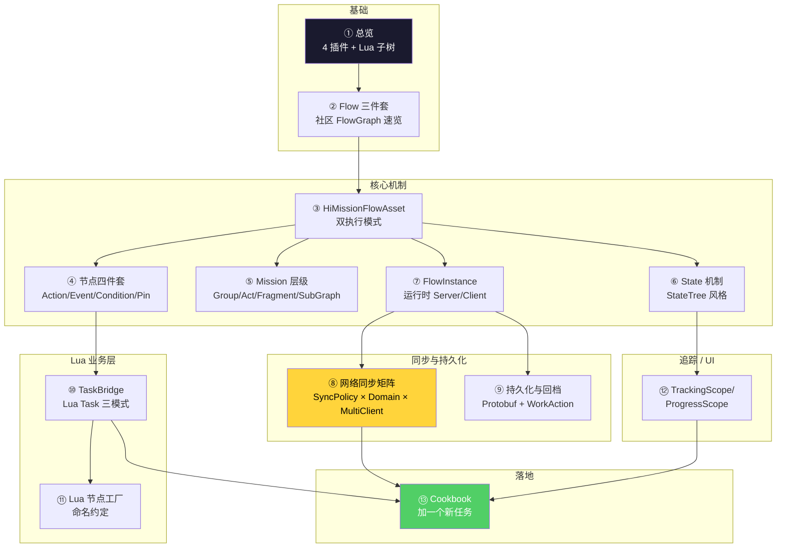

# HiGame 任务系统 — 总览

> 本 wiki 为 **AI 编程助手**(Claude / CodeBuddy / Cursor)与新加入的服务端/任务策划同事准备,把 HiGame 项目(UE5.5.4 + UnLua + DDS 架构)的任务系统全部技术细节压缩成 13 页有图、有源码引用、可执行的指南。读者读完后,应当能在没有人指导的情况下,产出一个符合项目规范的新任务(FlowAsset + Lua Task + Tracking)。
>
> **研究方法**:本项目以**本地代码考古**替代 km-websearch 的 web fetch,信息来源为 P4 工作区的项目代码与 C++ 头文件,所有 API 名/字段名/行号均经实际代码验证。footnote 全部指向 P4 工作区相对路径与具体行号。

## 知识地图

写一个新任务时,推荐顺序:**③ → ⑤ → ⑩ → ⑪ → ⑥ → ⑫ → ⑬**。
排错或优化时:④ → ⑦ → ⑧ → ⑨。
读懂底层时:② → ③ → ⑥。

## 项目最关键的 12 条事实

1. **任务系统的 C++ 不在 `Source/HiGame`**,而是分散在 `Plugins/{FlowGraph, HiFlowGraph, HiMission, HiMissionMCP, HiMissionPuzzle, HiPuzzle}` — 主模块只有 Lua 业务层在 `Content/Script/mission/`
2. **FlowGraph 是 MothCocoon 开源插件**,Hi 不 fork,只继承扩展 — 所以阅读路径是社区版 FlowGraph → HiFlowGraph → HiMission
3. **`UHiMissionFlowAsset` 双执行模式**:`FlowMode`(传统连线) + `StateMode`(StateTree 风格状态机),同一资产二选一
4. **4 级 Mission 层级**:`Group → Act → Mission → Fragment`,加上匿名子图 `NodeGraph`,每级对应一个 `HiMissionFlowNode_*` SubGraph 节点
5. **State 机制是较新加入的层级**(2025+),老的 `WorkAction` 节点系列仍在使用但功能上被 State 覆盖,可视为新写代码用 State / 维护老资产用 WorkAction
6. **节点级 `FHiFlowNodeNetworkConfig`**:三维矩阵 `SyncPolicy(3) × ExecutionDomain(3) × MultiClientStrategy(6)`,服务端权威 + 客户端通知/回调/聚合,与 DDS 架构 ghost-real 配合
7. **CProtobuf 不支持 `FSoftClassPath`**,TaskBridge 通过 `FString TaskClassPath` + `CustomData JSON` 双通道间接持久化
8. **Lua Task 三模式 + JSON 驱动**:模式 A(纯 Lua KV)、模式 B(蓝图子类)、模式 C(C++ 壳类支持 CoreRedirects);粘贴一份 `FHiMissionTaskDescriptor` JSON 即可全自动构造 — AI 写任务的金钥匙
9. **UnLua `UPARAM(ref)` 结构体回写有问题** — `GatherSaveData` 一律走返回值模式,不要用引用参数
10. **`ProgressScope`/`TrackingScope` 是 Editor-only mirror**,运行时权威数据在 `FlowAsset` 上,通过 `BuildScopeLookups` 同步;State 编辑面板上的字段会自动同步回 FlowAsset
11. **回档走 `WorkAction` 链**:`FlowManagerComponent:RevertToCheckPoint` → 遍历 `AbortWorkActionGuids` → `SubWorkAction:Abort` → 依赖 Abort 清进度
12. **`UHiAIFlowImporter::ImportJsonToAsset(JsonPath, FlowAssetName)`** 已经存在 — 一个 BlueprintCallable 静态方法,JSON → FlowAsset 全自动构造,是 AI 工具链的入口

## 页面目录

### 基础
- [1. 总览 — 4 插件 + Lua 子树](wiki/1.%20总览%20—%204%20插件%20+%20Lua%20子树.md) — 物理边界、插件清单、HiMission 模块树
- [2. Flow 三件套 — 社区 FlowGraph 速览](wiki/2.%20Flow%20三件套%20—%20社区%20FlowGraph%20速览.md) — UFlowAsset/UFlowNode/UFlowSubsystem/UFlowComponent + EdGraph 双图

### 核心机制
- [3. HiMissionFlowAsset 解剖](wiki/3.%20HiMissionFlowAsset%20解剖.md) — 字段分组、双执行模式、6 个 Delegate、CustomVariables
- [4. 节点四件套生命周期](wiki/4.%20节点四件套生命周期.md) — Action/Event/Condition/Pin、OnActivate→Trigger→Finish 时序
- [5. Mission 层级与子图](wiki/5.%20Mission%20层级与子图.md) — Group/Act/Mission/Fragment + NodeGraph、FHiMissionIdentifier、Subsystem 索引
- [6. State 机制 — StateTree 风格](wiki/6.%20State%20机制%20—%20StateTree%20风格.md) — Type/Trigger/Transition/CompletionRequirement/ChildExecutionMode 全表
- [7. FlowInstance 运行时](wiki/7.%20FlowInstance%20运行时.md) — Server vs Client、3 种 FlowManager、启动链路、NodeRunInfo

### 同步与持久化
- [8. 网络同步策略矩阵](wiki/8.%20网络同步策略矩阵.md) — Sync/Domain/MultiClient 三维 + Aggregator 算法
- [9. 持久化与回档](wiki/9.%20持久化与回档.md) — CProtobuf 包装、SaveType、3 种恢复路径、WorkAction 回档链

### Lua 业务层
- [10. TaskBridge 与 Lua Task 三模式](wiki/10.%20TaskBridge%20与%20Lua%20Task%20三模式.md) — Context 注入、JSON 驱动、A/B/C 模式对比
- [11. Lua 节点工厂与命名约定](wiki/11.%20Lua%20节点工厂与命名约定.md) — 目录树映射、all_in_one 工厂、命名陷阱

### 追踪 / UI
- [12. TrackingScope ProgressScope 与 UI](wiki/12.%20TrackingScope%20ProgressScope%20与%20UI.md) — State→Scope→GameplayMessage→UI 广播链

### 落地
- [13. Cookbook — 加一个新任务](wiki/13.%20Cookbook%20—%20加一个新任务.md) — 两条路径 + 12 项自检 + 10 类陷阱 + AI 工具入口

## 关键问题覆盖范围

| 关键问题 | 由以下页面解答 |
|----------|---------------|
| Q1 — 任务系统物理边界? | [1. 总览](wiki/1.%20总览%20—%204%20插件%20+%20Lua%20子树.md) |
| Q2 — FlowGraph 基础? | [2. Flow 三件套](wiki/2.%20Flow%20三件套%20—%20社区%20FlowGraph%20速览.md) |
| Q3 — FlowAsset 字段全表? | [3. HiMissionFlowAsset 解剖](wiki/3.%20HiMissionFlowAsset%20解剖.md) |
| Q4 — 节点 Action/Event/Condition 关系? | [4. 节点四件套](wiki/4.%20节点四件套生命周期.md) |
| Q5 — Mission 层级如何嵌套? | [5. Mission 层级与子图](wiki/5.%20Mission%20层级与子图.md) |
| Q6 — State 机制怎么用? | [6. State 机制](wiki/6.%20State%20机制%20—%20StateTree%20风格.md) |
| Q7 — 运行时 Server/Client 关系? | [7. FlowInstance 运行时](wiki/7.%20FlowInstance%20运行时.md) |
| Q8 — DDS 同步策略? | [8. 网络同步策略矩阵](wiki/8.%20网络同步策略矩阵.md) |
| Q9 — 存档怎么走? | [9. 持久化与回档](wiki/9.%20持久化与回档.md) |
| Q10 — Lua 怎么写 Task? | [10. TaskBridge 与 Lua Task 三模式](wiki/10.%20TaskBridge%20与%20Lua%20Task%20三模式.md) |
| Q11 — Lua 目录怎么放? | [11. Lua 节点工厂与命名约定](wiki/11.%20Lua%20节点工厂与命名约定.md) |
| Q12 — UI 上怎么显示进度? | [12. TrackingScope/ProgressScope](wiki/12.%20TrackingScope%20ProgressScope%20与%20UI.md) |
| Q13 — 完整流程是什么? | [13. Cookbook](wiki/13.%20Cookbook%20—%20加一个新任务.md) |

## 数据来源(本地代码考古)

12 份核心源文件,全部经实际代码验证(P4 工作区 `E:\HiProject\PerforceDev\UnrealEngine\`):

- `Plugins/HiMission/Source/HiMission/Public/HiMissionFlowAsset.h`
- `Plugins/HiMission/Source/HiMission/Public/HiMissionFlowSubsystem.h`
- `Plugins/HiMission/Source/HiMission/Public/HiMissionCommon.h`
- `Plugins/HiMission/Source/HiMission/Public/HiMissionTypes.h`
- `Plugins/HiMission/Source/HiMission/Public/FlowNodes/HiMissionFlowNode_Base.h`
- `Plugins/HiMission/Source/HiMission/Public/FlowNodes/HiMissionFlowNode_TaskBridge.h`
- `Plugins/HiMission/Source/HiMission/Public/Tasks/HiMissionTask_Base.h`
- `Plugins/HiMission/Source/HiMission/Public/Tasks/HiMissionTask_LuaBase.h`
- `Plugins/HiMission/Source/HiMission/Public/States/HiFlowState.h`
- `Plugins/HiMission/Source/HiMission/Public/FlowSync/HiFlowSyncTypes.h`
- `Plugins/HiMission/Source/HiMission/Public/HiFlowScopeTypes.h`
- `Plugins/HiMission/Source/HiMission/Public/Trackings/HiMissionTrackingTypes.h`

外加 5 份关键 Lua 入口:
- `Content/Script/mission/mission_manager.lua`
- `Content/Script/mission/flow_manager_component.lua`
- `Content/Script/mission/mission_action/mission_action_base.lua`
- `Content/Script/mission/mission_node/mission_node_event_base.lua`
- `Content/Script/mission/all_in_one/all_in_one_factory.lua`

以及 1 份既有官方文档(本 wiki 不重复其内容):
- `Plugins/HiMission/Docs/external-message-system.md`

## 质量说明

- **总页面数**:13
- **总参考来源数**:18(全部为本地代码考古产物,均带 `:行号`)
- **覆盖率**:13 / 13 关键问题全部覆盖
- **Mermaid 图表数**:≥ 18 张(每页至少 1 张主图)
- **不在 scope 内**:`HiMissionMCP`(外部 AI 接入)、`Plugins/HiMission/Docs/external-message-system.md`(已有官方文档)— 仅在第 13 章给入口提示,不重复
- **最后更新**:2026-05-11
