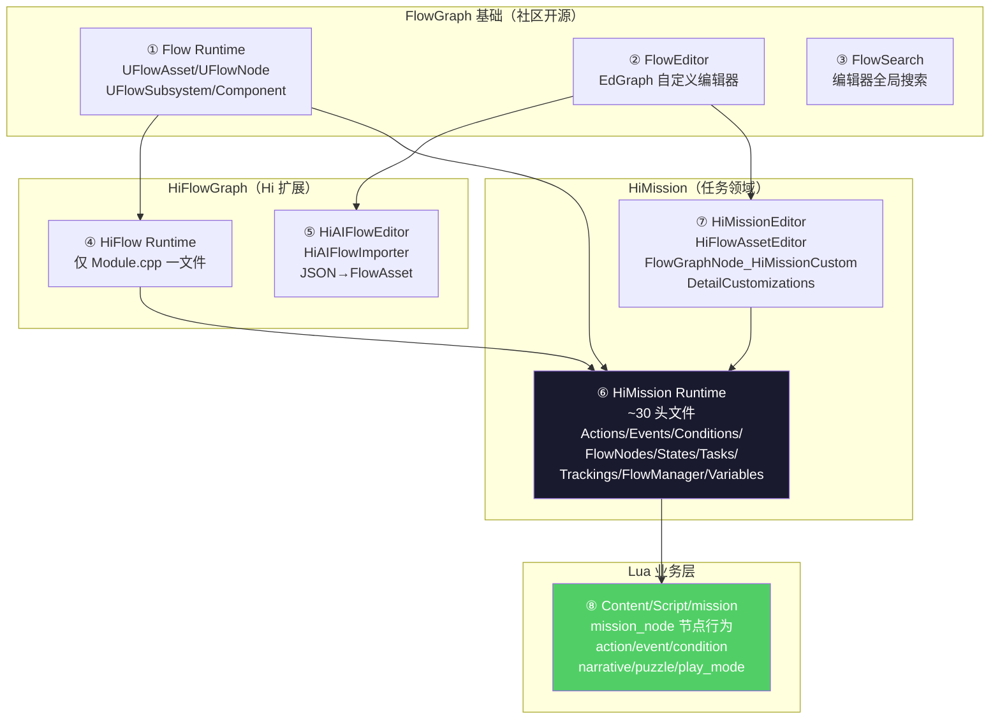

# 1. 总览 — 4 插件 + Lua 子树

HiGame 的任务系统**不在主模块 `Source/HiGame/` 里**,而是分散在 4 个插件 + 一棵 Lua 子树。本章给出物理边界、各插件职责、与 UI 系统的耦合点,并给出"按需阅读路径图"。读完本章你应当能在不读源码的情况下,准确定位"找节点定义看哪、找运行时看哪、找编辑器看哪、找业务逻辑看哪"。

## 物理边界



## 4 个核心插件 + 7 个关联插件

任务系统**核心**:

| 插件 | WHAT | 关键文件 |
|---|---|---|
| `Plugins/FlowGraph` | MothCocoon 社区版,提供 `UFlowAsset`/`UFlowNode`/`UFlowSubsystem`/`UFlowComponent` 骨架 | `Flow.uplugin`[^1-1] |
| `Plugins/HiFlowGraph` | Hi 在 Flow 之上的扩展,只一个 Module 文件 + AI 导入器 | `HiFlow/Private/HiFlowModule.cpp`[^1-2] |
| `Plugins/HiMission` | 任务领域核心(运行时 + 编辑器两 module) | `HiMission.uplugin`[^1-3] |
| `Plugins/HiMissionMCP` | MCP 工具(给 AI 调任务系统用),**不在本 wiki scope** | `HiMissionMCP.uplugin`[^1-4] |

任务系统**关联**(本 wiki 仅提及,不展开):

| 插件 | 关联强度 | 用途 |
|---|---|---|
| `Plugins/HiMissionPuzzle` | 中 | 任务谜题子领域 |
| `Plugins/HiPuzzle` | 中 | 谜题运行时 |
| `Plugins/ShakespeareDialogue4Hi` | 弱 | 任务节点会调用对话系统 |
| `Plugins/LogicalChains` | 弱 | 逻辑链条 |
| `Plugins/LogicDriverLite` | 弱 | 状态机驱动 |
| `Plugins/CProtobuf` | 强 | 持久化序列化框架 |
| `Plugins/UnLua` | 强 | C++/Lua 桥(UnLuaInterface) |

## HiMission 模块树

`Plugins/HiMission/Source/HiMission/Public/` 的子目录与文件清单[^1-5]:

```
HiMission/Public/
├── Actions/                         # 瞬时动作类（HiMissionAction_Base 等）
├── ActorReferences/                 # FHiActorReference / FHiActorReferenceTypes
├── Conditions/                      # 条件检查（HiMissionCondition_Base 等）
├── Events/                          # 异步事件（HiMissionEvent_Base + UHiWaitMissionEventAction）
├── Extensions/                      # 扩展点
├── FlowManager/                     # HiPlayerFlowManagerComponent / HiSyncFlowManagerComponentBase
├── FlowNodes/                       # 22 个节点类（核心！）
│   ├── HiMissionFlowNode_Base.h     # 父类
│   ├── HiMissionFlowNode_Mission/MissionAct/MissionFragment/MissionGroup/NodeGraph/SubGraphBase
│   ├── HiMissionFlowNode_TaskBridge # Task 宿主
│   ├── HiMissionFlowNode_WorkAction # 老的 WorkAction 系列
│   ├── HiMissionFlowNode_CheckCondition / WaitCondition
│   ├── HiMissionFlowNode_LogicalAND / LogicalOR / FragmentAND
│   ├── HiMissionFlowNode_CustomInput / CustomOutput / ExchangeNode / ExecutionSequence
│   ├── HiMissionFlowNode_Event
│   ├── HiMissionFlowNode_Finish
│   ├── HiMessageCallbackProxy / HiFlowNodeMessageRules
│   └── Graph/
├── FlowSync/                        # HiFlowSyncTypes（NetworkConfig + Aggregator）
├── Log/
├── Messages/
├── Progresses/                      # HiQuestProgress
├── States/                          # HiFlowState + StateStart/Success/Failed/StateGraph
├── System/
├── Tasks/                           # HiMissionTask_Base + LuaBase + 老 HiMissionTask（GameplayTask 风格）
├── Trackings/                       # HiMissionTrackingTypes
├── Utils/
├── Variables/                       # HiFlowVariableTypes
├── HiFlowManagerComponent.h         # 顶层组件
├── HiFlowScopeTypes.h               # ProgressScope/TrackingScope 容器
├── HiMissionActionComponent.h
├── HiMissionAvatarComponent.h
├── HiMissionBlueprintLibrary.h
├── HiMissionCommon.h                # 全套基础类型 + Interface
├── HiMissionDataComponent.h
├── HiMissionEventComponent.h
├── HiMissionFlowAsset.h             # 第 3 章主角
├── HiMissionFlowComponent.h
├── HiMissionFlowDebugComponent.h
├── HiMissionFlowDebugSubSystem.h
├── HiMissionFlowSubsystem.h
├── HiMissionManager.h
├── HiMissionProgressMessages.h
├── HiMissionSettings.h
├── HiMissionTaskComponent.h
├── HiMissionTrackingManager.h
├── HiMissionTypes.h                 # 全套 USTRUCT/UENUM
└── HiMissionToolsLibrary.h
```

`Plugins/HiMission/Source/HiMissionEditor/Public/` 的关键文件:

| 文件 | 角色 |
|---|---|
| `Asset/`(目录) | `FHiFlowAssetEditor` 自定义编辑器主体 |
| `Factory/`(目录) | Asset 工厂 |
| `Graph/Nodes`(目录) | EdGraphNode 包装类 |
| `Graph/Widgets`(目录) | 自定义 Slate 节点表现 |
| `DetailCustomizations/`(目录) | 7 个节点 Detail Panel 定制 |
| `PropertyCustomization/`(目录) | UPROPERTY 单字段定制 |
| `FlowGraphNode_HiMissionCustom.h` | 自定义 EdGraphNode 包装 |
| `AssetTypeActions_HiMissionFlowAsset.h` | Content Browser 右键菜单 |
| `HiMissionTaskMetadataManager.h` | Task 元数据管理(给 AI/工具用) |

## 已有官方文档

`Plugins/HiMission/Docs/external-message-system.md`[^1-6] 已经覆盖**外部消息系统**(节点 ↔ Lua/AI 通过 `UHiGameplayMessageSubsystem` 异步对话):

- `int32 ResultCode` 1xx/2xx/3xx/4xx/5xx 五段编码规范
- `FHiFlowNodeExternalSendRule` / `FHiFlowNodeWaitRule` / `FHiFlowNodeResultRoute` 数据结构
- 请求-响应路由 / Channel 命名约定 / Mock Lua Handler 测试方案

本 wiki **不重复**这一章节,在第 4 章只画一个引用提示。

## 推荐阅读路径

| 你要做什么 | 阅读章节顺序 |
|---|---|
| 写一个新任务节点(Lua) | ③ → ⑤ → ⑩ → ⑪ → ⑬ |
| 看 FlowAsset 字段全表 | ② → ③ |
| 加一个新 State 状态机 | ③ → ⑥ → ⑫ → ⑬ |
| 对接 DDS 多人/服务端权威 | ④ → ⑦ → ⑧ |
| 改存档/回档逻辑 | ⑦ → ⑨ |
| 做 AI 自动写任务的工具 | ② → ③ → ⑩(JSON 驱动) → ⑬(HiAIFlowImporter) |
| 排错: 节点不流转 | ④ → ⑦ → ⑧ |
| 排错: 节点重复触发 | ④ → ⑨(`InputPinRecords`) |
| 排错: UI 不刷新 | ⑫ → UI wiki |

## 不在 scope 内

- **HiMissionMCP**:外部 AI 接入,有独立的 plugin 与 wiki
- **`Docs/external-message-system.md`**:已有官方文档
- **`Plugins/FlowGraph/Source/Flow/Public/DialogueFlowAsset.h` 等**:对话子领域,与任务系统弱耦合
- **HiMissionPuzzle/HiPuzzle**:谜题领域,有专属规则,不在主流任务流程

---

## Sources

[^1-1]: `Plugins/FlowGraph/Flow.uplugin:1-50`
[^1-2]: `Plugins/HiFlowGraph/Source/HiFlow/Private/HiFlowModule.cpp`
[^1-3]: `Plugins/HiMission/HiMission.uplugin`
[^1-4]: `Plugins/HiMissionMCP/HiMissionMCP.uplugin`
[^1-5]: `Plugins/HiMission/Source/HiMission/Public/`(目录)
[^1-6]: `Plugins/HiMission/Docs/external-message-system.md`

## Cross-link

→ [2. Flow 三件套](2.%20Flow%20三件套%20—%20社区%20FlowGraph%20速览.md) 深入 FlowGraph 基础
→ [3. HiMissionFlowAsset 解剖](3.%20HiMissionFlowAsset%20解剖.md) 直接进入 Asset 字段
