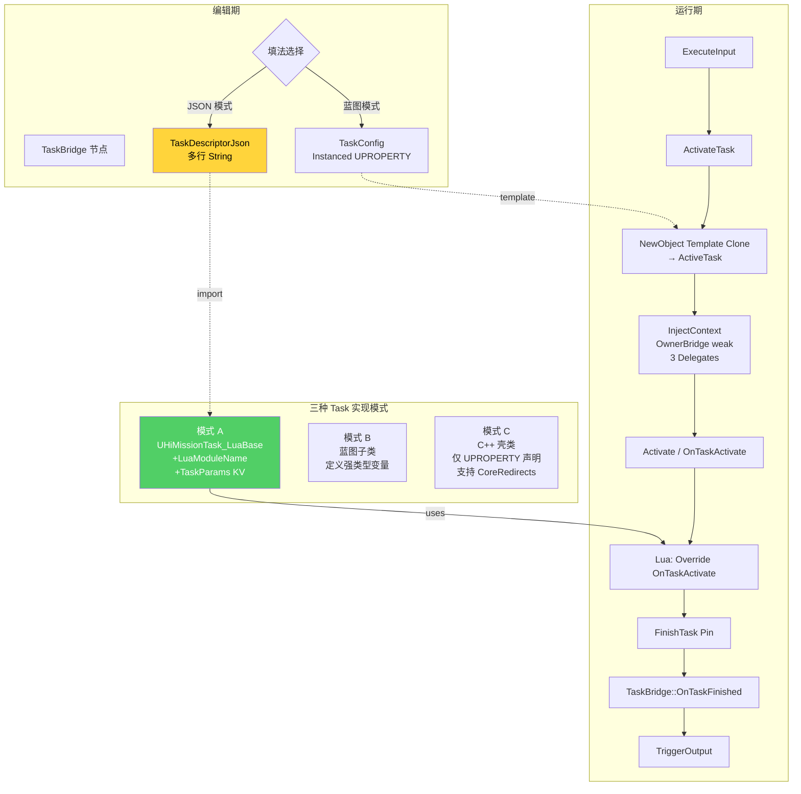
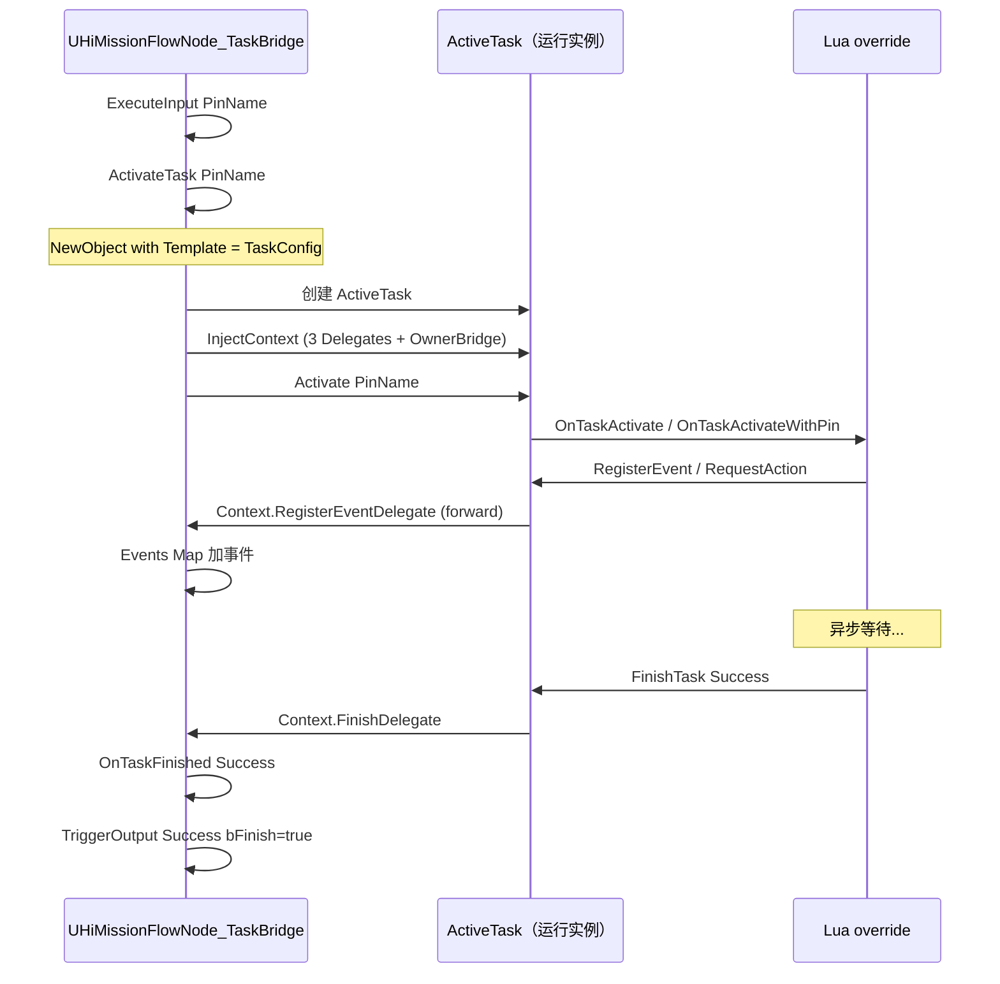

# 10. TaskBridge 与 Lua Task 三模式

传统的 FlowNode 把 Action/Event/Condition 三件套**混编进同一个节点**,组合复杂;`HiMissionFlowNode_TaskBridge`[^10-1] + `UHiMissionTask_Base`[^10-2] 把"任务"抽出为独立类,节点变成壳子,业务逻辑分到 Task。Task 有三种模式(A: 纯 Lua KV 参数;B: 蓝图子类强类型变量;C: C++ 壳类支持 CoreRedirects 重命名)。还有 **JSON 驱动模式**:粘贴一份 `FHiMissionTaskDescriptor` JSON,TaskBridge 自动解析并构造 LuaBase Task — 给外部工具/AI 写任务的关键 hook。

## 系统全景



## TaskBridge 节点完整字段

```cpp
UCLASS(Blueprintable, meta = (DisplayName = "Task Bridge"))
class HIMISSION_API UHiMissionFlowNode_TaskBridge : public UHiMissionFlowNode_Base
{
public:
    /**
     * Task 配置实例（Instanced）
     * 策划在 Detail Panel 中选择 Task 类型，UE 的 Instanced 机制自动展示该 Task 的所有 UPROPERTY
     * ⚠️ 运行时只读，不得修改（运行时通过 NewObject with Template 克隆出 ActiveTask）
     */
    UPROPERTY(EditAnywhere, Instanced, Category = "Task Config",
        meta = (DisplayName = "Task 配置"))
    TObjectPtr<UHiMissionTask_Base> TaskConfig;

    /**
     * Task Descriptor JSON（JSON 驱动模式）
     * 粘贴一份 FHiMissionTaskDescriptor 格式的 JSON 后，TaskBridge 会自动：
     *   1. 解析 JSON → 构造 UHiMissionTask_LuaBase 实例（无需创建蓝图类）
     *   2. 填入 LuaModuleName + TaskParams + 自定义 Pin
     *   3. 刷新编辑器 Detail Panel 展示
     */
    UPROPERTY(EditAnywhere, Category = "Task Config",
        meta = (DisplayName = "Task JSON（JSON 驱动）", MultiLine = "true"))
    FString TaskDescriptorJson;

    /**
     * 运行时 Task 实例（从 TaskConfig 克隆而来）
     * UPROPERTY(Transient) 防止 GC 回收
     */
    UPROPERTY(Transient)
    TObjectPtr<UHiMissionTask_Base> ActiveTask;

    UPROPERTY(SaveGame)
    FSoftClassPath SavedTaskClassPath;        // ⚠️ CProtobuf 不支持，实际不持久化

    UPROPERTY(SaveGame)
    FHiMissionTaskSaveData SavedTaskData;     // 真实持久化通道

    UPROPERTY(Transient)
    bool bTaskLoadFailed = false;             // OnLoad TryLoadClass 失败时设
};
```

[^10-1]

## 三模式对比

| 模式 | 代码量 | 强类型 | 重命名安全 | 适合 | 特点 |
|---|---|---|---|---|---|
| **A 纯 Lua** | 0 cpp + 1 lua | KV 弱类型 | ❌ | 快速迭代/AI 生成 | `LuaModuleName` + `TaskParams` 全在 Detail Panel 填 |
| **B 蓝图子类** | 0 cpp + 1 BP + 1 lua | 蓝图变量强类型 | ❌ | 策划主导 | 蓝图 Variables 面板定义 + `GetServer/Client/Common ModuleName` 重写 |
| **C C++ 壳类** | 1 cpp + 1 lua | C++ 强类型 | ✅ CoreRedirects | 长期维护 | 只声明 UPROPERTY,逻辑仍在 Lua |

### 模式 A 的最少配置

```
TaskConfig = UHiMissionTask_LuaBase (默认)
  LuaModuleName = "CommonScript.mission.mission_task.my_task"
  TaskParams = { "npcId": "NPC_001", "dialogueId": "1234" }
```

Lua 侧:
```lua
local MyTask = Class()

function MyTask:OnTaskActivate()
    local NpcId = self:GetParam("npcId")
    local DialogueId = self:GetParam("dialogueId")
    -- 业务逻辑...
    self:FinishTask("Success")
end

function MyTask:OnTaskAbort()
    -- 清理...
end

return MyTask
```

### 模式 B 的最少配置

1. 创建 `BP_MissionTask_PlayNpcAnim`(继承 `UHiMissionTask_LuaBase`)
2. 蓝图 Variables 面板加:`NpcReference` (`TSoftObjectPtr<AActor>`)、`AnimationName` (`FName`)、`Duration` (`float`)
3. 蓝图重写 `GetServerModuleName` / `GetClientModuleName` / `GetModuleName` 各返回 Lua 路径

```cpp
// 蓝图重写的接口
UFUNCTION(BlueprintNativeEvent, BlueprintCallable, Category = "Lua Task",
    meta = (DisplayName = "获取服务端模块名"))
FString GetServerModuleName() const;

UFUNCTION(BlueprintNativeEvent, BlueprintCallable, Category = "Lua Task",
    meta = (DisplayName = "获取客户端模块名"))
FString GetClientModuleName() const;
```

[^10-3]

### 模式 C 的最少配置

```cpp
// MyMissionTask_PlayNpcAnim.h
UCLASS(Blueprintable, meta = (DisplayName = "Play NPC Anim"))
class HIMISSION_API UMyMissionTask_PlayNpcAnim : public UHiMissionTask_LuaBase
{
    GENERATED_BODY()
public:
    UPROPERTY(EditAnywhere, Category = "Task")
    TSoftObjectPtr<AActor> NpcReference;
    
    UPROPERTY(EditAnywhere, Category = "Task")
    FName AnimationName;
    
    UPROPERTY(EditAnywhere, Category = "Task")
    float Duration = 1.0f;
};
```

加 `DefaultEngine.ini` 的 CoreRedirects 后,即使重命名类名,旧 .uasset 仍能加载。

## FHiMissionTaskContext — 三件套 Delegate

```cpp
// 纯 C++ 结构体（不加 USTRUCT/GENERATED_BODY），由 TaskBridge 创建并注入给 Task
struct FHiMissionTaskContext
{
    /** 宿主 TaskBridge 节点的弱引用（GC 安全） */
    TWeakObjectPtr<UHiMissionFlowNode_TaskBridge> OwnerBridge;

    /** 事件注册 Delegate，Task 通过此 Delegate 向 TaskBridge 注册事件监听 */
    FHiMissionRegisterEventDelegate RegisterEventDelegate;

    /** 动作触发 Delegate，Task 通过此 Delegate 向 TaskBridge 触发即时动作 */
    FHiMissionTriggerActionDelegate TriggerActionDelegate;

    /** Task 完成通知 Delegate，Task 调用 FinishTask 时通过此 Delegate 通知 TaskBridge */
    FHiMissionTaskFinishDelegate FinishDelegate;

    bool IsValid() const
    {
        return OwnerBridge.IsValid()
            && RegisterEventDelegate.IsBound()
            && TriggerActionDelegate.IsBound()
            && FinishDelegate.IsBound();
    }
};
```

[^10-4]

> 用 `TDelegate`(绑定 UObject 方法,内部 `TWeakObjectPtr`)而非 `TMulticastDelegate` — **天然 GC 安全**。

## UHiMissionTask_Base 完整接口

```cpp
UCLASS(Abstract, Blueprintable, BlueprintType, EditInlineNew, CollapseCategories,
    meta = (DisplayName = "Mission Task Base"))
class HIMISSION_API UHiMissionTask_Base : public UObject
{
public:
    // 生命周期接口（由 TaskBridge 调用）
    void InjectContext(const FHiMissionTaskContext& InContext);
    void Activate();
    void Activate(const FName& PinName);  // 带输入 Pin 名称
    void Abort();

    // 可重写的虚函数（子类实现业务逻辑）
    UFUNCTION(BlueprintNativeEvent)
    void OnTaskActivate();
    UFUNCTION(BlueprintNativeEvent)
    void OnTaskActivateWithPin(const FName& PinName);
    UFUNCTION(BlueprintNativeEvent)
    void OnTaskAbort();
    UFUNCTION(BlueprintNativeEvent)
    void OnTaskResume();   // 仅在存档恢复路径下被调用

    // 存档接口（BlueprintNativeEvent，Lua Task 可通过 UnLua Override 重写）
    UFUNCTION(BlueprintNativeEvent)
    FHiMissionTaskSaveData GatherSaveData();   // ⚠️ 返回值，不用 UPARAM(ref)
    UFUNCTION(BlueprintNativeEvent)
    void ApplySaveData(const FHiMissionTaskSaveData& InData);

    // Task 完成接口
    UFUNCTION(BlueprintCallable)
    void FinishTask(FName OutputPinName);

    // 上下文访问接口
    UFUNCTION(BlueprintCallable)
    UHiMissionFlowNode_TaskBridge* GetOwnerFlowNode() const;
    UFUNCTION(BlueprintCallable)
    UHiFlowManagerComponent* GetFlowManagerComponent() const;
    UFUNCTION(BlueprintCallable)
    int32 GetMissionID() const;

    // 外部系统交互接口（通过 Context Delegate 转发）
    UFUNCTION(BlueprintCallable)
    void RegisterEvent(TSubclassOf<UHiMissionEvent_Base> EventClass, FName CallbackFunctionName);
    UFUNCTION(BlueprintCallable)
    void RequestAction(TSubclassOf<UHiMissionAction_Base> ActionClass);

    // 编辑器展示接口
    UFUNCTION(BlueprintNativeEvent)
    FString GetTaskDescription() const;

    // Pin 声明接口
    UFUNCTION(BlueprintNativeEvent)
    TArray<FName> GetDefaultInputPins() const;     // 默认 ["In"]
    UFUNCTION(BlueprintNativeEvent)
    TArray<FName> GetDefaultOutputPins() const;    // 默认 ["Success", "Failure"]

#if WITH_EDITOR
    virtual void GetAssetRegistryTags(TArray<FAssetRegistryTag>& OutTags) const override;
    virtual void PostEditChangeProperty(FPropertyChangedEvent& PropertyChangedEvent) override;
#endif

protected:
    FHiMissionTaskContext TaskContext;
    bool bTaskActivated = false;
};
```

[^10-2]

## 完整生命周期



## FHiMissionTaskDescriptor — JSON 驱动核心结构

```cpp
USTRUCT(BlueprintType)
struct HIMISSION_API FHiMissionTaskDescriptor
{
    UPROPERTY(EditAnywhere, BlueprintReadWrite)
    FString TaskType;            // 蓝图类名（"BP_MissionTask_PlayNpcAnim"）

    UPROPERTY(EditAnywhere, BlueprintReadWrite)
    FString DisplayName;         // 节点标题中文名

    UPROPERTY(EditAnywhere, BlueprintReadWrite)
    FString LuaModule;           // 主 Lua 路径

    UPROPERTY(EditAnywhere, BlueprintReadWrite)
    FString ServerLuaModule;     // 服务端专用

    UPROPERTY(EditAnywhere, BlueprintReadWrite)
    FString ClientLuaModule;     // 客户端专用

    UPROPERTY(EditAnywhere, BlueprintReadWrite)
    FString CommonLuaModule;     // 通用（IUnLuaInterface::GetModuleName）

    UPROPERTY(EditAnywhere, BlueprintReadWrite)
    TArray<FString> InputPins;   // 默认 ["In"]

    UPROPERTY(EditAnywhere, BlueprintReadWrite)
    TArray<FString> OutputPins;  // 默认 ["Success", "Failure"]

    UPROPERTY(EditAnywhere, BlueprintReadWrite)
    TMap<FName, FString> Params; // KV 参数

    UPROPERTY(EditAnywhere, BlueprintReadWrite)
    FString Description;

    UPROPERTY(EditAnywhere, BlueprintReadWrite)
    FString NodeGuid;            // 自动填回，外部工具不必填

    bool IsValid() const {
        return !TaskType.IsEmpty() || !LuaModule.IsEmpty() || !CommonLuaModule.IsEmpty();
    }

    static bool ToJson(const FHiMissionTaskDescriptor& Desc, FString& OutJson);
    static bool FromJson(const FString& InJson, FHiMissionTaskDescriptor& OutDesc);
};
```

[^10-5]

> **`config` vs `params` 的命名兼容**:JSON 序列化时输出为 `"config": {...}`(新版),反序列化同时支持 `"config"` 和 `"params"`(旧版向后兼容)[^10-6]。

### JSON 示例

```json
{
  "taskType": "BP_MissionTask_PlayNpcAnim",
  "displayName": "NPC 播放动画",
  "luaModule": "CommonScript.mission.mission_task.play_npc_anim",
  "serverLuaModule": "ServerScript.mission.mission_task.play_npc_anim_server",
  "clientLuaModule": "ClientScript.mission.mission_task.play_npc_anim_client",
  "inputPins": ["In", "Skip"],
  "outputPins": ["Success", "Failure", "Cancelled"],
  "config": {
    "npcId": "NPC_001",
    "animName": "Anim_Greeting",
    "duration": "2.5"
  },
  "description": "让 NPC 播放问候动画 2.5 秒",
  "nodeGuid": ""
}
```

粘贴到 TaskBridge 的 `TaskDescriptorJson` 后,`PostEditChangeProperty` 触发 `ImportFromDescriptorJson`[^10-7],自动:
1. 创建 `UHiMissionTask_LuaBase` 实例填到 `TaskConfig`
2. 设置 LuaModuleName / TaskParams
3. 刷新节点 Pin
4. `AutoFillNodeGuidToJson` 把 NodeGuid 写回 JSON 字段

## 编辑器自动化

```cpp
#if WITH_EDITOR
    bool ImportFromDescriptorJson();      // JSON → TaskConfig
    bool ExportTaskConfigToJson();        // TaskConfig → JSON
    void AutoFillNodeGuidToJson();        // 自动写 NodeGuid

    static void AutoFillActorRefToID(UObject* RootObject);  // 反射扫描结构体
    static void ProcessStructForActorRefToID(const UStruct* StructDef, void* StructData);

private:
    /** 缓存解析后的 Descriptor（避免 GetNodeTitle/GetNodeDescription 高频解析 JSON） */
    FHiMissionTaskDescriptor CachedDescriptor;
    bool bCachedDescriptorValid = false;

    /** 重入保护标志 */
    bool bIsUpdatingJson = false;
#endif
```

[^10-8]

> **`AutoFillActorRefToID`** 是个聪明的元功能:反射扫描 TaskConfig 内所有结构体,如果一个结构体里同时有 `TSoftObjectPtr<AActor>` + `FString ID` 字段,自动从 Actor Label 提取 ID 写入 `ID` 字段。约定`Label = "ID@DisplayName"`,按 `@` 分割取第一段。

## AssetRegistry Tags — 不加载资产即可查询

```cpp
#if WITH_EDITOR
/**
 * 将 Task 元数据写入 AssetRegistry Tag
 * 保存一次蓝图后，不加载资产即可读取这些信息（毫秒级查询）
 */
virtual void GetAssetRegistryTags(TArray<FAssetRegistryTag>& OutTags) const override;
#endif
```

[^10-9]

> 这是给 AI 工具/`HiMissionTaskMetadataManager`(在 `HiMissionEditor` 模块) / Content Browser 自定义筛选用的 — 不需要加载 .uasset 即可读取 DisplayName/ToolTip 等元数据,毫秒级。

## Pin 默认实现

`UHiMissionTask_LuaBase`[^10-10] 不重写 `GetDefaultInputPins/GetDefaultOutputPins`,所以默认是:

| 输入 Pin | 输出 Pin |
|---|---|
| `In` | `Success`, `Failure` |

如果要扩展 Pin,需要在子类(蓝图或 C++)重写这俩 BlueprintNativeEvent。

## TaskBridge 与 Lua override 模式

`UHiMissionTask_LuaBase` 实现 `IUnLuaInterface`[^10-10]:

```cpp
class HIMISSION_API UHiMissionTask_LuaBase : public UHiMissionTask_Base, public IUnLuaInterface
{
public:
    /**
     * 返回 Lua 模块路径（相对于 Content/Script 目录）
     * 例如："CommonScript.mission.mission_task.mission_task_example"
     */
    virtual FString GetModuleName_Implementation() const override;

    UFUNCTION(BlueprintNativeEvent, BlueprintCallable, Category = "Lua Task",
        meta = (DisplayName = "获取服务端模块名"))
    FString GetServerModuleName() const;
    virtual FString GetServerModuleName_Implementation() const { return LuaModuleName; }

    UFUNCTION(BlueprintNativeEvent, BlueprintCallable, Category = "Lua Task",
        meta = (DisplayName = "获取客户端模块名"))
    FString GetClientModuleName() const;
    virtual FString GetClientModuleName_Implementation() const { return LuaModuleName; }

    // 模式 A 专用属性
    UPROPERTY(EditAnywhere, BlueprintReadOnly, Category = "Lua Task",
        meta = (DisplayName = "Lua 模块路径"))
    FString LuaModuleName;

    UPROPERTY(EditAnywhere, BlueprintReadOnly, Category = "Lua Task",
        meta = (DisplayName = "Task 参数"))
    TMap<FName, FString> TaskParams;

    // Lua 侧辅助方法
    UFUNCTION(BlueprintCallable)
    FString GetParam(FName Key, const FString& DefaultValue = TEXT("")) const;
    UFUNCTION(BlueprintCallable)
    bool HasParam(FName Key) const;
    UFUNCTION(BlueprintCallable)
    int32 GetParamAsInt(FName Key, int32 DefaultValue = 0) const;
    UFUNCTION(BlueprintCallable)
    float GetParamAsFloat(FName Key, float DefaultValue = 0.f) const;
};
```

> **三个 ModuleName 的设计原因**:DDS 架构里,服务端和客户端分别加载不同的 Lua 模块(`ServerScript/`/`ClientScript/`/`CommonScript/`)。模式 B/C 可以重写 `GetServerModuleName` 等返回不同路径,UnLua 在创建 Task 实例时根据当前进程类型选择。

## 老的 UHiMissionTask(GameplayTask 风格,Deprecated)

`Plugins/HiMission/Source/HiMission/Public/Tasks/HiMissionTask.h`[^10-11]:

```cpp
UCLASS(Blueprintable, BlueprintType, Abstract, EditInlineNew, CollapseCategories)
class HIMISSION_API UHiMissionTask : public UGameplayTask, public IHiMissionTaskOwnerInterface
{
    GENERATED_BODY()
public:
    // virtual UWorld* GetWorld() const override;
};
```

> 这是早期实现,基于 UE 自带的 `UGameplayTask`,**新代码不要用** — 用 `UHiMissionTask_Base`(继承 UObject)。

## 与 Action/Event 的关系

虽然 TaskBridge 走独立的 `Task_Base` 体系,但它 **依然继承 `UHiMissionFlowNode_Base`**,所以仍然能用 Action/Event:
- TaskBridge 的 `TriggerInputActions/TriggerOutputActions/TriggerInputEvents` 仍然有效
- Task 内部通过 `Context.RegisterEventDelegate` / `TriggerActionDelegate` 委托给 TaskBridge 来注册 Event/触发 Action
- 这是"组合而非继承"的设计 — Task 不直接 own Event/Action,而是通过 Bridge 转发

```cpp
// Task 注册事件回调（由 Context.RegisterEventDelegate 触发，
// 转发给 FlowNode_Base 的 RegisterEvent）
void OnTaskRegisterEvent(TSubclassOf<UHiMissionEvent_Base> EventClass, FName CallbackFunctionName);

/** 事件触发统一转发器（UFUNCTION，供 AddDynamic 绑定）
 * 当任意已注册的 Event 触发时，此函数被调用
 * 通过 InstanceName（即 Event->Name）查 EventCallbackMap，精确匹配对应的回调函数 */
UFUNCTION()
void OnEventComplete(FGuid EventGuid, FName InstanceName, FString ParamStr);

/** 事件类 → 回调函数名 映射表（运行时，Transient） */
TMap<FName, FName> EventCallbackMap;
```

[^10-12]

---

## Sources

[^10-1]: `Plugins/HiMission/Source/HiMission/Public/FlowNodes/HiMissionFlowNode_TaskBridge.h:27-247`
[^10-2]: `Plugins/HiMission/Source/HiMission/Public/Tasks/HiMissionTask_Base.h:236-434`
[^10-3]: `Plugins/HiMission/Source/HiMission/Public/Tasks/HiMissionTask_LuaBase.h:53-65`
[^10-4]: `Plugins/HiMission/Source/HiMission/Public/Tasks/HiMissionTask_Base.h:37-58`
[^10-5]: `Plugins/HiMission/Source/HiMission/Public/Tasks/HiMissionTask_Base.h:73-184`
[^10-6]: `Plugins/HiMission/Source/HiMission/Public/Tasks/HiMissionTask_Base.h:142-148` — config/params 注释
[^10-7]: `Plugins/HiMission/Source/HiMission/Public/FlowNodes/HiMissionFlowNode_TaskBridge.h:177-220`
[^10-8]: `Plugins/HiMission/Source/HiMission/Public/FlowNodes/HiMissionFlowNode_TaskBridge.h:221-239`
[^10-9]: `Plugins/HiMission/Source/HiMission/Public/Tasks/HiMissionTask_Base.h:412-426`
[^10-10]: `Plugins/HiMission/Source/HiMission/Public/Tasks/HiMissionTask_LuaBase.h:26-133`
[^10-11]: `Plugins/HiMission/Source/HiMission/Public/Tasks/HiMissionTask.h:12-19` — 老 GameplayTask 风格
[^10-12]: `Plugins/HiMission/Source/HiMission/Public/FlowNodes/HiMissionFlowNode_TaskBridge.h:128-145`

## Cross-link

→ [4. 节点四件套](4.%20节点四件套生命周期.md) FlowNode_Base 是 TaskBridge 的父类
→ [9. 持久化与回档](9.%20持久化与回档.md) FHiMissionTaskSaveData / FSoftClassPath 限制
→ [11. Lua 节点工厂](11.%20Lua%20节点工厂与命名约定.md) Content/Script/mission/mission_task 在哪
→ [13. Cookbook](13.%20Cookbook%20—%20加一个新任务.md) 完整 JSON 驱动流程
