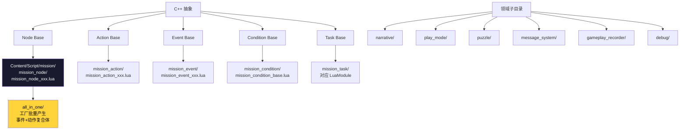

# 11. Lua 节点工厂与命名约定

`Content/Script/mission/` 是 Lua 业务层。这里的目录划分映射 C++ 的概念体系(`mission_action/event/condition/node/`)。`all_in_one/` 是工厂模式,把"事件 + 动作"合二为一的简单节点批量化。本章讲:(1) Lua 子树的目录树和命名前缀对照;(2) `all_in_one_factory.lua` 工厂模式;(3) Lua Task 三模式的真实文件示例;(4) 你能识别的"陷阱"清单(包括真实存在的 `mission_node_ maskinput.lua` 这种带空格命名)。

## C++ 抽象 → Lua 目录映射



## Content/Script/mission/ 目录全表

[^11-1]

| 路径 | 角色 | 命名约定 |
|---|---|---|
| `mission_action/` | 动作 lua(瞬时) | `mission_action_<verb>.lua` 如 `mission_action_teleport_player.lua` |
| `mission_event/` | 事件 lua(等待型) | `mission_event_<noun_or_event>.lua` 如 `mission_event_kill_monster.lua` |
| `mission_condition/` | 条件 lua | 仅 `mission_condition_base.lua` 一个文件 |
| `mission_node/` | 节点 lua(含事件+动作) | `mission_node_<noun_or_verb>.lua` 大量,~100+ |
| `all_in_one/` | 工厂模式产生的简单 node | `all_in_one_<event_type>.lua` |
| `all_in_one/objects/` | all_in_one 实体类 | 4 个文件(详见下) |
| `narrative/` | 旁白/演出 | `narrative_manager_component.lua` |
| `mission_actor/` | 任务相关的 Actor 组件 | `narrative_manager_component.lua` |
| `play_mode/` | 玩法模式 | (空目录占位) |
| `puzzle/` | 谜题工具 | `mission_puzzle_utils.lua` |
| `message_system/` | 消息桥接 | (与 external-message-system 关联) |
| `gameplay_recorder/` | 录制 | `utils.lua` |
| `debug/` | 调试 | (空目录占位) |
| `mission_actor/` | 任务 Actor 组件 | (空目录占位,但 narrative 复用) |

`mission/` 根目录的核心文件:

| 文件 | 作用 |
|---|---|
| `mission_manager.lua` | RootFlow 启动入口(挂全局 `MissionManager` Actor) |
| `flow_manager_component.lua` | 节点事件分发总线(挂 Player/MissionManager) |
| `mission_data_component.lua` | 任务数据组件 |
| `dungeon_mission_system_component.lua` | 副本任务子系统 |
| `mission_act_object.lua` | MissionAct 数据载体类(从配表实例化) |
| `mission_object.lua` | Mission 数据载体类 |
| `mission_fragment.lua` | Fragment 数据载体类 |
| `dialogue_object.lua` | 对话载体 |
| `mission_target_particle.lua` | 任务目标粒子 |
| `mission_tracking_pillar_controller.lua` | UI 跟踪柱控制(详见第 12 章) |
| `mission_utils.lua` | 工具函数 |
| `mission_node/` 内的特殊文件 | `mission.lua`/`mission_act.lua`/`mission_fragment.lua`/`mission_group.lua` 是 SubGraph 节点的 Lua 端 |

## all_in_one_factory.lua — 工厂模式

[^11-2]:

```lua
local BPConst = require("common.const.blueprint_const")
local AllInOneFactory = {}

local AllInOneOnShapeTrigger = require("mission.all_in_one.objects.all_in_one_on_shape_trigger")
local AllInOneListenItemBeInter = require("mission.all_in_one.objects.all_in_one_listen_item_be_inter")
local AllInOneListenItemBeInterNew = require("mission.all_in_one.objects.all_in_one_listen_item_be_inter_new")

AllInOneFactory.TagToObject = {
    [BPConst.EventOnShapeTriggerTag] = AllInOneOnShapeTrigger,
    [BPConst.ListenItemBeInterTag] = AllInOneListenItemBeInter,
    [BPConst.ListenItemBeInterNewTag] = AllInOneListenItemBeInterNew,
}

function AllInOneFactory.CreateObjectByTag(Tag, Struct)
    if AllInOneFactory.TagToObject[Tag] then
        return AllInOneFactory.TagToObject[Tag].New(Tag, Struct)
    end
    return nil
end

return AllInOneFactory
```

要点:
- 通过 GameplayTag 路由 — 每种 AllInOne 节点对应一个 Tag
- HiAIFlowImporter 也用相同的 GameplayTag 映射[^11-3] — `InitAllInOneOutputPinsMap()` 把 `FGameplayTag → TArray<FName>` 输出 Pin 关系建好,用于反序列化时刷新 Pin
- `objects/` 子目录里目前 4 个文件:
  - `all_in_one_event_common.lua`
  - `all_in_one_listen_item_be_inter.lua`
  - `all_in_one_listen_item_be_inter_new.lua`(注意 `_new` 后缀 — 新版本的实现)
  - `all_in_one_on_shape_trigger.lua`

## mission_action_base.lua 真实样例

[^11-4]:

```lua
require "UnLua"
local G = require("G")
local GlobalActorConst = require("common.const.global_actor_const")
local BPConst = require("common.const.blueprint_const")
local EdUtils = require("common.utils.ed_utils")
local MutableActorOperations = require("actor_management.mutable_actor_operations")
local MutableActorConst = require("TSF4G_common.actor_management.mutable_actor_const")

---@type BP_MissionAction_Base_C
local MissionActionBase = UnLua.Class()

function MissionActionBase:OnInitialize(OwnerNode)
    G.log:debug("xaelpeng", "MissionActionBase:OnInitialize %s", tostring(self))
    self.bIsOnTarget = false
    self.ActionID = self:GetUniqueName()
end

function MissionActionBase:OnActive()
    G.log:debug("xaelpeng", "MissionActionBase:OnActive %s", tostring(self))
    self.Overridden.OnActive(self)
end

function MissionActionBase:RunActionOnActorByID(ActorIDList, ActionParamStr)
    -- ...
    MessageAgent:SendMutableActorMessage(ActorIDList,
        MutableActorConst.Message_RunMissionActionOnTarget,
        self:GenerateActionInfo(ActionParamStr))
end

function MissionActionBase:RunActionOnActorByTag(Tag, ActionParamStr)
    -- ...
    MessageAgent:SendMutableActorMessageByTag(Tag,
        MutableActorConst.Message_RunMissionActionOnTarget,
        self:GenerateActionInfo(ActionParamStr))
end

function MissionActionBase:GenerateActionInfo(ActionParamStr)
    local ActionInfo = {}
    ActionInfo.ActionID = self.ActionID
    ActionInfo.Timestamp = os.time()
    ActionInfo.ActionType = UE.UHiBlueprintFunctionLibrary.GetObjectClassPath(self)
    ActionInfo.Param = ActionParamStr
    return ActionInfo
end

return MissionActionBase
```

要点:
- **`UnLua.Class()`**(注意是 `UnLua.Class` 不是 `Class` — 这是 UnLua 标准模式)
- **`self.Overridden.OnActive(self)`** — UnLua override 链调父类(蓝图基类)
- **`---@type BP_MissionAction_Base_C`** — EmmyLua 注解,IDE 类型提示
- 跟 C++ 侧 `UHiMissionAction_Base::Initialize/Activate/OnActive` 对应

## mission_node_event_base.lua 节点级 Lua

[^11-5]:

```lua
local MissionNodeBase = require("mission.mission_node.mission_node_base")

---@type BP_MissionNode_EventBase_C
local MissionNodeEventBase = Class(MissionNodeBase)

function MissionNodeEventBase:K2_InitializeInstance()
    Super(MissionNodeEventBase).K2_InitializeInstance(self)
    self.MissionEventID = self.MissionProgressID
    self.NodeGuidStr = UE.UKismetGuidLibrary.Conv_GuidToString(self:GetNodeGuid())
    self.NodeName = UE.UKismetSystemLibrary.GetObjectName(self)
end

function MissionNodeEventBase:K2_ExecuteInput(PinName)
    if not self.bHasEnter then
        self.bHasEnter = true
    else
        if self.bResetOnReEnter then
            -- 这里不做清理，节点结束或者打断清理
        end
    end
    Super(MissionNodeEventBase).K2_ExecuteInput(self, PinName)
end

function MissionNodeEventBase:K2_OnActivate()
    self.Overridden.K2_OnActivate(self)
    self:ProcessFlowNodeTracking()    -- 关键：同步追踪数据
end

function MissionNodeEventBase:K2_Cleanup()
    self.Overridden.K2_Cleanup(self)
    self:ClearFlowNodeTracking()      -- 清追踪
end

function MissionNodeEventBase:OnNodeStart()
    self._NodeStartTime = UE.UKismetSystemLibrary.GetGameTimeInSeconds(self)
    self.Overridden.OnNodeStart(self)
end

function MissionNodeEventBase:OnNodeResume()
    self:ProcessFlowNodeTracking()
end

function MissionNodeEventBase:OnNodeFinish()
    local Duration = UE.UKismetSystemLibrary.GetGameTimeInSeconds(self)
                   - (self._NodeStartTime or 0)
    self:ClearFlowNodeTracking()
end
```

要点:
- **`Class(MissionNodeBase)` + `Super(MissionNodeEventBase).Method(self, ...)`** — 项目自家的 OOP 库,而非 `UnLua.Class()`
- **`K2_` 前缀** = 蓝图镜像方法(对应 UE 的 K2 蓝图标记) — `K2_InitializeInstance` / `K2_ExecuteInput` / `K2_OnActivate` / `K2_Cleanup` 都是 BIE
- **追踪集成** — `ProcessFlowNodeTracking` / `ClearFlowNodeTracking` 跟 `MissionTrackingManager` 通信(详见第 12 章)
- **`MissionEventID` 与 `MissionProgressID` 的关系** — `K2_InitializeInstance` 把 `self.MissionEventID = self.MissionProgressID`,二者命名上是同一个 ID

## mission_node 目录速览

[^11-6] 100+ 个文件,按命名前缀分组:

| 前缀 | 含义 | 数量级 |
|---|---|---|
| `mission_node_event_*` | 事件型节点 | ~30 |
| `mission_node_active_*` | 激活型动作 | ~10 |
| `mission_node_<verb>_*` | 通用动作(check/destroy/dialog/display/spawn/teleport...) | ~50+ |
| `mission_node_call_*` | 调用其他系统 | ~5 |
| `mission_node_event_on_*` | 事件监听节点 | ~20 |
| `mission_node_complete_*` / `mission_node_check_*` | 完成型/检查型 | ~10 |

特殊文件:
- `mission_node_base.lua` — 公共父类
- `mission_node_event_base.lua` — 事件型节点公共父类
- `mission.lua` / `mission_act.lua` / `mission_fragment.lua` / `mission_group.lua` — SubGraph 节点(对应 C++ 的 Mission/MissionAct/MissionFragment/MissionGroup)
- `mission_logical_and.lua` / `mission_fragment_and.lua` — 逻辑汇合
- `mission_node_ maskinput.lua`(**注意文件名带空格**) — 反面教材

## decorator.message_receiver() — UnLua/HiCoreLibrary 注解

`flow_manager_component.lua:30-31, 71-72, 110-111`[^11-7]:

```lua
local FlowManagerComponent = Component(ComponentBase)
local decorator = FlowManagerComponent.decorator

decorator.message_receiver()
function FlowManagerComponent:ReceivePostBeginPlay()
    self:RegisterCheckRunFlows()
end

decorator.message_receiver()
function FlowManagerComponent:OnMissionEvent(EventParams)
    -- ...
end

decorator.message_receiver()
function FlowManagerComponent:OnCommonEvent(EventData)
    -- ...
end
```

> **`decorator.message_receiver()` 是 HiCoreLibrary 的注解**:把下面的 Lua 函数标记为"消息接收器" — 项目消息系统会自动调用它。`ReceivePostBeginPlay` 是 UE 蓝图原生事件,这里手动注解一遍是为了一致性。

## __replicates Lua 同步表

`flow_manager_component.lua:18-21`[^11-8]:

```lua
FlowManagerComponent.__replicates = {
    ReportErrFlows = {},
}
```

> **`__replicates` 是 HiCoreLibrary/UnLua 的 Lua 网络复制声明**:`ReportErrFlows` 是 Lua 侧的字段,会自动通过项目的 DDS 同步框架复制到客户端。这是 Lua 跨端同步的入口。

## 三层 Lua 子树隔离

虽然 `Content/Script/mission/` 是公共,但 LuaTask 三模式经常涉及**三层 Lua 隔离**(参考 UI wiki 第 1 章总览):

| 层 | 路径前缀 | 用途 |
|---|---|---|
| Server | `ServerScript.xxx` | 仅服务端加载 |
| Client | `ClientScript.xxx` | 仅客户端加载 |
| Common | `CommonScript.xxx` | 双端共用 |

LuaTask 通过 `GetServer/Client/CommonModuleName` 三个方法分别返回三层路径(详见第 10 章)。

> 但 `Content/Script/mission/` 本身是 Common — 大多数 lua 节点跨端共用。

## 命名陷阱清单

| 陷阱 | 表现 | 解决 |
|---|---|---|
| **文件名带空格** | `mission_node_ maskinput.lua` | 不要再创建,旧文件保留为反面教材 |
| **LuaModuleName 写斜杠而非点号** | `"CommonScript/mission/mission_task/xxx"` 报 module not found | 必须用点号:`"CommonScript.mission.mission_task.xxx"` |
| **同一节点同时出现在 mission_node/ 和 all_in_one/** | 重复实现 | 选择: 复杂逻辑用 mission_node,简单事件用 all_in_one 工厂 |
| **`UnLua.Class()` vs `Class()` 混用** | 父类查找失败 | mission_action_base 用 `UnLua.Class()`,mission_node_base 用项目自家 `Class()` — 看上下文 |
| **不调 Overridden** | `self.Overridden.OnActive(self)` 漏掉 → 父类逻辑不执行 | 所有 BIE override 都要调 Overridden(除非显式想覆盖) |
| **K2_ 与非 K2_ 命名混用** | `K2_OnActivate`(BIE)vs `OnActive`(C++ 直接调用)写错 | 看 C++ 头文件 — `BlueprintImplementableEvent` 一律是 K2_,`Activate()` 是 C++ 直接接口 |
| **跨端 lua 加载错误** | 服务端加载了客户端 lua | LuaTask 使用 `GetServer/Client/CommonModuleName` 区分,普通节点尽量放 CommonScript |

## Class / Super 工具调用模式

项目自家的 OOP 库(在 `common/`):

```lua
local Cls = Class(ParentCls)             -- 创建子类
Cls.Field = ...                          -- 类字段
function Cls:Method(arg)                 -- 实例方法
    Super(Cls).Method(self, arg)         -- 调父类
end
```

UnLua 自带的 OOP:

```lua
local Cls = UnLua.Class()                -- 创建（无父类）
local Cls = UnLua.Class(ParentCls)       -- 有父类
function Cls:Method()
    self.Overridden.Method(self)         -- 调父类（注意是 Overridden 不是 Super）
end
```

> **混用规则**:与蓝图直接绑定的 Lua 类用 `UnLua.Class()`(因为蓝图本身就是父类);纯业务工具类用 `Class()`(项目自家)。

---

## Sources

[^11-1]: `Content/Script/mission/`(目录扫描)
[^11-2]: `Content/Script/mission/all_in_one/all_in_one_factory.lua:1-20`
[^11-3]: `Plugins/HiFlowGraph/Source/HiAIFlowEditor/Public/HiAIFlowImporter.h:30-31` — `InitAllInOneOutputPinsMap`
[^11-4]: `Content/Script/mission/mission_action/mission_action_base.lua:1-103`
[^11-5]: `Content/Script/mission/mission_node/mission_node_event_base.lua:1-83`
[^11-6]: `Content/Script/mission/mission_node/`(目录扫描)
[^11-7]: `Content/Script/mission/flow_manager_component.lua:30-31, 71-72, 110-111`
[^11-8]: `Content/Script/mission/flow_manager_component.lua:18-21`

## Cross-link

→ [4. 节点四件套](4.%20节点四件套生命周期.md) C++ Action/Event/Condition 父类
→ [10. TaskBridge](10.%20TaskBridge%20与%20Lua%20Task%20三模式.md) LuaTask 三模式
→ [13. Cookbook](13.%20Cookbook%20—%20加一个新任务.md) 实操示例
→ UI wiki 第 7 章 UnLua 绑定与热更新(更深入的 UnLua 机制)
