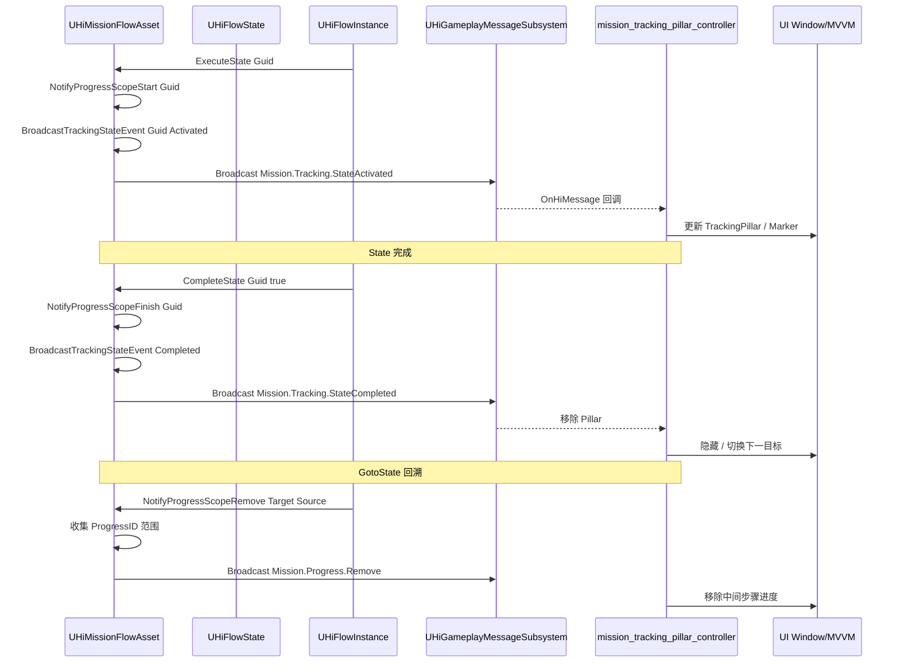
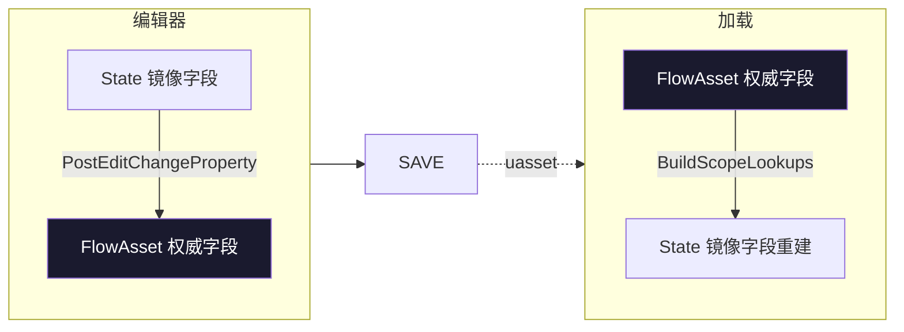

# 12. TrackingScope ProgressScope 与 UI

任务系统通过 **State**(或 FlowAsset 顶层)挂 `ProgressScope`(任务进度作用域)和 `TrackingScope`(追踪作用域),State 生命周期事件触发时通过 **`UHiGameplayMessageSubsystem`** 广播到固定频道,UI 侧(`mission_tracking_pillar_controller.lua` 等)订阅这些频道做地图标记/HUD 更新。本章给出从 State 激活到 UI 刷新的完整链路,对接 UI wiki 的 MVVM/UINotifier。

## State → UI 广播链



## FHiFlowProgressScope — Mission 进度映射

```cpp
USTRUCT(BlueprintType)
struct HIMISSION_API FHiFlowProgressScope
{
    // ── Identity ────────────────────────────────────
    UPROPERTY(VisibleAnywhere, BlueprintReadOnly, Category = "ProgressScope")
    FText ScopeName;                    // 自动从 State.StateName 同步

    UPROPERTY(VisibleAnywhere, BlueprintReadOnly, Category = "ProgressScope")
    FGuid ScopeGuid;

    // ── Mission Binding ─────────────────────────────
    /** MissionID — corresponds to mission_data.lua M.data2 key (e.g., 1001)
     *  0 = inherit from parent scope */
    UPROPERTY(EditAnywhere, BlueprintReadWrite, Category = "ProgressScope|Mission")
    int32 MissionID = 0;

    /** ProgressID — corresponds to event_description_data.lua M.data key (e.g., 201, 20101)
     *  0 = no mapping to external progress */
    UPROPERTY(EditAnywhere, BlueprintReadWrite, Category = "ProgressScope|Progress")
    int32 ProgressID = 0;

    // ── State Binding (non-invasive via FGuid) ──────
    /** 当此 State 激活 → ProgressScope 发 Active 消息
     *  当此 State 完成 → ProgressScope 发 Complete 消息 */
    UPROPERTY(EditAnywhere, BlueprintReadWrite, Category = "ProgressScope|Binding")
    FGuid BoundStateGuid;

    bool IsValid() const { return ScopeGuid.IsValid() && BoundStateGuid.IsValid(); }
};
```

[^12-1]

> **MissionID = 0 表示"继承父 Scope"** — 嵌套 State 上的 ProgressScope 可以省略 MissionID,会自动从父级补齐。
> **ProgressID 对应配表**:`mission_data.lua` 是任务主表,`event_description_data.lua` 是事件描述表。Lua UI 拿到 ProgressID 后查表得到 "完成 X/Y" 这种描述。

## FHiFlowTrackingScope — 跟踪绑定

```cpp
USTRUCT(BlueprintType)
struct HIMISSION_API FHiFlowTrackingScope
{
    UPROPERTY(VisibleAnywhere, BlueprintReadOnly, Category = "TrackingScope")
    FGuid TrackingID;

    UPROPERTY(VisibleAnywhere, BlueprintReadOnly, Category = "TrackingScope")
    FText ScopeName;

    UPROPERTY(VisibleAnywhere, BlueprintReadOnly, Category = "TrackingScope|Binding")
    FGuid BoundStateGuid;

    /** 多个跟踪目标，与 State 同步激活/反激活 */
    UPROPERTY(EditAnywhere, BlueprintReadWrite, Category = "TrackingScope|Tracking")
    TArray<FHiMissionTracking> Trackings;

    bool IsValid() const { return TrackingID.IsValid(); }
};
```

[^12-2]

## FHiMissionTracking — 单条跟踪目标

```cpp
USTRUCT(BlueprintType)
struct HIMISSION_API FHiMissionTracking
{
    // ── Tracking Target ─────────────────────────────
    UPROPERTY(EditAnywhere, BlueprintReadWrite, Category = "MissionTracking|Target")
    FHiActorReference TargetActor;          // Actor 引用（含坐标）

    // ── Visual ──────────────────────────────────────
    UPROPERTY(EditAnywhere, BlueprintReadWrite, Category = "MissionTracking|Visual")
    EHiTrackingPillarType PillarType = EHiTrackingPillarType::BothPillars;

    // ── Behavior ────────────────────────────────────
    UPROPERTY(EditAnywhere, BlueprintReadWrite, Category = "MissionTracking|Behavior")
    bool bIsRangeTrack = false;

    UPROPERTY(EditAnywhere, BlueprintReadWrite, Category = "MissionTracking|Behavior",
        meta = (EditCondition = "bIsRangeTrack", ClampMin = "0.0"))
    float TrackRange = 0.f;

    UPROPERTY(EditAnywhere, BlueprintReadWrite, Category = "MissionTracking|Behavior")
    bool bHideTrack = false;

    // ── Region & Layer ──────────────────────────────
    UPROPERTY(EditAnywhere, BlueprintReadWrite, Category = "MissionTracking|Region")
    int32 MapLayer = 0;

    UPROPERTY(EditAnywhere, BlueprintReadWrite, Category = "MissionTracking|Region")
    int32 LayerGroupID = 0;

    UPROPERTY(EditAnywhere, BlueprintReadWrite, Category = "MissionTracking|Region")
    FHiCrossRegionalTracking CrossRegionalTracking;

    // ── Priority ────────────────────────────────────
    UPROPERTY(EditAnywhere, BlueprintReadWrite, Category = "MissionTracking")
    int32 Priority = 0;
};
```

[^12-3]

### EHiTrackingPillarType — 4 种光柱表现

```cpp
UENUM(BlueprintType)
enum class EHiTrackingPillarType : uint8
{
    BothPillars      = 0,    // 大柱+小柱
    SmallPillarOnly  = 1,    // 仅小柱
    LargePillarOnly  = 2,    // 仅大柱
    NoPillars        = 3,    // 无柱
};
```

[^12-4]

> 这个枚举与蓝图 `E_MissionTrackingPillarType` UserDefinedEnum 对齐 — 数值固定,蓝图侧改了 C++ 也要跟着改。

### FHiCrossRegionalTracking — 跨区追踪

```cpp
USTRUCT(BlueprintType)
struct HIMISSION_API FHiCrossRegionalTracking
{
    UPROPERTY(EditAnywhere, BlueprintReadWrite)
    int32 DungeonID = 0;     // 0 = 同区域，非0 = 跨副本/区域

    UPROPERTY(EditAnywhere, BlueprintReadWrite)
    FString CrossRegionalTrackingTag;   // 匹配 DT_MissionTrackingRegionalData 行名
};
```

[^12-5]

## FHiMissionTrackingNetData — 网络复制最小集

```cpp
USTRUCT(BlueprintType)
struct HIMISSION_API FHiMissionTrackingNetData
{
    UPROPERTY()
    FString ActorID;
    UPROPERTY()
    FVector Location = FVector::ZeroVector;
    UPROPERTY()
    EHiTrackingPillarType PillarType;
    UPROPERTY()
    bool bIsRangeTrack = false;
    UPROPERTY()
    float TrackRange = 0.f;
    UPROPERTY()
    bool bHideTrack = false;
    UPROPERTY()
    int32 MapLayer = 0;
    UPROPERTY()
    int32 LayerGroupID = 0;
    UPROPERTY()
    int32 Priority = 0;

    bool NetSerialize(FArchive& Ar, class UPackageMap* Map, bool& bOutSuccess);
};

namespace HiMissionTrackingConversion
{
    inline FHiMissionTrackingNetData ToNetData(const FHiMissionTracking& Tracking);
}

namespace HiFlowScopeConversion
{
    inline TArray<FHiMissionTrackingNetData> ToNetDataArray(
        const TArray<FHiFlowTrackingScope>& Scopes);
}
```

[^12-6]

> **设计意图**:`FHiMissionTracking` 编辑器全数据(含 ScopeName 等元数据) — 不适合直接走网络;`FHiMissionTrackingNetData` 是网络精简版,通过 `ToNetData` 转换。注意源码注释 `// TODO: [Network Refactor] Location needs to be serialized separately`[^12-7] 暗示当前网络层尚未真正接入。

## Editor-only mirror 机制

State 上的 `ProgressScope`/`TrackingSettings` 是 `WITH_EDITORONLY_DATA`:

```cpp
// HiFlowState.h
#if WITH_EDITORONLY_DATA
    UPROPERTY(EditAnywhere, Category = "State|ProgressScope")
    FHiQuestProgress ProgressScope;        // Editor 镜像（权威在 FlowAsset.ProgressScopes）

    UPROPERTY()
    TArray<FGuid> TrackingScopeGuids;      // Editor 镜像

    UPROPERTY(EditAnywhere, Category = "State|TrackingScope")
    TArray<FHiMissionTracking> TrackingSettings;  // Editor 镜像
#endif
```

[^12-8]

权威数据在 FlowAsset:

```cpp
// HiMissionFlowAsset.h
UPROPERTY(VisibleAnywhere, BlueprintReadWrite, Category = "HiFlowAsset")
TArray<FHiFlowProgressScope> ProgressScopes;

UPROPERTY(VisibleAnywhere, BlueprintReadWrite, Category = "HiFlowAsset")
TArray<FHiFlowTrackingScope> TrackingScopes;
```

同步流向:



## ProgressScope 三个 Notify 通道

```cpp
// HiMissionFlowAsset.h
// 当 State 激活时，检查 ProgressScope 并广播 Start 通知
void NotifyProgressScopeStart(const FGuid& StateGuid);

// 当 State 完成时，检查 ProgressScope 并广播 Finish 通知
void NotifyProgressScopeFinish(const FGuid& StateGuid);

// 当 GotoState 回溯跳转时，收集从目标 State 到源 State 范围内所有 State 的 ProgressID
// 并广播 Remove 通知。用于通知 Lua 层移除中间步骤的任务进度
void NotifyProgressScopeRemove(const FGuid& TargetStateGuid, const FGuid& SourceStateGuid);

// 递归收集 State 及其所有子 State 中绑定了 ProgressScope 的 ProgressID
void CollectProgressIDsRecursive(const UHiFlowState* State, TArray<int32>& OutProgressIDs) const;
```

[^12-9]

## TrackingScope 广播

```cpp
/**
 * Broadcast tracking scope data via GameplayMessage when a State lifecycle event occurs.
 * Queries TrackingScopes bound to the State, serializes their tracking targets to JSON,
 * and broadcasts on "Mission.Tracking.State{EventType}" channel.
 *
 * Called by FlowInstance at the precise lifecycle moment (ExecuteState/CompleteState/AbortState).
 *
 * @param StateGuid - The State whose tracking scopes should be broadcast
 * @param EventType - "Activated", "Completed", or "Aborted"
 */
void BroadcastTrackingStateEvent(const FGuid& StateGuid, const FString& EventType);
```

[^12-10]

频道命名规则:`Mission.Tracking.State<EventType>`,即:

| State 生命周期 | 频道 |
|---|---|
| ExecuteState (激活) | `Mission.Tracking.StateActivated` |
| CompleteState (完成) | `Mission.Tracking.StateCompleted` |
| AbortState (中止) | `Mission.Tracking.StateAborted` |

载荷:TrackingScope 的 Trackings 数组序列化为 JSON。

## 服务端运行时 Lookup Cache

```cpp
private:
    // ProgressScope: StateGuid → index in ProgressScopes
    UPROPERTY(Transient)
    TMap<FGuid, int32> StateGuidToProgressScopeIndex;

    // ProgressScope: ProgressID → index in ProgressScopes
    UPROPERTY(Transient)
    TMap<int32, int32> ProgressIDToScopeIndex;

    // TrackingScope: StateGuid → array of indices in TrackingScopes
    UPROPERTY(Transient)
    TMap<FGuid, FHiFlowTrackingScopeIndexArray> StateGuidToTrackingScopeIndices;
```

[^12-11]

`FHiFlowTrackingScopeIndexArray`[^12-12] 是个 wrapper:

```cpp
USTRUCT()
struct FHiFlowTrackingScopeIndexArray
{
    UPROPERTY()
    TArray<int32> Indices;
};
```

> 必须 wrapper 因为 `TArray<int32>` 不能直接做 `UPROPERTY TMap` 的 value(UE 反射限制)。

## API: Find / FindOrCreate

```cpp
// FlowAsset 上的查询 API（运行时使用）
const FHiFlowProgressScope* FindProgressScopeByStateGuid(const FGuid& StateGuid) const;
const FHiFlowProgressScope* FindProgressScopeByProgressID(int32 InProgressID) const;
int32 ResolveEffectiveMissionID(const FHiFlowProgressScope& Scope) const;

TArray<const FHiFlowTrackingScope*> FindTrackingScopesByStateGuid(const FGuid& StateGuid) const;
const FHiFlowTrackingScope* FindTrackingScopeByID(const FGuid& InTrackingID) const;

#if WITH_EDITOR
// 编辑器便利方法
FHiFlowProgressScope* FindOrCreateProgressScopeForState(const FGuid& StateGuid);
FHiFlowTrackingScope* FindOrCreateTrackingScopeForState(const FGuid& StateGuid);
bool RemoveProgressScopeForState(const FGuid& StateGuid);
bool RemoveTrackingScopeByID(const FGuid& InTrackingID);
#endif
```

[^12-13]

> `ResolveEffectiveMissionID(Scope)` 实现 `MissionID = 0` 时回退到父 Scope/FlowAsset 的逻辑。

## Lua 侧 — mission_node_event_base.lua

`mission_node_event_base.lua:221-247`[^12-14]:

```lua
function MissionNodeEventBase:ProcessFlowNodeTracking()
    if not self:CheckTrackingData() then
        return 
    end
    
    local TrackingSystemComponent = self:GetTrackingSystemComponent()
    if TrackingSystemComponent then
        TrackingSystemComponent:ProcessFlowNodeTracking(self:GetMissionID(), self)
    end
end

function MissionNodeEventBase:ClearFlowNodeTracking()
    if not self:CheckTrackingData() then
        return
    end
    
    local TrackingSystemComponent = self:GetTrackingSystemComponent()
    if TrackingSystemComponent then
        TrackingSystemComponent:ClearFlowNodeTracking(self:GetMissionID(), self)
    end
end

function MissionNodeEventBase:CheckTrackingData()
    local TrackingSettingArray = self:GetTrackingSettings()
    if not TrackingSettingArray then return false end
    return TrackingSettingArray:Length() > 0
end

function MissionNodeEventBase:GetTrackingSystemComponent()
    local OwnerActor = self:K2_GetOwnerActor()
    if not OwnerActor then return end

    local MissionTrackingManager = OwnerActor.MissionTrackingManager
    if not OwnerActor:IsA(UE.APlayerState) and not MissionTrackingManager then
        return
    end
    return MissionTrackingManager
end
```

> **节点级 Tracking 也存在(不只是 State)** — `MissionNodeEventBase` 在 `K2_OnActivate` 里调 `ProcessFlowNodeTracking`,在 `K2_Cleanup` 里调 `ClearFlowNodeTracking`。FlowMode 里没有 State,Tracking 直接挂在节点级。

## 与 UI wiki 的衔接

UI 的 `mission_tracking_pillar_controller.lua`(完整研究在 UI wiki)订阅 GameplayMessage 频道:

| 任务系统侧 | UI wiki 侧 |
|---|---|
| `BroadcastTrackingStateEvent` 广播 | `8. UI 事件原语与 UINotifier`(`UHiGameplayMessageSubsystem` 是项目消息总线) |
| TrackingScope.Trackings 数据 | `6. MVVM 数据绑定` 中的 ViewModel 拿数据 |
| State.ProgressScope 进度 | UI 任务面板的 `MVVM` 字段 |


详见 UI wiki 第 6 章和第 8 章。

## FHiActorReference — 任务系统的 Actor 引用结构

`FHiActorReference` 在 `Plugins/HiMission/Source/HiMission/Public/ActorReferences/` 目录,本 wiki 不展开。它是 `FHiMissionTracking::TargetActor` 的类型,提供:
- `TSoftObjectPtr<AActor>` 软引用
- `FString ID`(从 Actor Label 提取的 ID)
- 坐标信息

> 与 `FHiMissionActorReferenceToID`(`HiMissionTypes.h:493-507`)语义类似但定义不同 — 留意区分。

---

## Sources

[^12-1]: `Plugins/HiMission/Source/HiMission/Public/HiFlowScopeTypes.h:21-72` — `FHiFlowProgressScope`
[^12-2]: `Plugins/HiMission/Source/HiMission/Public/HiFlowScopeTypes.h:88-134` — `FHiFlowTrackingScope`
[^12-3]: `Plugins/HiMission/Source/HiMission/Public/Trackings/HiMissionTrackingTypes.h:56-132`
[^12-4]: `Plugins/HiMission/Source/HiMission/Public/Trackings/HiMissionTrackingTypes.h:19-26`
[^12-5]: `Plugins/HiMission/Source/HiMission/Public/Trackings/HiMissionTrackingTypes.h:33-45`
[^12-6]: `Plugins/HiMission/Source/HiMission/Public/Trackings/HiMissionTrackingTypes.h:139-233`
[^12-7]: `Plugins/HiMission/Source/HiMission/Public/Trackings/HiMissionTrackingTypes.h:147-149` — TODO 注释
[^12-8]: `Plugins/HiMission/Source/HiMission/Public/States/HiFlowState.h:181-204`
[^12-9]: `Plugins/HiMission/Source/HiMission/Public/HiMissionFlowAsset.h:427-475`
[^12-10]: `Plugins/HiMission/Source/HiMission/Public/HiMissionFlowAsset.h:447-459` — `BroadcastTrackingStateEvent`
[^12-11]: `Plugins/HiMission/Source/HiMission/Public/HiMissionFlowAsset.h:462-472`
[^12-12]: `Plugins/HiMission/Source/HiMission/Public/HiMissionFlowAsset.h:135-142`
[^12-13]: `Plugins/HiMission/Source/HiMission/Public/HiMissionFlowAsset.h:411-445, 510-520`
[^12-14]: `Content/Script/mission/mission_node/mission_node_event_base.lua:221-275`

## Cross-link

→ [3. HiMissionFlowAsset](3.%20HiMissionFlowAsset%20解剖.md) Scope 字段在 Asset 上
→ [6. State 机制](6.%20State%20机制%20—%20StateTree%20风格.md) State 与 Scope 绑定
→ UI wiki 第 6 章 MVVM 数据绑定
→ UI wiki 第 8 章 UI 事件原语与 UINotifier
