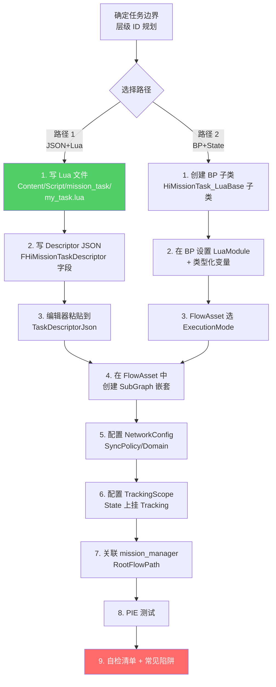
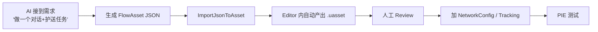
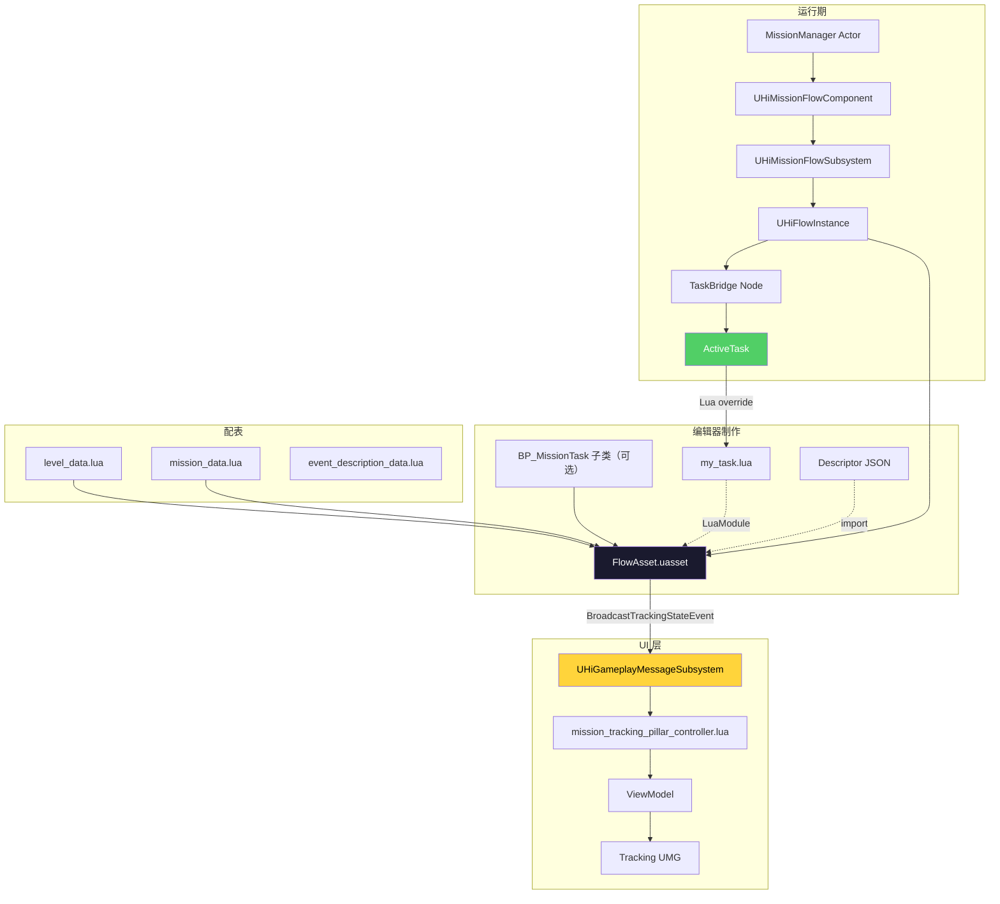

# 13. Cookbook — 加一个新任务

把前面 12 章串起来,给一个真实的"从 0 加一个新任务"的步骤指南,配自检清单和常见陷阱。涵盖两条路径:**纯 Lua + JSON 驱动 TaskBridge**(推荐 AI 写新任务)和**蓝图子类 + State 模式**(适合策划/有交互需求)。最后给出 `UHiAIFlowImporter` 自动化工具的实战示例。

## 完整流程



## 路径 1 — JSON + Lua(推荐 AI 用)

### 步骤 1.1: 写 Lua 文件

`Content/Script/mission_task/my_task.lua`:

```lua
-- 模式 A: 纯 Lua + KV 参数
local G = require("G")

---@type UHiMissionTask_LuaBase
local MyTask = Class()

function MyTask:OnTaskActivate()
    -- 读 KV 参数
    local NpcId = self:GetParam("npcId")
    local DialogueId = self:GetParamAsInt("dialogueId", 0)
    
    G.log:debug("MyTask", "Activate npcId=%s dialogueId=%d", NpcId, DialogueId)
    
    -- 注册等待事件
    self:RegisterEvent(UE.UHiMissionEvent_DialogueComplete, "OnDialogueDone")
    
    -- 触发立即动作
    self:RequestAction(UE.UHiMissionAction_StartDialogue)
end

function MyTask:OnDialogueDone(EventGuid, InstanceName, ParamStr)
    G.log:debug("MyTask", "Dialogue done")
    self:FinishTask("Success")
end

function MyTask:OnTaskAbort()
    -- 事件清理由 TaskBridge 统一处理
    -- 但订阅外部回调要在这里清
end

function MyTask:OnTaskResume()
    -- 断线重连专用
    -- 如果有外部监听需要重新注册，放这里
end

function MyTask:GatherSaveData()
    -- ⚠️ 必须用返回值，不要用 UPARAM(ref)
    local SaveData = {}
    SaveData.Version = 1
    SaveData.bNeedsRestore = false   -- 无状态 task
    return SaveData
end

function MyTask:ApplySaveData(InData)
    -- 根据 InData.Version 做版本兼容
    if InData.Version == 1 then
        -- ...
    end
end

return MyTask
```

### 步骤 1.2: 写 Descriptor JSON

```json
{
  "taskType": "MyTask",
  "displayName": "我的任务",
  "luaModule": "CommonScript.mission_task.my_task",
  "serverLuaModule": "CommonScript.mission_task.my_task",
  "clientLuaModule": "CommonScript.mission_task.my_task",
  "commonLuaModule": "CommonScript.mission_task.my_task",
  "inputPins": ["In"],
  "outputPins": ["Success", "Failure"],
  "config": {
    "npcId": "NPC_001",
    "dialogueId": "1234"
  },
  "description": "对 NPC_001 触发对话 1234",
  "nodeGuid": ""
}
```

### 步骤 1.3: 编辑器粘贴

在 FlowAsset 编辑器:
1. 拖一个 `TaskBridge` 节点到画布
2. 选中节点 → Detail Panel → `TaskDescriptorJson` → 多行编辑器粘贴上面的 JSON
3. 焦点离开 → `PostEditChangeProperty` 触发 `ImportFromDescriptorJson`
4. 自动生成 `UHiMissionTask_LuaBase` 实例,填到 `TaskConfig`
5. 节点 Pin 自动刷新为 In / Success / Failure
6. `nodeGuid` 字段自动填回(`AutoFillNodeGuidToJson`)

### 步骤 1.4: FlowAsset 嵌套

参考第 5 章的层级:
```
Root FlowAsset
└─ MissionGroup (ID=1)
   └─ MissionAct (ID=11)
      └─ Mission (ID=111, IconType=Track)
         └─ MissionFragment (ID=1111)
            └─ NodeGraph (匿名子图)
               └─ TaskBridge (粘贴 JSON)
```

## 路径 2 — 蓝图子类 + State 模式

### 步骤 2.1: 创建 BP 子类

1. Content Browser → New → Blueprint Class
2. 父类选 `UHiMissionTask_LuaBase`
3. 命名 `BP_MissionTask_PlayDialogue`
4. 蓝图 Variables 面板:
   - `NpcReference: TSoftObjectPtr<AActor>`
   - `DialogueId: int32`
   - `Duration: float = 2.5`

### 步骤 2.2: BP 重写 ModuleName

蓝图 → Override → `获取服务端模块名` / `获取客户端模块名` / `Get Module Name` 各返回 lua 路径。

### 步骤 2.3: FlowAsset 切 StateMode

打开 FlowAsset:
1. Detail Panel → `Execution Mode` 选 `State Mode`
2. 通过 Outliner Tab 创建顶层 State `Stage1`
3. 双击 Stage1 → 子图编辑器打开
4. 在子图加:`StateStart` → `TaskBridge`(选 `BP_MissionTask_PlayDialogue`)→ `StateSuccess`
5. 在 State Outliner 选中 Stage1,在 StateDetails Tab:
   - `Progress Scope` → MissionID = 111, ProgressID = 11101
   - `Tracking Settings` → 加一条 Tracking 指向 NPC Actor
   - `Transitions` → 加 OnSucceeded → NextState

### 步骤 2.4: 创建 Stage2 / 多 State

在 Outliner 继续创建 Stage2、Stage3...,设置:
- `Stage2.Transitions` → OnFailed → GotoState `StageFailFallback`
- `StageFailFallback.StateType` → `LinkedState`(只能 Transition 进入)
- `Stage3.ChildExecutionMode` → `Sequential` 让其下子 State 顺序执行

## 步骤 5 — 配置 NetworkConfig

参考第 8 章决策树。常见配置:

| 用途 | SyncPolicy | MultiClientStrategy | 关键字段 |
|---|---|---|---|
| 单人对话 | `WaitCallback` | `None` | `ClientCallbackTimeout = 30` |
| 多人开 Boss | `WaitCallback` | `WaitAny` | — |
| 多人解谜全员到位 | `WaitCallback` | `WaitAll` | `bAllowPartialSuccess = true` |
| 多人投票 | `WaitCallback` | `WaitMajority` | — |
| 服务端记录 | `None` | — | — |
| 表现 cutscene | `NotifyClient` | — | — |

在节点 Detail Panel 的 `Network Config` 区域填。

## 步骤 6 — 配置 TrackingScope

State 模式下,在 State Detail Panel 加 `Tracking Settings`:
- `TargetActor.ID` 填 NPC 的 Actor Label(按 `@` 分割取第一段)
- `PillarType` 选 `BothPillars` / `SmallPillarOnly` 等
- `Priority` 决定多个 Tracking 同时 active 时谁优先显示
- `bIsRangeTrack + TrackRange` 用于范围圈而非具体目标

> Editor 上修改的是 State 镜像,`PostEditChangeProperty` 自动同步到 FlowAsset.TrackingScopes 权威字段。

## 步骤 7 — 关联 RootFlowPath

两种方式:

### 方式 A: 配表(推荐生产)

`level_data.lua` 加一行:
```lua
data[123456] = {
    -- ...
    scene_root_flowgraph = "/Game/Mission/MyMission/MyRootFlow.MyRootFlow",
}
```

### 方式 B: WorldSettings(关卡内嵌)

在场景 WorldSettings → `Mission Root Flow` 字段引用 FlowAsset。

## 步骤 8 — PIE 测试

```
1. 打开关卡（DungeonID 已配置）
2. PIE 启动
3. MissionManager:OnPreInitializeComponents 读 RootFlowPath
4. 设置到 self.MissionFlowComponent.RootFlowPath
5. UHiMissionFlowComponent::BeginPlay → 加载 .uasset
6. UHiMissionFlowSubsystem::StartCreatedRootFlow
7. UHiFlowInstance 启动
8. 走到你的 TaskBridge 节点
9. ActiveTask = NewObject from TaskConfig template
10. InjectContext → Activate → OnTaskActivate（你的 Lua）
11. ...
12. FinishTask("Success") → TriggerOutput
```

观察 Output Log,关键 LOG_CATEGORY:
- `MissionNodeEventBase` — 节点级事件
- `LogHiMission` / `LogHiMissionAction` / `LogHiMissionTask` — C++ 各模块
- `xaelpeng` / `apodzhang` / `virgilzhuge` — 项目主程作者标签

## 12 项自检清单

写完一个新任务后,过这一遍:

| # | 检查项 | 自动化检查方法 |
|---|---|---|
| 1 | ✅ Mission ID 在 `MissionGroupID/MissionActID/MissionID/MissionFragmentID` 不冲突 | 运行 `UHiMissionFlowSubsystem::AddMission` 看是否返回 false |
| 2 | ✅ FlowAsset 的 `InstanceName` / `SubFlowCustomInstanceName` 清晰(嵌套时) | 检查 `GetInstanceName()` 返回不冲突 |
| 3 | ✅ NetworkConfig 没有用 None 但又需要 broadcasts to clients | 在节点 Detail Panel 检查 `SyncPolicy` |
| 4 | ✅ Lua 模块路径用点号不是斜杠 | 灰度跑一遍,看是否报 module not found |
| 5 | ✅ Lua 文件名不带空格(避免 `mission_node_ maskinput.lua` 那种) | `find -name '* *'` 扫一遍 |
| 6 | ✅ TaskDescriptorJson 与 TaskConfig 二选一 | JSON 优先,粘贴 JSON 时会自动覆盖 TaskConfig |
| 7 | ✅ State Mode 与 Flow Mode 不混用 | FlowAsset 的 `ExecutionMode` 字段 |
| 8 | ✅ ProgressScope 只挂在 State 上(不要直接在顶层乱挂) | Editor 自动 — `BoundStateGuid` 不能为空 |
| 9 | ✅ `OnTaskActivate` 幂等(断线重连会重调) | 用 bActivated 标志位保护副作用 |
| 10 | ✅ `GatherSaveData` 用返回值不用 UPARAM(ref) | 看接口签名 — 必然返回 `FHiMissionTaskSaveData` |
| 11 | ✅ `Construct` 中所有 `RegisterEvent` 在 `Cleanup` 中 `UnregisterEvent`(除非走 TaskBridge 自动管理) | 走 TaskBridge 一律自动;手写 FlowNode 必须配对 |
| 12 | ✅ Resume 路径:OnLoad → Activate → TriggerResume → OnTaskResume,不要把外部监听放在 OnTaskActivate | 检查 `OnTaskActivate` 是否注册外部 Listener — 必须放 `OnTaskResume` |

## 10 类常见陷阱

| # | 陷阱 | 表现 | 解决 |
|---|---|---|---|
| 1 | `FSoftClassPath SaveGame` 但不持久化 | 加载后 `SavedTaskClassPath` 总是空 | 走 `FString TaskClassPath` + `CustomData JSON` 通道(见第 9 章) |
| 2 | UnLua UPARAM(ref) 结构体回写问题 | Lua 修改后 C++ 拿到旧值 | 改用返回值模式 |
| 3 | DEPRECATED 老 API 误用 | `RegisterMissionIdentifiers`(复数)5.0 deprecated | 用 `RegisterMissionIdentifier`(单数) |
| 4 | MissionRootFlow 没设 | MissionManager 读不到 RootFlowPath | 检查 `level_data.lua` 或 WorldSettings |
| 5 | TaskBridge Pin 没刷新 | 改 Task 类后 Pin 不更新 | 重新选一次 TaskConfig 触发 PostEditChangeProperty |
| 6 | State.ProgressScope 是 Editor-only | 运行时 query state 上的 ProgressScope 拿 nullptr | 用 `FlowAsset.ProgressScopes` 权威字段 |
| 7 | NotifyClient + 客户端无 listener | 静默丢消息 | 客户端 lua 必须订阅对应频道 |
| 8 | MultiPlayer + bAllowPartialSuccess + WaitAll 边界 | 玩家全离线时永久卡住 | 配合 `OverallTimeout` + `PerClientTimeout` |
| 9 | GotoState 回溯忘了 `NotifyProgressScopeRemove` | UI 进度无法清空 | 走 `CompleteState` → 内部自动调用,不要手动 ExecuteState |
| 10 | 直接修改运行时 TaskConfig | 影响所有同类 task | 必须走 ActiveTask Clone 路径 — `TaskConfig` 标 `Instanced` 是模板 |

## AI 工具链入口 — UHiAIFlowImporter

`Plugins/HiFlowGraph/Source/HiAIFlowEditor/Public/HiAIFlowImporter.h:8-37`[^13-1]:

```cpp
UCLASS(BlueprintType, Blueprintable)
class HIAIFLOWEDITOR_API UHiAIFlowImporter : public UObject
{
    GENERATED_BODY()
public:
    UFUNCTION(BlueprintCallable)
    static void ImportJsonToAsset(const FString& JsonPath, const FString& FlowAssetName);

private:
    static void ExecuteImportJsonToAsset(const FString& JsonPath, const FString& FlowAssetName);

    static void CreateStartNode(const TSharedPtr<FJsonObject>& NodeJsonObj,
        UFlowAsset* FlowAsset, UObject*& StartNode);
    static void TryCreateFlowConnection(const FString& FromNodeID, const FString& FromPinName,
        const FString& LinkToNodeID, const FString& LinkToNodeName,
        const TMap<FString, UObject*>& Nodes, const UEdGraphSchema* GraphSchema);
    static void TryCreateStartConnection(const FString& LinkToNodeID, const FString& LinkToNodeName,
        UObject* StartNode, const TMap<FString, UObject*>& Nodes,
        const UEdGraphSchema* GraphSchema);
    static void CreateFlowNode(const TSharedPtr<FJsonObject>& NodeJsonObj,
        TMap<FString, UObject*>& Nodes,
        UFlowAsset* FlowAsset, UEdGraph* FlowGraph, int32& NodePosCount,
        const TMap<FGameplayTag, TArray<FName>>& AllInOneOutputPinsMap);
    static void RefreshGraphNodeContentPins(UFlowGraphNode* GraphNode,
        const TMap<FGameplayTag, TArray<FName>>& AllInOneOutputPinsMap);
    static void InitAllInOneOutputPinsMap(TMap<FGameplayTag, TArray<FName>>& AllInOneOutputPinsMap);
    static void GetAllInOneOutputPins(UFlowNode* FlowNode, TArray<FName>& OutPins,
        const TMap<FGameplayTag, TArray<FName>>& AllInOneOutputPinsMap);
    static UObject* GenerateFlowGraphNode(UClass* FlowNodeClass, UEdGraph* FlowGraph,
        int32& NodePosCount);
};
```

### 用法 (Blueprint Editor Utility 或 Python)

蓝图 EUtility:
```
ImportJsonToAsset(
    JsonPath = "C:/path/to/my_flow.json",
    FlowAssetName = "/Game/Mission/MyAutoGenFlow.MyAutoGenFlow"
)
```

执行后,在 `/Game/Mission/` 自动生成 .uasset。

### JSON 顶层格式(推断)

完整 JSON 顶层应包含:
```json
{
  "nodes": [
    {
      "type": "Start",        // 由 CreateStartNode 处理
      "id": "start-1"
    },
    {
      "type": "TaskBridge",
      "id": "node-1",
      "class": "/Game/.../BP_MissionTask_PlayDialogue.BP_MissionTask_PlayDialogue_C",
      "config": { ... },
      "outputPins": ["Success", "Failure"],
      "links": [
        {
          "fromPin": "Success",
          "toNode": "node-2",
          "toPin": "In"
        }
      ]
    },
    {
      "type": "AllInOne",
      "id": "node-2",
      "tag": "Event.OnShapeTrigger",   // 通过 Tag 路由到 AllInOneFactory
      "config": { ... }
    }
  ]
}
```

> **AllInOne 节点的 Tag 映射**:`InitAllInOneOutputPinsMap`[^13-2] 把 `FGameplayTag → TArray<FName>` 输出 Pin 关系建好,JSON 解析时通过 `FGameplayTag` 反查得知该节点应有哪些输出 Pin。

### AI 自动生成的核心思路



## 进阶阅读

- **HiMissionMCP 插件** — `Plugins/HiMissionMCP/HiMissionMCP.uplugin` 是项目内置的 MCP 工具,给 AI 直接调任务系统 API 用,本 wiki 不展开
- **external-message-system** — `Plugins/HiMission/Docs/external-message-system.md` 给出节点 ↔ Lua/AI 异步通信的完整协议
- **HiMissionTaskMetadataManager** — `Plugins/HiMission/Source/HiMissionEditor/Public/HiMissionTaskMetadataManager.h` 是给 AI/工具批量查询 Task 元数据的入口

## 一图收尾 — 完整接入图



---

## Sources

[^13-1]: `Plugins/HiFlowGraph/Source/HiAIFlowEditor/Public/HiAIFlowImporter.h:8-37`
[^13-2]: `Plugins/HiFlowGraph/Source/HiAIFlowEditor/Public/HiAIFlowImporter.h:30-31` — `InitAllInOneOutputPinsMap`

## Cross-link

→ [3-12 章节] 逐章对应自检清单的每一项
→ `Plugins/HiMission/Docs/external-message-system.md` 外部消息协议
→ `Plugins/HiMissionMCP/` MCP 工具
→ UI wiki 完整 UI 编写指南
