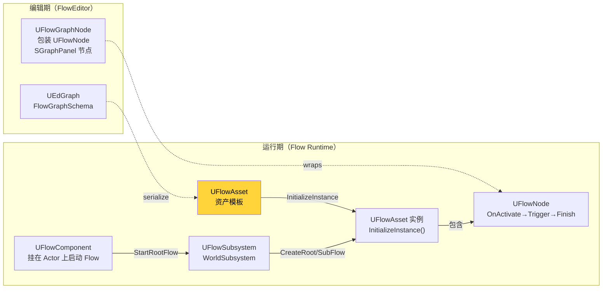

# 2. Flow 三件套 — 社区 FlowGraph 速览

HiMission 站在 **MothCocoon 社区开源版 FlowGraph**[^2-1] 之上 — Hi 不 fork 这套源码,只通过继承扩展。本章只讲 Hi 扩展点会用到的最少 Flow 知识:`UFlowAsset` / `UFlowNode` / `UFlowComponent` / `UFlowSubsystem` 四件套,`InputPin`/`OutputPin` 模型,`EdGraph` 双图机制(Asset 内 EdGraph + Runtime FlowAsset)。其余的(如 `DialogueFlowAsset`/Operators)只列名称,不展开。

## 编辑期 vs 运行期



## 四件套各自的角色

### UFlowAsset[^2-2]

```cpp
UCLASS(BlueprintType, hideCategories = Object)
class FLOW_API UFlowAsset : public UObject
{
    UPROPERTY(VisibleAnywhere, BlueprintReadOnly, Category = "Flow Asset")
    FGuid AssetGuid;

    UPROPERTY(EditAnywhere, BlueprintReadWrite, Category = "Flow Asset")
    EFlowAssetType AssetType = EFlowAssetType::Common;

    EFlowInstanceType InstanceType = EFlowInstanceType::Server; 
    
    // ...
};
```

要点:
- **`UObject` 而非 `UDataAsset`** — 因为它在编辑器侧持有 `UEdGraph FlowGraph`,可在 Asset Editor 内编辑
- `AssetGuid` 唯一标识资产
- `EFlowAssetType`(`Common`/...)区分机关 vs 任务等
- `EFlowInstanceType`(`Client`/`Server`)是**运行时**实例类型 — 客户端跟服务端拿同一个 Asset,但实例化不同
- 关键友元:`UFlowNode`、`UFlowSubsystem`、`UFlowGraphSchema`、`UFDSubGraph`(就是 Hi 这边的 `HiMissionFlowNode_NodeGraph` 的祖父)

### UFlowNode[^2-3]

```cpp
UCLASS(Abstract, Blueprintable, HideCategories = Object)
class FLOW_API UFlowNode : public UObject, public IVisualLoggerDebugSnapshotInterface
{
    friend class SFlowGraphNode;
    friend class UFlowAsset;
    // ...
private:
    UPROPERTY()
    TObjectPtr<UEdGraphNode> GraphNode;
};
```

要点:
- 也是 `UObject`,可序列化
- 自带 `GraphNode` 弱反向引用(运行时实例可以反查编辑器节点)
- `UFlowNode::DefaultOutputPin`(static)定义"默认输出引脚",PinName = `Out`
- 节点的 4 个标准生命周期方法:`InitializeInstance()` / `ExecuteInput(PinName)` / `TriggerOutput(PinName, bFinish)` / `Cleanup()`
- 节点状态机:`EFlowNodeState`(`NeverActivated` / `Active` / `Completed` / `Aborted`)— Hi 又另外加了 `EHiMissionNodeState`(参见第 4 章)

### FFlowPin[^2-4]

```cpp
USTRUCT()
struct FLOW_API FFlowPin
{
    UPROPERTY(EditDefaultsOnly, Category = "FlowPin")
    FName PinName;

    UPROPERTY(EditDefaultsOnly, Category = "FlowPin")
    FString PinToolTip;
    
    // 多个构造器接收 FName/FString/FText/TCHAR/int32/uint8
    
    FORCEINLINE bool IsValid() const { return !PinName.IsNone(); }
};
```

要点:
- 只是 `FName + FString tooltip` 的轻量 USTRUCT
- 节点用 `TArray<FFlowPin> InputPins/OutputPins` 声明
- HiMissionFlowNode 大量使用 `SupportsContextPins() = true` 的能力(动态 Pin),`GetContextInputs/Outputs` 返回 `TArray<FName>` 在 PostEdit 时刷新引脚

### UFlowSubsystem / UFlowComponent

| 角色 | 父类 | 职责 |
|---|---|---|
| `UFlowSubsystem` | `UWorldSubsystem` | World 域的 Flow 中枢:CreateRootFlow / CreateSubFlow / FinishRootFlow |
| `UFlowComponent` | `UActorComponent` | 挂在 Actor 上的 Flow 触发器:`StartRootFlow(Asset, ...)`,通过 IdentityTags 与 Subsystem 串联 |

Hi 这边各自继承出:
- `UHiMissionFlowSubsystem`(添加 4 个全局 ID 索引,见第 5 章)
- `UHiMissionFlowComponent`(添加 `RootFlowGroupName/RootFlowPath`,见第 7 章)
- `UHiFlowManagerComponent`(顶层管理器,挂 MissionManager / Player)

## EdGraph 双图机制

UE 的 EdGraph 系统是编辑器视觉化图表的通用框架。FlowGraph 在编辑器侧的存储是这样的:

```
UFlowAsset
  ├─ TArray<UFlowNode> Nodes    ← 运行时只用这一份（轻量）
  └─ #if WITH_EDITORONLY_DATA
     UEdGraph* FlowGraph        ← 编辑器图（UEdGraphNode 顶点 + UEdGraphPin 连线）
       └─ UFlowGraphNode (包装 UFlowNode)
```

要点:
- **运行时只剩 `Nodes` 数组** — `WITH_EDITORONLY_DATA` 包裹的 `FlowGraph` 在打包时不参与
- 一个 `UFlowNode` 对应一个 `UFlowGraphNode`(后者持有视觉位置 + Pin Wire)
- 编辑器添加节点 = 同时创建 `UFlowNode` + `UFlowGraphNode`,通过 `UFlowAsset::CreateNode(NodeClass, GraphNode)` 联动
- Hi 的 `UHiMissionFlowAsset::CreateNode`[^2-5] 重写了此方法,加入了 NodeTitle 唯一性检查与 `InitializeAllWorkActionParentReferences`

## HiFlowGraph 加了什么

Hi 的 **`HiFlow` Runtime 模块只多了 `HiFlowModule.cpp` 一文件**[^2-6] — 实际扩展全在 `HiMission` 模块。这意味着:

| 子模块 | 作用 |
|---|---|
| `Plugins/HiFlowGraph/Source/HiFlow` | 几乎是空壳,提供模块占位 |
| `Plugins/HiFlowGraph/Source/HiAIFlowEditor` | **AI 工具链入口** — `UHiAIFlowImporter::ImportJsonToAsset(JsonPath, FlowAssetName)`[^2-7] |

`UHiAIFlowImporter` 是 BlueprintCallable 静态方法,流程是:

```
JSON 文件 → 解析 → 创建 UFlowAsset → 创建 UEdGraph
         → CreateStartNode → 遍历 Nodes 创建 UFlowGraphNode
         → 通过 GameplayTag 映射到 AllInOne 输出引脚
         → TryCreateFlowConnection 建立 Wire
         → 序列化保存 .uasset
```

详见第 13 章 Cookbook。

## 这一章特意没讲的东西

- `UFlowNode` 的 `Save Game` 接口(`OnSave_Implementation`/`OnLoad_Implementation`)— 第 9 章持久化
- `UFlowNode_SubGraph`(社区版的子图节点) — 第 5 章 Mission 层级
- `UFlowNode_CustomInput`/`UFlowNode_CustomOutput`(子图的进出口) — 第 5 章
- `UFlowNode_Start`(每个 FlowAsset 的入口) — 第 6 章 State 模式中讨论"State Mode 不再走 Start"

---

## Sources

[^2-1]: `Plugins/FlowGraph/Flow.uplugin:1-50` — 来源 `https://github.com/MothCocoon/FlowGraph`,EngineAssociation 5.0
[^2-2]: `Plugins/FlowGraph/Source/Flow/Public/FlowAsset.h:49-110`
[^2-3]: `Plugins/FlowGraph/Source/Flow/Public/Nodes/FlowNode.h:64-114`
[^2-4]: `Plugins/FlowGraph/Source/Flow/Public/Nodes/FlowPin.h:7-80`
[^2-5]: `Plugins/HiMission/Source/HiMission/Public/HiMissionFlowAsset.h:553` — `CreateNode` 重写
[^2-6]: `Plugins/HiFlowGraph/Source/HiFlow/Private/HiFlowModule.cpp`
[^2-7]: `Plugins/HiFlowGraph/Source/HiAIFlowEditor/Public/HiAIFlowImporter.h:8-37`

## Cross-link

→ [3. HiMissionFlowAsset 解剖](3.%20HiMissionFlowAsset%20解剖.md) 看 Hi 在 FlowAsset 之上加了什么
→ [4. 节点四件套生命周期](4.%20节点四件套生命周期.md) 看 Hi 在 FlowNode 之上加了什么
→ [13. Cookbook](13.%20Cookbook%20—%20加一个新任务.md) HiAIFlowImporter 实战
