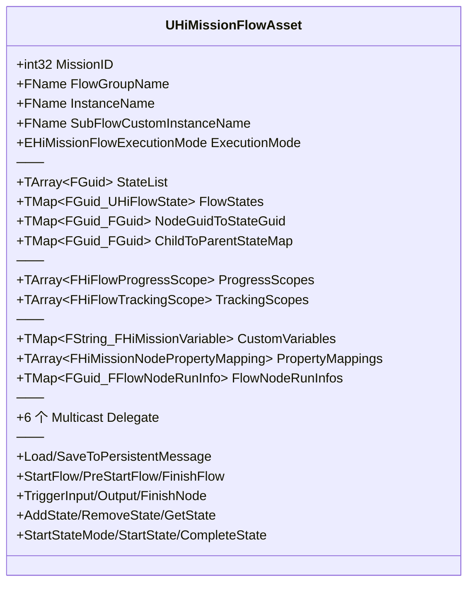
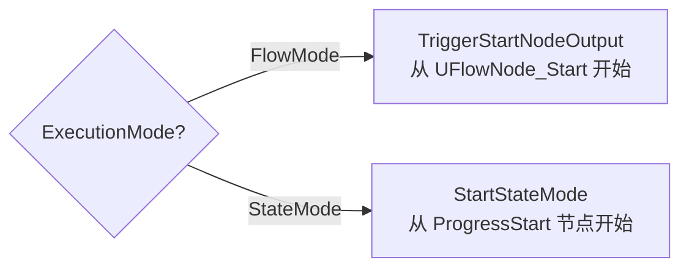
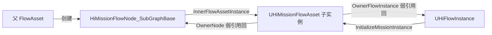

# 3. HiMissionFlowAsset 解剖

`UHiMissionFlowAsset` 是任务系统的"资产单元",继承 `UFlowAsset` + 实现 `IHiMissionFlowAssetInterface`[^3-1]。它有**双执行模式(FlowMode/StateMode)**、自带 `CustomVariables` 变量表、嵌套子图(`SubFlowCustomInstanceName`)、Protobuf 序列化、`ProgressScope`/`TrackingScope` 双作用域。本章按字段分组逐一解释,读完应当能在 Detail Panel 里认识每个 UPROPERTY。

## 字段总览（按职责分组）



## 顶层身份字段

| 字段 | 类型 | WHEN-NONE 语义 |
|---|---|---|
| `MissionID`[^3-2] | `int32` Transient | 0 表示非具体 Mission FlowAsset(可能是机关/玩法 Flow) |
| `FlowGroupName`[^3-3] | `FName` Read-only | 任务组名,通常是 MissionID 的字符串表示;`flow_manager_component.lua` 用它作 key |
| `InstanceName`[^3-4] | `FName` Read-only | 实例名 — 同一 FlowAsset 多实例时区分(配合 `GetInstanceName()` 默认回退到 `GetFName()`) |
| `SubFlowCustomInstanceName`[^3-5] | `FName` Read-only | 仅当 FlowAsset 作为 SubFlow 嵌套时使用 — 多个 SubGraph 节点引用同一个 FlowAsset 时的区分键 |

## EHiMissionFlowExecutionMode — 双执行模式

```cpp
UENUM(BlueprintType)
enum class EHiMissionFlowExecutionMode : uint8
{
    FlowMode UMETA(DisplayName = "Flow Mode"),    // 传统：节点之间通过 OutputPin 连线驱动
    StateMode UMETA(DisplayName = "State Mode")   // 新：State 之间通过 Transition 驱动
};
```

[^3-6]

启动分流:


`StartFlow()`[^3-7] 内部根据 `ExecutionMode` 二选一。同一个 Asset 不能同时跑两种模式,但**老资产里两种模式数据并存**(StateGraph 与 FlowGraph 节点都有) — 切换 Mode 只是改变运行时使用哪一份,数据不互相删除。

## 6 个 Multicast Delegate

```cpp
DECLARE_DYNAMIC_MULTICAST_DELEGATE_TwoParams(FMissionFlow_OnMissionFinishedDelegate, int32, MissionID, EFlowFinishPolicy, FinishPolicy);
DECLARE_DYNAMIC_MULTICAST_DELEGATE_ThreeParams(FMissionFlow_OnMissionNodeTriggerInputDelegate, int32, MissionID, FGuid, NodeGuid, FName, PinName);
DECLARE_DYNAMIC_MULTICAST_DELEGATE_FiveParams(FMissionFlow_OnMissionNodeTriggerOutputDelegate, int32, MissionID, FGuid, NodeGuid, FName, PinName, bool, bFinish, bool, bForcedActivation);
DECLARE_DYNAMIC_MULTICAST_DELEGATE_TwoParams(FMissionFlow_OnMissionNodeActiveDelegate, int32, MissionID, FGuid, NodeGuid);
DECLARE_DYNAMIC_MULTICAST_DELEGATE_TwoParams(FMissionFlow_OnMissionNodeFinishDelegate, int32, MissionID, FGuid, NodeGuid);
DECLARE_DYNAMIC_MULTICAST_DELEGATE_ThreeParams(FHiMission_OnCustomVariableChangedDelegate, FString, VarName, FHiMissionVariable, VarValue, FString, FlowGroupName);
```

[^3-8]

| Delegate | 触发时机 | 监听者 |
|---|---|---|
| `OnMissionFinishedDelegate` | `FinishFlow(InFinishPolicy)` 时广播 | UI 任务面板 |
| `OnMissionNodeTriggerInputDelegate` | `TriggerInput(NodeGuid, PinName)` | Debug / Tracking |
| `OnMissionNodeTriggerOutputDelegate` | `TriggerOutput(...)` (5 参) | Debug / 录制 |
| `OnMissionNodeActiveDelegate` | 节点 OnActivate | UI 状态变化 |
| `OnMissionNodeFinishDelegate` | 节点 Finish | UI 状态变化 |
| `OnCustomVariableChangedDelegate` | `SetCustomVariable(Key, Var)` | 跨节点的变量监听 |

## CustomVariables — 任务级变量表

```cpp
UPROPERTY(BlueprintReadWrite, EditAnywhere, Category = "Variables")
TMap<FString, FHiMissionVariable> CustomVariables;
```

[^3-9]

`FHiMissionVariable`[^3-10] 是个标签联合体(tagged union)结构:

```cpp
UENUM(BlueprintType)
enum class EHiMissionVariableType : uint8
{
    Int32, String, Bool, Float
};

USTRUCT(BlueprintType)
struct FHiMissionVariable
{
    EHiMissionVariableType Type;
    int32 IntValue;
    FString StringValue;
    bool BoolValue;
    float FloatValue;  
    // EditCondition + EditConditionHides 让 Detail Panel 只显示当前 Type 对应的值字段
};
```

API 速查(类型化):

| 方法 | 用途 |
|---|---|
| `GetCustomVariable(Key, OutVariable)` | 通用读取 |
| `GetCustomVariable_Int32 / _String / _Bool` | 类型化便捷读取 |
| `SetCustomVariable(Key, Variable)` | 写入,会广播 `OnCustomVariableChangedDelegate` |
| 无 `_Float` 便捷方法 | 注意 `EHiMissionVariableType::Float` 存在,但没有 `GetCustomVariable_Float` 重载 — 用通用 `GetCustomVariable` 即可 |

## State / Scope 字段(交叉到第 6/12 章)

```cpp
UPROPERTY(VisibleAnywhere, BlueprintReadOnly, Category = "HiFlowAsset")
TArray<FGuid> StateList;

UPROPERTY()
TMap<FGuid, TObjectPtr<UHiFlowState>> FlowStates;

UPROPERTY(VisibleAnywhere, BlueprintReadOnly, Category = "HiFlowAsset", AdvancedDisplay)
TMap<FGuid, FGuid> NodeGuidToStateGuid;

UPROPERTY(VisibleAnywhere, BlueprintReadOnly, Category = "HiFlowAsset", AdvancedDisplay)
TMap<FGuid, FGuid> ChildToParentStateMap;

UPROPERTY(VisibleAnywhere, BlueprintReadWrite, Category = "HiFlowAsset")
TArray<FHiFlowProgressScope> ProgressScopes;

UPROPERTY(VisibleAnywhere, BlueprintReadWrite, Category = "HiFlowAsset")
TArray<FHiFlowTrackingScope> TrackingScopes;
```

[^3-11]

要点:
- `FlowStates` 是按 GUID 索引的 State 树,`StateList` 保持有序
- `NodeGuidToStateGuid` / `ChildToParentStateMap` 是反查表,运行时定位"这个节点属于哪个 State"
- ProgressScope/TrackingScope 是**作用域**:挂在哪个 State 上(`BoundStateGuid`)、对应哪个外部 MissionID/ProgressID/Tracking 数据 — 第 12 章详解

服务端运行时映射 cache:
```cpp
// ProgressScope: StateGuid → index in ProgressScopes
TMap<FGuid, int32> StateGuidToProgressScopeIndex;
TMap<int32, int32> ProgressIDToScopeIndex;

// TrackingScope: StateGuid → array of indices
TMap<FGuid, FHiFlowTrackingScopeIndexArray> StateGuidToTrackingScopeIndices;
```

`BuildScopeLookups()` 在 `PostLoad` / Editor save 时重建。

## PropertyMappings 与 FlowNodeRunInfos

```cpp
UPROPERTY(EditAnywhere, Category = "HiFlowAsset|NodeGraph")
TArray<FHiMissionNodePropertyMapping> PropertyMappings;

UPROPERTY(BlueprintReadWrite)
TMap<FGuid, FFlowNodeRunInfo> FlowNodeRunInfos;
```

[^3-12]

`FHiMissionNodePropertyMapping`[^3-13]:
```cpp
USTRUCT(BlueprintType)
struct FHiMissionNodePropertyMapping
{
    UPROPERTY(BlueprintReadWrite, EditAnywhere)
    FText PropertyDesc;

    UPROPERTY(BlueprintReadWrite, EditAnywhere)
    FName PropertyName;

    UPROPERTY(BlueprintReadWrite, EditAnywhere)
    FGuid NodeGuid;
};
```

`FFlowNodeRunInfo`[^3-14]:
```cpp
USTRUCT(BlueprintType)
struct FFlowNodePinItem
{
    UPROPERTY()
    uint32 TriggerNum = 0;
    UPROPERTY()
    double LastTime = 0.f;
};

USTRUCT(BlueprintType)
struct FFlowNodeRunInfo
{
    UPROPERTY()
    TMap<FName, FFlowNodePinItem> FlowNodePinItems;
};
```

`FlowNodeRunInfos` 用于:
- `K2_ReportFlowNodeRunErrInfo`(`flow_manager_component.lua:217`)— 节点异常上报
- `MarkNextNodeCheckPoint` 配合存档时机决定

## 持久化 API

```cpp
bool LoadFromPersistentMessage(const CProtobufMessageWrapperPtr& MessageWrapper);
bool SaveToPersistentMessage(const CProtobufMessageWrapperPtr& MessageWrapper);
```

[^3-15]

参与 SaveGame 的字段集:
- 顶层:`PersistentNodeStates`(过滤哪些 EFlowNodeState 算持久化)
- 节点级:`bNodeStarted` / `InputPinRecords` / `CustomData`(`HiMissionFlowNode_Base`)
- Tasks: 走 `FHiMissionTaskSaveData` JSON 通道(详见第 9/10 章)

CProtobuf key 常量在 `HiMissionCommon.h`[^3-16]:
```cpp
constexpr char HI_PERSISTENT_KEY_FLOW_ASSET_GROUPS[] = "FlowAssetGroups";
constexpr char HI_PERSISTENT_KEY_STATE_RUNTIME_STATES[] = "StateRuntimeStates";
constexpr char HI_PERSISTENT_KEY_PAUSE_FLOW_ASSET_GROUPS[] = "PauseFlowAssertGroups";
constexpr char HI_PERSISTENT_KEY_FLOWS[] = "Flows";
constexpr char HI_PERSISTENT_KEY_FLOW_NODES[] = "Nodes";
constexpr char HI_PERSISTENT_KEY_FLOW_EVENTS[] = "Events";
constexpr char HI_PERSISTENT_KEY_ACTIVATION_STATE[] = "ActivationState";
```

## OwnerNode vs OwnerFlowInstance(双主从关系)

FlowAsset 同时被两条主线持有:



```cpp
TWeakObjectPtr<UFlowNode> OwnerNode;
TWeakObjectPtr<UHiFlowInstance> OwnerFlowInstance;

UPROPERTY()
FGuid OwnerNodeGuid;

UPROPERTY()
FGuid OwnerFlowAssetID;
```

[^3-17]

要点:
- `OwnerNode` = 创建本 Asset 实例的那个 SubGraph 节点(用于子图回调父图)
- `OwnerFlowInstance` = 持有本 Asset 实例的 FlowInstance(用于运行时状态查询,详见第 7 章)
- 两者在不同时机 set:
  - `SetOwnerNode(Node)` 由 SubGraphBase 在 `CreateFlowInstance()` 中调用
  - `SetOwnerFlowInstance(Instance)` 由 FlowInstance 在初始化时调用

## 编辑器入口

`FHiFlowAssetEditor`[^3-18] 自定义编辑器替代默认 FlowAssetEditor,多 3 个 Tab:

| Tab | 作用 |
|---|---|
| `OutlinerTab` | State 树大纲 — 点击进入 StateGraph |
| `StateGraphTab` | 单个 State 的子图编辑器(双击 Outliner 触发) |
| `StateDetailsTab` | State 自身的字段(StateName/Type/Transitions/ProgressScope/TrackingSettings) |

布局 ID `FlowAssetEditor_Layout_v5`[^3-19]。

---

## Sources

[^3-1]: `Plugins/HiMission/Source/HiMission/Public/HiMissionFlowAsset.h:151` — `UHiMissionFlowAsset` 类声明
[^3-2]: `Plugins/HiMission/Source/HiMission/Public/HiMissionFlowAsset.h:161-162` — MissionID Transient
[^3-3]: `Plugins/HiMission/Source/HiMission/Public/HiMissionFlowAsset.h:164-165` — FlowGroupName
[^3-4]: `Plugins/HiMission/Source/HiMission/Public/HiMissionFlowAsset.h:167-168` — InstanceName
[^3-5]: `Plugins/HiMission/Source/HiMission/Public/HiMissionFlowAsset.h:170-171` — SubFlowCustomInstanceName
[^3-6]: `Plugins/HiMission/Source/HiMission/Public/HiMissionFlowAsset.h:25-32` — `EHiMissionFlowExecutionMode`
[^3-7]: `Plugins/HiMission/Source/HiMission/Public/HiMissionFlowAsset.h:380-390` — StartFlow/PreStartFlow/FinishFlow
[^3-8]: `Plugins/HiMission/Source/HiMission/Public/HiMissionFlowAsset.h:144-149` — 6 个 Delegate
[^3-9]: `Plugins/HiMission/Source/HiMission/Public/HiMissionFlowAsset.h:173-174` — CustomVariables UPROPERTY
[^3-10]: `Plugins/HiMission/Source/HiMission/Public/Variables/HiFlowVariableTypes.h:9-67` — `FHiMissionVariable` 全部 4 类型
[^3-11]: `Plugins/HiMission/Source/HiMission/Public/HiMissionFlowAsset.h:206-211, 402-407, 485-489` — State/Scope 字段
[^3-12]: `Plugins/HiMission/Source/HiMission/Public/HiMissionFlowAsset.h:295-296, 570-571`
[^3-13]: `Plugins/HiMission/Source/HiMission/Public/HiMissionTypes.h:367-379` — `FHiMissionNodePropertyMapping`
[^3-14]: `Plugins/HiMission/Source/HiMission/Public/HiMissionCommon.h:64-90` — `FFlowNodeRunInfo` / `FFlowNodePinItem`
[^3-15]: `Plugins/HiMission/Source/HiMission/Public/HiMissionFlowAsset.h:351-353`
[^3-16]: `Plugins/HiMission/Source/HiMission/Public/HiMissionCommon.h:19-25` — Persistent Key 常量
[^3-17]: `Plugins/HiMission/Source/HiMission/Public/HiMissionFlowAsset.h:537-547`
[^3-18]: `Plugins/HiMission/Source/HiMissionEditor/Private/Asset/HiFlowAssetEditor.cpp:30-100`
[^3-19]: `Plugins/HiMission/Source/HiMissionEditor/Private/Asset/HiFlowAssetEditor.cpp:65` — Layout v5

## Cross-link

→ [4. 节点四件套](4.%20节点四件套生命周期.md) FlowNode_Base 怎么继承 UFlowNode
→ [6. State 机制](6.%20State%20机制%20—%20StateTree%20风格.md) UHiFlowState/StateMode 详解
→ [9. 持久化与回档](9.%20持久化与回档.md) Load/SaveToPersistentMessage 全链路
→ [12. TrackingScope ProgressScope](12.%20TrackingScope%20ProgressScope%20与%20UI.md) Scope 与 UI 广播
