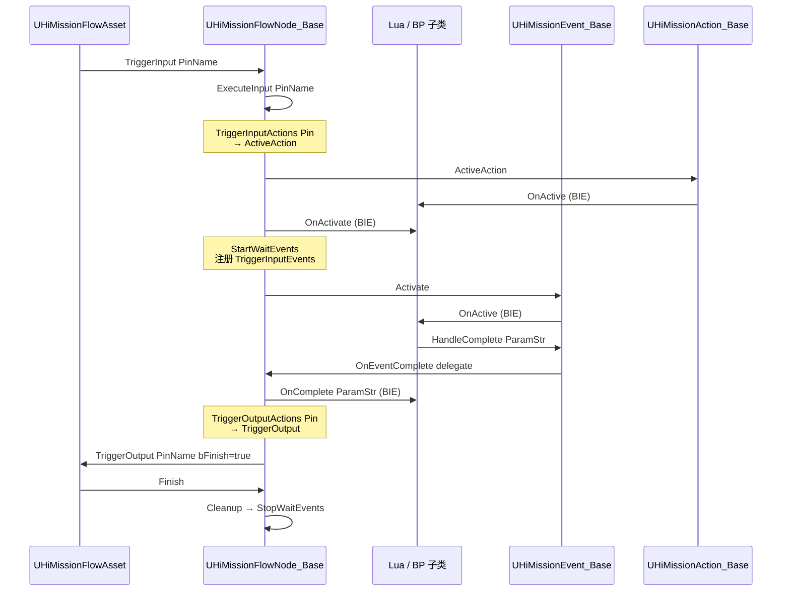
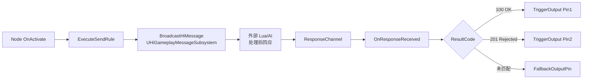

# 4. 节点四件套生命周期

`UHiMissionFlowNode_Base`(继承 `UFlowNode`)[^4-1] 是所有 Hi 任务节点的父类。它把 4 个领域抽象耦合在一起:`Action`(瞬时动作)、`Event`(等待事件)、`Condition`(条件检查)、节点本身的输入输出引脚。本章讲清楚四者的关系、节点 `OnActivate→Trigger→Finish` 完整时序、`TriggerInputActions/TriggerOutputActions/TriggerInputEvents` 的触发机制、以及 BlueprintImplementableEvent 钩子在 Lua/蓝图那一侧怎么被覆盖。

## 完整生命周期时序



注:**BIE = `BlueprintImplementableEvent`** — C++ 声明、Lua/蓝图实现的钩子。

## 四种构件对照表

| 构件 | 父类 | 角色 | 在 Node 内的位置 | 数量 |
|---|---|---|---|---|
| **Action** | `UHiMissionAction_Base`[^4-2] | 瞬时动作(broadcast/teleport/spawn) | `TMap<FString, UHiMissionAction_Base*> Actions`[^4-3] | 多个,通过 `Name` 索引 |
| **Event** | `UHiMissionEvent_Base`[^4-4] | 异步事件(等待玩家点击/到达) | `TMap<FString, UHiMissionEvent_Base*> Events`[^4-5] | 多个,通过 `Name` 索引 |
| **Condition** | `UHiMissionCondition_Base`[^4-6] | 条件检查(一次性 IsConditionMet) | 由 `HiMissionFlowNode_CheckCondition` 显式持有 1 个 | 1 |
| **Pin** | FlowGraph 原生 `FFlowPin` | 输入输出连线 | `InputPins/OutputPins`(动态 ContextPins) | 多个 |

## UHiMissionFlowNode_Base 核心 UPROPERTY

```cpp
UPROPERTY(BlueprintReadOnly)
TMap<FString, TObjectPtr<UHiMissionEvent_Base>> Events;

UPROPERTY(BlueprintReadOnly)
TMap<FString, TObjectPtr<UHiMissionAction_Base>> Actions;

UPROPERTY(BlueprintReadOnly, EditDefaultsOnly,
    meta = (AdvancedDisplay, ToolTip = "[PinName]: [Action List]. 指定输入引脚时需要触发的 MissionActions."))
TMap<FName, FHiMissionNodeActionSetting> TriggerInputActions;

UPROPERTY(BlueprintReadOnly, EditDefaultsOnly,
    meta = (AdvancedDisplay, ToolTip = "[PinName]: [Action List]. 指定输出引脚时需要触发的 MissionActions."))
TMap<FName, FHiMissionNodeActionSetting> TriggerOutputActions;

UPROPERTY(BlueprintReadOnly, EditDefaultsOnly,
    meta = (AdvancedDisplay, ToolTip = "[PinName]: [Event List]. 指定输入引脚时需要触发的 MissionEvents."))
TMap<FName, FHiMissionNodeEventSettings> TriggerInputEvents;

UPROPERTY(BlueprintReadWrite, EditAnywhere)
bool bEditorFlowNode;

UPROPERTY(BlueprintReadWrite, EditDefaultsOnly, Category = "Save Game")
EMissionSaveType SaveType;

UPROPERTY(BlueprintReadOnly, EditAnywhere)
bool bNeedAddInputPinRecord = false;

UPROPERTY(BlueprintReadOnly, Category = "Save Game", SaveGame)
TArray<FHiMissionNodePinRecord> InputPinRecords;

UPROPERTY(BlueprintReadWrite, Category = "Save Game")
FString CustomData;
```

[^4-7]

> **关键约定**: `TriggerInputActions[Pin]` 是声明性配置 — 节点 Activate 时自动触发对应 Action,不需要手写代码。Lua 子类只需要在 `OnComplete` / `OnActive` 钩子里写业务逻辑。

## 状态枚举

### EHiMissionActionState[^4-8]

```cpp
enum class EHiMissionActionState : uint8
{
    Uninitialized,
    AwaitingActivation,
    Paused,
    Active,
    Finished
};
```

Action 有 5 状态,但**没有显式 Aborted** — 中止走 `EndAction` + `OnDestroy(bOwnerFinished=true)` 通道。

### EHiMissionNodeState[^4-9]

```cpp
enum class EHiMissionNodeState : uint8
{
    None, Active, Abort, Finish
};
```

注意这是**节点级**状态(Hi 自定义),与 FlowGraph 自带的 `EFlowNodeState`(`NeverActivated/Active/Completed/Aborted`)平行存在。

### EMissionSaveType[^4-10]

```cpp
enum class EMissionSaveType : uint8
{
    None,         // 不存
    Finished,     // 完成时存
    Realtime,     // 实时存
};
```

## 生命周期细节

### OnActivate 入口

```cpp
protected:
    virtual void OnActivate() override;
    virtual void ExecuteInput(const FName& PinName) override;
    virtual void Finish() override;
```

[^4-11]

调用顺序:
1. `Asset::TriggerInput(NodeGuid, PinName)` → `Node::TriggerInput(PinName)`
2. `Node::ExecuteInput(PinName)` — 如果 `bNeedAddInputPinRecord` 则记 `InputPinRecords`(用于幂等)
3. 检查 `TriggerInputActions[PinName]` → 对每个 Action 调 `ActiveAction`
4. `Node::OnActivate()` — 父类做基础设置
5. `OnActivate` BIE 给 Lua/BP — Lua 可以注册自定义事件、设置 timer
6. `StartWaitEvents()` 启动 `TriggerInputEvents[PinName]` 内的所有 Event

### Event 完成回调链

`UHiMissionEvent_Base`[^4-12] 持有三对 Delegate:

```cpp
UPROPERTY(BlueprintAssignable)
FWaitMissionEventDelegate OnceComplete;
UPROPERTY(BlueprintAssignable)
FWaitMissionEventDelegate Complete;
UPROPERTY(BlueprintAssignable)
FWaitMissionEventDelegate Fail;

// new complete event name
UPROPERTY(BlueprintAssignable)
FMissionEventActionOnEventCompleteDelegate OnEventOnceComplete;
UPROPERTY(BlueprintAssignable)
FMissionEventActionOnEventCompleteDelegate OnEventComplete;
UPROPERTY(BlueprintAssignable)
FMissionEventActionOnEventCompleteDelegate OnEventFail;
```

Lua 在事件触发时调:
- `Event:HandleOnceComplete(ParamStr)` — 只触发一次
- `Event:HandleComplete(ParamStr)` — 可重复
- `Event:HandleFail(ParamStr)` — 失败

节点收到回调后,`UHiMissionFlowNode_Base::OnComplete(ParamStr)` BIE 被触发,Lua 可决定:
- 调 `TriggerOutput(PinName, bFinish=true)` 流转到下一个节点
- 注册更多 Event 等待
- 直接 `Finish()` 提前结束

### Cleanup 路径

```cpp
virtual void Cleanup() override;     // 统一收尾
virtual void StopWaitEvents();        // 反注册所有 Event
void ResetEvents();                   // 清掉 ActiveEvents/CompletedEvents 列表
```

`Cleanup` 在节点 Finish 后调用,会自动:
- `StopWaitEvents()`
- `CleanupExternalMessageHandles()` — 清外部消息监听
- `OnSave_Implementation()` 触发持久化

## BIE 钩子全表

供 Lua/蓝图覆盖的 `UFUNCTION(BlueprintImplementableEvent)`:

```cpp
void OnResetEvents();
void OnOnceComplete(const FString& ParamStr);
void OnComplete(const FString& ParamStr);
void OnEventResume(UHiMissionEvent_Base* Event);
bool ShouldReconstructOnPropertyChanged(FName PropertyName);
TArray<FName> GenerateFlowNodeCustomInputs();
TArray<FName> GenerateFlowNodeCustomOutputs();
FString GetNodeProperties();
bool CanBeDormant();
bool MigrateLegacyData();

void K2_OnMissionActionInitialized(UHiMissionAction_Base* Action);
void K2_OnMissionActionActivated(UHiMissionAction_Base* Action);
void K2_OnMissionActionDeactivated(UHiMissionAction_Base* Action);
```

[^4-13]

## Async 模式 — UHiWaitMissionEventAction

```cpp
UCLASS(BlueprintType, meta = (ExposedAsyncProxy=AsyncTask))
class UHiWaitMissionEventAction : public UBlueprintAsyncActionBase
{
    UPROPERTY(BlueprintAssignable) FWaitMissionEventDelegate OnceComplete;
    UPROPERTY(BlueprintAssignable) FWaitMissionEventDelegate Complete;
    UPROPERTY(BlueprintAssignable) FWaitMissionEventDelegate Fail;
    
    UPROPERTY(BlueprintAssignable) FMissionEventActionOnEventCompleteDelegate OnEventOnceComplete;
    UPROPERTY(BlueprintAssignable) FMissionEventActionOnEventCompleteDelegate OnEventComplete;
    UPROPERTY(BlueprintAssignable) FMissionEventActionOnEventCompleteDelegate OnEventFail;
    
    UFUNCTION(BlueprintCallable, Category="HiMission|Event",
        meta = (DisplayName="WaitMissionEventAction", BlueprintInternalUseOnly = "TRUE"))
    static UHiWaitMissionEventAction* WaitMissionEventAction(UHiMissionEvent_Base* InEvent, UObject* Outer, FName NewInstanceName = NAME_None);
};
```

[^4-14]

Lua 通过 `UE.UHiWaitMissionEventAction.WaitMissionEventByName(self, EventName)`(deprecated)或新版 `WaitMissionEventAction(Event, Outer, InstanceName)` 创建一个 await proxy,然后 `:Activate()`。这是 BlueprintAsyncActionBase 标准模式。

> 真实 Lua 代码示例,`mission_node_event_base.lua:94-108`[^4-15]:
> ```lua
> function MissionNodeEventBase:StartWaitEvent()
>     local EventName = self:GetEventName()
>     if EventName and EventName ~= "" then
>         local AsyncAction = UE.UHiWaitMissionEventAction.WaitMissionEventByName(self, EventName)
>         if AsyncAction then
>             if self.OnOnceComplete then
>                 AsyncAction.OnceComplete:Add(self, self.OnOnceComplete)
>             end
>             if self.OnComplete then
>                 AsyncAction.Complete:Add(self, self.OnComplete)
>             end
>             AsyncAction:Activate()
>         end
>     end
> end
> ```
> (注释里写明 `-- deprecated`,但形态足够说明问题)

## Network / External Message 字段

节点级网络配置(详见第 8 章):

```cpp
UPROPERTY(EditAnywhere, Category = "Network Config", meta = (ShowOnlyInnerProperties))
FHiFlowNodeNetworkConfig NetworkConfig;
```

外部消息规则(详见 `external-message-system.md`,本 wiki 不重复):

```cpp
UPROPERTY(EditDefaultsOnly, BlueprintReadOnly, Category = "External Message")
TArray<FHiFlowNodeExternalSendRule> ExternalSendRules;

UPROPERTY(EditDefaultsOnly, BlueprintReadOnly, Category = "External Message")
TArray<FHiFlowNodeWaitRule> ExternalWaitRules;
```

[^4-16]

## CheckCondition 节点 — 唯一显式持有 Condition

`UHiMissionFlowNode_CheckCondition`[^4-17] 是 4 件套里唯一显式持有 Condition 的节点:

```cpp
UCLASS(Blueprintable, Abstract, meta=(DisplayName = "CheckCondition"))
class HIMISSION_API UHiMissionFlowNode_CheckCondition : public UHiMissionFlowNode_Base
{
    UPROPERTY(Instanced, EditAnywhere, BlueprintReadOnly, Category = "Condition")
    TObjectPtr<UHiMissionCondition_Base> Condition;
    
protected:
    virtual void ExecuteInput(const FName& PinName) override;
    virtual void Cleanup() override;
    virtual void OnSave_Implementation() override;
    virtual void OnLoad_Implementation() override;
};
```

`UHiMissionCondition_Base` 提供:
- `Activate(Listener)` / `Deactivate()`
- `IsConditionMet()` / `ConditionMet()`(条件成立时回调)
- `bConditionMet` 是 `UPROPERTY(SaveGame)` — 跨存档保留

> 注意 `UHiMissionCondition_Base` 是 `NotBlueprintable`[^4-6] — 必须 C++ 子类。这与 Action/Event(都是 `Blueprintable`)不同。

## External Message 引导

外部消息系统已有官方文档[^4-18],本 wiki **不重复**。如果你要让节点向 Lua/AI 异步请求决策,请直接读那一份。本节只画一个示意图作为索引:



---

## Sources

[^4-1]: `Plugins/HiMission/Source/HiMission/Public/FlowNodes/HiMissionFlowNode_Base.h:21` — `UHiMissionFlowNode_Base`
[^4-2]: `Plugins/HiMission/Source/HiMission/Public/Actions/HiMissionAction_Base.h:38-124` — `UHiMissionAction_Base` 全类
[^4-3]: `Plugins/HiMission/Source/HiMission/Public/FlowNodes/HiMissionFlowNode_Base.h:36-37`
[^4-4]: `Plugins/HiMission/Source/HiMission/Public/Events/HiMissionEvent_Base.h:39-179`
[^4-5]: `Plugins/HiMission/Source/HiMission/Public/FlowNodes/HiMissionFlowNode_Base.h:33-34`
[^4-6]: `Plugins/HiMission/Source/HiMission/Public/Conditions/HiMissionCondition_Base.h:11` — `NotBlueprintable`
[^4-7]: `Plugins/HiMission/Source/HiMission/Public/FlowNodes/HiMissionFlowNode_Base.h:33-62`
[^4-8]: `Plugins/HiMission/Source/HiMission/Public/Actions/HiMissionAction_Base.h:28-35`
[^4-9]: `Plugins/HiMission/Source/HiMission/Public/HiMissionTypes.h:23-29`
[^4-10]: `Plugins/HiMission/Source/HiMission/Public/HiMissionCommon.h:39-47`
[^4-11]: `Plugins/HiMission/Source/HiMission/Public/FlowNodes/HiMissionFlowNode_Base.h:194-198`
[^4-12]: `Plugins/HiMission/Source/HiMission/Public/Events/HiMissionEvent_Base.h:145-161`
[^4-13]: `Plugins/HiMission/Source/HiMission/Public/FlowNodes/HiMissionFlowNode_Base.h:98-176`
[^4-14]: `Plugins/HiMission/Source/HiMission/Public/Events/HiMissionEvent_Base.h:182-233`
[^4-15]: `Content/Script/mission/mission_node/mission_node_event_base.lua:94-108`
[^4-16]: `Plugins/HiMission/Source/HiMission/Public/FlowNodes/HiMissionFlowNode_Base.h:72-81, 202-203`
[^4-17]: `Plugins/HiMission/Source/HiMission/Public/FlowNodes/HiMissionFlowNode_CheckCondition.h:8-34`
[^4-18]: `Plugins/HiMission/Docs/external-message-system.md`(本 wiki 不重复)

## Cross-link

→ [3. HiMissionFlowAsset](3.%20HiMissionFlowAsset%20解剖.md) Asset 顶层视角
→ [5. Mission 层级与子图](5.%20Mission%20层级与子图.md) 具体节点子类
→ [10. TaskBridge](10.%20TaskBridge%20与%20Lua%20Task%20三模式.md) TaskBridge 是 Action+Event 组合的进化形态
→ `Plugins/HiMission/Docs/external-message-system.md` ExternalRules 详解
