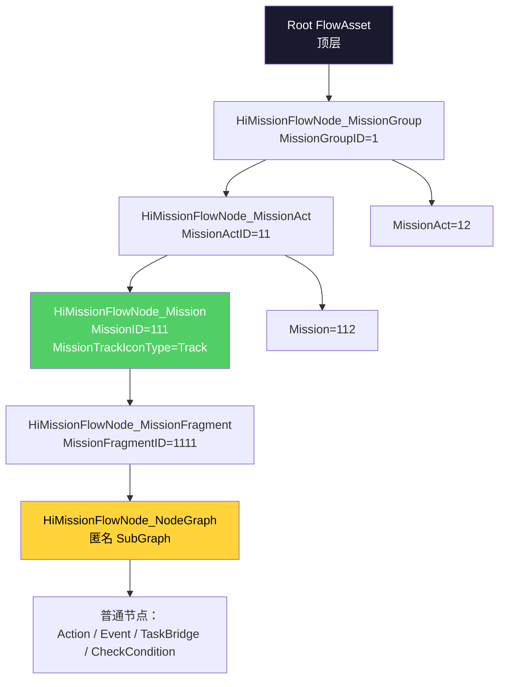

# 5. Mission 层级与子图

HiGame 把任务"层级"做成 4 级嵌套(`Group → Act → Mission → Fragment`),每级对应一个独立 SubGraph 节点,配 `MissionGroupID/MissionActID/MissionID/MissionFragmentID` 一组层级 ID。`HiMissionFlowNode_NodeGraph` 是"匿名子图"(没有业务 ID,纯组织作用),`HiMissionFlowNode_SubGraphBase` 是它们的共同父类。每级节点在 `RegisterMissionIdentifier` 时把自己写进 `UHiMissionFlowSubsystem` 的全局表,从而支持 `FindMissionByID` 反查。

## 嵌套关系



## 8 种 SubGraph 节点

| 节点类 | 持有的 ID | 父类 | 作用 |
|---|---|---|---|
| `UHiMissionFlowNode_MissionGroup` | `MissionGroupID` | `_SubGraphBase` | 任务组(章节级) |
| `UHiMissionFlowNode_MissionAct` | `MissionActID` | `_SubGraphBase` | 幕(Act,小章) |
| `UHiMissionFlowNode_Mission`[^5-1] | `MissionID` + `MissionTrackIconType` | `_SubGraphBase` | 单个任务 |
| `UHiMissionFlowNode_MissionFragment` | `MissionFragmentID` | `_SubGraphBase` | 任务片段(子任务) |
| `UHiMissionFlowNode_FragmentAND` | — | `_SubGraphBase` | Fragment 并行汇合 |
| `UHiMissionFlowNode_LogicalAND` | — | `_SubGraphBase`? | 逻辑与汇合 |
| `UHiMissionFlowNode_LogicalOR` | — | `_SubGraphBase`? | 逻辑或汇合 |
| `UHiMissionFlowNode_NodeGraph`[^5-2] | — | `_Base` | 匿名子图(无业务 ID) |
| `UHiMissionFlowNode_SubGraphBase`[^5-3] | — | `UFlowNode_SubGraph` | 所有 SubGraph 节点的父类 |

`UHiMissionFlowNode_Mission` 完整声明[^5-1]:

```cpp
UCLASS(Abstract, Blueprintable, BlueprintType, meta=(DisplayName = "Mission"))
class HIMISSION_API UHiMissionFlowNode_Mission : public UHiMissionFlowNode_SubGraphBase
{
public:
    UPROPERTY(BlueprintReadWrite, EditAnywhere)
    int32 MissionID = 0;
    
    UPROPERTY(BlueprintReadWrite, EditAnywhere)
    EMissionTrackIconType MissionTrackIconType = EMissionTrackIconType::None;

    virtual void InitializeMissionIdentifier(UObject* ParentNode) override;
    virtual void RegisterMissionIdentifier(FHiMissionIdentifierCollectorInterface* Collector,
        const FHiMissionIdentifier& ParentIdentifier) const override;
};
```

`EMissionTrackIconType`[^5-4]:

```cpp
enum class EMissionTrackIconType : uint8
{
    None,
    Receive,   // Waiting for taking mission
    Track,     // Mission is in progress
    Submit     // Mission is Finished
};
```

## FHiMissionIdentifier — 4 元组

```cpp
USTRUCT(BlueprintType)
struct HIMISSION_API FHiMissionIdentifier
{
    UPROPERTY(EditAnywhere, BlueprintReadWrite, Category = "Mission")
    int32 MissionGroupID = MISSION_INVALID_ID;
    
    UPROPERTY(EditAnywhere, BlueprintReadWrite, Category = "Mission")
    int32 MissionActID = MISSION_INVALID_ID;

    UPROPERTY(EditAnywhere, BlueprintReadWrite, Category = "Mission")
    int32 MissionID = MISSION_INVALID_ID;

    UPROPERTY(EditAnywhere, BlueprintReadWrite, Category = "Mission")
    int32 MissionFragmentID = MISSION_INVALID_ID;

    bool operator==(const FHiMissionIdentifier& Other) const
    {
        return this->MissionID == Other.MissionID;  // ⚠️ 只比较 MissionID
    }
    
    bool operator==(int32 InMissionID) const
    {
        return this->MissionID == InMissionID;
    }

    friend uint32 GetTypeHash(const FHiMissionIdentifier& Identifier)
    {
        return GetTypeHash(Identifier.MissionID);   // ⚠️ 哈希也只用 MissionID
    }

    bool IsValid() const
    {
        return MissionGroupID != MISSION_INVALID_ID
            && MissionActID != MISSION_INVALID_ID
            && MissionID != MISSION_INVALID_ID;
    }
};
```

[^5-5]

> **设计陷阱**: `operator==` 和 `GetTypeHash` 都**只看 `MissionID`** — 同一 `MissionID` 跨不同 `MissionGroupID/ActID` 视为相同。这要求项目内 `MissionID` 全局唯一(应在配表层保证)。`IsValid()` 需要 Group/Act/Mission 三者都有,但**不要求 Fragment**。

## 层级 ID 注册链

`InitializeMissionIdentifier(ParentNode)` 在节点 InitializeInstance 时,从父级继承 Identifier 并叠加自己的 ID 字段。`RegisterMissionIdentifier(Collector, ParentIdentifier)` 在 FlowAsset 启动时递归调用,把所有节点写入 Subsystem 的全局表。

接口契约见 `IHiMissionFlowNodeInterface`[^5-6]:

```cpp
class HIMISSION_API IHiMissionFlowNodeInterface
{
public:
    UFUNCTION(BlueprintCallable, BlueprintNativeEvent)
    FHiMissionIdentifier GetMissionIdentifier() const;
    
    UFUNCTION(BlueprintCallable, BlueprintNativeEvent)
    int32 GetMissionGroupID() const;
    
    UFUNCTION(BlueprintCallable, BlueprintNativeEvent)
    int32 GetMissionActID() const;

    UFUNCTION(BlueprintCallable, BlueprintNativeEvent)
    int32 GetMissionID() const;

    UFUNCTION(BlueprintCallable, BlueprintNativeEvent)
    int32 GetMissionEventID() const;
    
    virtual void InitializeMissionIdentifier(UObject* ParentNode);
    virtual void RegisterMissionIdentifier(FHiMissionIdentifierCollectorInterface* Collector,
        const FHiMissionIdentifier& ParentIdentifier) const {}
};
```

`FHiMissionIdentifierCollectorInterface`[^5-7]:

```cpp
class FHiMissionIdentifierCollectorInterface
{
public:
    virtual bool AddMissionGroup(int32 MissionGroupID, const FHiMissionIdentifier& Identifier) = 0;
    virtual bool AddMissionAct(int32 MissionActID, const FHiMissionIdentifier& Identifier) = 0;
    virtual bool AddMission(int32 MissionID, const FHiMissionIdentifier& Identifier,
        const EMissionTrackIconType& IconType) = 0;
    virtual bool AddMissionEvent(int32 MissionEventID, const FHiMissionIdentifier& Identifier) = 0;
    virtual FStreamableManager* GetStreamableManager() = 0;
};
```

`UHiMissionFlowSubsystem`[^5-8] 实现这个接口,维护 4 个 TMap:

```cpp
class HIMISSION_API UHiMissionFlowSubsystem : public UFlowSubsystem,
    public FHiMissionIdentifierCollectorInterface
{
public:
    UFUNCTION(BlueprintCallable)
    UFlowNode* FindMissionGroupNode(int32 MissionGroupID);
    UFUNCTION(BlueprintCallable)
    UFlowNode* FindMissionActNode(int32 MissionActID);
    UFUNCTION(BlueprintCallable)
    UFlowNode* FindMissionNode(int32 MissionID);
    UFUNCTION(BlueprintCallable)
    UFlowNode* FindMissionEventNode(int32 MissionEventID);

    UFUNCTION(BlueprintCallable)
    const FHiMissionIdentifier& GetMissionGroupIdentifier(int32 MissionGroupID);
    // ... 同样有 Act/Mission/Event 各一份
    
    UFUNCTION(BlueprintCallable)
    const EMissionTrackIconType GetMissionTrackIconType(int32 MissionID);

protected:
    TMap<int32, FHiMissionIdentifier> MissionGroups;
    TMap<int32, FHiMissionIdentifier> MissionActs;
    TMap<int32, FHiMissionIdentifier> Missions;
    TMap<int32, FHiMissionIdentifier> MissionEvents;
    TMap<int32, EMissionTrackIconType> MissionTrackIcons;
};
```

> Lua 侧通过 `UHiMissionFlowSubsystem.Get(World):FindMissionNode(MissionID)` 即可拿到节点对象。

## SubGraphBase — 嵌套 FlowAsset 的父类

```cpp
UCLASS(Abstract, Blueprintable, HideCategories = Object)
class HIMISSION_API UHiMissionFlowNode_SubGraphBase : public UFlowNode_SubGraph,
    public IHiMissionFlowNodeInterface
{
public:
    UPROPERTY(BlueprintReadOnly, VisibleAnywhere)
    EMissionSaveType SaveType = EMissionSaveType::Realtime;
    
    UFUNCTION(BlueprintImplementableEvent)
    void OnSubGraphStart();
    UFUNCTION(BlueprintImplementableEvent)
    void OnSubGraphFinish();

    UHiMissionFlowAsset* GetOuterFlowAsset() const;
    UHiMissionFlowAsset* GetInnerFlowAsset() const { return InnerFlowAssetInstance; }

    void FinishFlowInstance();
    bool CreateFlowInstance(FString Reason);

protected:
    virtual void ExecuteInput(const FName& PinName) override;
    virtual void Cleanup() override;
    
    virtual void Restart_Implementation();

    UPROPERTY()
    TObjectPtr<UHiMissionFlowAsset> InnerFlowAssetInstance;

public:
    virtual FName GetUniqueCustomInstanceName();
    
    UPROPERTY()
    bool bRestarting = false;
};
```

[^5-3]

要点:
- `InnerFlowAssetInstance` 是子图的 FlowAsset 实例(运行时 NewObject 出来,不是 .uasset 引用)
- `OnSubGraphStart/Finish` BIE 钩子让 Lua 在子图进出时挂逻辑
- `Restart_Implementation` 提供子图重启入口(给 RevertToCheckPoint 用)
- `SaveType` 默认 `Realtime`(实时存)

## NodeGraph — 匿名子图

```cpp
UCLASS(Blueprintable, Abstract)
class HIMISSION_API UHiMissionFlowNode_NodeGraph : public UHiMissionFlowNode_Base
{
    static FFlowPin StartPin;
    static FFlowPin FinishPin;
    
protected:
    UPROPERTY(EditAnywhere, Category = "NodeGraph | FlowTemplate")
    TSoftObjectPtr<UHiMissionFlowAsset> NodeFlowAsset;

    UPROPERTY()
    TObjectPtr<UHiMissionFlowAsset> FlowInstance;
    
    UPROPERTY(VisibleDefaultsOnly, Category = "Graph")
    TMap<FGuid, TObjectPtr<UFlowNode>> NodeGraphNodes;
    
    UPROPERTY(VisibleDefaultsOnly, Category = "Graph")
    TArray<FHiMissionNodePropertyMapping> PropertyMappings;

    TMap<FGuid, TArray<FHiMissionNodePropertyMapping*>> NodePropertyMappingsCache;

    UPROPERTY(EditAnywhere)
    bool bResumeRestart = false;
    
public:
    virtual void SetupFlowNodePropertyValues(const UHiMissionFlowAsset* NewInstance, const FGuid& TargetNodeGuid);
};
```

[^5-9]

注意 `UHiMissionFlowNode_NodeGraph` **不继承 `_SubGraphBase`** — 它继承自 `_Base`,因为它没有"层级 ID"的语义。它只是一个内联可重用的 FlowAsset 模板,通过 `TSoftObjectPtr<UHiMissionFlowAsset> NodeFlowAsset` 引用一个 .uasset,运行时 clone 一份(`FlowInstance`)。

> **NodeGraph 与 SubGraphBase 的差异**:
> - SubGraphBase = FlowAsset 嵌套(每个 Mission/Act/Fragment 都是一个独立的 .uasset)
> - NodeGraph = FlowAsset 模板复用(一份 .uasset 在多处实例化,通过 PropertyMappings 注入差异化参数)

## 其他特殊节点

| 节点类 | 用途 |
|---|---|
| `UHiMissionFlowNode_CustomInput` | 子图的进入节点(对应 SubGraph 的输入引脚) |
| `UHiMissionFlowNode_CustomOutput` | 子图的退出节点(对应 SubGraph 的输出引脚) |
| `UHiMissionFlowNode_ExchangeNode` | 在 SubFlow 之间传值 |
| `UHiMissionFlowNode_ExecutionSequence` | 多分支顺序执行(类似蓝图 Sequence) |
| `UHiMissionFlowNode_Finish` | 任务结束节点 |
| `UHiMissionFlowNode_Event` | 事件型节点 — 每个 Pin 配 NodeEventConfigs |
| `UHiMissionFlowNode_TaskBridge` | Task 宿主(详见第 10 章) |
| `UHiMissionFlowNode_WorkAction` | 老的工作流节点(详见第 9 章) |
| `UHiMissionFlowNode_StateStart/Success/Failed` | State 模式专用进出口 |

## 编辑器节点定制

`HiMissionEditor` 模块提供:
- `FlowGraphNode_HiMissionCustom` — 自定义 EdGraphNode 包装,统一 Hi 节点的 Slate 表现
- `HiMissionFlowNode_NodeGraphDetails` — NodeGraph 节点的 Detail Panel 定制
- `HiMissionFlowNode_TaskBridgeDetails` — TaskBridge 的 Detail Panel(包括 JSON 编辑器集成)
- `HiMissionFlowNode_WorkActionDetails` / `WorkActionEntryDetails` — WorkAction 系列 Detail
- `HiMissionFlowNode_PlayDialogueFlowDetails` / `PlaySequenceDetails` — 对话/Sequence 节点 Detail
- `HiMissionFlowNode_ItemsAddDetails` — 物品节点

---

## Sources

[^5-1]: `Plugins/HiMission/Source/HiMission/Public/FlowNodes/HiMissionFlowNode_Mission.h:7-21`
[^5-2]: `Plugins/HiMission/Source/HiMission/Public/FlowNodes/HiMissionFlowNode_NodeGraph.h:14-118`
[^5-3]: `Plugins/HiMission/Source/HiMission/Public/FlowNodes/HiMissionFlowNode_SubGraphBase.h:10-72`
[^5-4]: `Plugins/HiMission/Source/HiMission/Public/HiMissionCommon.h:27-37` — `EMissionTrackIconType`
[^5-5]: `Plugins/HiMission/Source/HiMission/Public/HiMissionTypes.h:48-87` — `FHiMissionIdentifier`
[^5-6]: `Plugins/HiMission/Source/HiMission/Public/HiMissionCommon.h:118-188` — `IHiMissionFlowNodeInterface`
[^5-7]: `Plugins/HiMission/Source/HiMission/Public/HiMissionCommon.h:92-105` — `FHiMissionIdentifierCollectorInterface`
[^5-8]: `Plugins/HiMission/Source/HiMission/Public/HiMissionFlowSubsystem.h:11-69`
[^5-9]: `Plugins/HiMission/Source/HiMission/Public/FlowNodes/HiMissionFlowNode_NodeGraph.h:14-117`

## Cross-link

→ [3. HiMissionFlowAsset](3.%20HiMissionFlowAsset%20解剖.md) Asset 顶层视角
→ [4. 节点四件套](4.%20节点四件套生命周期.md) 节点公共生命周期
→ [7. FlowInstance 运行时](7.%20FlowInstance%20运行时.md) Subsystem 怎么管理多个实例
→ [10. TaskBridge](10.%20TaskBridge%20与%20Lua%20Task%20三模式.md) TaskBridge 也是一种特殊节点
