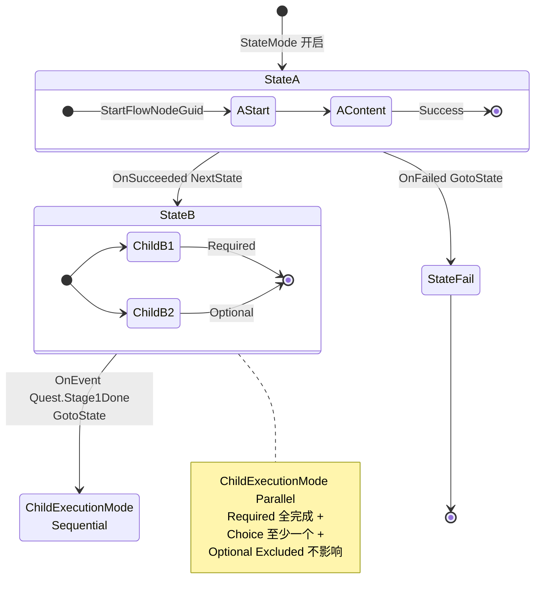
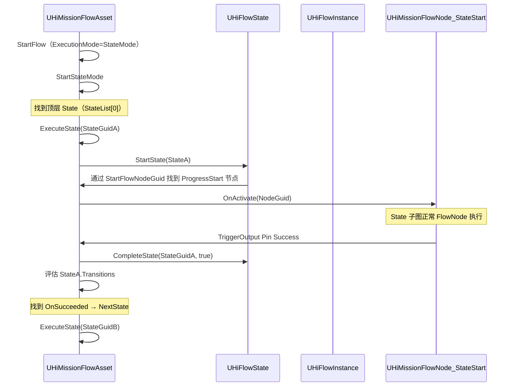

# 6. State 机制 — StateTree 风格

`UHiFlowState`[^6-1] 是较新加入的层级,定位类似 Epic 的 StateTree:一个 FlowAsset 可以挂一个 State 树,每个 State 有名称/描述/转移规则;State 自带子 Graph(`StateGraph`),子 Graph 内仍是普通 FlowNode。当 `ExecutionMode=StateMode` 时,运行的不再是节点之间的连线,而是 State 之间的 Transition。本章给出 State 数据模型、Transition 规则、Parallel/Sequential 子状态执行、Required/Optional/Choice/Excluded 完成贡献,以及与 `ProgressScope/TrackingScope` 的绑定。

## 主图 — State 树 + Transition



## 5 个核心枚举

### EHiFlowStateType[^6-2]

```cpp
enum class EHiFlowStateType : uint8
{
    State        UMETA(DisplayName = "State"),         // 自动执行
    LinkedState  UMETA(DisplayName = "Linked State"),  // 只能 Transition 进入
};
```

`LinkedState` 用于:隐藏分支、条件路径、密室、可选支线 — 父 State 的 ChildExecutionMode 不会自动调度它,只有显式 `Transition.GotoState` 才能进入。

### EHiFlowStateChildExecutionMode[^6-3]

```cpp
enum class EHiFlowStateChildExecutionMode : uint8
{
    Parallel    UMETA(DisplayName = "Parallel"),    // A 激活时 A1+A2 同时执行
    Sequential  UMETA(DisplayName = "Sequential"),  // A2 在 A1 完成后才执行
};
```

注意:**没有 None 模式**(代码里有 `// None UMETA(...)` 注释掉了)— 父 State 必然调度子状态。如果想让某个子 State 不参与,改它的 `CompletionRequirement = Excluded` 或 `StateType = LinkedState`。

### EChildFlowStateCompletionRequirement[^6-4]

```cpp
enum class EChildFlowStateCompletionRequirement : uint8
{
    Required UMETA(DisplayName = "Required"),  // 必须完成,父才能完成
    Optional UMETA(DisplayName = "Optional"),  // 可选,父不等待它
    Choice   UMETA(DisplayName = "Choice"),    // 至少一个 Choice 完成,父才能完成
    Excluded UMETA(DisplayName = "Excluded"),  // 不参与父完成判定（如 Hidden 监视器）
};
```

父 State 完成的判定公式:
```
父完成 = (所有 Required 都完成) AND (至少一个 Choice 完成 || 没有 Choice)
```

### EHiFlowStateTransitionTrigger[^6-5]

```cpp
enum class EHiFlowStateTransitionTrigger : uint8
{
    OnCompleted  UMETA(DisplayName = "On Completed"),  // 任何完成都触发
    OnSucceeded  UMETA(DisplayName = "On Succeeded"),  // 仅 Success 触发
    OnFailed     UMETA(DisplayName = "On Failed"),     // 仅 Failed 触发
    OnEvent      UMETA(DisplayName = "On Event"),      // 收到 GameplayTag 事件触发
    OnCondition  UMETA(DisplayName = "On Condition"),  // 手动通过 Condition 触发
};
```

### EHiFlowStateTransitionType[^6-6]

```cpp
enum class EHiFlowStateTransitionType : uint8
{
    None        UMETA(DisplayName = "None"),
    GotoState   UMETA(DisplayName = "Goto Progress"),  // 跳转到指定 Guid
    NextState   UMETA(DisplayName = "Next Progress"),  // 跳到下一个兄弟 State
};
```

## FHiFlowStateTransition 数据结构

```cpp
USTRUCT(BlueprintType)
struct HIMISSION_API FHiFlowStateTransition
{
    UPROPERTY(VisibleAnywhere, BlueprintReadOnly, Category = "Transition")
    FGuid TransitionID;

    UPROPERTY(EditAnywhere, BlueprintReadWrite, Category = "Transition")
    EHiFlowStateTransitionTrigger Trigger = EHiFlowStateTransitionTrigger::OnCompleted;

    UPROPERTY(EditAnywhere, BlueprintReadWrite, Category = "Transition",
        meta = (EditCondition = "Trigger == EHiFlowStateTransitionTrigger::OnEvent", EditConditionHides))
    FGameplayTag RequiredEvent;

    UPROPERTY(EditAnywhere, BlueprintReadWrite, Category = "Transition")
    EHiFlowStateTransitionType TransitionType = EHiFlowStateTransitionType::NextState;

    UPROPERTY(EditAnywhere, BlueprintReadWrite, Category = "Transition",
        meta = (EditCondition = "TransitionType == EHiFlowStateTransitionType::GotoState", EditConditionHides))
    FGuid TargetStateGuid;

    UPROPERTY(EditAnywhere, BlueprintReadWrite, Category = "Transition")
    FText ConditionDescription;

    UPROPERTY(EditAnywhere, BlueprintReadWrite, Category = "Transition")
    bool bEnabled = true;

    FHiFlowStateTransition()
        : TransitionID(FGuid::NewGuid())
        , TargetStateGuid(FGuid())
    {}
};
```

[^6-7]

## UHiFlowState 全字段

```cpp
UCLASS(BlueprintType)
class HIMISSION_API UHiFlowState : public UObject
{
public:
    // ── Identity ─────────────────────────────────────
    UPROPERTY(VisibleAnywhere, BlueprintReadOnly, Category = "State|Structure")
    FGuid StateGuid;

    UPROPERTY(VisibleAnywhere, BlueprintReadOnly, Category = "State|Structure")
    FGuid StartFlowNodeGuid;          // 子图入口 ProgressStart 节点

    UPROPERTY(EditAnywhere, BlueprintReadWrite, Category = "State")
    FText StateName = FText::FromString(TEXT("New State"));

    UPROPERTY(EditAnywhere, BlueprintReadWrite, Category = "State", meta = (MultiLine = true))
    FText Description = FText::GetEmpty();

    UPROPERTY(BlueprintReadWrite, Category = "State|Basic")
    bool bIsEnabled = true;

    UPROPERTY(EditAnywhere, BlueprintReadWrite, Category = "State|Basic")
    EChildFlowStateCompletionRequirement CompletionRequirement = EChildFlowStateCompletionRequirement::Required;

    // ── Editor-only mirror ──────────────────────────
#if WITH_EDITORONLY_DATA
    UPROPERTY()
    TObjectPtr<class UEdGraph> StateGraph;     // 子图(编辑器存储)

    UPROPERTY(EditAnywhere, Category = "State|ProgressScope")
    FHiQuestProgress ProgressScope;            // 镜像（权威在 FlowAsset.ProgressScopes）

    UPROPERTY()
    TArray<FGuid> TrackingScopeGuids;          // 镜像（权威在 FlowAsset.TrackingScopes）

    UPROPERTY(EditAnywhere, Category = "State|TrackingScope")
    TArray<FHiMissionTracking> TrackingSettings;  // 镜像
#endif

    // ── Hierarchy ────────────────────────────────────
    UPROPERTY(BlueprintReadOnly, Category = "State|Structure")
    FGuid ParentStateGuid;

    UPROPERTY(BlueprintReadOnly, Category = "State|Structure")
    TArray<FGuid> ChildStateGuids;

    // ── Execution ───────────────────────────────────
    UPROPERTY(EditAnywhere, BlueprintReadWrite, Category = "State")
    EHiFlowStateChildExecutionMode ChildExecutionMode = EHiFlowStateChildExecutionMode::Parallel;

    UPROPERTY(EditAnywhere, BlueprintReadWrite, Category = "State")
    EHiFlowStateType StateType = EHiFlowStateType::State;

    // ── Transitions ─────────────────────────────────
    UPROPERTY(EditAnywhere, BlueprintReadWrite, Category = "Transitions")
    TArray<FHiFlowStateTransition> Transitions;

    // ── API ─────────────────────────────────────────
    UFUNCTION(BlueprintCallable, Category = "State")
    void AddChildState(const FGuid& ChildStateGuid);
    UFUNCTION(BlueprintCallable, Category = "State")
    void RemoveChildState(const FGuid& ChildStateGuid);
    UFUNCTION(BlueprintCallable, Category = "State")
    bool IsTopLevelState() const { return ParentStateGuid == FGuid(); }
    UFUNCTION(BlueprintCallable, Category = "State")
    bool IsAutoExecute() const { return StateType == EHiFlowStateType::State; }
    UFUNCTION(BlueprintCallable, Category = "State")
    bool IsLinkedState() const { return StateType == EHiFlowStateType::LinkedState; }

#if WITH_EDITOR
    virtual void PostEditChangeProperty(FPropertyChangedEvent& PropertyChangedEvent) override;
#endif
};
```

[^6-1]

## EHiFlowStateStatus 7 状态

```cpp
UENUM(BlueprintType)
enum class EHiFlowStateStatus : uint8
{
    None       UMETA(DisplayName = "None"),       // 未启动
    Active     UMETA(DisplayName = "Active"),     // 正在执行
    Finishing  UMETA(DisplayName = "Finishing"),  // 完成中
    Aborting   UMETA(DisplayName = "Aborting"),   // 中止中
    Aborted    UMETA(DisplayName = "Aborted"),    // 已中止
    Success    UMETA(DisplayName = "Success"),    // 成功
    Failed     UMETA(DisplayName = "Failed"),     // 失败
};
```

[^6-8]

## FHiFlowStateRuntimeStatus — 运行时状态(server-only)

```cpp
USTRUCT()
struct FHiFlowStateRuntimeStatus
{
    UPROPERTY()
    EHiFlowStateStatus Status = EHiFlowStateStatus::None;

    UPROPERTY()
    double StartTime = 0.0;

    // ── Child Tracking ────────────────────────────
    UPROPERTY()
    TArray<FGuid> ActiveChildStateGuids;        // 并行模式正在跑的子 State

    UPROPERTY()
    TArray<FCompletedChildState> CompletedChildStateGuids;  // 已完成的 + bSuccess

    UPROPERTY()
    int32 CurrentChildStateIndex = 0;           // Sequential 模式当前索引

    // ── Helpers ───────────────────────────────────
    bool IsActive() const { return Status == EHiFlowStateStatus::Active; }
    bool IsCompleted() const {
        return Status == EHiFlowStateStatus::Success
            || Status == EHiFlowStateStatus::Failed
            || Status == EHiFlowStateStatus::Aborted;
    }
    bool IsSuccess() const { return Status == EHiFlowStateStatus::Success; }
    bool IsFailed() const { return Status == EHiFlowStateStatus::Failed; }
    bool IsNone() const { return Status == EHiFlowStateStatus::None; }
};

USTRUCT()
struct FCompletedChildState
{
    UPROPERTY() FGuid NodeGuid;
    UPROPERTY() bool bSuccess = false;
};
```

[^6-9]

> RuntimeStatus 存在 FlowAsset 私有字段 `TMap<FGuid, FHiFlowStateRuntimeStatus> StateRuntimeStates`(`HiMissionFlowAsset.h:583`),通过 `GetStateRuntimeState(StateGuid)` 查询(仅 WITH_EDITOR)。

## State Mode 启动序列



State Mode 相关 API[^6-10]:

```cpp
UFUNCTION(BlueprintCallable, Category = "HiFlowAsset|State Mode")
void StartStateMode();
void StartState(const UHiFlowState* FlowState) const;
void CompleteState(const FGuid& StateGuid, bool bSuccess) const;
void ExecuteChildStates(UHiFlowState* ParentState);
void ExecuteNextChildState(UHiFlowState* ParentState) const;
void OnChildStateCompleted(const FGuid& ChildStateGuid, bool bSuccess) const;

// 公开:
void ExecuteState(const FGuid& StateGuid);
```

## State 进出口节点

```cpp
// State 子图入口
HiMissionFlowNode_StateStart.h
// State 子图成功出口
HiMissionFlowNode_StateSuccess.h
// State 子图失败出口
HiMissionFlowNode_StateFailed.h
// State 子图整体（编辑器图容器）
HiMissionFlowNode_StateGraph.h
```

[^6-11]

进入 State = 触发 `StateStart` 节点;触发 `StateSuccess` = 调用 `CompleteState(Guid, true)`;触发 `StateFailed` = 调用 `CompleteState(Guid, false)`。

## State 与 ProgressScope/TrackingScope 绑定

> **Editor-only mirror 与 Authoritative 数据**:State 上的 `ProgressScope` 和 `TrackingSettings` 是 `WITH_EDITORONLY_DATA`,真正的权威数据在 `UHiMissionFlowAsset` 的 `ProgressScopes` / `TrackingScopes` 数组。`PostEditChangeProperty` 在编辑器修改时同步到 FlowAsset,`BuildScopeLookups` 在加载时反向同步到 State。

第 12 章会详细讲三个 Notify 通道:
- `NotifyProgressScopeStart(StateGuid)`
- `NotifyProgressScopeFinish(StateGuid)`
- `NotifyProgressScopeRemove(TargetGuid, SourceGuid)`(GotoState 回溯专用)

## GotoState 回溯逻辑

当 Transition 是 `GotoState` 且目标 State 在源 State 之前(回溯),需要清掉中间 State 的 ProgressID:

```cpp
// 当 GotoState 回溯跳转时，收集从目标 State 到源 State 范围内所有 State 的 ProgressID
// 并广播 Remove 通知。用于通知 Lua 层移除中间步骤的任务进度。
void NotifyProgressScopeRemove(const FGuid& TargetStateGuid, const FGuid& SourceStateGuid);

// 内部递归收集
void CollectProgressIDsRecursive(const UHiFlowState* State, TArray<int32>& OutProgressIDs) const;
```

[^6-12]

## 编辑器入口

`FHiFlowAssetEditor`[^6-13] 的三个新 Tab:

| Tab | 内容 |
|---|---|
| `OutlinerTab` | 树形显示 StateList,支持新建/删除/拖拽排序 |
| `StateGraphTab` | 双击 Outliner 中某 State 时,在中央打开它的子图 |
| `StateDetailsTab` | 当前选中 State 的字段(StateName/StateType/Transitions/ProgressScope/TrackingSettings) |

注意:`StateGraphTab` 不在初始布局中,**必须双击 Outliner 才能打开** — 这是有意为之,避免编辑器初始化时并发访问冲突[^6-14]。

## State 与 Flow 模式不混用

| 场景 | ExecutionMode | 用什么节点 |
|---|---|---|
| 老资产/简单线性流程 | `FlowMode` | UFlowNode_Start + 普通 HiMissionFlowNode |
| 新资产/复杂状态机 | `StateMode` | StateStart/StateSuccess/StateFailed + 普通 FlowNode 在 State 子图 |

> 切换 Mode 不会删除已有的 FlowGraph 数据 — 老的 FlowGraph 节点仍然存在于 .uasset 里,只是不再被 `StartFlow` 触发。这意味着可以在不破坏老资产的情况下逐步迁移。

---

## Sources

[^6-1]: `Plugins/HiMission/Source/HiMission/Public/States/HiFlowState.h:151-281`
[^6-2]: `Plugins/HiMission/Source/HiMission/Public/States/HiFlowState.h:13-22`
[^6-3]: `Plugins/HiMission/Source/HiMission/Public/States/HiFlowState.h:28-39`
[^6-4]: `Plugins/HiMission/Source/HiMission/Public/States/HiFlowState.h:46-58`
[^6-5]: `Plugins/HiMission/Source/HiMission/Public/States/HiFlowState.h:65-82`
[^6-6]: `Plugins/HiMission/Source/HiMission/Public/States/HiFlowState.h:88-99`
[^6-7]: `Plugins/HiMission/Source/HiMission/Public/States/HiFlowState.h:106-143`
[^6-8]: `Plugins/HiMission/Source/HiMission/Public/HiMissionFlowAsset.h:39-62`
[^6-9]: `Plugins/HiMission/Source/HiMission/Public/HiMissionFlowAsset.h:69-132`
[^6-10]: `Plugins/HiMission/Source/HiMission/Public/HiMissionFlowAsset.h:268-300, 395`
[^6-11]: `Plugins/HiMission/Source/HiMission/Public/States/HiMissionFlowNode_StateStart.h` 等同目录
[^6-12]: `Plugins/HiMission/Source/HiMission/Public/HiMissionFlowAsset.h:434-437, 474-475`
[^6-13]: `Plugins/HiMission/Source/HiMissionEditor/Private/Asset/HiFlowAssetEditor.cpp:30-100`
[^6-14]: `Plugins/HiMission/Source/HiMissionEditor/Private/Asset/HiFlowAssetEditor.cpp:62-65` — Layout v5 注释

## Cross-link

→ [3. HiMissionFlowAsset](3.%20HiMissionFlowAsset%20解剖.md) Asset 与 State 的关系
→ [7. FlowInstance 运行时](7.%20FlowInstance%20运行时.md) 谁来驱动 ExecuteState
→ [12. TrackingScope ProgressScope](12.%20TrackingScope%20ProgressScope%20与%20UI.md) Notify 三通道详解
