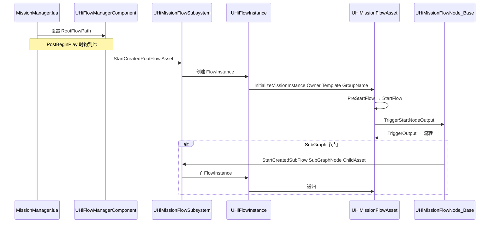
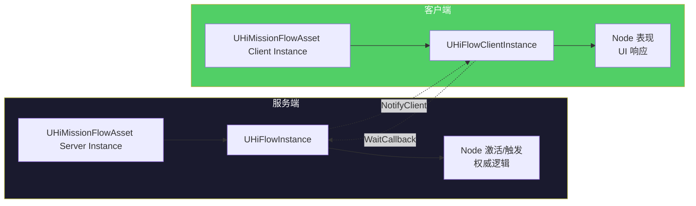
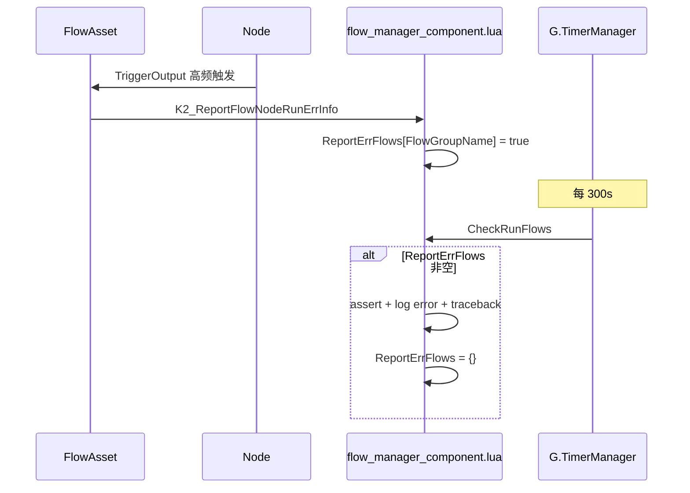

# 7. FlowInstance 运行时

`UFlowAsset` 是模板,运行时实际的执行体是 `UHiFlowInstance`(服务端)+ `UHiFlowClientInstance`(客户端)。`UHiFlowManagerComponent` 是挂在 Actor 上的入口(`MissionManager`/`Player`/`World`),子类有 `UHiPlayerFlowManagerComponent`、`UHiSyncFlowManagerComponentBase`。本章讲:从 `MissionManager:OnPreInitializeComponents` Lua 入口,到 RootFlow 启动、SubFlow 派生、Node 激活、跨 Asset 状态查询的完整调用链。

## 启动链路总览



## 三种 FlowManager 子类

| 类 | 挂在 | 用途 | 关键 UPROPERTY |
|---|---|---|---|
| `UHiFlowManagerComponent`[^7-1] | 任意 Actor(MissionManager/World) | 通用基类 | `RootFlowGroupName/RootFlowPath`(由 Lua 设置) |
| `UHiPlayerFlowManagerComponent`[^7-2] | `APlayerState` | 玩家域 Flow(Player Domain) | (基类 + 玩家上下文) |
| `UHiSyncFlowManagerComponentBase`[^7-3] | DDS 跨服同步类 | DDS Server Migration 时同步 Flow | (基类 + 同步逻辑) |

## UHiMissionFlowComponent — 节点级轻量入口

```cpp
UCLASS()
class HIMISSION_API UHiMissionFlowComponent : public UActorComponent
{
public:
    virtual void InitializeComponent() override;
    virtual void BeginPlay() override;
    virtual void EndPlay(const EEndPlayReason::Type EndPlayReason) override;

    UPROPERTY(BlueprintReadWrite)
    FString RootFlowGroupName;

    UPROPERTY(EditAnywhere, BlueprintReadWrite, Category = "RootFlow")
    FString RootFlowPath;
};
```

[^7-4]

`UHiMissionFlowComponent` 只是个简易组件,职责:
- BeginPlay 时,如果 `RootFlowPath` 非空,加载该 Asset 并启动
- EndPlay 时清理

> 真正复杂的逻辑在 `UHiFlowManagerComponent`(挂在玩家/管理者 Actor 上),`UHiMissionFlowComponent` 主要是 Lua 侧 `mission_manager.lua` 引用的那个 `MissionFlowComponent` 字段。

## Lua 入口 — MissionManager

`mission_manager.lua`[^7-5] 是任务系统的 Lua 总入口:

```lua
local G = require("G")
local BPConst = require("common.const.blueprint_const")
local GlobalActorConst = require("common.const.global_actor_const")
local SubsystemUtils = require("common.utils.subsystem_utils")
local Actor = require("common.actor")
local LevelTable = require("common.data.level_data").data

---@type MissionManager_C
local MissionManager = Class(Actor)

MissionManager.EntityServiceName = ""
MissionManager.EntityPropertyMessageName = "MissionManager"

function MissionManager:GetGlobalName()
    return GlobalActorConst.MissionManager
end

function MissionManager:OnPreInitializeComponents()
    if self:HasAuthority() then
        local World = UE.UHiUtilsFunctionLibrary.GetGWorld()
        local GameplayEntitySubsystem = SubsystemUtils.GetGameplayEntitySubsystem(self)
        local DungeonID = GameplayEntitySubsystem:GetCurrentDungeonID()
        local LevelData = LevelTable[DungeonID]
        local RootFlowPath = nil
        if LevelData ~= nil and LevelData.scene_root_flowgraph ~= nil then
            RootFlowPath = LevelData.scene_root_flowgraph
        else
            local WorldSettings = World:K2_GetWorldSettings()
            if WorldSettings.MissionRootFlow ~= nil then
                RootFlowPath = WorldSettings.MissionRootFlow:GetAssetPathName()
            end
        end
        if RootFlowPath ~= nil then
            self.MissionFlowComponent.RootFlowPath = RootFlowPath
        end
    end
end
```

要点:
- `MissionManager` 是个全局 Actor(通过 `GlobalActorConst.MissionManager` 注册)
- 仅 Server `HasAuthority()` 时启动 RootFlow
- 路径优先级:`LevelData.scene_root_flowgraph`(配表) > `WorldSettings.MissionRootFlow`(场景设置) > `nil`(不启动)
- 关键变量名:`self.MissionFlowComponent`(C++ 侧通过 `UHiMissionFlowComponent` 注入,Lua 通过 ToLua 反射拿到)

## Lua 入口 — FlowManagerComponent

`flow_manager_component.lua`[^7-6] 是任务节点事件分发的 Lua 总线:

| 方法 | 角色 |
|---|---|
| `RegisterMissionEvent(MissionEvent)` | 节点把自己的 Event 注册到这里,通过 `UniqueName` 索引 |
| `UnregisterMissionEvent(MissionEvent)` | 反注册 |
| `OnMissionEvent(EventParams)` (Server) | 收到事件后通过 `UniqueName` 查到 Event 对象,调它的 `OnEvent` |
| `ListenCommonEvent(EventType, MissionEvent)` | 监听通用事件类型(非 Unique) |
| `OnCommonEvent(EventData)` (Server) | 通用事件分发,按 EventType 找一组 listener |
| `K2_RestartRootFlow(FlowAsset, InFlowAssetPath, bIsPersistent)` | 重启整个 Root Flow |
| `K2_ReportFlowNodeRunErrInfo(FlowAsset, FlowNode, PinName, PinItem)` | 节点异常上报 |
| `RevertToCheckPoint(FlowAsset, AbortWorkActionNodeGuids, RevertCheckPointSet)` | 回档(详见第 9 章) |
| `RevertWorkAction(FlowAsset, SubWorkActionGuid)` | 单 WorkAction 重启 |
| `CheckRunFlows()` | 周期检查(每 300s)报错 Flows |

`__replicates` 表[^7-7] 声明 `ReportErrFlows` 是 Lua 侧的网络复制字段。

## UHiMissionFlowSubsystem — World 域中枢

```cpp
UCLASS()
class HIMISSION_API UHiMissionFlowSubsystem : public UFlowSubsystem,
    public FHiMissionIdentifierCollectorInterface
{
public:
    void StartCreatedRootFlow(UHiMissionFlowAsset* CreatedFlow);
    void LoadCreatedRootFlow(UHiMissionFlowAsset* CreatedFlow, const FString& SavedAssetInstanceName);
    void StartCreatedSubFlow(UHiMissionFlowNode_SubGraphBase* SubGraphNode, UHiMissionFlowAsset* CreatedFlow);
    void LoadCreatedSubFlow(UHiMissionFlowNode_SubGraphBase* SubGraphNode, UHiMissionFlowAsset* CreatedFlow, const FString& SavedAssetInstanceName);

    UFUNCTION(BlueprintCallable)
    void AppendLoadedSaveGame(const FFlowComponentSaveData& ComponentSaveData,
        const TArray<FFlowAssetSaveData>& AssetSaveDatas);

    // FHiMissionIdentifierCollectorInterface
    virtual bool AddMissionGroup(int32 MissionGroupID, const FHiMissionIdentifier& Identifier) override;
    virtual bool AddMissionAct(int32 MissionActID, const FHiMissionIdentifier& Identifier) override;
    virtual bool AddMission(int32 MissionID, const FHiMissionIdentifier& Identifier,
        const EMissionTrackIconType& IconType) override;
    virtual bool AddMissionEvent(int32 MissionEventID, const FHiMissionIdentifier& Identifier) override;
    virtual FStreamableManager* GetStreamableManager() override;

    UFlowNode* FindMissionNodeWithFilter(FMissionNodeFilter Filter);
    UFlowNode* FindMissionGroupNode(int32 MissionGroupID);
    UFlowNode* FindMissionActNode(int32 MissionActID);
    UFlowNode* FindMissionNode(int32 MissionID);
    UFlowNode* FindMissionEventNode(int32 MissionEventID);
    
    // ... 4 个 GetXxxIdentifier
};
```

[^7-8]

> 注释 `// todo: support distributed ds`[^7-9] 在源代码 `HiMissionFlowSubsystem.h:9` — 暗示 Subsystem 在 DDS 跨服场景下还需要进一步改造(比如多 DS 共享同一份 MissionID 索引)。

## Server vs Client 双 Instance

虽然类名 `UHiFlowInstance` / `UHiFlowClientInstance` 在头文件声明了(`HiMissionFlowAsset.h:15-18`),但具体实现细节超出本 wiki 阅读到的源码深度。从 FlowAsset 的双友元能看到这条主线:

```cpp
// HiMissionFlowAsset.h:15-18
class UHiFlowInstance;
class UHiFlowClientInstance;
class HiMissionFlowNode_Base;

// HiMissionFlowAsset.h:218
TWeakObjectPtr<UHiFlowInstance> InspectedFlowInstance;  // Editor only
```



详细的 ServerClient 通信走 `FHiFlowNodeNetworkConfig` — 见第 8 章。

## EFlowInstanceType

社区版 FlowAsset 自带的[^7-10]:

```cpp
UENUM(BlueprintType)
enum class EFlowInstanceType : uint8
{
    Client UMETA(DisplayName = "Client"),
    Server UMETA(DisplayName = "Server")
};
```

`UFlowAsset::InstanceType` 字段(默认 `Server`)在运行时设置,FlowInstance 创建时根据这个分流到 `UHiFlowInstance` 还是 `UHiFlowClientInstance`。

## Node 运行时统计

每个 Node 的运行时计数器存在 `UHiMissionFlowAsset::FlowNodeRunInfos`:

```cpp
USTRUCT(BlueprintType)
struct FFlowNodePinItem
{
    UPROPERTY()
    uint32 TriggerNum = 0;      // 触发次数
    UPROPERTY()
    double LastTime = 0.f;      // 最后一次触发时间
    
    void Reset()
    {
        TriggerNum = 0;
        LastTime = 0.f;
    }
};

USTRUCT(BlueprintType)
struct FFlowNodeRunInfo
{
    UPROPERTY()
    TMap<FName, FFlowNodePinItem> FlowNodePinItems;   // Pin → 计数
};
```

[^7-11]

用途:
- `K2_ReportFlowNodeRunErrInfo`(`flow_manager_component.lua:217`)— 节点高频触发或异常上报
- `MarkNextNodeCheckPoint(Node)`[^7-12] — 配合 `CheckPoint` 机制决定存档时机
- 调试器查看节点活跃度

## 持续状态字段

```cpp
UPROPERTY()
bool bStarted = false;

UPROPERTY()
bool bLoaded;

void SetFlowDormant(bool bIsForce=false);
```

[^7-13]

| 字段 | 含义 |
|---|---|
| `bStarted` | StartFlow 之后置 true,FinishFlow 后置 false |
| `bLoaded` | LoadFromPersistentMessage 之后置 true,标识恢复完成 |
| Dormant | "休眠态" — 节点暂停响应输入,通过 `SetFlowDormant(true)` 进入,典型场景:玩家离线/切场景 |

## 错误上报回路



## DEPRECATED 入口

```cpp
UE_DEPRECATED(5.0, "...")
void RegisterMissionIdentifiers(UObject* WorldContextObject);

UE_DEPRECATED(5.0, "...")
void InitializeMissionIdentifiers(UObject* ParentNode);

UE_DEPRECATED(5.0, "...")
void RegisterMissionIdentifiers(FHiMissionIdentifierCollectorInterface* Collector,
    const FHiMissionIdentifier& ParentIdentifier) const;

UE_DEPRECATED(5.0, "...")
UFlowNode* FindMissionNodeWithFilter(FMissionNodeFilter Filter);
```

[^7-14]

写新代码不要用上面 4 个,改用 `RegisterMissionIdentifier`(单数)和 `Subsystem::FindMissionNode/FindMissionEventNode/...`。

---

## Sources

[^7-1]: `Plugins/HiMission/Source/HiMission/Public/HiFlowManagerComponent.h`
[^7-2]: `Plugins/HiMission/Source/HiMission/Public/FlowManager/HiPlayerFlowManagerComponent.h`
[^7-3]: `Plugins/HiMission/Source/HiMission/Public/FlowManager/HiSyncFlowManagerComponentBase.h`
[^7-4]: `Plugins/HiMission/Source/HiMission/Public/HiMissionFlowComponent.h:9-28`
[^7-5]: `Content/Script/mission/mission_manager.lua:1-50`
[^7-6]: `Content/Script/mission/flow_manager_component.lua:1-277`
[^7-7]: `Content/Script/mission/flow_manager_component.lua:18-21` — `__replicates`
[^7-8]: `Plugins/HiMission/Source/HiMission/Public/HiMissionFlowSubsystem.h:11-69`
[^7-9]: `Plugins/HiMission/Source/HiMission/Public/HiMissionFlowSubsystem.h:9` — todo 注释
[^7-10]: `Plugins/FlowGraph/Source/Flow/Public/FlowAsset.h:38-43` — `EFlowInstanceType`
[^7-11]: `Plugins/HiMission/Source/HiMission/Public/HiMissionCommon.h:64-90`
[^7-12]: `Plugins/HiMission/Source/HiMission/Public/HiMissionFlowAsset.h:580-585`
[^7-13]: `Plugins/HiMission/Source/HiMission/Public/HiMissionFlowAsset.h:529-534, 388`
[^7-14]: `Plugins/HiMission/Source/HiMission/Public/HiMissionFlowAsset.h:314-346` — DEPRECATED 5.0

## Cross-link

→ [3. HiMissionFlowAsset](3.%20HiMissionFlowAsset%20解剖.md) Asset 与 Instance 关系
→ [5. Mission 层级与子图](5.%20Mission%20层级与子图.md) Subsystem 索引来源
→ [8. 网络同步策略矩阵](8.%20网络同步策略矩阵.md) Server↔Client 通信细节
→ [9. 持久化与回档](9.%20持久化与回档.md) Revert 链路
