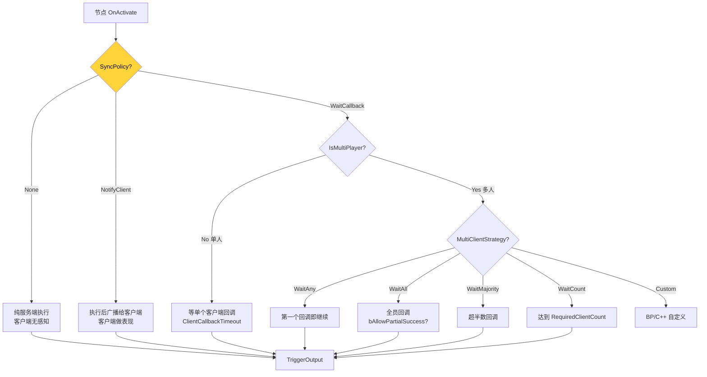

# 8. 网络同步策略矩阵

HiGame 任务节点全部在**服务端权威**执行,但需要在 DDS 架构(多 DS 共同服务一张大世界)下做 ghost-real 跨 DS 流转 + 客户端表现/确认/投票。`FHiFlowNodeNetworkConfig`[^8-1] 把这些选项做成节点级 UPROPERTY 三维矩阵:`SyncPolicy(3) × ExecutionDomain(3) × MultiClientStrategy(6)`。本章用一张大图把所有组合走一遍,并讲清楚 `FHiFlowNodeCallbackAggregator` 多客户端聚合算法。

## 决策树



## 5 个核心枚举

### EHiFlowSyncPolicy[^8-2]

```cpp
UENUM(BlueprintType)
enum class EHiFlowSyncPolicy : uint8
{
    None         UMETA(DisplayName = "No Sync (Server Only)"),
    NotifyClient UMETA(DisplayName = "Notify Client"),
    WaitCallback UMETA(DisplayName = "Wait Client Callback (Client Driven)"),
};
```

| 值 | 服务端做 | 客户端做 | 服务端等吗 |
|---|---|---|---|
| `None` | 执行 | 无感知 | 不等 |
| `NotifyClient` | 执行 + 广播 | 收到后做表现(动画/UI) | 不等(广播即继续) |
| `WaitCallback` | 执行 + 广播 | 收到 + 处理 + 回调 | **等到回调或超时** |

注释强调"所有策略都支持服务端强制打断"[^8-3] — 用于调试、超时、异常处理。

### EHiFlowNodeExecutionDomain[^8-4]

```cpp
UENUM(BlueprintType)
enum class EHiFlowNodeExecutionDomain : uint8
{
    Auto    UMETA(DisplayName = "Auto"),         // 默认 World
    World   UMETA(DisplayName = "World Domain"), // Owner=GameState
    Player  UMETA(DisplayName = "Player Domain"),// Owner=PlayerState
};
```

> Auto 默认是 World 域。World 域的节点跨所有玩家可见(开 Boss/解锁地图);Player 域的节点只对单个玩家有效(私人成就/拾取)。

### EHiFlowMultiClientWaitStrategy[^8-5]

```cpp
UENUM(BlueprintType)
enum class EHiFlowMultiClientWaitStrategy : uint8
{
    None         UMETA(DisplayName = "None"),                // 单人(不适用)
    WaitAny      UMETA(DisplayName = "Wait Any Client"),    // 第一个响应胜出
    WaitAll      UMETA(DisplayName = "Wait All Clients"),   // 全员响应
    WaitMajority UMETA(DisplayName = "Wait Majority"),      // 超半数
    WaitCount    UMETA(DisplayName = "Wait Specific Count"),// 达到指定数
    Custom       UMETA(DisplayName = "Custom Logic"),       // BP/C++ 自定义
};
```

### EHiFlowPlayerChangePolicy[^8-6]

```cpp
UENUM(BlueprintType)
enum class EHiFlowPlayerChangePolicy : uint8
{
    Ignore         UMETA(DisplayName = "Ignore"),         // 忽略玩家变动
    PauseOnLeave   UMETA(DisplayName = "Pause On Leave"), // 任一玩家离开就暂停
    AbortOnLeave   UMETA(DisplayName = "Abort On Leave"), // 任一玩家离开就中止
    WaitMinimum    UMETA(DisplayName = "Wait Minimum Count"), // 等最低人数
    Custom         UMETA(DisplayName = "Custom Logic"),
};
```

### EHiFlowType[^8-7]

```cpp
UENUM(BlueprintType)
enum class EHiFlowType : uint8
{
    SinglePlayer  UMETA(DisplayName = "Single Player"),
    MultiPlayer   UMETA(DisplayName = "Multi Player"),
    World         UMETA(DisplayName = "World Flow"),    // 全局
};
```

## FHiFlowNodeNetworkConfig 全字段

```cpp
USTRUCT(BlueprintType)
struct HIMISSION_API FHiFlowNodeNetworkConfig
{
    UPROPERTY(EditAnywhere, BlueprintReadWrite, Category = "Network")
    EHiFlowSyncPolicy SyncPolicy = EHiFlowSyncPolicy::None;

    UPROPERTY(EditAnywhere, BlueprintReadWrite, Category = "Network",
        meta = (EditCondition = "SyncPolicy == EHiFlowSyncPolicy::WaitCallback",
                EditConditionHides, ClampMin = "0.0"))
    float ClientCallbackTimeout = 30.0f;

    UPROPERTY(EditAnywhere, BlueprintReadWrite, Category = "Network|MultiPlayer",
        meta = (EditCondition = "SyncPolicy == EHiFlowSyncPolicy::WaitCallback",
                EditConditionHides))
    EHiFlowMultiClientWaitStrategy MultiClientStrategy = EHiFlowMultiClientWaitStrategy::None;

    UPROPERTY(EditAnywhere, BlueprintReadWrite, Category = "Network|MultiPlayer",
        meta = (EditCondition = "MultiClientStrategy == EHiFlowMultiClientWaitStrategy::WaitCount",
                EditConditionHides, ClampMin = "1"))
    int32 RequiredClientCount = 1;

    UPROPERTY(EditAnywhere, BlueprintReadWrite, Category = "Network|MultiPlayer",
        meta = (EditCondition = "MultiClientStrategy != EHiFlowMultiClientWaitStrategy::None",
                EditConditionHides))
    bool bAllowPartialSuccess = false;

    UPROPERTY(EditAnywhere, BlueprintReadWrite, Category = "Network|MultiPlayer",
        meta = (EditCondition = "MultiClientStrategy != EHiFlowMultiClientWaitStrategy::None",
                EditConditionHides, ClampMin = "0.0"))
    float PerClientTimeout = 15.0f;

    UPROPERTY(EditAnywhere, BlueprintReadWrite, Category = "Network|MultiPlayer")
    EHiFlowPlayerChangePolicy PlayerChangePolicy = EHiFlowPlayerChangePolicy::Ignore;

    UPROPERTY(EditAnywhere, BlueprintReadWrite, Category = "Network|MultiPlayer",
        meta = (EditCondition = "PlayerChangePolicy == EHiFlowPlayerChangePolicy::WaitMinimum",
                EditConditionHides, ClampMin = "1"))
    int32 MinimumPlayerCount = 1;

    UPROPERTY(EditAnywhere, BlueprintReadWrite, Category = "Network|MultiPlayer")
    bool bAllowLateJoin = true;

    UPROPERTY(EditAnywhere, BlueprintReadWrite, Category = "Network|MultiPlayer")
    bool bLeaderOnly = false;

    UPROPERTY(EditAnywhere, BlueprintReadWrite, Category = "Network|MultiPlayer")
    bool bAutoPromoteLeader = true;

    bool IsMultiPlayerNode() const
    {
        return MultiClientStrategy != EHiFlowMultiClientWaitStrategy::None;
    }
    
    bool ShouldWaitForMultipleClients() const
    {
        return SyncPolicy == EHiFlowSyncPolicy::WaitCallback && IsMultiPlayerNode();
    }
    
    bool ShouldNotifyClient() const
    {
        return SyncPolicy == EHiFlowSyncPolicy::NotifyClient
            || SyncPolicy == EHiFlowSyncPolicy::WaitCallback;
    }

    bool ShouldWaitCallback() const
    {
        return SyncPolicy == EHiFlowSyncPolicy::WaitCallback;
    }

    FString GetConfigDescription() const;
};
```

[^8-8]

> EditCondition 联动让 Detail Panel 在 SyncPolicy=None 时**完全隐藏多人配置** — UE 5.0+ 的 `EditConditionHides` 元标记。

## 5 个典型场景配置

### 场景 1: 纯服务端记录(无网络开销)

```
SyncPolicy = None
```

适用:服务端日志、策划数据上报、内部状态机推进 — 客户端完全无感知。

### 场景 2: 表现节点(如播 Cutscene)

```
SyncPolicy = NotifyClient
```

适用:服务端决定播 Sequence/动画,广播给客户端,客户端各自播放 — 服务端不等待。

### 场景 3: 单人交互(等客户端选择)

```
SyncPolicy = WaitCallback
ClientCallbackTimeout = 30.0
MultiClientStrategy = None  // 单人
```

适用:单玩家做选择(对话分支/物品拾取确认)— 服务端等客户端选完再继续。

### 场景 4: 多人副本开 Boss(任一玩家触发)

```
SyncPolicy = WaitCallback
MultiClientStrategy = WaitAny
```

适用:多人副本里任一玩家点开关都触发开 Boss。

### 场景 5: 多人投票(过半通过)

```
SyncPolicy = WaitCallback
MultiClientStrategy = WaitMajority
PerClientTimeout = 15.0
```

适用:小队投票决定走 A 路还是 B 路 — 用 `GetMostCommonOutputPin()` 取多数选项。

## FHiFlowNodeCallbackAggregator — 多客户端聚合算法

```cpp
USTRUCT()
struct FHiFlowNodeCallbackAggregator
{
    UPROPERTY() FGuid NodeId;
    UPROPERTY() FGuid FlowId;
    UPROPERTY() TArray<FHiFlowClientCallbackInfo> ExpectedClients;
    UPROPERTY() EHiFlowMultiClientWaitStrategy Strategy;
    UPROPERTY() double StartTime;
    UPROPERTY() float OverallTimeout;
    UPROPERTY() float PerClientTimeout;
    UPROPERTY() int32 RequiredCount;
    UPROPERTY() bool bAllowPartialSuccess;
    UPROPERTY() bool bCompleted;
    UPROPERTY() EHiFlowClientCallbackResult Result;

    void Initialize(const FGuid& InFlowId, const FGuid& InNodeId,
                    const TArray<APlayerState*>& Clients,
                    const FHiFlowNodeNetworkConfig& Config);

    bool RecordCallback(APlayerState* PS, const FName& OutputPin, bool bFinish);
    bool CheckCompletion(EHiFlowClientCallbackResult& OutResult);
    FName GetMostCommonOutputPin() const;
};
```

[^8-9]

完成判定算法[^8-10]:

```cpp
switch (Strategy)
{
case EHiFlowMultiClientWaitStrategy::WaitAny:
    bShouldComplete = (RespondedCount > 0);
    Result = EHiFlowClientCallbackResult::CountReached;
    break;
    
case EHiFlowMultiClientWaitStrategy::WaitAll:
    if (RespondedCount == TotalClients) {
        bShouldComplete = true;
        Result = EHiFlowClientCallbackResult::AllAgreed;
    } else if (bAllowPartialSuccess && (RespondedCount + TimedOutCount == TotalClients)) {
        bShouldComplete = true;
        Result = EHiFlowClientCallbackResult::Timeout;
    }
    break;
    
case EHiFlowMultiClientWaitStrategy::WaitMajority:
{
    const int32 MajorityThreshold = (TotalClients / 2) + 1;
    if (RespondedCount >= MajorityThreshold) {
        bShouldComplete = true;
        Result = EHiFlowClientCallbackResult::MajorityAgreed;
    }
}
    break;
    
case EHiFlowMultiClientWaitStrategy::WaitCount:
    if (RespondedCount >= RequiredCount) {
        bShouldComplete = true;
        Result = EHiFlowClientCallbackResult::CountReached;
    }
    break;
}
```

> 每帧轮询 `CheckCompletion`,首次检查超时:`(CurrentTime - StartTime) > OverallTimeout` → 强制完成,Result = Timeout。

## EHiFlowClientCallbackResult[^8-11]

```cpp
enum class EHiFlowClientCallbackResult : uint8
{
    AllAgreed,        // WaitAll 全员到达
    MajorityAgreed,   // WaitMajority 半数+
    CountReached,     // WaitAny / WaitCount
    Timeout,          // 超时
    Cancelled,        // 服务端逻辑取消
};
```

## FHiFlowClientCallbackInfo — 单客户端回调信息

```cpp
USTRUCT()
struct FHiFlowClientCallbackInfo
{
    UPROPERTY()
    TWeakObjectPtr<APlayerState> PlayerState;
    UPROPERTY()
    double CallbackTime = 0.0;
    UPROPERTY()
    FName OutputPin;       // 客户端选的输出引脚（用于投票）
    UPROPERTY()
    bool bFinish = false;  // 客户端是否要求 finish 节点
    UPROPERTY()
    bool bResponded = false;
    UPROPERTY()
    bool bTimedOut = false;
    
    FHiFlowClientCallbackInfo() = default;
    FHiFlowClientCallbackInfo(APlayerState* InPS) : PlayerState(InPS) {}
};
```

[^8-12]

## GetMostCommonOutputPin — 投票算法

```cpp
FName GetMostCommonOutputPin() const
{
    TMap<FName, int32> VoteCount;
    
    for (const FHiFlowClientCallbackInfo& Info : ExpectedClients)
    {
        if (Info.bResponded)
        {
            VoteCount.FindOrAdd(Info.OutputPin)++;
        }
    }
    
    FName MostCommon;
    int32 MaxCount = 0;
    for (const auto& Pair : VoteCount)
    {
        if (Pair.Value > MaxCount)
        {
            MaxCount = Pair.Value;
            MostCommon = Pair.Key;
        }
    }
    return MostCommon;
}
```

[^8-13]

> **平票情况**:返回最先扫到的最大值 — 没有显式 tiebreaker。如果项目要求平票特殊处理,请走 Custom 策略自定义。

## 节点上的 NetworkConfig 字段

```cpp
// HiMissionFlowNode_Base.h
UPROPERTY(EditAnywhere, Category = "Network Config", meta = (ShowOnlyInnerProperties))
FHiFlowNodeNetworkConfig NetworkConfig;

UFUNCTION(BlueprintCallable, Category= "Network")
virtual const FHiFlowNodeNetworkConfig& GetNetworkConfig() const override
{
    return NetworkConfig;
}

UFUNCTION(BlueprintCallable, Category= "Network")
bool IsMultiPlayerNode() const;

UFUNCTION(BlueprintCallable, Category= "Network")
bool ShouldWaitForMultipleClients() const;

UFUNCTION(BlueprintCallable, Category= "Network")
bool ShouldNotifyClient() const;

UFUNCTION(BlueprintCallable, Category= "Network")
bool ShouldWaitCallback() const;

/** 运行时覆盖同步策略（用于根据数据动态决定同步行为，如客户端NPC场景） */
UFUNCTION(BlueprintCallable, Category= "Network")
void SetSyncPolicy(EHiFlowSyncPolicy NewPolicy)
{
    NetworkConfig.SyncPolicy = NewPolicy;
}
```

[^8-14]

> **`SetSyncPolicy` 运行时覆盖**:文档注释明确写"用于根据数据动态决定同步行为,如客户端NPC场景" — 实际项目里"客户端 NPC"是个特殊角色(在客户端而不在服务端跑的 NPC),需要把节点的 SyncPolicy 切成 NotifyClient 而非 None。

## 配置组合速查表

| 用途 | SyncPolicy | MultiClientStrategy | 备注 |
|---|---|---|---|
| 纯服务端节点 | None | — | 客户端无感知 |
| 服务端→客户端表现 | NotifyClient | — | 不等回调 |
| 单人选择 | WaitCallback | None | 等单客户端 |
| 多人开 Boss | WaitCallback | WaitAny | 任一玩家 |
| 多人解锁 | WaitCallback | WaitAll | 全员到达 |
| 多人投票 | WaitCallback | WaitMajority | 半数+ |
| 队伍小组任务 | WaitCallback | WaitCount + RequiredClientCount=N | 指定 N 人 |

---

## Sources

[^8-1]: `Plugins/HiMission/Source/HiMission/Public/FlowSync/HiFlowSyncTypes.h:189-309`
[^8-2]: `Plugins/HiMission/Source/HiMission/Public/FlowSync/HiFlowSyncTypes.h:83-93`
[^8-3]: `Plugins/HiMission/Source/HiMission/Public/FlowSync/HiFlowSyncTypes.h:80-81` — 注释 "所有策略都支持服务端强制打断"
[^8-4]: `Plugins/HiMission/Source/HiMission/Public/FlowSync/HiFlowSyncTypes.h:60-71`
[^8-5]: `Plugins/HiMission/Source/HiMission/Public/FlowSync/HiFlowSyncTypes.h:100-120`
[^8-6]: `Plugins/HiMission/Source/HiMission/Public/FlowSync/HiFlowSyncTypes.h:14-30`
[^8-7]: `Plugins/HiMission/Source/HiMission/Public/FlowSync/HiFlowSyncTypes.h:36-46`
[^8-8]: `Plugins/HiMission/Source/HiMission/Public/FlowSync/HiFlowSyncTypes.h:189-309` — 全字段
[^8-9]: `Plugins/HiMission/Source/HiMission/Public/FlowSync/HiFlowSyncTypes.h:319-528` — Aggregator
[^8-10]: `Plugins/HiMission/Source/HiMission/Public/FlowSync/HiFlowSyncTypes.h:447-490` — CheckCompletion 算法
[^8-11]: `Plugins/HiMission/Source/HiMission/Public/FlowSync/HiFlowSyncTypes.h:125-142`
[^8-12]: `Plugins/HiMission/Source/HiMission/Public/FlowSync/HiFlowSyncTypes.h:149-184`
[^8-13]: `Plugins/HiMission/Source/HiMission/Public/FlowSync/HiFlowSyncTypes.h:503-528`
[^8-14]: `Plugins/HiMission/Source/HiMission/Public/FlowNodes/HiMissionFlowNode_Base.h:202-203, 297-318`

## Cross-link

→ [4. 节点四件套](4.%20节点四件套生命周期.md) NetworkConfig 在 Node 上的字段
→ [7. FlowInstance 运行时](7.%20FlowInstance%20运行时.md) Server vs Client 双 Instance
→ [13. Cookbook](13.%20Cookbook%20—%20加一个新任务.md) NetworkConfig 决策清单
