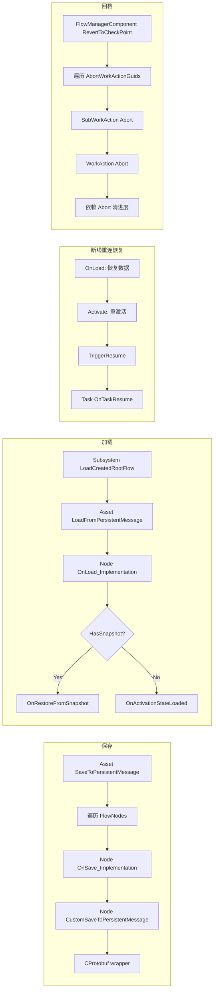

# 9. 持久化与回档

HiGame 用 **CProtobuf** 替代 UE 自带 SaveGame 做存档。`UHiMissionFlowAsset::Load/SaveToPersistentMessage(MessageWrapper)` 是入口,每个节点和事件都实现 `CustomLoad/SaveToPersistentMessage`。`SaveType` 枚举决定哪些状态持久化(实时/完成时存/不存)。回档 (RevertToCheckPoint) 通过 `WorkAction` 节点链与 `MarkNextNodeCheckPoint` 标记机制实现。本章讲完整的存读流程、`UPROPERTY(SaveGame)` 标志、CheckPoint/Snapshot/Resume 三种恢复路径。

## 4 条流程总览



## 关键枚举:EMissionSaveType

```cpp
UENUM(Blueprintable)
enum class EMissionSaveType : uint8
{
    None,        // 不存
    Finished,    // 完成时存
    Realtime,    // 实时存
};
```

[^9-1]

> 节点上的 `SaveType` 字段决定存档时机:`Realtime` 会在每个状态变更时触发存档(性能开销大),`Finished` 仅在节点 Finish 时存(主流),`None` 完全不存(临时节点/只读节点)。

## 节点级 SaveGame 字段总览

`UHiMissionFlowNode_Base`[^9-2]:

```cpp
UPROPERTY(SaveGame)
bool bNodeStarted = false;

UPROPERTY(BlueprintReadOnly, Category = "Save Game", SaveGame)
TArray<FHiMissionNodePinRecord> InputPinRecords;

UPROPERTY(BlueprintReadWrite, Category = "Save Game")
FString CustomData;
```

`FHiMissionNodePinRecord`[^9-3]:

```cpp
USTRUCT(BlueprintType)
struct FHiMissionNodePinRecord
{
    UPROPERTY(BlueprintReadWrite, Category = "Mission")
    FName PinName;

    UPROPERTY(BlueprintReadWrite, Category = "Mission")
    int32 Count;
    
    bool operator==(FName InPin) const
    {
        return this->PinName == InPin;
    }
};
```

> **InputPinRecords 用途**:节点幂等性 — 同一个 Pin 触发多次时,记录次数,防止外部信号洪泡导致节点重复激活。需要在节点上设置 `bNeedAddInputPinRecord = true` 才生效。

## CProtobuf Persistent Key 常量

```cpp
constexpr char HI_PERSISTENT_KEY_FLOW_ASSET_GROUPS[]      = "FlowAssetGroups";
constexpr char HI_PERSISTENT_KEY_STATE_RUNTIME_STATES[]   = "StateRuntimeStates";
constexpr char HI_PERSISTENT_KEY_PAUSE_FLOW_ASSET_GROUPS[]= "PauseFlowAssertGroups";
constexpr char HI_PERSISTENT_KEY_FLOWS[]                  = "Flows";
constexpr char HI_PERSISTENT_KEY_FLOW_NODES[]             = "Nodes";
constexpr char HI_PERSISTENT_KEY_FLOW_EVENTS[]            = "Events";
constexpr char HI_PERSISTENT_KEY_ACTIVATION_STATE[]       = "ActivationState";
```

[^9-4]

每个 key 对应 protobuf message 的 field — `SaveToPersistentMessage` 时按 key 写,`LoadFromPersistentMessage` 时按 key 读。

## 保存接口

```cpp
// HiMissionFlowAsset.h
bool LoadFromPersistentMessage(const CProtobufMessageWrapperPtr& MessageWrapper);
bool SaveToPersistentMessage(const CProtobufMessageWrapperPtr& MessageWrapper);

// HiMissionFlowNode_Base.h
virtual void OnSave_Implementation() override;
virtual void OnLoad_Implementation() override;
virtual bool CustomLoadFromPersistentMessage(const CProtobufMessageWrapperPtr& MessageWrapper) override;
virtual bool CustomSaveToPersistentMessage(const CProtobufMessageWrapperPtr& MessageWrapper) override;

// HiMissionEvent_Base.h
virtual bool LoadFromPersistentMessage(const CProtobufMessageWrapperPtr& MessageWrapper);
virtual bool SaveToPersistentMessage(const CProtobufMessageWrapperPtr& MessageWrapper);
```

[^9-5]

## CProtobuf 的 FSoftClassPath 限制

`UHiMissionFlowNode_TaskBridge` 的 `SavedTaskClassPath`[^9-6]:

```cpp
/**
 * Task 类路径（运行时 + 存档用），使用 FSoftClassPath 支持 CoreRedirects 重定向
 *
 * ⚠️ 虽然标记了 UPROPERTY(SaveGame)，但 CProtobuf 序列化框架不支持 FSoftClassPath 类型，
 *    该属性不会被 CProtobufMessageAccessor::SaveUObjectToMessage 持久化。
 *    真正的持久化通道：OnSave 时将类路径写入 SavedTaskData.TaskClassPath（FString），
 *    序列化为 JSON 存入 CustomData；OnLoad 时从 SavedTaskData.TaskClassPath 恢复此字段。
 */
UPROPERTY(SaveGame)
FSoftClassPath SavedTaskClassPath;

/** Task 运行时状态（存档用），由 UE 反射系统自动序列化 */
UPROPERTY(SaveGame)
FHiMissionTaskSaveData SavedTaskData;
```

> **关键设计陷阱**:CProtobuf 不支持 `FSoftClassPath/FSoftObjectPath` — 即使标记 `SaveGame`,也不会被持久化。**变通方法**:把类路径塞进 `FString TaskClassPath`(在 `FHiMissionTaskSaveData` 内),`CustomData` 字段(`FString` 类型)做 JSON 中转。

## FHiMissionTaskSaveData

```cpp
USTRUCT(BlueprintType)
struct HIMISSION_API FHiMissionTaskSaveData
{
    /** 版本号，ApplySaveData 中根据版本做分支兼容处理 */
    UPROPERTY(SaveGame)
    int32 Version = 1;

    /**
     * 是否需要恢复运行时状态
     * false（默认）：无状态 Task，恢复时直接重新激活
     * true：有状态 Task，恢复时先 ApplySaveData 再激活
     */
    UPROPERTY(SaveGame)
    bool bNeedsRestore = false;

    /** Task 类路径（FString 形式，如 "/Game/.../BP_Task.BP_Task_C"）
     *  ⚠️ 为什么用 FString 而不是 FSoftClassPath：见上面的注释 */
    UPROPERTY(SaveGame)
    FString TaskClassPath;

    /** 通用 KV 存储，Lua Task 直接使用此字段持久化状态 */
    UPROPERTY(SaveGame)
    TMap<FName, FString> RuntimeState;
};
```

[^9-7]

## 三种恢复路径对比

| 路径 | 触发场景 | 调用链 | 用途 |
|---|---|---|---|
| **正常 OnLoad** | 玩家上线、读档 | `OnLoad_Implementation()` → `Activate()` → `OnTaskActivate()` | 进入游戏首次还原 |
| **Snapshot** | DDS ghost-real 服务器迁移 | `OnRestoreFromSnapshot()` | 跨 DS 同步,数据迁移到新 DS 后恢复 |
| **TriggerResume** | 断线重连(短暂掉线) | `OnLoad` → `Activate` → `TriggerResume()` → `OnTaskResume()` | 玩家短暂断线后恢复运行时行为 |

```cpp
// HiMissionFlowNode_Base.h
UFUNCTION(BlueprintNativeEvent, Category = "Save Game")
void OnRestoreFromSnapshot();
virtual void OnRestoreFromSnapshot_Implementation();

virtual void TriggerResume() override;
```

[^9-8]

> **OnTaskResume 默认空实现**[^9-9]:文档明确说"现有 Task 子类不受影响(向后兼容)。仅在存档恢复路径下被调用,首次正常激活不会触发此方法。"

## UnLua UPARAM(ref) 限制

`UHiMissionTask_Base::GatherSaveData` 注释[^9-10]:

```cpp
/**
 * 收集需要持久化的运行时状态
 * 有状态 Task 必须设置返回值的 bNeedsRestore = true
 *
 * ⚠️ 使用返回值模式而非 UPARAM(ref) 引用参数：
 *    UPARAM(ref) 结构体参数在 UnLua 中存在数据丢失问题——
 *    UE ProcessEvent 会把参数复制到临时栈帧，Lua 修改的是副本，
 *    而 UnLua 的 PostCall 因 IsReferenceParameter() 跳过回写，
 *    导致 C++ 侧拿不到 Lua 的修改结果。
 */
UFUNCTION(BlueprintNativeEvent, Category = "Mission Task|Save")
FHiMissionTaskSaveData GatherSaveData();
virtual FHiMissionTaskSaveData GatherSaveData_Implementation()
{
    return FHiMissionTaskSaveData();
}
```

> **"为什么 GatherSaveData 用返回值"** 的根因 — UnLua 的 `IsReferenceParameter()` 跳过回写,UPARAM(ref) 在 Lua override 时拿不到结果。这是项目内一个广泛适用的陷阱:**所有 Lua 可 override 的 BlueprintNativeEvent,如果要返回结构体,一律用返回值,不要用 UPARAM(ref)**。

## CheckPoint 机制

```cpp
private:
    void MarkNextNodeCheckPoint(UFlowNode* Node);

    TSet<EFlowNodeState> PersistentNodeStates;
```

[^9-11]

`PersistentNodeStates` 是一个白名单 — 节点状态只有在这个集合里才参与持久化。`MarkNextNodeCheckPoint` 在节点流转时调用,标记"下一个节点是 CheckPoint",作为存档时机判定依据。

## RevertToCheckPoint — Lua 回档实现

`flow_manager_component.lua:145-172`[^9-12]:

```lua
function FlowManagerComponent:RevertToCheckPoint(FlowAsset, AbortWorkActionNodeGuids, RevertCheckPointSet)
    if not FlowAsset then
        G.log:error("apodzhang", "FlowManagerComponent:RevertToCheckPoint FlowAsset Is Null")
        return
    end

    local FlowGroupName = FlowAsset.FlowGroupName
    G.log:debug("apodzhang", "FlowManagerComponent:RevertToCheckPoint FlowGroupName:%s, AbortWorkActionNodeGuids:%s",
        FlowGroupName, AbortWorkActionNodeGuids:Length())
    for i=1, AbortWorkActionNodeGuids:Length() do
        local WorkActionGuid = AbortWorkActionNodeGuids:GetRef(i)
        local WorkActionNode = FlowAsset:GetNode(WorkActionGuid)
        if WorkActionNode then
            for i = WorkActionNode.SubWorkActionList:Length(), 1, -1 do
                local SubActionRef = WorkActionNode.SubWorkActionList[i]
                local SubWorkActionNode = FlowAsset:GetNode(SubActionRef.WorkActionGuid)
                if SubWorkActionNode then
                    SubWorkActionNode:Abort()  -- 子 WorkAction 反向 Abort
                end
            end
            local WorkActionNode = FlowAsset:GetNode(WorkActionGuid)
            if WorkActionNode then
                WorkActionNode:Abort()  -- 父 WorkAction Abort
            end
        end
    end
    self:SendMessage("RevertToCheckPoint", FlowGroupName, AbortWorkActionNodeGuids, RevertCheckPointSet)
end
```

> **回档算法的核心**:依赖 `WorkAction.Abort` 的事件级联清理 — Abort 节点会自动调 `Cleanup` → 释放所有 Action / 反注册所有 Event / 清 Tracking。

## RevertWorkAction — 单 WorkAction 重启

`flow_manager_component.lua:175-197`[^9-13]:

```lua
function FlowManagerComponent:RevertWorkAction(FlowAsset, SubWorkActionGuid)
    -- ...
    local SubWorkActionNode = FlowAsset:GetNode(SubWorkActionGuid)
    SubWorkActionNode:Abort()
    -- 依赖 Abort 清理当前进度
    self:SendMessage("RevertWorkAction", FlowGroupName, SubWorkActionGuid)
    
    local SubWorkNode = FlowAsset:GetNode(SubWorkActionGuid)
    local bCreateNew = false
    if SubWorkNode == nil then
        bCreateNew = true
        SubWorkNode = FlowAsset:CreateDynamicFlowNode(SubWorkActionGuid)
    end
    if SubWorkNode then
        SubWorkNode:StartWorkAction()
    end
end
```

> **可能创建动态节点**: `FlowAsset:CreateDynamicFlowNode(NodeGuid)`[^9-14] 在原节点已被销毁的情况下重建一个 — 这是个有意为之的"绕过 .uasset 数据"的运行时机制。

## K2_RestartRootFlow — 整个 Root 重启

`flow_manager_component.lua:199-215`[^9-15]:

```lua
function FlowManagerComponent:K2_RestartRootFlow(FlowAsset, InFlowAssetPath, bIsPersistent)
    -- ...
    local FlowGroupName = FlowAsset.FlowGroupName
    local MissionID = tonumber(FlowGroupName)
    local MissionTableData = MissionUtils.GetMissionTableData(MissionID)
    self:SendMessage("RestartRootFlow", FlowGroupName)
    if not MissionTableData then
        -- 其他 flow（groupactor flow, 玩法触发添加给玩家的 flow）
        self:FinishRootFlow(FlowGroupName, true)
        self:CreateRootFlow(FlowGroupName, InFlowAssetPath, bIsPersistent)
        self:StartRootFlow(FlowGroupName)
    end
end
```

> 注意:**Mission 类的 FlowGroupName 是 MissionID 的字符串** — `MissionUtils.GetMissionTableData(tonumber(FlowGroupName))` 即可拿到配表数据。如果 `FlowGroupName` 不是数字,说明这是机关/玩法 Flow,走重建分支。

## WorkAction 节点全景

```cpp
USTRUCT(BlueprintType)
struct HIMISSION_API FHiWorkActionReference
{
    UPROPERTY(BlueprintReadWrite, EditAnywhere)
    FGuid WorkActionGuid;
};

UENUM(BlueprintType)
enum class EHiWorkActionType : uint8
{
    Normal,
    SubWorkAction,
    StartNextWorkAction,
};

UCLASS(Abstract, Blueprintable)
class HIMISSION_API UHiMissionFlowNode_WorkAction : public UHiMissionFlowNode_Base
{
    UPROPERTY(BlueprintReadWrite, Category = "Work Action", meta = (VisibleInstanceOnly))
    EHiWorkActionType WorkActionType = EHiWorkActionType::Normal;

    UPROPERTY(BlueprintReadOnly, EditAnywhere, Category = "Work Action",
        meta = (EditCondition="WorkActionType != EHiWorkActionType::StartNextWorkAction", EditConditionHides))
    bool bIsSubWorkAction = false;
    
    UPROPERTY(BlueprintReadOnly, Category = "Work Action", meta = (ToolTip = "必须完成的节点"))
    TSet<FGuid> FinishNodes;

    UPROPERTY(BlueprintReadOnly, Category = "Work Action",
        meta = (AdvancedDisplay, ToolTip = "Work Action Entry Nodes"))
    TSet<FGuid> EntryNodes;

    UPROPERTY(Blueprintable, EditInstanceOnly, Category = "Work Action",
        meta = (EditCondition="!bIsSubWorkAction", EditConditionHides))
    TArray<FHiWorkActionReference> SubWorkActionList;

    // HiGame Begin: Fix non-deterministic cook
    UPROPERTY(Transient, BlueprintReadWrite, VisibleInstanceOnly, Category = "Work Action",
        meta = (EditCondition="false"))
    TArray<FHiWorkActionReference> ParentWorkActionList;
    // HiGame End

    UFUNCTION(BlueprintCallable, Category= "Work Action")
    void StartWorkAction();
    UFUNCTION(BlueprintCallable, Category= "Work Action")
    void FinishWorkAction();
    UFUNCTION(BlueprintImplementableEvent, Category = "FlowNode")
    void K2_OnWorkActionFinish();
    UFUNCTION(BlueprintImplementableEvent, Category = "FlowNode")
    void K2_Revert();
};
```

[^9-16]

> **HiGame Begin/End 标记**:`ParentWorkActionList` 字段从持久化改为 `Transient` 是 Hi 的本地修改 — 解决 Cook 非确定性问题(`PostLoad` 重建,无需序列化,避免 +24B/节点)。这是工程里**遵守第三方代码 Hi 修改规范**的真实例子(参见 `Projects/HiGame/CLAUDE.md`)。

## DEPRECATED 老结构(不要用)

```cpp
// HiMissionTypes.h
USTRUCT(BlueprintType)
struct FHiMissionInstance         // Deprecated
struct FHiMissionNodeInstance     // Deprecated
struct FHiMissionProgressInstance // Deprecated
struct FHiMissionAvatarData       // Deprecated
struct FHiMissionAvatarSyncData   // DEPRECATED
struct FHiMissionProgressRecord   // DEPRECATED
struct FHiMissionProgressAvatarData // Deprecated
```

[^9-17]

写新代码请用 `FHiFlowProgressScope` / `FHiFlowTrackingScope` / `FHiFlowStateRuntimeStatus` / `FHiMissionTaskSaveData`。

## 持久化错误检测

`flow_manager_component.lua:262-272`[^9-18]:

```lua
function FlowManagerComponent:CheckRunFlows()
    local bHasServerAuthority = self:GetOwner() and UE.UKismetSystemLibrary.IsServer(self:GetOwner()) and self:GetOwner():HasAuthority()
    if bHasServerAuthority then
        xpcall(function()
            assert(next(self.ReportErrFlows) == nil, "ReportErrFlows is not empty!")
        end, function(Err)
            G.log:error("FlowManagerComponent", "CheckRunFlows error: %s\n %s", tostring(Err), debug.traceback())
        end)
        self.ReportErrFlows = {}
    end
end
```

每 300s 调一次,通过 `assert + xpcall` 捕获 stacktrace 上报。

---

## Sources

[^9-1]: `Plugins/HiMission/Source/HiMission/Public/HiMissionCommon.h:39-47`
[^9-2]: `Plugins/HiMission/Source/HiMission/Public/FlowNodes/HiMissionFlowNode_Base.h:51-61`
[^9-3]: `Plugins/HiMission/Source/HiMission/Public/HiMissionTypes.h:382-402`
[^9-4]: `Plugins/HiMission/Source/HiMission/Public/HiMissionCommon.h:19-25`
[^9-5]: `Plugins/HiMission/Source/HiMission/Public/HiMissionFlowAsset.h:351-353`; `FlowNode_Base.h:148-150`; `Event_Base.h:91-92`
[^9-6]: `Plugins/HiMission/Source/HiMission/Public/FlowNodes/HiMissionFlowNode_TaskBridge.h:95-117`
[^9-7]: `Plugins/HiMission/Source/HiMission/Public/Tasks/HiMissionTask_Base.h:191-227`
[^9-8]: `Plugins/HiMission/Source/HiMission/Public/FlowNodes/HiMissionFlowNode_Base.h:316-318, 153-154`
[^9-9]: `Plugins/HiMission/Source/HiMission/Public/Tasks/HiMissionTask_Base.h:294-308`
[^9-10]: `Plugins/HiMission/Source/HiMission/Public/Tasks/HiMissionTask_Base.h:314-326`
[^9-11]: `Plugins/HiMission/Source/HiMission/Public/HiMissionFlowAsset.h:580-585`
[^9-12]: `Content/Script/mission/flow_manager_component.lua:145-172`
[^9-13]: `Content/Script/mission/flow_manager_component.lua:175-197`
[^9-14]: `Plugins/HiMission/Source/HiMission/Public/HiMissionFlowAsset.h:574-578`
[^9-15]: `Content/Script/mission/flow_manager_component.lua:199-215`
[^9-16]: `Plugins/HiMission/Source/HiMission/Public/FlowNodes/HiMissionFlowNode_WorkAction.h:7-166`
[^9-17]: `Plugins/HiMission/Source/HiMission/Public/HiMissionTypes.h:130-355` — DEPRECATED 注释
[^9-18]: `Content/Script/mission/flow_manager_component.lua:262-272`

## Cross-link

→ [3. HiMissionFlowAsset](3.%20HiMissionFlowAsset%20解剖.md) Persistent Message 入口
→ [7. FlowInstance 运行时](7.%20FlowInstance%20运行时.md) RestartRootFlow Lua 实现
→ [10. TaskBridge](10.%20TaskBridge%20与%20Lua%20Task%20三模式.md) FHiMissionTaskSaveData 详解
