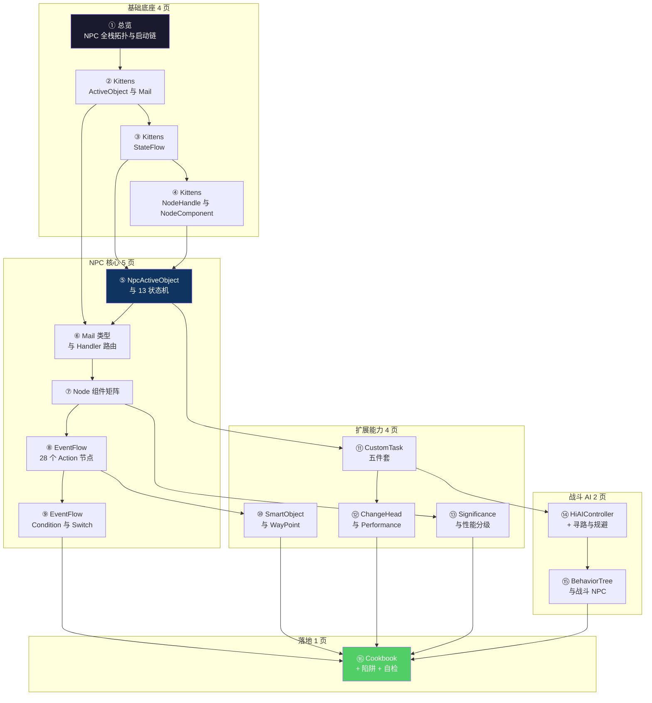

# HiGame NPC 子系统 — 总览

> 本 wiki 为 **AI 编程助手**(Claude / CodeBuddy / Cursor)与新加入的客户端开发者准备,把 HiGame 项目(UE5.5.4 + UnLua + DDS 架构)的 **NPC 子系统**全部技术细节压缩成 16 页有图、有代码、可执行的指南。读者读完后,应当能在没有人指导的情况下产出一个符合项目规范的新 NPC(状态 / 组件 / EventFlow Action / BehaviorTree Task)。
>
> **研究方法**:本项目以**本地代码考古**替代 km-websearch 的 web fetch,信息来源为 P4 工作区的项目代码与 C++ 头文件,所有 API 名/字段名/路径均经实际代码验证。
>
> **范围**:NPC 子系统覆盖 4 层 ─ C++ 薄壳 (`Source/HiGame/Public/{Npc,HiAI,Component,BT}`) → Kittens Lua 框架 (`kittens/`) → NPC 业务核心 (`Content/Script/npc/`) → Actor 蓝图绑定 (`Content/Script/actors/common/{NPC.lua,components/npc/}`)。包含战斗 AI(BehaviorTree + HiAIController),不含玩家侧 ability AI / 车辆 AI。

## 知识地图

写一个新 NPC 时,推荐顺序:**① → ⑤ → ⑦ → ⑧ → ⑪ → ⑯**。
排错或优化时:⑯ → ⑥ → ⑬ → ⑫ → ⑭。

## 项目最关键的几条事实(预告 — 详见各页)

1. **NPC 主类是 Lua 驱动的**:`BPA_NPCBase_C` 蓝图通过 UnLua 绑到 `actors/common/NPC.lua`,本身只是壳,所有逻辑在 ActiveObject + 双端状态机里。
2. **每个 NPC 在服务器有 1 个 ActiveObject**(`NpcActiveObject`),客户端也有 1 个独立状态机,**双端通过 Mail 通信,不直接同步**。
3. **状态机是一棵树,13 个状态**:root → normal/stealth/move/teleport/paopao/destroy/interact(→dialogue)/performance(→dialogue_group/performance_changehead→change_head_move/charm/float)。
4. **NodeHandle + NodeComponent 是核心 IoC 容器**:15+ 组件挂在 NPC 的 NodeHandle 上,通过 `NodeCompBindingKey` 字符串解耦查找。**Lua NodeComponent ≠ UE Component**,后者是 C++ 层的。
5. **EventFlow 是给策划用的"行为脚本 DSL"**:28 个 Action 节点 + 2 个 Switch 节点,通过 DataTable 配置成图,运行时用 Lua 协程驱动。这是剧情/对话/表演的真正引擎。
6. **战斗 NPC 走 BehaviorTree,剧情 NPC 走 ActiveObject + StateFlow**——两条线;但寻路底层(HiPathFollowingComponent + DetourCrowd + AvoidanceManager)被两条线共用。
7. **Mail 60+ 种类型**:动画/对话/表演/移动/淡出/任务/调试 7 大簇,Stateful handler 留在状态里,Stateless handler 进 `state_mail_handlers` 共享仓库。
8. **`condition_agent/` 和 `puppet/` 三层目录是空的**——规划占位,未实施。
9. **Significance 三级分级**:`node_handle/movement/skeletal × low/middle/high`,远距离自动停跑组件;HUD 6 类(name/happiness/bubble/track_icon/...)。
10. **ChangeHead 表演有优先级仲裁**:`Direct(技能)` 高优先级可打断,`Environment(机关)` 低优先级不接受打断;免疫由 Tag 控制(`changehead.immunity.{direct,environment,all}`)。

## 页面目录

### 基础底座
- [1. 总览 — NPC 全栈拓扑与启动链](wiki/1.%20总览%20—%20NPC%20全栈拓扑与启动链.md) — 4 层架构图、启动链、关键事实清单、术语速记
- [2. Kittens — ActiveObject 与 Mail](wiki/2.%20Kittens%20—%20ActiveObject%20与%20Mail.md) — ActiveObject 类层次、Mail 三种语义、Switcher、Stash、ProxyRef
- [3. Kittens — StateFlow](wiki/3.%20Kittens%20—%20StateFlow.md) — StateFlow + StateFlowNode、Transition/Trigger 模型、is_selector/is_slot
- [4. Kittens — NodeHandle 与 NodeComponent](wiki/4.%20Kittens%20—%20NodeHandle%20与%20NodeComponent.md) — IoC 容器、TickGroup、与 UE Component 区别

### NPC 核心
- [5. NpcActiveObject 与 13 状态机](wiki/5.%20NpcActiveObject%20与%2013%20状态机.md) — 初始化序列、状态树、状态进入条件、客户端镜像
- [6. Mail 类型与 Handler 路由](wiki/6.%20Mail%20类型与%20Handler%20路由.md) — 60+ Enum_Mail_Type、Stateful vs Stateless、共享仓库
- [7. Node 组件矩阵](wiki/7.%20Node%20组件矩阵.md) — 15 个 NodeComponent 三栏对照、NodeCompBindingKey 总表
- [8. EventFlow — 28 个 Action 节点](wiki/8.%20EventFlow%20—%2028%20个%20Action%20节点.md) — EventFlow 概念、28+2 节点全表、Mixin 上下文、DataTable 模板
- [9. EventFlow Condition 与 Switch](wiki/9.%20EventFlow%20Condition%20与%20Switch.md) — 注册中心、2 个内置 EFCond 案例

### 扩展能力
- [10. SmartObject 与 WayPoint](wiki/10.%20SmartObject%20与%20WayPoint.md) — Free/Claimed/Occupied 三态、占用握手协议
- [11. CustomTask 五件套](wiki/11.%20CustomTask%20五件套.md) — BehaviorTree/ChaseGame/Escort/Klutz/Tracking
- [12. ChangeHead 与 Performance 表演栈](wiki/12.%20ChangeHead%20与%20Performance%20表演栈.md) — 四联状态、优先级仲裁、Immunity Tag
- [13. Significance 与性能分级](wiki/13.%20Significance%20与性能分级.md) — 距离表、HUD 6 类、Hide_Reason 8 种

### 战斗 AI
- [14. HiAIController + 寻路与规避](wiki/14.%20HiAIController%20+%20寻路与规避.md) — Controller 类层次、PathFollowing 状态机、DetourCrowd
- [15. BehaviorTree 与战斗 NPC](wiki/15.%20BehaviorTree%20与战斗%20NPC.md) — BT Task/Decorator 模板、BossPunk vs DonNav

### 落地
- [16. Cookbook + 陷阱 + 自检清单](wiki/16.%20Cookbook%20+%20陷阱%20+%20自检清单.md) — 4 类完整流程、12 类陷阱、13 项自检

## 关键问题覆盖范围

| 关键问题 | 由以下页面解答 |
|----------|---------------|
| Q1 — NPC 是什么?Lua 类与 C++ 类的关系? | [1. 总览](wiki/1.%20总览%20—%20NPC%20全栈拓扑与启动链.md) |
| Q2 — NPC 启动链(BeginPlay → ActiveObject → StateFlow)? | [1. 总览](wiki/1.%20总览%20—%20NPC%20全栈拓扑与启动链.md) + [5. NpcActiveObject 与 13 状态机](wiki/5.%20NpcActiveObject%20与%2013%20状态机.md) |
| Q3 — Kittens ActiveObject + Mail 怎么工作? | [2. Kittens — ActiveObject 与 Mail](wiki/2.%20Kittens%20—%20ActiveObject%20与%20Mail.md) |
| Q4 — Kittens StateFlow 层级状态机怎么写? | [3. Kittens — StateFlow](wiki/3.%20Kittens%20—%20StateFlow.md) |
| Q5 — NodeHandle / NodeComponent 与 UE Component 的区别? | [4. Kittens — NodeHandle 与 NodeComponent](wiki/4.%20Kittens%20—%20NodeHandle%20与%20NodeComponent.md) |
| Q6 — NPC 13 个状态分别管什么? | [5. NpcActiveObject 与 13 状态机](wiki/5.%20NpcActiveObject%20与%2013%20状态机.md) |
| Q7 — 60+ Mail 类型有哪些?谁该处理什么? | [6. Mail 类型与 Handler 路由](wiki/6.%20Mail%20类型与%20Handler%20路由.md) |
| Q8 — 15 个 Node 组件各自干什么?双端怎么对应? | [7. Node 组件矩阵](wiki/7.%20Node%20组件矩阵.md) |
| Q9 — 策划怎么用 EventFlow 配剧情/对话? | [8. EventFlow — 28 个 Action 节点](wiki/8.%20EventFlow%20—%2028%20个%20Action%20节点.md) + [9. EventFlow Condition 与 Switch](wiki/9.%20EventFlow%20Condition%20与%20Switch.md) |
| Q10 — SmartObject/WayPoint 怎么让 NPC 占据点位? | [10. SmartObject 与 WayPoint](wiki/10.%20SmartObject%20与%20WayPoint.md) |
| Q11 — Tracking/Escort/Klutz 这些任务怎么挂? | [11. CustomTask 五件套](wiki/11.%20CustomTask%20五件套.md) |
| Q12 — ChangeHead/Charm/Float 怎么联动?优先级? | [12. ChangeHead 与 Performance 表演栈](wiki/12.%20ChangeHead%20与%20Performance%20表演栈.md) |
| Q13 — Significance 怎么省性能,远距离时哪些组件停跑? | [13. Significance 与性能分级](wiki/13.%20Significance%20与性能分级.md) |
| Q14 — 战斗 NPC 走 BT,寻路是 DetourCrowd 怎么集成? | [14. HiAIController + 寻路与规避](wiki/14.%20HiAIController%20+%20寻路与规避.md) + [15. BehaviorTree 与战斗 NPC](wiki/15.%20BehaviorTree%20与战斗%20NPC.md) |
| Q15 — 怎么写一个新 NPC?新 EventFlow Action?新状态? | [16. Cookbook + 陷阱 + 自检清单](wiki/16.%20Cookbook%20+%20陷阱%20+%20自检清单.md) |
| Q16 — 常见陷阱(双端不同步、热更泄漏、组件 nil...)? | [16. Cookbook + 陷阱 + 自检清单](wiki/16.%20Cookbook%20+%20陷阱%20+%20自检清单.md) |

## 数据来源(本地 raw 笔记)

- [[npc-01-topology-and-bootstrap]] — NPC 全栈拓扑 + 启动链
- [[npc-02-kittens-active-object]] — Kittens ActiveObject + Mail
- [[npc-03-kittens-state-flow]] — Kittens StateFlow
- [[npc-04-kittens-node-handle]] — Kittens NodeHandle + EventFlow + EventSystem
- [[npc-05-states-and-stateflow]] — 13 个 server/client 状态实现
- [[npc-06-node-components]] — 15 个 NodeComponent
- [[npc-07-event-flow-actions]] — 28 个 EF Action + 2 个 Switch
- [[npc-08-event-flow-conditions]] — EF Condition + 注册中心
- [[npc-09-smart-objects-waypoints]] — SmartObject + WayPoint 三态
- [[npc-10-custom-tasks]] — CustomTask 5 件套
- [[npc-11-actor-blueprint-components]] — Actor 级 9 个组件 + ChangeHead
- [[npc-12-hi-ai-controller]] — HiAI C++ 5 个文件
- [[npc-13-cpp-npc-components]] — C++ NPC 相关 Component 7 个
- [[npc-14-behavior-tree]] — BT Task/Decorator/Service + BossPunk + DonNav
- [[npc-15-const-enums-cross-reference]] — npc_const.lua 全表枚举

## 质量说明

- **总页面数**:16
- **总参考来源数**:15(全部为本地代码考古产物)
- **覆盖率**:16 / 16 关键问题(Phase G1 完成后确认)
- **空白领域**:`condition_agent/`、`puppet/` 三层目录在 P4 中为空,作"规划占位"标注;`.uasset` 二进制内容仅做行名级语义注解
- **最后更新**:2026-05-11
