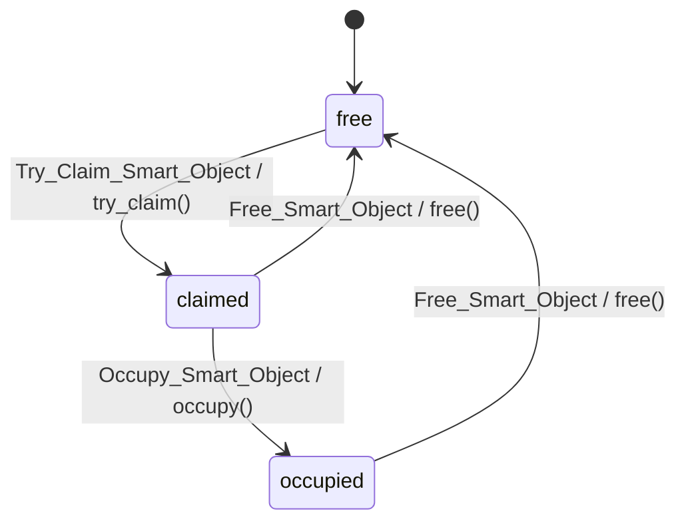

# npc-09 — SmartObject 与 WayPoint

## Sources

`smart_objects/` 子树共 10 文件:`common/{smart_object_const, smart_object_utils}`、
`smart_object_warpper/{smart_object_interface, server_smart_object_po, smart_object_way_point}`、
`way_point/{way_point_active_object, wp_state_base, wp_state_free, wp_state_claimed, wp_state_occupied}`。

## 1. SmartObject 概念

SmartObject 是 NPC 与场景"兴趣点"间的统一抽象。`SmartObjectInterface` 定义
`claim / occupy / claim_and_occupy / free` 四个异步动作，具体实现（`WayPoint`、
`POSmartObject`）通过 `SmartObjectInterface.register(_type_key, _impl_class)` 登记到工厂
表，`SmartObjectInterface.create(_smart_object_id, _type_key)` 产出实例。WayPoint 是
SmartObject 的一种实现，用途是**占据点位、座位、互动锚点**——NPC 通过握手协议
(`claim → occupy → free`) 独占一个 WayPoint Actor，避免多个 NPC 抢占同一点位。

## 2. SmartObjectConst (枚举/常量)

`smart_object_const.lua` 定义四张表:

```lua
Enum_Mail_Type = { Try_Claim_Smart_Object=1, Occupy_Smart_Object=2, Free_Smart_Object=3 }

Enum_Error = {
    Claim_Failed, Occupy_Without_Claimed, Free_Failed,
    Not_Implemented_Claim, Not_Implemented_Occupy, Not_Implemented_Free,  -- 均为 Error:new(...)
}

Enum_State = { Free='free', Claimed='claimed', Occupied='occupied', Invalid='invalid' }

SmartObjectWarpperType = { POSmartObject='POSmartObject', WayPoint='WayPoint' }
```

注意:`Enum_State` 含 4 值,`Invalid` 是 `SmartObjectUtils.get_state_flow()` 的第四个根
子节点;运行时 `WayPointActiveObject` 仅在 `WayPointStateClassMapping` 挂了三态实现,
`invalid` 在 mapping 中**没有对应类**。

## 3. smart_object_interface 接口

`SmartObjectInterface` 是 Kittens class,签名(verbatim):

```lua
function SmartObjectInterface:initialize(_smart_object_id)
function SmartObjectInterface:get_smart_object_id()
function SmartObjectInterface:claim(_npc_actor, _active_object_id)            ---@return Error|Promise
function SmartObjectInterface:occupy(_npc_actor, _active_object_id)           ---@return Error|Promise
function SmartObjectInterface:claim_and_occupy(_npc_actor, _active_object_id) ---@return Error|Promise
function SmartObjectInterface:free(_npc_actor, _active_object_id)             ---@return Error|Promise
function SmartObjectInterface:get_target_transform(data)
function SmartObjectInterface:get_target_yaw(data)
function SmartObjectInterface.register(_type_key, _impl_class)
function SmartObjectInterface.create(_smart_object_id, _type_key)
```

抽象方法默认 `reject(Not_Implemented_*)`;`claim_and_occupy` 默认实现是顺序调
`claim` 再 `occupy`;`create` 在未指定 `_type_key` 时 fallback 到 `POSmartObject`。
实现该接口的子类:`ServerSmartObjectPO`(键 `POSmartObject`)、`SmartObjectWayPoint`(键 `WayPoint`)。

## 4. server_smart_object_po (Persistent Object)

`ServerSmartObjectPO` 面向**持久化客户端 AO**:claim/occupy/free 全部通过 `send_mail`
投递到客户端 PO ActiveObject。`get_target_object_ref(_npc_actor)` 逻辑:

1. 先 `ao_mgr:get_active_object_ref(ao_id)` 找本机已有 ref
2. 否则 `UEMailLocation:new(false, player_gid, ao_id, ao_id)` + `ao_mgr:create_remote_active_object_ref`

实际发出的邮件枚举来自 `AttractorConst.Enum_Mail_Type`(在 `actors.common.changehead.npc_attractor_const`):

| 方法 | 邮件类型 |
|---|---|
| `claim` | `POClaim` |
| `occupy` | `POOccupy` |
| `claim_and_occupy` | `POClaimAndOccupy` |
| `free` | `POFree` |

模式 `Enum_ReceiveMailMode.request_and_response`,返回 `mail:get_receive_promise()`。
**重要区分**:PO 这条线用 `AttractorConst` 的 PO* 邮件,**不是** `SmartObjectConst.Enum_Mail_Type`
(后者只在 WayPoint AO 内部三态机里用)。`get_target_transform` 走
`NpcAttractorModule.DeserializeTransformLite`,`get_target_yaw` 取 transform.Rotation.Yaw。

## 5. WayPointActiveObject

`WayPointActiveObject` 与 WayPoint Actor **1:1**(类比 `NpcActiveObject` 之于 `NpcActor`),
继承 `ActiveObject` 并 `:include(StateFlowContext)`。构造:

```lua
self.__owner_actor = _context  -- way point actor
self.__state_machine = SmartObjectUtils.get_state_flow():create_instance(self, {})
self.__state_machine:start()
```

实现 `StateFlowContext` 协议:`get_context_object()` 返 way point actor;
`get_state_class_and_args(_state_id)` 返 `WayPointStateClassMapping[_state_id], {active_object=self}`。
`WayPointStateClassMapping = { free=wp_state_free, claimed=wp_state_claimed, occupied=wp_state_occupied }`。

底层 StateFlow 由 `SmartObjectUtils.get_state_flow()` 构建:root 选择器下挂 4 个叶子
(`free / claimed / occupied / invalid`),每叶子 `state_tag = 'smart_object.state.<name>'`,
StateFlow **单例**缓存于 `SmartObjectStateFlow`。

## 6. WayPoint 三态机详解



### 共享基类 WayPointStateBase

持有 `__mail_switcher / __prev_mail_switcher`、`__active_object`、`__owner_actor`。
- `on_enter`:记录 `__prev_mail_switcher = get_curr_mail_switcher()`,
  `become(__mail_switcher, true)`,然后 `unstash_all()`
- `on_exit(_reason)`:把 `__prev_mail_switcher` `become` 回去并 `unstash_all()`
- `transition_to_state(_state_id, _reason)`:转发到 StateFlow exec context

子类只在 `initialize` 里 `MailSwitcher:case(mail_type, handler)` 注册各自允许的邮件,
其它 mail 走 `__default_mail_handler`。

### WP_State_Free

- `on_enter / on_exit`:仅打 `Logger.verbose('godotliu', ...)`
- 接受邮件:`Try_Claim_Smart_Object`
- `__handler_try_claim_smart_object`:取 `payload.request_active_object_id`;
  调 `owner_actor:try_claim(...)`;失败返 `Claim_Failed`,成功 `transition_to_state(Claimed)` 返 nil

### WP_State_Claimed (中间态:已申请未到达)

接受两类邮件,均从 payload 读 `request_active_object_id`:

| Mail | Handler 调用 | 成功转移 | 失败错误 |
|---|---|---|---|
| `Free_Smart_Object` | `owner_actor:free(...)` | → `Free` | `Free_Failed` |
| `Occupy_Smart_Object` | `owner_actor:occupy(...)` | → `Occupied` | `Occupy_Without_Claimed` |

### WP_State_Occupied

只接受 `Free_Smart_Object`。`__handler_free_smart_object`:调 `owner_actor:free()`;
失败返 `Free_Failed`,成功 `transition_to_state(Free)`。

## 7. 占用握手协议 (sequence)

NPC 侧从 `EF_Action_OccupySmartObject`(参见 npc-07)发起,把 WayPoint AO 推过
`Free → Claimed → Occupied → Free` 一圈。典型时序:

1. NPC EventFlow 节点取 `SmartObjectId / SmartObjectType`(参见 npc-15
   `NpcEventFlowStateKey`),`SmartObjectInterface.create(...)` 拿 wrapper
2. WayPoint 类型:NPC 向 WayPoint AO 发 `Try_Claim_Smart_Object` → AO 在 `Free` →
   `owner_actor:try_claim` 成功 → 转 `Claimed`
3. NPC 收到 claim 的 Promise fulfill,移动到 WayPoint Transform
4. NPC 到达后发 `Occupy_Smart_Object` → AO 在 `Claimed` → `owner_actor:occupy` 成功 → 转 `Occupied`
5. NPC 在 occupy 期间播放交互动作(npc-05 状态机维持 occupy 行为)
6. 离开时发 `Free_Smart_Object` → AO 在 `Claimed` 或 `Occupied` → `owner_actor:free` 成功 → 回 `Free`

上述枚举来自 `SmartObjectConst.Enum_Mail_Type`,是 **WayPoint AO 内部**握手协议。
若走 PO 通道(`ServerSmartObjectPO`),邮件枚举换为 `AttractorConst.POClaim/POOccupy/POClaimAndOccupy/POFree`,
由对端 PO ActiveObject 自行解释(不在本笔记 sources 内)。

## 8. smart_object_way_point.lua (warpper)

`SmartObjectWayPoint` 是 `SmartObjectInterface` 的 WayPoint 端实现,**位于"NPC 调用方"**
(与 `WayPointActiveObject` 位于"被占用方"相区分)。当前文件中绝大多数业务路径被注释,
留"立即 fulfill"占位:

- `claim`:`NpcUtils.get_way_point_actor` 拿 WayPoint Actor,有效则 `fulfill(FulfilledResult:new(transform))`,
  否则 `reject(Claim_Failed)`。注释掉的真实路径是 `way_point_actor:async_try_claim(_active_object_id)`
- `occupy` / `claim_and_occupy` / `free`:直接 `promise:fulfill()` 返回
- 注释路径分别是 `async_occupy`、先 await `async_try_claim` 再 `async_occupy`、`async_free`;
  free 失败仅 `Logger.warn` 不透传错误(`Promise.resolved(nil)`)

模块加载末尾自动注册:`SmartObjectInterface.register(SmartObjectWarpperType.WayPoint, SmartObjectWayPoint)`。

| 文件 | 角色 | 运行位置 |
|---|---|---|
| `WayPointActiveObject` | 被占用 WayPoint Actor 上的 AO + 三态机 | WayPoint 所在 AO |
| `SmartObjectWayPoint` | NPC 端调用 SmartObjectInterface 时的 wrapper / 调用代理 | 调用方 NPC AO 上下文 |

## 9. 跨页关联

- **npc-07**:`EF_Action_OccupySmartObject` 是触发本握手协议的 EventFlow Action 节点
- **npc-05**:NPC 自身状态机在 occupy 期间维持的行为(动作播放、面向 yaw 等)
- **npc-15**:`NpcEventFlowStateKey.SmartObjectId / SmartObjectType` 是 NPC EventFlow 黑板
  存放 SmartObject 标识与类型的 Key,`SmartObjectInterface.create` 的入参来源于此
- **npc-04**:`MailSwitcher / become / unstash_all` 由 `Kittens.ActiveObject` 提供
- **npc-03**:`StateFlow / StateBase / StateFlowContext / transition_to_state` 由 Kittens StateFlow 支撑
