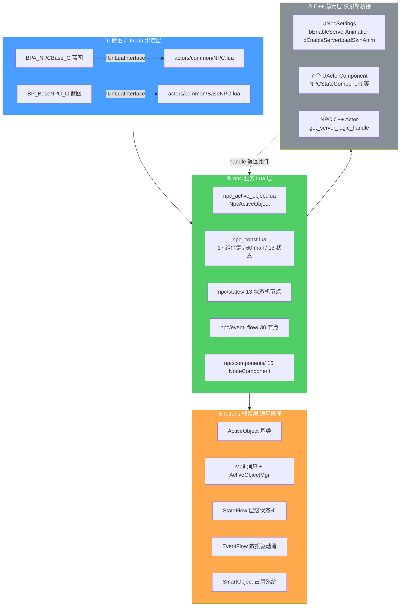
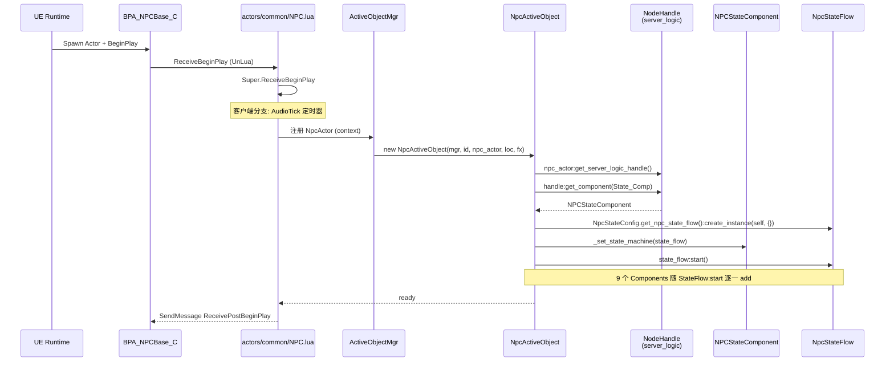
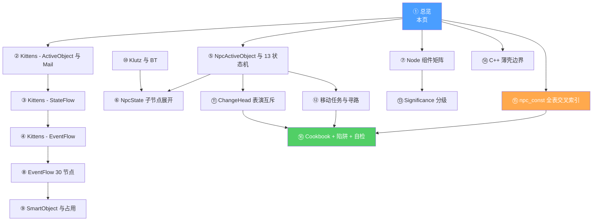

# 1. 总览 — NPC 全栈拓扑与启动链

> HiGame 的 NPC 子系统是一套 **C++ 薄壳 + Lua 重逻辑** 的 4 层架构。C++ 侧只暴露 `UNpcSettings` 两个全局开关与 7 个 `UActorComponent`；所有行为、状态机、EventFlow、Mail 消息、Significance LOD 都落在 Lua 的 `npc/` 业务目录，并以 `Kittens` 框架层（`ActiveObject` / `StateFlow` / `EventFlow` / `Mail`）为底座。NPC 的入口是 `BPA_NPCBase_C` 蓝图,通过 UnLua 绑定 `actors/common/NPC.lua`,在 `ReceiveBeginPlay` 中由服务器拉起 `NpcActiveObject`,建立与 `NpcActor` 的 1:1 映射,并同步启动 `NpcStateFlow`[^npc-01]。

## 为什么有这一页

NPC 是 HiGame 单人大世界的主要叙事/交互载体。它横跨蓝图、UnLua、Kittens 框架、C++ DeveloperSettings 四个层面,任何一页单独读都看不懂全貌。本页先把 **物理分层**、**启动链**、**术语关系** 钉死,后续每一页都是这张大图上的一个切片:第 2 页讲 `ActiveObject` 基类,第 5 页拆 13 个状态,第 7 页拆 30 个 EventFlow 节点,第 14 页映射 C++ 薄壳。Newcomer 读完这一页就能回答:"一个 NPC 在服务器上到底是什么?它和客户端那个 NPC 是什么关系?"

## NPC 全栈 4 层架构



关键边界:`NPC.lua` 是蓝图粘合层(UnLua hook 只做转发),真正业务在 `npc/` 目录;`NpcActiveObject` **只运行在服务器侧**(它只取 `get_server_logic_handle`),客户端对称结构由 `NpcClientStateRoot` 驱动[^npc-01]。

## NPC 启动链 (sequence)



停止时:`_on_npc_actor_end_play()` 会调用 `__state_flow:stop(Enum_State_Flow_Stop_Reason.Actor_EndPlay)` 并清空 `__event_flow_context`[^npc-01]。

## 10 条关键事实

1. **NPC 子系统是 4 层** ①蓝图/UnLua(`NPC.lua` + `BPA_NPCBase_C`) → ②业务 Lua(`npc/` 目录) → ③Kittens 框架(`ActiveObject/StateFlow/EventFlow/Mail`) → ④C++ 薄壳(`UNpcSettings` + 7 个 `UActorComponent`)[^npc-01]。
2. **`NpcActiveObject` 与 `NpcActor` 严格 1:1 映射**,文件首行注释显式声明 `NpcActiveObject is 1:1 with NpcActor`,在 `initialize(_, _, _context, ...)` 中 `self.__npc_actor = _context`[^npc-01]。
3. **`NpcActiveObject` 只在服务器侧运行**,只调用 `get_server_logic_handle()`,完全不持有客户端 handle;客户端逻辑由 `NpcClientStateRoot` 镜像驱动[^npc-01]。
4. **StateFlow 在 `initialize` 里同步创建并启动**,顺序严格:`create_instance → _set_state_machine → state_flow:start`,一旦启动 9 个 Components 就已挂载,顺序不可乱[^npc-01]。
5. **`NpcActiveObject` 混入 `StateFlowContext`**:通过 `include(StateFlowContext)` 注入 `impl_add_tag/remove_tag/has_tag/has_any_tags/has_all_tags`,全部代理到 UE 侧 `NPCStateComponent` 的 `add_state_tag/remove_state_tag/has_state_tag`[^npc-01]。
6. **`NodeCompBindingKey` 共 17 键**,统一用字符串作为 handle 查组件的 key(如 `'state_component'`、`'anim_ctrl_comp'`),是 Lua 与 C++ Component 的唯一约定[^npc-01][^npc-15]。
7. **反向绑定 `NodeHandleBindingKey.npc_active_object`** 让外部系统能通过 handle 反查 active object,构成 Lua/C++ 双向握手[^npc-01]。
8. **两个蓝图入口完全不对等**:`NPC.lua → BPA_NPCBase_C`(功能完备,带 Dialogue/Billboard/Visibility 组件),`BaseNPC.lua → BP_BaseNPC_C`(极简骨架,仅 BeginPlay 转发)[^npc-01]。
9. **`UNpcSettings` 只有 2 个开关**:`bEnableServerAnimation`、`bEnableServerLoadSkinAnim`,都存 `DefaultGame.ini`,决定服务器侧是否播放 NPC 动画及加载皮肤动画资源[^npc-01]。
10. **`npc_const.lua` 是全表枢纽** 共 11 个 section、545 行,同时定义 13 状态、60+ Mail 类型、30 EventFlow 节点类名、17 组件键、3 级 Significance LOD,是理解 NPC 所有模块的"字典根"[^npc-15]。

## 术语速记表

| 术语 | 英文 | 所在文件 / 层 | 一句话定义 |
|---|---|---|---|
| NPC Actor | `NpcActor` | C++ 引擎层 | UE 侧 NPC Actor 类,蓝图为 `BPA_NPCBase_C`,暴露 `get_server_logic_handle()` |
| NPC ActiveObject | `NpcActiveObject` | `npc/npc_active_object.lua` | 与 `NpcActor` 1:1 的服务器侧逻辑容器,继承 `Kittens.ActiveObject`,mixin `StateFlowContext` |
| NodeHandle | `ServerLogicNodeHandle` / `ClientLogicNodeHandle` | C++ + `handle:get_component` | 组件查询句柄,由 `NpcActor` 生产,17 种组件通过 `NodeCompBindingKey` 字符串 key 拉取 |
| NodeComponent | `anim_ctrl_comp` 等 | `npc/components/` + C++ | 挂到 handle 上的 15 个业务组件(动画 / 交互 / 可见性 / 淡入淡出 / 对话 / 传送 …) |
| ActiveObject | `Kittens.ActiveObject` | Kittens 框架 | 通用 "有生命周期的业务对象" 基类,`NpcActiveObject` 的父类 |
| Mail | `Enum_Mail_Type` 60+ 项 | `npc_const.lua` + Kittens | ActiveObject 之间异步消息信件(播动画 / 传送 / 对话 / 移动 …) |
| StateFlow | `NpcStateFlow` / `NpcStateRoot` | `npc/states/` + Kittens | 层级状态机,`NpcStateConfig.get_npc_state_flow():create_instance(self, {})` 生成实例 |
| EventFlow | `EF_Action_*` / `EF_Switch_*` | `npc/event_flow/` | 数据驱动的 DAG 流程,30 个节点类名,用于入场/离场表演、对话、移动等"剧本" |
| SmartObject | `EF_Action_OccupySmartObject` | `npc/event_flow/` + UE5 SO | 场景中可被占用的交互点(座椅/工位等),NPC 通过 EventFlow 申请与释放 |
| StateFlowContext | `Kittens.StateFlow.StateFlowContext` | Kittens 框架 | `NpcActiveObject` include 的 tag 接口,代理到 `NPCStateComponent` |

## C++ 薄壳边界

C++ 侧做得极少,只暴露 "配置 + Actor Component" 两类:

```cpp
// HiGame/Public/Npc/NpcSettings.h
UCLASS(config = Game, defaultconfig, meta = (DisplayName = "Npc"))
class HIGAME_API UNpcSettings : public UDeveloperSettings
{
    GENERATED_UCLASS_BODY()
public:
    static bool EnableServerAnimation();
    static bool EnableServerLoadSkinAnim();

    UPROPERTY(Config, EditAnywhere, Category = Npc)
    uint8 bEnableServerAnimation     : 1;
    UPROPERTY(Config, EditAnywhere, Category = Npc)
    uint8 bEnableServerLoadSkinAnim  : 1;
};
```

| 层 | 产物 | 消费者 |
|---|---|---|
| `UNpcSettings` (2 开关) | `DefaultGame.ini` | 服务器动画组件、皮肤动画加载流程 |
| 7 个 `UActorComponent` | `NPCStateComponent` / `NPCInteractComponent` / `NpcWidgetComponent` / `VisibilityComponent` / `FadeComponent` / `TeleportComponent` / `AnimCtrlComponent`… | `NpcActiveObject` 通过 handle 查询 |

详细消费点见 [14. C++ 薄壳边界](14.%20C%2B%2B%20薄壳边界.md);组件矩阵见 [7. Node 组件矩阵](7.%20Node%20组件矩阵.md)。

## 知识地图



一句话路由:
- **想造一个新 NPC**  →  P1 → P7 → P5 → P8 → P16
- **想改状态机行为**  →  P1 → P3 → P5 → P6
- **想写一段入场表演**  →  P1 → P4 → P8 → P9
- **想理解 C++ / Lua 边界**  →  P1 → P14 → P7 → P15
- **踩坑/查枚举**  →  P15 → P16

## 跨页链接

- →  [2. Kittens - ActiveObject 与 Mail](2.%20Kittens%20—%20ActiveObject%20与%20Mail.md):`NpcActiveObject` 的 `Kittens.ActiveObject` 基类定义与 60+ Mail 类型的传递机制
- →  [3. Kittens - StateFlow](3.%20Kittens%20—%20StateFlow.md):`StateFlowContext` mixin、`create_instance`、`start/stop`、`Enum_State_Flow_Stop_Reason`
- →  [5. NpcActiveObject 与 13 状态机](5.%20NpcActiveObject%20与%2013%20状态机.md):`NpcStateConfig.get_npc_state_flow()` 的状态树完整展开
- →  [7. Node 组件矩阵](7.%20Node%20组件矩阵.md):17 个 `NodeCompBindingKey` 与其 C++ 对应类
- →  [14. C++ 薄壳边界](14.%20C%2B%2B%20薄壳边界.md):`UNpcSettings` 配置消费点与 7 个 `UActorComponent` 详解
- →  [15. npc_const 全表交叉索引](15.%20npc_const%20全表交叉索引.md):545 行常量文件的 11 段分组、反查索引
- →  [16. Cookbook + 陷阱 + 自检](16.%20Cookbook%20+%20陷阱%20+%20自检清单.md):从零实现一个 NPC 的实操流程

[^npc-01]: `raw/npc-01-topology-and-bootstrap.md` — 源码锚:`Content/Script/actors/common/NPC.lua`、`Content/Script/npc/npc_active_object.lua`、`Content/Script/npc/npc_const.lua`、`Source/HiGame/Public/Npc/NpcSettings.h`

[^npc-15]: `raw/npc-15-const-enums-cross-reference.md` — 源码锚:`Content/Script/npc/npc_const.lua`(545 行,11 个 section)
