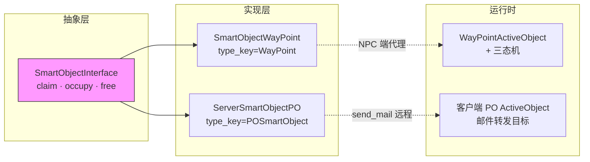
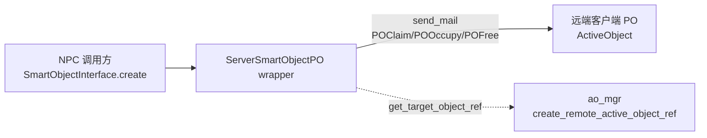
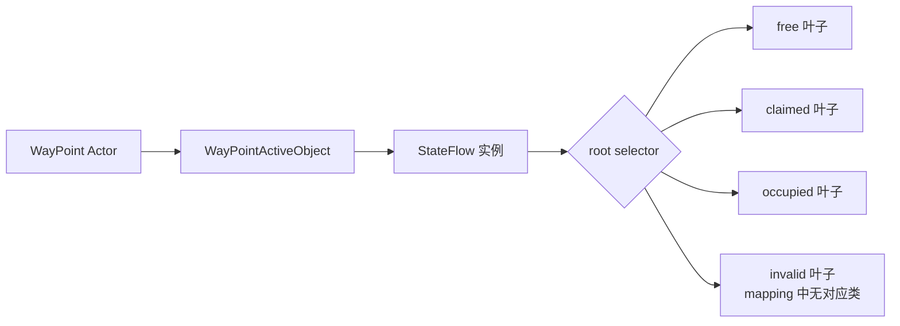
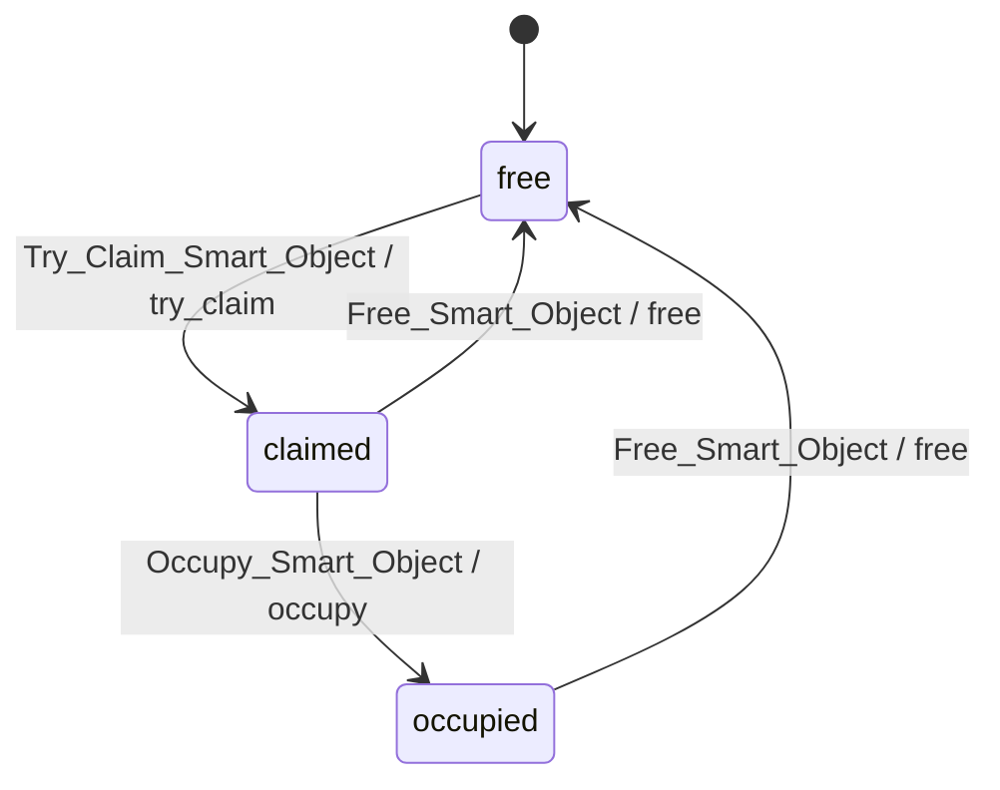
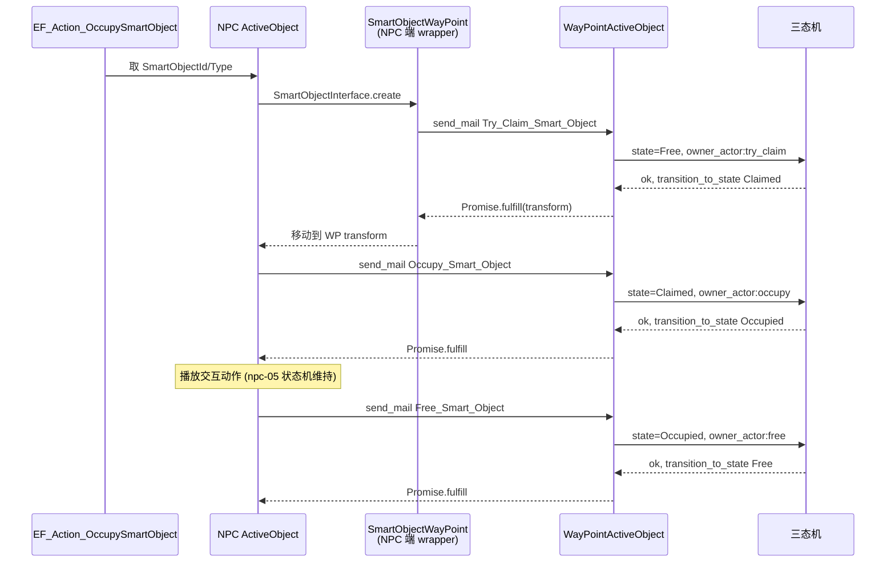

# 10. SmartObject 与 WayPoint

> SmartObject 是 NPC 与场景**兴趣点**(座位/锚点/互动桩)之间的统一抽象 —— 一个
> `SmartObjectInterface` 暴露 `claim / occupy / free` 三步握手，具体实现里 **WayPoint**
> 是最常用的一种。本页解剖 WayPoint 的三态机、`smart_object_interface` API、PO 与
> WP 两条邮件通道的差异，以及 EventFlow 节点 `EF_Action_OccupySmartObject` 是如何把
> 一个 NPC 推过 `Free → Claimed → Occupied → Free` 一圈的[^npc-09]。

---

## 1. SmartObject 概念

`SmartObjectInterface` 是 Kittens class 风格的抽象接口，由两类实现注册到工厂表：
**WayPoint**(被占据的点位 Actor) 与 **POSmartObject**(持久化客户端 PO 桥接)。
NPC 调用方拿到一个 wrapper 实例，把 `claim → occupy → free` 三个 Promise-返回的
异步动作串成握手，独占该资源直到主动 free。



**WayPoint 的典型用途**：

- 椅子/座位 — NPC 走到点位后播放 sit 动画
- 排队点 — 多 NPC 抢占多个 WayPoint，避免堆叠
- 巡逻锚点 — NPC 在多个 WayPoint 间轮换
- 交互桩 — 与 `EF_Action_OccupySmartObject` 配合，按 yaw 朝向锚点

---

## 2. SmartObjectConst 枚举

`smart_object_const.lua` 定义四张表 —— 务必注意 `Enum_Mail_Type` 仅在
**WayPoint AO 内部**三态机里使用，PO 通道走的是 `AttractorConst.POClaim/...`。

```lua
-- 仅 WayPoint AO 三态机使用
Enum_Mail_Type = {
    Try_Claim_Smart_Object = 1,
    Occupy_Smart_Object    = 2,
    Free_Smart_Object      = 3,
}

-- 错误码 (均为 Error:new(...))
Enum_Error = {
    Claim_Failed,            Occupy_Without_Claimed, Free_Failed,
    Not_Implemented_Claim,   Not_Implemented_Occupy, Not_Implemented_Free,
}

-- 状态枚举: 注意 Invalid 在 mapping 中无对应类
Enum_State = {
    Free     = 'free',
    Claimed  = 'claimed',
    Occupied = 'occupied',
    Invalid  = 'invalid',
}

-- 工厂键
SmartObjectWarpperType = {
    POSmartObject = 'POSmartObject',
    WayPoint      = 'WayPoint',
}
```

`Enum_State` 含 4 值，但 `WayPointStateClassMapping` 只挂三态实现，
`invalid` 是 StateFlow 根选择器下的兜底叶子，运行时 mapping 中**没有对应类**。

---

## 3. smart_object_interface API

10 个方法，4 个核心异步动作 (返回 `Error|Promise`)，其余为 helper / 工厂：

```lua
function SmartObjectInterface:initialize(_smart_object_id)
function SmartObjectInterface:get_smart_object_id()
function SmartObjectInterface:claim(_npc_actor, _active_object_id)            ---@return Error|Promise
function SmartObjectInterface:occupy(_npc_actor, _active_object_id)           ---@return Error|Promise
function SmartObjectInterface:claim_and_occupy(_npc_actor, _active_object_id) ---@return Error|Promise
function SmartObjectInterface:free(_npc_actor, _active_object_id)             ---@return Error|Promise
function SmartObjectInterface:get_target_transform(data)
function SmartObjectInterface:get_target_yaw(data)
function SmartObjectInterface.register(_type_key, _impl_class)
function SmartObjectInterface.create(_smart_object_id, _type_key)
```

**默认行为**：

| 方法 | 默认实现 |
|---|---|
| `claim / occupy / free` | `reject(Not_Implemented_*)` (子类必须 override) |
| `claim_and_occupy` | 顺序 `claim` → `occupy` (子类可 override 优化为单 RPC) |
| `create` | 未指定 `_type_key` 时 fallback 到 `POSmartObject` |
| `register` | 子类模块加载尾自动调用，把自己挂到工厂表 |

---

## 4. server_smart_object_po (持久化对象)

`ServerSmartObjectPO` 面向**持久化客户端 AO**：claim/occupy/free 全部通过
`send_mail` 投递到客户端 PO ActiveObject。其拓扑与 WayPoint 完全不同：



**邮件枚举映射** (使用 `AttractorConst.Enum_Mail_Type` 而非 SmartObjectConst)：

| 方法 | 邮件类型 |
|---|---|
| `claim` | `POClaim` |
| `occupy` | `POOccupy` |
| `claim_and_occupy` | `POClaimAndOccupy` |
| `free` | `POFree` |

模式为 `Enum_ReceiveMailMode.request_and_response`，返回 `mail:get_receive_promise()`。
`get_target_object_ref(_npc_actor)` 先查本机 ref，否则 `UEMailLocation:new(false, player_gid, ao_id, ao_id)`
+ `create_remote_active_object_ref` 构造远端 ref。

---

## 5. WayPointActiveObject

`WayPointActiveObject` 与 WayPoint Actor **1 : 1**，类比 `NpcActiveObject` 之于
`NpcActor`，由 `ActiveObject + StateFlowContext` 拼装：



构造关键代码：

```lua
self.__owner_actor   = _context  -- way point actor
self.__state_machine = SmartObjectUtils.get_state_flow():create_instance(self, {})
self.__state_machine:start()

-- StateFlowContext 协议
function WayPointActiveObject:get_context_object() return self.__owner_actor end
function WayPointActiveObject:get_state_class_and_args(_state_id)
    return WayPointStateClassMapping[_state_id], { active_object = self }
end

WayPointStateClassMapping = {
    free     = wp_state_free,
    claimed  = wp_state_claimed,
    occupied = wp_state_occupied,
}
```

底层 StateFlow 由 `SmartObjectUtils.get_state_flow()` 构建，**StateFlow 单例**缓存
于 `SmartObjectStateFlow`，每叶子 `state_tag = 'smart_object.state.<name>'`。

---

## 6. WayPoint 三态机



三态共享基类 `WayPointStateBase`：

- `on_enter`：`__prev_mail_switcher = get_curr_mail_switcher()`，`become(__mail_switcher, true)`，`unstash_all()`
- `on_exit(_reason)`：`become(__prev_mail_switcher)` 恢复，`unstash_all()`
- `transition_to_state(_state_id, _reason)`：转发到 StateFlow exec context

子类只在 `initialize` 里 `MailSwitcher:case(mail_type, handler)` 注册各自允许的邮件，
其它 mail 走 `__default_mail_handler`(默认丢弃/警告)。

| 状态 | 接受 Mail | Handler 调用 | 成功转移 | 失败错误 |
|---|---|---|---|---|
| `Free` | `Try_Claim_Smart_Object` | `owner_actor:try_claim(aoid)` | → `Claimed` | `Claim_Failed` |
| `Claimed` | `Occupy_Smart_Object` | `owner_actor:occupy(aoid)` | → `Occupied` | `Occupy_Without_Claimed` |
| `Claimed` | `Free_Smart_Object` | `owner_actor:free(aoid)` | → `Free` | `Free_Failed` |
| `Occupied` | `Free_Smart_Object` | `owner_actor:free(aoid)` | → `Free` | `Free_Failed` |

`WP_State_Free` 的 `on_enter / on_exit` 仅打 `Logger.verbose('godotliu', ...)`，
不做实际工作；状态转移完全由邮件触发。

---

## 7. 占用握手协议 (sequence)

NPC 侧从 `EF_Action_OccupySmartObject` (参见 [8. EventFlow 节点](#9-跨页链接))
发起，把 WayPoint AO 推过一圈。下图展示**典型成功路径** (claim → 移动 → occupy → 离开 → free)：



枚举来自 `SmartObjectConst.Enum_Mail_Type` —— 只在 **WayPoint AO 内部**使用。
若走 PO 通道 (`ServerSmartObjectPO`)，邮件枚举换为
`AttractorConst.POClaim / POOccupy / POClaimAndOccupy / POFree`，
由对端 PO ActiveObject 自行解释。

---

## 8. smart_object_way_point.lua wrapper

`SmartObjectWayPoint` 是 `SmartObjectInterface` 的 WayPoint 端实现，**位于 NPC 调用方**
(与 `WayPointActiveObject` 位于被占用方相区分)。当前文件中**绝大多数业务路径被注释**，
留"立即 fulfill"占位，便于上层逻辑跑通：

```lua
-- 实际代码 (简化)
function SmartObjectWayPoint:claim(_npc_actor, _active_object_id)
    local way_point_actor = NpcUtils.get_way_point_actor(self:get_smart_object_id())
    if not way_point_actor then
        return Error.reject(Enum_Error.Claim_Failed)
    end
    -- 注释掉的真实路径: way_point_actor:async_try_claim(_active_object_id)
    return Promise.resolved(FulfilledResult:new(transform))
end
-- occupy / claim_and_occupy / free 直接 promise:fulfill()
-- 注释路径分别是 async_occupy / await async_try_claim 再 async_occupy / async_free

-- 模块加载尾自动注册
SmartObjectInterface.register(SmartObjectWarpperType.WayPoint, SmartObjectWayPoint)
```

**caller-side proxy vs AO-side 实现** 区别：

| 文件 | 角色 | 运行位置 | 关键 API |
|---|---|---|---|
| `SmartObjectWayPoint` | NPC 端 wrapper / 调用代理 | 调用方 NPC AO 上下文 | `claim/occupy/free` 返 Promise |
| `WayPointActiveObject` | WayPoint Actor 上的 AO + 三态机 | WayPoint 所在 AO | `try_claim/occupy/free` 内部方法 |

注意 `free` 失败仅 `Logger.warn` 不透传错误 (`Promise.resolved(nil)`)，
设计上"释放总是成功"——避免 NPC 因 free 失败卡死状态机。

---

## 9. 跨页链接

- → [8. EventFlow — 28 个 Action 节点](8.%20EventFlow%20—%2028%20个%20Action%20节点.md)：
  `EF_Action_OccupySmartObject` 是触发本页握手协议的入口节点；该节点从黑板取
  `SmartObjectId / SmartObjectType`，调 `SmartObjectInterface.create` 得 wrapper。
- → [11. CustomTask 五件套](11.%20CustomTask%20五件套.md)：`Move` 子目录中部分 CustomTask
  以 SmartObject 作为目标点位 (尤其对 WayPoint 类型直接读 `get_target_transform / get_target_yaw`)。
- → [5. NpcActiveObject 与 13 状态机](5.%20NpcActiveObject%20与%2013%20状态机.md)：
  NPC 在 occupy 期间由自身状态机维持 `state_tag` 与动作播放，free 后才回到上一态。
- → [2. Kittens — ActiveObject 与 Mail](2.%20Kittens%20—%20ActiveObject%20与%20Mail.md)：
  三态机使用的 `MailSwitcher / become / unstash_all` 全部由 Kittens.ActiveObject 提供。
- → [3. Kittens — StateFlow](3.%20Kittens%20—%20StateFlow.md)：
  StateFlow / StateBase / StateFlowContext / `transition_to_state` 由 Kittens StateFlow 支撑。

[^npc-09]: raw/npc-09-smart-objects-waypoints.md
