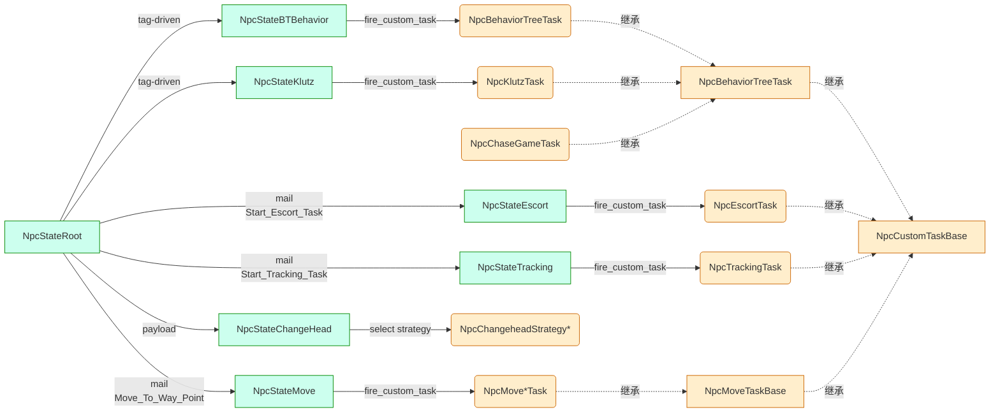
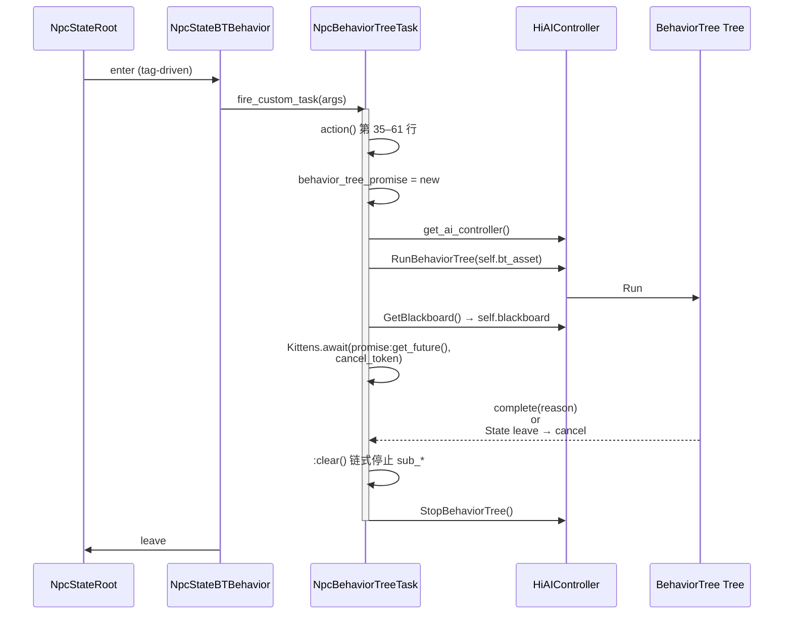
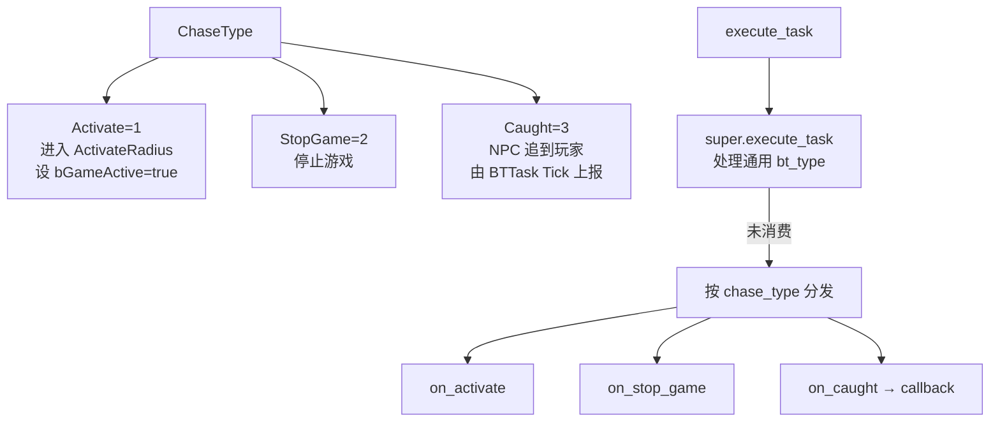
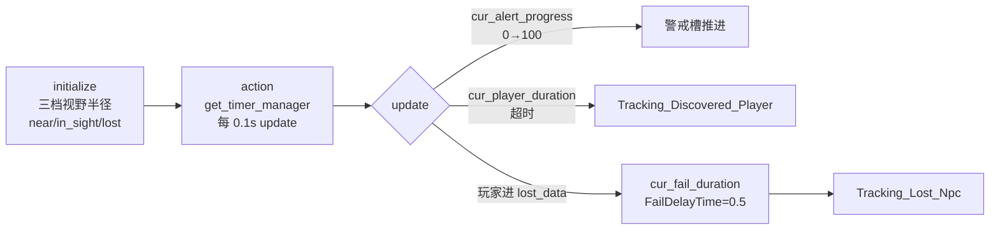
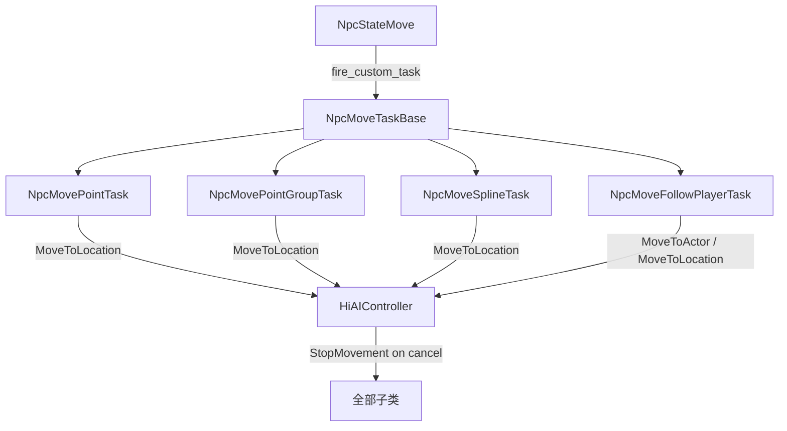

# 11. CustomTask 五件套

> CustomTask 是项目自封装的"挂在某个 state 上的 Lua 任务体",由 Kittens StateFlow 框架的
> `SF_CustomTask` 节点驱动 — state 入参里指定一个 lua class 和 args,SF_CustomTask 调用其
> `action(_task, _task_args)` 入口,在 state 期间作为 await 运行的协程存在。本页梳理 5 件套
> (BehaviorTree / ChaseGame / Escort / Klutz / Tracking) + ChangeHead 策略 + Move 系列 7 个
> 子任务,共同构成 NPC 行为的执行内核[^npc-10]。

## 1. CustomTask 在 NPC 中的角色

CustomTask 的生命周期与外层 state 严格绑定:state 取消 → CancelToken 触发 → action 内部
`Kittens.await` 返回错误 → 任务清理。NpcActiveObject 的 13 状态机里,Behavior / Escort /
Tracking / Performance / Move / ChangeHead / Klutz 等运行态状态都通过 `SF_CustomTask` 把
工作派给本目录下的 task 类。



state 取消时 `cancel_token` 通过 SF_CustomTask 注入,子类用 `_task:is_paused()` /
`_task:do_pause()` 自助处理暂停语义(无 on_pause / on_resume hook)。

## 2. NpcCustomTaskBase 基类

文件 `npc/custom_task/server/npc_custom_task_base.lua` 全文 15 行,verbatim signature:

```lua
local NpcCustomTaskBase = Kittens.class('NpcCustomTaskBase', nil)

function NpcCustomTaskBase:initialize(...)
end

function NpcCustomTaskBase:action(_task, _task_args)
end

return NpcCustomTaskBase
```

特点:

- **没有** `on_pause` / `on_resume` / `on_stop` 这种典型 hook;真正的暂停语义由外层
  `SF_CustomTask` 通过 `cancel_token` 注入,子类用 `_task:is_paused()` / `_task:do_pause()`
  自助处理(见 `npc_move_point_task.lua` 第 52–60 行)。
- 子类**必须重写**: `initialize(_args)` 与静态形式的 `action(_task, _task_args)`。注意
  `action` 是普通函数(不是 method),`_task_args` 通常就是 self 实例本身或包含
  `custom_task = self` 的派发表。

## 3. 5 件套总表

| TaskName | 触发 Mail (key) | 主要状态 (state) | 与 BT 关系 | 一句话场景 |
|---|---|---|---|---|
| `NpcBehaviorTreeTask` | `Move_To_Way_Point` 等通用 | `BTBehavior` | RunBehaviorTree + Blackboard,bt_type 路由 | 通用行为树托管 |
| `NpcChaseGameTask` | manager 直接 `execute_task` 派发 | 追逐小游戏 state | 继承 BehaviorTreeTask,加 ChaseType | 南瓜小游戏 NPC 追逐 |
| `NpcEscortTask` | `Start_Escort_Task` (npc-05 注册) | `Excort` | **不**用 BT,自己跑 timer | NPC 护送玩家走 way_point/spline |
| `NpcKlutzTask` | klutz 系统 mail | Klutz state | 继承 BehaviorTreeTask,加 KlutzType | 笨拙 NPC(灯光/安全)状态切换 |
| `NpcTrackingTask` | `Start_Tracking_Task` (npc-05 注册) | `Tracking` | **不**用 BT,timer 驱动警戒进度 | NPC 跟踪/警戒玩家 |
| `NpcChangeheadStrategy*` | `StopCharmPerformance` 等 | `ChangeHead` 表演阶段 | **不**用 BT,策略钩子 | 变头(被魅惑/铁球撞飞/施魔法) |
| `NpcMove*Task` | Move state 内部 fire | `Move` | **不**用 BT,直接 controller:MoveTo* | 移动子任务(单点/多点/spline/跟随) |

整体上,5 件套里 **2 件**(BehaviorTreeTask、ChaseGameTask、KlutzTask 这一支)走 BT,**3 件**
(EscortTask、TrackingTask、Move*) 是纯 Lua timer 驱动,逻辑完全 owned by Lua 侧,不进
AIController 的 BT 系统。

## 4. NpcBehaviorTreeTask

`Kittens.class('NpcBehaviorTreeTask', CustomTaskBase)`。这是整个 5 件套里最复杂的一员,
完整 284 行。



握手关键步骤:

1. `_task_args.state_flow_task = _task`,创建 `behavior_tree_promise`。
2. 拿 `npc_actor:get_ai_controller()`(项目自己的 HiAIController),调用
   `ai_controller:RunBehaviorTree(self.bt_asset)`。
3. `UE.UAIBlueprintHelperLibrary.GetBlackboard(ai_controller)` 缓存到 `self.blackboard`,
   后续 BT Tick 通过 BB 读 lua 写入的参数。
4. `Kittens.await(behavior_tree_promise:get_future(), cancel_token)` 阻塞,直到
   `:complete(_reason)`(Promise fulfill)或外层 cancel。
5. `:clear()` 链式停止 `sub_play_move_to_location_task` /
   `sub_play_dynamic_montage_task` / `sub_play_dead_performance`。

**bt_type 路由**(`execute_task`,99–115 行)用 `NpcConst.Enum_BehaviorTreeTaskType`:

| 枚举值 | 处理 | 内部动作 |
|---|---|---|
| `Move = 1` | `start_move(_data)` | 构 `EF_Action_MoveToWayPoint` repr,fire EventFlow 子任务 |
| `PlayAnimation = 2` | `start_play_animation(_data)` | 构 `EF_Action_PlayDynamicMontage` repr |
| `Dead = 3` | `show_dead_display(_data)` + `stop_behavior_tree()` | 死亡播放 + StopBT |
| `ShowBubble = 4` | `show_bubble(_data)` | send_mail `Show_Bubble` 自己给自己,fire_and_forget |
| `StopBT = 5` | `stop_behavior_tree()` | `ai_controller:StopBehaviorTree()` |
| `FollowPlayer = 6` | `start_follow_player(_data)` | send_mail `Move_To_Way_Point` payload `move_way_type=FollowActor` |

`BT_END_REASON`(文件局部常量):`TREE_FINISHED = 1`、`TREE_ABORTED = 2`。
`EBehaviorTreeType`(npc_const.lua 第 490 行)用于上层选择哪种 task 类:`Base = 1` /
`Klutz = 2` / `ChaseGame = 3`。

启动时机:state(典型为 BTBehavior)`on_enter` 内 fire_custom_task。停止时机:state
`on_leave` → cancel_token cancel → action await 唤醒 → `clear` →
`stop_behavior_tree(false)` → AIController StopBehaviorTree。

## 5. NpcChaseGameTask

`Kittens.class('NpcChaseGameTask', BehaviorTreeTask)`。继承自 BT 任务。



| ChaseType | 值 | 含义 |
|---|---|---|
| `Activate` | 1 | 激活,进入 ActivateRadius,BB 写入 `bGameActive=true` |
| `StopGame` | 2 | 停止追逐小游戏 |
| `Caught` | 3 | NPC 抓到玩家,由 BTTask Tick 检测后上报 |

`initialize(_args)` 配置:`move_speed`(默认 200)、`view_angle_threshold`(默认 50,存为
`view_angle`)、`catch_radius`(默认 150)、`on_caught_callback`(Manager 注册)。

`action` 覆写:RunBT → **立刻** `__init_blackboard()` 写 BB → 再 await,确保 BB 在 BT 首次
Tick 前已填充。`execute_task(_data)`:先调父类 `BehaviorTreeTask.execute_task`(走
Move/Anim 通用通道),如果父类没消费再按 `_data.chase_type` 分发到 `on_activate` /
`on_stop_game` / `on_caught`。

## 6. NpcEscortTask

`Kittens.class('NpcEscortTask', CustomTaskBase)` —— 直接继承基类,**不用 BT**。

| EEscortType | 值 | 名 |
|---|---|---|
| 0 | None | 占位 |
| 1 | InSight | 玩家在视野内护送中 |
| 2 | Lost | 失联 |
| 3 | Unsafe | 不安全 |

| NpcState (Escort) | 值 | 名 |
|---|---|---|
| 0 | None | 占位 |
| 1 | Moving | 在移动 |
| 2 | StandPlayPerform | 站住做表演(unsafe 蒙太奇) |
| 3 | Standing | 站立 |

常量:

- `TimeInterval = 1`(秒)
- `EEscortTypeMap` 反查名字(`'None'/'InSight'/'Lost'/'Unsafe'`)
- `SEscortType = { 'InSight', 'Lost', 'Unsafe' }`

`initialize(_args)` 关键字段:

```lua
-- escort_data / safe_range_data: { radius, angle, duration }
-- 三选一移动方式:
--   way_point_id          → NpcUtils.build_move_to_way_point_evfl
--   way_point_chain_id    → NpcUtils.build_move_along_way_point_chain_evfl_by_group
--   spline_id             → NpcUtils.build_move_along_spline_evfl
-- 缓存到 move_task_cache_key
-- unsafe_montage_str_path  软引用
-- unsafe_monologue_id      自言自语 id
```

运行态: `cur_player_duration` / `cur_state`、`sub_move_chain_task` / `sub_stand_perform_task`。

**错误码**:`NpcConst.Enum_NpcError.Excort_Time_out`("follow npc out of range, and out time")
—— 拼写遵循源码 `Excort` 而非 `Escort`,跨页时务必保留拼写。当玩家长时间脱离护送半径,task
用此错误结束。触发该 task 的 mail key 是 `Start_Escort_Task = 'start_escort_task'`
(npc_const 第 240 行,在 npc-05 state_root 注册路由)。

## 7. NpcKlutzTask

`Kittens.class('NpcKlutzTask', BehaviorTreeTask)`。继承 BT 任务。

`KLUTZ_COMPLETE = "KLUTZ_COMPLETE"` 局部常量。`action` 直接调
`NpcKlutzTask.super.action(_task, _task_args)`,后续注释代码示意了"曾经是自己跑 promise"
的旧实现已废弃。

`Enum_KlutzNpcType`(npc_const 第 468 行)的 7 状态表:

| 值 | 名 | 处理函数 | 备注 |
|---|---|---|---|
| 0 | `Node` | — | 占位 |
| 1 | `StartKlutz` | (旧 `StartBT` 已注释) | 启动 |
| 2 | `StartRound` | `on_start_round(_data)` | 开始一回合 |
| 3 | `UpdateLight` | `on_light_state_changed(_data)` | 灯光状态变化 |
| 4 | `UpdateSafe` | `update_safe_state(_data)` | 安全状态更新 |
| 5 | `RestartBT` | `restart_bt(_data)` | 占位空实现 |
| 6 | `Dead` | `update_dead(_data)` | 死亡 |
| 7 | `Complete` | `arrived(_data)` | 到达完成 |

派发逻辑在 `execute_task`:先 super 路由 BT 通用 bt_type,super 没消费再
`_data.klutz_type` 分支。`complete(_reason)` 通过 `klutz_promise:fulfill` 唤醒 await。

## 8. NpcTrackingTask

`Kittens.class('NpcTrackingTask', CustomTaskBase)`,**不继承 BT**。



常量:

- `TimeInterval = 0.1`、`FailDelayTime = 0.5`、`MaxAlertProgress = 100`
- `ETrackingType = { None=0, Near=1, InSight=2, Tracking=3, Lost=4, Fail=5 }`
- `STrackingType = { 'Near', 'InSight', 'Tracking', 'Lost' }`(注意 Fail 不在内)
- `NpcState = { None=0, Standing=1, Moving=2 }`(站立朝向玩家做动作 / 移动到目标)

`initialize(_args)` 三档视野半径: `near_data` / `in_sight_data` / `lost_data`,分别有
radius/angle/duration。`alert_montage_str_path`(警戒蒙太奇软引用)、`alert_monologue_id` /
`lost_monologue_id`(发现/跟丢自言自语)。

运行态:`cur_fail_duration`(失败延迟结束)、`last_stand_duration`、`cur_alert_progress`
(0–100 警戒槽)、`cur_player_duration`、`cur_state`。移动支持 `way_point_id` 或
`way_point_chain_id`(没有 spline 分支)。

`action` 第 90 行注释 `attention this method meiyou self` —— 提醒 action 是普通函数,
`_task_args` 即任务实例,通过 `Kittens.get_instance(npc_actor):get_timer_manager()` 起
timer,周期性调 `update(NpcTrackingTask.TimeInterval)`。

**错误码**(npc_const 第 298–299 行):

```lua
Tracking_Discovered_Player = Error:new('npc discovered player')
Tracking_Lost_Npc          = Error:new('player lost npc')
```

触发 mail:`Start_Tracking_Task = 'start_tracking_task'`(在 npc-05 state_root 注册的 mail
handler 里把 task fire 起来)。

## 9. ChangeHead 子目录 (4 strategy)

策略基类 `NpcChangeheadStrategyBase`(继承 nil)持 `__host : NpcStateChangeHead` 引用。
生命周期/表演流水线钩子:

- `on_enter(_payload)` / `on_leave(_reason)`(`_reason` 取值见
  `NpcConst.Enum_Strategy_Leave_Reason`)
- 表演流水线:`pre_flow(_payload, _event_flow_state, _cancel_token)`
- 阶段 2 "是否执行 event flow"(返回 boolean,默认 true)等

| 策略文件 | 类 | 行为 | 关键 mail/技术 |
|---|---|---|---|
| `npc_changehead_charm_strategy.lua` | `NpcChangeheadCharmStrategy` | `pre_flow` 切到 `NpcConst.Enum_State.Charm` 子状态 | `on_leave` 给自己发 `StopCharmPerformance` |
| `npc_changehead_ironball_strategy.lua` | `NpcChangeheadIronBallStrategy` | 铁球头撞飞;payload 取 `direction_x/y/z` + `b_use_forward`,`pre_flow` 用 `FindLookAtRotation` 算 Yaw,`K2_SetActorRotation` 瞬时旋转 | 不走 `Turn_Body_Yaw` |
| `npc_changehead_enchanted_strategy.lua` | `NpcChangeheadEnchantedStrategy` | 施魔法变头 | `should_stop_performance` 返回 false,**不主动**退出 |
| (默认) | `NpcChangeheadStrategyBase` | 兜底空实现 | `on_enter`/`on_leave` 仅打 log |

策略由 `npc_state_changehead`(参见
[12. ChangeHead 与 Performance 表演栈](12.%20ChangeHead%20与%20Performance%20表演栈.md))
按 mail payload 选择实例化哪一个。

## 10. Move 子目录 (5 task)

| 文件 | 类 | 模式 | 与 EventFlow Action 节点对应 |
|---|---|---|---|
| `npc_move_task_base.lua` | `NpcMoveTaskBase`(继承 CustomTaskBase) | 通用基类,`request_move_result_delegate` / `move_result_delegate`,`stop_move(_npc_actor)` 调 `controller:StopMovement()` | 抽象层,无对应 |
| `npc_move_point_task.lua` | `NpcMovePointTask`(类名 typo 为 `'NpcMoveTaskBase'`) | 单点移动;`async_claim_way_point` → `__async_move_to_way_point`;支持 pause/resume | `EF_Action_MoveToWayPoint` |
| `npc_move_point_group_task.lua` | `NpcMovePointGroupTask` | 多点链(way_point_group),按 `start_index..num` 顺序循环 `__async_move_point_flow` | `EF_Action_MoveAlongWayPointChain` |
| `npc_move_spline_task.lua` | `NpcMoveSplineTask`(类名 typo `'NpcMoveTaskBase'`) | 沿 spline 移动,按 `move_speed * delta_seconds` 推进 `current_distance`,`GetTransformAtDistanceAlongSpline` → `controller:MoveToLocation` | `EF_Action_MoveAlongSpline` |
| `npc_move_follow_player_task.lua` | `NpcMoveFollowPlayerTask` | 跟随 Actor,`refresh_interval = 0.5s`、`pre_reached_distance = 50`;两种模式 `target_actor` → `__follow_until_catch`,否则 `__follow_to_location` | `EF_Action_FollowActor` |



所有 Move 任务由 Move state 通过 `fire_custom_task` 调度,`controller:MoveToLocation` 仅在
Move 状态内可用(其它状态会被状态机强制 StopMovement)。

## 11. 跨页链接

- → [5. NpcActiveObject 与 13 状态机](5.%20NpcActiveObject%20与%2013%20状态机.md):
  `Start_Tracking_Task` / `Start_Escort_Task` / `Move_To_Way_Point` mail handler 在 root
  state 注册,本页 task 由这些 handler `fire_custom_task` 启动。
- → [12. ChangeHead 与 Performance 表演栈](12.%20ChangeHead%20与%20Performance%20表演栈.md):
  ChangeHead 子目录 4 策略由 `NpcStateChangeHead` 选择实例化,Performance 表演栈对接
  `Charm` / `IronBall` / `Enchanted` 等子状态。
- → [14. HiAIController + 寻路与规避](14.%20HiAIController%20+%20寻路与规避.md):
  Move 系列任务的 `controller:MoveToLocation` 最终落到 PathFollowing,
  `NpcBehaviorTreeTask` 的 `RunBehaviorTree` / `StopBehaviorTree` 也调用 HiAIController。
- → [15. BehaviorTree 与战斗 NPC](15.%20BehaviorTree%20与%20战斗%20NPC.md):
  `NpcBehaviorTreeTask` 真正跑的 BT 节点(EQS、BT Decorator、自定义 BTTask)由 npc-15 文档
  负责;`NpcChaseGameTask` 用到的 BTTask Tick 检测(catch detection、view_angle 检查)也属
  BT 层。
- → [6. Mail 类型与 Handler 路由](6.%20Mail%20类型与%20Handler%20路由.md):
  `Start_Tracking_Task` / `Start_Escort_Task` / `Move_To_Way_Point` / `Show_Bubble` /
  `StopCharmPerformance` mail key 全部在 npc_const.lua 集中定义。

[^npc-10]: raw/npc-10-custom-tasks.md
