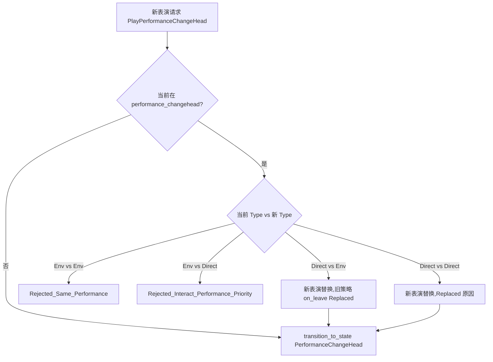
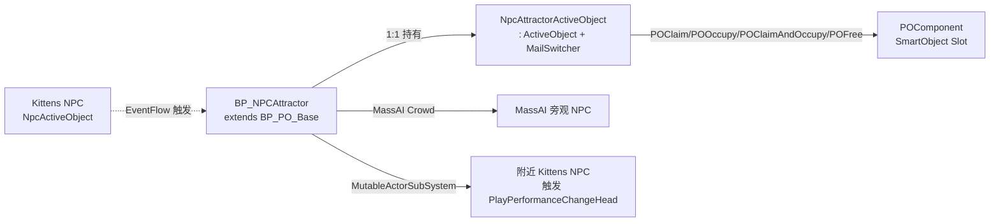
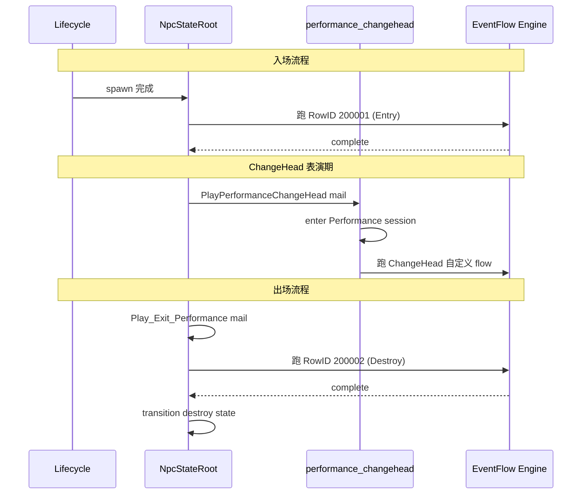

# 12. ChangeHead 与 Performance 表演栈

> **ChangeHead** 是项目里"玩家用机关或技能强行改变 NPC 头/形象"的玩法。它与入场/出场/死亡的"被动表演"共用同一棵 `performance` 子树。表演期间会切换 `MailSwitcher`、stash 普通业务 mail，并通过 **Direct vs Environment** 的优先级仲裁决定能否打断他人。本页只关注 4 联状态、Immunity Tag、`NpcAttractor` 系统和 entrance/exit/dead 三个保留的 EventFlow ID。[^npc-05][^npc-10][^npc-11]

## 1. 概念

ChangeHead = 玩家通过技能（魅惑、铁球、施魔法等）或机关（`BP_NPCAttractor`）让 NPC 进入"换头表演"分支。它不是一个独立状态，而是一棵**performance selector → performance_changehead → {move / charm / float}**的子树；表演期间 NPC 由 `NpcStateChangeHead` 接管，普通对话/移动 mail 全部 `stash`。`NpcChangeheadStrategyBase` 三个具体策略（`Charm / IronBall / Enchanted`）封装具体表演内核。[^npc-05][^npc-10]

```lua
-- 入口 mail (npc_state_root.lua mail_switcher 注册片段)
self.__mail_switcher:case(
    NpcConst.Enum_Mail_Type.PlayPerformanceChangeHead,
    self.__handle_play_performance_change_head)
-- handler 内部:检查 immunity → 检查 Direct/Environment 仲裁
-- → stash(_mail) → transition_to_state('performance_changehead')
```

> **同一棵子树承载两个独立玩法**：
>
> - **被动表演**：NPC 入场（`NpcEntryPerformanceEventFlowId=200001`）/ 出场（`NpcEntryDestroyEventFlowId=200002`）/ 死亡（`NpcCustomDeadPerformFlowId=200009`），由 NPC lifecycle / mission 系统自动触发；
> - **ChangeHead 玩法**：玩家技能 / 机关推动 NPC 进入 charm/iron-ball/enchanted 三种风格表演，期间还会复用 move 和 float 子状态。
>
> 两条线共用 `Enum_Session.Performance='performance'` 同一个 mission session，确保互斥；任何 NPC 同一时刻只能跑一段 performance。[^npc-05][^npc-10]

## 2. 4 联状态结构

```mermaid
stateDiagram-v2
    [*] --> root
    root --> performance: PlayPerformanceChangeHead mail
    state performance <<choice>>
    performance --> performance_changehead: selector pick
    performance --> dialogue_group: Start_Dialogue_Group
    performance_changehead --> change_head_move: 移动期 mail
    performance_changehead --> charm: 魅惑策略
    performance_changehead --> float: Start_Float (浮空)
    float --> performance_changehead: Notify_Float_Landed (落地后回父)
    change_head_move --> performance_changehead: success/fail → parent
    charm --> performance_changehead: StopCharmPerformance → parent
    performance_changehead --> root: StopPerformanceChangeHead
```

`performance` 是 selector 节点（`is_selector=true`），由 StateFlow 框架按 `child_state_id_list` 排序选；`performance_changehead` 自身**不是 selector**，但包含三个并列子状态 `change_head_move / charm / float`，由具体 mail 触发。`change_head_move` 类继承自 `NpcStateMove`，`charm` 由 `NpcStateCharm` 实现，`float` 由 `NpcStateFloat` 自带 `FloatComponent`。[^npc-05]

> 注意：`performance_changehead` 在 `npc_state_config.lua` 中注册类名时写成了 `'NpcStateNormal'`（源码 bug，实际 class 是 `NpcStateChangeHead`）；该 typo 不影响运行，因为 StateFlow 用的是 state_id 而不是 class name 路由。`change_head_move` 类名同样有 typo（写成 `'NpcMoveTaskBase'`），也无功能影响。[^npc-05][^npc-10]

## 3. 状态进入条件

| 状态 | 进入触发 mail | 入场副作用 | 退出条件 |
|---|---|---|---|
| `performance` (selector) | 任意 stateful 子触发上跳到此 | selector 选 `dialogue_group` 或 `performance_changehead` | 子节点 transition 到 root |
| `performance_changehead` | `Enum_Mail_Type.PlayPerformanceChangeHead` | `on_enter` 进 `Performance` mission session；`__skill_strategy_classes` 选 `NpcChangeheadCharmStrategy / IronBallStrategy / EnchantedStrategy` | `Enum_Mail_Type.StopPerformanceChangeHead` → root |
| `change_head_move` | `Move_To_*` mail 在 ChangeHead 期间被触发 | 继承 `NpcStateMove`，先 `__handler_stop_move` 再 stash 回放 | move success+fail → parent (`performance_changehead`) |
| `charm` | `pre_flow` 内部 `transition_to_state(Charm)` | 走 `SwapHeadUtils.GetCharmPOConfigForActor` 拿 DT 配置 | `StopCharmPerformance` → parent；策略 `on_leave` 重发自己 mail 兜底 |
| `float` | `Start_Float` mail | 自行 `add_component(FloatComponent)` | `Stop_Float` 或 `Notify_Float_Landed` → 上跳 `performance_changehead` |

> 三个子状态的 transition 都回 **parent**（`StateFlowConst.Enum_ReservedStateId.parent`），而不是回 source — 这是因为 ChangeHead 表演串行可能继续，先回 selector 父再决定下一步。[^npc-05]

**state_tag 路径表**（`root.performance.change_head.*`）也用于客户端订阅 `EventOnStateEnter/Leave`：

| state | full state_tag |
|---|---|
| `performance` | `root.performance` |
| `dialogue_group` | `root.performance.dialogue_group` |
| `performance_changehead` | `root.performance.change_head` |
| `change_head_move` | `root.performance.change_head.move` |
| `charm` | `root.performance.change_head.charm` |
| `float` | `root.performance.change_head.float` |

客户端 `npc_state_config.lua` 只注册了 `change_head` 与 `charm` 两个客户端镜像类，`change_head_move` 复用通用 `NpcClientStateMove`，`float` 没有独立 client 类（落地后表现统一在 `change_head` 客户端类内处理）。[^npc-05]

## 4. Direct vs Environment 优先级仲裁

```lua
-- npc_const.lua 第 139 行 (verbatim)
Const.Enum_Interact_Performance_Type = {
    Direct      = 1,  -- 玩家技能直接触发,可以被同等或更高级别打断
    Environment = 2,  -- 机关/环境触发,不会被 Direct 打断
}
```



**仲裁原则**：`Environment` 优先级高于 `Direct`（机关在跑时玩家技能打断不了）；同级 `Direct` 后来居上（最新玩家请求胜出）；同级 `Environment` 视为重入，直接返回 `Enum_NpcError.Rejected_Same_Performance`。被替换方走 `Enum_Strategy_Leave_Reason.Replaced` 流程。[^npc-10][^npc-11]

**关联错误码**（`npc_const.Enum_NpcError`）：

| 错误码 | 触发分支 |
|---|---|
| `Rejected_Interact_Performance_Priority` | 新 Direct 想打断旧 Environment |
| `Rejected_Same_Performance` | 同级 Environment 重入 |
| `Rejected_Changehead_Immunity` | 命中 ChangeHead_Immunity_Tag |
| `Rejected_In_Mission_Session` | NPC 已在更高优先级 mission session 中 |

请求方收到上述错误后 promise 直接 reject，不会触发任何状态切换。所有 `Rejected_*` 错误都通过 `Error:new('npc xxx')` 创建，可在外层用 `==` 比较分发到不同的 fallback 行为（例如 `Rejected_Same_Performance` 静默忽略，而 `Rejected_Changehead_Immunity` 通常需要给玩家技能反馈）。[^npc-10]

## 5. Immunity Tag 机制

```lua
-- npc_const.lua 第 154-158 行 (verbatim)
Const.ChangeHead_Immunity_Tag = {
    All         = 'changehead.immunity',
    Environment = 'changehead.immunity.environment',
    Direct      = 'changehead.immunity.direct',
}
```

| Tag | 含义 | 添加时机 / 场景 |
|---|---|---|
| `All` | 全部 ChangeHead 免疫 | 关键剧情/Sequence 期间，由 EventFlow 节点（如 `EF_Action_AddTag`）写入 |
| `Environment` | 仅免疫机关型 ChangeHead | NPC 在玩家身边跑 mission 时，避免被路边 `BP_NPCAttractor` 拽走 |
| `Direct` | 仅免疫玩家技能型 ChangeHead | 部分 NPC 在 Boss 战 / 演出期，玩家技能不应改变其形象 |

`PlayPerformanceChangeHead` 的 root handler 在切换到 `performance_changehead` 之前会先 `tag_component:has_tag(immunity_tag)` 检查，命中则返回 `Enum_NpcError.Rejected_Changehead_Immunity` 错误，请求方收到错误后 promise 走失败分支不会真的进表演。Tag 既可以由 EventFlow 节点添加，也可以由具体 NPC 配置（DataTable 行 `ImmunityTags` 字段）静态注入。[^npc-11]

## 6. NpcAttractor 系统



`BP_NPCAttractor` 是独立 Actor，**不是** NPC 自身的组件。它把"吸引附近 NPC 来表演"这件事抽出到一个机关上：客户端/Standalone 用 PO 体系驱动 MassAI Crowd，DS 侧/Standalone 用 `MutableActorSubSystem` 找附近 Kittens NPC，再向其 `send_mail(PlayPerformanceChangeHead)`。

**`DEFAULT_CONFIG` 关键字段**（verbatim 自 `npc_attractor.lua`）：

```lua
local AttractMode = { PO = "PO", Direct = "Direct", Both = "Both" }
local DEFAULT_CONFIG = {
    Mode             = "PO",       -- "PO"=只走机关 / "Direct"=直接换头 / "Both"=两者并行
    SearchRadius     = 5000.0,     -- 搜索半径 cm
    MaxDuration      = 10.0,       -- 表演最大持续秒
    TickInterval     = 0.033,
    ArriveRadius     = 200.0,
    MoveSpeed        = 800.0,      -- MassAI NPC 移动速度
    SpreadRadius     = 200.0,
    MaxCount         = 0,          -- 0 = 不限制吸引数量
    AutoDestroy      = false,
    NpcAttractRadius = NpcAttractorUtils.DEFAULT_NPC_ATTRACT_RADIUS,
    PODefinitionPath = nil,        -- nil 用 SO_Attractor_NoSpawn
    PODuration       = nil,        -- nil 用 POLifecycleManager.DEFAULT_DURATION
}
```

`NpcAttractorActiveObject` 注册 4 个 mail case：`POClaim / POOccupy / POClaimAndOccupy / POFree`，`_get_slot_or_actor_transform` 优先链 **NavPointWorldTransform → SlotTransform → ActorTransform**。[^npc-11]

**Mail 路由表**（`npc_attractor_const.lua` verbatim）：

```lua
Const.Enum_Mail_Type = {
    POClaim          = 'POClaim',           -- 单纯申领 SmartObject Slot
    POOccupy         = 'POOccupy',          -- 占据已申领的 Slot
    POClaimAndOccupy = 'POClaimAndOccupy',  -- 申领并占据 (一步到位)
    POFree           = 'POFree',            -- 释放 Slot 回收 ClaimHandle
}
```

`NpcAttractorActiveObject:initialize` 持有 `__claim_handles = {}` 表（npc_actor_id → `FSmartObjectClaimHandle`），由 4 个 handler 维护。注意 `IsValidClaimHandle = USmartObjectBlueprintFunctionLibrary.IsValidSmartObjectClaimHandle` —— `ClaimHandle` 是 USTRUCT 值类型，**不能用 nil/truthiness 判断**，必须调蓝图库函数验证。[^npc-11]

## 7. Charm / IronBall / Enchanted 三种策略对比

| 策略 | 触发条件 | 持续时间 | 退出条件 | 关键实现 |
|---|---|---|---|---|
| `NpcChangeheadCharmStrategy` | 玩家施加魅惑技能；payload 携带魅惑配置 | 由 DT 配置（`SwapHeadUtils.GetCharmPOConfigForActor`） | 时间到 / `StopCharmPerformance` mail；`on_leave` 给自己再 send 一遍 stop mail 兜底 | `pre_flow` `transition_to_state(Enum_State.Charm)` 切到 charm 子状态 |
| `NpcChangeheadIronBallStrategy` | 铁球机关撞击；payload 含 `direction_x/y/z`、`b_use_forward` | 单次撞飞动作长度 | 蒙太奇结束 / 动画退出 | `pre_flow` 用 `FindLookAtRotation` 算 Yaw 后 `K2_SetActorRotation` **瞬时旋转**（不走 `Turn_Body_Yaw` mail） |
| `NpcChangeheadEnchantedStrategy` | 玩家施法变头 | 表演 EventFlow 自结束 | 仅靠外部 `StopPerformanceChangeHead` | `should_stop_performance` 返回 false，**不主动**退出，靠外面来停 |

三个策略都继承 `NpcChangeheadStrategyBase`（继承 nil），暴露统一的钩子：`on_enter(_payload)` / `on_leave(_reason)` / `pre_flow(_payload, _event_flow_state, _cancel_token)` / 阶段 2 "是否执行 EventFlow"（默认 true）。`__skill_strategy_classes` 表在 `NpcStateChangeHead` 上，按 mail payload 的 `strategy_type` 字段实例化对应类。[^npc-10]

## 8. Entrance / Exit Performance 模板

```lua
-- npc_const.lua 第 268-273 行 (verbatim)
Const.NpcEntryPerformanceEventFlowId = 200001   -- 入场表演 (NPC spawn 时跑)
Const.NpcEntryDestroyEventFlowId    = 200002   -- 销毁/出场表演 (NPC despawn 前跑)
Const.NpcCommonTrackingStand        = 200006   -- tracking 任务站立 flow
Const.NpcCommonExcortStand          = 200007   -- escort 任务站立 flow (拼写保留 Excort)
Const.NpcCustomDynamicFlowId        = 200008   -- 自定义动态 flow
Const.NpcCustomDeadPerformFlowId    = 200009   -- 自定义死亡表演
```

| RowID | 常量名 | 触发时机 | 关键 mail |
|---|---|---|---|
| **200001** | `NpcEntryPerformanceEventFlowId` | NPC spawn 时由 lifecycle 自动触发 | 走 `Enum_Performance_Type.Entrance` 通道 |
| **200002** | `NpcEntryDestroyEventFlowId` | NPC `Play_Exit_Performance` mail 抵达 root state | stash + transition 到 `destroy` state |
| **200009** | `NpcCustomDeadPerformFlowId` | 自定义死亡表演（区别于通用死亡） | 由 `BehaviorTreeTask.bt_type=Dead` 路由的 `show_dead_display` 调用 |

`Enum_Performance_Type = {Entrance=1, Exit=2}` 是 entrance/exit 两段表演的模板枚举。三个 row 都在 DataTable `DT_NpcCommonEventFlow` 中，所有 NPC 共享。`Enum_Session.Performance='performance'` mission session 在 `performance_changehead` 的 `on_enter` 中开启，确保表演期间不被 mission 打断。[^npc-10]



**入场 / 出场 vs ChangeHead 的核心差异**：入场和出场跑的是固定 RowID（200001 / 200002），由 lifecycle 直接 `fire_event_flow`；ChangeHead 跑的是策略类内部按 payload 解析得到的动态 RowID（DT 表项可由 NPC 配置 / 玩家技能配置决定）。两类都进 `Enum_Session.Performance` session，所以同一 NPC 在跑入场表演时收到 `PlayPerformanceChangeHead` 会被 `Rejected_In_Mission_Session` 拒绝。[^npc-10]

## 9. Enum_Strategy_Leave_Reason

```lua
-- npc_const.lua 第 243-247 行 (verbatim)
Const.Enum_Strategy_Leave_Reason = {
    Replaced,    -- 被新的表演/策略替换 (Direct vs Direct 仲裁中旧表演离开)
    Stop,        -- 正常停止 (StopPerformanceChangeHead / 时间到)
    Exit_State,  -- 宿主状态退出时保底清理 (state on_leave 时强制走)
}
```

| Reason | 触发场景 | 策略 on_leave 行为 |
|---|---|---|
| `Replaced` | Direct/Direct 仲裁后旧表演被踢出 | 立即清理资源；不发 stop mail（替换方会发自己的） |
| `Stop` | 表演自然结束 / 玩家请求停止 | `Charm` 策略此时给自己再 send 一遍 `StopCharmPerformance` 兜底 |
| `Exit_State` | NPC 整个 `performance_changehead` state on_leave 时 | 保底清理（`AsyncBeforeDestroyActor` / `Cancel_Caused_By_Npc_End_Play` 等场景） |

被替换方收到 `Replaced` 时**不能**再 transition state（旧 state 已经 on_leave），只能做无副作用的资源回收。`Exit_State` 通常意味着 NPC 即将销毁或被强制切走，策略此时若还在 await 自己的 promise 必须 cancel。[^npc-10]

## 10. 跨页链接

- → [5. NpcActiveObject 与 13 状态机](5.%20NpcActiveObject%20与%2013%20状态机.md)：performance / performance_changehead / change_head_move / charm / float 在 13 状态总表中的位置；`PlayPerformanceChangeHead` mail 由 root handler `__handle_play_performance_change_head` 路由
- → [11. CustomTask 五件套](11.%20CustomTask%20五件套.md)：`changehead/` 子目录下 3 个策略类（Charm / IronBall / Enchanted）的实现细节；`NpcChangeheadStrategyBase` 钩子签名
- → [8. EventFlow — 28 个 Action 节点](8.%20EventFlow%20—%2028%20个%20Action%20节点.md)：`EF_Action_Float`、`EF_Action_PlayDynamicMontage`（被 IronBall 策略调用）、`EF_Action_AddTag`（写入 Immunity Tag）等节点
- → [13. Significance 与性能分级](13.%20Significance%20与性能分级.md)：表演期间 NPC 即使距离玩家很远也不应被卸载，需要 `Significance_Distance_Table` 给 performance state 一个保底距离
- → [6. Mail 类型与 Handler 路由](6.%20Mail%20类型与%20Handler%20路由.md)：`PlayPerformanceChangeHead`、`StopPerformanceChangeHead`、`Start_Float / Stop_Float / Notify_Float_Landed`、`StopCharmPerformance` 五个 mail 的字符串常量与 dispatcher 注册位置

[^npc-05]: raw/npc-05-states-and-stateflow.md
[^npc-10]: raw/npc-10-custom-tasks.md
[^npc-11]: raw/npc-11-actor-blueprint-components.md
