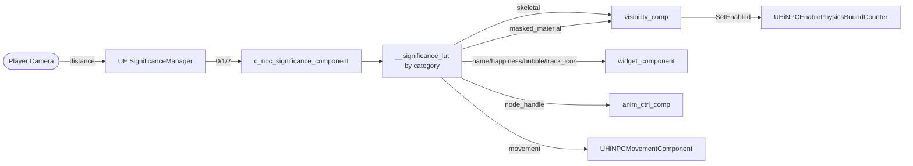
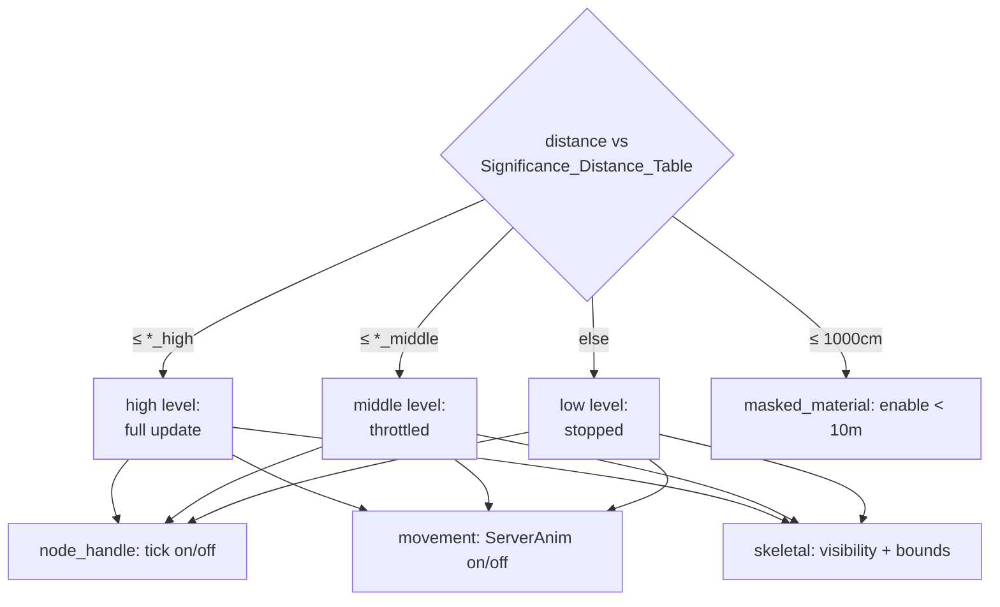
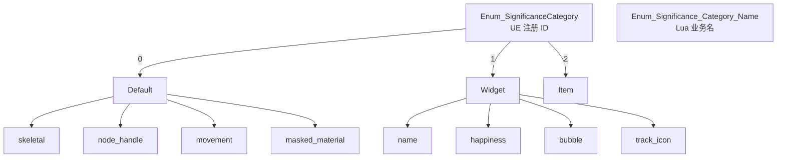
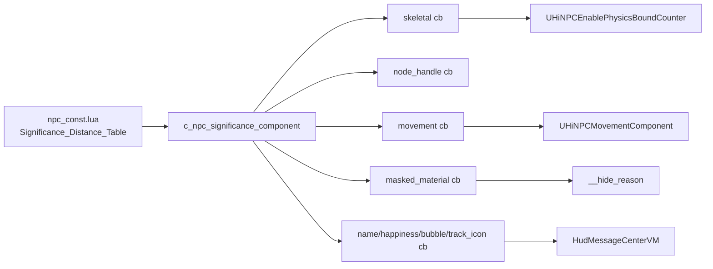

# 13. Significance 与性能分级

> 远距离 NPC 通过 UE `SignificanceManager` 把"我离玩家多远"映射成 0/1/2 的等级,Lua 侧 `c_npc_significance_component` 把等级翻成 8 类业务回调,从而**自动停跑** node_handle / movement / skeletal / 4 类 HUD 等模块。本页把 `npc_const.lua` 里的 `Significance_Distance_Table`、`HUD_Significance_Name_Table`、`Enum_Significance_Category_Name`、`Significance_Categories`、`Enum_Npc_Hide_Reason`、`Enum_Collision_Disable_Reason` 与 C++ 侧 `UHiNPCEnablePhysicsBoundCounterComponent`、`UHiNPCMovementComponent`、`UHiNpcAnimInstance` 全部串起来,作为性能调优单页参考。[^npc-15][^npc-13][^npc-06]

## 1. Significance 在 NPC 中的位置



`c_npc_significance_component` 是 NodeComponent(client only,见 npc-06 §3 visibility/significance),它通过 `rawset` 在自己 self 上挂三个表:`__significance_lut`(category → cur level)、`__significance_val`(每个 category 的距离阈值副本)、`__significance_changed_signal`(回调 list)。`init_significance` 时一次性注册 4 类默认 callback(skeletal、node_handle、movement、masked_material),其它业务组件再 `register_significance_callback(category, cb)` 追加自己的 4 类(name / happiness / bubble / track_icon)。

## 2. Significance_Distance_Table 全表

verbatim 摘自 `npc_const.lua:Significance_Distance_Table`,单位是 cm:

```lua
Const.Significance_Distance_Table = {
    node_handle_high   = 3000,    movement_high   = 5000,    skeletal_high   = 5000,
    node_handle_middle = 5000,    movement_middle = 8000,    skeletal_middle = 8000,
    node_handle_low    = 999999,  movement_low    = 999999,  skeletal_low    = 999999,
    masked_material_apply = 1000,
}
```

| 类别 (category)        | high (近)      | middle (中)    | low (远) |
|------------------------|----------------|----------------|----------|
| `node_handle_*`        | 3 000 cm = 30 m| 5 000 cm = 50 m| 999 999 (∞) |
| `movement_*`           | 5 000 cm = 50 m| 8 000 cm = 80 m| 999 999 (∞) |
| `skeletal_*`           | 5 000 cm = 50 m| 8 000 cm = 80 m| 999 999 (∞) |
| `masked_material_apply`| 1 000 cm = 10 m | —              | —        |

**含义说明**:`*_high` 是"距离 ≤ 30m 时,等级算 high(2)";`*_middle` 阈值之内升 middle(1);超过 `*_middle` 阈值则降到 low(0)。`low = 999999` 是哨兵,表示"理论上永远不会真到 low"——但实际项目里 `.uproject`/`AOI` 距离要远低于此,所以远距离 NPC 几乎全是 `low`,组件被关。

## 3. 三级分级 × 三类

| 类别        | low (≥ 80m / ≥ 50m)                              | middle                                  | high (近距离)                       |
|-------------|--------------------------------------------------|-----------------------------------------|-------------------------------------|
| `node_handle` | 完全停 NodeHandle 的 `__on_update` tick(只保留 init/release) | 减频 tick(配合 TickGroup `time_budget`) | 全速 tick |
| `movement`    | 关 `bEnableServerAnimation` / `MovementComponent` 简化 | 半精度寻路 / 减频更新                  | 全精度 RVO/Avoidance |
| `skeletal`    | `USkeletalMeshComponent` 不可见 + 物理 bound 关  | 可见但 LOD 降级                        | 完整 skeleton + animblueprint 跑    |



## 4. HUD Significance (4 类)

`HUD_Significance_Name_Table` 提供给 `c_npc_widget_component` 用,4 个对应头顶元素:

```lua
Const.HUD_Significance_Name_Table = {
    name        = 'name',
    happiness   = 'happiness',
    bubble      = 'bubble',
    track_icon  = 'track_icon',
}
```

| HUD 类目      | 业务 | 由谁消费 | 主要触发 |
|---------------|------|----------|----------|
| `name`        | 头顶名牌(Display Name) | `c_npc_widget_component` | 注册 sig callback |
| `happiness`   | 好感度图标(心心数) | `c_npc_widget_component` | TopLogo 条件完成 |
| `bubble`      | 头顶气泡(对话/任务提示) | `c_npc_widget_component` + `HudMessageCenterVM` | mail `Show_Bubble` |
| `track_icon`  | 任务追踪图标(箭头/感叹号) | `c_npc_widget_component` | mail `Start_Tracking_Task` |

> 注:HUD 只有 4 类(没有 `_high/_middle/_low` 距离),复用 `node_handle_*` 距离决定显隐。`Enum_Significance_Category_Name` 把 HUD 4 类与基础 3 类(skeletal、node_handle、movement)、加上 `masked_material` 合成 8 类。

## 5. Enum_Significance_Category_Name (8 类)

```lua
Const.Enum_Significance_Category_Name = {
    skeletal,
    node_handle,
    movement,
    name,
    happiness,
    bubble,
    track_icon,
    masked_material,
}
```

| Category          | 消费方                                   | 默认回调 (init_significance) |
|-------------------|------------------------------------------|------------------------------|
| `skeletal`        | `c_npc_visibility_component`(渲染)      | ✅ |
| `node_handle`     | `c_npc_significance_component` 自管 tick | ✅ |
| `movement`        | `UHiNPCMovementComponent` 包装          | ✅ |
| `masked_material` | `c_npc_visibility_component`(mask)      | ✅ |
| `name`            | `c_npc_widget_component`                | 由 widget 自行 register |
| `happiness`       | `c_npc_widget_component`                | 由 widget 自行 register |
| `bubble`          | `c_npc_widget_component`                | 由 widget 自行 register |
| `track_icon`      | `c_npc_widget_component`                | 由 widget 自行 register |

`init_significance` 时只注册前 4 类作为 default,其余 4 类必须等到 `c_npc_widget_component:on_start` 主动 `register_significance_callback` 才会进入分发表。

## 6. Significance_Categories 嵌套结构

`npc_const.lua` 末尾 `Const.Enum_SignificanceCategory`(注意是另一张 enum,不要和 `Enum_Significance_Category_Name` 混淆):

```lua
Const.Enum_SignificanceCategory = {
    Npc_Default_Tickable = 0,    -- NPC 默认 tickable 业务
    Npc_Widget_Component = 1,    -- 头顶 widget 业务
    Item_Actor           = 2,    -- 道具 actor (复用同套 SigMgr)
}
```

这一层是 **C++/UE SignificanceManager 注册 ID** 的口径——告诉 manager 哪些 actor 走哪条公式。Lua 侧 `Enum_Significance_Category_Name` 是**业务回调名**口径,二者通过 `register_significance_callback(name, cb)` 在 `c_npc_significance_component` 内部 LUT 桥接。两者的对照可以看作:



## 7. masked_material_apply 优化

`Significance_Distance_Table.masked_material_apply = 1000` (10 m) 是个**单值**(不分高/中/低),表示 NPC 进入相机 10 米内才把 mask material(用于 Fade 与穿模处理)真正 apply 到角色身上;远距离全部走默认 material。

```lua
-- 触发口径(伪代码,见 c_npc_visibility_component / c_npc_fade_component)
if dist_to_camera <= NpcConst.Significance_Distance_Table.masked_material_apply then
    apply_masked_material()    -- 10m 内 → 切到带 mask 的 dynamic material instance
else
    restore_default_material() -- 10m 外 → 恢复默认 opaque mat,绕过 PixelShader mask 分支
end
```

| 使用方 | 用途 | 远距离行为 |
|--------|------|-----------|
| `c_npc_fade_component` | `mask_start/mask_end/mask_duration/mask_current` 0..10 区间值 | 距离 > 10m 时 Multicast `MultiCast_PlayFade` 直接 short-circuit,不切材质 |
| 遮挡/穿模处理 | UI/对话中"角色挡镜头"半透明 | 只有 ≤10m 才叠 mask,远处走标准不透明 mat |
| `npc-11 c_npc_camera_component` | dialogue 时检测前景遮挡 | 远处不需要 mask,自然不进 dialogue |

> **关闭场景**:Klutz 关键 NPC、关键 boss、近距离 quest NPC 可以把 `masked_material_apply` 调到 5000 以让远处也能 fade。但代价是材质 Variant 加倍,慎调。

## 8. Enum_Npc_Hide_Reason (8 种)

控制 `c_npc_visibility_component.__hide_reason`(table),只要任一 reason 为 true 即整体隐藏。

```lua
Const.Enum_Npc_Hide_Reason = {
    Unknown            = 1,
    Enter_Stealth_State= 2,
    Interact_UI_Event  = 3,
    Player_Camera      = 4,
    Soul_Meter         = 5,
    Sequence           = 6,
    MiniGame           = 7,
    Init               = 8,
}
```

| ID | Reason 名             | 触发场景 |
|----|-----------------------|----------|
| 1  | `Unknown`             | 兜底/老版本残留;不应主动使用 |
| 2  | `Enter_Stealth_State` | NPC 进入 `npc_state_stealth` 状态(npc-05) |
| 3  | `Interact_UI_Event`   | UI 弹出商店/任务面板时由 `CameraCheckUIInfo`(`UI_Store_Content_Main`/`UI_PurchaseList`) 触发隐藏 |
| 4  | `Player_Camera`       | NPC 卡到玩家相机近裁剪平面或 Pivot 内,距离过近导致穿模 |
| 5  | `Soul_Meter`          | "灵魂查看器"叠加;`SoulMeter:CheckForeverShowRecordById` 决定是否豁免 |
| 6  | `Sequence`            | Sequencer/CutScene 接管角色显示,由 `npc_state_dialogue`(npc-05) 通知 |
| 7  | `MiniGame`            | 小游戏(MusicPlaza、ChaseGame)期间隐藏所有非参与 NPC |
| 8  | `Init`                | NPC 初始化期(尚未 ready)默认隐藏,直到 `c_npc_node_component:on_start` 完成 |

## 9. Enum_Collision_Disable_Reason (4 种)

`c_npc_interact_component` / actor collision 用,语义同 hide_reason 但作用于物理碰撞。

```lua
Const.Enum_Collision_Disable_Reason = {
    Visibility = 1,
    Fading     = 2,
    EventFlow  = 3,
    StateTag   = 4,
}
```

| ID | Reason     | 含义 |
|----|------------|------|
| 1  | `Visibility` | 隐藏中 → 同步关碰撞,避免与不可见对象交互 |
| 2  | `Fading`     | 淡入淡出过程中 → 通过 `c_npc_fade_component` 设 |
| 3  | `EventFlow`  | EF Action `EF_Action_Collision`(npc-07) 显式关 |
| 4  | `StateTag`   | StateTag 含 `interact_dialogue`/`speaking` 等导致碰撞需要禁掉 |

## 10. C++ 侧支撑

| C++ 类 | 职责 | 与 Significance 关联 |
|--------|------|----------------------|
| `UHiNPCEnablePhysicsBoundCounterComponent` | 引用计数式开关多个 `USkeletalMeshComponent` 的 `bComponentUseFixedSkelBounds` | `c_npc_visibility_component` 在 `skeletal_low` 时 `SetEnabled(false)`,使物理 bound 用固定 box 而非每帧计算 |
| `UHiNPCMovementComponent` | NPC 移动组件,继承 `UHiAIMovementComponent` | `movement_*` 等级降为 low 时,`SetMaxWalkSpeed(0)` + 父类 `bEnableServerAnimation = false` 简化 server 动画 |
| `UHiNpcAnimInstance` | NPC AnimBlueprint 基类 | 分级低时 `NativeUpdateAnimation` 中 `CharacterMoveSpeed` 取自缓存,跳过 `LogicGait` 重算 |
| `UHiNpcSklMeshChangeComponent` | NPC 骨骼合并/换装 | 远距离不再 `ChangeNpcMeshByTwoFiles` 异步加载,推迟到 high 等级 |
| `UHiNpcLocomotionAppearance` | 步态/旋转模式 | 远距离 `TickLocomotion` 走 fast path |

```cpp
// UHiNPCEnablePhysicsBoundCounterComponent.h (npc-13 §8)
void SetEnabled(bool bNewState);  // +/- 引用计数 → UpdateState()
TArray<FName> ChildComponentNames;
TArray<TObjectPtr<USkeletalMeshComponent>> ChildComponents;
```

## 11. 调优指南

| 调整目标 | 改动点 | 注意 |
|----------|--------|------|
| 让 NPC 在更远距离仍能播放完整动画 | `node_handle_high` 3000 → 8000 | 必然增加 CPU,只对关键 NPC 改 |
| 让远处 NPC 也能看见名牌 | 给 widget 注册更宽松的 `name` 阈值(在 widget callback 内自定义) | 远距离 widget 数量爆炸,会顶 UI batch |
| 关闭 fade mask 优化 | `masked_material_apply` → 999999 | material instance 数量将翻倍 |
| Boss/关键剧情 NPC 永不降级 | 强制 `__significance_val = high` 不读 manager | 配合 `Enum_NpcStateTag.speaking` / sequencer 模式生效 |
| 一次性禁用所有分级 | `init_significance` 时跳过 register_significance_callback | 仅调试用,会让数百 NPC 同帧全速 tick |



## 12. 跨页链接

- → [7. Node 组件矩阵](7.%20Node%20组件矩阵.md):`significance_comp` / `visibility_comp` / `widget_component` 三者的 register/callback 三角关系。
- → [4. Kittens — NodeHandle 与 NodeComponent](4.%20Kittens%20—%20NodeHandle%20与%20NodeComponent.md):TickGroup `time_budget` 与 Significance 等级如何配合(高级别 throttle vs 低级别全停)。
- → [5. NpcActiveObject 与 13 状态机](5.%20NpcActiveObject%20与%2013%20状态机.md):`Stealth` 状态进入即写 `Enter_Stealth_State` hide_reason;`Sequence` 由 `Cutscene` 状态触发。
- → [6. Mail 类型与 Handler 路由](6.%20Mail%20类型与%20Handler%20路由.md):`Show_Bubble` / `Start_Tracking_Task` 等 mail 在 widget 4 类回调内消费。
- → [16. Cookbook + 陷阱 + 自检清单](16.%20Cookbook%20+%20陷阱%20+%20自检清单.md):性能调优 checklist,包括 masked_material 与 PhysicsBoundCounter 双向开关。

---

**Footnotes**

[^npc-06]: `D:/BranKM/BranKM/projects/higame-npc-script/raw/npc-06-node-components.md` — NodeComponent 矩阵,§3 visibility_comp / significance_comp 实现细节
[^npc-13]: `D:/BranKM/BranKM/projects/higame-npc-script/raw/npc-13-cpp-npc-components.md` — C++ NPC Component 套件,§8 `UHiNPCEnablePhysicsBoundCounterComponent`
[^npc-15]: `D:/BranKM/BranKM/projects/higame-npc-script/raw/npc-15-const-enums-cross-reference.md` — `npc_const.lua` 全表枚举交叉索引,§5 Significance / §6 Hide / Collision Disable
