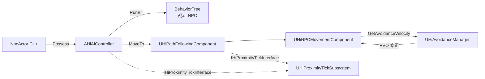
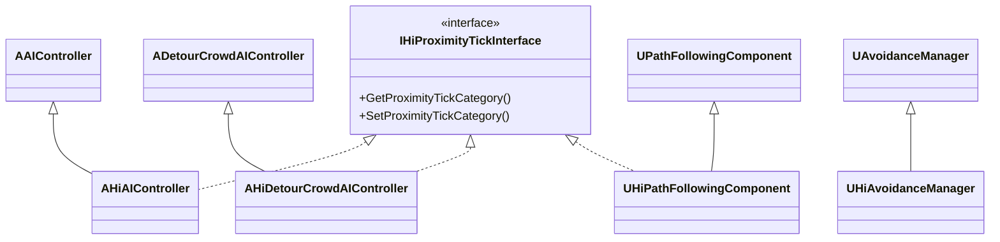
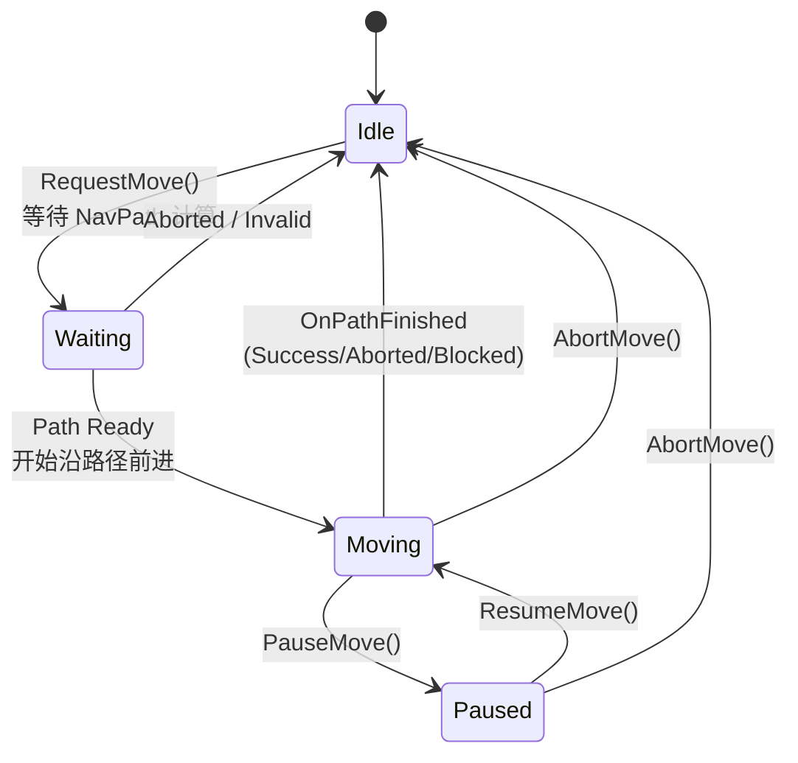
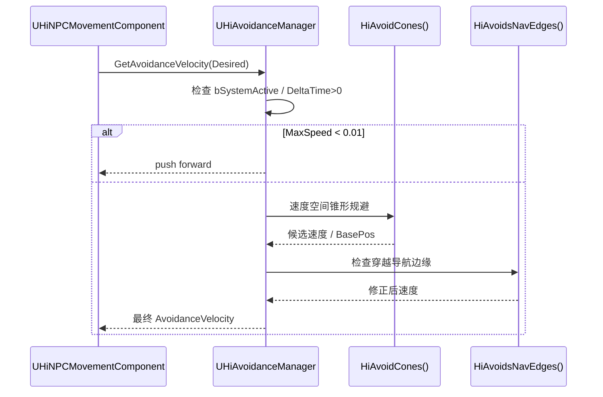

# 14. HiAIController + 寻路与规避

> HiGame 在 UE5 内置 AIController 之上的**轻量扩展层**:继承 `AAIController`、
> `ADetourCrowdAIController`、`UPathFollowingComponent`、`UAvoidanceManager` 四个引擎类,
> 通过 `IHiProximityTickInterface` 接入 *Proximity Tick*(按距离玩家分级降频),
> 并对 RVO 规避做扩展以支持自定义 NavAvoidBox。它本身**不重写寻路算法**,只包装
> BehaviorTree 启停接口并提供 GameplayDebugger 类目。[^npc-12]

## 1. HiAI 在 NPC 中的定位



四个核心类共享一个事实:**全部接入 `IHiProximityTickInterface`**,持有
`FHiProximityTickCtrl ProximityTickCtrl`,`BeginPlay` 时向
`UHiProximityTickSubsystem` 注册自己,实现距离分级 Tick。

## 2. C++ 类层次



| 类名 | 父类 | 一句话职责 |
|---|---|---|
| `AHiAIController` | `AAIController` + `IHiProximityTickInterface` | NPC 默认 AIController,封装 BT 启停 + 调试输出 |
| `AHiDetourCrowdAIController` | `ADetourCrowdAIController` + `IHiProximityTickInterface` | 启用 DetourCrowd 群体寻路 |
| `UHiPathFollowingComponent` | `UPathFollowingComponent` + `IHiProximityTickInterface` | PathFollowing 的 Proximity Tick 包装 |
| `UHiAvoidanceManager` | `UAvoidanceManager` | 重写 RVO,支持 NavAvoidBox |
| `FHAIRepData` | (USTRUCT) | 调试器复制数据包,持 `TArray<FString>` |
| `FGameplayDebuggerCategory_HiAI` | `FGameplayDebuggerCategory` | GameplayDebugger 中的 "HiAI" 类目 |

## 3. AHiAIController

```cpp
UCLASS()
class HIGAME_API AHiAIController : public AAIController, public IHiProximityTickInterface
{
    GENERATED_BODY()
public:
    AHiAIController();
    UFUNCTION(BlueprintCallable, Category = "AI") void StopBehaviorTree();
    UFUNCTION(BlueprintCallable, Category = "AI") void PauseBehaviorTree(const FString& Reason);
    UFUNCTION(BlueprintCallable, Category = "AI") void ResumeBehaviorTree(const FString& Reason);
    UFUNCTION(BlueprintCallable, Category = "AI") FString GetAIDebugInfo() const;
    UFUNCTION(BlueprintCallable, Category = "AI") FString GetBTDebugInfo() const;

    void Tick(float DeltaTime) override;
    void BeginPlay() override;
    void EndPlay(const EEndPlayReason::Type EndPlayReason) override;

    EHiProximityTickCategory GetProximityTickCategory() const override;
    void SetProximityTickCategory(EHiProximityTickCategory NewCategory, int NewTickRoundGap) override;
private:
    FHiProximityTickCtrl ProximityTickCtrl;
};
```

### 3.1 UPROPERTY / UFUNCTION 表

| 成员 | 类型 / 反射 | 说明 |
|---|---|---|
| `ProximityTickCtrl` | `FHiProximityTickCtrl`(私有,**无** UPROPERTY) | 距离 Tick 控制器 |
| `BrainComponent`(继承) | `UBrainComponent*`(继承父类反射) | 强转为 `UBehaviorTreeComponent` 使用 |
| `bAttachToPawn`(继承) | bool;构造函数置 `true` | 挂在被控制 Pawn 上 |
| `StopBehaviorTree()` | `BlueprintCallable, Category="AI"` | 整树停止 |
| `PauseBehaviorTree(Reason)` | `BlueprintCallable, Category="AI"` | 暂停 + 原因日志 |
| `ResumeBehaviorTree(Reason)` | `BlueprintCallable, Category="AI"` | 恢复 + 原因日志 |
| `GetAIDebugInfo() const` | `BlueprintCallable, Category="AI"` | BT 状态 + 当前 Task |
| `GetBTDebugInfo() const` | `BlueprintCallable, Category="AI"` | 透传 `BrainComponent->GetDebugInfoString()` |

> `AHiAIController` **不声明任何新的 UPROPERTY**;BT 三件套共享统一模式:
> `BrainComponent` 强转 `UBehaviorTreeComponent` → 空则新建并替换 → 调用
> `StopTree(Safe)` / `PauseLogic(Reason)` / `ResumeLogic(Reason)`。

### 3.2 Proximity Tick 节流

```cpp
void AHiAIController::Tick(float DeltaTime)
{
    DeltaTime = ProximityTickCtrl.Tick(DeltaTime);
    if (DeltaTime <= 0) return;        // 当前帧被跳过
    Super::Tick(DeltaTime);
}
```

返回 `<=0` 跳过本帧 `Super::Tick`,达到按距离玩家降频的目的。
`BeginPlay` 在 server 上注册到 `UHiProximityTickSubsystem`,`EndPlay` 反注册。

## 4. AHiDetourCrowdAIController

```cpp
UCLASS()
class HIGAME_API AHiDetourCrowdAIController : public ADetourCrowdAIController, public IHiProximityTickInterface
{
    GENERATED_BODY()
public:
    AHiDetourCrowdAIController(const FObjectInitializer& ObjectInitializer = FObjectInitializer::Get());
    void Tick(float DeltaTime) override;
    void BeginPlay() override;
    void EndPlay(const EEndPlayReason::Type EndPlayReason) override;
    EHiProximityTickCategory GetProximityTickCategory() const override;
    void SetProximityTickCategory(EHiProximityTickCategory NewCategory, int NewTickRoundGap) override;
private:
    FHiProximityTickCtrl ProximityTickCtrl;
};
```

| 维度 | `AHiAIController` | `AHiDetourCrowdAIController` |
|---|---|---|
| 父类 | `AAIController` | `ADetourCrowdAIController` |
| 群体寻路 | 不参与 `UCrowdManager` | 自动接入 `UCrowdManager`(DetourCrowd) |
| BT 启停接口 | 提供 `Stop/Pause/Resume` | 无,走父类 |
| 调试方法 | `GetAIDebugInfo/GetBTDebugInfo` | 仅 Proximity Tick |
| 适用场景 | 普通剧情 / 战斗 NPC | 群体生物 / 避让密集场景 |

`Tick / BeginPlay / EndPlay` 与 `AHiAIController` **完全同构**,只接 Proximity Tick。

## 5. UHiPathFollowingComponent 状态机

```cpp
UCLASS()
class HIGAME_API UHiPathFollowingComponent : public UPathFollowingComponent, public IHiProximityTickInterface
{
    GENERATED_UCLASS_BODY()
    void TickComponent(float DeltaTime, ELevelTick TickType, FActorComponentTickFunction* ThisTickFunction) override;
    void BeginPlay() override;
    EHiProximityTickCategory GetProximityTickCategory() const override;
    void SetProximityTickCategory(EHiProximityTickCategory NewCategory, int NewTickRoundGap) override;
private:
    FHiProximityTickCtrl ProximityTickCtrl;
};
```

`UHiPathFollowingComponent` **没有自定义状态机**,直接复用父类
`UPathFollowingComponent` 的 `EPathFollowingStatus`:



派生层只覆写两个回调:`TickComponent`(套 `ProximityTickCtrl.Tick` 后透传 `Super`)、
`BeginPlay`(`Super` + `ProximityTickCtrl.Reset()`)。`OnPathFinished` /
`RequestMove` / `AbortMove` / `OnLanded` **全部继承父类不覆写**。

| C++ 枚举 | Lua 镜像 | 典型值 |
|---|---|---|
| `EPathFollowingResult::Type` | `npc_const.Enum_PathFollowingResult` | `Success` / `Blocked` / `OffPath` / `Aborted` / `Skipped` / `Invalid` |
| `EPathFollowingRequestResult::Type` | `npc_const.Enum_PathFollowingRequestResult` | `Failed` / `AlreadyAtGoal` / `RequestSuccessful` |

## 6. UHiAvoidanceManager

```cpp
UCLASS(Blueprintable)
class HIGAME_API UHiAvoidanceManager : public UAvoidanceManager
{
    GENERATED_UCLASS_BODY()
protected:
    FVector GetAvoidanceVelocity_Internal(const FNavAvoidanceData& inAvoidanceData,
                                          float DeltaTime, int32* inIgnoreThisUID) override;
public:
    int RegisterAvoidanceBoxComponent(UHiNavAvoidBoxComponent* NavAvoidanceBox);
};
```



`UHiAvoidanceManager` 在引擎 RVO 之上做两件事:

1. **重写 `GetAvoidanceVelocity_Internal`** — 调文件级辅助函数:
   - `HiAvoidCones(...)`:每个动态障碍生成一对 `FVelocityAvoidanceCone::ConePlane[2]`
     平面,逐锥裁剪 `CurrentPosition`,卡死时回退 `BasePosition`
   - `HiAvoidsNavEdges(...)`:用 `FNavEdgeSegment` 数组判断速度是否穿越 NavMesh 边缘,
     2D 叉积解直线相交
2. **新增 `RegisterAvoidanceBoxComponent(...)`** — 把自定义
   `UHiNavAvoidBoxComponent` 作为**静态长方形规避盒子**注入 RVO,弥补默认
   `UAvoidanceManager` 只支持"圆柱体 Agent"的不足

> `UHiAvoidanceManager` 是**被动调用方**:`UHiNPCMovementComponent` 每帧调
> `GetAvoidanceVelocity` → `_Internal`。`UHiPathFollowingComponent` **不直接调用**
> Avoidance,只把"沿路径期望速度"喂给 MovementComp,后者再让 AvoidanceManager 修正。

## 7. 与 NPC 系统耦合点

```mermaid
sequenceDiagram
    participant Lua as NpcActiveObject (Lua)
    participant Actor as NpcActor (C++)
    participant AIC as AHiAIController
    participant PFC as UHiPathFollowingComponent
    participant MOV as UHiNPCMovementComponent
    participant AVM as UHiAvoidanceManager

    Lua->>Actor: Mail: Move_To_Way_Point(Loc)
    Actor->>AIC: GetController() + MoveToLocation(Loc)
    AIC->>PFC: RequestMove(FAIMoveRequest)
    PFC->>PFC: NavPath 计算 → State=Moving
    loop 每帧 Tick
        PFC->>MOV: 期望速度
        MOV->>AVM: GetAvoidanceVelocity()
        AVM-->>MOV: 修正后速度
    end
    PFC->>AIC: OnRequestFinished(EPathFollowingResult)
    AIC->>Actor: Move 完成回调
    Actor->>Lua: Mail Response (Enum_PathFollowingResult)
```

- `NpcActiveObject` 通过 `npc_actor:GetController()` 获取 `AHiAIController`,**不直接持有**
- 移动 mail (`Move_To_Way_Point` / `Move_To_Actor`)走 `MoveToLocation` → 完成回调
  `OnRequestFinished` → `EPathFollowingResult` 桥接 mail 反馈 Lua
- BT 启停 mail (`Action_Pause_BT` / `Action_Resume_BT`)落到 `Pause/ResumeBehaviorTree`
- `AHiCharacter::CollectAIDebugData` / `DrawAIDebugData` 是
  `FGameplayDebuggerCategory_HiAI` 的数据源

## 8. PathFollowingResult 在 Lua 侧的处理

```lua
-- npc_const.lua (镜像 EPathFollowingResult,值与 C++ 严格一致)
npc_const.Enum_PathFollowingResult = {
    Success    = 0,  -- 走到目标
    Blocked    = 1,  -- 被障碍堵住
    OffPath    = 2,  -- 偏离路径
    Aborted    = 3,  -- AbortMove() 主动取消
    Skipped    = 4,  -- 跳过(队列被覆盖)
    Invalid    = 5,  -- 路径无效
}
npc_const.Enum_PathFollowingRequestResult = {
    Failed = 0, AlreadyAtGoal = 1, RequestSuccessful = 2,
}

-- 状态机分支(伪代码)
function StateMoving:OnMoveFinished(result)
    if result == npc_const.Enum_PathFollowingResult.Success then
        self:Transit("StateIdle")
    elseif result == npc_const.Enum_PathFollowingResult.Blocked then
        self:RetryOrFallback()
    elseif result ~= npc_const.Enum_PathFollowingResult.Aborted then
        self:OnMoveFailed(result)
    end
end
```

> Lua 枚举值必须与 C++ **保持一致**(直接强转)。`UHiPathFollowingComponent`
> 不改变这些枚举,镜像表只需对齐引擎原始定义。

## 9. 调优 / 调试

```cpp
// DetourCrowd 全局参数(对 AHiDetourCrowdAIController 生效)
ai.crowd.UpdateInterval 0.1     // 群体寻路更新间隔
ai.crowd.MaxAgents 100          // 最大 Agent 数

// PathFollowing / Avoidance 日志
LogPathFollowing Verbose
LogNavigation Verbose
LogAvoidance Verbose

// GameplayDebugger:按 ' 打开,选 "HiAI" 类目
//   显示:BT Active Task / PathFollowing 状态 / Move 目标 / FHAIRepData::DebugStrs
```

| 调优维度 | 建议 | 备注 |
|---|---|---|
| `ProximityTickCtrl` 分级 | 远距离 NPC 用 `Lazy` | 大幅降 server CPU |
| `NavAvoidBox` 数量 | 单 NPC ≤ 8 | 锥形裁剪 O(N) |
| Crowd MaxAgents | ≤ 100 | 超过触发 Detour fallback |
| BT Pause Reason 字符串 | 必填 | 走 `PauseLogic(Reason)` 日志可追 |

## 10. 跨页链接

- → [02. NpcActiveObject](02.%20NpcActiveObject.md):Lua 侧 `npc_actor:GetController()` 入口
- → [09. 移动相关 Mail / WayPoint](09.%20移动相关%20Mail.md):`Move_To_Way_Point` mail 触发本页链路
- → [11. CustomTask 五件套](11.%20CustomTask%20五件套.md):Move 子目录 CustomTask 调 PathFollowing
- → [13. C++ NPC Component](13.%20Significance%20与性能分级.md):`UHiNPCMovementComponent` 与 PathFollowing 协作
- → [15. BehaviorTree 与战斗 NPC](15.%20BehaviorTree%20与战斗%20NPC.md):BT owner 是 `AHiAIController`,Lua 镜像枚举详表

[^npc-12]: raw/npc-12-hi-ai-controller.md
