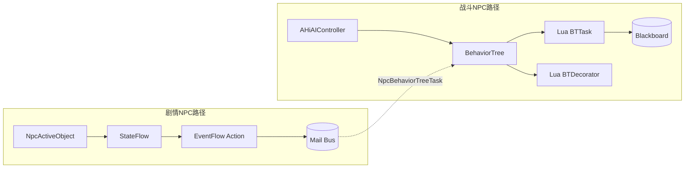
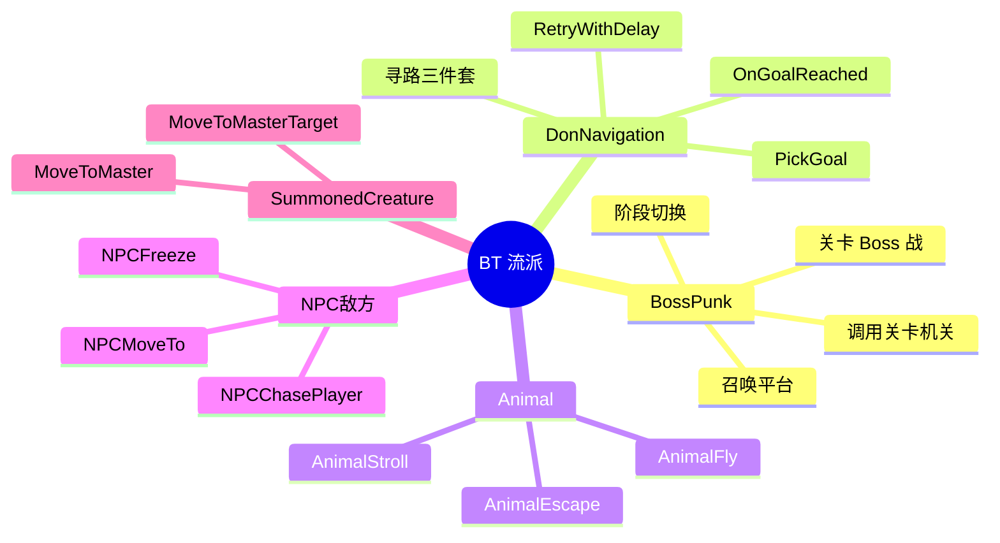
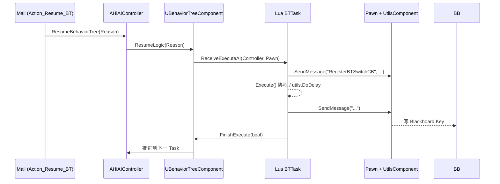
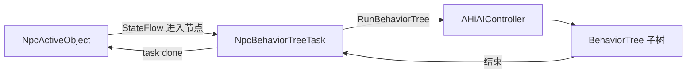
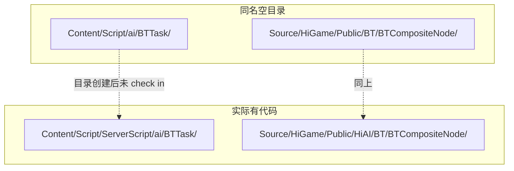
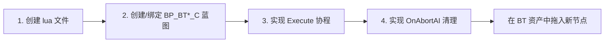

# 15. BehaviorTree 与战斗 NPC

> HiGame 战斗向 NPC（Boss / Animal / SummonedCreature / 敌方 NPC）走 **UE5 标准 BehaviorTree + Blackboard** 管线，
> Owner Controller 是 `AHiAIController`，BT 节点通过"蓝图 + UnLua 绑定"实现成 lua class，并按 *流派 (faction)* 切目录。
> 它和剧情 NPC 的 `NpcActiveObject + StateFlow` 路线**完全分开**，仅在 `NpcBehaviorTreeTask` 这一个桥接点相遇。

## 1. 剧情 NPC vs 战斗 NPC 的分野

两条路径在仓库里物理分目录、运行期甚至跨 VM（Lua 服务器 VM 与客户端 VM）。
新加战斗逻辑应该走 BT，新加剧情逻辑应该走 ActiveObject——这条边界要早分清，避免把决策塞到错的地方。[^npc-14]

| 维度 | 剧情 NPC (npc-05) | 战斗 NPC (本页) |
|---|---|---|
| 顶层调度 | `NpcActiveObject` + `StateFlow` 节点链 | `AHiAIController` + `UBehaviorTree` |
| 行为单元 | Mail handler / EventFlow Action | BT Task / Decorator / Service |
| 配置方式 | DataTable 中的 EventFlow 行 | UE BT 资产 (`.uasset`) + Blueprint 子类 |
| 通信媒介 | Mail（异步消息队列） | Blackboard Key + `Pawn:SendMessage` |
| 节点基类 | `NpcActiveObject` (lua) + `NodeComponent` (lua) | `BTTask_Base` (lua) + `BP_BTTask*_C` (BP) |
| Lua 介入度 | 重——业务核心几乎全在 lua | 轻——Task / Decorator 用 lua，调度仍是 C++ BT |
| 中断协议 | `StopReason` 枚举 (npc-15) | `bCanBreakCurBTNode` + `OnSwitch / OnBreak / OnAbortAI` |
| 典型用例 | 寒暄 / 送任务 / 巡逻 / 收菜 | Boss 多阶段 / 动物 AI / 召唤物 / 战斗 |



## 2. BossPunk vs DonNavigation 流派

HiGame 把 BTTask lua 按 **faction 子目录** 组织：`BTTask/BossPunk/`、`BTTask/DonNavigation/`、`BTTask/Animal/`、
`BTTask/NPC/`、`BTTask/SummonedCreature/`、再加根目录 70+ 个通用 `BTTask_HI_*`。Decorator / Service 同构。
两个最鲜明的对照流派如下：



| 流派 | 用途 | 主要 Task | 主要 Decorator |
|---|---|---|---|
| **BossPunk** | 关卡 Boss 战机关交互 | `BTTask_HI_CallMovePlatform` | （Boss 流派 decorator 在 `BTDecorator/Boss/`） |
| **DonNavigation** | Don 风格寻路决策 | `BTTask_HI_PickGoal` / `BTTask_HI_OnGoalReached` / `BTTask_HI_RetryWithDelay` | (使用通用条件 decorator) |
| **Boss (decorator)** | Boss 战条件分支 | — | `BTDecorator_HI_IsDogInTrap` 等 |
| **Animal** | 动物 AI 行为 | `AnimalEscape` / `AnimalFly` / `AnimalStroll` 等 6 个 | — |
| **NPC** | 敌方/任务 NPC 战斗 | `NPCChasePlayer` / `NPCMoveTo` / `NPCDead` 等 6 个 | `BTDecorator_HI_IsInPlayerView` |
| **SummonedCreature** | 召唤物 | `HISC_MoveToMaster` / `HISC_MoveToMasterTarget` | `BTDecorator_HISC_IsMasterInBattle` |
| **通用根目录** | 跨流派复用 | 70+ `BTTask_HI_*`：移动 / 技能 / 动画 / 感知 / Buff / 巡逻 / Mirror | 40+ `BTDecorator_HI_*`：距离 / 血量 / CD / 概率 / 翻转开关 |

## 3. Lua BTTask 实现模式

`BTCommon/BTTask_Base.lua` 是所有战斗 lua BTTask 的**协程模板基类**，
绑定到 UE 的 `ReceiveExecuteAI` / `ReceiveAbortAI` / `ReceiveTickAI` 三个 lua 重载点（继承自蓝图基类 `BTTask_BlueprintBase`）。
子类只需覆写 `Execute(Controller, Pawn)`，按返回值落入三种语义分支：[^npc-14]

```lua
function BTTask_Base:ReceiveExecuteAI(Controller, Pawn)
    xpcall(function(...)
        Pawn:SendMessage("RegisterBTSwitchCB", self, self.OnSwitch)
        local ret = self:Execute(Controller, Pawn)
        if ret == ai_utils.BTTask_Succeeded then
            self:TaskFinish(Controller, Pawn, true)
        elseif ret == ai_utils.BTTask_Failed then
            self:TaskFinish(Controller, Pawn, false)
        end
        -- 不返回 → 进入"延迟完成"模式，Task 自己择机调 self:FinishExecute(bool)
    end, function(err) print(Pawn:GetDisplayName(), debug.traceback(err)) end)
end
```

**示例 1 — BossPunk/CallMovePlatform（同步立即返回）**：

```lua
function BTTask_CallMovePlatform:Execute(Controller, Pawn)
    if Pawn.MovePlatformActor ~= nil then
        return ai_utils.BTTask_Failed                      -- 平台已存在
    end
    local MovePlatformActor = GameAPI.SpawnActor(
        Pawn:GetWorld(), Pawn.MovePlatformActorClass,
        Pawn:GetTransform(), UE.FActorSpawnParameters(), {})
    Pawn:SendMessage("OnMovePlatformActorCreate", MovePlatformActor)
    return ai_utils.BTTask_Succeeded
end
```

**示例 2 — DonNavigation/OnGoalReached（延迟完成 / 协程化）**：

```lua
function BTTask_HI_OnGoalReached:Execute(Controller, Pawn)
    if Pawn and Pawn.OnGoalReached then
        local WaitTime, _ = Pawn:OnGoalReached()
        utils.DoDelay(Pawn, WaitTime, function()
            self:FinishExecute(true)                       -- 延时后手动 finish
        end)
        -- 此处没有 return → 基类不会立即 TaskFinish
    else
        self:FinishExecute(false)
    end
end

-- ReceiveAbortAI 的 hook：清理协程 / 回收资源
function BTTask_HI_OnGoalReached:OnAbortAI(Controller, Pawn)
    -- (基类提供空实现，子类按需覆写)
end
```

`ReceiveTickAI` 走相同 `xpcall` 包装：先 `CanBreak` 检查 `AIServerComponent.bCanBreakCurBTNode`，
满足则 `OnBreak` + `FinishExecute(true)` + `SendMessage("SetCurBTNodeBreak", false)` 主动让位；
否则调 `self:Tick(Controller, Pawn, DeltaSeconds, AIServerComponent)`，语义同 `Execute` 三态返回。

## 4. Lua BTDecorator 实现模式

Decorator 比 Task 简单——只回答"条件成立否"，没有协程，**不继承 `BTTask_Base`**，直接 `Class()` 起手。
覆写 `PerformConditionCheck(Controller)` 返回 bool 即可。

```lua
require "UnLua"
local G = require("G")

local BTDecorator_IsDogInTrap = Class()

function BTDecorator_IsDogInTrap:PerformConditionCheck(Controller)
    local Pawn = Controller:GetInstigator()
    return Pawn.UtilsComponent.DogInTrap                   -- 预聚合状态位
end

return BTDecorator_IsDogInTrap
```

| 设计取舍 | 说明 |
|---|---|
| `Class()` 直接起手 | 不挂 BTTask_Base 协程模板，省一层包装 |
| `Controller:GetInstigator()` | 比 `BTComponent:GetAIOwner():GetPawn()` 链路更短 |
| 直接读 `Pawn.UtilsComponent.<flag>` | 把 EQS / sensing 结果先在 C++ 侧聚合到 bool 上，避免每次 BT tick 重做 trace |
| 无副作用 | Decorator 不写 BB、不发 Mail，纯函数检查 |

## 5. C++ BTCompositeNode 子集

HiGame 真正的自定义 BT C++ 节点全部集中在 `Source/HiGame/Public/HiAI/BT/` 下；
而 `Source/HiGame/Public/BT/BTCompositeNode/` 这个看似平级的目录虽然存在，但**没有任何头/源文件**（详见 §9）。

| 类名 | 文件 | 职责 |
|---|---|---|
| `UHiBTCompositeNode_RandomWeight` | `HiAI/BT/BTCompositeNode/HiBTCompositeNode_RandomWeight.h/.cpp` | 按权重随机选一个子分支执行；失败后从剩余分支重新加权抽取，全部失败才 ReturnToParent |
| `UHiBTTask_SetRandomWeight` | `HiAI/BT/BTTask/HiBTTask_SetRandomWeight.h` | 配套 task：把指定 NodeName 的权重以 JSON 写入 BB 的 `ExtraRandomWeight` 键，实现 per-AI 权重微调 |

`UHiBTCompositeNode_RandomWeight::GetNextChildHandler` 关键流程：

```cpp
// 伪代码：失败重选 + JSON 权重覆盖
int32 UHiBTCompositeNode_RandomWeight::GetNextChildHandler(
    FBehaviorTreeSearchData& SearchData, int32 PrevChild, EBTNodeResult::Type LastResult) const
{
    if (LastResult == EBTNodeResult::Succeeded) return BTSpecialChild::ReturnToParent;
    if (PrevChild != BTSpecialChild::NotInitialized) FailedChildren->Add(PrevChild);
    if (FailedChildren->Num() >= GetChildrenNum()) return BTSpecialChild::ReturnToParent;

    TArray<int32> Weights = WeightPerBranch;                       // CDO 默认
    FString ExtraJSON;
    if (BB->GetValueAsString(TEXT("ExtraRandomWeight"), ExtraJSON))
        Override(Weights, ExtraJSON, GetMyNode()->NodeName);       // 反序列化覆盖
    for (int32 Idx : *FailedChildren) Weights[Idx] = 0;            // 已失败清零

    return PickByPrefixSum(Weights, FMath::RandRange(0, Sum(Weights)));
}
```

## 6. BTService / BTCommon

`BTService/` 目录**非空**，共 12 个 lua service，覆盖感知 / 状态写入 / 速率/朝向控制；`BTCommon/` 仅一个文件 `BTTask_Base.lua`，即 §3 协程基类。

| 子目录 | 文件数 | 代表条目 |
|---|---|---|
| `BTService/` (根) | 12 | `CheckAbilityHitTarget`, `EnterAlertState`, `PrepareToCapture`, `SetBuildingsCanBlast`, `SetCounter`, `SetDesiredRotationMode`, `SetMoveType`, `SetRandomWeight`, `SetSpeed`, `SetSpeedByConfig`, `WaitAction_Dist`, `WaitAction_Energy` |
| `BTCommon/` | 1 | `BTTask_Base.lua`（lua Task 协程模板基类） |

```lua
-- BTService 与 BTTask 的区别：service 在所属 composite 节点 active 期间周期 tick
-- 不返回 succeeded/failed，仅副作用（写 BB、改 Pawn 状态）
function BTService_SetSpeed:ReceiveTickAI(Controller, Pawn, DeltaSeconds)
    Pawn:SendMessage("SetMaxWalkSpeed", self.TargetSpeed)
end
```

## 7. 与 HiAIController 的握手

BT 的 `AIOwner` = `AHiAIController`（npc-12）；它持有 `BehaviorTreeComponent` 与 `BlackboardComponent`，
并把 Pawn 注入为 `Controller:GetInstigator()` 返回值。BT 启停三件套（`Stop/Pause/ResumeBehaviorTree`）由 controller 统一暴露给上层。[^npc-12]



**典型 Blackboard Key**（从代码反推）：

| Key 名 | 类型 | 写入方 | 用途 |
|---|---|---|---|
| `GoalKey` | Vector | `BTTask_HI_PickGoal` | DonNavigation 的当前导航目标 |
| `ExtraRandomWeight` | String (JSON) | `UHiBTTask_SetRandomWeight` | RandomWeight composite 的权重覆盖 |
| `TargetActor` / `TargetLocation` / `FocalPoint` / `Counter` | 多种 | `BTTask_HI_Set*` 系列 | 通用感知 / 朝向 / 计数键 |

## 8. NpcBehaviorTreeTask 桥接

`NpcCustomTask` 五件套（npc-10）中的 **`NpcBehaviorTreeTask`** 是把一棵 BT 子树包装成 ActiveObject 路径下的 task，
让剧情 NPC（数据驱动状态机）在某个节点临时插入 BT 决策——这是两条路径**唯一**的相交点。



| 项 | 说明 |
|---|---|
| 桥接方向 | 单向：ActiveObject → BT（不反过来由 BT 调用 ActiveObject 节点） |
| 用途 | 剧情中临时给 NPC 套一段战斗 / 复杂行为子树 |
| 完成回调 | BT 子树跑完后由 `NpcBehaviorTreeTask` 上报给 `NpcActiveObject`，推进 StateFlow 到下一节点 |
| 与 npc-15 关系 | `Enum_BehaviorTreeTaskType` / `EBehaviorTreeType` 即 NpcBehaviorTreeTask 与 BT 之间的协议常量分类码 |

## 9. ServerScript/ai 镜像问题

仓库里有两组**看起来重复**的目录，但只有一组真正住代码——这是 DDS 架构的副产物：BT 决策只在 server VM 跑，client VM 不需要镜像 lua。



| 看似路径 | 实际位置 | 状态 |
|---|---|---|
| `Content/Script/ai/BTTask/...` | `Content/Script/ServerScript/ai/BTTask/...` | 题目根目录为空，所有 BT lua 在 ServerScript 镜像 |
| `Content/Script/ai/BTDecorator/...` | `Content/Script/ServerScript/ai/BTDecorator/...` | 同上 |
| `Content/Script/ai/BTService/...` | `Content/Script/ServerScript/ai/BTService/...` | 同上（12 个 service 全在 server 侧） |
| `Source/HiGame/Public/BT/BTCompositeNode/` | `Source/HiGame/Public/HiAI/BT/BTCompositeNode/` | 平级目录存在但**无任何文件**，自定义 C++ 节点全在 HiAI/BT 下 |

> 维护提示：找不到 BT lua 的时候**永远先去 ServerScript 镜像**；C++ BT 节点先去 `HiAI/BT/`。

## 10. 添加新 Lua BTTask 的清单

> 实操 checklist。新增一个 Boss 战 task 的标准动作是这 4 步——少一步都跑不起来：



1. **位置**：在 `Content/Script/ServerScript/ai/BTTask/<Faction>/` 下加 lua 文件；继承 `BTTask_Base`
   （`local BTTask = require("ServerScript.ai.BTCommon.BTTask_Base"):New()`）。
2. **绑定蓝图**：在 `Content/Blueprints/AI/BTTask/` 创建 `BP_BTTask_HI_<Name>_C`，UnLua `@type` 注解指向上一步的 lua 模块；蓝图基类选 `BTTask_BlueprintBase`。
3. **协程**：覆写 `Execute(Controller, Pawn)`，根据是否需要等待选择**同步三态返回**或**延迟完成 + `self:FinishExecute(bool)`**。需要 BT tick 时再覆写 `Tick`。
4. **清理**：覆写 `OnAbortAI(Controller, Pawn)` 取消未完成的 timer / coroutine，避免 `FinishExecute` 在节点已 abort 后被回调（基类提供空实现，子类按需）。

可选第 5 步：如果 task 需要新的 BB Key，先在 BT 资产配套的 `BB_*` Blackboard 资产里登记 Key 名 + 类型。

## 11. 跨页链接

| 目标页 | 关系 | 关键交点 |
|---|---|---|
| → [14. HiAIController + 寻路与规避](14.%20HiAIController%20+%20寻路与规避.md) | BT owner | `Stop/Pause/ResumeBehaviorTree` 接口；`Controller:GetInstigator()` 回 Pawn；Proximity Tick 节流 |
| → [11. CustomTask 五件套](11.%20CustomTask%20五件套.md) | 桥接 | `NpcBehaviorTreeTask` 把 BT 子树嵌入 ActiveObject 路径 |
| → [5. NpcActiveObject 与 13 状态机](5.%20NpcActiveObject%20与%2013%20状态机.md) | 平行路径 | 剧情 NPC 的另一条决策路径，与本页正交 |
| → [13. Significance 与性能分级](13.%20Significance%20与性能分级.md) | 性能 | BT Tick 频率与 ProximityTick 联动的总开销账 |
| → [8. EventFlow — 28 个 Action 节点](8.%20EventFlow%20—%2028%20个%20Action%20节点.md) | Mail 入口 | `Action_Pause_BT` / `Action_Resume_BT` 落到 `AHiAIController` |

[^npc-12]: raw/npc-12-hi-ai-controller.md
[^npc-14]: raw/npc-14-behavior-tree.md
