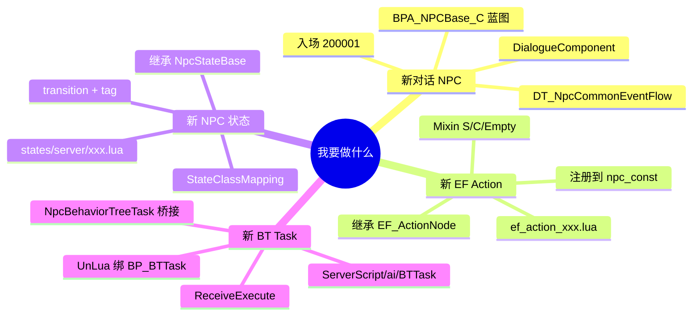
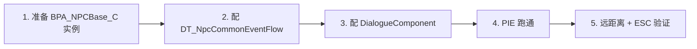
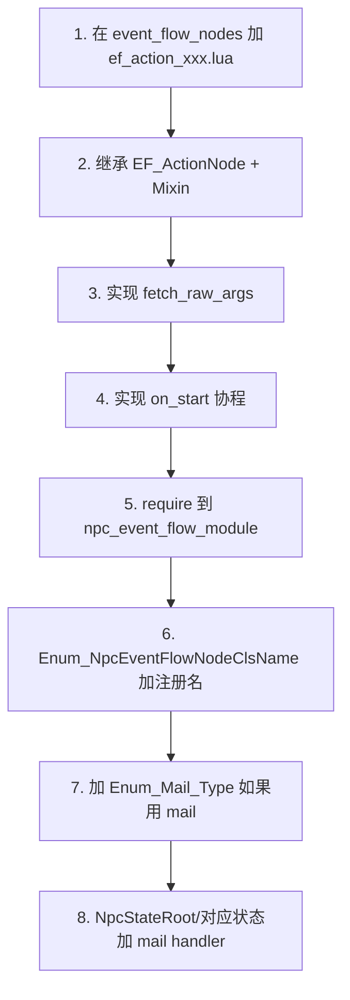
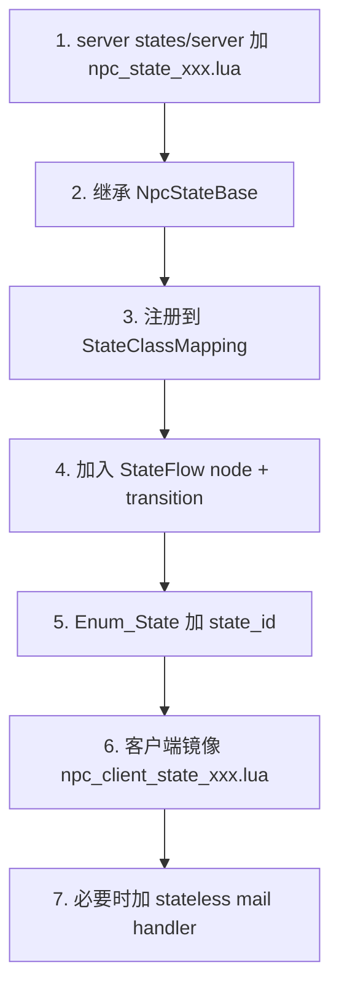
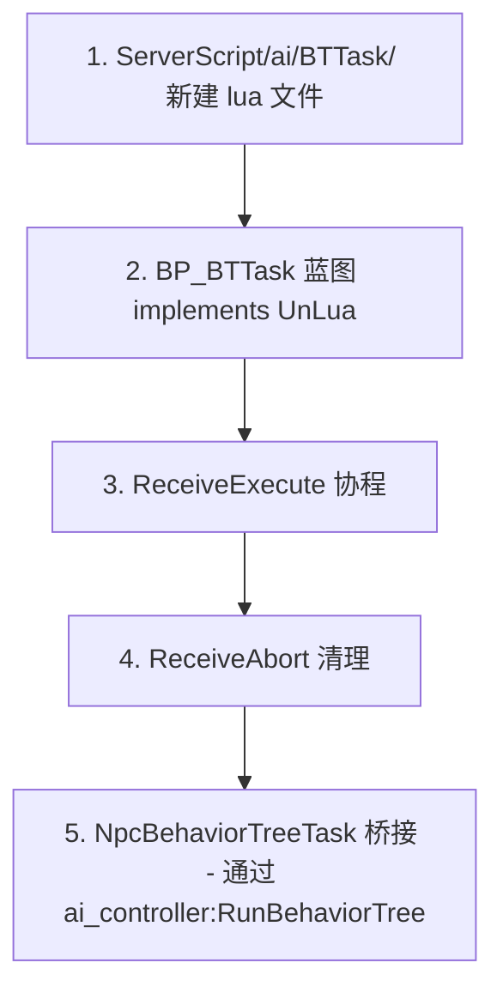
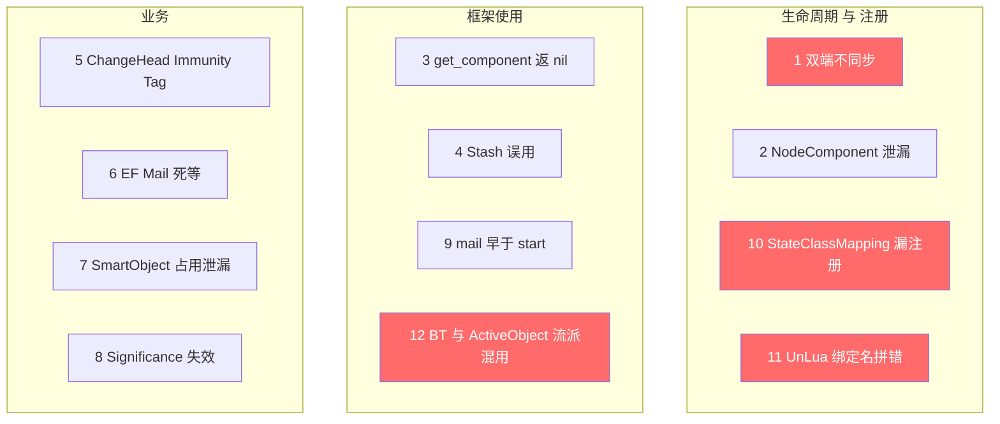
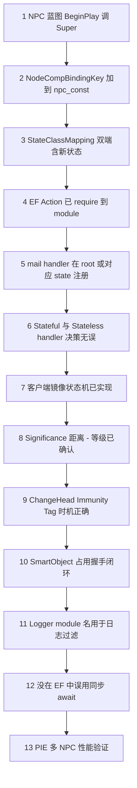
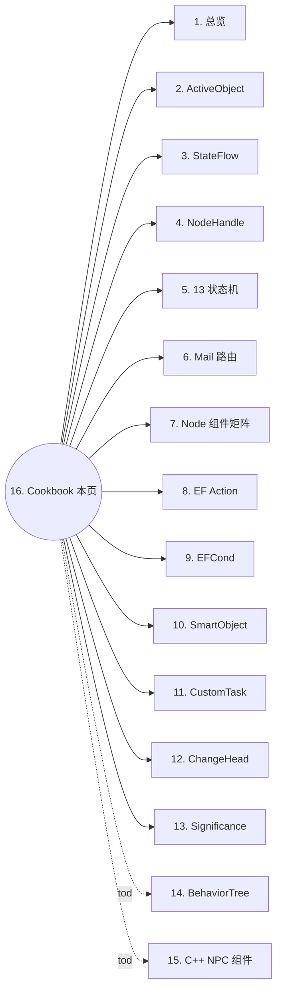

# 16. Cookbook + 陷阱 + 自检清单

> 本页是 NPC 脚本系统的"操作手册"。它把前 15 页拆散的概念,重新按"我要写什么"的视角缝起来:**4 类常见任务的 step-by-step 流程 + 12 类陷阱总结 + 13 项 AI 自检**。写新 NPC / 新状态 / 新 EF 节点 / 新 BT Task 前先看一遍,提交前再过一遍清单。所有结论来自 `Content/Script/npc/` 真实代码考古[^npc-01][^npc-05][^npc-07][^npc-08][^npc-10][^npc-15]。

## 1. Cookbook 速查



四类任务的入口路径表:

| 任务类型 | 主文件目录 | 关键注册点 | 常用模板页 |
|---|---|---|---|
| 新对话 NPC | `Content/Script/actors/common/NPC.lua` + `BPA_NPCBase_C` | DT_NpcCommonEventFlow + DialogueComponent | [1. 总览](1.%20总览%20—%20NPC%20全栈拓扑与启动链.md) |
| 新 EF Action | `Content/Script/npc/event_flow_nodes/` | `npc_event_flow_module.lua` + `Enum_NpcEventFlowNodeClsName` | [8. EF Action](8.%20EventFlow%20—%2028%20个%20Action%20节点.md) |
| 新 NPC 状态 | `Content/Script/npc/states/server/` | `NpcStateConfig.StateClassMapping` + `Enum_State` | [5. 13 状态机](5.%20NpcActiveObject%20与%2013%20状态机.md) |
| 新 BT Task | `Content/Script/ServerScript/ai/BTTask/` | UnLua `IUnLuaInterface` + `NpcBehaviorTreeTask` 桥接 | [11. CustomTask](11.%20CustomTask%20五件套.md) |

跨页关联:[2. ActiveObject](2.%20Kittens%20—%20ActiveObject%20与%20Mail.md) · [3. StateFlow](3.%20Kittens%20—%20StateFlow.md) · [4. NodeHandle](4.%20Kittens%20—%20NodeHandle%20与%20NodeComponent.md) · [6. Mail 路由](6.%20Mail%20类型与%20Handler%20路由.md) · [7. Node 组件矩阵](7.%20Node%20组件矩阵.md) · [9. EFCond](9.%20EventFlow%20Condition%20与%20Switch.md) · [10. SmartObject](10.%20SmartObject%20与%20WayPoint.md) · [12. ChangeHead](12.%20ChangeHead%20与%20Performance%20表演栈.md) · [13. Significance](13.%20Significance%20与性能分级.md).

## 2. 流程 A: 写一个新对话 NPC



**第 1 步 — 准备 BPA 实例**: 在关卡 `BPA_NPCBase_C` 拖一个新蓝图,蓝图必须 implements `UnLuaInterface`,`GetServerModuleName/GetClientModuleName` 返回 `actors.common.NPC`(已在 `NPC.lua` 中定义)[^npc-01]。

**第 2 步 — 配 EventFlow**: 在 `DT_NpcCommonEventFlow` 加一行,设置入场 `200001 NpcEntryPerformanceEventFlowId` 与销毁 `200002 NpcEntryDestroyEventFlowId`,以及自定义对话 flow id[^npc-07]。

**第 3 步 — 配 DialogueComponent**: 在 BPA 蓝图细节面板添加 `DialogueComponent`,并设 `DialogueId`/`InteractionMode`。验证条件:`server_logic_handle:get_component(NpcConst.NodeCompBindingKey.Interact_Comp)` 不为 nil[^npc-01]。

**第 4 步 — PIE 测试**: 启动 PIE,走近 NPC,按交互键触发对话。检查 Output Log 不能有 `EFConditionRegistry: no handler found` 这种 warn[^npc-08]。

**第 5 步 — Significance 验证**: 把摄像机拉到 5000+ 单位远,确认骨骼/Tick 已被 Significance 降级(默认 `node_handle_high=3000, movement_high=5000`)[^npc-15]。

```lua
-- 检查 NPC 起动是否成功的快速 print
function NPC:ReceivePostBeginPlay()
    Super(NPC).ReceivePostBeginPlay(self)
    local ao = ActiveObjectMgr:get_active_object_by_actor(self)
    print(string.format('[NPC] %s active_object=%s state_flow=%s',
        self:GetName(), tostring(ao), tostring(ao and ao.__state_flow)))
end
```

详见 [1. 总览](1.%20总览%20—%20NPC%20全栈拓扑与启动链.md) 和 [5. 状态机](5.%20NpcActiveObject%20与%2013%20状态机.md).

## 3. 流程 B: 写一个新 EventFlow Action 节点



**关键决策树** — 选 Mixin 类型[^npc-07]:

| 选择 | 何时用 | 父类 |
|---|---|---|
| `NpcEventFlowContextMixin` (N) | 仅基础接口(state tag/name/monologue/bubble) | nil |
| `CharacterNpcEventFlowContextMixin` (C) | 需要动画/移动/特效 | NpcEventFlowContextMixin |
| `S_NpcEventFlowContextMixin` (server character) | 服务端跑 + 走 send_mail | CharacterNpcEventFlowContextMixin |
| `C_NpcEventFlowContextMixin` (client character) | 客户端表演 + 走 local_dispatch_mail | CharacterNpcEventFlowContextMixin |
| `S_EmptyNpcEventFlowContextMixin` | 服务端纯逻辑 NPC | NpcEventFlowContextMixin |

**完整代码示例** — 一个等待 + 显示气泡的复合节点:

```lua
-- Content/Script/npc/event_flow_nodes/ef_action_wait_then_bubble.lua
local Kittens         = require 'kittens'
local EventFlowRepr   = Kittens.EventFlow.EventFlowRepr
local NpcConst        = require 'npc.npc_const'
local NpcEventFlowContextMixin = require 'npc.event_flow.npc_event_flow_context_mixin'

local EF_Action_WaitThenBubble = EventFlowRepr.create_event_flow_node_class(
    NpcConst.Enum_NpcEventFlowNodeClsName.EF_Action_WaitThenBubble,  -- 必须先在 npc_const 中加这个 key
    Kittens.EventFlow.EF_ActionNode)

function EF_Action_WaitThenBubble:fetch_raw_args(_raw_args)
    self.__args.wait_seconds = _raw_args.WaitSeconds or 1.0
    self.__args.bubble_id    = _raw_args.BubbleId
    self.__args.wait_complete = _raw_args.WaitComplete
end

function EF_Action_WaitThenBubble:on_start(_cancel_token)
    local ef = self:get_context():get_mixin(NpcConst.Event_Flow_Context_Include_Key)
    if not ef:isInstanceOf(NpcEventFlowContextMixin) then
        self:complete(nil, nil); return
    end
    -- 1. 等待 N 秒
    local err = Kittens.await(Kittens.Future.wait_for_seconds(self.__args.wait_seconds), _cancel_token)
    if err then self:complete(err, nil); return end
    -- 2. 显示气泡
    local promise = ef:show_bubble(self.__args.bubble_id, true, self.__args.wait_complete)
    if self.__args.wait_complete then
        local err2, _ = Kittens.await(promise:get_future(), _cancel_token)
        self:complete(err2, nil)
    else
        self:complete(nil, nil)
    end
end

return EF_Action_WaitThenBubble
```

**最后一步 — 引导注册**: 在 `npc_event_flow_module.lua` 的 require 列表末尾加 `require 'npc.event_flow_nodes.ef_action_wait_then_bubble'`,并在 `npc_const.lua` 的 `Enum_NpcEventFlowNodeClsName` 表中加 `EF_Action_WaitThenBubble = 'EF_Action_WaitThenBubble'`[^npc-15]。

详见 [8. EF Action](8.%20EventFlow%20—%2028%20个%20Action%20节点.md) 与 [9. EFCond](9.%20EventFlow%20Condition%20与%20Switch.md).

## 4. 流程 C: 写一个新 NPC 状态



**第 1 步 — 创建状态类**: 服务器 `Content/Script/npc/states/server/npc_state_dance.lua`,继承 `NpcStateBase`[^npc-05]:

```lua
local Kittens          = require 'kittens'
local NpcStateBase     = require 'npc.states.server.npc_state_base'
local NpcConst         = require 'npc.npc_const'
local StateMailHandlers = require 'npc.states.server.state_mail_handlers'

local NpcStateDance = Kittens.class('NpcStateDance', NpcStateBase)

function NpcStateDance:initialize(_active_object)
    NpcStateDance.super.initialize(self, _active_object)
    -- 复用 stateless handler
    self.__mail_switcher:copy_handler_item(StateMailHandlers, NpcConst.Enum_Mail_Type.Play_Anim_Montage)
    -- 自有 stateful handler
    self.__mail_switcher:case(NpcConst.Enum_Mail_Type.Stop_Dance, self.__handler_stop_dance)
end

function NpcStateDance:on_enter(_payload)
    NpcStateDance.super.on_enter(self, _payload)
    -- 进入舞蹈 mission session 等
end

function NpcStateDance:__handler_stop_dance(_mail)
    self.__active_object:stash(_mail)
    self:complete_state(true)  -- transition 回 source
end

return NpcStateDance
```

**第 2 步 — 注册 StateClassMapping**: 在 `npc_state_config.lua` (server) 中:

```lua
NpcStateConfig.StateClassMapping = {
    [Const.Enum_State.Dance] = require 'npc.states.server.npc_state_dance',
    -- ... 已有的 12 个状态
}
```

**第 3 步 — 加入 StateFlow**: 在 `get_npc_state_flow()` 中:

```lua
flow:add_state_flow_nodes({
    StateFlowNode:new({
        state_id = Const.Enum_State.Dance,
        parent = 'root',
        is_selector = false,
        state_tag = 'root.dance',
        transitions = {
            { trigger = StateFlowConst.Enum_TransitionTrigger.Success, target = StateFlowConst.Enum_ReservedStateId.source },
        },
    }, flow),
})
```

**第 4 步 — Enum_State 与 state_tag**: 在 `npc_const.lua` 的 `Enum_State` 加 `Dance = 'dance'`[^npc-15],并把 `'root.dance'` 加到 GameplayTag DT 或对应 tag 注册系统。

**第 5 步 — 客户端镜像**(可选,但有动画/UI 表演时必需): `npc/states/client/npc_client_state_dance.lua` + `npc_state_config.lua` (client) `StateClassMapping` 加一行。客户端没有显式 StateFlow,只 mapping[^npc-05]。

详见 [5. 13 状态机](5.%20NpcActiveObject%20与%2013%20状态机.md), [6. Mail 路由](6.%20Mail%20类型与%20Handler%20路由.md), [7. Node 组件](7.%20Node%20组件矩阵.md).

## 5. 流程 D: 写一个新 Lua BehaviorTree Task



**模板代码**:

```lua
-- Content/Script/ServerScript/ai/BTTask/citizen/bttask_walk_to_target.lua
---@type BP_BTTask_WalkToTarget_C
require 'UnLua'

local M = UnLua.Class()

function M:ReceiveExecute(OwnerActor)
    local ai = OwnerActor:GetController()
    local target = self.Blackboard:GetValueAsObject('TargetActor')
    if not target then
        self:FinishExecute(false)
        return
    end
    -- 直接调 controller MoveTo;HiAIController 已封装异步握手
    ai:MoveToActor(target, 50.0, true, true, false)
    -- 协程等待移动结束(具体根据 HiAIController 暴露的 promise/event 监听)
    -- ...
    self:FinishExecute(true)
end

function M:ReceiveAbort(OwnerActor)
    local ai = OwnerActor:GetController()
    ai:StopMovement()
end

return M
```

**关键集成点 — NpcBehaviorTreeTask 桥接**: 这个 BT 由 `NpcBehaviorTreeTask:execute_task` 通过 `Enum_BehaviorTreeTaskType` 路由触发[^npc-10]:

| bt_type 值 | 处理 | 适合 |
|---|---|---|
| `Move = 1` | `start_move` → fire `EF_Action_MoveToWayPoint` 子 EF | 简单移动 |
| `PlayAnimation = 2` | `start_play_animation` → fire `EF_Action_PlayDynamicMontage` | 表演动画 |
| `Dead = 3` | `show_dead_display` + `stop_behavior_tree` | 死亡 |
| `ShowBubble = 4` | send_mail Show_Bubble | 头顶气泡 |
| `StopBT = 5` | `ai_controller:StopBehaviorTree()` | 强制停 BT |
| `FollowPlayer = 6` | send_mail Move_To_Way_Point + `move_way_type=FollowActor` | 跟随玩家 |

如果你的 BT Task 只是 `Move/PlayAnim/ShowBubble` 这种通用动作,**不要写新文件**, 用已有 NpcBehaviorTreeTask 路由即可。详见 [11. CustomTask](11.%20CustomTask%20五件套.md).

## 6. 12 类常见陷阱



### 陷阱 1: 双端不同步 (server 改了状态, client 不知道)
**症状**: 服务端 NPC 已经进入 `Dialogue`, 客户端表现还在 `Normal`(动画/UI 不切换)。
**根因**: NPC 没有 state replication, 双端各自跑自己的 `StateFlow`, 同步只通过 mail/RPC/Replicated UProperty 三条路径[^npc-05]。
**解决**: server stateful handler 处理后必须 `send_mail` 给客户端 mail_dispatcher;客户端 `npc_state_config.lua` 的 `StateClassMapping` 必须有对应类。

### 陷阱 2: 热更/退出时 NodeComponent 泄漏
**症状**: PIE 多次 Stop/Start 后 component 残留, 旧 self 仍被回调。
**根因**: `handle:add_component(...)` 第 4 参 `true` 表示 binding key 持久化, 不会随 state 退出自动清理[^npc-05]。
**解决**: state `on_leave` 中显式 `handle:remove_component(BindingKey)`, 或确认 component 生命周期与 handle 一致(handle 销毁时自动释放)。

### 陷阱 3: handle:get_component 返回 nil
**症状**: `state_component:add_state_tag` 报 nil。
**根因**: 在 `NpcStateRoot:initialize` 完成 9 个 `add_component` 之前调用 get_component[^npc-01]。
**解决**: 确保你的代码在 root state 进入后才访问 component;或用 `handle:get_or_add_component`。

### 陷阱 4: Stash 误用 (该 stash 不 stash, 或 stash 后忘 unstash_all)
**症状**: 状态切换后,原本应该执行的 mail 丢失;或者状态进入后被旧 mail 重复触发。
**根因**: `__active_object:stash(_mail)` 只把当前 mail 暂存到 active object,需要新 state 在 `on_enter` 通过 `unstash_all()` 释放[^npc-05]。Stateful handler 不 stash 直接 transition_to_state 会丢 mail。
**解决**: 切状态前 `stash(_mail)` + `transition_to_state(target)`;新 state `on_enter` 已自动调 `become(switcher, true)` 内部 unstash, 不要手动重复。

### 陷阱 5: ChangeHead Immunity Tag 不生效
**症状**: 角色在变头表演中,被外部 `PlayPerformanceChangeHead` 二次触发,导致表演重叠。
**根因**: `ChangeHead_Immunity_Tag` 只在 mission session 内才生效, 进 ChangeHead 前没 `enter_mission_session` 就没保护[^npc-15]。
**解决**: `__handle_play_performance_change_head` 内先校验 mission session 状态, 再 stash + transition;离场时 `exit_mission_session` 移除 tag。

### 陷阱 6: EventFlow Mail 死等不响应
**症状**: `EF_Action_PlayAnimMontage` await 永远不返回。
**根因**: `wait_complete=true` 但 server 端 mail handler 没 fulfill promise(如忘了 `promise:fulfill(nil, result)`)[^npc-07]。
**解决**: 检查 mail handler 末尾必须 fulfill;或把 `WaitComplete` 字段改为 false 走 fire_and_forget。

### 陷阱 7: SmartObject 占用泄漏 (Claimed → 未到达 → 未释放)
**症状**: 同一 way_point 第二次 claim 失败, 永远占用。
**根因**: `EF_Action_OccupySmartObject` 在 NPC 死亡或 EF 中断时没释放 warpper[^npc-07]。
**解决**: 配套使用 `EOccupyMode=Free` 节点显式释放;或在 `npc_actor.occupy_warpper` 上挂 cleanup hook。详见 [10. SmartObject](10.%20SmartObject%20与%20WayPoint.md).

### 陷阱 8: Significance 超距离 NPC 仍在 tick
**症状**: 远距离(>5000)的 NPC 还在跑动画/移动 tick, 客户端 CPU 飙高。
**根因**: NPC 没添加 `VisibilityComponent` / `Significance_Comp`[^npc-15]。
**解决**: BPA 蓝图细节面板加 `VisibilityManagementComponent`, 验证 `handle:get_component(Significance_Comp)` 不为 nil。详见 [13. Significance](13.%20Significance%20与性能分级.md).

### 陷阱 9: state_flow:start() 之前调 mail
**症状**: 早期 mail 全部丢失或抛错。
**根因**: `NpcActiveObject:initialize` 内的 4 步握手:`get_handle → get_state_component → create_instance → start()`,在 start 之前 send_mail 时 dispatcher 还没 attach[^npc-01]。
**解决**: 不要在 `ReceiveBeginPlay` 同步 send_mail, 改在 `ReceivePostBeginPlay` 或更晚时机。

### 陷阱 10: NpcStateConfig.StateClassMapping 漏注册新状态
**症状**: 新状态切换后日志报 `state_class is nil`, 状态机回到 root。
**根因**: 只在 `get_npc_state_flow` 加了 node, 没加到 `StateClassMapping`[^npc-05]。
**解决**: 必须双写: node 声明 + class 映射, 缺一不可。同步检查客户端 mapping。

### 陷阱 11: UnLua 绑定 @type 注释拼错蓝图名
**症状**: Lua 代码加载, 但所有 UnLua 钩子(ReceiveBeginPlay 等)都不触发。
**根因**: `---@type BPA_NPCBase_C` 与实际蓝图名不一致, 或 BPA 没 implements `IUnLuaInterface`[^npc-01]。
**解决**: 检查 `actors/common/NPC.lua` 第一行 `@type` 与 BPA 类名严格相等;蓝图右键 → Class Settings 必须含 `UnLuaInterface`,`GetServerModuleName/GetClientModuleName` 路径正确。

### 陷阱 12: BehaviorTree 与 ActiveObject 流派混用 (剧情 NPC 不该挂 BT)
**症状**: 剧情 NPC 跑 EF 时 AIController 突然抢夺移动权, 动画被 BT 覆盖。
**根因**: 同一 NPC 既挂了 `NpcBehaviorTreeTask`(BT 流派)又跑 EF action(ActiveObject 流派), 两边都尝试驱动 controller[^npc-10]。
**解决**: 选边站 — 剧情/对话 NPC 用 EF + state, **不要**走 BT;AI/战斗 NPC 用 BT;两者交替时 EF 进入前先 `Enum_BehaviorTreeTaskType.StopBT`。

## 7. 13 项自检清单



| # | 检查项 | 通过准则 | 关联页 |
|---|--------|---------|------|
| 1 | NPC 蓝图 ReceiveBeginPlay 调 Super | grep `Super(NPC).ReceiveBeginPlay(self)` 必须存在 | [1](1.%20总览%20—%20NPC%20全栈拓扑与启动链.md) |
| 2 | NodeCompBindingKey 加到 npc_const | 新 component 的 string key 已加到 `Const.NodeCompBindingKey` | [4](4.%20Kittens%20—%20NodeHandle%20与%20NodeComponent.md), [15] npc-15 |
| 3 | StateClassMapping 双端含新状态 | server + client 的 `npc_state_config.lua` 都加了 require + mapping 行 | [5](5.%20NpcActiveObject%20与%2013%20状态机.md) |
| 4 | EF Action 已 require 到 module | grep `npc_event_flow_module.lua` 含新 action 路径 | [8](8.%20EventFlow%20—%2028%20个%20Action%20节点.md) |
| 5 | mail handler 注册 | NpcStateRoot 或对应状态有 `case(MailType, handler)` 或 `copy_handler_item` | [6](6.%20Mail%20类型与%20Handler%20路由.md) |
| 6 | Stateful vs Stateless 决策 | 依赖 `transition_to_state` / `stash` 的写在状态自身; 纯逻辑写到 `state_mail_handlers.lua` 仓库 | [5](5.%20NpcActiveObject%20与%2013%20状态机.md), [6](6.%20Mail%20类型与%20Handler%20路由.md) |
| 7 | 客户端镜像 | 涉及表演/动画/UI 必须有 `npc_client_state_xxx.lua`, dispatch_mail 闭环 | [5](5.%20NpcActiveObject%20与%2013%20状态机.md) |
| 8 | Significance 距离 | 默认 NPC 用 `Significance_Distance_Table`(3000/5000); Boss 提升 high 距离 | [13](13.%20Significance%20与性能分级.md) |
| 9 | ChangeHead Immunity Tag | enter_mission_session 时加 tag, exit 时移除; 校验 transition 前 tag 不重复 | [12](12.%20ChangeHead%20与%20Performance%20表演栈.md) |
| 10 | SmartObject 握手闭环 | `Free → Claimed → Occupied → Free` 必须配对; 中断分支也要释放 | [10](10.%20SmartObject%20与%20WayPoint.md) |
| 11 | Logger module 名 | 使用 `'godotliu'`/`'npc_jx'`/`'mxr'` 等已注册 module 名,便于日志过滤 | [3](3.%20Kittens%20—%20StateFlow.md), [9](9.%20EventFlow%20Condition%20与%20Switch.md) |
| 12 | EF 中没误用同步 await | 协程用 `Kittens.await(promise:get_future(), _cancel_token)`,不能 `:wait()` 同步阻塞 | [8](8.%20EventFlow%20—%2028%20个%20Action%20节点.md) |
| 13 | PIE 性能验证 | 8+ NPC 同屏, CPU < 16ms, draw call 在预期范围;无内存泄漏 | [13](13.%20Significance%20与性能分级.md) |

## 8. 调试入口速查

| 入口 | 用途 | 路径 / 命令 |
|---|---|---|
| `_G.UnLuaHotReload()` | 强制 Lua 全局热重载 | console / Lua REPL |
| `ActiveObjectMgr:get_active_object_by_actor(npc_actor)` | 查 NPC 对应的 ActiveObject + state_flow | `Content/Script/npc/npc_active_object.lua` |
| `handle:get_component(NpcConst.NodeCompBindingKey.X)` | 检查某 component 是否已挂载 | [4](4.%20Kittens%20—%20NodeHandle%20与%20NodeComponent.md) |
| `Logger.set_filter('npc_jx')` | 过滤特定 module 日志 | console |
| `state_component:get_state_machine()` | 拿 NPC 当前 StateFlow,trace transition 历史 | C++ NPCStateComponent |
| `EFConditionRegistry.handler_class_mapping` | 列出所有已注册 EFCond handler | console / Lua REPL |
| `NpcStateConfig.get_npc_state_flow():dump()` | 打印 13 状态拓扑(若 dump 已实现) | console |
| Output Log → 搜 `EF_` | EventFlow 节点执行日志 | UE Editor Output Log |
| Output Log → 搜 `state_flow` | StateFlow transition 日志 | UE Editor Output Log |
| `cdb-analyze` skill | NPC 相关 crash dump 分析 | `/cdb-analyze <dump_path>` |

## 9. 跨页链接(本页是 cookbook,链接全部 15 页)



四类任务的具体跳转:

- **新对话 NPC**: [1. 总览](1.%20总览%20—%20NPC%20全栈拓扑与启动链.md) → [5. 状态机](5.%20NpcActiveObject%20与%2013%20状态机.md) → [7. Node 组件](7.%20Node%20组件矩阵.md) → [13. Significance](13.%20Significance%20与性能分级.md).
- **新 EF Action**: [8. EF Action](8.%20EventFlow%20—%2028%20个%20Action%20节点.md) → [9. EFCond](9.%20EventFlow%20Condition%20与%20Switch.md) → [6. Mail 路由](6.%20Mail%20类型与%20Handler%20路由.md) → [10. SmartObject](10.%20SmartObject%20与%20WayPoint.md).
- **新 NPC 状态**: [3. StateFlow](3.%20Kittens%20—%20StateFlow.md) → [5. 13 状态机](5.%20NpcActiveObject%20与%2013%20状态机.md) → [6. Mail 路由](6.%20Mail%20类型与%20Handler%20路由.md) → [4. NodeHandle](4.%20Kittens%20—%20NodeHandle%20与%20NodeComponent.md).
- **新 BT Task**: [11. CustomTask](11.%20CustomTask%20五件套.md) → [12. ChangeHead](12.%20ChangeHead%20与%20Performance%20表演栈.md) → [2. ActiveObject](2.%20Kittens%20—%20ActiveObject%20与%20Mail.md).

[^npc-01]: raw/npc-01-topology-and-bootstrap.md
[^npc-05]: raw/npc-05-states-and-stateflow.md
[^npc-07]: raw/npc-07-event-flow-actions.md
[^npc-08]: raw/npc-08-event-flow-conditions.md
[^npc-10]: raw/npc-10-custom-tasks.md
[^npc-14]: raw/npc-14-behavior-tree.md
[^npc-15]: raw/npc-15-const-enums-cross-reference.md
