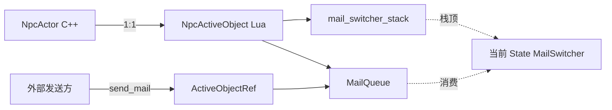
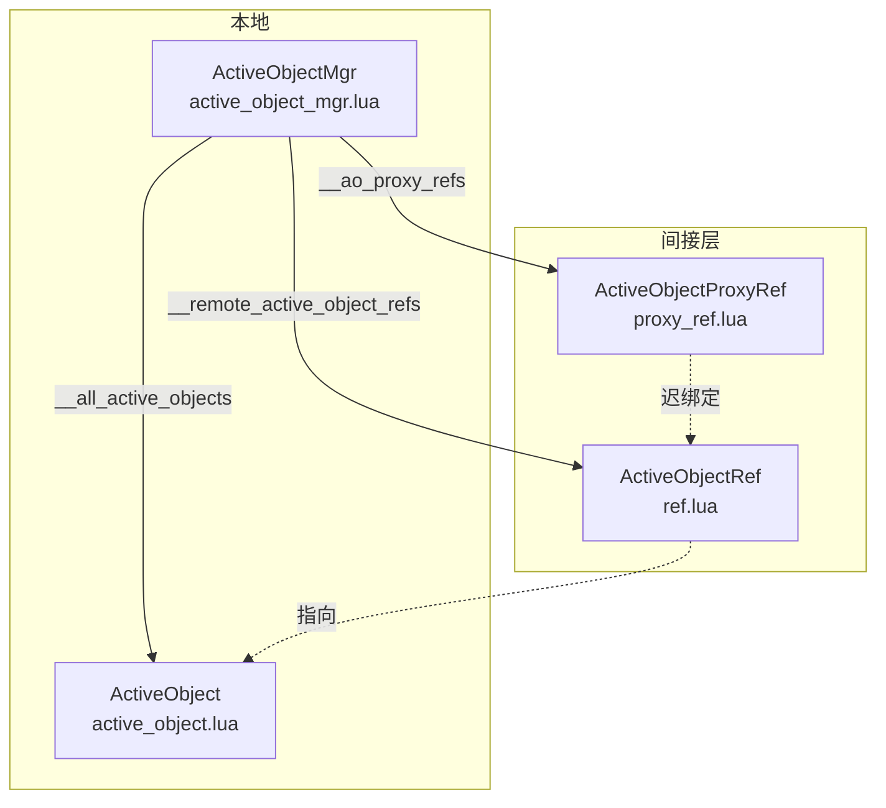
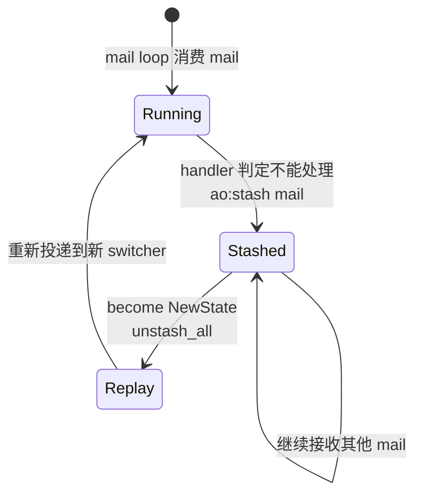
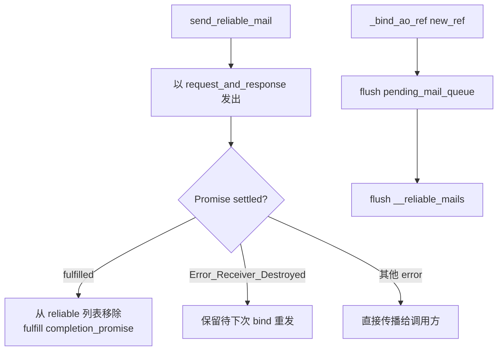
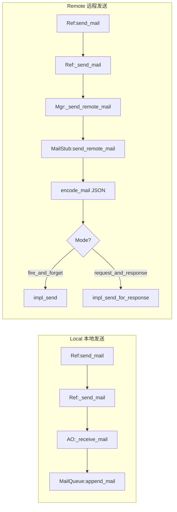

# 2. Kittens — ActiveObject 与 Mail

Kittens 是 HiGame 内部的 Lua Actor-Model 运行时,`ActiveObject` 是其"演员"原语:一个持有独立邮箱的轻量对象,通过 Mail 异步通信而非直接方法调用。NPC 子系统把 `NpcActiveObject` 1:1 绑到 `NpcActor`(C++),把 13 个状态写成 `MailSwitcher`。**本页只讲 NPC 视角会用到的 Kittens ActiveObject/Mail 子集**;完整 Kittens API (Promise、CancelToken、协程调度器等) 留给未来的 `higame-kittens-framework` wiki (尚未创建)。源码全部在 `Content/Script/kittens/active_object/` 下,共 11 个文件[^npc-02]。

## 1. 为什么 NPC 需要 ActiveObject

NPC 逻辑天然是**并发**的:巡逻时被攻击要切状态、对话时被拉去战斗要打断、AI 计算和动画要跨帧 yield。直接在 C++ `NpcActor` 上写这些,要么写满 `bWaitingFor*` 布尔,要么陷进 `UWorld::GetTimerManager()` 回调地狱。Kittens 的 ActiveObject 给 NPC 的答卷是:**每个 NpcActor 独占一个 NpcActiveObject**,状态切换 = `become(new_mail_switcher)`,跨帧等待 = `Promise:await`,被动事件 = 一封 Mail 塞进 MailQueue[^npc-02]。



后续几页 (State、Mail Type 清单、13 状态机图) 都建立在这一结构上。

## 2. 四个类的协作

Kittens ActiveObject 模块实际暴露四个类,职责分得很清:



| 类 | 基类 | NPC 侧职责 |
|---|---|---|
| `ActiveObject` | `Kittens.class('ActiveObject', nil)` | 持有 `__mail_queue` / `__mail_switcher_stack` / `__curr_mail_switcher`,对外暴露 `become` / `unbecome` / `stash` / `unstash_all`[^npc-02] |
| `ActiveObjectMgr` | `Kittens.class('ActiveObjectMgr', nil)` | 本地 AO 注册表,维护 local / remote / proxy 三张表;通过 `create_active_object` 为 NpcActor 生成 AO + MailLocation[^npc-02] |
| `ActiveObjectRef` | `Kittens.class('ActiveObjectRef', nil)` | 邮箱地址 (location transparency);携带可选 `__mail_filter` 和 `__mail_dispatcher` 两个 MailSwitcher[^npc-02] |
| `ActiveObjectProxyRef` | `Kittens.class('ActiveObjectProxyRef', nil)` | 跨 AO 生命周期的延迟代理;AO 未绑定时把 Mail 缓存到 `__pending_mail_queue`,绑定后自动 flush[^npc-02] |

NPC 侧最常接触的是 `ActiveObject` 本体和 `ActiveObjectRef`;跨 DS 场景才会碰到 `ActiveObjectProxyRef` (详见 §6)。

## 3. Mail 生命周期

一封 Mail 从构造到 settle 会穿过 4 个组件。两种接收语义直接写在 `active_object_const.lua`:

```lua
ActiveObjectConst.Enum_ReceiveMailMode = {
    fire_and_forget = 'fire_and_forget',
    request_and_response = 'request_and_response'
}
```

- **fire_and_forget** — Mail 构造时 `__receive_promise` 为 nil,发送方不等任何回执;`is_responsed()` 直接返回 true[^npc-02]。
- **request_and_response** — Mail 构造时同步创建 `Promise:new()`;handler 的返回值决定 settle 行为:`Promise` (lock_receive_promise)、`FulfilledResult` (立即 fulfill)、`Error` (reject)、`nil` (fulfill nil)[^npc-02]。

Effect Tag 是 Kittens 用来标注"这个调用有副作用"的元数据 (NPC 代码里一般看到的是 `SendMail`):

```lua
ActiveObjectConst.Enum_EffectTag = {
    SendMail = 'SendMail',
    RaiseReceiveMailException = 'RaiseReceiveMailException',
    Await = 'Await',
}
```

完整流程如下 (NPC 常走本地路径):

```mermaid
sequenceDiagram
    participant Caller as 发送方
    participant Ref as ActiveObjectRef
    participant AO as ActiveObject
    participant MQ as MailQueue
    participant Loop as __async_mail_loop
    participant MS as MailSwitcher
    Caller->>Ref: send_mail mail_type,body
    Ref->>Ref: Mail:new fire_or_rr
    Ref->>AO: _receive_mail
    AO->>MQ: append_mail
    Loop-->>MQ: 取队头
    MQ-->>Loop: mail
    Loop->>MS: _receive mail
    alt handler 命中
      MS->>MS: pcall handler owner,mail,ct
      MS-->>Caller: fulfill or reject Promise
    else 未命中 且 无 default
      MS-->>Caller: Error_Send_Mail_No_Handler
    end
```

`mail.lua` 还预定义了 7 个常量 Error,NPC 处理 mail 失败时最常见的是 `Error_Send_Mail_No_Handler` 和 `Error_Send_Mail_Receiver_Destroyed`[^npc-02]。

## 4. MailSwitcher 的 3 种注册方式

`MailSwitcher` 是 Actor Model "become" 的实现形态。核心是一张 `__mail_handlers` LUT,`key = mail_type string`,`value = handler function`。三个注册 API 覆盖了 NPC 状态机里所有写 handler 的场景:

```lua
-- A. 单条注册 (NPC state 里最常见)
ms:case(Const.Enum_Mail_Type.on_take_damage, function(self, mail, ct)
    self:enter_dead_state()
end)

-- B. 整块拷贝 (从父状态继承)
ms:copy(base_state_switcher)

-- C. 从外部 handler LUT 挑一条 (组合多个模块的 handler)
ms:copy_handler_item(CombatHandlers, Const.Enum_Mail_Type.on_attack)
```

Default handler 通过构造函数第二参数或显式 `self:case(Const.Mail_Switcher_Default, fn)` 注册,Const 值为字符串 `'default'`[^npc-02]。

`_receive` 的调度顺序固定为 6 步:

| 步骤 | 动作 | 备注 |
|---|---|---|
| ① | 检查 mail 是否已 response | 防重复投递 |
| ② | 若 mail 处于 stashed 状态 → `_unstash` | 恢复标志位 |
| ③ | `__mail_handlers[mail.mail_type]` 查表 | 命中即用 |
| ④ | 未命中 → 回退 `Mail_Switcher_Default` | 可能仍为空 |
| ⑤ | 仍无 handler → `send_error Error_Send_Mail_No_Handler` | 终止 |
| ⑥ | `pcall handler,owner,mail,cancel_token` | 错误走 error path |

`_filter_receive` 另走一条分支:handler 签名多返回一个 `filter_out` boolean,由 `ActiveObjectRef:__try_filter_mail` 使用,允许 Ref 在 mail 投递到 AO 前先做一轮前置过滤[^npc-02]。

## 5. Stash / Unstash 机制

`stash_box.lua` 是极简栈,NPC 状态切换时最常用:当前 handler 无法处理的 mail 先压栈,`become` 完成后 `unstash_all` 重新投递。

```lua
function StashBox:stash(_mail)
    _mail:_stash()                           -- 标记 mail.__is_stashed = true
    table.insert(self.__stash_box, 1, _mail) -- 头插(逆序)
end

function StashBox:pop_all_mails()
    local mails = self.__stash_box
    self.__stash_box = {}
    return mails                             -- 一次性清空
end
```

NPC 的典型使用路径:



关键时序:`_unstash()` 不在 `pop_all_mails` 时立即执行,而是**延迟到 MailSwitcher `_receive` 下一次处理该 mail 时才清掉 `__is_stashed` 标志**[^npc-02]。这避免 stashed mail 被多次重复 unstash 状态机错乱。

```lua
-- NPC 视角:正在 patrol 状态,收到一封暂时不关心的对话 mail
function patrol_state:on_dialog_invite(mail, ct)
    self.__active_object:stash(mail)          -- 先压栈
    if self:should_switch_to_dialog() then
        self.__active_object:become(DialogState)
        self.__active_object:unstash_all()    -- 新状态接手 mail
    end
end
```

## 6. ProxyRef 与 ActiveObjectRef 差异

跨 DS 的 NPC 引用会用到 `ActiveObjectProxyRef`——本质是"迟绑定 + 可靠投递"版的 Ref:

| 维度 | ActiveObjectRef | ActiveObjectProxyRef |
|---|---|---|
| 生命周期 | 绑定到具体 AO 实例 | 跨 AO destroy / re-create 周期存活 |
| AO 不存在时 | local: send_error;remote: 走 MailStub | 缓存 mail 到 `__pending_mail_queue`,等 `_bind_ao_ref` 后 flush |
| 可靠投递 | 无 | `send_reliable_mail`,AO destroy (`Error_Send_Mail_Receiver_Destroyed`) 时 mail 保留在 `__reliable_mails`,下次 bind 时重发 |
| 管理方 | Mgr 的 `__all_active_objects` / `__remote_active_object_refs` | Mgr 的 `__ao_proxy_refs` |
| 获取 API | `get_ao_ref` | `get_local_ao_proxy_ref` / `get_remote_ao_proxy_ref` / `get_ao_proxy_ref`[^npc-02] |

ProxyRef 的 reliable 重试逻辑 (`__dispatch_reliable_mail`):



NPC 场景里,跨 DS 传送或 ghost→real 切换会让 AO 短暂不存在,ProxyRef 保证调用方能"像在本地一样"发 mail,不用自己写"AO 还没准备好时缓存"的样板代码。

## 7. MailStub + MailLocation (跨服务器通信)

当目标 AO 不在当前 DS,mail 要落地到**网络层**。Kittens 把这层抽象成 `MailStub` (通信) + `MailLocation` (寻址):



三个组件关键细节:

- **MailQueue** — 每个 AO 独占一个。持有 `__mail_queue` FIFO、`__stash_box`、`__mail_switcher` (由 `set_mail_switcher` 写入)、`__async_mail_loop` (Kittens 协程里以 `fire_and_forget` 启动的无限循环),并通过 `__destroying_cts` (CancelTokenSource) 优雅关闭:停止接收新 mail + 对已排队的 request_and_response mail 返回 `Error_Send_Mail_Receiver_Destroyed`[^npc-02]。
- **MailStub** — 与 Mgr 双向绑定 (构造时 `_active_object_mgr:_set_mail_stub(self)`);负责 `encode_mail` / `decode_mail` (走 `thirdparty.json`)、`send_remote_mail`、`receive_remote_mail`。**三个必须子类重写的方法**:`impl_send`、`impl_send_for_response`、`make_location`[^npc-02]。
- **MailLocation** — `flat_class`,仅定义 `marshal()` / `unmarshal(_location_str)` 两个空方法,具体形态 (DS IP、AO ID、路由信息) 由 MailStub 子类在 `make_location` 里决定[^npc-02]。

NPC 目前以单 DS 单 AO 为主,但 ghost-real 机制要求它们天然支持远程调用——MailStub / MailLocation 是这一支持的落点。

## 8. NPC 中怎么用

把上面 7 节合起来,NPC 侧实际写的代码就两类样板:**创建 AO + MailQueue** 和 **State 里注册 handler**。

初始化样板 (来自 `npc_active_object.lua:initialize` 思路):

```lua
function NpcActiveObject:initialize(_context, _effect_handlers, npc_actor)
    -- 调 super 拿到 MailQueue 和 mail_switcher_stack
    ActiveObject.initialize(self, _context, _effect_handlers)
    self.__npc_actor = npc_actor
    -- 预注册第一个状态的 MailSwitcher
    self:become(IdleState:new(self))
end
```

State handler 样板 (结合 §4 / §5):

```lua
function patrol_state:init_mail_switcher(ms)
    ms:case(Const.Enum_Mail_Type.on_take_damage, function(_, mail, ct)
        self.__active_object:become(CombatState:new(self.__active_object))
    end)
    ms:case(Const.Enum_Mail_Type.on_dialog_invite, function(_, mail, ct)
        self.__active_object:stash(mail)           -- 先 stash
        if self:should_accept_dialog() then
            self.__active_object:become(DialogState:new(self.__active_object))
            self.__active_object:unstash_all()     -- 新状态接手
        end
    end)
    ms:copy_handler_item(GlobalHandlers,
        Const.Enum_Mail_Type.on_world_reset)       -- 借用公共 handler
end
```

记忆点:**NPC 侧很少直接 new Mail**;90% 的 mail 由 C++ `NpcActor` 通过绑定的 Ref 推进来,或由别的 State 通过 `become + unstash_all` 重新投递。真正要写 handler 的地方就是 `init_mail_switcher`。

## 跨页链接

- → [3. Kittens — StateFlow](3.%20Kittens%20—%20StateFlow.md): 与 ActiveObject 配合做状态机,`become/unbecome` 的上层抽象
- → [5. NpcActiveObject 与 13 状态机](5.%20NpcActiveObject%20与%2013%20状态机.md): NPC 使用 ActiveObject 的具体场景 + 13 个状态拓扑
- → [6. Mail 类型与 Handler 路由](6.%20Mail%20类型与%20Handler%20路由.md): NPC 的 60+ Mail 类型清单与 `case / copy_handler_item` 具体使用

[^npc-02]: raw/npc-02-kittens-active-object.md
