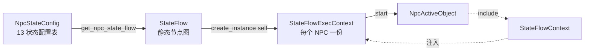
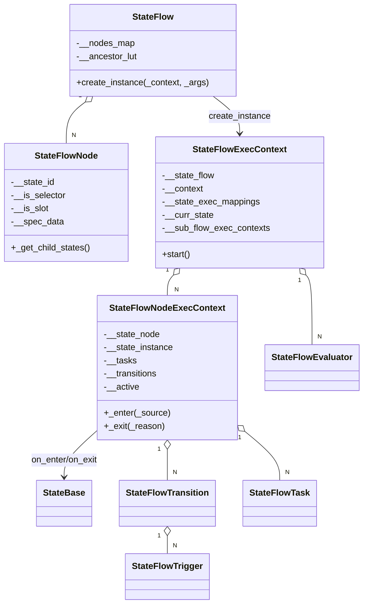
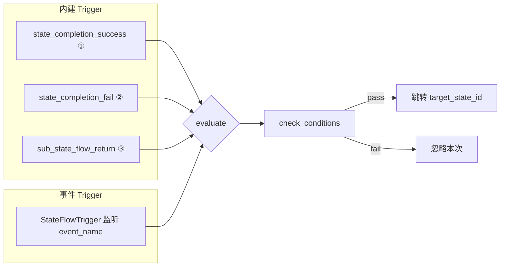

# 3. Kittens — StateFlow

Kittens 的 `StateFlow` 是一套**配置驱动的层次化状态机引擎**:一个 `StateFlow` 是静态节点图,`StateFlowExecContext` 是它的运行时实例,节点可嵌套(父子),可并列(transition),可外挂(slot),可用 Task/Evaluator 扩展[^npc-03]。NPC 系统把整颗 13 状态的行为树构建在 StateFlow 之上,所以看 NPC 前必须先看 StateFlow 的五件套:**StateFlow / StateFlowNode / ExecContext / Transition+Trigger / StateBase**。本页只讲引擎层,不讲 NPC 的具体 13 个状态(见 [5. NpcActiveObject 与 13 状态机](5.%20NpcActiveObject%20与%2013%20状态机.md))。

## 1. StateFlow 与 NPC 的关系

NPC 的"Idle / Patrol / Move / Dialogue / Battle / Dead / …"共 13 个状态并不是用 Lua 写一坨 `if-elseif` 实现的,而是在配置表里声明成一棵 `StateFlow` 节点树,运行时 `NpcStateConfig.get_npc_state_flow():create_instance(self, {}):start()` 实例化一棵树挂到 NPC 上。每个 NPC 状态 = 一个 `StateFlowNode` + 一个 `StateBase` 子类,转移条件 = `transition_spec_list`,复杂行为 = `SF_EventFlowTask` / `SF_CustomTask`。因此 StateFlow **是 NPC 的骨架**,本页讲骨架本身。



## 2. 三件套类层次

StateFlow 体系共 11 个类,核心是**静态图 / 运行时实例 / 节点上下文**三件套,其余都挂在这三者上。



| Class | 层次 | 职责 |
|-------|------|------|
| `StateFlow` | 静态 | 配置解析后的节点图,节点 id -> 节点映射;可被多个实例共享 |
| `StateFlowNode` | 静态 | 单个节点的静态描述符(`spec_data` 展开) |
| `StateFlowExecContext` | 运行时 | 一棵树的运行时实例,挂 Evaluator、全局 Task、slot 子流 |
| `StateFlowNodeExecContext` | 运行时 | 单个节点在当前实例中的活跃状态,管 StateBase/transition/task |
| `StateBase` | 用户层 | 用户继承的状态类,提供 `on_enter`/`on_exit` 钩子 |
| `StateFlowTransition` | 运行时 | 一条转移,由 trigger 激发 + condition 过滤 |
| `StateFlowTrigger` | 运行时 | 事件触发器,注册到 `StateFlowContext` 的事件中心 |
| `StateFlowEvaluator` | 运行时 | 数据绑定/计算管线,继承 `NodeComponent` |
| `StateFlowTask` | 运行时 | 节点附带的行为单元,基类;派生 `SF_EventFlowTask` / `SF_CustomTask` |

## 3. StateFlowNode 字段

`StateFlowNode:initialize` 从 `spec_data` 展开出的字段全集(保留 Lua 原字段名):

```lua
-- state_flow_node.lua
function StateFlowNode:initialize(_state_flow, _spec_data)
    self.__state_flow = _state_flow
    self.__spec_data = _spec_data

    self.__state_id             = _spec_data.state_id              -- 节点唯一 id
    self.__is_selector          = _spec_data.is_selector or false  -- selector 语义
    self.__is_slot              = _spec_data.is_slot or false      -- slot 语义
    self.__parent_state         = nil                              -- lazy: _spec_data.parent_state_id
    self.__next_state           = nil                              -- 由父 _get_child_states() 链式赋值
    self.__child_states         = nil                              -- lazy: _spec_data.child_state_id_list
    self.__transition_spec_list = _spec_data.transition_spec_list  -- 本节点激活时启用的转移
    self.__task_spec_list       = _spec_data.task_spec_list        -- 本节点激活时启用的 task
end
```

其他在 `StateFlowNodeExecContext` / `StateFlowContext` 里读取的 spec 字段:

| 字段 | 用途 |
|------|------|
| `state_tag` | 进入时写入 GameplayTag 容器,离开时移除 |
| `accessary_tags` | 附加 tag 列表(同上) |
| `enter_condition_list` | 能否被选中的前置条件 |
| `enter_condition_logic_operation` | `all` / `any`(`Enum_ConditionLogicOperation`) |
| `state_class` | StateBase 子类名(slot 节点禁止填) |

## 4. Transition 模型

转移由**Trigger 激发 + Condition 过滤**组合而成。Trigger 分两种路径:**内建 trigger**(三个枚举值,由引擎硬编程发出)和**事件 trigger**(`StateFlowTrigger` 监听 `event_name`)。



```lua
-- state_flow_const.lua
---@class Enum_TransitionTriggerType
StateFlowConst.Enum_TransitionTriggerType = {
    state_completion_success = 'state_completion_success',
    state_completion_fail    = 'state_completion_fail',
    sub_state_flow_return    = 'sub_state_flow_return',
}
```

三条内建触发点的来源:
- `state_completion_success/fail` — `StateBase:complete_state(true/false)` 调 `StateFlowExecContext:_on_state_completed`
- `sub_state_flow_return` — slot 节点绑定的子流 return 时发出

`StateFlowTrigger` 走 `StateFlowContext:register_event_listener(event_name)`,在节点进入时注册、退出时注销。

## 5. is_selector vs is_slot 对比表

两个布尔开关完全正交,语义也截然不同:`is_selector` 决定**选枝策略**,`is_slot` 决定**节点是不是占位符**。

| 维度 | `is_selector=true` | `is_slot=true` |
|------|--------------------|----------------|
| 能否作叶 | ✗ 必须至少一个孩子通过 enter_condition | ✓ 叶节点,没有子节点 |
| 选枝语义 | 所有孩子全部失败则自身失败 | 不参与选枝 |
| 是否绑 StateBase | ✓ 正常绑 `state_class` | ✗ **禁止** state_class |
| 是否绑子流 | ✗ | ✓ 运行时绑 sub `StateFlow` |
| 结束方式 | 孩子 complete 冒泡 | 子流 return 触发 `sub_state_flow_return` |

selector 选枝核心代码:

```lua
-- state_flow_exec_context.lua
if not any_child_success and _root_state:_is_selector() then
    return false   -- selector 无任何孩子可选 -> 自身失败
end
```

slot 委派子流:

```lua
-- state_flow_node_exec_context.lua
if self:__is_slot_state() then
    local slot_flow_exec = self.__state_flow_exec_context
        :_get_slot_state_flow_exec(self.__state_node:_get_state_id(), _source_state)
    slot_flow_exec:_enter_cache_states()
    return
end
```

NPC 用 selector 实现"在若干可选状态中按条件挑一个"(例:Battle 根据敌人距离选 Chase / RangedAttack / MeleeAttack),用 slot 实现"Dialogue 状态动态挂一棵对话子流"。

## 6. StateBase 5 个 hook

`StateBase` 是用户唯一需要继承的类,5 个 hook 覆盖全部生命周期:

```lua
-- state_base.lua
---@class StateBase
---@param _state_exec StateFlowNodeExecContext  所属节点 exec
---@param _args table                            create_instance 时透传
function StateBase:initialize(_state_exec, _args) end

---@return StateFlowExecContext
function StateBase:get_state_flow_exec_context() end

---@param _success boolean  触发 state_completion_success/fail
function StateBase:complete_state(_success) end

---@return nil  进入时调,setup 业务监听
function StateBase:on_enter() end

---@param _reason string  退出时调,_reason 来自 transition / error
function StateBase:on_exit(_reason) end
```

用户侧只重写 `on_enter` / `on_exit`,必要时调 `self:complete_state(true/false)` 让父节点进入下一枝。

## 7. ReservedStateId

transition 的 `target_state_id` 不总是写死字符串,也可以写四个保留占位符,由 `StateFlowNodeExecContext:_find_state_node_by_id` 动态解析:

```lua
-- state_flow_const.lua
StateFlowConst.Enum_ReservedStateId = {
    root   = 'root',    -- 整棵 StateFlow 的根
    parent = 'parent',  -- 当前节点的父;若当前是 slot 子流的根则为 Attached_Slot_State
    next   = 'next',    -- 在兄弟 child_state_id_list 顺序中的下一个
    source = 'source',  -- transition 发起时的叶节点(不是 trigger 所在的节点!)
}
```

| 保留 id | 解析规则 | 典型用法 |
|---------|----------|----------|
| `root` | `StateFlow._get_root_state_node()` | 异常状况"全部重启" |
| `parent` | 当前节点的 `parent_state`,若无父且位于 slot 子流根,则返回 `Attached_Slot_State` | 子状态完成,回到父节点做下一步 |
| `next` | `self:_get_next_state()`,基于父节点 `child_state_id_list` 构建的链表 | 流水线式顺序跑兄弟节点 |
| `source` | 进入该节点时捕获的 `__transition_source_state`(事件 trigger 发起时的叶) | 孩子出 fail,回到原来的 leaf 继续待机 |

注意 `source` 是**转移发起**的 leaf,不是**trigger 所在**的节点——这点容易搞错。trigger 可能挂在祖先节点上,但 `source` 永远指向当时真正活跃的 leaf。

## 8. StateFlowTask (SF_EventFlowTask vs SF_CustomTask)

节点进入时启动的异步"副作用",不占用 StateBase 主线程,结束或失败时可触发 transition。

```lua
-- state_flow_const.lua
---@class Enum_StateFlowTaskType
StateFlowConst.Enum_StateFlowTaskType = {
    event_flow = 'event_flow',  -- 包裹一个 EventFlow 配置
    custom     = 'custom',       -- 包裹一个异步函数 _context:get_custom_task_func(name)
}
```

| 类型 | 类 | 适用场景 |
|------|----|----------|
| `event_flow` | `SF_EventFlowTask` | 走配置化 EventFlow 管线(见 npc-06),策划可视化编辑 |
| `custom` | `SF_CustomTask` | 程序员写异步 Lua 函数,快速原型/底层扩展 |

`StateFlowTask` 基类持有 `__state_exec`,提供 `start()` / `stop(_reason)` / `is_running()`。`SF_EventFlowTask` 把 EventFlow 的 success/fail 映射到 task 的完成;`SF_CustomTask` 通过 `Error_Pause_Custom_Task` 支持挂起/恢复,全局 task 通过 `Error_Reason_Stop_Global_Task` 标记允许跨状态停止。

## 9. Evaluator (数据绑定)

`StateFlowEvaluator` 继承 `NodeComponent`(Kittens 组件系统,见 [4. Kittens - NodeHandle 与 NodeComponent](4.%20Kittens%20—%20NodeHandle%20与%20NodeComponent.md)),负责**实时把外部数据拉进 StateFlow 域**,供 condition / trigger / task 读取。

```lua
-- state_flow_evaluator.lua  (主要 hook)
function StateFlowEvaluator:on_init()    end  -- 挂载到 NodeHandle 后
function StateFlowEvaluator:on_enable()  end  -- 实例 start 时
function StateFlowEvaluator:on_disable() end  -- 实例 stop 时
function StateFlowEvaluator:get_data()   end  -- 供 condition 轮询
```

典型应用:
- "当前 HP 百分比" evaluator,被 `enter_condition_list` 里的条件函数读取
- "最近敌人距离" evaluator,驱动 Battle selector 选择近战/远程
- "GameplayTag 是否满足" evaluator,被 slot 子流开关

Evaluator 之间可以声明依赖顺序,`set_exec_order_depencency(upstream_id)` 保证上游先计算。

## 10. NPC 怎么用 StateFlow

NPC 把 StateFlow 整个接进来只要 3 行:配置文件里写好节点,运行时 `create_instance` + `start`。

```lua
-- 伪代码,NPC 启动流程节选
local state_flow = NpcStateConfig.get_npc_state_flow()
local exec       = state_flow:create_instance(self, {})  -- self 实现 StateFlowContext
exec:start()
self.__state_flow_exec = exec
```

`self` 实现 `StateFlowContext` 接口(通过 `NpcActiveObject:include(StateFlowContext)` 混入,见 [2. Kittens - ActiveObject 与 Mail](2.%20Kittens%20—%20ActiveObject%20与%20Mail.md)),提供:

- `check_conditions(list, logic_op)` — 节点 enter_condition / transition condition 的求值入口
- `register_event_listener(event_name)` — 供 `StateFlowTrigger` 订阅
- `get_custom_task_func(name)` — 供 `SF_CustomTask` 查函数
- GameplayTag 容器 — 供 `state_tag` 写入/查询

至此 NPC 就有了一棵可配置、可扩展、可热更的 13 状态行为树。具体 13 个状态分别是什么、转移图怎么连,见 [5. NpcActiveObject 与 13 状态机](5.%20NpcActiveObject%20与%2013%20状态机.md)。

## 跨页链接

- → [2. Kittens - ActiveObject 与 Mail](2.%20Kittens%20—%20ActiveObject%20与%20Mail.md): `ActiveObject` 是 `NpcActiveObject` 的基类,StateFlowContext 通过 `include` 混入
- → [4. Kittens - NodeHandle 与 NodeComponent](4.%20Kittens%20—%20NodeHandle%20与%20NodeComponent.md): `StateFlowEvaluator` 继承 `NodeComponent`,挂在 exec context 的 NodeHandle 上
- → [5. NpcActiveObject 与 13 状态机](5.%20NpcActiveObject%20与%2013%20状态机.md): StateFlow 在 NPC 侧的具体实例化——13 状态、selector/slot 的真实用例

[^npc-03]: raw/npc-03-kittens-state-flow.md
