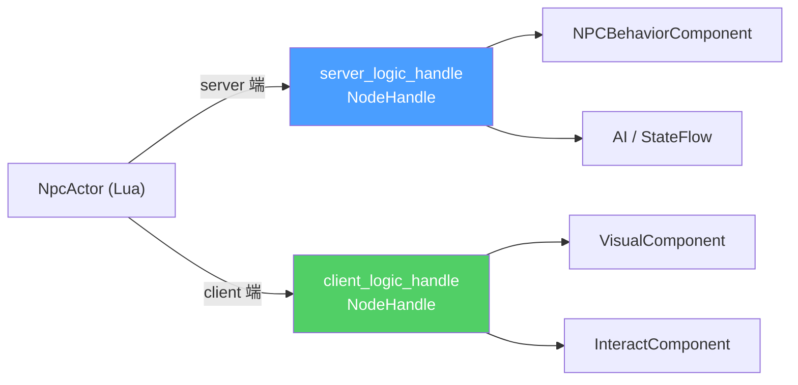
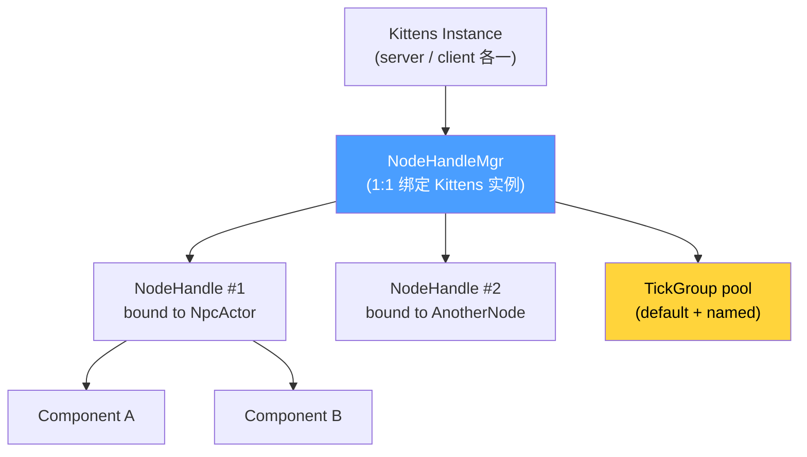
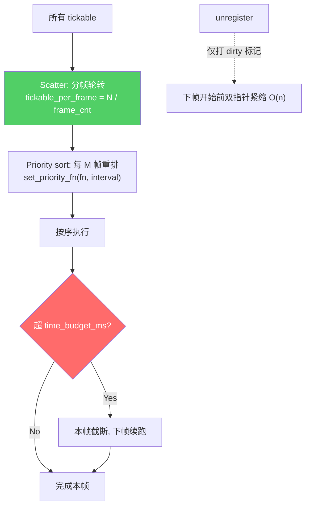
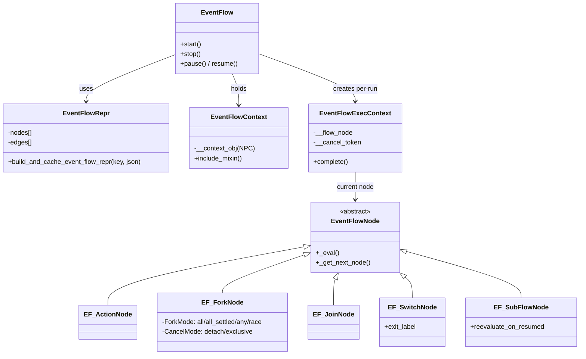

# 4. Kittens — NodeHandle 与 NodeComponent

> Kittens 是 HiGame Lua 层的**组件化框架**,核心是 `NodeHandle`(IoC 容器)+ `NodeComponent`(可复用逻辑单元)+ `TickGroup`(调度)+ `EventFlow`(异步状态机)。NPC 在 `NpcActor` 上挂两套 handle (server / client),所有业务逻辑(AI、战斗、交互、剧情流)都是挂在 handle 上的 `NodeComponent` 子类。本页从 **NPC 视角**解析 Kittens 框架的关键构件[^npc-04]。

## 1. NodeHandle = Lua 端的 IoC 容器

Kittens 不用 UE 原生 `UActorComponent`,而是在 Lua 层重新实现了一套组件系统。任意 Lua 对象(统称 `node`)都可以通过 `NodeHandleMgr:bind_node()` 绑定得到一个 `NodeHandle` 实例,随后 `handle:add_component(ComponentCls, args, key, enable)` 即可挂载组件。NPC 则进一步在 `NpcActor` 上挂两个 NodeHandle——`server_logic_handle` (运行在 DS 上) 与 `client_logic_handle` (运行在客户端上),做到 **DDS 架构下 Lua 层的端侧分离**。



## 2. NodeHandle vs UE Component 差异

Kittens NodeHandle 看似类似 `UActorComponent`,但机制完全不同——这是理解 NPC 脚本的**关键差异**:

| 维度 | UE `UActorComponent` | Kittens `NodeHandle` + `NodeComponent` |
|------|---------------------|----------------------------------------|
| **语言层** | C++ / Blueprint (引擎级) | Lua (Kittens class 系统,可热重载) |
| **注册方式** | `Actor::CreateDefaultSubobject()` / Blueprint Attach | `handle:add_component(_cls, _args, _key, _enable)` |
| **识别方式** | `UPROPERTY` 名 / C++ 指针 | **Binding Key 字符串**(同 handle 下唯一) |
| **生命周期** | `BeginPlay` / `EndPlay` / `Tick` | `on_init → on_start → on_enable → on_update → on_disable → on_remove → on_release` |
| **跨端通信** | 需 `Replicated` UPROPERTY / RPC | Lua 层**直接区分** server / client handle,不走引擎 replicate (用 Mail 或 UnLua RPC) |
| **执行顺序** | `TickGroup` 枚举(PrePhysics / DuringPhysics / ...) | **拓扑排序** (`set_exec_order_depencency` + DAG) |
| **Tick 分散** | 无内建(需手工 Timer) | `TickGroup` 原生支持 scatter + time budget + priority |
| **激活/反激活** | `SetActive(bool)` | `handle:set_active(bool)` 级联通知所有 component |
| **组件嵌套** | 子组件靠 AttachToComponent | `NodeComponent:become_cascading_handle()` 让组件本身成为 handle |

核心区别:**UE Component 是语言级的类成员,NodeComponent 是运行时可插拔的 Lua 字典项**——这让策划能用数据驱动的方式动态组合 NPC 的行为集。

## 3. NodeComponent 基类

所有可挂载的逻辑单元继承自 `NodeComponent`:

```lua
---@class NodeComponent
local NodeComponent = Kittens.class("NodeComponent")

function NodeComponent:initialize(_mgr, _args)
    -- _mgr: NodeHandleMgr 实例
    -- _args: add_component 时传入的参数表
end

-- 创建子类(项目所有 NPC 组件均走此工厂方法)
NodeComponent.create_node_component_class(_cls_name, _super_component_cls)
```

**必须 / 可选重写的 hook**:

| Hook | 时机 | 常见用途 |
|------|------|---------|
| `on_init` | 绑定到 handle 瞬间 | 读 args,建引用 |
| `on_start` | 首次 enable 之前 | 懒初始化 |
| `on_enable` | 每次 `set_active(true)` | 订阅事件、打开 UI |
| `on_update` | 每帧(若有定义) | 主循环 |
| `on_late_update` | 每帧末尾(若有定义) | 后处理 |
| `on_disable` | 每次 `set_active(false)` | 退订事件 |
| `on_remove` | `remove_component` 调用时 | 清理引用 |
| `on_release` | handle 销毁 | 终结资源 |
| `on_node_handle_bind/unbind` | handle 主动 bind/unbind 节点 | 更新关联缓存 |

> **约定**:只要子类定义了 `on_update` 方法,NodeHandle 会**自动**把它编入 update 链表;`on_late_update` 同理。没定义就不会进链表,零开销。

## 4. `add_component` 签名

```lua
function NodeHandle:add_component(_component_cls, _component_args, _index_key, _enable)
    -- _component_cls    : NodeComponent 子类
    -- _component_args   : 传给 initialize 的 args
    -- _index_key        : Binding Key (字符串/任意 table), 同 handle 下不可重复
    --                     nil 时用 component 实例自身作 key
    -- _enable           : 默认 true, 加完立即激活
    -- return            : NodeComponent 实例
end
```

**参数说明**:

- `_index_key` 就是 Kittens 的 **Binding Key 机制**——同类组件可以挂多份,靠 key 区分检索:`handle:get_component(key)`。
- 框架保留两个特殊 key:
  - `Const.Default_Bind_Node_Index_Key = '__default'`
  - `Const.Cascading_Bind_Node_Index_Key = '__cascading'`(`become_cascading_handle` 专用)
- `_enable = false` 可用于**延迟激活**,后续 `handle:set_active(true, key)` 再开。

```lua
-- 典型用法: NPC server 端挂一个行为组件
local behav = server_handle:add_component(
    NPCBehaviorComponent,              -- _component_cls
    { profile_id = 10023 },             -- _component_args
    'behavior',                         -- _index_key (binding key)
    true                                -- _enable
)
```

## 5. NodeHandleMgr

```lua
---@class NodeHandleMgr
local NodeHandleMgr = Kittens.class('NodeHandleMgr', nil)

function NodeHandleMgr:initialize(_kittens_inst) end
```

**非全局单例**——每个 Kittens 实例有自己的 NodeHandleMgr。典型地,server 有一个 Kittens 实例,client 有一个,两端 mgr 互不干扰。



职责:

- `bind_node(_node, _index_key)` / `unbind_node` — 给 Lua 对象挂/卸 handle
- `get_binding_node_handle(_node, _index_key)` — 按 node 反查已绑定的 handle
- `setup_signal(_signal_delegate)` — 把 `__update` / `__late_update` 注册到帧驱动信号
- 支持 `SHARE_SCHEDULER_TIME_BUDGET_WITH_NODE_HANDLE` 模式,每 tick 调用 `consume_logic_frame_time_budget` 扣共享预算,避免一帧内组件总时长爆炸

## 6. TickGroup 调度

```lua
---@class TickGroup
local TickGroup = Kittens.class('TickGroup', nil)
```

Kittens 解决 "N 个 NPC 的 tick 如何不卡帧" 的核心设施,**三种调度策略 + 惰性清理**:



| 策略 | API | 作用 |
|------|-----|------|
| **Scatter 分帧** | `tg:scatter(_frame_cnt)` | 把 N 个 tickable 分散在 frame_cnt 帧内轮转执行 |
| **Time Budget 时间预算** | `tg:set_time_budget(_budget_ms)` | 每帧超时截断,剩余 tickable 下帧继续 |
| **Priority 优先级** | `tg:set_priority_fn(_priority_fn, _sort_interval)` | 每 sort_interval 帧按 priority 降序重排 |
| **Lazy Purge** | (内部) | unregister 只打标记,下帧前 O(n) 紧缩,避免频繁 array shift |

NodeHandleMgr 持有 `__default_update_tick_group` + `__tick_groups[key]` 字典。通过 `alloc_tick_group(_group_key)` 创建命名 TickGroup,`register_handle_to_tick_group` 将 handle 指派到组。

> **与 Significance 联动(npc-13 预告)**:NPC 场景里,Significance 系统会根据距离相机的远近实时调用 `scatter()` 改变分帧数、调用 `set_priority_fn()` 让近处 NPC 优先 tick,这是 NPC 数量承载的关键。

## 7. EventFlow 核心类图

EventFlow 是 NPC 行为脚本 / 剧情 DSL 的**异步状态机**——节点组成有向图,在 Kittens AsyncRoutine 协程上运行。给策划用的 JSON/节点编辑器最终产出 `EventFlowRepr`,运行时实例化为 `EventFlow` + `EventFlowContext` + `EventFlowExecContext`。



> **ExecContext 的魔法**:`EventFlowExecContext` 用 metatable hook,把未命中的方法调用**代理到当前 `__flow_node`**——所以 `EF_ActionNode:on_start(self, _cancel_token)` 里的 `self` 实际是 `ExecContext`,但访问 node 方法/字段仍然透明。这是 NPC Action 写法的理解关键。

## 8. EventFlow 节点 5 种类型

| 节点 | 继承 | 职责 | NPC 用途举例 |
|------|------|------|-------------|
| `EF_ActionNode` | EventFlowNode | 执行单个 Action,完成时调用 `complete()` 推进 | NPC 的 28 个 Action 全是它的子类(播动画/移动/说话/...) |
| `EF_SwitchNode` | EventFlowNode | 按 `exit_label` 条件分支选后继 | "玩家带任务道具?" 分支 |
| `EF_ForkNode` | EventFlowNode | 并行分叉,4 种 ForkMode + 2 种 CancelMode | 一边走路一边说话 |
| `EF_JoinNode` | EventFlowNode | 接收 ForkNode 完成信号汇合 | 所有动作结束后才触发下一步 |
| `EF_SubFlowNode` | EventFlowNode | 嵌套子流程,可 `reevaluate_on_resumed` | 复用通用对话流 |

**ForkMode 4 种**:

| ForkMode | 语义 |
|----------|------|
| `all` | 等所有分支都成功 |
| `all_settled` | 等所有分支结束(成功/失败均可) |
| `any` | 任一分支成功即继续 |
| `race` | 任一分支结束即继续(取消其他) |

**CancelMode 2 种**: `detach`(分支独立运行)/ `exclusive`(Fork 结束时强制取消所有未完成分支)。

**错误常量** `EventFlowConst.Enum_EventFlowErrorReason`:`Paused` / `Stopped` / `Reevaluation_Event_Flow_Node` / `Stopped_By_Reevaluate_On_Resumed_Subflow_Node_Paused` / `Stopped_By_Subflow_Node_Stopped_During_Paused` / `Fork_Exclusive` / `Fatal_Error_Trace`。

**EventFlowMgr** 管理所有活跃 EventFlow 生命周期,通过 `ENABLE_EVENT_FLOW_POOL` 开关支持流程池化复用。

## 9. EventSystem 与 EventFlow 关系

EventSystem 是**扁平的发布-订阅总线**,EventFlow 是**有向图状态机**——两者是不同抽象。

```mermaid
flowchart LR
    ESI["EventSystemInterface<br/>纯接口<br/>register_listener / broadcast_event"]
    ES["EventSystem<br/>(stub, 方法体空)<br/>实际实现由 C++ / HiGame 注入"]
    ESL["EventSystemLocator<br/>Service Locator<br/>按 register_key 多总线"]
    EF["EventFlow<br/>(NPC 主要使用)"]

    ESI <|-- ES : implements
    ESL -->|locate by key| ESI
    EF -.->|Action 节点内部偶尔调用| ESI
    EF ==>|NPC 脚本主用| EF

    style EF fill:#4a9eff,color:#fff
    style ES fill:#ccc,color:#000
```

| 类 | 角色 |
|----|------|
| `EventSystemInterface` | 纯接口,定义 `register_listener` / `register_listener_once` / `unregister_listener` / `broadcast_event` |
| `EventSystem` | 继承 Interface,当前**方法体为空壳**——说明实际总线由外部(C++ 或 HiGame 自定义)注入 |
| `EventSystemLocator` | 服务定位器,按 `_register_key` 注册/获取不同总线实例,允许一个进程多套总线 |

> **NPC 基本不直接用 EventSystem**。NPC 行为主路径是 EventFlow;偶尔 Action 节点内部会 `register_listener` 监听外部事件(如 "玩家进入范围"),监听到后调用 `complete()` 推进流程。

## 10. NPC 里的 NodeHandle 典型用法

`npc_active_object.lua` 是 NPC 在 DS 端的主承载对象,其上通过 `get_server_logic_handle()` 获取 handle,再用 `get_component` 按 binding key 取挂在上面的组件:

```lua
-- npc_active_object.lua (verbatim 风格)
function NpcActiveObject:get_server_logic_handle()
    return self.__server_logic_handle  -- 在 __init 时 NodeHandleMgr:bind_node 产生
end

function NpcActiveObject:get_component(_binding_key)
    local handle = self:get_server_logic_handle()
    return handle and handle:get_component(_binding_key) or nil
end

-- 挂行为组件的典型调用
local behav = self:get_server_logic_handle():add_component(
    NPCBehaviorComponent,
    { profile_id = self.__profile_id },
    'behavior',
    true
)

-- 其他组件拿到兄弟组件的引用
local stateflow_eval = self:get_component('stateflow_evaluator')
```

> **模式**:NPC 主对象不直接持有组件引用,而是**全部转发给 handle**——handle 是唯一的组件注册表,所有兄弟组件通过 `get_component(binding_key)` 互相发现。这是 Kittens IoC 的落地形态。

## 跨页链接

- → [3. Kittens — StateFlow](3.%20Kittens%20—%20StateFlow.md): `StateFlowEvaluator` 继承 `NodeComponent`,是挂在 server_logic_handle 上的一员
- → [7. Node 组件矩阵](7.%20Node%20组件矩阵.md): NPC 15 个 `NodeComponent` 详表(职责 × 端侧 × 依赖)
- → [8. EventFlow — 28 个 Action 节点](8.%20EventFlow%20—%2028%20个%20Action%20节点.md): NPC 如何用 `EF_ActionNode` 子类配剧情
- → [5. NPC Actor 与 Server/Client Handle](5.%20NPC%20Actor%20与%20Server-Client%20Handle.md): `NpcActor` 如何装配两套 handle
- → [13. Significance 与 TickGroup 联动](13.%20Significance%20与%20TickGroup.md): 大量 NPC 的性能调度

[^npc-04]: raw/npc-04-kittens-node-handle.md
