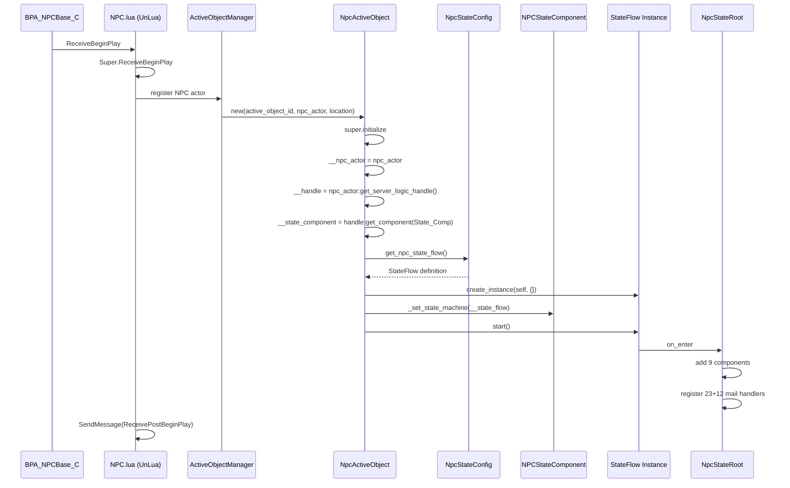
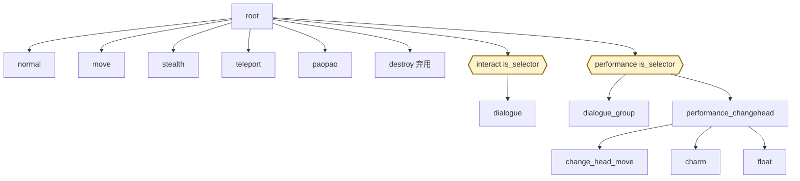
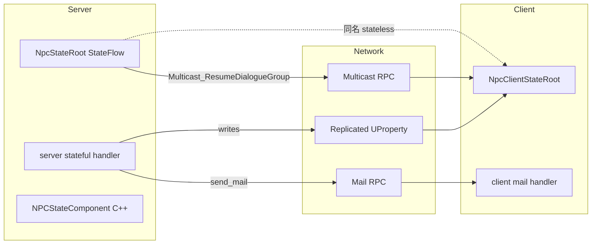
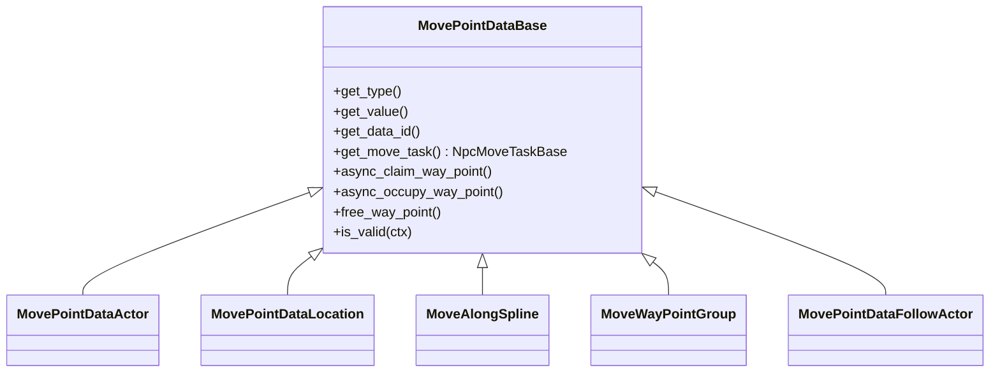

# 5. NpcActiveObject 与 13 状态机

`NpcActiveObject` 是与 `NpcActor` 1:1 绑定的服务器侧 Lua 对象,**它通过 mixin `StateFlowContext` 把一棵 13 节点的状态树挂在 NPC 上**。状态树根节点 `NpcStateRoot` 一次性注册 9 个 Component + 23 个 stateless mail handler + 12 个 stateful handler,子状态(normal / move / dialogue / dialogue_group / stealth / paopao / teleport / destroy / performance_changehead / change_head_move / charm / float)各自只补充自己关心的 mail。客户端有一份镜像(`NpcClientStateRoot`),没有 state replication,**纯靠 Mail + RPC + Replicated UProperty 三条路径同步**。

## 1. NpcActiveObject 初始化时序



`NpcActiveObject:initialize` 的核心代码 (`Projects/HiGame/Content/Script/npc/npc_active_object.lua`):

```lua
local NpcActiveObject = Kittens.class('NpcActiveObject', ActiveObject):include(StateFlowContext)

function NpcActiveObject:initialize(_active_object_mgr, _active_object_id, _context, _location, _effect_handlers)
    NpcActiveObject.super.initialize(self, _active_object_mgr, _active_object_id, _context, _location, _effect_handlers)
    self.__npc_actor       = _context
    self.__handle          = self.__npc_actor:get_server_logic_handle()
    self.__state_component = self.__handle:get_component(NpcConst.NodeCompBindingKey.State_Comp)

    -- 状态机实例化 + 注册到 UE 侧 + 启动
    self.__state_flow = NpcStateConfig.get_npc_state_flow():create_instance(self, {})
    self.__state_component:_set_state_machine(self.__state_flow)
    self.__state_flow:start()
end
```

三件事一气呵成:**手 (handle) → 嘴 (state_component) → 大脑 (state_flow)**[^npc-01]。

## 2. 13 状态总表

| state_id | parent | server 类 | client 类 | state_tag | 一句话职责 |
|---|---|---|---|---|---|
| `root` | — | `NpcStateRoot` | `NpcClientStateRoot` | `root` | 加载 Component;注册 stateless+stateful 全量 handler |
| `normal` | `root` | `NpcStateNormal` | `NpcClientStateNormal` | `root.normal` | 默认空闲状态;接收 `Start_Dialogue` / `Move_*` |
| `move` | `root` | `NpcStateNormalMove` (extends `NpcStateMove`) | `NpcClientStateMove` | `root.move` | 通用移动;含 `Move_To_Way_Point` / `Move_Along_Spline` / `Move_Way_Point_Group` |
| `interact` | `root` | (selector) | (无独立类) | `root.interact` | **is_selector**;聚合 `dialogue` 子状态 |
| `dialogue` | `interact` | `NpcStateDialogue` | `NpcClientStateDialogue` | `root.interact.dialogue` | 单人对话;`Wait_Dialogue_Interact_Perform_First_Phase` |
| `stealth` | `root` | `NpcStateStealth` | `NpcClientStateStealth` | `root.stealth` | 隐身;默认 `stash` 一切 mail,只接 `Show_Or_Hide` |
| `paopao` | `root` | `NpcStatePaoPao` | `NpcClientStatePaoPao` | `root.paopao` | 头顶气泡;`Stop_PaoPao` 回 source |
| `teleport` | `root` | `NpcStateTeleport` | (无,客户端 Teleport 是 stateless handler) | `root.teleport` | 瞬移;调 `teleport_component:teleport()` 后 `complete_state(true)` |
| `destroy` | `root` | `NpcStateDestroy` (弃用) | (无) | `root.destroy` | 弃用;原本接 `Play_Exit_Performance` |
| `performance` | `root` | (selector) | (无独立类) | `root.performance` | **is_selector**;聚合 `dialogue_group` / `performance_changehead` |
| `dialogue_group` | `performance` | `NpcStateDialogueGroup` | `NpcClientStateDialogueGroup` | `root.performance.dialogue_group` | 群组对话;Owner / 参与者两侧逻辑 |
| `performance_changehead` | `performance` | `NpcStateChangeHead` | `NpcClientStateChangeHead` | `root.performance.change_head` | 变头表演根;含 `__skill_strategy_classes` 三策略 |
| `change_head_move` | `performance_changehead` | `NpcStateMoveChangeHead` (extends `NpcStateMove`) | `NpcClientStateMove` (复用) | `root.performance.change_head.move` | 变头中的位移 |
| `charm` | `performance_changehead` | `NpcStateCharm` | `NpcClientStateCharm` | `root.performance.change_head.charm` | 魅惑表演;`Request_Charm_Config` 读 DT |
| `float` | `performance_changehead` | `NpcStateFloat` | (无独立类) | `root.performance.change_head.float` | 浮空;落地后 `transition_to_state(PerformanceChangeHead)` |

> `Const.Enum_State` 暴露 12 个 string id(外加 `Cutscene` 共 13);`normal` / `root` 仅在 `npc_state_config.lua` 节点声明中出现,未作为枚举键暴露[^npc-15]。

## 3. 状态树结构图



虚框 (`is_selector=true`) 节点不持有 mail handler,仅作子状态调度器;实框节点是真正的状态实例。`destroy` 节点存在但代码注释为「强制移除 object 后无法收到信件」,实际触发路径已改为直接 `_on_npc_actor_end_play`[^npc-05]。

## 4. NpcStateConfig.get_npc_state_flow() 详解

`Projects/HiGame/Content/Script/npc/states/server/npc_state_config.lua` 手写状态流。每个节点用 `StateFlowNode:new(spec, flow)` 构造,然后 `flow:add_state_flow_nodes(...)` 一次性挂入:

```lua
function NpcStateConfig.get_npc_state_flow()
    local flow = StateFlow.new()

    local root = StateFlowNode:new({
        state_id          = 'root',
        parent_state_id   = '',
        state_tag         = 'root',
        is_selector       = false,
        state_class       = NpcStateRoot,
        child_state_id_list = {'normal','stealth','interact','teleport','move, paopao','performance'},
    }, flow)

    local interact = StateFlowNode:new({
        state_id        = 'interact',
        parent_state_id = 'root',
        state_tag       = 'root.interact',
        is_selector     = true,
        child_state_id_list = {'dialogue'},
    }, flow)

    local dialogue = StateFlowNode:new({
        state_id        = 'dialogue',
        parent_state_id = 'interact',
        state_tag       = 'root.interact.dialogue',
        state_class     = NpcStateDialogue,
        transitions = {
            [StateFlowConst.Enum_StateCompletionType.Success] = StateFlowConst.Enum_ReservedStateId.source,
        },
    }, flow)
    -- … move / stealth / teleport / paopao / dialogue_group / performance_changehead / change_head_move / charm / float / destroy …

    flow:add_state_flow_nodes(root, normal, stealth, interact, dialogue, move, teleport, paopao,
        performance, dialogue_group, performance_changehead, change_head_move, charm, float, destroy)
    return flow
end
```

`root.child_state_id_list` 中的 `'move, paopao'` 是单字符串(开发者手抖),`destroy` 未列入但作为子节点存在 — 这是源码现状,不影响运行。

### 4.1 Transition 触发表

| 源状态 | 触发 | 目标 (`Enum_ReservedStateId`) | 含义 |
|---|---|---|---|
| `dialogue` | `Success` | `source` | 对话结束自取消,回到上一个 state |
| `teleport` | `Success` | `source` | 瞬移完成回上层 |
| `stealth` | `Success` | `source` | 解除隐身回上层 |
| `move` | `Success` / `Fail` | `parent` | 移动结束(到达或失败)回 `root` |
| `change_head_move` | `Success` / `Fail` | `parent` | 变头位移结束回 `performance_changehead` |
| `charm` | `Success` | `parent` | 魅惑表演结束回 `performance_changehead` |
| `paopao` | `Stop_PaoPao` mail handler 内 `complete_state(true)` | `source` | 气泡结束 |
| `float` | 落地后 `transition_to_state(PerformanceChangeHead)` | (显式) | 浮空回主表演态 |

`Enum_ReservedStateId.source` 表示「触发当前 state 的源 state」,`parent` 表示「父 state 节点」 — 由 `Kittens.StateFlow` 框架在 transition 解析阶段查找[^npc-05]。

## 5. NpcStateRoot 详解

### 5.1 initialize 加载的 9 个 Component

```lua
function NpcStateRoot:initialize(_active_object, _state_flow, _spec)
    NpcStateRoot.super.initialize(self, _active_object, _state_flow, _spec)
    local handle = _active_object:get_handle()

    handle:add_component(NpcTaskSchedulerComponent, ..., NpcConst.NodeCompBindingKey.Task_Scheduler_Comp,    true)
    handle:add_component(NpcWidgetComponent,        ..., NpcConst.NodeCompBindingKey.Widget_Component,       true)
    handle:add_component(MonologueComponent,        ..., NpcConst.NodeCompBindingKey.Monologue_Comp,         true)
    handle:add_component(AnimComponent,             ..., NpcConst.NodeCompBindingKey.Anim_Ctrl_Comp,         true)
    handle:add_component(LookAtComponent,           ..., NpcConst.NodeCompBindingKey.Look_At_Comp,           true)
    handle:add_component(TeleportComponent,         ..., NpcConst.NodeCompBindingKey.Teleport_Comp,          true)
    handle:add_component(NpcFadeComponent,          ..., NpcConst.NodeCompBindingKey.Fade_Comp,              true)
    handle:add_component(MessageReceiverComponent,  ..., NpcConst.NodeCompBindingKey.Message_Receiver_Comp,  true)
    handle:add_component(InteractComponent,         ..., NpcConst.NodeCompBindingKey.Interact_Comp,          true)
    handle:add_component(PerformComponent,          ..., NpcConst.NodeCompBindingKey.Perform_Comp,           true)
end
```

第 4 个参数 `true` 表示 binding key 持久化 (生命周期跟随 NPC,不随状态切换销毁)。

### 5.2 mail_switcher 注册

**Stateless (23 个,从 `StateMailHandlers` 仓库 `copy_handler_item`)**: `Play_Anim_Montage`、`Play_Dynamic_Montage`、`Stop_Montage_In_Slot`、`Turn_Body_Yaw`、`Turn_Body_Target_Location`、`Turn_Body_Target_Actor`、`Look_At_Mode_Change`、`Play_Monologue`、`Play_Mission_Monologue`、`Show_Bubble`、`Change_Display_Name`、`Play_Fade`、`Change_Move_Speed`、`Mission_Teleport`、`Enter_Mission_Session`、`Exit_Mission_Session`、`Set_Exclusive_Interact`、`Start_Tracking_Task`、`Start_Escort_Task`、`Preload_Npc_Anim_Asset`、`Play_Effect`、`Stop_Effect`、`Player_Touch_NPC`。

**Stateful (8 个核心 + 4 个测试,直接 `case` 注入 root 自有方法)**:

```lua
self.__mail_switcher
    :case(Teleport,                  self.__handler_teleport)                  -- stash + transition Teleport
    :case(Show_Or_Hide,              self.__handler_show_or_hide)              -- not show → Stealth
    :case(Play_Exit_Performance,     self.__handler_play_exit_performance)     -- stash + Destroy
    :case(Start_PaoPao,              self.__handler_start_paopao)              -- transition PaoPao
    :case(Start_Dialogue_Group,      self.__handler_start_dialogue_group)      -- stash + DialogueGroup
    :case(Enter_Dialogue_Group,      self.__handler_enter_dialogue_group)      -- stash + DialogueGroup
    :case(Sync_Dialogue_Group_Progress, self.__handler_sync_dialogue_group_progress)
    :case(PlayPerformanceChangeHead, self.__handle_play_performance_change_head) -- mission session 校验 + ChangeHead
```

> Stateful handler 之所以留在 root 而非仓库:它们依赖 `self.__active_object:stash(_mail)` + `self:transition_to_state(...)`,**必须绑定到具体 state 实例**,无法做成纯函数。

### 5.3 关键 stateful handler 解析

| handler | 目标状态 | 关键操作 |
|---|---|---|
| `__handler_teleport` | `Teleport` | `stash(mail)` → `transition_to_state(Teleport)`;到 Teleport state 后 unstash 重放 |
| `__handler_show_or_hide` | `Stealth` (仅 hide 时) | `is_show=true` 时 nop;`false` 时 `transition_to_state(Stealth)` |
| `__handler_play_exit_performance` | `Destroy` | `stash` + transition;但 Destroy state 已弃用 |
| `__handler_start_paopao` | `PaoPao` | 直接 `transition_to_state(PaoPao)`,不 stash |
| `__handler_start_dialogue_group` | `DialogueGroup` | `stash` + transition,DialogueGroup state 处理 owner / 参与者分支 |
| `__handle_play_performance_change_head` | `PerformanceChangeHead` | 先校验 `Enter_Mission_Session` 状态,通过 `SwapHeadUtils` 决定是否进入 |

## 6. state_mail_handlers 共享仓库模式

`Projects/HiGame/Content/Script/npc/states/server/state_mail_handlers.lua` 把所有「不依赖状态切换」的处理器打成一张 `mail_type → fn` 的表。每个 handler 签名固定:

```lua
---@param _state NpcStateBase
---@param _mail Mail
---@return Promise|Error|nil
local function __handler_play_anim_montage(_state, _mail)
    -- ...
end

StateMailHandlers[NpcConst.Enum_Mail_Type.Play_Anim_Montage] = __handler_play_anim_montage
-- ... 22 more
```

各 state 通过 `MailSwitcher:copy_handler_item` 按需拷贝:

```lua
self.__mail_switcher:copy_handler_item(StateMailHandlers, NpcConst.Enum_Mail_Type.Play_Anim_Montage)
self.__mail_switcher:copy_handler_item(StateMailHandlers, NpcConst.Enum_Mail_Type.Show_Bubble)
-- ... 等同于 :case(Play_Anim_Montage, repo[Play_Anim_Montage])
```

### 6.1 Stateful vs Stateless 决策表

| 决策因素 | Stateless (放仓库) | Stateful (留 state 内) |
|---|---|---|
| 需要 `transition_to_state` | ✗ | ✓ |
| 需要 `__active_object:stash(_mail)` | ✗ | ✓ |
| 引用 state 实例字段 (`self.__xxx`) | ✗(用 `_state.xxx`) | ✓ |
| 多 state 可共享 | ✓ (anim/turn/effect 等) | ✗ (绑定特定流转) |
| 典型例子 | `Play_Anim_Montage`、`Show_Bubble`、`Play_Effect` | `Teleport`、`Show_Or_Hide`、`Start_Dialogue_Group` |

> 共用仓库的 state: `NpcStateRoot`、`NpcStateChangeHead`、`NpcStateCharm`、`NpcStateFloat`、`NpcStateMoveChangeHead`,避免每个 state 重写一次 anim/turn/effect 逻辑[^npc-05]。

## 7. 客户端镜像状态机

### 7.1 客户端 npc_state_config.lua

只手写 9 个映射,**没有显式构造 StateFlow**,仅返回 `StateClassMapping`:

```lua
NpcClientStateConfig.StateClassMapping = {
    root            = NpcClientStateRoot,
    normal          = NpcClientStateNormal,
    stealth         = NpcClientStateStealth,
    dialogue        = NpcClientStateDialogue,
    move            = NpcClientStateMove,
    paopao          = NpcClientStatePaoPao,
    dialogue_group  = NpcClientStateDialogueGroup,
    change_head     = NpcClientStateChangeHead,
    change_head_move= NpcClientStateMove,   -- 复用 move 类!
    charm           = NpcClientStateCharm,
}
```

### 7.2 客户端缺失/复用对照

| 服务器状态 | 客户端 | 原因 |
|---|---|---|
| `teleport` | 无独立类 (用 stateless handler) | Teleport 一个 mail 就够了,无需独立 state |
| `destroy` | 无 | 销毁由 NPCActor EndPlay 直接驱动 |
| `interact` (selector) | 无 | 客户端不需要 selector 调度 |
| `performance` (selector) | 无 | 同上 |
| `performance_changehead.float` | 无独立类 | 客户端 Float 由蓝图组件直接表演 |
| `change_head_move` | `NpcClientStateMove` (复用) | 客户端 move 逻辑无需变头特殊处理 |

### 7.3 NpcClientStateRoot:initialize 加载 7-8 个 Component

```lua
function NpcClientStateRoot:initialize(_active_object, _state_flow, _spec)
    -- ...
    self.widget_comp = handle:add_component(NpcWidgetComponent, ..., Widget_Component, false)

    if not is_empty_npc then
        self.anim_comp      = handle:add_component(AnimComponent,         ..., Anim_Ctrl_Comp,   false)
        self.look_at_comp   = handle:add_component(LookAtComponent,       ..., Look_At_Comp,     false)
        self.monologue_comp = handle:add_component(NodeMonologueComponent,..., Monologue_Comp,   false)
        self.teleport_comp  = handle:add_component(NodeTeleportComponent, ..., Teleport_Comp,    false)
        self.fade_comp      = handle:add_component(NodeFadeComponent,     ..., Fade_Comp,        false)
        self.perform_comp   = handle:add_component(NodePerformComponent,  ..., Perform_Comp,     false)
    end
    self.visibility_comp = handle:add_component(VisibilityComponent,      ..., Visibility_Comp,  false)

    -- 默认音乐广场 npc 用专用 interact comp,否则用通用
    local InteractCls = is_music_plaza and NpcInteractMusicPlazaComponent or NpcInteractComponent
    self.interact_comp = handle:add_component(InteractCls, ..., Interact_Comp, false)
end
```

`__async_init_state` 在 `npc_high_scheduler` 中按顺序 `try_start` 每个 component 并 `Kittens.yield()`,直到 `end_play_cancel_token` 被取消[^npc-05]。

### 7.4 客户端 state_mail_handlers 差异

仓库小很多,仅 9 个 handler:

| Mail | 客户端实现要点 |
|---|---|
| `Turn_Body_Yaw` / `Turn_Body_Target_Actor` / `Turn_Body_Target_Location` | 直接调本地 anim 旋转 |
| `Play_Anim_Montage` / `Play_Dynamic_Montage` | 客户端 anim 表演 |
| `Show_Bubble` | UMG widget 渲染 |
| `Change_Display_Name` | 改 name widget |
| `Teleport` | 兜底版,直接 `K2_SetActorLocationAndRotation` (无 teleport_component 走 RPC 的逻辑) |
| `Preload_Npc_Anim_Asset` | 异步加载 anim |
| `Player_Touch_NPC` | 本地 sphere overlap |

客户端**没有** monologue / effect / fade / task / mission_session 等复杂业务,因为它们都由 server 推动并 RPC 下发[^npc-05]。

## 8. 双端状态同步机制



**关键原则: 没有 state replication,双端各跑自己的 StateFlow**。状态切换通过三条通道:

| 通道 | 谁推动 | 例子 |
|---|---|---|
| **Mail** | server stateful handler `send_mail` 给客户端 `mail_dispatcher` | `Show_Bubble`、`Change_Display_Name`、`Turn_Body_*`、`Play_*_Montage` 双端同名 handler |
| **Multicast RPC** | server 调蓝图函数 | `Multicast_ResumeDialogueGroup` (见 `npc_state_dialogue_group.lua:51`) |
| **Replicated UProperty** | server 写蓝图变量 | `MoveDynamicMontageData` 被服务器写入,客户端 `NpcClientStateMove:on_enter` 读取后 `request_play_dynamic_montage` |

### 8.1 状态切换信号路由表

| 服务器动作 | 同步通道 | 客户端 reaction |
|---|---|---|
| `transition_to_state(Stealth)` | Mail `Show_Or_Hide(is_show=false)` | 客户端进 Stealth state,执行 `stash` 默认 handler |
| `transition_to_state(PaoPao)` | Mail `Start_PaoPao` | 客户端进 PaoPao,渲染气泡 widget |
| `transition_to_state(DialogueGroup)` | Mail `Start_Dialogue_Group` + Multicast | 客户端进 DialogueGroup,挂 `C_NpcDialogueGroupComponent` |
| `transition_to_state(PerformanceChangeHead)` | Mail `PlayPerformanceChangeHead` | 客户端进 ChangeHead,执行 `__skill_strategy_classes` 配套表演 |
| `transition_to_state(Float)` | Mail `Start_Float` | 客户端无独立 Float state,直接由 `FloatComponent` 蓝图驱动 |

`NpcStateBase.on_enter` 通过 `self.__active_object:become(self.__mail_switcher, true)` 切换 MailSwitcher,并 `unstash_all()`;客户端 `NpcClientStateBase.on_enter` 通过 `self.__npc_ref:set_mail_filter` / `set_mail_dispatcher` 切换 filter+dispatcher,并 `unstash_all_dispatch_mails()`[^npc-05]。

## 9. way_point_data + way_point_helper

`NpcStateMove` / `NpcStateNormalMove` / `NpcStateMoveChangeHead` 需要解析 5 种移动方式,统一封装在 `way_point_data.lua`:



| 类 | EMoveWayType | get_move_task |
|---|---|---|
| `MovePointDataActor` | `Actor` (2) | `npc_move_point_task` |
| `MovePointDataLocation` | `Location` (3) | `npc_move_point_task` |
| `MoveAlongSpline` | `Spline` (4) | `npc_move_spline_task` |
| `MoveWayPointGroup` | `Group` (5) | `npc_move_point_group_task` |
| `MovePointDataFollowActor` | `FollowActor` (6) | `npc_move_follow_player_task` |

`way_point_helper.lua` 仅 3 个函数,起统一分发的作用:

```lua
function WayPointHelper.create_way_point_data(_args)
    -- 按 _args.move_way_type 分发到 5 个具体类 (含旧字段兼容推断)
end
function WayPointHelper.equal(a, b)
    -- type+value 匹配
end
function WayPointHelper.is_valid(ctx, data)
    return data:is_valid(ctx)
end
```

`NpcStateMove:__handler_move` 收到 `Move_To_Way_Point` / `Move_Along_Spline` / `Move_Way_Point_Group` 等 mail 后:

```lua
local data = WayPointHelper.create_way_point_data(_mail.payload)
local task = data:get_move_task()
return self.__active_object:fire_task(SF_CustomTask.new(task))
```

Actor / Group 类型支持 `claim/occupy/free` 互斥占用,Location / Spline / FollowActor 三种是空操作[^npc-05]。

## 10. NpcActiveObject 销毁

```lua
function NpcActiveObject:_on_npc_actor_end_play()
    if self.__state_flow then
        self.__state_flow:stop(NpcConst.Enum_State_Flow_Stop_Reason.Actor_EndPlay)
        self.__state_flow = nil
    end
    self.__event_flow_context = nil
    -- 反注册组件 / 清理 timer 等
end
```

`Enum_State_Flow_Stop_Reason` 枚举:

```lua
Const.Enum_State_Flow_Stop_Reason = {
    Actor_EndPlay                   = Error:new('npc actor end play'),
    Global_Task_Condition_Completed = Error:new('Global_Task_Condition_Completed'),
}
```

> 这两个原因都封装为 `Error` 对象,可通过 `==` 比较,也可在 promise.on_settled 链上传播[^npc-15]。

```mermaid
sequenceDiagram
    participant Actor as NpcActor
    participant AO as NpcActiveObject
    participant SF as StateFlow
    participant Cur as 当前 state

    Actor->>AO: ReceiveEndPlay
    AO->>AO: _on_npc_actor_end_play
    AO->>SF: stop(Actor_EndPlay)
    SF->>Cur: on_exit
    Cur->>Cur: cancel pending tasks/promises
    SF-->>AO: stopped
    AO->>AO: __state_flow = nil
    AO->>AO: __event_flow_context = nil
    AO-->>Actor: cleanup done
```

事件流上下文 (`__event_flow_context`) 由 `EventFlowContext` mixin 持有,清空后所有 in-flight EventFlow 节点都会因 context 失效而中止 (详见 npc-07)。

## 跨页链接

- → [3. Kittens — StateFlow](3.%20Kittens%20—%20StateFlow.md): 底层 `StateFlowNode` / `Enum_ReservedStateId` / `is_selector` / `transitions` 等框架机制
- → [2. Kittens — ActiveObject 与 Mail](2.%20Kittens%20—%20ActiveObject%20与%20Mail.md): `MailSwitcher:case` / `:copy_handler_item` / `stash` / `unstash_all` 的实现细节
- → [4. Kittens — NodeHandle 与 NodeComponent](4.%20Kittens%20—%20NodeHandle%20与%20NodeComponent.md): `handle:add_component` 第 4 参 binding key 持久化语义
- → [6. Mail 类型与 Handler 路由](6.%20Mail%20类型与%20Handler%20路由.md): 60+ Mail 总表及双端 handler 对照
- → [7. Node 组件矩阵](7.%20Node%20组件矩阵.md): root state 加载的 9+7 个 Component 详细职责
- → [12. ChangeHead 与 Performance 表演栈](12.%20ChangeHead%20与%20Performance%20表演栈.md): `performance_changehead` → `change_head_move` / `charm` / `float` 四联状态机解读

[^npc-01]: raw/npc-01-topology-and-bootstrap.md
[^npc-05]: raw/npc-05-states-and-stateflow.md
[^npc-15]: raw/npc-15-const-enums-cross-reference.md
