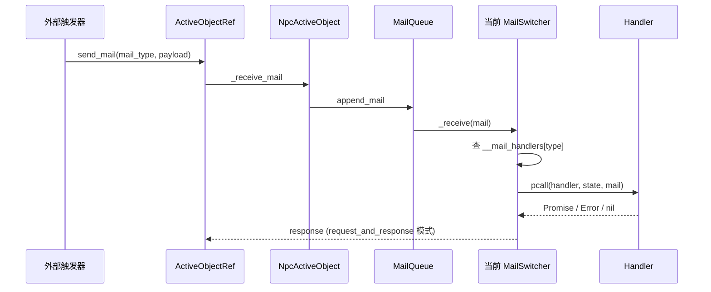
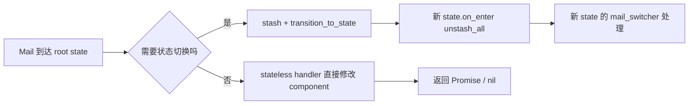
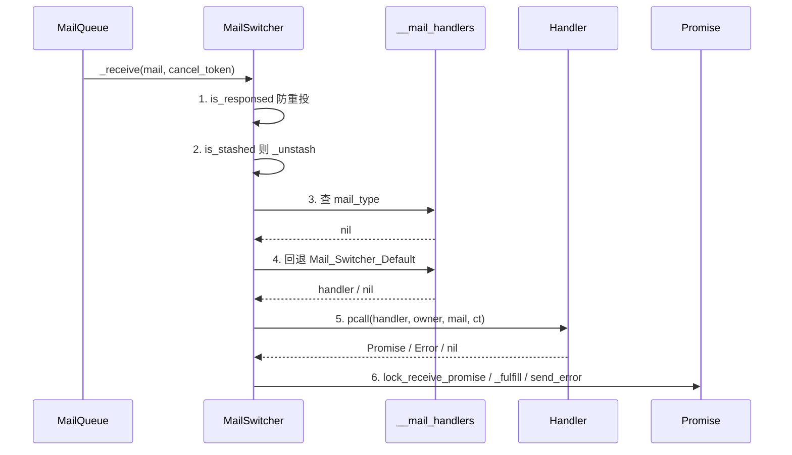
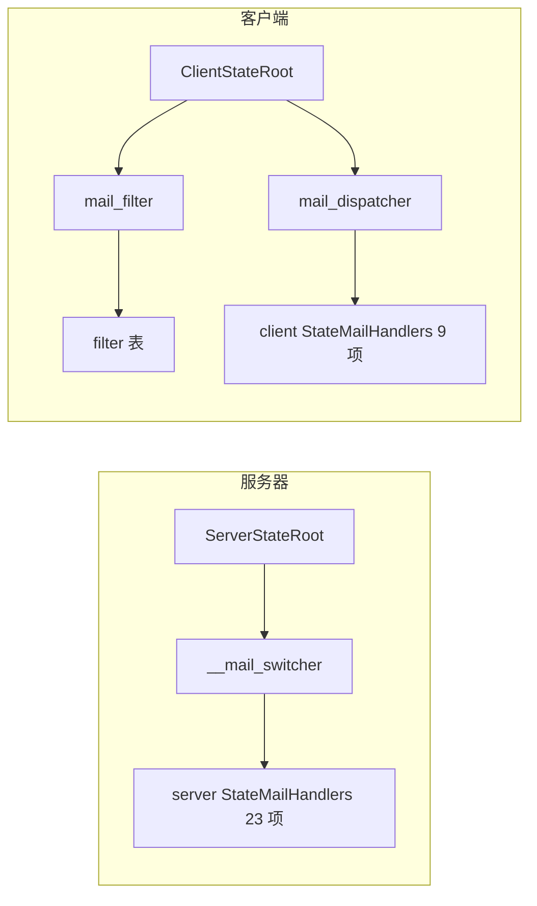

# 6. Mail 类型与 Handler 路由

> NPC 用 Mail 作为状态机的统一输入。`NpcConst.Enum_Mail_Type` 列出 60+ 类型,被 `state_mail_handlers` 共享仓库与各 state 的 `__mail_switcher` 共同消费。
> 本页梳理 Mail 类型分类、Stateful vs Stateless 决策、共享仓库结构、`MailSwitcher:_receive` 路由顺序与双端差异[^npc-02][^npc-05][^npc-15]。

## 1. Mail 在 NPC 中的角色

外部触发(EventFlow / 玩家交互 / 任务系统 / 客户端 RPC)不会直接调用 NPC 方法,而是统一构造一个 `Mail` 投递给 `NpcActiveObject`,由当前激活的 `MailSwitcher` 路由到 handler。



> 当前激活的 `MailSwitcher` 由 `NpcStateBase.on_enter` 通过 `__active_object:become(self.__mail_switcher, true)` 切换,详见 →[5. NpcActiveObject 与 13 状态机](5.%20NpcActiveObject%20与%2013%20状态机.md)。

## 2. 60+ Mail Type 大全 (按业务簇)

`NpcConst.Enum_Mail_Type` 共 60+ 项[^npc-15],下面分 7 个业务簇逐表列出。每行格式:`常量名 / 字符串值 / 触发场景 / 处理状态`。

### 2.1 动画簇 (6+)

| 常量 | 字符串值 | 触发场景 | 处理状态 |
|---|---|---|---|
| `Play_Anim_Montage` | `'Play_Anim_Montage'` | EF/任务/对话播 montage | root + 多个 state (stateless 复制) |
| `Play_Dynamic_Montage` | `'Play_Dynamic_Montage'` | 动态 montage(运行时合成) | root + ChangeHead/Move (stateless) |
| `Stop_Montage_In_Slot` | `'Stop_Montage_In_Slot'` | 中断指定 slot 上的动画 | root (stateless) |
| `Play_Monologue` | `'Play_Monologue'` | NPC 头顶播一段独白 | root (stateless) |
| `Play_Mission_Monologue` | `'Play_Mission_Monologue'` | 任务专用独白(共用 handler) | root (stateless) |
| `Preload_Npc_Anim_Asset` | `'Preload_Npc_Anim_Asset'` | 提前加载动画资产 | root (stateless,双端) |

### 2.2 对话簇 (11+)

| 常量 | 字符串值 | 触发场景 | 处理状态 |
|---|---|---|---|
| `Start_Dialogue` | `'Start_Dialogue'` | 玩家发起单人对话 | normal/move/dialogue/dialogue_group |
| `Stop_Dialogue_Interact` | `'Stop_Dialogue_Interact'` | 中止对话交互 | dialogue |
| `Wait_Dialogue_Interact_Perform_First_Phase` | `'Wait_..._First_Phase'` | 等对话首阶段表演完成 | dialogue |
| `Start_Dialogue_Interact_Perform` | `'Start_Dialogue_Interact_Perform'` | 服务器→客户端启动对话表演 | client dialogue |
| `Disconnect_Dialogue` | `'Disconnect_Dialogue'` | 玩家掉线导致对话中断 | dialogue |
| `Start_Dialogue_Group` | `'Start_Dialogue_Group'` | 启动多人对话 | root (stateful) → DialogueGroup |
| `Stop_Dialogue_Group` | `'Stop_Dialogue_Group'` | 结束多人对话 | dialogue_group |
| `Enter_Dialogue_Group` | `'Enter_Dialogue_Group'` | 加入已存在的多人对话 | root (stateful) → DialogueGroup |
| `Exit_Dialogue_Group` | `'Exit_Dialogue_Group'` | 中途退出多人对话 | dialogue_group |
| `Sync_Dialogue_Group_Progress` | `'Sync_Dialogue_Group_Progress'` | 多人对话进度同步 | root (写 server logic comp) |
| `Resume_Dialogue_Group` | `'Resume_Dialogue_Group'` | 重连/重入多人对话 | dialogue_group |

### 2.3 表演簇 (15+)

| 常量 | 字符串值 | 触发场景 | 处理状态 |
|---|---|---|---|
| `Start_Cutscene` | `'Start_Cutscene'` | 开始过场 cutscene | (枚举存在,目前未单独 case) |
| `Stop_Cutscene` | `'Stop_Cutscene'` | 结束过场 | 同上 |
| `Play_Exit_Performance` | `'Play_Exit_Performance'` | NPC 出场/销毁表演 | root (stateful) → Destroy |
| `PlayPerformanceChangeHead` | `'PlayPerformanceChangeHead'` | 触发换头表演 | root (stateful) → ChangeHead |
| `StopPerformanceChangeHead` | `'StopPerformanceChangeHead'` | 停止换头 | change_head/charm/move |
| `StopCharmPerformance` | `'StopCharmPerformance'` | 停止魅惑表演 | charm |
| `Request_Charm_Config` | `'Request_Charm_Config'` | 拉取魅惑 DT 配置 | charm |
| `Start_PaoPao` | `'Start_PaoPao'` | 进入泡泡互动 | root (stateful) → PaoPao |
| `Stop_PaoPao` | `'Stop_PaoPao'` | 退出泡泡互动 | paopao |
| `Show_Bubble` | `'Show_Bubble'` | 头顶气泡 / 任务提示 | root (stateless,双端) |
| `Start_Float` | `'Start_Float'` | 起飞悬浮表演 | change_head + float |
| `Stop_Float` | `'Stop_Float'` | 停止悬浮 | float |
| `Notify_Float_Landed` | `'Notify_Float_Landed'` | 着陆事件回弹到 ChangeHead | float |
| `Play_Effect` | `'Play_Effect'` | 播 Niagara / 静态网格特效 | root (stateless) |
| `Stop_Effect` | `'Stop_Effect'` | 停止特效 | root (stateless) |

### 2.4 移动簇 (8+)

| 常量 | 字符串值 | 触发场景 | 处理状态 |
|---|---|---|---|
| `Teleport` | `'Teleport'` | 立即瞬移 | root (stateful) → Teleport |
| `Mission_Teleport` | `'Mission_Teleport'` | 任务流瞬移(轻量) | root (stateless) |
| `Move_To_Way_Point` | `'Move_To_Way_Point'` | 走到指定 WayPoint Actor / 坐标 | normal/move |
| `Move_To_Actor` | `'Move_To_Actor'` | 跟随某 Actor 移动 | normal/move |
| `Stop_Move` | `'Stop_Move'` | 中止当前移动 | move/change_head_move |
| `Change_Move_Speed` | `'Change_Move_Speed'` | 切换 Walk/Run/Sprint | root (stateless) |
| `Move_Along_Spline` | `'Move_Along_Spline'` | 沿 Spline 移动 | normal/move |
| `Move_Way_Point_Group` | `'Move_Way_Point_Group'` | 一组 WayPoint 链式 | normal/move |

### 2.5 淡入淡出/隐藏 (2)

| 常量 | 字符串值 | 触发场景 | 处理状态 |
|---|---|---|---|
| `Show_Or_Hide` | `'Show_Or_Hide'` | NPC 显隐(进/出 Stealth) | root (stateful) → Stealth |
| `Play_Fade` | `'Play_Fade'` | 整体淡入淡出 | root (stateless) |

### 2.6 任务会话 (6+)

| 常量 | 字符串值 | 触发场景 | 处理状态 |
|---|---|---|---|
| `Enter_Mission_Session` | `'Enter_Mission_Session'` | 进入 mission session(独占) | root (stateless) |
| `Exit_Mission_Session` | `'Exit_Mission_Session'` | 退出 mission session | root (stateless) |
| `Set_Exclusive_Interact` | `'Set_Exclusive_Interact'` | 标记当前互动独占 | root (stateless) |
| `Start_Tracking_Task` | `'Start_Tracking_Task'` | 启动追踪任务 | root (stateless) |
| `Start_Escort_Task` | `'Start_Escort_Task'` | 启动护送任务 | root (stateless) |
| `Unload` | `'Unload'` | 卸载触发(枚举占位) | (待绑) |

### 2.7 其他 (7+)

| 常量 | 字符串值 | 触发场景 | 处理状态 |
|---|---|---|---|
| `Change_Display_Name` | `'Change_Display_Name'` | 修改 NPC 名牌 | root (stateless,双端) |
| `Speak_Voice` | `'Speak_Voice'` | NPC 播语音 | normal |
| `Turn_Body_Yaw` | `'Turn_Body_Yaw'` | 转身到 yaw | root (stateless,双端) |
| `Turn_Body_Target_Location` | `'Turn_Body_Target_Location'` | 朝向指定坐标 | root (stateless,双端) |
| `Turn_Body_Target_Actor` | `'Turn_Body_Target_Actor'` | 朝向指定 Actor | root (stateless,双端) |
| `Look_At_Mode_Change` | `'Look_At_Mode_Change'` | 切换 LookAt 模式 | root (stateless) |
| `Player_Touch_NPC` | `'Player_Touch_NPC'` | 玩家撞到 NPC 的触发 | root (stateless,双端) |

> 客户端服务器同名 Mail 经独立 Switcher 处理,具体差异见 §6 / §7。

## 3. Stateful vs Stateless Handler 决策表

`NpcStateRoot` 加载时分两路注册:能在不切状态前提下完成的逻辑直接 `copy_handler_item` 拷贝自 `state_mail_handlers` 共享仓库,需要 stash + `transition_to_state` 的逻辑则在 root 内 `__mail_switcher:case` 直接绑方法。

| 维度 | Stateful (放状态里) | Stateless (放共享仓库) |
|---|---|---|
| 触发场景 | 需要状态切换或维护状态 | 仅修改 component / 蓝图属性 |
| 实现位置 | state 类 `case` 自有方法 | `state_mail_handlers.lua` |
| 副作用 | `stash(_mail)` + `transition_to_state` | 调 `XxxComponent` 接口、可能返回 Promise |
| 共享方式 | 不可共享 (绑实例) | `MailSwitcher:copy_handler_item(repo, type)` |
| 例子 | `Teleport`、`Show_Or_Hide`、`Play_Exit_Performance`、`Start_PaoPao`、`Start_Dialogue_Group`、`Enter_Dialogue_Group`、`PlayPerformanceChangeHead` | `Play_Anim_Montage`、`Show_Bubble`、`Change_Display_Name`、`Play_Effect`、`Turn_Body_Yaw`、`Mission_Teleport`、`Enter_Mission_Session` |



## 4. state_mail_handlers 共享仓库

`Projects/HiGame/Content/Script/npc/states/server/state_mail_handlers.lua` 把所有「不依赖状态切换」的 handler 打成一张 LUT;签名固定 `function(_state, _mail) -> Promise|Error|nil`[^npc-05]。

```lua
-- state_mail_handlers.lua (节选)
local StateMailHandlers = {}

StateMailHandlers[NpcConst.Enum_Mail_Type.Play_Anim_Montage]      = __handler_play_anim_montage
StateMailHandlers[NpcConst.Enum_Mail_Type.Play_Dynamic_Montage]   = __handler_play_dynamic_montage
StateMailHandlers[NpcConst.Enum_Mail_Type.Show_Bubble]            = __handler_show_bubble
StateMailHandlers[NpcConst.Enum_Mail_Type.Change_Display_Name]    = __handler_change_display_name
StateMailHandlers[NpcConst.Enum_Mail_Type.Play_Fade]              = __handler_play_fade
-- ...共 23 项
return StateMailHandlers
```

各 state 的 `register_mail_handlers()` 通过 `copy_handler_item` 从 LUT 中按需挑选:

```lua
-- npc_state_root.lua:register_mail_handlers (节选)
self.__mail_switcher:copy_handler_item(StateMailHandlers,
    NpcConst.Enum_Mail_Type.Play_Anim_Montage)
self.__mail_switcher:copy_handler_item(StateMailHandlers,
    NpcConst.Enum_Mail_Type.Show_Bubble)
self.__mail_switcher:copy_handler_item(StateMailHandlers,
    NpcConst.Enum_Mail_Type.Change_Display_Name)
-- ...共 23 个 stateless handler 拷贝
```

| 区域 | Stateless handler |
|---|---|
| Animation | `__handler_play_anim_montage`、`__handler_play_dynamic_montage`、`__handler_stop_montage_in_slot` |
| Turn body | `__handler_turn_body_{yaw,target_location,target_actor}` |
| Look at | `__handler_look_at_mode_change` |
| Monologue | `__handler_play_monologue` (兼 `Play_Monologue` / `Play_Mission_Monologue`) |
| Widget | `__handler_show_bubble`、`__handler_change_display_name` |
| Fade / Speed | `__handler_play_fade`、`__handler_change_move_speed` |
| Teleport | `__handler_mission_teleport` |
| Mission session | `__handler_enter_mission_session`、`__handler_exit_mission_session` |
| Interact / Task | `__handler_set_exclusive_interact`、`__handler_start_tracking_task`、`__handler_start_escort_task` |
| Anim asset | `__handler_preload_npc_anim_asset` |
| Effect | `__handler_play_effect`、`__handler_stop_effect` |
| Player touch | `__handler_player_touch_npc` |

> `NpcStateRoot`、`NpcStateChangeHead`、`NpcStateCharm`、`NpcStateFloat`、`NpcStateMoveChangeHead` 都通过 `copy_handler_item` 共享同一份实现,避免每个 state 重写一次 anim / turn / effect 逻辑。

## 5. MailSwitcher 路由调度顺序

`mail_switcher.lua:_receive`(行 37-92)定义统一的 6 步路由[^npc-02]:



```lua
-- mail_switcher.lua:_receive 关键代码
function MailSwitcher:_receive(_mail, _cancel_token)
    if _mail:is_responsed() then return end                              -- 步骤 1
    if _mail:is_stashed()  then _mail:_unstash() end                     -- 步骤 2
    local handler = self.__mail_handlers[_mail:get_type()]               -- 步骤 3
                  or self.__mail_handlers[Const.Mail_Switcher_Default]   -- 步骤 4
    if not handler then
        return _mail:send_error(Const.Error_Send_Mail_No_Handler)
    end
    local ok, ret = pcall(handler, self.__handler_owner, _mail, _cancel_token)  -- 步骤 5
    -- 步骤 6: 根据返回值类型 settle promise (Promise / FulfilledResult / Error / nil)
end
```

## 6. 客户端 mail 路由差异

服务器 `NpcActiveObject` 仅有一个 `__curr_mail_switcher`,客户端 `NpcClientStateRoot` 引入 **mail_filter / mail_dispatcher 双 Switcher** 模式[^npc-05]。filter 决定 mail 是否被本端拦截、dispatcher 决定如何处理(类似中间件 + 处理器分离)。

| 维度 | 服务器 (NpcActiveObject) | 客户端 (NpcClientStateRoot) |
|---|---|---|
| Switcher 数 | 1 (`__mail_switcher`) | 2 (`mail_filter` + `mail_dispatcher`) |
| 切换 API | `__active_object:become(switcher, true)` | `__npc_ref:set_mail_filter` + `set_mail_dispatcher` |
| Stash 出栈 | `unstash_all()` | `unstash_all_dispatch_mails()` |
| 共享仓库 | 23 个 handler | 9 个 handler (subset) |
| 处理范围 | 全业务(对话/任务/移动/特效) | 仅 anim/turn/widget/teleport 等表现层 |



## 7. 跨端 Mail 协议清单

服务器 stateful handler 处理后通常 `send_mail` 给客户端 `mail_dispatcher` 完成表现层同步。下表标记 Mail 在哪一端实现 handler:

| Mail Type | 服务器 | 客户端 | 说明 |
|---|---|---|---|
| `Show_Bubble` | ✓ | ✓ | 双端同名 handler,服务器写状态客户端展示 |
| `Change_Display_Name` | ✓ | ✓ | 双端 |
| `Turn_Body_Yaw` / `Target_Actor` / `Target_Location` | ✓ | ✓ | 双端 |
| `Play_Anim_Montage` / `Play_Dynamic_Montage` | ✓ | ✓ | 双端,客户端复用同一仓库结构 |
| `Preload_Npc_Anim_Asset` | ✓ | ✓ | 双端预加载 |
| `Player_Touch_NPC` | ✓ | ✓ | 双端 |
| `Teleport` | ✓ (transition Teleport) | ✓ (兜底 K2_SetActorLocationAndRotation) | 客户端为兜底版 |
| `Look_At_Mode_Change` | ✓ | × | 服务器单端,通过 Replicated 属性同步 |
| `Play_Monologue` / `Play_Mission_Monologue` | ✓ | × | 客户端无 monologue,服务器 RPC 推动 |
| `Play_Fade` | ✓ | × | Fade 由 Replicated 属性驱动 |
| `Play_Effect` / `Stop_Effect` | ✓ | × | 服务器 spawn,客户端通过 actor 复制 |
| `Enter_Mission_Session` / `Exit_Mission_Session` | ✓ | × | server-only |
| `Speak_Voice` | ✓ | × | 服务器逻辑 |
| `Start_Dialogue_*` / `Stop_Dialogue_*` | ✓ | (部分) | 服务器主导,客户端有 `Start_Dialogue_Interact_Perform` |

> **同步路径** 包括三条:Mail (双端同名 handler)、Multicast RPC(如 `Multicast_ResumeDialogueGroup`)、Replicated UProperty(如 `MoveDynamicMontageData`)。Mail 不替代 RPC,二者并存。

## 8. Mail Handler 实现模板

### 8.1 Stateless 简单模板 (state_mail_handlers.lua)

```lua
local function __handler_show_bubble(_state, _mail)
    local payload = _mail:get_payload()
    -- 类型校验,防 RPC 'Text Lua is not allowed' 崩溃
    if not StateMailUtils.is_valid_show_bubble_payload(payload) then
        return NpcConst.Enum_NpcError.Show_Bubble_Invalid_Param
    end
    local widget_comp = _state.__npc_ref:get_node_handle()
        :get_component(NpcConst.NodeCompBindingKey.Widget_Component)
    if not widget_comp then
        return NpcConst.Enum_NpcError.Missing_Widget_Component
    end
    return widget_comp:show_bubble(payload)  -- 返回 Promise
end
```

### 8.2 Stateful 复杂模板 (npc_state_root.lua)

```lua
function NpcStateRoot:__handler_show_or_hide(_mail)
    local is_show = _mail:get_payload().is_show
    if is_show then
        -- 已显示,直接 fulfill
        return nil
    end
    -- 不显示 → stash 当前 mail,切到 Stealth state,由 stealth 接管
    self.__active_object:stash(_mail)
    self:transition_to_state(NpcConst.Enum_State.Stealth)
end

function NpcStateRoot:__handler_play_exit_performance(_mail)
    self.__active_object:stash(_mail)
    self:transition_to_state(NpcConst.Enum_State.Destroy)
end
```

> Stateful handler 的核心模式:`stash + transition_to_state`,新 state `on_enter` 调用 `unstash_all()` 把 mail 重新投递,这次会命中新 state 的 `__mail_switcher` 中真正的处理逻辑。

## 9. 调试 Mail 的方法

| 入口 | 用途 |
|---|---|
| `NpcConst.Debug_Mode` | 总开关,打开后 logger 多输出 |
| `Logger.info('godotliu', ...)` | 主 NPC 流程日志 |
| `Logger.info('npc_jx', ...)` | 任务/交互流程日志 |
| `Logger.info('mxr', ...)` | 移动相关日志 |
| `Logger.info('npc_state_changehead', ...)` | 换头流程日志 |
| `MailQueue:dump()` | 打印当前队列与 stash_box (开发期手动调) |
| `_mail:get_type()` / `:get_payload()` | 在 handler 内 print mail 内容 |

```lua
-- 在 handler 起始处插桩
function NpcStateRoot:__handler_show_or_hide(_mail)
    Logger.info('godotliu', '[Show_Or_Hide] payload=%s, is_stashed=%s',
        json.encode(_mail:get_payload()), tostring(_mail:is_stashed()))
    -- ...原逻辑
end
```

> 排错思路:① 先确认 mail 是否到达 → 在 `MailQueue:append_mail` 加日志;② 再确认走到哪个 Switcher → 看 `__handler_owner` 类名;③ 最后检查返回值 → handler 必须返回 Promise / Error / nil 三种之一,否则会触发 `Error_Send_Mail_Invalid_Return_Type`。

## 跨页链接

- → [2. Kittens — ActiveObject 与 Mail](2.%20Kittens%20—%20ActiveObject%20与%20Mail.md): MailSwitcher / MailQueue / Stash 底层机制
- → [5. NpcActiveObject 与 13 状态机](5.%20NpcActiveObject%20与%2013%20状态机.md): handler 在哪个状态注册、stateful handler 的 stash + transition 模式
- → [16. Cookbook + 陷阱 + 自检清单](16.%20Cookbook%20+%20陷阱%20+%20自检清单.md): 加新 Mail Type / 新 Handler 的标准流程

[^npc-02]: raw/npc-02-kittens-active-object.md
[^npc-05]: raw/npc-05-states-and-stateflow.md
[^npc-15]: raw/npc-15-const-enums-cross-reference.md
