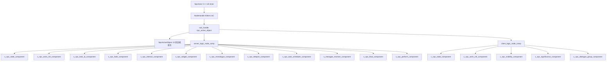
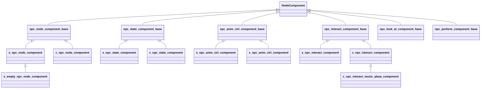
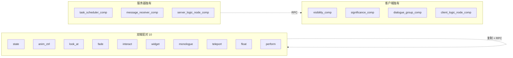
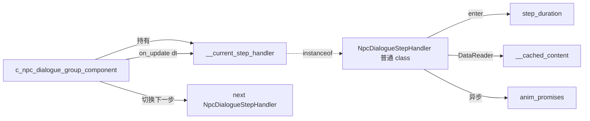
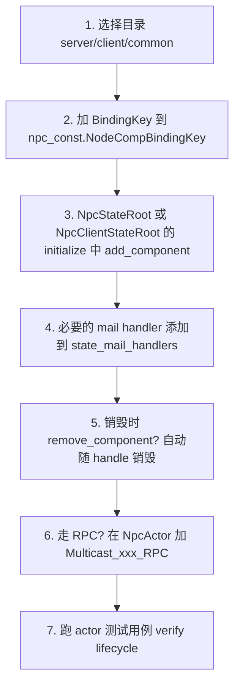

# 7. Node 组件矩阵

挂在 `NpcActor` 的 NodeHandle 之下、由 Kittens `create_node_component_class()` 创建的 15 个子组件,通过 17 个 `NpcConst.NodeCompBindingKey.*` 字符串 key 注册到 sub-handle。每个组件按职责拆分为 server / client 双端实现,加上 6 个 common base 提供共享接口,撑起整个 NPC 业务功能层 (动画、对话、传送、淡入淡出、表演特效、群聊、浮空等)。本页给出三栏对照矩阵 + 挂载时机 + 双端差异,作为查找特定组件实现的索引。

## 1. NodeComponent 在 NPC 架构中的位置



> **重要区分**: NodeComponent **不是** UE 的 ActorComponent / SceneComponent。它是 Kittens 框架在 Lua 层定义的纯逻辑容器,生命周期由 NodeHandle 驱动,不参与 UE 的反射系统。所有跨端调用都走 `npc_actor:call_rpc_func(...)` 走 UE RPC,而非 NodeComponent 自带的网络层。

## 2. NodeCompBindingKey 全表 (17 键)

> verbatim from `Content/Script/npc/npc_const.lua:310-328`

| Const 字段 | 字符串值 |
|---|---|
| `Anim_Ctrl_Comp` | `'anim_ctrl_comp'` |
| `Look_At_Comp` | `'look_at_comp'` |
| `Fade_Comp` | `'fade_component'` |
| `Interact_Comp` | `'npc_interact_comp'` |
| `Visibility_Comp` | `'visibility_comp'` |
| `Significance_Comp` | `'significance_comp'` |
| `Task_Scheduler_Comp` | `'task_scheduler_comp'` |
| `Widget_Component` | `'npc_widget_component'` |
| `Monologue_Comp` | `'monologue_component'` |
| `Teleport_Comp` | `'teleport_component'` |
| `State_Comp` | `'state_component'` |
| `Message_Receiver_Comp` | `'message_receiver_comp'` |
| `Server_Logic_Node_Component` | `'server_logic_node_comp'` |
| `Client_Logic_Node_Component` | `'client_logic_node_comp'` |
| `Dialogue_Group_Comp` | `'dialogue_group_comp'` |
| `Float_Comp` | `'float_component'` |
| `Perform_Comp` | `'perform_component'` |

补充: `NodeHandleBindingKey.npc_active_object = 'npc_active_object'` 不在 NodeCompBindingKey 中,而是 sub-handle 自身的绑定 key,在 `NpcNodeComponentBase:get_or_create_node_handle()` 内部使用。

> 17 BindingKey 对应 15 组件类: `Server_Logic_Node_Component` / `Client_Logic_Node_Component` 是 *同一概念在双端的两条 key*,加上 `s_empty_npc_node_component` 复用 server key,故是 17 ≠ 15。

## 3. 15 NodeComponent 三栏对照大表

> 核心查找表! 列依次给出 BindingKey、server 文件、client 文件、common base、一句话职责。

| BindingKey | server class | client class | common base | 一句话职责 |
|---|---|---|---|---|
| `state_component` | `s_npc_state_component` | `c_npc_state_component` | `npc_state_component_base` | StateAccessaryTags 容器 + state machine tag 同步 |
| `anim_ctrl_comp` | `s_npc_anim_ctrl_component` | `c_npc_anim_ctrl_component` | `npc_anim_ctrl_component_base` | montage / dynamic montage / 转身动画播放 |
| `look_at_comp` | `s_npc_look_at_component` | `c_npc_look_at_component` | `npc_look_at_component_base` | LookAtMode 切换 + 视野范围搜目标 |
| `fade_component` | `s_npc_fade_component` | `c_npc_fade_component` | — | 整体淡入淡出 (mask material) |
| `npc_interact_comp` | `s_npc_interact_component` | `c_npc_interact_component` (+ `c_npc_interact_music_plaza_component`) | `npc_interact_component_base` | 对话条目收集 / 对话条件监听 |
| `visibility_comp` | — | `c_npc_visibility_component` | — | 渲染可见性、隐藏原因 mask、SoulMeter 兼容 |
| `significance_comp` | — | `c_npc_significance_component` | — | 距离重要性分级 + 类目回调 |
| `task_scheduler_comp` | `s_npc_task_scheduler_component` | — | — | global_task_id 与 mission session 准入 |
| `npc_widget_component` | `s_npc_widget_component` | `c_npc_widget_component` | — | 名牌 / 头顶气泡 / 任务图标 显示 |
| `monologue_component` | `s_npc_monologue_component` | `c_npc_monologue_component` | — | 自言自语独白播放 (HUD nag) |
| `teleport_component` | `s_npc_teleport_component` | `c_npc_teleport_component` | — | 传送至目标 transform / point id |
| `message_receiver_comp` | `s_messgae_receiver_component` ⚠ | — | — | actor message 路由 (Decorator 注册) |
| `server_logic_node_comp` | `s_npc_node_component` (+ `s_empty_npc_node_component`) | — | `npc_node_component_base` | NPC 服务端逻辑根: 创建 ActiveObject、动态加 9 个子组件 |
| `client_logic_node_comp` | — | `c_npc_node_component` | `npc_node_component_base` | NPC 客户端逻辑根: 动态加 7 个子组件 |
| `dialogue_group_comp` | — | `c_npc_dialogue_group_component` | — | 多 NPC 群聊步骤序列 + 步骤处理器 |
| `float_component` | `s_npc_float_component` | `c_npc_float_component` | — | NPC 浮空 (上升/悬停/下降 三阶段) |
| `perform_component` | `s_npc_perform_component` | `c_npc_perform_component` | `npc_perform_component_base` | Niagara/StaticMesh/SkeletalMesh 特效播放 |

⚠ `s_messgae_receiver_component.lua` 文件名笔误 (messgae vs message),但内部 `create_node_component_class('message_receiver_comp', ...)` 仍与 BindingKey 对齐。

> 顶层 `components/` 目录另有两个 *未挂入 BindingKey* 的孤立组件: `npc_dialogue_component` (空 `:test()` 占位) 和 `npc_voice_component` (`:speak_voice` 占位,作者标记 TODO @godotliu),都属于骨架/未完成原型,运行期不被加载。

## 4. 各组件职责详解

### state_component (state_comp)

管理 `NpcActor.StateAccessaryTags` (`FGameplayTagContainer`) 与状态机 root tag 同步。Server 端 `init_on_actor_begin_play` 在 `HasAuthority()` 下加 default tags,并把 `bImmuneToChangeHead` 写成 `ChangeHead_Immunity_Tag.All`;通过 `_set_state_machine(_state_flow_exec)` 注册 `register_state_transitioned` 回调,把 new tag 写到 actor 的 `StateTag` UProperty。Client 用 `rawget/rawset` 维护 `__local_state_tag_container`、`__accessary_tag_changed_delegate`,`on_rep_state_accessary_tags` 收到复制后 refresh。

### anim_ctrl_comp

Base 提供 `__async_load_anim_asset_by_soft_obj_ptr`、`__get_turn_body_anim_asset_soft_obj_ptr_and_length` 等 yaw → 转身资源映射。Server `play_anim_montage` 调用 `npc_actor:call_rpc_func('Multicast_PlayMontageByRef', ...)`,写 `set_st_play_montage_data` 并管理 timer wait。Client 维护 `__montage_load_promise_caches / __anim_sequence_load_promise_caches`、转身 yaw 插值、`AnimStateTypeDatas`(idle/walk/run/sprint/sit) 状态枚举映射。

### look_at_comp

Base 仅缓存 `__npc_actor`(15 行,实质是占位)。Server `look_at_mode_change` 写 `LookAtMode` UProperty;Client 在 `on_start` 初始化 TickGroup `'TG_NPC_LookAt'` (time_budget 0.5ms, sort_interval 5)、视野角 yaw、半角余弦、触发/停止距离、搜索冷却 0.2s,每帧更新 `__look_at_target_actor`。

### fade_component

Server `play_fading(_fade_in,_seconds,_wait_complete)` 通过 `MultiCast_PlayFade` 多播 + timer fulfill promise。Client 维护 `mask_start/mask_end/mask_duration/mask_current` 区间值 (默认 0..10),`MultiCast_PlayFade_RPC` 即客户端处理;`on_init` 时 `check_and_play_enterance_performance()` 触发出场表演;`on_release` 取消 fading 并 reject init promise。

### npc_interact_comp

Base `__collect_interact_items()` 从 `LastDialogueConditionId` → `DialogueConditionList` → `DefaultInteractList` → `NpcBaseData[npc_id].interact` 依次取条目。Server 在 `on_actor_receive_begin_play` 异步等 `PlayerStateUtils.get_player_state_exist_promise`,再 `register_conditions(NpcDialogueConditionKey,...)` 监听未完成条件;`OnDestroyMutableActor` 时 unregister。Client `on_start` 调 `__init_interact_query` + `check_and_create_dialogue_trigger` 维护 `__dialogue_flow_triggers / __mission_dialogue_entrance_items / __static_interact_entrance_items`。子类 `c_npc_interact_music_plaza_component` 重写 `get_hello_content` / `__collect_interact_items`,从 `PlayerState.MusicPlazaComponent` 取数据。

### visibility_comp

`__hide_reason: table<any,boolean>` 隐藏原因集合;`on_start` 区分 empty NPC vs character NPC,按 significance 阈值 `Significance_Name_Table.skeletal_middle` 决定渲染;注册 `register_significance_callback(Enum_Significance_Category_Name.skeletal, ...)`;接 SoulMeter `CheckForeverShowRecordById` 决定 `Soul_Meter` 隐藏。Reason mask 列表见 `Enum_Npc_Hide_Reason` (8 种)。

### significance_comp

用 `rawset` 存 `__significance_lut/__significance_val/__significance_changed_signal`。`init_significance` 注册 4 个 category 默认回调: skeletal、node_handle、movement、masked_material;提供给所有其他 client 组件作为重要度信号源。`c_npc_node_component:on_init` 显式先 add Significance_Comp,再 add State_Comp,确保后续组件可以拿到 lut。

### task_scheduler_comp

`__global_task_id` + mission session 准入: `__curr_mission_session_key`、`__pending_enter_session_request_list/_mapping`、`__reversed_request_mapping`、`__mission_session_released_delegate`。`__async_setup_global_task_conditions` 异步注册 global task 条件;`OnDestroyMutableActor` 注销所有条件。承担 `Enum_GlobalTaskType.{MoveToWayPoint, MoveToWayChain, MoveAlongSpline}` 的全局协调。

### npc_widget_component

Server 监听 `ToplogoConditionList` 完成后 `__show_last_display_name / __show_last_display_identity / __listen_unfinished_toplogo_conditions`;管理头顶气泡 timer (`__bubble_timer`)、`OnDestroyMutableActor` 清条件。Client 注册 4 个 significance 回调: name/happiness/bubble/track_icon;监听 `register_on_state_accessary_tag_changed_listener` 触发 `OnTrackingHandle / OnFollowingHandle`;用 `ViewModelCollection.HudMessageCenterVM` 发气泡。

### monologue_component

Server `__get_monologue_seconds` 累加每条 `monologue.Time` / `__get_voice_time(VoiceID)` + `Interval`,超时清 `__monologue_timer`。Client `on_start` 立刻 `check_show_monologue(self.__npc_actor.MonologueId, true)`,按 `MonologueBasicTable` 判距离;`HudMessageCenterVM:HideNagging(true,true) → ShowNagging(monologue_data)`;将 `HeadIconRef` 字符串注入到 `data.NpcID`。

### teleport_component

Server 三种入口: `teleport(use_location, point_id, location, rotator)`、`teleport_by_mission(mission_id) → teleport_to_office_by_mission`、`teleport_by_point_id` 通过 `SubsystemUtils.GetMutableActorSubSystem().GetActor(point_id)` 取目标 transform,加 capsule half-height。Client `check_teleport(_teleport_trasnform)` 收到非零 transform 后 `call_component_function('on_npc_teleport_finished')`。

### message_receiver_comp

通过 `decorator.decorator_type_message_receiver` 把组件方法注册到 actor 的 message bus;`on_init` 调 `ActorCommon.AddMessageReceivers(actor, self, 'S_MessageReceiverComponent')`;`on_enable/on_disable` 在 `actor.__active_server_components__` 表里挂/摘自身;`on_release` 时 `ClearServerComponentMessageReceivers`。已注册的方法包括 `OnActorCustomizedUnloading`。

### server_logic_node_comp

NPC 服务端逻辑根。`s_npc_node_component:on_init` 先把 state_component 加进 sub_handle,`on_start` 中: `create_active_object → npc_state_component:init_on_actor_begin_play → register NpcGM(debug) → __refresh_move_speed → __check_and_set_use_exit_performance_flow → call_component_function('on_actor_receive_begin_play') → SwitchSkeletalMeshTickEnableOnDs(false) → fulfill server_logic_comp_started_promise → bind_ao_to_proxy_ref`。`on_actor_receive_end_play` 转发到所有子组件。子类 `s_empty_npc_node_component` 给"空壳" NPC override `__refresh_move_speed → nil`,改用 `s_empty_npc_event_flow_context_mixin`。

### client_logic_node_comp

客户端逻辑根。`c_npc_node_component:on_init` 先把 `Significance_Comp` 与 `State_Comp` 加进 sub_handle (`add_component(...,key,true)`);`on_start` `init_on_actor_begin_play` 同步 state;提供 `__get_client_interact_component / __get_visibility_component / get_significance_component` getter;`add_state_accessary_tag` 转发到 state_component。

### dialogue_group_comp

群聊驱动器 (client only)。本地状态机 `DialogueGroupState = {IDLE, PLAYING, PAUSED, COMPLETED}`;缓存 `__dialogue_group_id / __loop_count / __dialogue_steps / __total_step_count / __current_step_index / __step_elapsed_time / __current_step_duration / __current_loop / __is_monologue_showing / __current_step_handler / __participant_npc_ids`;用 NodeComponent 生命周期 `on_enable / on_update / on_disable` 替代旧的 `NpcDialogueGroupTask`。子目录见 §8。

### float_component

Server 三阶段枚举 `FloatPhase = {IDLE, ASCENDING, HOLDING, DESCENDING}`;常量 `DEFAULT_HOLD_DURATION=10s / DEFAULT_MAX_HEIGHT=300cm / DESCEND_SAFETY_TIMEOUT=10s`;`start_float` Multicast `Multicast_StartFloat(max_height, hold_duration)` 并管理 `__hold_timer / __descend_safety_timer`。Client 用运动学积分 (`Cfg.ASCEND_ACCEL=200, MAX_ASCEND_SPEED=150, WIND_STRENGTH=15, BOB_AMPLITUDE=5, DESCENT_GRAVITY=400, LAND_VEL_THRESH=5, SAFETY_TIMEOUT=60`) 逐帧推进;`on_release` 若非 idle 则 `__force_restore` (强行复位 replicate / move_mode)。

### perform_component

Base 共享 `__effect_tag_counter` 与 `_generate_effect_tag()` (`'auto_effect_'..n`)。Server `play_effect` 接收 `(soft_ref, socket, loc_off, rot_off, scale, wait_complete, duration, tag, asset_type)`,通过 `Multicast_PlayNpcEffect_RPC` 下发;用 `__active_effects[tag] = {timer_handle, promise}` 跟踪。Client 在 `Multicast_PlayNpcEffect_RPC` 中按 `_asset_type ∈ {'niagara','static_mesh','skeletal_mesh'}` 异步加载 → spawn → 注册 timer;`__load_promises[tag]` 用于 on_release 时 abandon 加载中的 promise。

## 5. 6 个 common base 类的作用

| Base 类 | 文件 | 共享字段/接口 |
|---|---|---|
| `npc_node_component_base` | common/npc_node_component_base.lua | `npc_actor`, `__sub_handle`(node handle 单例), `get_or_create_node_handle()`, `get_handle()`, `get_actor()`, `get_anim_ctrl_component()`, `get_node_fade_component()` 等 getter |
| `npc_state_component_base` | common/npc_state_component_base.lua | `__npc_actor`, `init_on_actor_begin_play` (抛 override 错误), `is_changehead_immune(interact_type)`, `__add_default_accessary_tags()`, `__get_state_tag_container()` |
| `npc_anim_ctrl_component_base` | common/npc_anim_ctrl_component_base.lua | 资源软引用异步加载 + 转身角度 → 动画状态枚举映射 (`E_NPC_Child_State_Anim.turn_left/right_90/180`),提供 `__npc_anim_default_state` |
| `npc_interact_component_base` | common/npc_interact_component_base.lua | `__owner_actor`, `__npc_actor_id`, `__get_npc_id()`, `__collect_interact_items()` (LastDialogueConditionId→DialogueConditionList→DefaultInteractList→NpcBaseData 优先级链) |
| `npc_look_at_component_base` | common/npc_look_at_component_base.lua | 仅 `__npc_actor` 字段 (15 行,实质是占位) |
| `npc_perform_component_base` | common/npc_perform_component_base.lua | `__effect_tag_counter` + `_generate_effect_tag()` |



## 6. server vs client 命名约定

- **命名前缀**: `s_xxx`(server) / `c_xxx`(client) / `npc_xxx_base`(common) / 顶层无前缀(占位组件)。Class 名采 `S_/C_/Npc` PascalCase。
- **客户端独有** (4): `visibility_comp`、`significance_comp`、`dialogue_group_comp`、`client_logic_node_comp`。
- **服务器独有** (3+1): `task_scheduler_comp`、`message_receiver_comp`、`server_logic_node_comp` (+`s_empty_npc_node_component` 子类)。
- **双端配对** (10): state、anim_ctrl、look_at、fade、interact、widget、monologue、teleport、float、perform。



### 6.1 server → client RPC 桥接

| 组件对 | server 调用 | client RPC 处理函数 |
|---|---|---|
| anim_ctrl | `npc_actor:call_rpc_func('Multicast_PlayMontageByRef', ref, rate)` | actor 层 `MultiCast_PlayMontageByRef_RPC` 转给 anim_ctrl |
| fade | `npc_actor:call_rpc_func('MultiCast_PlayFade', fade_in, seconds)` | `C_NpcFadeComponent:MultiCast_PlayFade_RPC(b_fade_in, seconds)` |
| float | `npc_actor:call_rpc_func('Multicast_StartFloat', max_height, hold_duration)` | `C_NpcFloatComponent:Multicast_StartFloat_RPC(_max_height)` |
| perform | `npc_actor:call_rpc_func('Multicast_PlayNpcEffect', tag, ref, ...)` | `C_NpcPerformComponent:Multicast_PlayNpcEffect_RPC(...)` |
| state | UProperty 复制 `StateAccessaryTags`/`StateTag` | `C_NpcStateComponent:on_rep_state_accessary_tags` |
| teleport | actor location/rotation 复制 + 自定义 transform 检查 | `C_NpcTeleportComponent:check_teleport(_teleport_trasnform)` |

## 7. 组件挂载时机

`add_component` 调用约定 (统一形式):

```lua
self.__sub_handle:add_component(
    <ComponentClass>,                                  -- require 进来的 class
    {npc_actor = self.npc_actor},                      -- 或 {owner_actor=...}, 视组件 base 不同
    NpcConst.NodeCompBindingKey.<Key>,                 -- 字符串 key
    true                                                -- auto-start
)
```

### 7.1 NpcStateRoot:initialize (服务器侧 9 个 add_component)

```lua
-- 由 s_npc_node_component:on_init 提前 add: state_component
-- NpcStateRoot:initialize 中 add 以下 9 个:
self.__sub_handle:add_component(S_NpcAnimCtrlComponent,    {npc_actor=npc_actor}, K.Anim_Ctrl_Comp,        true)
self.__sub_handle:add_component(S_NpcLookAtComponent,      {npc_actor=npc_actor}, K.Look_At_Comp,           true)
self.__sub_handle:add_component(S_NpcFadeComponent,        {npc_actor=npc_actor}, K.Fade_Comp,              true)
self.__sub_handle:add_component(S_NpcInteractComponent,    {owner_actor=npc_actor}, K.Interact_Comp,        true)
self.__sub_handle:add_component(S_NpcWidgetComponent,      {owner_actor=npc_actor}, K.Widget_Component,     true)
self.__sub_handle:add_component(S_NpcMonologueComponent,   {npc_actor=npc_actor}, K.Monologue_Comp,         true)
self.__sub_handle:add_component(S_NpcTeleportComponent,    {npc_actor=npc_actor}, K.Teleport_Comp,          true)
self.__sub_handle:add_component(S_NpcTaskSchedulerComponent,{npc_actor=npc_actor},K.Task_Scheduler_Comp,    true)
self.__sub_handle:add_component(S_MessageReceiverComponent,{actor=npc_actor},     K.Message_Receiver_Comp,  true)
-- (float / perform 由 EF Action 或动态业务按需 add)
```

### 7.2 NpcClientStateRoot:initialize (客户端侧 7 个 add_component)

```lua
-- 由 c_npc_node_component:on_init 提前 add: significance_comp + state_component
-- NpcClientStateRoot:initialize 中 add 以下 7 个:
self.__sub_handle:add_component(C_NpcAnimCtrlComponent,   {npc_actor=npc_actor}, K.Anim_Ctrl_Comp,    true)
self.__sub_handle:add_component(C_NpcLookAtComponent,     {npc_actor=npc_actor}, K.Look_At_Comp,       true)
self.__sub_handle:add_component(C_NpcFadeComponent,       {npc_actor=npc_actor}, K.Fade_Comp,          true)
self.__sub_handle:add_component(C_NpcInteractComponent,   {owner_actor=npc_actor}, K.Interact_Comp,    true)
self.__sub_handle:add_component(C_NpcWidgetComponent,     {owner_actor=npc_actor}, K.Widget_Component, true)
self.__sub_handle:add_component(C_NpcMonologueComponent,  {npc_actor=npc_actor}, K.Monologue_Comp,     true)
self.__sub_handle:add_component(C_NpcVisibilityComponent, {owner_actor=npc_actor}, K.Visibility_Comp,  true)
-- (teleport / dialogue_group / float / perform 按需 add)
```

> **args 字段约定**: interact / visibility / widget 用 `owner_actor`;anim/look_at/fade/state/monologue/perform/teleport 用 `npc_actor`;message_receiver 用 `actor`。两个 key 在 actor 层是同一对象,仅命名沿用历史差异。

### 7.3 生命周期 hook 一览

| Hook | 谁调用 | 典型组件用途 |
|---|---|---|
| `on_init(args)` | NodeHandle add_component 时 | 缓存 `__args.npc_actor`/`owner_actor`、call `super.on_init` |
| `on_start` | NPC active object 完成绑定后 | 注册 listener、register significance callback、fulfill init_promise |
| `on_actor_receive_begin_play` | `s_npc_node_component:on_start` 广播 | 服务器侧异步加载 condition data、订阅 mission session |
| `on_enable / on_disable` | 主要 dialogue_group / message_receiver 用 | 进出 active 表、暂停 step ticking |
| `on_update(dt)` | NodeComponent tick | dialogue_group 推进 step、look_at 每帧搜目标、float 每帧积分 |
| `on_actor_receive_end_play` | `s_npc_node_component:on_actor_receive_end_play` | 清 timer、reject 未完成 promise |
| `on_release` | sub_handle:release | 解注册 callback、清缓存、`super.on_release` |
| `OnDestroyMutableActor` | actor 拆迁(MutableActor 销毁) | unregister 所有 server condition |

## 8. dialogue_group 子目录

`components/client/dialogue_group/` 仅 1 个文件 `npc_dialogue_step_handler.lua`。



- class `NpcDialogueStepHandler` (`Kittens.class('NpcDialogueStepHandler', nil)`,**普通 class 而非 NodeComponent**)。
- 常量: `CHARS_PER_SECOND = 3`、`DIALOGUE_INTERVAL_PADDING = 1`、`DEFAULT_STEP_DURATION = 3.0`。
- API: `initialize(_step_data, _step_index)` → `enter(_is_monologue_showing) -> (step_duration, is_monologue_showing, is_valid)`。Category != 1 视为无效 step,返回 0。
- 内部: `anim_promises`、`__cached_content` (一次性 `DataReaderWithWildcard:TryGetConstText(step_data.Detail)` 缓存),供 `__process_bubble` 与 `__calculate_duration` 共用。
- 调用方: `C_NpcDialogueGroupComponent.__current_step_handler` 持有,`on_update` 推进时间,结束后切下一个 step。

## 9. 与 C++ NPC Component 的桥接

NodeComponent 是 Lua 层逻辑容器,但许多组件最终需要触达 C++ 侧的 Engine/Plugin 子系统。关键桥接点:

```mermaid
sequenceDiagram
    participant Lua as Lua NodeComponent
    participant Actor as NpcActor C++
    participant Engine as UE Engine 子系统
    Lua->>Actor: npc_actor:call_rpc_func()
    Actor->>Engine: Multicast_xxx_RPC
    Engine-->>Actor: 复制到 client
    Actor-->>Lua: actor message → handler
```

| 组件 | C++ 组件 / 子系统 | 桥接方式 |
|---|---|---|
| `anim_ctrl_comp` | `HiNpcAnimInstance` (UAnimInstance 子类) | 通过 `Multicast_PlayMontageByRef` RPC 触发 montage,Anim BP 读 `AnimStateTypeDatas` 状态 |
| `significance_comp` | `USignificanceManager` (UE Engine) | `register_significance_callback` 在 actor 层把 4 个 category (skeletal/node_handle/movement/masked_material) 注册到 SignificanceManager,详见 [13. Significance 与性能分级](13.%20Significance%20与性能分级.md) |
| `task_scheduler_comp` | mission session subsystem | 通过 mission_id / session_key 跑 CustomTask, 详见 [11. CustomTask 五件套](11.%20CustomTask%20五件套.md) |
| `widget_component` | `ViewModelCollection.HudMessageCenterVM` | UMG 层 ViewModel 接收 ShowNagging/HideNagging 调用 |
| `teleport_component` | `MutableActorSubSystem.GetActor(point_id)` | 取 transform pin 用 capsule half-height 校正 |
| `message_receiver_comp` | actor message bus (`ActorCommon.AddMessageReceivers`) | Decorator `decorator_type_message_receiver` 把 lua 方法绑到 C++ 消息总线 |
| `interact_comp` | `PlayerStateUtils.get_player_state_exist_promise` | 等 PlayerState 就绪后才注册 condition |

## 10. 添加新 NodeComponent 的清单



具体步骤:

1. **选择目录**: `Content/Script/npc/components/{server|client|common}/`,文件名按 `s_xxx / c_xxx / npc_xxx_base` 前缀约定,内部用 `Kittens.NodeHandle.NodeComponent.create_node_component_class('<class_name>', <super>)`。
2. **加 BindingKey**: 编辑 `npc_const.lua:310-328`,加一行 `Foo_Bar_Comp = 'foo_bar_comp'`。
3. **add_component 挂载**: 在 `npc_state_root.lua:initialize` (server) 或 `npc_client_state_root.lua:initialize` (client) 中加 `self.__sub_handle:add_component(<Class>, <args>, K.Foo_Bar_Comp, true)`。注意先后顺序: 客户端 significance_comp 与 state_component 必须最先 add,在 `c_npc_node_component:on_init` 内已固定。
4. **mail handler**: 若组件需要响应 actor mail (例如 Play_Effect / Stop_Effect / Start_Float),把 handler 表合并到 `state_mail_handlers`,详见 [5. NpcActiveObject 与 13 状态机](5.%20NpcActiveObject%20与%2013%20状态机.md)。
5. **销毁**: NodeComponent **自动随 sub_handle:release 一起销毁**,不需要手动 remove_component;但要在 `on_release` 中清 timer / reject 未完成 promise / unregister condition。
6. **RPC**: 若需要 server → client 同步,在 `NpcActor.h` 加 `UFUNCTION(NetMulticast, Reliable, Client) Multicast_Foo_RPC(...)`,client 端在组件 `on_init` 时通过 actor 拿 handler 转发回 lua。
7. **EF Action 触达** (可选): 如果组件要被 Event Flow 节点调用,在 `Enum_NpcEventFlowNodeClsName` 加节点类名,详见 [8. EventFlow — 28 个 Action 节点](8.%20EventFlow%20—%2028%20个%20Action%20节点.md)。

## 跨页链接

- → [4. Kittens — NodeHandle 与 NodeComponent](4.%20Kittens%20—%20NodeHandle%20与%20NodeComponent.md): IoC 容器与 NodeComponent 生命周期总论
- → [5. NpcActiveObject 与 13 状态机](5.%20NpcActiveObject%20与%2013%20状态机.md): NpcStateRoot / NpcClientStateRoot 加载组件的入口
- → [13. Significance 与性能分级](13.%20Significance%20与性能分级.md): significance_comp 与 SignificanceManager 的详细绑定
- → [11. CustomTask 五件套](11.%20CustomTask%20五件套.md): task_scheduler_comp 跑 CustomTask 的 5 个文件
- → [8. EventFlow — 28 个 Action 节点](8.%20EventFlow%20—%2028%20个%20Action%20节点.md): EF Action 类与组件方法的对应关系

[^npc-06]: raw/npc-06-node-components.md
[^npc-15]: raw/npc-15-const-enums-cross-reference.md
