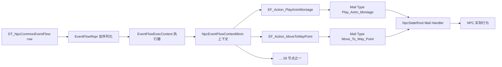
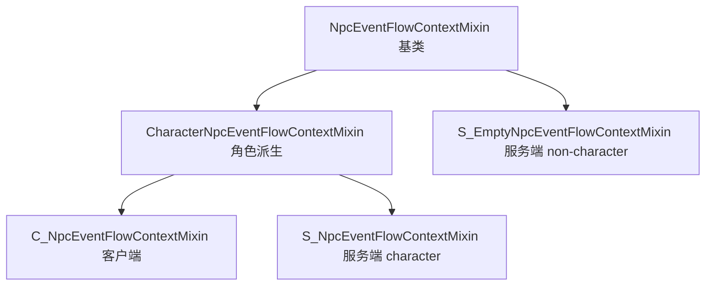
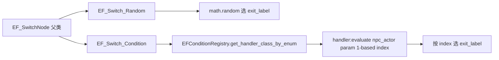
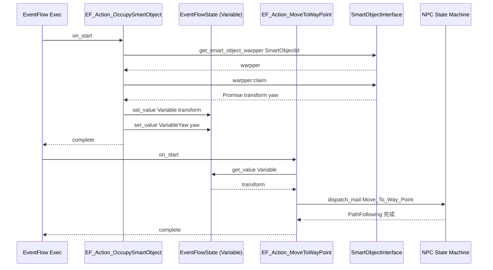
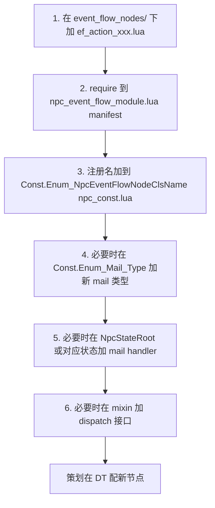

# 8. EventFlow — 28 个 Action 节点

> EventFlow 是给策划用的"行为脚本 DSL"。一行 DataTable 描述一段有向图,加载后由 Kittens 反序列化为 `EventFlowRepr`,运行期 NPC 通过 mixin 暴露能力,节点 `on_start` 把 raw_args 转成业务调用并 `complete` 触发后继。本页给出概念图、4 类 Mixin 上下文、28 节点全表、2 个 Switch、Pause/Resume 协议和 DataTable 行号语义。[^npc-07]

> 注:`Const.Enum_NpcEventFlowNodeClsName` 注册了 28 个 Action ClassName + 2 个 Switch,而 `npc_event_flow_module.lua` 当前实际 require 27 个 Action 实现(`ef_action_speak_voice.lua` 文件存在但不在 manifest,通过 mixin 接口供其他节点调用)。表中 28 行以注册表为准。[^npc-15]

## 1. EventFlow 概念

EventFlow = 数据驱动的协程图。策划在 DataTable(如 `DT_NpcCommonEventFlow`)配一行,每行包含一组节点 + 转移边。运行时由 `EventFlowExecContext` 持有该图,从 Entry 开始遍历,每个 Action 在 mixin 上下文中跑业务逻辑,`complete(err, res)` 后继续向后。



与 Kittens EventFlow 框架(见 [4. Kittens — NodeHandle 与 NodeComponent](4.%20Kittens%20—%20NodeHandle%20与%20NodeComponent.md))的关系:Kittens 提供基类 `EF_ActionNode` / `EF_SwitchNode` / `EventFlowRepr` / `await` 协程原语,HiGame NPC 在其上注册自己的 28 个领域节点,并定义 `NpcEventFlowContextMixin` 作为命名空间桥接。

控制流核心 idiom:

```lua
function EF_Action_Xxx:on_start(_cancel_token)
    local ef_context = self:get_context():get_mixin(NpcConst.Event_Flow_Context_Include_Key)
    if not ef_context:isInstanceOf(<对应 Mixin>) then ... self:complete(); return end
    local promise = ef_context:<some_call>(args, wait_complete)
    if wait_complete then
        local err, _ = Kittens.await(promise:get_future(), _cancel_token)
        self:complete(err, nil)
    else
        self:complete(nil, nil)
    end
end
```

## 2. 4 类 Mixin 上下文



| 文件 | 父类 | dispatch_mail 实现 | 暴露能力 | 适用场景 |
|---|---|---|---|---|
| `npc_event_flow_context_mixin.lua` | nil(基) | 抽象(子类 override) | state tag / display name / monologue / bubble / float / trigger_condition_event | 所有 NPC 共用基础接口 |
| `character_npc_event_flow_context_mixin.lua` | NpcEventFlowContextMixin | 抽象 | + 动画 / 移动 / 语音 / 特效 / Fade / LookAt / Teleport / TurnBody | character 形态 NPC |
| `c_npc_event_flow_context_mixin.lua` | CharacterNpcEventFlowContextMixin | `ActiveObjectRef:local_dispatch_mail` | 同上 | 客户端 NPC 跑本地表演 |
| `s_npc_event_flow_context_mixin.lua` | CharacterNpcEventFlowContextMixin | `ActiveObjectRef:send_mail` | 同上 | 服务端 NPC 主流程 |
| `s_empty_npc_event_flow_context_mixin.lua` | NpcEventFlowContextMixin | `ActiveObjectRef:send_mail` | 仅基础 | 服务端纯逻辑 NPC(无 mesh/动画) |

`receive_mode` 由 `wait_complete` 决定:`true → request_and_response`,`false → fire_and_forget`。Mail 类型见 [6. Mail 类型与 Handler 路由](6.%20Mail%20类型与%20Handler%20路由.md)。挂载点为 `NpcConst.Event_Flow_Context_Include_Key`。

## 3. 28 Action 节点全表

> Mixin 列:**N**=NpcEventFlowContextMixin / **C**=CharacterNpcEventFlowContextMixin。Mail 列:实际 dispatch 的 `Enum_Mail_Type`,"—"表示无 mail(直接调用或仅修改本地状态)。Stub 标记:注册名存在但实现尚在迁移。

| # | ClassName | 注册名 (Enum_NpcEventFlowNodeClsName.*) | Mixin | 关键输入字段 | Mail Type | 一句话场景 |
|---|---|---|---|---|---|---|
| 1 | EF_Action_AddOrRemoveStateTag | EF_Action_AddOrRemoveStateTag | N | StateAccessaryTag.TagName, IsAdd | — (server_logic_component) | 给 NPC 加/减 state tag(影响碰撞/可见/AI) |
| 2 | EF_Action_ChangeDisplayName | EF_Action_ChangeDisplayName | N | bShowToplogo, DisplayName | Change_Display_Name | 改头顶名字 / 显隐 toplogo |
| 3 | EF_Action_ChangeMoveSpeed | EF_Action_ChangeMoveSpeed | C | ENpcMoveGaitType, GaitSpeedRate | Change_Move_Speed | 切换 walk/jog/run 步态及倍率 |
| 4 | EF_Action_Collision | EF_Action_Collision | N | bEnable | — (转写 add_or_remove_state_tag) | 关/恢复 NPC 碰撞(语义糖) |
| 5 | EF_Action_Dialogue_Group | EF_Action_Dialogue_Group | C | DialogueGroupId, DialogueGroupLoopCount | Start_Dialogue_Group (await) | 启动多人对白组,等播放结束 |
| 6 | EF_Action_Effect | EF_Action_Effect | C | bIsPlay, ResourcesId, SocketName, EffectTag, Seconds, Location, Rotation, Scale, AssetType | Play_Effect / Stop_Effect | 播/停 Niagara/StaticMesh/SkeletalMesh 特效 |
| 7 | EF_Action_Fade | EF_Action_Fade | C | bFadeIn, Seconds, WaitComplete | Play_Fade | 黑屏淡入/淡出 |
| 8 | EF_Action_Float | EF_Action_Float | N | MaxHeight, Seconds, WaitComplete, IsAscending | Start_Float / Stop_Float | NPC 漂浮上升+悬停 / 触发下降 |
| 9 | EF_Action_LookAtModeChange | EF_Action_LookAtModeChange | C | ELookAtMode | Look_At_Mode_Change | 切换头/身体的 LookAt 模式 |
| 10 | EF_Action_MoveAlongSpline | EF_Action_MoveAlongSpline | C | MoveAloneSplineId, WaitComplete | Move_Along_Spline | 沿 Spline Actor 移动,支持 pause/resume 续走 |
| 11 | EF_Action_MoveAlongWayPointChain | EF_Action_MoveAlongWayPointChain | C | WayChainId, WaitComplete | Move_Way_Point_Group | 沿 way point chain 移动,pause 保存 group/index |
| 12 | EF_Action_MoveToActor | EF_Action_MoveToActor | C | MoveSpeed, TargetActorID, AcceptanceRadius, MoveBlockedEvflID, OverrideWayPointEvflID, ReevaluationTimeInterval, WaitComplete | Move_To_Actor | 跟随 Actor,blocked 时切到表演 flow |
| 13 | EF_Action_MoveToWayPoint | EF_Action_MoveToWayPoint | C | WayPointId, Location, Variable, MoveBlockedEvflID, OverrideWayPointEvflID, DynamicMontageKeyName, WaitComplete | Move_To_Way_Point | 移动到 WayPoint,可由 Variable 覆写终点 |
| 14 | EF_Action_OccupySmartObject | EF_Action_OccupySmartObject | C | SmartObjectId, SmartObjectVariable, EOccupyMode, Variable, VariableYaw, WaitComplete | — (warpper:claim/free) | 占用 SmartObject,结果 transform/yaw 写回变量 |
| 15 | EF_Action_PanicRun | EF_Action_PanicRun | C | Seconds, RandomRadius, AcceptanceRadius, MaxTurnAngle, DynamicMontageKeyName, MoveCount | Move_To_Way_Point (循环) | 在原点周围随机选点惊慌乱跑 |
| 16 | EF_Action_PlayAnimMontage | EF_Action_PlayAnimMontage | C | InPlayRate, WaitComplete, AnimAssetKeyName, Anim_Length, AnimMontage | Play_Anim_Montage | 播放 AnimMontage |
| 17 | EF_Action_PlayDynamicMontage | EF_Action_PlayDynamicMontage | C | SlotNodeName, BlendInTime, BlendOutTime, InPlayRate, LoopCount, BlendOutTriggerTime, AnimSequence, WaitComplete | Play_Dynamic_Montage | 用 AnimSequence + slot 动态合成 Montage |
| 18 | EF_Action_PlayMonologue | EF_Action_PlayMonologue | N | MonologueId, MonologueKeyName, WaitComplete | Play_Monologue | NPC 头顶气泡式独白 |
| 19 | EF_Action_PlayNpcDynamicMontage | EF_Action_PlayNpcDynamicMontage | C | KeyName (suffix), SlotNodeName, BlendInTime, BlendOutTime, InPlayRate, LoopCount, BlendOutTriggerTime, WaitComplete | Play_Dynamic_Montage | 按 NPC body type 拼前缀,从 DT 取 AnimSoftPtr |
| 20 | EF_Action_PreloadNpcAnimAsset | EF_Action_PreloadNpcAnimAsset | C | KeyName (suffix) | Preload_Npc_Anim_Asset | 预加载某 NPC 动画 soft asset |
| 21 | EF_Action_ShowBubble | EF_Action_ShowBubble | N | BubbleId, bShowBubble, WaitComplete | Show_Bubble | 显示/隐藏头顶气泡 |
| 22 | EF_Action_ShowOrHide | EF_Action_ShowOrHide | C | bEnable, Seconds | Show_Or_Hide | NPC mesh 显隐切换 |
| 23 | EF_Action_SpeakVoice | EF_Action_SpeakVoice | C | AudioId, WaitComplete | Speak_Voice | 播放配音(DTAudio) |
| 24 | EF_Action_Teleport | EF_Action_Teleport | C | bUseLocation, TeleportPointId, TpLocation, TpRotator, WaitComplete | Teleport | 瞬移到坐标或传送点 |
| 25 | EF_Action_TriggerConditionEvent | EF_Action_TriggerConditionEvent | N | ConditionActionType (E_NpcConditionActionType) | — (npc_actor) | 主动触发条件事件 |
| 26 | EF_Action_TurnBody | EF_Action_TurnBody | C | ETurnType, Yaw, YawStateKey, TargetLocation, TargetActorID, TargetActorIdStateKey, WaitComplete | Turn_Body_Yaw / Turn_Body_Target_Location / Turn_Body_Target_Actor | NPC 转身:按 yaw 角 / 朝向某点 / 朝向某 Actor |
| 27 | EF_Action_WaitSeconds | EF_Action_WaitSeconds | (any) | Seconds | — (Future.wait_for_seconds) | 等待 N 秒,pause 时挂起 |
| 28 | EF_Action_CallStatusFlowRaw / EF_Action_CallAnimalBehaviorStateFlow | (注册名同前) | (Stub) | (待实现) | — | 注册表预留,manifest 未 require,可能在迁移中 |

> 第 28 行包含 `Enum_NpcEventFlowNodeClsName` 中已注册但 `npc_event_flow_module.lua` manifest 未实际 require 的 stub 类(`CallStatusFlowRaw` / `CallAnimalBehaviorStateFlow`),实战使用时按 27 个有效 Action 计算。

## 4. 2 Switch 节点对比



| 节点 | 注册名 | Mixin | 输入 | 行为 |
|---|---|---|---|---|
| EF_Switch_Random | EF_Switch_Random | (any) | (无 raw arg) | `math.random(1, #exit_label_list)` 选一条出口;无出口则 complete(nil) |
| EF_Switch_Condition | EF_Switch_Condition | N | ConditionType (E_EventFlowConditionType), ConditionParam (string) | 按 ConditionType 查 handler,`pcall(handler:evaluate(npc_actor, param))` 返回 1-based index;handler 缺失或 ConditionType 为 nil 走兜底分支(第一条) |

父类 `EF_SwitchNode` 通过 `_add_successor_node` 收集 `exit_label_list`,Switch 子类只决定从中挑哪一个。当前注册的 Condition handler 见 [9. EventFlow Condition 与 Switch](9.%20EventFlow%20Condition%20与%20Switch.md):`efcond_test_switch` / `efcond_home_capture_reward`。

## 5. Action 实现模式 — 示例 1: PlayAnimMontage

`EF_Action_PlayAnimMontage` 是「await 型」节点的标准范式:

```lua
local EF_Action_PlayAnimMontage = EventFlowRepr.create_event_flow_node_class(
    NpcConst.Enum_NpcEventFlowNodeClsName.EF_Action_PlayAnimMontage,
    Kittens.EventFlow.EF_ActionNode)

function EF_Action_PlayAnimMontage:fetch_raw_args(_raw_args)
    self.__args.in_play_rate = _raw_args.InPlayRate
    self.__args.wait_complete = _raw_args.WaitComplete
    self.__args.anim_asset_key_name = _raw_args.AnimAssetKeyName
    self.__args.anim_length = _raw_args.Anim_Length
    -- soft_obj_ptr → asset_path → soft_obj_path → soft_obj_ref 三步转换
    local path = Kittens.AssetUtils.get_asset_path_by_soft_obj_ptr(_raw_args.AnimMontage)
    local soft_path = Kittens.AssetUtils.get_soft_obj_path_by_asset_path(path)
    self.__args.anim_montage_soft_object_reference =
        Kittens.AssetUtils.get_soft_obj_ref_by_soft_obj_path(soft_path)
end

function EF_Action_PlayAnimMontage:on_start(_cancel_token)
    local ef_context = self:get_context():get_mixin(NpcConst.Event_Flow_Context_Include_Key)
    if not ef_context:isInstanceOf(CharacterNpcEventFlowContextMixin) then
        self:complete(); return
    end
    -- 资产降级:raw_args 取不到则从 flow_state 变量取
    local soft_ref = self.__args.anim_montage_soft_object_reference
    if Kittens.AssetUtils.get_asset_path_by_soft_obj_ptr(soft_ref) == '' then
        soft_ref = self:get_event_flow_state():get_value(self.__args.anim_asset_key_name)
    end
    local promise = ef_context:play_anim_montage(
        self.__args.in_play_rate, soft_ref,
        self.__args.wait_complete, self.__args.anim_length)
    if self.__args.wait_complete then
        local err, _ = Kittens.await(promise:get_future(), _cancel_token)
        self:complete(err, nil)
    else
        self:complete(nil, nil)
    end
end
```

要点:

- raw_args → `__args` 字段重命名(驼峰 → 蛇形)由 `fetch_raw_args` 完成
- 软引用三段转换:`soft_obj_ptr → asset_path → soft_obj_path → soft_obj_ref`
- 资产二级降级:DT 配置缺失 → 退到 EventFlowState 变量(策划可在外部业务运行时注入)
- 同步/异步分支:`wait_complete` 决定 await 还是立即 complete
- mixin 内部 `dispatch_mail(Play_Anim_Montage, payload, receive_mode)`;`receive_mode` 由 wait_complete 决定

## 6. Action 实现模式 — 示例 2: MoveToWayPoint + SmartObject 握手

OccupySmartObject + MoveToWayPoint 的两步握手是开放世界 NPC 站位/巡逻最常见的链路:



`EF_Action_OccupySmartObject:on_start` 关键步骤:

```lua
-- 1. Free 模式:直接释放上一次占用
if occupy_mode == Enum.E_SmartObjectOccupyMode.Free then
    self:__free_previous_warpper(npc_actor, actor_id, _cancel_token)
    self:complete(nil, nil); return
end
-- 2. SmartObjectId 来源:raw_args 直接给,或从 flow_state 变量读
local id = smart_object_variable_value or self.__args.smart_object_id
-- 3. 通过 SmartObjectInterface 拿对应的 warpper(way_point / server_smart_object_po 已 require 自注册)
local warpper = SmartObjectInterface.get_smart_object_warpper(id)
-- 4. 调 warpper:claim(...) → Promise,await 拿 transform 数据
-- 5. 把结果 transform/yaw 写回 EventFlow 变量(Variable / VariableYaw)
-- 6. 持有 warpper 引用挂到 npc_actor.occupy_warpper 供下次 Free
```

要点:

- 「类型注册表」模式:`require('npc.smart_objects.smart_object_warpper.smart_object_way_point')` 等通过 require 副作用注册到 `SmartObjectInterface`
- 占用结果通过 EventFlowState 双向桥接到后续节点(MoveToWayPoint 通过 Variable 取占用点 transform)
- 释放时机:下一次 Occupy 触发 `__free_previous_warpper`,或显式 `EOccupyMode=Free`
- 详见 [10. SmartObject 与 WayPoint](10.%20SmartObject%20与%20WayPoint.md)

## 7. DataTable 行号语义 (DT_NpcCommonEventFlow)

策划在 `DT_NpcCommonEventFlow` 配 EventFlow,部分行号有约定俗成的业务含义,引擎/Lua 直接通过 `NpcConst` 常量引用:

| RowID | NpcConst 字段 | 用途 |
|---|---|---|
| 200001 | `NpcEntryPerformanceEventFlowId` | 入场表演(NPC spawn 时跑) |
| 200002 | `NpcEntryDestroyEventFlowId` | 销毁/出场表演(NPC despawn 前跑) |
| 200003 | (预留) | — |
| 200004 | (预留) | — |
| 200005 | (预留) | — |
| 200006 | `NpcCommonTrackingStand` | tracking 任务下的待机站立 flow |
| 200007 | `NpcCommonExcortStand` | escort 任务下的待机站立 flow(拼写保留) |
| 200008 | `NpcCustomDynamicFlowId` | 自定义动态 flow 入口(运行时由业务决定) |
| 200009 | `NpcCustomDeadPerformFlowId` | 自定义死亡表演 flow |

> 200003-200005 在 `npc_const.lua` 暂未发现命名常量,可能预留或在子模块定义。

## 8. NpcEventFlowStateKey — EF 上下文状态键

`Const.NpcEventFlowStateKey` 集中定义 EventFlowState 的 well-known key,节点之间的 variable 传递必须用这套 key 才能跨节点解析:

```lua
Const.NpcEventFlowStateKey = {
    Dialogue_Interact_Target_Actor_Id, Dialogue_Interact_Exit_Yaw,
    Montage_Entry_Performance_Asset = 'entry_performance_anim',
    Montage_Destroy_Performance_Asset = 'destroy_performance_anim',
    MonologueAlertKeyName = 'AlertId',     TurnBodyKeyName = 'AlertTargetId',
    MonologueLostKeyName = 'LostId',       Dynamic_Montage_Alert_Asset = 'AlertMontage',
    MonologueUnsafeKeyName = 'UnsafeId',   Dynamic_Montage_Unsafe_Asset = 'UnsafeMontage',
    CustomDynamicMontage = 'CustomDynamicMontage',
    SmartObjectId, SmartObjectType, POTransform, OriginTransform, OriginYaw,
}
```

| Key | 写入节点 / 业务 | 消费节点 |
|---|---|---|
| `SmartObjectId` / `SmartObjectType` | 外部业务(任务/状态机) | EF_Action_OccupySmartObject |
| `POTransform` / `OriginTransform` / `OriginYaw` | EF_Action_OccupySmartObject | EF_Action_MoveToWayPoint, EF_Action_TurnBody |
| `Montage_Entry_Performance_Asset` | NPC spawn 时业务 | 入场 flow 中的 PlayAnimMontage |
| `Montage_Destroy_Performance_Asset` | NPC despawn 前业务 | 销毁 flow |
| `MonologueAlertKeyName` / `MonologueLostKeyName` / `MonologueUnsafeKeyName` | 警戒系统 | EF_Action_PlayMonologue |
| `Dynamic_Montage_Alert_Asset` / `Dynamic_Montage_Unsafe_Asset` | 警戒系统 | EF_Action_PlayDynamicMontage |
| `Dialogue_Interact_Target_Actor_Id` / `Dialogue_Interact_Exit_Yaw` | 对话状态机 | EF_Action_TurnBody |
| `CustomDynamicMontage` | 业务运行时 | EF_Action_PlayDynamicMontage |

接口:`self:get_event_flow_state():get_value(key)` / `:set_value(key, value)`。Mixin 端不感知 EventFlowState,所有桥接在节点 `on_start` 内完成。

## 9. Pause / Resume 协议

带 await 的节点(动画/移动/对话)必须支持 EventFlow 的 pause/resume 语义。`ef_action_move_along_spline` 给出标准模板:

```lua
while true do
    local err, res = Kittens.await(promise:get_future(), _cancel_token)
    if err == nil then self:complete(nil, res); return end
    if err == EventFlowConst.Enum_EventFlowErrorReason.Fatal_Error_Trace then
        self:complete(err, nil); return
    elseif err == EventFlowConst.Enum_EventFlowErrorReason.Paused then
        -- 1) 主动停止当前异步任务(保存进度,如 spline 的 current_distance)
        local stop_promise = ef_context:stop_move(true)
        local _, stop_res = Kittens.await(stop_promise:get_future())
        local saved_progress = stop_res:unfold().current_distance or 0
        -- 2) 等 resume 信号
        local resume_err, updated_token = self:await_for_resume()
        if resume_err ~= nil then self:complete(resume_err, nil); return end
        -- 3) 用保存的进度重启
        _cancel_token = updated_token
        promise = ef_context:move_along_spline(spline_id, wait_complete, saved_progress)
    else
        if _cancel_token:is_cancellation_requested() then ef_context:stop_move() end
        self:complete(err, nil); return
    end
end
```

变种:

- `ef_action_move_along_way_point_chain` 保存 `move_group_id + move_point_index` 而非 distance
- `ef_action_wait_seconds` 用 `Future.wait_for_seconds`,pause 时仅 `await_for_resume`,无需保存进度
- `ef_action_dialogue_group` 当前注释掉了 Paused 分支(TODO),仅响应 Fatal_Error_Trace

## 10. 添加新 EF Action 节点的步骤



Checklist:

1. **节点文件**:`Content/Script/npc/event_flow_nodes/ef_action_xxx.lua`,继承 `Kittens.EventFlow.EF_ActionNode`,实现 `fetch_raw_args` + `on_start`
2. **Manifest**:在 `npc_event_flow_module.lua` 顶部 require,这样 EventFlowRepr 加载时才认识该 ClassName
3. **常量**:`Const.Enum_NpcEventFlowNodeClsName.EF_Action_Xxx = 'EF_Action_Xxx'` 必须与 `create_event_flow_node_class` 第一参数一致
4. **Mail**:如新节点要走 `dispatch_mail`,在 `Const.Enum_Mail_Type` 加新枚举,并在 mixin(基/character)加对应的封装方法
5. **Handler**:`NpcStateRoot` 或具体状态(如 `npc_state_normal_move.lua`)的 mail handler 表里加路由,执行实际逻辑
6. **类型守卫**:节点 `on_start` 用 `isInstanceOf` 检查 mixin 是否支持该能力,不支持时直接 complete 避免崩溃
7. **Pause 支持**:如节点带 await,套用 §9 的 while 循环模板

## 跨页链接

- → [1. 总览 — NPC 全栈拓扑与启动链](1.%20总览%20—%20NPC%20全栈拓扑与启动链.md):EventFlow 在整体架构中的位置
- → [4. Kittens — NodeHandle 与 NodeComponent](4.%20Kittens%20—%20NodeHandle%20与%20NodeComponent.md):EventFlow 框架基础(EF_ActionNode / EF_SwitchNode / await)
- → [6. Mail 类型与 Handler 路由](6.%20Mail%20类型与%20Handler%20路由.md):每个 Action 对应的 Mail 路由细节
- → [9. EventFlow Condition 与 Switch](9.%20EventFlow%20Condition%20与%20Switch.md):EF_Switch_Condition 与 EFConditionRegistry deep dive
- → [10. SmartObject 与 WayPoint](10.%20SmartObject%20与%20WayPoint.md):MoveToWayPoint / OccupySmartObject 握手协议

[^npc-07]: raw/npc-07-event-flow-actions.md
[^npc-15]: raw/npc-15-const-enums-cross-reference.md
