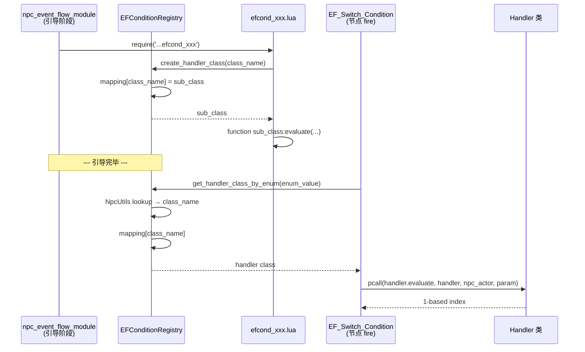
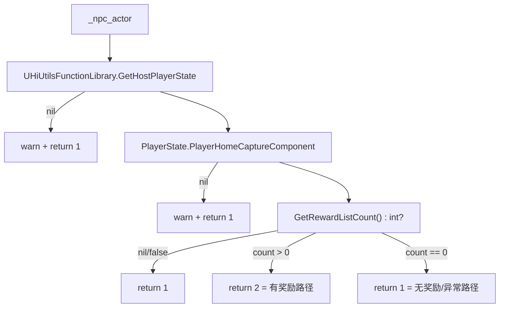
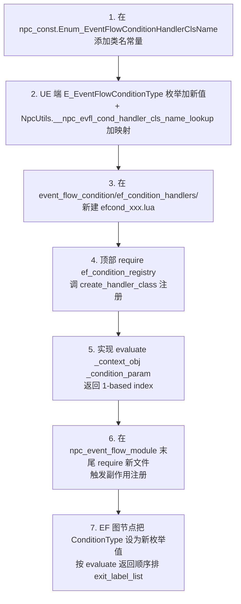

# 9. EventFlow Condition 与 Switch

> EventFlow 的分支选择有两条路径：`EF_Switch_Random` 在节点内部按数量做均匀随机；`EF_Switch_Condition` 把"该走哪条出边"委托给 Lua 端的 `EF_ConditionHandler` 子类。本页讲清楚 EFCond 的注册中心、基类约定，以及当前内置的 2 个 handler 实现[^npc-08]。

## 1. Condition 与 Switch 在 EventFlow 中的位置

`EF_Switch_Condition` 节点本身只是一个壳，运行时把 UE 端 `E_EventFlowConditionType` 枚举值翻译成 Lua class_name，再去 `EFConditionRegistry.handler_class_mapping` 取出 handler，最后调 `handler:evaluate(npc_actor, condition_param)` 拿 1-based 索引选出口[^npc-08]。

```mermaid
flowchart LR
    A[EF_Switch_Condition 节点 fire] --> B{ConditionType<br/>E_EventFlowConditionType}
    B -->|nil| Z[fallback: 走第一条 exit]
    B -->|enum value| C[NpcUtils.__npc_evfl_cond_handler_cls_name_lookup]
    C --> D[class_name string]
    D --> E[EFConditionRegistry.handler_class_mapping]
    E -->|miss| Z
    E -->|hit| F[handler class]
    F --> G["pcall handler:evaluate(npc_actor, condition_param)"]
    G --> H[1-based index]
    H --> I[exit_label_list&#91;index&#93; → 后继节点]
```



对照之下 `EF_Switch_Random` 不查注册表也不需要上下文，直接 `math.random(1, #exit_label_list)`[^npc-07]。两者共用 `EF_SwitchNode` 父类做 exit 收集，但选择逻辑各走各的。

## 2. EFConditionHandler 基类

文件 `Content/Script/npc/event_flow_condition/ef_condition_handler.lua`（24 行），verbatim 接口：

```lua
local EF_ConditionHandler = Kittens.class('EF_ConditionHandler', nil)

---@brief 条件判断方法,子类必须覆写此方法
---@param _context_obj any 上下文对象(由业务层决定具体类型,如 Actor 等)
---@param _condition_param string 额外参数
---@return number 分支索引(1-based),用于从 exit_label_list 中选择对应的分支
function EF_ConditionHandler:evaluate(_context_obj, _condition_param)
    Logger.error('event_flow_condition', 'EF_ConditionHandler.evaluate() must be overrided by child class')
    return 1
end
```

要点[^npc-08]：

- 基类无父（`Kittens.class('EF_ConditionHandler', nil)`），不与 mixin/ActiveObject 体系耦合
- 唯一必须覆写的方法：`evaluate`
- 基类实现是保底兜底：打 error 日志 + 返回 `1`，约等于"出错走第一条出边"
- `_context_obj` 类型由业务层决定，NPC 场景下传入的是 NPC actor
- `_condition_param` 是字符串，注释举例为"奖励 ID"——同一个 handler 可以靠 param 复用多种子情况

调用风格是 `:` 冒号方法调用，但**注册表只持有 class（元类表），不在 require 阶段实例化**——节点 fire 时 EF_Switch_Condition 直接以 class 自身作为 self 调用 evaluate（具体调用代码在 `ef_switch_condition` 节点内）[^npc-07] [^npc-08]。

## 3. EFConditionRegistry 注册中心

文件 `Content/Script/npc/event_flow_condition/ef_condition_registry.lua`（45 行）。它是一张 class_name → handler 类的全局表 + 几个工具函数：

| API | 作用 | 调用方 |
|---|---|---|
| `EFConditionRegistry.handler_class_mapping` | `class_name -> handler 类` 的 table，是真正的注册中心存储 | 内部状态 |
| `EFConditionRegistry.create_handler_class(_class_name)` | 创建子类（继承自 `EF_ConditionHandler`）并写入 mapping，返回类供调用方实现 `evaluate` | 各 `efcond_*.lua` 文件顶部 |
| `EFConditionRegistry.get_handler_class_by_enum(_enum_condition_type)` | 拿 UE 枚举 `E_EventFlowConditionType` 的某个值，先经 `NpcUtils.__npc_evfl_cond_handler_cls_name_lookup` 翻译为 class_name，再到 mapping 取 handler；找不到打 error 返回 nil | `EF_Switch_Condition` 节点 |

注册时机是 **`require` 副作用**[^npc-08]：每个 `efcond_*.lua` 文件最顶部都会

```lua
local EFConditionRegistry = require('npc.event_flow_condition.ef_condition_registry')
local EFCond_XXX = EFConditionRegistry.create_handler_class(
    NpcConst.Enum_EventFlowConditionHandlerClsName.EFCond_XXX
)
```

在 require 那一刻就完成 `create_handler_class → mapping[class_name] = sub_class`。所有 handler 文件的"被 require"由 `npc_event_flow_module` 在引导阶段统一拉起：模块末尾 require 了 `efcond_test_switch` 和 `efcond_home_capture_reward`，没有 require 的 handler 永远不会被注册到 mapping[^npc-07]。

整个注册→查询链路的时序：



lookup 失败的日志格式：`'EFConditionRegistry: no handler found for enum_condition_type: %s'`[^npc-08]。Logger 模块在 ef_condition_registry 顶部就 require 进来了，专为这条 error 路径服务。

## 4. EF_Switch_Condition vs EF_Switch_Random 对比表

| 维度 | EF_Switch_Condition | EF_Switch_Random |
|---|---|---|
| 注册名（Enum_NpcEventFlowNodeClsName） | `EF_Switch_Condition` | `EF_Switch_Random` |
| Mixin 依赖 | NpcEventFlowContextMixin (用 npc_actor 当 _context_obj) | 任意 mixin（不读上下文） |
| 关键输入字段 | `ConditionType` (E_EventFlowConditionType) + `ConditionParam` (string) | 无（仅依赖 exit_label_list 数量） |
| 选择来源 | Lua handler 的 `evaluate` 返回值（1-based） | 节点内部 `math.random(1, #exit_label_list)` |
| 注册中心 | `EFConditionRegistry.handler_class_mapping` | 不需要 handler，节点自决 |
| 容错 | pcall 包裹 evaluate；handler 缺失/ConditionType 为 nil → 走第一条出口 | 无出口则 `complete(nil)` |
| 可测试性 | handler 可单测（mock npc_actor） | 只能压统计跑分布 |
| 典型场景 | 业务条件分支（玩家状态、奖励、任务进度） | 随机表演分支（语音/动作随机选一） |

两者都按 1-based index 从 `exit_label_list` 取出后继节点，节点侧的图作者必须把 exit 的"含义顺序"和 handler 内部约定对齐[^npc-07] [^npc-08]。

## 5. 内置 EFCond 案例 1: EFCond_TestSwitch

文件 `event_flow_condition/ef_condition_handlers/efcond_test_switch.lua`（23 行）。当前实现是开发期占位：

```lua
local EFConditionRegistry = require('npc.event_flow_condition.ef_condition_registry')
local NpcConst             = require('npc.npc_const')

local EFCond_TestSwitch = EFConditionRegistry.create_handler_class(
    NpcConst.Enum_EventFlowConditionHandlerClsName.EFCond_TestSwitch
)

function EFCond_TestSwitch:evaluate(_context_obj, _condition_param)
    -- 占位,替换为实际逻辑
    local selected_index = 1
    return selected_index
end
```

要点[^npc-08]：

- 注册键 `NpcConst.Enum_EventFlowConditionHandlerClsName.EFCond_TestSwitch`
- 完全无视 `_context_obj` 和 `_condition_param`，固定返回 `1`
- 注释 `-- 占位,替换为实际逻辑` 明确写出意图：作为开发期的脚手架/最小可运行样例
- 任何 EF_Switch_Condition 接 EFCond_TestSwitch 类型的节点目前都恒定走分支 1

## 6. 内置 EFCond 案例 2: EFCond_HomeCaptureReward

文件 `event_flow_condition/ef_condition_handlers/efcond_home_capture_reward.lua`（40 行）。这是有实际业务语义的样例：检查"家园抓捕奖励"是否有可领取项[^npc-08]。

```lua
function EFCond_HomeCaptureReward:evaluate(_npc_actor, _condition_param)
    local player_state = UE.UHiUtilsFunctionLibrary.GetHostPlayerState(_npc_actor)
    if player_state == nil then
        Logger.warn(...)            -- "PlayerState is nil"
        return 1
    end

    local home_capture_comp = player_state.PlayerHomeCaptureComponent
    if home_capture_comp == nil then
        Logger.warn(...)            -- 注:这条日志正文写的是 FlyingCollectionNpc:init_listener,疑似复制粘贴遗留
        return 1
    end

    local reward_list_count = home_capture_comp:GetRewardListCount()
    if reward_list_count then
        return reward_list_count > 0 and 2 or 1
    end
    return 1
end
```

检查路径与分支约定：



implicit contract：**分支 1 = 无奖励/异常兜底，分支 2 = 有奖励**。EF 图作者必须按这个顺序排 `exit_label_list`，否则语义颠倒[^npc-08]。日志中 `FlyingCollectionNpc:init_listener` 的 tag 应是从其它 NPC 拷过来没改干净的字符串。

## 7. 添加新 EFCond 的步骤

按现有 2 个内置样例归纳出标准流程[^npc-08]：



实操核查清单：

- [ ] 新文件命名 `efcond_<语义>.lua`（小写 + 下划线）
- [ ] `EFConditionRegistry.create_handler_class` 的入参用 `NpcConst.Enum_EventFlowConditionHandlerClsName.EFCond_XXX`，不要用裸字符串
- [ ] `evaluate` 必须返回 number（1-based），出错路径返回 `1` 兜底
- [ ] `_context_obj` 在 NPC 场景下=npc_actor，handler 内务必判 nil（参考 EFCond_HomeCaptureReward 的两层 nil-check）
- [ ] 在 `npc_event_flow_module.lua` 末尾追加 `require('npc.event_flow_condition.ef_condition_handlers.efcond_xxx')`，否则 mapping 永远找不到该 handler，节点 fire 时走兜底分支 1[^npc-07]
- [ ] EF 图作者协作：在 DT 配 `ConditionType` + `ExitLabelList` 时，分支顺序与 handler `evaluate` 的返回值约定要文档化（建议在 handler 顶部注释里写明）

## 8. 跨页链接

- → [8. EventFlow — 28 个 Action 节点](8.%20EventFlow%20—%2028%20个%20Action%20节点.md)：EF_Switch_Condition 与 EF_Switch_Random 节点本身的实现，以及 `npc_event_flow_module` 在引导阶段如何 require 所有 efcond 文件触发自注册
- → [16. Cookbook + 陷阱 + 自检清单](16.%20Cookbook%20+%20陷阱%20+%20自检清单.md)：配置 EFCond 的实操与常见坑（忘记 require、exit_label 顺序错位、handler 抛异常）
- → [15. 枚举与常量反查表](15.%20枚举与常量反查表.md)：`Enum_EventFlowConditionHandlerClsName` 全部字符串常量 + UE 端 `E_EventFlowConditionType` 枚举映射函数 `NpcUtils.__npc_evfl_cond_handler_cls_name_lookup` 的位置

[^npc-07]: raw/npc-07-event-flow-actions.md
[^npc-08]: raw/npc-08-event-flow-conditions.md
