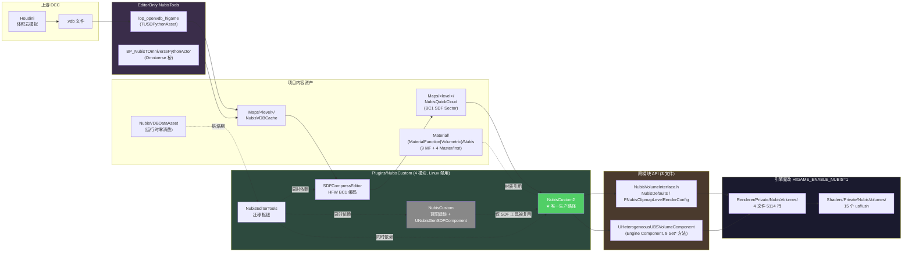
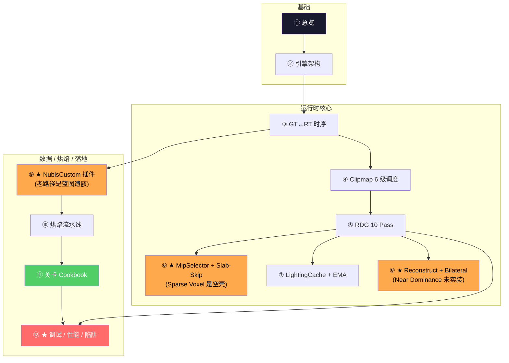

# HiGame NubisCloud — 知识库

> 本知识库目标:把 HiGame 项目里 NubisCloud 体积云体系(**引擎魔改 + NubisCustom 插件 + 材质函数库 + 烘焙工具与 VDB Cache**)压缩成 12 页源码级 wiki,让 AI 编程助手与渲染程序员能直接下手改 RDG Pass / 改 Shader / 改 Actor / 改烘焙链。
>
> **当前状态**:✅ Phase 0 (研究计划) → ✅ Phase 1 (9 篇 raw 笔记代码考古,3024 行) → ✅ Phase 2 (12 页 wiki 合成,5590 行)
>
> **研究方法**:本地代码考古(替代 km-websearch 的 web fetch)。所有事实来自 P4 工作区 `E:\HiProject\PerforceDev\UnrealEngine`,引用均带 `相对路径:行号` 锚点。

---

## 4 处合一全景

**4 处分散位置**:

| # | 位置 | 主要职责 | 数据 |
|---|------|---------|------|
| ① | `Engine/Source/Runtime/Renderer/Private/NubisVolumes/` + `Engine/Shaders/Private/NubisVolumes/` | CPU 调度 + RDG Pass + GPU Shader | 4 文件 5114 行 + 15 shader |
| ② | `Engine/Source/Runtime/Engine/Public/NubisVolumeInterface.h` + `NubisVolumeComponent.{h,cpp}` | 跨模块 API + ANubisVolume Actor + UHeterogeneousUBSVolumeComponent | ~600 行 |
| ③ | `Projects/HiGame/Plugins/NubisCustom/` (4 模块) | 数据端 Actor / Component / Subsystem / Editor 工具 | 多文件 |
| ④ | `Projects/HiGame/Content/Material/(MaterialFunction|Volumetric)/Nubis` + `EditorOnly/NubisTools` + `Maps/<level>/NubisVDBCache,NubisQuickCloud` | 材质函数库 + 烘焙工具 + 产物资产 | 9 MF + Sector 资产 |

---

## Phase 1 颠覆 Phase 0 的 8 项实证发现

| # | Phase 0 假设 | Phase 1 实证 | 影响页 |
|---|-------------|-------------|--------|
| 1 | HIGAME_ENABLE_NUBIS 由 .Build.cs 控制 | ❌ **硬编码=1 在 Build.h:1152** | 第 2, 12 页 |
| 2 | 14 个 Shader | ❌ **15 个**(8 usf + 7 ush) | 第 5 页 |
| 3 | "Sparse Voxel 两级 (Bottom + Indirection)"是核心 | ❌ **7 cvar 全是空壳,Pipeline.cpp + Shader 双端 0 处使用** → 实际走 6 档 SVT + MipSelector Atlas + Sector Slab-Skip | **第 6 页(整页推翻重写)** |
| 4 | Hardware Ray Tracing 是平台差异 | ❌ **完全未接通**,cvar 存在但 0 调用,`[CL611225 调试RT]` 注释暗示回滚 | 第 5, 12 页 |
| 5 | "Bilateral + Near Dominance Blend"是核心 | ❌ **Near Dominance 是预留 cbuffer,未实装** → 实际是 **Reconstruct 5 路 + Bilateral 4 mode + Far under Near** | **第 8 页(主题修正)** |
| 6 | NubisCustom 老/新路径并存 | ❌ **NubisCustom2 是唯一生产路径**;老 NubisCustom 是蓝图实验遗骸,只剩 UNubisGenSDFComponent (1738 行 SDF 烘焙工具) 真活着 | **第 9 页(主题修正)** |
| 7 | Plugin 通过 RDG 推数据 | ❌ **Plugin 直接 ENQUEUE_RENDER_COMMAND + RHIUpdateTexture3D,4 处,不触 RDG** | 第 3, 12 页 |
| 8 | NubisVDBDataAsset 是运行时容器 | ❌ **运行时零消费,只烘焙期 EditorTools 用** | 第 9, 10 页 |

**记一笔: CL611225 是历史上的回滚 commit**,移除了 (a) 调试 RT 模式 (b) Hardware Ray Tracing 路径 (c) 部分 Visualize 模式。看到 `[CL611225 ...]` 注释或孤立 cvar/getter 时,假定该功能已死。详见 [第 12 页](wiki/12.%20调试%20性能%20平台%20陷阱.md)。

---

## 12 页知识地图

★ = 基于 Phase 1 真实发现修正过 Phase 0 假设的 4 页

**推荐阅读路线**:
- 想"用 Nubis 给新地图加云" → 第 1 → 9 → 10 → 11 页
- 想"改 RDG Pass / Shader" → 第 2 → 3 → 4 → 5 → 6 → 7 → 8 页
- 排错 / 性能 → 第 12 → 5 → 4 页
- 第一次接触体系 → 按编号 1 → 12 顺读

---

## 12 页目录

### 基础
- [1. 总览 — 4 处分散位置与跨模块 API](wiki/1.%20总览%20—%204%20处分散位置与跨模块%20API.md) — 全景图、4 处合一、跨模块 API 速查、阅读路线
- [2. 引擎端架构 — HIGAME_ENABLE_NUBIS 与 INubisVolumeInterface](wiki/2.%20引擎端架构%20—%20HIGAME_ENABLE_NUBIS%20与%20INubisVolumeInterface.md) — 引擎魔改文件清单、宏开关、跨模块 API、渲染管线插入位置

### 运行时核心
- [3. GT ↔ RT 时序 — Plugin 自管 GPU 资源](wiki/3.%20GT%20↔%20RT%20时序%20—%20Plugin%20自管%20GPU%20资源.md) — 三通道(慢/快/Plugin 直推)、INubisVolumeInterface 4 方法、Component 8 Set*、Plugin 4 处 ENQUEUE
- [4. Clipmap 6 级调度 — Mip Ring 与 Two-Pass](wiki/4.%20Clipmap%206%20级调度%20—%20Mip%20Ring%20与%20Two-Pass.md) — Two-Pass(LCache 4→0 跳 Mip5,Scattering 0→5)、MipRingCrossoverCm=500cm、Sector 滚动双策略
- [5. RDG Pass 全图 — Live Shading 10 Pass DAG](wiki/5.%20RDG%20Pass%20全图%20—%20Live%20Shading%2010%20Pass%20DAG.md) — 10 Pass 大表 + Mermaid DAG + .ush 依赖图 + 关键 .usf 摘录
- ★ [6. MipSelector 与 Sector Slab-Skip 等价方案](wiki/6.%20MipSelector%20与%20Sector%20Slab-Skip%20等价方案.md) — Sparse Voxel 7 cvar 全空壳的双端证据 + 实际等价方案三件套
- [7. LightingCache 与 Transmittance Volume](wiki/7.%20LightingCache%20与%20Transmittance%20Volume.md) — EMA β=0.97 + ScrollUVOffset 三端镜像 + DirtyRegions 父级回填
- ★ [8. Reconstruct 与 Bilateral Upscale](wiki/8.%20Reconstruct%20与%20Bilateral%20Upscale.md) — 5 路 Path / 4 UPSCALE_MODE / Far under Near / Near Dominance 是预留未实装

### 数据 / 烘焙 / 落地
- ★ [9. NubisCustom 插件 — 新路径唯一; 老路径是蓝图遗骸](wiki/9.%20NubisCustom%20插件%20—%20新路径唯一;%20老路径是蓝图遗骸.md) — 4 模块结构 + 老路径警告 + 新路径类层次 + 迁移枢纽
- [10. 烘焙流水线 — Houdini → VDB → BC1 → Sector → Cook](wiki/10.%20烘焙流水线%20—%20Houdini%20→%20VDB%20→%20BC1%20→%20Sector%20→%20Cook.md) — Omniverse 桥 + 8 阶段状态机 + Horizon Forbidden West BC1 编码
- [11. 关卡放置 Cookbook — 给新地图加云的 8 步流程](wiki/11.%20关卡放置%20Cookbook%20—%20给新地图加云的%208%20步流程.md) — 端到端 8 步,每步含操作/产物/验证/常见报错
- ★ [12. 调试 / 性能 / 平台 / 陷阱](wiki/12.%20调试%20性能%20平台%20陷阱.md) — 42 cvar 速查表 + 平台矩阵 + 降级决策树 + 12 项陷阱

---

## key_questions 覆盖矩阵

| 组 | ID | 题目 | 主要由哪页解答 |
|----|----|------|----------------|
| 引擎 | A1 | NubisVolumes 引擎魔改全清单 | [第 2 页](wiki/2.%20引擎端架构%20—%20HIGAME_ENABLE_NUBIS%20与%20INubisVolumeInterface.md) |
| 引擎 | A2 | GT↔RT 时序 | [第 3 页](wiki/3.%20GT%20↔%20RT%20时序%20—%20Plugin%20自管%20GPU%20资源.md) |
| 引擎 | A3 | Clipmap 调度 / Mip Ring / Sector 滚动 | [第 4 页](wiki/4.%20Clipmap%206%20级调度%20—%20Mip%20Ring%20与%20Two-Pass.md) |
| 引擎 RDG | A4 | Live Shading Pipeline 全 Pass | [第 5 页](wiki/5.%20RDG%20Pass%20全图%20—%20Live%20Shading%2010%20Pass%20DAG.md) |
| 引擎 RDG | A5 | Sparse Voxel 两级 | [第 6 页](wiki/6.%20MipSelector%20与%20Sector%20Slab-Skip%20等价方案.md) (实证空壳 + 等价方案) |
| 引擎 RDG | A6 | LightingCache + Transmittance | [第 7 页](wiki/7.%20LightingCache%20与%20Transmittance%20Volume.md) |
| 引擎 RDG | A7 | Hardware Ray Tracing | [第 5 页](wiki/5.%20RDG%20Pass%20全图%20—%20Live%20Shading%2010%20Pass%20DAG.md) + [第 12 页](wiki/12.%20调试%20性能%20平台%20陷阱.md) (实证未接通) |
| 引擎 RDG | A8 | Temporal + Bilateral | [第 8 页](wiki/8.%20Reconstruct%20与%20Bilateral%20Upscale.md) |
| 插件 | B1 | 4 模块结构 | [第 9 页](wiki/9.%20NubisCustom%20插件%20—%20新路径唯一;%20老路径是蓝图遗骸.md) |
| 插件 | B2 | 老路径类层次 | [第 9 页](wiki/9.%20NubisCustom%20插件%20—%20新路径唯一;%20老路径是蓝图遗骸.md) |
| 插件 | B3 | 新路径 NubisCustom2 类层次 | [第 9 页](wiki/9.%20NubisCustom%20插件%20—%20新路径唯一;%20老路径是蓝图遗骸.md) + [第 3 页](wiki/3.%20GT%20↔%20RT%20时序%20—%20Plugin%20自管%20GPU%20资源.md) |
| 插件 | B4 | NubisVDBDataAsset GPU 生命周期 | [第 9 页](wiki/9.%20NubisCustom%20插件%20—%20新路径唯一;%20老路径是蓝图遗骸.md) + [第 10 页](wiki/10.%20烘焙流水线%20—%20Houdini%20→%20VDB%20→%20BC1%20→%20Sector%20→%20Cook.md) |
| 插件 | B5 | NubisEditorTools | [第 9 页](wiki/9.%20NubisCustom%20插件%20—%20新路径唯一;%20老路径是蓝图遗骸.md) |
| 烘焙 | C1 | Houdini → VDB | [第 10 页](wiki/10.%20烘焙流水线%20—%20Houdini%20→%20VDB%20→%20BC1%20→%20Sector%20→%20Cook.md) |
| 烘焙 | C2 | VDB → NubisVDBCache + SDFCompress | [第 10 页](wiki/10.%20烘焙流水线%20—%20Houdini%20→%20VDB%20→%20BC1%20→%20Sector%20→%20Cook.md) |
| 烘焙 | C3 | QuickCloud / 关卡放置 | [第 10 页](wiki/10.%20烘焙流水线%20—%20Houdini%20→%20VDB%20→%20BC1%20→%20Sector%20→%20Cook.md) + [第 11 页](wiki/11.%20关卡放置%20Cookbook%20—%20给新地图加云的%208%20步流程.md) |
| 烘焙 | C4 | NubisGenSDFComponent SDF | [第 9 页](wiki/9.%20NubisCustom%20插件%20—%20新路径唯一;%20老路径是蓝图遗骸.md) + [第 10 页](wiki/10.%20烘焙流水线%20—%20Houdini%20→%20VDB%20→%20BC1%20→%20Sector%20→%20Cook.md) |
| 烘焙 | C5 | 8 步 Cookbook | [第 11 页](wiki/11.%20关卡放置%20Cookbook%20—%20给新地图加云的%208%20步流程.md) |
| 材质 | D1 | MF 资产清单 | [第 12 页](wiki/12.%20调试%20性能%20平台%20陷阱.md) |
| 材质 | D2 | 测试样例 | [第 11 页](wiki/11.%20关卡放置%20Cookbook%20—%20给新地图加云的%208%20步流程.md) + [第 12 页](wiki/12.%20调试%20性能%20平台%20陷阱.md) |
| 调试 | E1 | cvar / Visualize | [第 12 页](wiki/12.%20调试%20性能%20平台%20陷阱.md) |
| 调试 | E2 | 平台 / 降级 | [第 12 页](wiki/12.%20调试%20性能%20平台%20陷阱.md) |
| 调试 | E3 | 与 UE VolumetricCloud 对比 | [第 12 页](wiki/12.%20调试%20性能%20平台%20陷阱.md) |

22 / 22 全覆盖。

---

## 数据来源(9 篇 raw 笔记)

落在共享池 `D:\BranKM\BranKM\raw\`,2806 行:

| slug | 行数 | 覆盖 questions |
|------|------|----------------|
| `higame-nubis-engine-arch.md` | 255 | A1, A2 |
| `higame-nubis-clipmap-scheduling.md` | 282 | A3, B3 |
| `higame-nubis-rdg-passes.md` | 386 | A4, A5, A6, A7 |
| `higame-nubis-shader-permutations.md` | 341 | A4, A7, A8 |
| `higame-nubis-temporal-and-upscale.md` | 418 | A8, E1 |
| `higame-nubis-plugin-nubiscustom.md` | 241 | B1, B2, B5 |
| `higame-nubis-plugin-nubiscustom2.md` | 315 | B3, B4 |
| `higame-nubis-bake-pipeline.md` | 317 | C1-C5 |
| `higame-nubis-debug-and-platforms.md` | 251 | D1, D2, E1-E3 |

---

## 质量说明

- **总页面数**: 12
- **总 raw 笔记**: 9 (代码考古, 0 篇 web 来源)
- **wiki 总行数**: 5590
- **raw 总行数**: 2806
- **覆盖率**: 22 / 22 key_questions 全覆盖
- **空白领域**: Houdini 内部 LOP 节点 / Omniverse 通信协议(均已 [推测] 标注)
- **最后更新**: 2026-05-11
- **后续**: 准备发布到 iWiki/km(见 `publish-plan.md` — 待生成)
