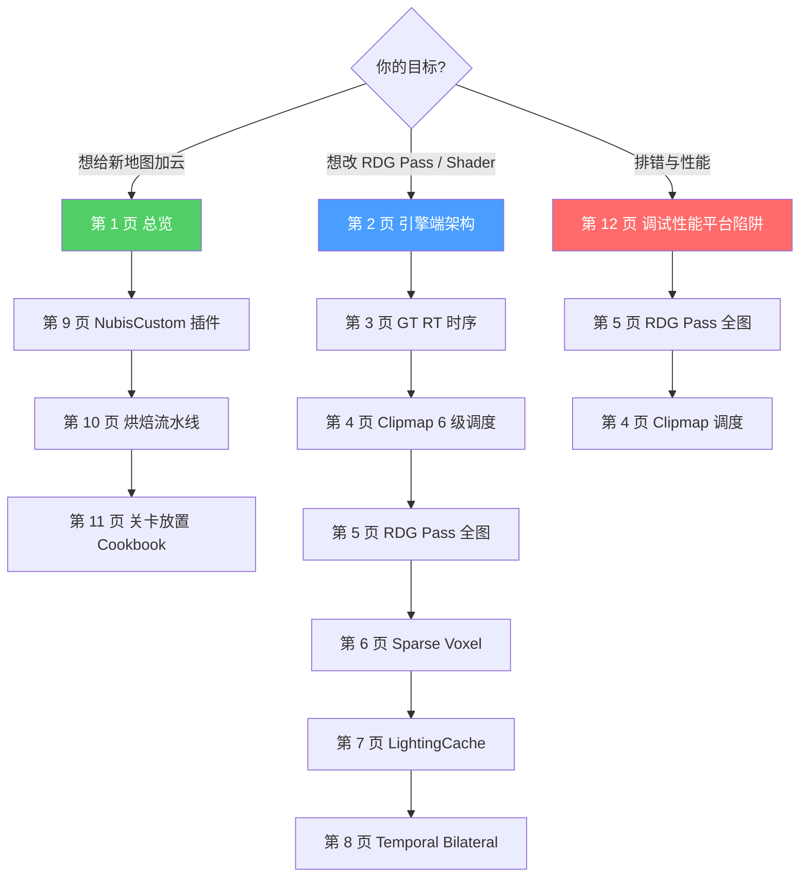

# 总览 — 4 处分散位置与跨模块 API

NubisCloud 是 HiGame 项目的体积云体系,引擎 fork 改造 + 自研 NubisCustom 插件 + Houdini 烘焙链 + 材质函数库,**4 处合一**。本页画出整套体系的全景图、4 处分散位置的边界、跨模块的核心 API,以及读完本 wiki 12 页后能拿到的能力地图——目标是让 AI 编程助手 (Claude / CodeBuddy / Cursor) 与 HiGame 渲染程序员一次性建立 Nubis 心智模型,知道往哪里看、不看哪里。

> 后续任何"改 RDG Pass / 改 Shader / 改 Actor / 加新地图云 / 排错"的工作,都从本页找入口,然后跳到对应的子页深挖。

---

## 一图看完 NubisCloud 全景

```mermaid
flowchart LR
    subgraph DCC[上游 DCC]
        H[Houdini<br/>体积云 LOP]
        SVT[UStaticSparseVolumeTexture<br/>VDB 资产]
    end

    subgraph BAKE[④ EditorOnly 烘焙工具与产物]
        LOP[lop_openvdb_higame<br/>TUSDPythonAsset]
        OMNI[BP_NubisTOmniversePythonActor<br/>Omniverse Python 桥]
        WBP[WBP_NubisEditorUtility<br/>+ SNubisToolsPanel]
        VDBCache[Maps Level NubisVDBCache<br/>SVT 中间产物 + Snapshot Config]
        QC[Maps Level NubisQuickCloud<br/>Sectors Mip Sector XYZ Modeling SDF<br/>+ NubisClipmapData]
    end

    subgraph PLUGIN[② Plugins NubisCustom 4 模块 Linux Deny]
        NC[NubisCustom 老路径<br/>Actor 蓝图壳 + GenSDF 工具]
        NC2[NubisCustom2 新路径<br/>Clipmap Subsystem + Zone2 + HiCloud2]
        NET[NubisEditorTools<br/>Slate 面板 + BP Library + Outliner Filter]
        SDF[SDFCompressEditor<br/>BC1 标量 4bpp 编码器]
    end

    subgraph IFACE[跨模块 API 边界]
        IF1[Engine Public NubisVolumeInterface.h<br/>INubisVolumeInterface 纯虚<br/>+ FNubisClipmapLevelRenderConfig<br/>+ NubisDefaults 常量]
        IF2[UHeterogeneousUBSVolumeComponent<br/>Set Clipmap Mip Selector LightingCache RT]
    end

    subgraph ENGINE[① 引擎魔改 HIGAME_ENABLE_NUBIS=1]
        REN[Renderer Private NubisVolumes<br/>4 cpp/h 5114 行<br/>RenderNubisVolumes / Composite]
        SHA[Shaders Private NubisVolumes<br/>15 文件 8 usf + 7 ush]
        VS[FViewInfo<br/>NubisVolumeRadiance / Depth<br/>+ NubisVolumesMeshBatches]
    end

    subgraph MAT[③ Content Material Nubis]
        MF[MaterialFunction Nubis<br/>9 个 MF GetVoxelCloud Density / MipLevel / Erosion]
        MM[Volumetric Nubis<br/>M_NubisCloud Master + Inst<br/>+ M_NubisCloud_Interactive]
    end

    H --> SVT
    SVT --> LOP
    LOP --> OMNI
    OMNI --> WBP
    WBP --> VDBCache
    VDBCache --> SDF
    SDF --> QC
    QC -->|TSoftObjectPtr| NC2
    NET --> NC2
    NET --> NC
    NET --> SDF
    NC2 -->|实现接口| IF1
    NC2 -->|GT 推送资源| IF2
    IF1 --> REN
    IF2 --> VS
    REN --> SHA
    REN --> VS
    MM -.材质域 MD_Volume<br/>bIsUsedWithNubisVolumes.- REN
    MF --> MM

    classDef engine fill:#1a1a2e,color:#fff,stroke:#3a3a6e
    classDef plugin fill:#2d4a3e,color:#fff,stroke:#5d8a7e
    classDef bake fill:#3a2d4a,color:#fff,stroke:#7a5d8a
    classDef mat fill:#4a3a2d,color:#fff,stroke:#8a7a5d
    classDef iface fill:#2a3a4a,color:#fff,stroke:#5a7a9a

    class REN,SHA,VS engine
    class NC,NC2,NET,SDF plugin
    class LOP,OMNI,WBP,VDBCache,QC bake
    class MF,MM mat
    class IF1,IF2 iface
```

读图三步走:

1. **左下烘焙链** (④):Houdini 通过 Omniverse Python Bridge 把 OpenVDB 数据回流到 UE Editor,经 SDFCompress 编码为 BC1 体素,**最终产物是 Sector 切片**。
2. **中间插件层** (②):NubisCustom2 的 `UNubisClipmapSubsystem` 在 Tick 里按相机驱动 Sector 异步流式,`ANubisZone2Actor` 通过 `UHeterogeneousUBSVolumeComponent` 把 Clipmap 配置转成引擎可读结构。
3. **右侧引擎层** (①):`RenderNubisVolumes` 在 Deferred 渲染管线 `VolumetricFog` 之后、`VolumetricCloud` 之前插入,**Two-Pass** 调度 LightingCache + Scattering。材质层 (③) 提供 9 个 `MF_Nubis*` 与 2 套 Master Material。

---

## 4 处分散位置 — 边界与体量

| # | 位置 | 主要职责 | 文件数 / 行数[^arch] |
|---|------|---------|---------------------|
| ① | `Engine/Source/Runtime/Renderer/Private/NubisVolumes/` + `Engine/Shaders/Private/NubisVolumes/` | 引擎 fork 魔改:`RenderNubisVolumes` 调度循环、RDG Pass 构图、6 级 Clipmap 串行、Two-Pass 编排;Shader 实现 LightingCache CS / Near / Far Dither / Reconstruct / Bilateral / Composite / Visualize 全部 GPU 工作 | 4 cpp/h (~5,114 行) + 15 shader (8 usf + 7 ush, ~6,500 行) + ~6 处 `#if HIGAME_ENABLE_NUBIS` 散布到 `DeferredShadingRenderer` / `SceneRendering` / `SceneVisibility` / `MaterialShared` |
| ② | `Projects/HiGame/Plugins/NubisCustom/Source/` | 4 模块共存:**`NubisCustom`** (老路径蓝图壳 + `UNubisGenSDFComponent` 1738 行 SDF 工具)、**`NubisCustom2`** (新路径生产链 `NubisClipmap.cpp` 3122 行 + `Subsystem.cpp` 358 行 + Zone2/HiCloud2 Actor)、**`NubisEditorTools`** (5254 行 `SNubisToolsPanel` + 25+ 个 `UBP_NubisToolLibrary` BP 函数)、**`SDFCompressEditor`** (BC1 标量编码器,纯 namespace 无 UI) | 4 模块,全部 `LoadingPhase=PostConfigInit` + `PlatformDenyList=[Linux]`[^plugin] |
| ③ | `Projects/HiGame/Content/Material/MaterialFunction/Nubis/` + `Content/Material/Volumetric/Nubis/` | 9 个 `MF_Nubis*` 通用材质函数 (Density 上采样、MipLevel 选档、Value Erosion、Float2/3/4/Scalar Remap) + 2 套 Master Material (`M_NubisCloud` + `M_NubisCloud_Interactive`) 各带 Inst | 9 + 4 = 13 个资产,材质域 `MD_Volume` + `bIsUsedWithNubisVolumes`[^debug] |
| ④ | `Projects/HiGame/Content/EditorOnly/NubisTools/` + `Content/Maps/<Level>/NubisVDBCache/` + `Content/Maps/<Level>/NubisQuickCloud/` | 工具资产 (`lop_openvdb_higame.uasset` 16 KB + `BP_NubisTOmniversePythonActor.uasset` 402 KB + `WBP_NubisEditorUtility.uasset` 1.3 MB);烘焙中间产物 (`Voxel{N}/{ActorLabel}_{GUID}.uasset` SVT 软引用);烘焙最终产物 (`Sectors/Mip{N}_Sector_{X}_{Y}_{Z}_{Modeling/SDF}.uasset` + `NubisClipmapData_{Zone}.uasset`) | LV_KTD 关卡:VDBCache 1.2 GB / QuickCloud 148 MB / 88 个 Sector;LV_ZC_YLD:4.7 GB / 383 MB / 402 Sector[^bake] |

> **总体量参考**:引擎魔改约 11,600 行代码 + Plugin 约 12,000 行 C++ = **24k 行专属代码**,加上单关卡 GB 级烘焙资产 + ~13 个材质资产。每一块都需要一页专门展开。

### 4 处之间的依赖方向

**唯一的运行时数据流方向是 ④ → ② → ①**,而 ③ (材质) 是 ② 的 MID 母材质,被 ① 通过 `bIsUsedWithNubisVolumes` flag 在编译期识别。**烘焙阶段** 多了一条 ④ ↔ ② 的双向交互(`SNubisToolsPanel` 反过来 spawn 烘焙 Actor、读 `UNubisVDBDataAsset` 状态机驱动 GPU Compute 合成 Sector)。

---

## 跨模块 API 的"窄腰" — 只看这 3 个文件

NubisCloud 的引擎 fork 故意把 Plugin↔Engine 的耦合压到一个最小接口表面。**记住这 3 个文件就能在 4 处之间穿梭**:

| 文件 | 角色 | 关键导出 |
|------|------|---------|
| `Engine/Source/Runtime/Engine/Public/NubisVolumeInterface.h` (438 行) | 跨模块 API 主声明 | `NubisDefaults` 常量、`FNubisClipmapLevelRenderConfig`、`INubisVolumeInterface` 纯虚接口、`FNubisVolumeData` 默认实现 (继承 `FOneFrameResource`) |
| `Engine/Source/Runtime/Engine/Classes/Components/NubisVolumeComponent.h` (172 行) | Plugin → Engine 的 GT 入口 Component | `UHeterogeneousUBSVolumeComponent::SetClipmapData / SetMipSelectorVolume / SetPerLevelLightingCacheRTs / SyncClipmapScrollToProxy_RenderThread` |
| `Engine/Source/Runtime/Renderer/Private/NubisVolumes/NubisVolumes.h` (159 行) | Engine 内部 API + cvar getter namespace | `RenderNubisVolumes` / `CompositeNubisVolumes` 函数签名;`NubisVolumes::Get*()` getter 暴露给 LiveShadingPipeline |

**接口流向 (1 句话)**:Plugin 端 `ANubisZone2Actor` 在 BeginPlay 把 `UNubisClipmapDataAsset` 注册到 `UNubisClipmapSubsystem`,Subsystem 创建 `NubisClipmapManager` 持有 6 级 VolumeTexture / MipSelector Atlas / LightingCache RT,通过 `UHeterogeneousUBSVolumeComponent::Set*` 把 RHI 句柄推送到 `FHeterogeneousUBSVolumeSceneProxy`;SceneProxy 在 `GetDynamicMeshElements` 把 `BatchElement.UserData = &FNubisVolumeData` 传到 RT;RT 端 `RenderNubisVolumes` 通过 `INubisVolumeInterface*` 反查所有 Clipmap 配置,展开成 RDG Pass。

> 详细的 GT↔RT 时序图、ASCII 双线图、ENQUEUE_RENDER_COMMAND 时机表 → 见 [3. GT ↔ RT 时序 — 从 ANubisHiCloud2Actor 到 RDG](3.%20GT%20↔%20RT%20时序%20—%20Plugin%20自管%20GPU%20资源.md) (如已落地)。

---

## 关键事实速览 (12 条)

每条都是独立可验证的硬事实,**违反任一条 = 你的 Nubis 心智模型有 bug**。后挂目标页便于跳转。

1. **`HIGAME_ENABLE_NUBIS` 在 `Build.h:1152` 硬编码 = 1**[^arch],无任何 `.Build.cs` / `.Target.cs` 控制;NubisVolumes 整个 body 包在 `#if HIGAME_ENABLE_NUBIS` 内,要彻底关只能改 Build.h 或 `-D` 覆盖。→ 第 [2 页](2.%20引擎端架构%20—%20HIGAME_ENABLE_NUBIS%20与%20INubisVolumeInterface.md)
2. **Shader 共 15 个文件 = 8 usf + 7 ush**[^shader],总行数约 6.5k;9 个 Shader 类用 `IMPLEMENT_GLOBAL_SHADER × 3` + `IMPLEMENT_MATERIAL_SHADER_TYPE × 6` 注册。→ 第 [5 页](5.%20RDG%20Pass%20全图%20—%20Live%20Shading%2010%20Pass%20DAG.md)
3. **NubisDefaults 常量**:`MipCount=6` / `BaseVoxelSize=1m` / `TextureSize=512×512×128` / `SectorSize=256×256×64`[^arch];Mip0 体素 1m,Mip5 体素 32m,**烘焙仅产 Mip 3+** 的 Sector。→ 第 [4 页](4.%20Clipmap%206%20级调度%20—%20Mip%20Ring%20与%20Two-Pass.md)
4. **Two-Pass 调度**:LightingCache 远→近 (Level 4→0,跳 Mip5) → Scattering 近→远 (Level 0→5)[^arch];Pass 1 不受 `r.NubisVolumes.DebugMipMask` 影响,Pass 2 才受。→ 第 [4 页](4.%20Clipmap%206%20级调度%20—%20Mip%20Ring%20与%20Two-Pass.md) + 第 [5 页](5.%20RDG%20Pass%20全图%20—%20Live%20Shading%2010%20Pass%20DAG.md)
5. **NubisCustom2 是唯一生产路径**[^plugin],老 `NubisCustom` 是蓝图遗骸 (Actor 壳无 SceneProxy 实现) + `UNubisGenSDFComponent` 1738 行 SDF 工具组件;新路径完全不依赖老路径 (Build.cs 0 命中)。→ 第 [9 页](9.%20NubisCustom%20插件%20—%20新路径唯一;%20老路径是蓝图遗骸.md)
6. **4 模块全 `PlatformDenyList=[Linux]` + `LoadingPhase=PostConfigInit`**[^plugin];HiGameServer (Linux DS) 完全不参与体积云,但宏 `HIGAME_ENABLE_NUBIS=1` 在服务端目标也被定义 (无害,Renderer 模块在 server 不链接)。→ 第 [9 页](9.%20NubisCustom%20插件%20—%20新路径唯一;%20老路径是蓝图遗骸.md)
7. **Sector 完全按需流式**[^plugin]:`StreamableManager.RequestAsyncLoad`,无 `LoadSynchronous`,无 BeginPlay 全加载;`MaxLoadsPerFrame=8`,首帧 ×4 budget=32,并发上限 16;**运行时 `UNubisVDBDataAsset` 零消费**,只烘焙期用。→ 第 [4 页](4.%20Clipmap%206%20级调度%20—%20Mip%20Ring%20与%20Two-Pass.md)
8. **Plugin 零 RDG**[^plugin]:Plugin 内只 4 处 `ENQUEUE_RENDER_COMMAND` (Debug Name / Init Atlas / 单字节更新 / Sector Copy),**不直接构造 RDG Builder 或 SHADER_PARAMETER**;所有 RDG Pass 在 Engine 端 `NubisVolumesLiveShadingPipeline.cpp`。→ 第 [3 页](3.%20GT%20↔%20RT%20时序%20—%20Plugin%20自管%20GPU%20资源.md)
9. **多 Zone 不合并 Atlas**[^plugin]:`TMap<ANubisZone2Actor*, TUniquePtr<NubisClipmapManager>>`,每个 Zone 独立持有 6 级 VolumeTexture + MipSelector Atlas + 6 张 LightingCache RT;两 Zone 物理重叠会出现 12 级独立 Clipmap 各自 raymarch。→ 第 [9 页](9.%20NubisCustom%20插件%20—%20新路径唯一;%20老路径是蓝图遗骸.md)
10. **平台支持**:`SM5 + Deferred only`[^debug];`DoesPlatformSupportNubisVolumes` 返回 `IsFeatureLevelSupported(SM5) && !IsForwardShadingEnabled(Platform)`,Forward / ES3.1 / Linux DS 不支持;`FDataDrivenShaderPlatformInfo::GetSupportsNubisVolumes` 留有 TODO 未接入白名单。→ 第 [12 页](12.%20调试%20性能%20平台%20陷阱.md)
11. **渲染插入点**[^arch]:`VolumetricFog → RenderNubisVolumes (DeferredShadingRenderer.cpp:3160) → VolumetricCloud`,Composite 在半透明之后 (`:3648`);**与 UE 原生 VolumetricCloud 共存,不互斥**,`LiveShadingPipeline.cpp` 大量 `// From VolumetricCloud` 注释复用其 RT 视图参数。→ 第 [2 页](2.%20引擎端架构%20—%20HIGAME_ENABLE_NUBIS%20与%20INubisVolumeInterface.md) + 第 [12 页](12.%20调试%20性能%20平台%20陷阱.md)
12. **Visualize 5 模式**[^debug]:`RADIANCE / DEPTH / LIGHTING_CACHE / FAR_TRACING / RECONSTRUCT`;`r.NubisVolumes.Debug` cvar 整块被 `[CL611225 调试 RT]` 注释回滚;`Sparse Voxel` / `HardwareRayTracing` / `IndirectLighting` / `Preshading` 系列 cvar 全是空壳 (Pipeline 0 处消费)。→ 第 [12 页](12.%20调试%20性能%20平台%20陷阱.md)

---

## 阅读顺序建议

读者带着不同目标进入本 wiki,推荐路径不同:

| 场景 | 路线 |
|------|------|
| 想"用 Nubis 做新地图" | **1 → 9 → 10 → 11** |
| 想"改 RDG Pass / Shader" | **2 → 3 → 4 → 5 → 6 → 7 → 8** |
| 排错与性能 | **12 → 5 → 4** |

---

## 12 页目录表

| # | 页名 | 一句话简介 | 关联 raw |
|---|------|-----------|----------|
| 1 | 总览 — 4 处分散位置与跨模块 API | 本页:全景图 / 4 处边界 / 跨模块 3 个核心文件 / 12 条关键事实 / 阅读顺序 | engine-arch |
| 2 | 引擎端架构 — `HIGAME_ENABLE_NUBIS` 与 `INubisVolumeInterface` | `Build.h` 宏入口、引擎魔改文件清单、`#if HIGAME_ENABLE_NUBIS` 散布点、`INubisVolumeInterface` 接口契约、`FViewInfo` 字段、Deferred 插入位 | engine-arch |
| 3 | GT ↔ RT 时序 — 从 `ANubisHiCloud2Actor` 到 RDG | ASCII 双线图 + Mermaid sequenceDiagram、`SyncClipmapScrollToProxy_RenderThread` 时机、`MarkRenderStateDirty` 触发的 SceneProxy 重建、`FNubisVolumeData` 通过 `BatchElement.UserData` 跨线程传递 | engine-arch + plugin-nubiscustom2 |
| 4 | Clipmap 6 级调度 — Mip Ring / Sector 滚动 / Two-Pass | 远→近 / 近→远 串行循环、Z 各向异性死区、Sector 异步加载、MipRingCrossover 与 EarlyExit、`r.NubisVolumes.DebugMipMask` 位掩码、`ClipmapScrollUVOffset` 三端镜像 | clipmap-scheduling |
| 5 | RDG Pass 全图 — Live Shading Pipeline 11 个 Pass | RDG DAG、Pass 按 Volume × Level × Type 展开、Reseed / LCacheCS / Near / Far Dither / Reconstruct / Bilateral / Composite / Visualize 全部 Pass 的输入 SRV / 输出 UAV / Permutation Domain | rdg-passes + shader-permutations |
| 6 | Sparse Voxel 管线 — Bottom + Indirection 两级 (空壳现状) | `r.NubisVolumes.SparseVoxel` 系列 cvar 全空壳的事实考古、Pipeline 0 处使用、实际使用的是 6 档 SVT + MipSelector Atlas (BC1 的 8-bit uint 元数据) | rdg-passes |
| 7 | LightingCache 与 Transmittance Volume — EMA / Scroll UV | EMA β=0.97 (~33 帧衰半)、`ScrollUVOffset` 三端镜像 (Reseed / Write / Sample)、`ReseedFromParent` Sector roll-in、Mip 5 不烘 LCache 的原因 | rdg-passes + temporal-and-upscale |
| 8 | Temporal + Bilateral Upscale — Near Dominance Blend | `FNubisRenderTargetViewStateData` ping-pong、`FNubisPerLevelDitherState`、Bayer DitherFrameCount = N²、4 种 Bilateral kernel、`Far under Near` Blend、Near Dominance Blend 是预留 cbuffer 未实装 | temporal-and-upscale |
| 9 | NubisCustom 插件 — 老/新路径并存与 4 模块边界 | 4 模块依赖关系、新老 Actor 区别、`NubisClipmapManager` 非 UCLASS / `FGCObject` + AddToRoot 防 GC、Multi-Zone 各自独立、`SNubisToolsPanel` 14 个按钮、`UBP_NubisToolLibrary` 25+ BP 函数 | plugin-nubiscustom + plugin-nubiscustom2 |
| 10 | 烘焙流水线 — Houdini → VDB → SDFCompress → DataAsset → Cook | Omniverse Python 桥、`lop_openvdb_higame` TUSDPythonAsset、VDB Merge 状态机 (RouteSectorMip / InitMip / SaveSector...)、BC1 标量编码 (Horizon Forbidden West 算法)、SectorMipLevel 路由 | bake-pipeline |
| 11 | 关卡放置 Cookbook — 给新地图加云的 8 步标准流程 | 放 Zone2 / 放 HiCloud2 / 启 Omniverse / 烘 / 合并 / 生成 ClipmapDataAsset / 刷 Clipmap / Cook;Master Material 选型 + `MF_Nubis*` 调参指引 | bake-pipeline + plugin-nubiscustom2 |
| 12 | 调试 / 性能 / 平台 / 陷阱 | 42 条 cvar 全表 (~29 实装 + 12 空壳)、Visualize 5 模式、平台支持矩阵、降级决策树、与 UE 原生 VolumetricCloud 对比、wenxiangzuo Test* 调试样例 | debug-and-platforms |

---

## 跨模块定位备忘 (一张速查表)

下面这张表是给 AI 助手在不知道某个符号属于哪一处时的"快速定位"备忘录。看到 NubisCloud 任意符号,先在这张表里按前缀/命名空间找归属:

| 符号 / 前缀 | 归属 | 文件 |
|-------------|------|------|
| `NubisVolumes::*` (namespace) | ① Engine Renderer | `Renderer/Private/NubisVolumes/NubisVolumes.h:51-100` |
| `RenderNubisVolumes` / `CompositeNubisVolumes` | ① Engine Renderer | `DeferredShadingRenderer.cpp:3160 / 3648` |
| `RenderNubisClipmapLevel` / `Render*WithLiveShading` | ① Engine Renderer | `NubisVolumesLiveShadingPipeline.cpp` |
| `INubisVolumeInterface` / `FNubisVolumeData` / `FNubisClipmapLevelRenderConfig` | ① 跨模块 API | `Engine/Public/NubisVolumeInterface.h` |
| `UHeterogeneousUBSVolumeComponent` / `ANubisVolume` | ① 跨模块 API (Engine 侧 Component) | `Engine/Classes/Components/NubisVolumeComponent.h` |
| `FHeterogeneousUBSVolumeSceneProxy` | ① Engine | `Engine/Private/Components/NubisVolumeComponent.cpp` |
| `r.NubisVolumes.*` / `r.Nubis.*` cvar | ① Engine Renderer | `NubisVolumes.cpp:20-330` |
| `NubisVolumes*.usf` / `NubisVolumes*.ush` | ① Shader | `Engine/Shaders/Private/NubisVolumes/` |
| `MF_Nubis*` 材质函数 | ③ Material | `Content/Material/MaterialFunction/Nubis/` |
| `M_NubisCloud[_Interactive]` / `_Inst` | ③ Material | `Content/Material/Volumetric/Nubis/` |
| `ANubisHiCloudActor` / `ANubisZoneActor` | ② NubisCustom (老路径) | `Plugins/NubisCustom/Source/NubisCustom/` |
| `UNubisGenSDFComponent` (旁支工具) | ② NubisCustom | `Plugins/NubisCustom/Source/NubisCustom/Public/NubisGenSDFComponent.h` |
| `ANubisHiCloud2Actor` / `ANubisZone2Actor` / `UNubisClipmapSubsystem` | ② NubisCustom2 (新路径) | `Plugins/NubisCustom/Source/NubisCustom2/` |
| `NubisClipmap::NubisClipmapManager` (`FGCObject`) | ② NubisCustom2 | `NubisCustom2/Public/NubisClipmap.h` |
| `UNubisVDBDataAsset` / `FNubisCloudSnapshot` | ② NubisCustom2 (烘焙输入) | `NubisCustom2/Public/NubisVDBDataAsset.h` |
| `UNubisClipmapDataAsset` / `FNubisClipmap*Cache*` | ② NubisCustom2 (烘焙产物) | `NubisCustom2/Public/NubisClipmapDataAsset.h` |
| `SNubisToolsPanel` / `FNubisToolsCommands` / `FNubisManagerCommands` | ② NubisEditorTools | `Plugins/NubisCustom/Source/NubisEditorTools/` |
| `UBP_NubisToolLibrary` (25+ BP 函数) | ② NubisEditorTools | `NubisEditorTools/Public/BP_NubisToolLibrary.h` |
| `FOutlineFilter_NubisMeshActor` | ② NubisEditorTools | `NubisEditorTools/Private/NubisActorFilter.cpp` |
| `Nubis::SDFCompress::*` (namespace) | ② SDFCompressEditor | `Plugins/NubisCustom/Source/SDFCompressEditor/` |
| `UBC1ScalarVolumeTexture` | ① Engine (引擎级自定义子类) | `Engine/Classes/Engine/BC1ScalarVolumeTexture.h` |
| `lop_openvdb_higame.uasset` (TUSDPythonAsset) | ④ EditorOnly | `Content/EditorOnly/NubisTools/` |
| `BP_NubisTOmniversePythonActor.uasset` (Blueprint) | ④ EditorOnly | `Content/EditorOnly/NubisTools/` |
| `WBP_NubisEditorUtility.uasset` (EUW) | ④ EditorOnly | `Content/EditorOnly/NubisTools/` |
| `Maps/<Level>/NubisVDBCache/` | ④ 烘焙中间产物 | per-Level 内容目录 |
| `Maps/<Level>/NubisQuickCloud/Sectors/` | ④ 烘焙最终产物 | per-Level 内容目录 |

> 看到陌生符号查不到归属时,Grep 整个 `Plugins/NubisCustom/Source` 通常 30 秒内能定位;再不济搜整个 P4 工作区仅 24k 行专属代码。

---

## 数据来源 — 9 篇 raw 笔记

本 wiki 12 页全部基于以下 9 篇本地代码考古笔记 (`D:\BranKM\BranKM\raw\`),写于 2026-05-11,P4 工作区 `E:\HiProject\PerforceDev\UnrealEngine`:

| slug | 一句话简介 | 主要覆盖 |
|------|-----------|----------|
| `higame-nubis-engine-arch` | 引擎魔改入口 + 跨模块 API + GT↔RT 边界 | A1, A2 |
| `higame-nubis-clipmap-scheduling` | Clipmap 6 级 / Mip Ring / Sector 滚动 / Two-Pass | A3, B3 |
| `higame-nubis-rdg-passes` | Live Shading Pipeline 全 RDG Pass DAG + Shader 入口 | A4, A5, A6, A7 |
| `higame-nubis-shader-permutations` | 15 个 usf/ush 入口、Permutation Domain、依赖图 | A4, A7, A8 |
| `higame-nubis-temporal-and-upscale` | ViewState 历史 RT、Reproject、Bilateral Upscale 数学 | A8, E1 |
| `higame-nubis-plugin-nubiscustom` | 老路径 4 模块结构 + Editor Tools + SDFCompress 模块依赖 | B1, B2, B5 |
| `higame-nubis-plugin-nubiscustom2` | 新路径 NubisCustom2 类层次 + GPU 资源生命周期 | B3, B4 |
| `higame-nubis-bake-pipeline` | Houdini → VDB → SDFCompress → NubisVDBDataAsset → Cook 全链 | C1, C2, C3, C4, C5 |
| `higame-nubis-debug-and-platforms` | cvar 全表 + 平台矩阵 + 降级决策树 + 资产踩点 + 与 UE 原生对比 | D1, D2, E1, E2, E3 |

> 这 9 篇 raw 笔记总计覆盖 **22 条 key_questions** (`A1..A8 / B1..B5 / C1..C5 / D1..D2 / E1..E3`),全部 must 级问题已交付实证答案,stretch 级 (E3 与 UE 原生 VolumetricCloud 对比) 也已落地。

---

## 质量说明

- **总页数**:12 页 (本页 = 第 1 页)
- **raw 来源**:9 篇本地代码考古笔记
- **key_questions 覆盖**:22 / 22 全覆盖 (must + should + stretch)
- **代码引用形式**:`相对路径:行号` 锚点 (P4 工作区相对路径)
- **未直接读源码而仅推断的事实**:统一以 `[推测]` 标注 (本页全部事实来自 raw 笔记的代码引用,无新增推断)
- **本页篇幅**:中文 + 表格 + Mermaid,约 7,500 字

---

[^arch]: `D:\BranKM\BranKM\raw\higame-nubis-engine-arch.md` — 引擎魔改入口 + 跨模块 API + GT↔RT 边界 (核心)
[^plugin]: `D:\BranKM\BranKM\raw\higame-nubis-plugin-nubiscustom2.md` + `higame-nubis-plugin-nubiscustom.md` — NubisCustom 4 模块新老路径并存
[^bake]: `D:\BranKM\BranKM\raw\higame-nubis-bake-pipeline.md` — Houdini → OpenVDB → SDFCompress → NubisVDBDataAsset → 关卡放置 → Cook 全链
[^shader]: `D:\BranKM\BranKM\raw\higame-nubis-shader-permutations.md` — Shader 入口 / Permutation / 依赖图
[^debug]: `D:\BranKM\BranKM\raw\higame-nubis-debug-and-platforms.md` — cvar / 可视化 / 平台 / 降级 / 与 UE 原生对比
